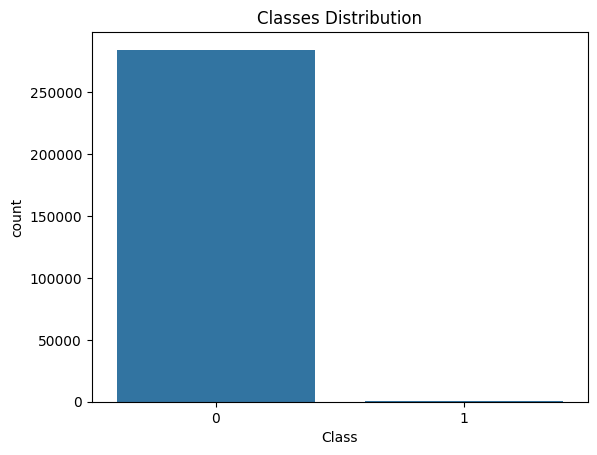

# **Rayan International AI Contest**

<font color='blue' style='font-family: "Times New Roman", Times, serif; font-size: 24px;'><strong>Machine Learning & Deep Learning Course </strong></font>

<font color='blue' style='font-family: "Times New Roman", Times, serif; font-size: 20px;'><em>**Homework 1** || **Title**: Introduction to Machine Learning</em></font>


# Credit Card Fraud Detection

This dataset presents transactions that occurred in two days, where we have 492 frauds out of 284,807 transactions. The dataset is highly unbalanced, the positive class (frauds) account for 0.172% of all transactions.


## Importing Libraries


```python
!pip install matplotlib==3.9.1
!pip install matplotlib-inline==0.1.7
!pip install scikit-learn==1.5.1
!pip install scikit-plot==0.3.7
!pip install scipy==1.11.4
!pip install seaborn==0.13.2
!pip install numpy==1.26.4
!pip install opencv-python==4.10.0.84
!pip install pandas==2.2.2
!pip install kaggle==1.6.17
```

    Requirement already satisfied: matplotlib==3.9.1 in /home/andre/code/AI/venv/lib/python3.11/site-packages (3.9.1)
    Requirement already satisfied: contourpy>=1.0.1 in /home/andre/code/AI/venv/lib/python3.11/site-packages (from matplotlib==3.9.1) (1.2.1)
    Requirement already satisfied: cycler>=0.10 in /home/andre/code/AI/venv/lib/python3.11/site-packages (from matplotlib==3.9.1) (0.12.1)
    Requirement already satisfied: fonttools>=4.22.0 in /home/andre/code/AI/venv/lib/python3.11/site-packages (from matplotlib==3.9.1) (4.53.1)
    Requirement already satisfied: kiwisolver>=1.3.1 in /home/andre/code/AI/venv/lib/python3.11/site-packages (from matplotlib==3.9.1) (1.4.5)
    Requirement already satisfied: numpy>=1.23 in /home/andre/code/AI/venv/lib/python3.11/site-packages (from matplotlib==3.9.1) (1.26.4)
    Requirement already satisfied: packaging>=20.0 in /home/andre/code/AI/venv/lib/python3.11/site-packages (from matplotlib==3.9.1) (24.1)
    Requirement already satisfied: pillow>=8 in /home/andre/code/AI/venv/lib/python3.11/site-packages (from matplotlib==3.9.1) (10.4.0)
    Requirement already satisfied: pyparsing>=2.3.1 in /home/andre/code/AI/venv/lib/python3.11/site-packages (from matplotlib==3.9.1) (3.1.2)
    Requirement already satisfied: python-dateutil>=2.7 in /home/andre/code/AI/venv/lib/python3.11/site-packages (from matplotlib==3.9.1) (2.9.0.post0)
    Requirement already satisfied: six>=1.5 in /home/andre/code/AI/venv/lib/python3.11/site-packages (from python-dateutil>=2.7->matplotlib==3.9.1) (1.16.0)
    Requirement already satisfied: matplotlib-inline==0.1.7 in /home/andre/code/AI/venv/lib/python3.11/site-packages (0.1.7)
    Requirement already satisfied: traitlets in /home/andre/code/AI/venv/lib/python3.11/site-packages (from matplotlib-inline==0.1.7) (5.14.3)
    Requirement already satisfied: scikit-learn==1.5.1 in /home/andre/code/AI/venv/lib/python3.11/site-packages (1.5.1)
    Requirement already satisfied: numpy>=1.19.5 in /home/andre/code/AI/venv/lib/python3.11/site-packages (from scikit-learn==1.5.1) (1.26.4)
    Requirement already satisfied: scipy>=1.6.0 in /home/andre/code/AI/venv/lib/python3.11/site-packages (from scikit-learn==1.5.1) (1.11.4)
    Requirement already satisfied: joblib>=1.2.0 in /home/andre/code/AI/venv/lib/python3.11/site-packages (from scikit-learn==1.5.1) (1.4.2)
    Requirement already satisfied: threadpoolctl>=3.1.0 in /home/andre/code/AI/venv/lib/python3.11/site-packages (from scikit-learn==1.5.1) (3.5.0)
    Requirement already satisfied: scikit-plot==0.3.7 in /home/andre/code/AI/venv/lib/python3.11/site-packages (0.3.7)
    Requirement already satisfied: matplotlib>=1.4.0 in /home/andre/code/AI/venv/lib/python3.11/site-packages (from scikit-plot==0.3.7) (3.9.1)
    Requirement already satisfied: scikit-learn>=0.18 in /home/andre/code/AI/venv/lib/python3.11/site-packages (from scikit-plot==0.3.7) (1.5.1)
    Requirement already satisfied: scipy>=0.9 in /home/andre/code/AI/venv/lib/python3.11/site-packages (from scikit-plot==0.3.7) (1.11.4)
    Requirement already satisfied: joblib>=0.10 in /home/andre/code/AI/venv/lib/python3.11/site-packages (from scikit-plot==0.3.7) (1.4.2)
    Requirement already satisfied: contourpy>=1.0.1 in /home/andre/code/AI/venv/lib/python3.11/site-packages (from matplotlib>=1.4.0->scikit-plot==0.3.7) (1.2.1)
    Requirement already satisfied: cycler>=0.10 in /home/andre/code/AI/venv/lib/python3.11/site-packages (from matplotlib>=1.4.0->scikit-plot==0.3.7) (0.12.1)
    Requirement already satisfied: fonttools>=4.22.0 in /home/andre/code/AI/venv/lib/python3.11/site-packages (from matplotlib>=1.4.0->scikit-plot==0.3.7) (4.53.1)
    Requirement already satisfied: kiwisolver>=1.3.1 in /home/andre/code/AI/venv/lib/python3.11/site-packages (from matplotlib>=1.4.0->scikit-plot==0.3.7) (1.4.5)
    Requirement already satisfied: numpy>=1.23 in /home/andre/code/AI/venv/lib/python3.11/site-packages (from matplotlib>=1.4.0->scikit-plot==0.3.7) (1.26.4)
    Requirement already satisfied: packaging>=20.0 in /home/andre/code/AI/venv/lib/python3.11/site-packages (from matplotlib>=1.4.0->scikit-plot==0.3.7) (24.1)
    Requirement already satisfied: pillow>=8 in /home/andre/code/AI/venv/lib/python3.11/site-packages (from matplotlib>=1.4.0->scikit-plot==0.3.7) (10.4.0)
    Requirement already satisfied: pyparsing>=2.3.1 in /home/andre/code/AI/venv/lib/python3.11/site-packages (from matplotlib>=1.4.0->scikit-plot==0.3.7) (3.1.2)
    Requirement already satisfied: python-dateutil>=2.7 in /home/andre/code/AI/venv/lib/python3.11/site-packages (from matplotlib>=1.4.0->scikit-plot==0.3.7) (2.9.0.post0)
    Requirement already satisfied: threadpoolctl>=3.1.0 in /home/andre/code/AI/venv/lib/python3.11/site-packages (from scikit-learn>=0.18->scikit-plot==0.3.7) (3.5.0)
    Requirement already satisfied: six>=1.5 in /home/andre/code/AI/venv/lib/python3.11/site-packages (from python-dateutil>=2.7->matplotlib>=1.4.0->scikit-plot==0.3.7) (1.16.0)
    Requirement already satisfied: scipy==1.11.4 in /home/andre/code/AI/venv/lib/python3.11/site-packages (1.11.4)
    Requirement already satisfied: numpy<1.28.0,>=1.21.6 in /home/andre/code/AI/venv/lib/python3.11/site-packages (from scipy==1.11.4) (1.26.4)
    Requirement already satisfied: seaborn==0.13.2 in /home/andre/code/AI/venv/lib/python3.11/site-packages (0.13.2)
    Requirement already satisfied: numpy!=1.24.0,>=1.20 in /home/andre/code/AI/venv/lib/python3.11/site-packages (from seaborn==0.13.2) (1.26.4)
    Requirement already satisfied: pandas>=1.2 in /home/andre/code/AI/venv/lib/python3.11/site-packages (from seaborn==0.13.2) (2.2.2)
    Requirement already satisfied: matplotlib!=3.6.1,>=3.4 in /home/andre/code/AI/venv/lib/python3.11/site-packages (from seaborn==0.13.2) (3.9.1)
    Requirement already satisfied: contourpy>=1.0.1 in /home/andre/code/AI/venv/lib/python3.11/site-packages (from matplotlib!=3.6.1,>=3.4->seaborn==0.13.2) (1.2.1)
    Requirement already satisfied: cycler>=0.10 in /home/andre/code/AI/venv/lib/python3.11/site-packages (from matplotlib!=3.6.1,>=3.4->seaborn==0.13.2) (0.12.1)
    Requirement already satisfied: fonttools>=4.22.0 in /home/andre/code/AI/venv/lib/python3.11/site-packages (from matplotlib!=3.6.1,>=3.4->seaborn==0.13.2) (4.53.1)
    Requirement already satisfied: kiwisolver>=1.3.1 in /home/andre/code/AI/venv/lib/python3.11/site-packages (from matplotlib!=3.6.1,>=3.4->seaborn==0.13.2) (1.4.5)
    Requirement already satisfied: packaging>=20.0 in /home/andre/code/AI/venv/lib/python3.11/site-packages (from matplotlib!=3.6.1,>=3.4->seaborn==0.13.2) (24.1)
    Requirement already satisfied: pillow>=8 in /home/andre/code/AI/venv/lib/python3.11/site-packages (from matplotlib!=3.6.1,>=3.4->seaborn==0.13.2) (10.4.0)
    Requirement already satisfied: pyparsing>=2.3.1 in /home/andre/code/AI/venv/lib/python3.11/site-packages (from matplotlib!=3.6.1,>=3.4->seaborn==0.13.2) (3.1.2)
    Requirement already satisfied: python-dateutil>=2.7 in /home/andre/code/AI/venv/lib/python3.11/site-packages (from matplotlib!=3.6.1,>=3.4->seaborn==0.13.2) (2.9.0.post0)
    Requirement already satisfied: pytz>=2020.1 in /home/andre/code/AI/venv/lib/python3.11/site-packages (from pandas>=1.2->seaborn==0.13.2) (2024.1)
    Requirement already satisfied: tzdata>=2022.7 in /home/andre/code/AI/venv/lib/python3.11/site-packages (from pandas>=1.2->seaborn==0.13.2) (2024.1)
    Requirement already satisfied: six>=1.5 in /home/andre/code/AI/venv/lib/python3.11/site-packages (from python-dateutil>=2.7->matplotlib!=3.6.1,>=3.4->seaborn==0.13.2) (1.16.0)
    Requirement already satisfied: numpy==1.26.4 in /home/andre/code/AI/venv/lib/python3.11/site-packages (1.26.4)
    Requirement already satisfied: opencv-python==4.10.0.84 in /home/andre/code/AI/venv/lib/python3.11/site-packages (4.10.0.84)
    Requirement already satisfied: numpy>=1.21.2 in /home/andre/code/AI/venv/lib/python3.11/site-packages (from opencv-python==4.10.0.84) (1.26.4)
    Requirement already satisfied: pandas==2.2.2 in /home/andre/code/AI/venv/lib/python3.11/site-packages (2.2.2)
    Requirement already satisfied: numpy>=1.23.2 in /home/andre/code/AI/venv/lib/python3.11/site-packages (from pandas==2.2.2) (1.26.4)
    Requirement already satisfied: python-dateutil>=2.8.2 in /home/andre/code/AI/venv/lib/python3.11/site-packages (from pandas==2.2.2) (2.9.0.post0)
    Requirement already satisfied: pytz>=2020.1 in /home/andre/code/AI/venv/lib/python3.11/site-packages (from pandas==2.2.2) (2024.1)
    Requirement already satisfied: tzdata>=2022.7 in /home/andre/code/AI/venv/lib/python3.11/site-packages (from pandas==2.2.2) (2024.1)
    Requirement already satisfied: six>=1.5 in /home/andre/code/AI/venv/lib/python3.11/site-packages (from python-dateutil>=2.8.2->pandas==2.2.2) (1.16.0)
    Requirement already satisfied: kaggle==1.6.17 in /home/andre/code/AI/venv/lib/python3.11/site-packages (1.6.17)
    Requirement already satisfied: bleach in /home/andre/code/AI/venv/lib/python3.11/site-packages (from kaggle==1.6.17) (6.1.0)
    Requirement already satisfied: certifi>=2023.7.22 in /home/andre/code/AI/venv/lib/python3.11/site-packages (from kaggle==1.6.17) (2024.7.4)
    Requirement already satisfied: python-dateutil in /home/andre/code/AI/venv/lib/python3.11/site-packages (from kaggle==1.6.17) (2.9.0.post0)
    Requirement already satisfied: python-slugify in /home/andre/code/AI/venv/lib/python3.11/site-packages (from kaggle==1.6.17) (8.0.4)
    Requirement already satisfied: requests in /home/andre/code/AI/venv/lib/python3.11/site-packages (from kaggle==1.6.17) (2.32.3)
    Requirement already satisfied: six>=1.10 in /home/andre/code/AI/venv/lib/python3.11/site-packages (from kaggle==1.6.17) (1.16.0)
    Requirement already satisfied: tqdm in /home/andre/code/AI/venv/lib/python3.11/site-packages (from kaggle==1.6.17) (4.66.4)
    Requirement already satisfied: urllib3 in /home/andre/code/AI/venv/lib/python3.11/site-packages (from kaggle==1.6.17) (2.2.2)
    Requirement already satisfied: webencodings in /home/andre/code/AI/venv/lib/python3.11/site-packages (from bleach->kaggle==1.6.17) (0.5.1)
    Requirement already satisfied: text-unidecode>=1.3 in /home/andre/code/AI/venv/lib/python3.11/site-packages (from python-slugify->kaggle==1.6.17) (1.3)
    Requirement already satisfied: charset-normalizer<4,>=2 in /home/andre/code/AI/venv/lib/python3.11/site-packages (from requests->kaggle==1.6.17) (3.3.2)
    Requirement already satisfied: idna<4,>=2.5 in /home/andre/code/AI/venv/lib/python3.11/site-packages (from requests->kaggle==1.6.17) (3.7)


```python
from sklearn.svm import SVC
from sklearn.linear_model import LogisticRegression
from sklearn.model_selection import train_test_split
from sklearn.metrics import classification_report, confusion_matrix, roc_auc_score, roc_curve
import numpy as np
import pandas as pd
import seaborn as sns
import matplotlib.pyplot as plt
from imblearn.over_sampling import SMOTE
import scikitplot as skplt
from sklearn.preprocessing import StandardScaler, RobustScaler
from sklearn.cluster import KMeans
import cv2

```

## Load Dataset


```python
# Dataset Link: https://www.kaggle.com/datasets/mojtabanafez/rayan-homework1/data
![ ! -f rayan-homework1.zip ] && kaggle datasets download -d mojtabanafez/rayan-homework1
```


```python
![ ! -f creditcard.csv ] && unzip ./rayan-homework1.zip
```


```python
df = pd.read_csv('./creditcard.csv')
df.head(5)
```


<div>
<style scoped>
    .dataframe tbody tr th:only-of-type {
        vertical-align: middle;
    }

    .dataframe tbody tr th {
        vertical-align: top;
    }

    .dataframe thead th {
        text-align: right;
    }
</style>
<table border="1" class="dataframe">
  <thead>
    <tr style="text-align: right;">
      <th></th>
      <th>Time</th>
      <th>V1</th>
      <th>V2</th>
      <th>V3</th>
      <th>V4</th>
      <th>V5</th>
      <th>V6</th>
      <th>V7</th>
      <th>V8</th>
      <th>V9</th>
      <th>...</th>
      <th>V21</th>
      <th>V22</th>
      <th>V23</th>
      <th>V24</th>
      <th>V25</th>
      <th>V26</th>
      <th>V27</th>
      <th>V28</th>
      <th>Amount</th>
      <th>Class</th>
    </tr>
  </thead>
  <tbody>
    <tr>
      <th>0</th>
      <td>0.0</td>
      <td>-1.359807</td>
      <td>-0.072781</td>
      <td>2.536347</td>
      <td>1.378155</td>
      <td>-0.338321</td>
      <td>0.462388</td>
      <td>0.239599</td>
      <td>0.098698</td>
      <td>0.363787</td>
      <td>...</td>
      <td>-0.018307</td>
      <td>0.277838</td>
      <td>-0.110474</td>
      <td>0.066928</td>
      <td>0.128539</td>
      <td>-0.189115</td>
      <td>0.133558</td>
      <td>-0.021053</td>
      <td>149.62</td>
      <td>0</td>
    </tr>
    <tr>
      <th>1</th>
      <td>0.0</td>
      <td>1.191857</td>
      <td>0.266151</td>
      <td>0.166480</td>
      <td>0.448154</td>
      <td>0.060018</td>
      <td>-0.082361</td>
      <td>-0.078803</td>
      <td>0.085102</td>
      <td>-0.255425</td>
      <td>...</td>
      <td>-0.225775</td>
      <td>-0.638672</td>
      <td>0.101288</td>
      <td>-0.339846</td>
      <td>0.167170</td>
      <td>0.125895</td>
      <td>-0.008983</td>
      <td>0.014724</td>
      <td>2.69</td>
      <td>0</td>
    </tr>
    <tr>
      <th>2</th>
      <td>1.0</td>
      <td>-1.358354</td>
      <td>-1.340163</td>
      <td>1.773209</td>
      <td>0.379780</td>
      <td>-0.503198</td>
      <td>1.800499</td>
      <td>0.791461</td>
      <td>0.247676</td>
      <td>-1.514654</td>
      <td>...</td>
      <td>0.247998</td>
      <td>0.771679</td>
      <td>0.909412</td>
      <td>-0.689281</td>
      <td>-0.327642</td>
      <td>-0.139097</td>
      <td>-0.055353</td>
      <td>-0.059752</td>
      <td>378.66</td>
      <td>0</td>
    </tr>
    <tr>
      <th>3</th>
      <td>1.0</td>
      <td>-0.966272</td>
      <td>-0.185226</td>
      <td>1.792993</td>
      <td>-0.863291</td>
      <td>-0.010309</td>
      <td>1.247203</td>
      <td>0.237609</td>
      <td>0.377436</td>
      <td>-1.387024</td>
      <td>...</td>
      <td>-0.108300</td>
      <td>0.005274</td>
      <td>-0.190321</td>
      <td>-1.175575</td>
      <td>0.647376</td>
      <td>-0.221929</td>
      <td>0.062723</td>
      <td>0.061458</td>
      <td>123.50</td>
      <td>0</td>
    </tr>
    <tr>
      <th>4</th>
      <td>2.0</td>
      <td>-1.158233</td>
      <td>0.877737</td>
      <td>1.548718</td>
      <td>0.403034</td>
      <td>-0.407193</td>
      <td>0.095921</td>
      <td>0.592941</td>
      <td>-0.270533</td>
      <td>0.817739</td>
      <td>...</td>
      <td>-0.009431</td>
      <td>0.798278</td>
      <td>-0.137458</td>
      <td>0.141267</td>
      <td>-0.206010</td>
      <td>0.502292</td>
      <td>0.219422</td>
      <td>0.215153</td>
      <td>69.99</td>
      <td>0</td>
    </tr>
  </tbody>
</table>
<p>5 rows × 31 columns</p>
</div>


```python
# Separate features and target variable
X = df.drop('Class', axis=1)
y = df['Class']
X.shape, y.shape
```


    ((284807, 30), (284807,))


```python
X_train, X_test, y_train, y_test = train_test_split(X, y, test_size=0.3, random_state=42)
```


```python
print(X_train)
print(y_train)
```

                Time        V1        V2        V3        V4        V5        V6  \
    2557      2105.0 -2.289565 -0.480260  0.818685 -1.706423  0.822102 -1.660326   
    247823  153702.0 -0.313717 -4.064342 -3.398445  0.704011  0.101662  1.529848   
    152342   97283.0 -1.809763 -0.567439  2.265186 -0.960318 -1.212537  1.516493   
    103385   68628.0  1.192319  0.178575  0.141491  0.459628 -0.049959 -0.112122   
    8771     11951.0 -0.963451  0.700311  1.097333 -1.547626  0.669966  0.513533   
    ...          ...       ...       ...       ...       ...       ...       ...   
    119879   75618.0  1.173488  0.100792  0.490512  0.461596 -0.296377 -0.213165   
    259178  159000.0 -0.775981  0.144023 -1.142399 -1.241113  1.940358  3.912076   
    131932   79795.0 -0.146609  0.992946  1.524591  0.485774  0.349308 -0.815198   
    146867   87931.0 -2.948638  2.354849 -2.521201 -3.798905  1.866302  2.727695   
    121958   76381.0  1.233174 -0.784851  0.386784 -0.698559 -1.034018 -0.637028   
    
                  V7        V8        V9  ...       V20       V21       V22  \
    2557    0.944047 -0.541765  1.323156  ... -0.831985 -0.210837  0.914737   
    247823  1.551670 -0.036774  0.015829  ...  2.142593  0.853186 -0.091941   
    152342 -1.417176  0.903421  1.961027  ... -0.554004 -0.509915 -0.424978   
    103385 -0.163883  0.155740 -0.067566  ... -0.149985 -0.240464 -0.739862   
    8771    0.333683  0.270900  1.381880  ...  0.122458 -0.279519 -0.470181   
    ...          ...       ...       ...  ...       ...       ...       ...   
    119879 -0.165254  0.119221 -0.114199  ... -0.157534 -0.186027 -0.574283   
    259178 -0.466107  1.360620  0.400697  ... -0.295730  0.037078 -0.019575   
    131932  1.076640 -0.395316 -0.491303  ...  0.007155  0.052649  0.354089   
    146867 -0.471769  2.217537  0.580199  ...  0.417396 -0.332759 -1.047514   
    121958 -0.502369 -0.188057 -0.749637  ...  0.337732  0.027634 -0.234522   
    
                 V23       V24       V25       V26       V27       V28   Amount  
    2557    0.867888  0.422969  0.310584 -0.781488  0.392241 -0.147757     1.00  
    247823 -0.936215 -0.833081 -0.498728  0.651183 -0.290331  0.110360  1194.28  
    152342 -0.268621  0.010121  0.466862  0.835540 -0.062385  0.088079    75.00  
    103385  0.116799 -0.373837  0.125470  0.130126 -0.016956  0.011937     1.98  
    8771   -0.124037 -1.388839 -0.237453  0.785347  0.349708  0.216207    37.31  
    ...          ...       ...       ...       ...       ...       ...      ...  
    119879  0.161405 -0.006140  0.091444  0.109235 -0.020922  0.003967     1.98  
    259178  0.241830  0.682820 -1.635109 -0.770941  0.066006  0.137056    89.23  
    131932 -0.291198  0.402849  0.237383 -0.398467 -0.121139 -0.196195     3.94  
    146867  0.143326  0.678869  0.319710  0.426309  0.496912  0.335822     1.00  
    121958 -0.059544 -0.109073  0.290326 -0.393074  0.001217  0.038588   113.00  
    
    [199364 rows x 30 columns]
    2557      0
    247823    0
    152342    0
    103385    0
    8771      0
             ..
    119879    0
    259178    0
    131932    0
    146867    0
    121958    0
    Name: Class, Length: 199364, dtype: int64


```python
import warnings
warnings.filterwarnings('ignore')
```

## Exploratory Data Analysis (EDA)


**Student Task:**
1. Check Summary Statistics for the Dataset
2. Visualize Distribution of Classes
3. Check Correlation Matrix
4. Plot the Distribution of Some Selected Features
5. Additional Analysis (Choose at Least 5)
    * Example: Data Visualization (After Dimension Reduction), Outlier Detection, Feature Engineering, Insightful Plots, ...


```python
# ### 2.1 Summary Statistics
# Display summary statistics for the dataset
######################################################
###################### TO DO #########################
######################################################
df.describe()
######################################################
######################################################
######################################################
```


<div>
<style scoped>
    .dataframe tbody tr th:only-of-type {
        vertical-align: middle;
    }

    .dataframe tbody tr th {
        vertical-align: top;
    }

    .dataframe thead th {
        text-align: right;
    }
</style>
<table border="1" class="dataframe">
  <thead>
    <tr style="text-align: right;">
      <th></th>
      <th>Time</th>
      <th>V1</th>
      <th>V2</th>
      <th>V3</th>
      <th>V4</th>
      <th>V5</th>
      <th>V6</th>
      <th>V7</th>
      <th>V8</th>
      <th>V9</th>
      <th>...</th>
      <th>V21</th>
      <th>V22</th>
      <th>V23</th>
      <th>V24</th>
      <th>V25</th>
      <th>V26</th>
      <th>V27</th>
      <th>V28</th>
      <th>Amount</th>
      <th>Class</th>
    </tr>
  </thead>
  <tbody>
    <tr>
      <th>count</th>
      <td>284807.000000</td>
      <td>2.848070e+05</td>
      <td>2.848070e+05</td>
      <td>2.848070e+05</td>
      <td>2.848070e+05</td>
      <td>2.848070e+05</td>
      <td>2.848070e+05</td>
      <td>2.848070e+05</td>
      <td>2.848070e+05</td>
      <td>2.848070e+05</td>
      <td>...</td>
      <td>2.848070e+05</td>
      <td>2.848070e+05</td>
      <td>2.848070e+05</td>
      <td>2.848070e+05</td>
      <td>2.848070e+05</td>
      <td>2.848070e+05</td>
      <td>2.848070e+05</td>
      <td>2.848070e+05</td>
      <td>284807.000000</td>
      <td>284807.000000</td>
    </tr>
    <tr>
      <th>mean</th>
      <td>94813.859575</td>
      <td>1.168375e-15</td>
      <td>3.416908e-16</td>
      <td>-1.379537e-15</td>
      <td>2.074095e-15</td>
      <td>9.604066e-16</td>
      <td>1.487313e-15</td>
      <td>-5.556467e-16</td>
      <td>1.213481e-16</td>
      <td>-2.406331e-15</td>
      <td>...</td>
      <td>1.654067e-16</td>
      <td>-3.568593e-16</td>
      <td>2.578648e-16</td>
      <td>4.473266e-15</td>
      <td>5.340915e-16</td>
      <td>1.683437e-15</td>
      <td>-3.660091e-16</td>
      <td>-1.227390e-16</td>
      <td>88.349619</td>
      <td>0.001727</td>
    </tr>
    <tr>
      <th>std</th>
      <td>47488.145955</td>
      <td>1.958696e+00</td>
      <td>1.651309e+00</td>
      <td>1.516255e+00</td>
      <td>1.415869e+00</td>
      <td>1.380247e+00</td>
      <td>1.332271e+00</td>
      <td>1.237094e+00</td>
      <td>1.194353e+00</td>
      <td>1.098632e+00</td>
      <td>...</td>
      <td>7.345240e-01</td>
      <td>7.257016e-01</td>
      <td>6.244603e-01</td>
      <td>6.056471e-01</td>
      <td>5.212781e-01</td>
      <td>4.822270e-01</td>
      <td>4.036325e-01</td>
      <td>3.300833e-01</td>
      <td>250.120109</td>
      <td>0.041527</td>
    </tr>
    <tr>
      <th>min</th>
      <td>0.000000</td>
      <td>-5.640751e+01</td>
      <td>-7.271573e+01</td>
      <td>-4.832559e+01</td>
      <td>-5.683171e+00</td>
      <td>-1.137433e+02</td>
      <td>-2.616051e+01</td>
      <td>-4.355724e+01</td>
      <td>-7.321672e+01</td>
      <td>-1.343407e+01</td>
      <td>...</td>
      <td>-3.483038e+01</td>
      <td>-1.093314e+01</td>
      <td>-4.480774e+01</td>
      <td>-2.836627e+00</td>
      <td>-1.029540e+01</td>
      <td>-2.604551e+00</td>
      <td>-2.256568e+01</td>
      <td>-1.543008e+01</td>
      <td>0.000000</td>
      <td>0.000000</td>
    </tr>
    <tr>
      <th>25%</th>
      <td>54201.500000</td>
      <td>-9.203734e-01</td>
      <td>-5.985499e-01</td>
      <td>-8.903648e-01</td>
      <td>-8.486401e-01</td>
      <td>-6.915971e-01</td>
      <td>-7.682956e-01</td>
      <td>-5.540759e-01</td>
      <td>-2.086297e-01</td>
      <td>-6.430976e-01</td>
      <td>...</td>
      <td>-2.283949e-01</td>
      <td>-5.423504e-01</td>
      <td>-1.618463e-01</td>
      <td>-3.545861e-01</td>
      <td>-3.171451e-01</td>
      <td>-3.269839e-01</td>
      <td>-7.083953e-02</td>
      <td>-5.295979e-02</td>
      <td>5.600000</td>
      <td>0.000000</td>
    </tr>
    <tr>
      <th>50%</th>
      <td>84692.000000</td>
      <td>1.810880e-02</td>
      <td>6.548556e-02</td>
      <td>1.798463e-01</td>
      <td>-1.984653e-02</td>
      <td>-5.433583e-02</td>
      <td>-2.741871e-01</td>
      <td>4.010308e-02</td>
      <td>2.235804e-02</td>
      <td>-5.142873e-02</td>
      <td>...</td>
      <td>-2.945017e-02</td>
      <td>6.781943e-03</td>
      <td>-1.119293e-02</td>
      <td>4.097606e-02</td>
      <td>1.659350e-02</td>
      <td>-5.213911e-02</td>
      <td>1.342146e-03</td>
      <td>1.124383e-02</td>
      <td>22.000000</td>
      <td>0.000000</td>
    </tr>
    <tr>
      <th>75%</th>
      <td>139320.500000</td>
      <td>1.315642e+00</td>
      <td>8.037239e-01</td>
      <td>1.027196e+00</td>
      <td>7.433413e-01</td>
      <td>6.119264e-01</td>
      <td>3.985649e-01</td>
      <td>5.704361e-01</td>
      <td>3.273459e-01</td>
      <td>5.971390e-01</td>
      <td>...</td>
      <td>1.863772e-01</td>
      <td>5.285536e-01</td>
      <td>1.476421e-01</td>
      <td>4.395266e-01</td>
      <td>3.507156e-01</td>
      <td>2.409522e-01</td>
      <td>9.104512e-02</td>
      <td>7.827995e-02</td>
      <td>77.165000</td>
      <td>0.000000</td>
    </tr>
    <tr>
      <th>max</th>
      <td>172792.000000</td>
      <td>2.454930e+00</td>
      <td>2.205773e+01</td>
      <td>9.382558e+00</td>
      <td>1.687534e+01</td>
      <td>3.480167e+01</td>
      <td>7.330163e+01</td>
      <td>1.205895e+02</td>
      <td>2.000721e+01</td>
      <td>1.559499e+01</td>
      <td>...</td>
      <td>2.720284e+01</td>
      <td>1.050309e+01</td>
      <td>2.252841e+01</td>
      <td>4.584549e+00</td>
      <td>7.519589e+00</td>
      <td>3.517346e+00</td>
      <td>3.161220e+01</td>
      <td>3.384781e+01</td>
      <td>25691.160000</td>
      <td>1.000000</td>
    </tr>
  </tbody>
</table>
<p>8 rows × 31 columns</p>
</div>


```python
# ### 2.2 Class Distribution
# Visualize the class distribution
######################################################
###################### TO DO #########################
######################################################
sns.countplot(x='Class', data=df)
plt.title('Classes Distribution')
plt.show()
######################################################
######################################################
######################################################
```


    

    


```python
# Display the class distribution in percentages
######################################################
###################### TO DO #########################
######################################################
class_distribution = df['Class'].value_counts(normalize=True) * 100
class_distribution.name = 'proportion'
print("Class Distribution:")
print(class_distribution)
######################################################
######################################################
######################################################
```

    Class Distribution:
    Class
    0    99.827251
    1     0.172749
    Name: proportion, dtype: float64


```python
# ### 2.3 Correlation Matrix
# Compute the correlation matrix
######################################################
###################### TO DO #########################
######################################################
corr_matrix = df.corr()

plt.figure(figsize=(12, 10))
sns.heatmap(corr_matrix, 
            cmap='coolwarm', 
            linewidths=.5)
plt.title('Correlation Matrix')
plt.show()
######################################################
######################################################
######################################################
```


    

    


```python
# ### 2.4 Feature Distributions
# Plot the distribution of a few selected features
######################################################
###################### TO DO #########################
######################################################
features = ['Amount', 'Time', 'V2', 'V3', 'V4', 'V5']

sns.set(style="white")
plt.rcParams['axes.edgecolor'] = 'black'
plt.rcParams['axes.linewidth'] = 0.5

for feature in features:
    plt.figure(figsize=(8, 4))
    sns.histplot(data=df, x=feature, bins=50, edgecolor='black', kde=True, color='steelblue')
    plt.title(f'Distribution of {feature}')    
    plt.show()
######################################################
######################################################
######################################################

```


    

    


    

    


    

    


    

    


    

    


    

    


```python
##########################################################
### You can add more creative analysis to learn more...###
##########################################################
# LOL I have no idea :D. Hmmm... lets play
plt.figure(figsize=(10, 8))
corr_matrix = df[features].corr()
sns.heatmap(corr_matrix, annot=True, fmt='.2f', cmap='coolwarm', cbar=True, linewidths=0.5)
plt.title('Correlation Heatmap of Features')
plt.show()

##########################################################

df_log_transformed = df[features].apply(lambda x: np.log1p(x))
df_log_transformed.hist(bins=50, figsize=(9, 9), edgecolor='black')
plt.suptitle('Log Transformed Feature Distributions')
plt.show()
##########################################################
##########################################################
##########################################################
```


    

    


    

    


I add two these below block codes from solution also. 


```python
from sklearn.decomposition import PCA

# Standardize the features
scaler = StandardScaler()
X_scaled = scaler.fit_transform(X)
# Apply PCA
pca = PCA(n_components=2)  # Reduce to 2 components for visualization
principal_components = pca.fit_transform(X_scaled)

# Create a DataFrame with the principal components
pca_df = pd.DataFrame(data=principal_components, columns=['PC1', 'PC2'])
pca_df['class'] = y.values
# Plot the principal components
plt.figure(figsize=(8, 6))
plt.scatter(pca_df[pca_df['class'] == 0]['PC1'], pca_df[pca_df['class'] == 0]['PC2'], label='Class 0')
plt.scatter(pca_df[pca_df['class'] == 1]['PC1'], pca_df[pca_df['class'] == 1]['PC2'], label='Class 1')
plt.xlabel('Principal Component 1')
plt.ylabel('Principal Component 2')
plt.title('PCA of Dataset')
plt.legend()
plt.show()

```


    

    


```python
# Outlier detection

# Z-score calculation
from scipy.stats import zscore

# Standardize the features
scaler = StandardScaler()
X_scaled = scaler.fit_transform(X)

z_scores = np.abs(zscore(X_scaled))
outliers = np.where(z_scores > 10)  # Threshold is X standard deviations

print(outliers[0].shape, outliers[1].shape)
print("Outliers detected using Z-score:", outliers)
```

    (4530,) (4530,)
    Outliers detected using Z-score: (array([   164,    164,   1158, ..., 284249, 284393, 284448]), array([20, 29, 10, ..., 29, 28, 28]))


## Student Question

1. Describe at least two major challenges in the dataset based on your EDA findings.
2. Analyze the correlation matrix of the features.
3. Is your data linearly separable? Please provide a rationale.

  **Student Answer:**  
  <font size="5" color="green">
  -  The first challenge is dataset is not balance. The number of 0 is more than 1.
  
     The second challenge is most of the features have a little effect on `class` based on confusion matrix.

     The third one is the distribution of data's are in different rages that need to be normalized.

<hr>

  -  Most features have low correlation with `class`

     Some features show a high correlation; For example, V2 and V3 have a strong negative correlation.

<hr>

  -  No! Because of the low correlation between features and the target and the high degree of class imbalance.

  </font>

## Solution Answers

1. Describe at least two major challenges in the dataset based on your EDA findings.
> 1. Dataset is imbalance
> 2. Features are not in the same scale   
2. Analyze the correlation matrix of the features.
> The correlation matrix illustrates the correlation of each feature with the label and with each other. In this case, the label has the highest correlation with feature v11 and the lowest correlation with feature v17. Additionally, normalizing the feature scale could potentially result in a different correlation matrix.

3. Is your data linearly separable? Please provide a rationale.
> No, there are reasons for this: Logistic regression is a linear model and in the following sections, it doesn't completely fit the data. Additionally, you can use PCA to reduce the dimensionality and visualize the data.

## Data Preprocessing

Based on the challenges you've identified, recommend preprocessing methods to use during training to enhance model performance.

Some popular preprocessing techniques you can search about and learn include:

* Data Cleaning (Outlier Detection and Treatment, Handling Missing testues, ...)
* Data Transformation (Normalization, Standardization, ...)
* Feature Engineering (Feature Creation, Feature Selection, ...)
* Data Reduction (Dimensionality Reduction, Sampling, ...)
* Resampling Techniques (Oversampling or Undersampling)
* Handling Imbalanced Data
* ...


```python
######################################################
###################### TO DO #########################
######################################################

# Outlier Detection and Treatment
# Use Robust Scaler to handle outliers
robust_scaler = RobustScaler()
X_scaled = robust_scaler.fit_transform(X)

# Handling Missing Values
df.fillna(df.median(), inplace=True)

######################################################
######################################################
######################################################
```


```python
######################################################
###################### TO DO #########################
######################################################

# Data Transformation
# Using MinMaxScaler for normalization
from sklearn.preprocessing import MinMaxScaler

scaler = MinMaxScaler()
X_normalized = scaler.fit_transform(X)

# Standardization
# Using StandardScaler for standardization
scaler = StandardScaler()
X_standardized = scaler.fit_transform(X)

######################################################
######################################################
######################################################
```


```python
##########################################################
#You can add more creative preprocessing to learn more...#
##########################################################

# Feature Selection
from sklearn.feature_selection import VarianceThreshold

selector = VarianceThreshold(threshold=0.1)
X_selected = selector.fit_transform(X)

##########################################################
##########################################################
##########################################################
```


```python
##########################################################
#You can add more creative preprocessing to learn more...#
##########################################################

# Data Reduction
# Using PCA for dimensionality reduction
from sklearn.decomposition import PCA

pca = PCA(n_components=2) # Choose the number of components
X_reduced = pca.fit_transform(X)

# Sampling
# Using train_test_split for sampling
X_train, X_sampled, y_train, y_sampled = train_test_split(X, y, test_size=0.1, random_state=42)

##########################################################
##########################################################
##########################################################
```


```python
##########################################################
#You can add more creative preprocessing to learn more...#
##########################################################

# Resampling Techniques
## Oversampling Using SMOTE
# Using SMOTE for oversampling
smote = SMOTE(random_state=42)
X_resampled, y_resampled = smote.fit_resample(X, y)

## Undersampling
from imblearn.under_sampling import RandomUnderSampler

under_sampler = RandomUnderSampler(random_state=42)
X_under, y_under = under_sampler.fit_resample(X, y)

##########################################################
##########################################################
##########################################################
```


```python
##########################################################
#You can add more creative preprocessing to learn more...#
##########################################################

# Handling Imbalanced Data
## Using Class Weights in Models
log_reg = LogisticRegression(class_weight='balanced')
log_reg.fit(X_train, y_train)

## Putting It All Together
from sklearn.pipeline import Pipeline
from sklearn.compose import ColumnTransformer

# Preprocessing steps
preprocessor = ColumnTransformer(
    transformers=[
        ('scaler', StandardScaler(), X.columns)
    ])

# Combine preprocessing and model
pipeline = Pipeline(steps=[
    ('preprocessor', preprocessor),
    ('classifier', LogisticRegression(class_weight='balanced'))
])

# Fit the model
pipeline.fit(X_train, y_train)

##########################################################
##########################################################
##########################################################
```


<style>#sk-container-id-1 {
  /* Definition of color scheme common for light and dark mode */
  --sklearn-color-text: black;
  --sklearn-color-line: gray;
  /* Definition of color scheme for unfitted estimators */
  --sklearn-color-unfitted-level-0: #fff5e6;
  --sklearn-color-unfitted-level-1: #f6e4d2;
  --sklearn-color-unfitted-level-2: #ffe0b3;
  --sklearn-color-unfitted-level-3: chocolate;
  /* Definition of color scheme for fitted estimators */
  --sklearn-color-fitted-level-0: #f0f8ff;
  --sklearn-color-fitted-level-1: #d4ebff;
  --sklearn-color-fitted-level-2: #b3dbfd;
  --sklearn-color-fitted-level-3: cornflowerblue;

  /* Specific color for light theme */
  --sklearn-color-text-on-default-background: var(--sg-text-color, var(--theme-code-foreground, var(--jp-content-font-color1, black)));
  --sklearn-color-background: var(--sg-background-color, var(--theme-background, var(--jp-layout-color0, white)));
  --sklearn-color-border-box: var(--sg-text-color, var(--theme-code-foreground, var(--jp-content-font-color1, black)));
  --sklearn-color-icon: #696969;

  @media (prefers-color-scheme: dark) {
    /* Redefinition of color scheme for dark theme */
    --sklearn-color-text-on-default-background: var(--sg-text-color, var(--theme-code-foreground, var(--jp-content-font-color1, white)));
    --sklearn-color-background: var(--sg-background-color, var(--theme-background, var(--jp-layout-color0, #111)));
    --sklearn-color-border-box: var(--sg-text-color, var(--theme-code-foreground, var(--jp-content-font-color1, white)));
    --sklearn-color-icon: #878787;
  }
}

#sk-container-id-1 {
  color: var(--sklearn-color-text);
}

#sk-container-id-1 pre {
  padding: 0;
}

#sk-container-id-1 input.sk-hidden--visually {
  border: 0;
  clip: rect(1px 1px 1px 1px);
  clip: rect(1px, 1px, 1px, 1px);
  height: 1px;
  margin: -1px;
  overflow: hidden;
  padding: 0;
  position: absolute;
  width: 1px;
}

#sk-container-id-1 div.sk-dashed-wrapped {
  border: 1px dashed var(--sklearn-color-line);
  margin: 0 0.4em 0.5em 0.4em;
  box-sizing: border-box;
  padding-bottom: 0.4em;
  background-color: var(--sklearn-color-background);
}

#sk-container-id-1 div.sk-container {
  /* jupyter's `normalize.less` sets `[hidden] { display: none; }`
     but bootstrap.min.css set `[hidden] { display: none !important; }`
     so we also need the `!important` here to be able to override the
     default hidden behavior on the sphinx rendered scikit-learn.org.
     See: https://github.com/scikit-learn/scikit-learn/issues/21755 */
  display: inline-block !important;
  position: relative;
}

#sk-container-id-1 div.sk-text-repr-fallback {
  display: none;
}

div.sk-parallel-item,
div.sk-serial,
div.sk-item {
  /* draw centered vertical line to link estimators */
  background-image: linear-gradient(var(--sklearn-color-text-on-default-background), var(--sklearn-color-text-on-default-background));
  background-size: 2px 100%;
  background-repeat: no-repeat;
  background-position: center center;
}

/* Parallel-specific style estimator block */

#sk-container-id-1 div.sk-parallel-item::after {
  content: "";
  width: 100%;
  border-bottom: 2px solid var(--sklearn-color-text-on-default-background);
  flex-grow: 1;
}

#sk-container-id-1 div.sk-parallel {
  display: flex;
  align-items: stretch;
  justify-content: center;
  background-color: var(--sklearn-color-background);
  position: relative;
}

#sk-container-id-1 div.sk-parallel-item {
  display: flex;
  flex-direction: column;
}

#sk-container-id-1 div.sk-parallel-item:first-child::after {
  align-self: flex-end;
  width: 50%;
}

#sk-container-id-1 div.sk-parallel-item:last-child::after {
  align-self: flex-start;
  width: 50%;
}

#sk-container-id-1 div.sk-parallel-item:only-child::after {
  width: 0;
}

/* Serial-specific style estimator block */

#sk-container-id-1 div.sk-serial {
  display: flex;
  flex-direction: column;
  align-items: center;
  background-color: var(--sklearn-color-background);
  padding-right: 1em;
  padding-left: 1em;
}


/* Toggleable style: style used for estimator/Pipeline/ColumnTransformer box that is
clickable and can be expanded/collapsed.
- Pipeline and ColumnTransformer use this feature and define the default style
- Estimators will overwrite some part of the style using the `sk-estimator` class
*/

/* Pipeline and ColumnTransformer style (default) */

#sk-container-id-1 div.sk-toggleable {
  /* Default theme specific background. It is overwritten whether we have a
  specific estimator or a Pipeline/ColumnTransformer */
  background-color: var(--sklearn-color-background);
}

/* Toggleable label */
#sk-container-id-1 label.sk-toggleable__label {
  cursor: pointer;
  display: block;
  width: 100%;
  margin-bottom: 0;
  padding: 0.5em;
  box-sizing: border-box;
  text-align: center;
}

#sk-container-id-1 label.sk-toggleable__label-arrow:before {
  /* Arrow on the left of the label */
  content: "▸";
  float: left;
  margin-right: 0.25em;
  color: var(--sklearn-color-icon);
}

#sk-container-id-1 label.sk-toggleable__label-arrow:hover:before {
  color: var(--sklearn-color-text);
}

/* Toggleable content - dropdown */

#sk-container-id-1 div.sk-toggleable__content {
  max-height: 0;
  max-width: 0;
  overflow: hidden;
  text-align: left;
  /* unfitted */
  background-color: var(--sklearn-color-unfitted-level-0);
}

#sk-container-id-1 div.sk-toggleable__content.fitted {
  /* fitted */
  background-color: var(--sklearn-color-fitted-level-0);
}

#sk-container-id-1 div.sk-toggleable__content pre {
  margin: 0.2em;
  border-radius: 0.25em;
  color: var(--sklearn-color-text);
  /* unfitted */
  background-color: var(--sklearn-color-unfitted-level-0);
}

#sk-container-id-1 div.sk-toggleable__content.fitted pre {
  /* unfitted */
  background-color: var(--sklearn-color-fitted-level-0);
}

#sk-container-id-1 input.sk-toggleable__control:checked~div.sk-toggleable__content {
  /* Expand drop-down */
  max-height: 200px;
  max-width: 100%;
  overflow: auto;
}

#sk-container-id-1 input.sk-toggleable__control:checked~label.sk-toggleable__label-arrow:before {
  content: "▾";
}

/* Pipeline/ColumnTransformer-specific style */

#sk-container-id-1 div.sk-label input.sk-toggleable__control:checked~label.sk-toggleable__label {
  color: var(--sklearn-color-text);
  background-color: var(--sklearn-color-unfitted-level-2);
}

#sk-container-id-1 div.sk-label.fitted input.sk-toggleable__control:checked~label.sk-toggleable__label {
  background-color: var(--sklearn-color-fitted-level-2);
}

/* Estimator-specific style */

/* Colorize estimator box */
#sk-container-id-1 div.sk-estimator input.sk-toggleable__control:checked~label.sk-toggleable__label {
  /* unfitted */
  background-color: var(--sklearn-color-unfitted-level-2);
}

#sk-container-id-1 div.sk-estimator.fitted input.sk-toggleable__control:checked~label.sk-toggleable__label {
  /* fitted */
  background-color: var(--sklearn-color-fitted-level-2);
}

#sk-container-id-1 div.sk-label label.sk-toggleable__label,
#sk-container-id-1 div.sk-label label {
  /* The background is the default theme color */
  color: var(--sklearn-color-text-on-default-background);
}

/* On hover, darken the color of the background */
#sk-container-id-1 div.sk-label:hover label.sk-toggleable__label {
  color: var(--sklearn-color-text);
  background-color: var(--sklearn-color-unfitted-level-2);
}

/* Label box, darken color on hover, fitted */
#sk-container-id-1 div.sk-label.fitted:hover label.sk-toggleable__label.fitted {
  color: var(--sklearn-color-text);
  background-color: var(--sklearn-color-fitted-level-2);
}

/* Estimator label */

#sk-container-id-1 div.sk-label label {
  font-family: monospace;
  font-weight: bold;
  display: inline-block;
  line-height: 1.2em;
}

#sk-container-id-1 div.sk-label-container {
  text-align: center;
}

/* Estimator-specific */
#sk-container-id-1 div.sk-estimator {
  font-family: monospace;
  border: 1px dotted var(--sklearn-color-border-box);
  border-radius: 0.25em;
  box-sizing: border-box;
  margin-bottom: 0.5em;
  /* unfitted */
  background-color: var(--sklearn-color-unfitted-level-0);
}

#sk-container-id-1 div.sk-estimator.fitted {
  /* fitted */
  background-color: var(--sklearn-color-fitted-level-0);
}

/* on hover */
#sk-container-id-1 div.sk-estimator:hover {
  /* unfitted */
  background-color: var(--sklearn-color-unfitted-level-2);
}

#sk-container-id-1 div.sk-estimator.fitted:hover {
  /* fitted */
  background-color: var(--sklearn-color-fitted-level-2);
}

/* Specification for estimator info (e.g. "i" and "?") */

/* Common style for "i" and "?" */

.sk-estimator-doc-link,
a:link.sk-estimator-doc-link,
a:visited.sk-estimator-doc-link {
  float: right;
  font-size: smaller;
  line-height: 1em;
  font-family: monospace;
  background-color: var(--sklearn-color-background);
  border-radius: 1em;
  height: 1em;
  width: 1em;
  text-decoration: none !important;
  margin-left: 1ex;
  /* unfitted */
  border: var(--sklearn-color-unfitted-level-1) 1pt solid;
  color: var(--sklearn-color-unfitted-level-1);
}

.sk-estimator-doc-link.fitted,
a:link.sk-estimator-doc-link.fitted,
a:visited.sk-estimator-doc-link.fitted {
  /* fitted */
  border: var(--sklearn-color-fitted-level-1) 1pt solid;
  color: var(--sklearn-color-fitted-level-1);
}

/* On hover */
div.sk-estimator:hover .sk-estimator-doc-link:hover,
.sk-estimator-doc-link:hover,
div.sk-label-container:hover .sk-estimator-doc-link:hover,
.sk-estimator-doc-link:hover {
  /* unfitted */
  background-color: var(--sklearn-color-unfitted-level-3);
  color: var(--sklearn-color-background);
  text-decoration: none;
}

div.sk-estimator.fitted:hover .sk-estimator-doc-link.fitted:hover,
.sk-estimator-doc-link.fitted:hover,
div.sk-label-container:hover .sk-estimator-doc-link.fitted:hover,
.sk-estimator-doc-link.fitted:hover {
  /* fitted */
  background-color: var(--sklearn-color-fitted-level-3);
  color: var(--sklearn-color-background);
  text-decoration: none;
}

/* Span, style for the box shown on hovering the info icon */
.sk-estimator-doc-link span {
  display: none;
  z-index: 9999;
  position: relative;
  font-weight: normal;
  right: .2ex;
  padding: .5ex;
  margin: .5ex;
  width: min-content;
  min-width: 20ex;
  max-width: 50ex;
  color: var(--sklearn-color-text);
  box-shadow: 2pt 2pt 4pt #999;
  /* unfitted */
  background: var(--sklearn-color-unfitted-level-0);
  border: .5pt solid var(--sklearn-color-unfitted-level-3);
}

.sk-estimator-doc-link.fitted span {
  /* fitted */
  background: var(--sklearn-color-fitted-level-0);
  border: var(--sklearn-color-fitted-level-3);
}

.sk-estimator-doc-link:hover span {
  display: block;
}

/* "?"-specific style due to the `<a>` HTML tag */

#sk-container-id-1 a.estimator_doc_link {
  float: right;
  font-size: 1rem;
  line-height: 1em;
  font-family: monospace;
  background-color: var(--sklearn-color-background);
  border-radius: 1rem;
  height: 1rem;
  width: 1rem;
  text-decoration: none;
  /* unfitted */
  color: var(--sklearn-color-unfitted-level-1);
  border: var(--sklearn-color-unfitted-level-1) 1pt solid;
}

#sk-container-id-1 a.estimator_doc_link.fitted {
  /* fitted */
  border: var(--sklearn-color-fitted-level-1) 1pt solid;
  color: var(--sklearn-color-fitted-level-1);
}

/* On hover */
#sk-container-id-1 a.estimator_doc_link:hover {
  /* unfitted */
  background-color: var(--sklearn-color-unfitted-level-3);
  color: var(--sklearn-color-background);
  text-decoration: none;
}

#sk-container-id-1 a.estimator_doc_link.fitted:hover {
  /* fitted */
  background-color: var(--sklearn-color-fitted-level-3);
}
</style><div id="sk-container-id-1" class="sk-top-container"><div class="sk-text-repr-fallback"><pre>Pipeline(steps=[(&#x27;preprocessor&#x27;,
                 ColumnTransformer(transformers=[(&#x27;scaler&#x27;, StandardScaler(),
                                                  Index([&#x27;Time&#x27;, &#x27;V1&#x27;, &#x27;V2&#x27;, &#x27;V3&#x27;, &#x27;V4&#x27;, &#x27;V5&#x27;, &#x27;V6&#x27;, &#x27;V7&#x27;, &#x27;V8&#x27;, &#x27;V9&#x27;, &#x27;V10&#x27;,
       &#x27;V11&#x27;, &#x27;V12&#x27;, &#x27;V13&#x27;, &#x27;V14&#x27;, &#x27;V15&#x27;, &#x27;V16&#x27;, &#x27;V17&#x27;, &#x27;V18&#x27;, &#x27;V19&#x27;, &#x27;V20&#x27;,
       &#x27;V21&#x27;, &#x27;V22&#x27;, &#x27;V23&#x27;, &#x27;V24&#x27;, &#x27;V25&#x27;, &#x27;V26&#x27;, &#x27;V27&#x27;, &#x27;V28&#x27;, &#x27;Amount&#x27;],
      dtype=&#x27;object&#x27;))])),
                (&#x27;classifier&#x27;, LogisticRegression(class_weight=&#x27;balanced&#x27;))])</pre><b>In a Jupyter environment, please rerun this cell to show the HTML representation or trust the notebook. <br />On GitHub, the HTML representation is unable to render, please try loading this page with nbviewer.org.</b></div><div class="sk-container" hidden><div class="sk-item sk-dashed-wrapped"><div class="sk-label-container"><div class="sk-label fitted sk-toggleable"><input class="sk-toggleable__control sk-hidden--visually" id="sk-estimator-id-1" type="checkbox" ><label for="sk-estimator-id-1" class="sk-toggleable__label fitted sk-toggleable__label-arrow fitted">&nbsp;&nbsp;Pipeline<a class="sk-estimator-doc-link fitted" rel="noreferrer" target="_blank" href="https://scikit-learn.org/1.5/modules/generated/sklearn.pipeline.Pipeline.html">?<span>Documentation for Pipeline</span></a><span class="sk-estimator-doc-link fitted">i<span>Fitted</span></span></label><div class="sk-toggleable__content fitted"><pre>Pipeline(steps=[(&#x27;preprocessor&#x27;,
                 ColumnTransformer(transformers=[(&#x27;scaler&#x27;, StandardScaler(),
                                                  Index([&#x27;Time&#x27;, &#x27;V1&#x27;, &#x27;V2&#x27;, &#x27;V3&#x27;, &#x27;V4&#x27;, &#x27;V5&#x27;, &#x27;V6&#x27;, &#x27;V7&#x27;, &#x27;V8&#x27;, &#x27;V9&#x27;, &#x27;V10&#x27;,
       &#x27;V11&#x27;, &#x27;V12&#x27;, &#x27;V13&#x27;, &#x27;V14&#x27;, &#x27;V15&#x27;, &#x27;V16&#x27;, &#x27;V17&#x27;, &#x27;V18&#x27;, &#x27;V19&#x27;, &#x27;V20&#x27;,
       &#x27;V21&#x27;, &#x27;V22&#x27;, &#x27;V23&#x27;, &#x27;V24&#x27;, &#x27;V25&#x27;, &#x27;V26&#x27;, &#x27;V27&#x27;, &#x27;V28&#x27;, &#x27;Amount&#x27;],
      dtype=&#x27;object&#x27;))])),
                (&#x27;classifier&#x27;, LogisticRegression(class_weight=&#x27;balanced&#x27;))])</pre></div> </div></div><div class="sk-serial"><div class="sk-item sk-dashed-wrapped"><div class="sk-label-container"><div class="sk-label fitted sk-toggleable"><input class="sk-toggleable__control sk-hidden--visually" id="sk-estimator-id-2" type="checkbox" ><label for="sk-estimator-id-2" class="sk-toggleable__label fitted sk-toggleable__label-arrow fitted">&nbsp;preprocessor: ColumnTransformer<a class="sk-estimator-doc-link fitted" rel="noreferrer" target="_blank" href="https://scikit-learn.org/1.5/modules/generated/sklearn.compose.ColumnTransformer.html">?<span>Documentation for preprocessor: ColumnTransformer</span></a></label><div class="sk-toggleable__content fitted"><pre>ColumnTransformer(transformers=[(&#x27;scaler&#x27;, StandardScaler(),
                                 Index([&#x27;Time&#x27;, &#x27;V1&#x27;, &#x27;V2&#x27;, &#x27;V3&#x27;, &#x27;V4&#x27;, &#x27;V5&#x27;, &#x27;V6&#x27;, &#x27;V7&#x27;, &#x27;V8&#x27;, &#x27;V9&#x27;, &#x27;V10&#x27;,
       &#x27;V11&#x27;, &#x27;V12&#x27;, &#x27;V13&#x27;, &#x27;V14&#x27;, &#x27;V15&#x27;, &#x27;V16&#x27;, &#x27;V17&#x27;, &#x27;V18&#x27;, &#x27;V19&#x27;, &#x27;V20&#x27;,
       &#x27;V21&#x27;, &#x27;V22&#x27;, &#x27;V23&#x27;, &#x27;V24&#x27;, &#x27;V25&#x27;, &#x27;V26&#x27;, &#x27;V27&#x27;, &#x27;V28&#x27;, &#x27;Amount&#x27;],
      dtype=&#x27;object&#x27;))])</pre></div> </div></div><div class="sk-parallel"><div class="sk-parallel-item"><div class="sk-item"><div class="sk-label-container"><div class="sk-label fitted sk-toggleable"><input class="sk-toggleable__control sk-hidden--visually" id="sk-estimator-id-3" type="checkbox" ><label for="sk-estimator-id-3" class="sk-toggleable__label fitted sk-toggleable__label-arrow fitted">scaler</label><div class="sk-toggleable__content fitted"><pre>Index([&#x27;Time&#x27;, &#x27;V1&#x27;, &#x27;V2&#x27;, &#x27;V3&#x27;, &#x27;V4&#x27;, &#x27;V5&#x27;, &#x27;V6&#x27;, &#x27;V7&#x27;, &#x27;V8&#x27;, &#x27;V9&#x27;, &#x27;V10&#x27;,
       &#x27;V11&#x27;, &#x27;V12&#x27;, &#x27;V13&#x27;, &#x27;V14&#x27;, &#x27;V15&#x27;, &#x27;V16&#x27;, &#x27;V17&#x27;, &#x27;V18&#x27;, &#x27;V19&#x27;, &#x27;V20&#x27;,
       &#x27;V21&#x27;, &#x27;V22&#x27;, &#x27;V23&#x27;, &#x27;V24&#x27;, &#x27;V25&#x27;, &#x27;V26&#x27;, &#x27;V27&#x27;, &#x27;V28&#x27;, &#x27;Amount&#x27;],
      dtype=&#x27;object&#x27;)</pre></div> </div></div><div class="sk-serial"><div class="sk-item"><div class="sk-estimator fitted sk-toggleable"><input class="sk-toggleable__control sk-hidden--visually" id="sk-estimator-id-4" type="checkbox" ><label for="sk-estimator-id-4" class="sk-toggleable__label fitted sk-toggleable__label-arrow fitted">&nbsp;StandardScaler<a class="sk-estimator-doc-link fitted" rel="noreferrer" target="_blank" href="https://scikit-learn.org/1.5/modules/generated/sklearn.preprocessing.StandardScaler.html">?<span>Documentation for StandardScaler</span></a></label><div class="sk-toggleable__content fitted"><pre>StandardScaler()</pre></div> </div></div></div></div></div></div></div><div class="sk-item"><div class="sk-estimator fitted sk-toggleable"><input class="sk-toggleable__control sk-hidden--visually" id="sk-estimator-id-5" type="checkbox" ><label for="sk-estimator-id-5" class="sk-toggleable__label fitted sk-toggleable__label-arrow fitted">&nbsp;LogisticRegression<a class="sk-estimator-doc-link fitted" rel="noreferrer" target="_blank" href="https://scikit-learn.org/1.5/modules/generated/sklearn.linear_model.LogisticRegression.html">?<span>Documentation for LogisticRegression</span></a></label><div class="sk-toggleable__content fitted"><pre>LogisticRegression(class_weight=&#x27;balanced&#x27;)</pre></div> </div></div></div></div></div></div>


## Training

1. Train your model on the preprocessed and unpreprocessed training data.
2. Report followning etestuaiton metrics: Accuracy, Accuracy, Recall, Precision, Confusion Matrix
3. Etestuation your best model using K-Fold Cross testidation
3. Crucial Step: Enhance Your Model's Performance

**Please note:** The results in our cell output represent the minimum achievable. Try to surpass these results and analyze multiple ideas and attempts.


### Logistic Regression


```python
from sklearn.linear_model import LogisticRegression


model = LogisticRegression(max_iter=10000)
model.fit(X_train, y_train)
```


<style>#sk-container-id-2 {
  /* Definition of color scheme common for light and dark mode */
  --sklearn-color-text: black;
  --sklearn-color-line: gray;
  /* Definition of color scheme for unfitted estimators */
  --sklearn-color-unfitted-level-0: #fff5e6;
  --sklearn-color-unfitted-level-1: #f6e4d2;
  --sklearn-color-unfitted-level-2: #ffe0b3;
  --sklearn-color-unfitted-level-3: chocolate;
  /* Definition of color scheme for fitted estimators */
  --sklearn-color-fitted-level-0: #f0f8ff;
  --sklearn-color-fitted-level-1: #d4ebff;
  --sklearn-color-fitted-level-2: #b3dbfd;
  --sklearn-color-fitted-level-3: cornflowerblue;

  /* Specific color for light theme */
  --sklearn-color-text-on-default-background: var(--sg-text-color, var(--theme-code-foreground, var(--jp-content-font-color1, black)));
  --sklearn-color-background: var(--sg-background-color, var(--theme-background, var(--jp-layout-color0, white)));
  --sklearn-color-border-box: var(--sg-text-color, var(--theme-code-foreground, var(--jp-content-font-color1, black)));
  --sklearn-color-icon: #696969;

  @media (prefers-color-scheme: dark) {
    /* Redefinition of color scheme for dark theme */
    --sklearn-color-text-on-default-background: var(--sg-text-color, var(--theme-code-foreground, var(--jp-content-font-color1, white)));
    --sklearn-color-background: var(--sg-background-color, var(--theme-background, var(--jp-layout-color0, #111)));
    --sklearn-color-border-box: var(--sg-text-color, var(--theme-code-foreground, var(--jp-content-font-color1, white)));
    --sklearn-color-icon: #878787;
  }
}

#sk-container-id-2 {
  color: var(--sklearn-color-text);
}

#sk-container-id-2 pre {
  padding: 0;
}

#sk-container-id-2 input.sk-hidden--visually {
  border: 0;
  clip: rect(1px 1px 1px 1px);
  clip: rect(1px, 1px, 1px, 1px);
  height: 1px;
  margin: -1px;
  overflow: hidden;
  padding: 0;
  position: absolute;
  width: 1px;
}

#sk-container-id-2 div.sk-dashed-wrapped {
  border: 1px dashed var(--sklearn-color-line);
  margin: 0 0.4em 0.5em 0.4em;
  box-sizing: border-box;
  padding-bottom: 0.4em;
  background-color: var(--sklearn-color-background);
}

#sk-container-id-2 div.sk-container {
  /* jupyter's `normalize.less` sets `[hidden] { display: none; }`
     but bootstrap.min.css set `[hidden] { display: none !important; }`
     so we also need the `!important` here to be able to override the
     default hidden behavior on the sphinx rendered scikit-learn.org.
     See: https://github.com/scikit-learn/scikit-learn/issues/21755 */
  display: inline-block !important;
  position: relative;
}

#sk-container-id-2 div.sk-text-repr-fallback {
  display: none;
}

div.sk-parallel-item,
div.sk-serial,
div.sk-item {
  /* draw centered vertical line to link estimators */
  background-image: linear-gradient(var(--sklearn-color-text-on-default-background), var(--sklearn-color-text-on-default-background));
  background-size: 2px 100%;
  background-repeat: no-repeat;
  background-position: center center;
}

/* Parallel-specific style estimator block */

#sk-container-id-2 div.sk-parallel-item::after {
  content: "";
  width: 100%;
  border-bottom: 2px solid var(--sklearn-color-text-on-default-background);
  flex-grow: 1;
}

#sk-container-id-2 div.sk-parallel {
  display: flex;
  align-items: stretch;
  justify-content: center;
  background-color: var(--sklearn-color-background);
  position: relative;
}

#sk-container-id-2 div.sk-parallel-item {
  display: flex;
  flex-direction: column;
}

#sk-container-id-2 div.sk-parallel-item:first-child::after {
  align-self: flex-end;
  width: 50%;
}

#sk-container-id-2 div.sk-parallel-item:last-child::after {
  align-self: flex-start;
  width: 50%;
}

#sk-container-id-2 div.sk-parallel-item:only-child::after {
  width: 0;
}

/* Serial-specific style estimator block */

#sk-container-id-2 div.sk-serial {
  display: flex;
  flex-direction: column;
  align-items: center;
  background-color: var(--sklearn-color-background);
  padding-right: 1em;
  padding-left: 1em;
}


/* Toggleable style: style used for estimator/Pipeline/ColumnTransformer box that is
clickable and can be expanded/collapsed.
- Pipeline and ColumnTransformer use this feature and define the default style
- Estimators will overwrite some part of the style using the `sk-estimator` class
*/

/* Pipeline and ColumnTransformer style (default) */

#sk-container-id-2 div.sk-toggleable {
  /* Default theme specific background. It is overwritten whether we have a
  specific estimator or a Pipeline/ColumnTransformer */
  background-color: var(--sklearn-color-background);
}

/* Toggleable label */
#sk-container-id-2 label.sk-toggleable__label {
  cursor: pointer;
  display: block;
  width: 100%;
  margin-bottom: 0;
  padding: 0.5em;
  box-sizing: border-box;
  text-align: center;
}

#sk-container-id-2 label.sk-toggleable__label-arrow:before {
  /* Arrow on the left of the label */
  content: "▸";
  float: left;
  margin-right: 0.25em;
  color: var(--sklearn-color-icon);
}

#sk-container-id-2 label.sk-toggleable__label-arrow:hover:before {
  color: var(--sklearn-color-text);
}

/* Toggleable content - dropdown */

#sk-container-id-2 div.sk-toggleable__content {
  max-height: 0;
  max-width: 0;
  overflow: hidden;
  text-align: left;
  /* unfitted */
  background-color: var(--sklearn-color-unfitted-level-0);
}

#sk-container-id-2 div.sk-toggleable__content.fitted {
  /* fitted */
  background-color: var(--sklearn-color-fitted-level-0);
}

#sk-container-id-2 div.sk-toggleable__content pre {
  margin: 0.2em;
  border-radius: 0.25em;
  color: var(--sklearn-color-text);
  /* unfitted */
  background-color: var(--sklearn-color-unfitted-level-0);
}

#sk-container-id-2 div.sk-toggleable__content.fitted pre {
  /* unfitted */
  background-color: var(--sklearn-color-fitted-level-0);
}

#sk-container-id-2 input.sk-toggleable__control:checked~div.sk-toggleable__content {
  /* Expand drop-down */
  max-height: 200px;
  max-width: 100%;
  overflow: auto;
}

#sk-container-id-2 input.sk-toggleable__control:checked~label.sk-toggleable__label-arrow:before {
  content: "▾";
}

/* Pipeline/ColumnTransformer-specific style */

#sk-container-id-2 div.sk-label input.sk-toggleable__control:checked~label.sk-toggleable__label {
  color: var(--sklearn-color-text);
  background-color: var(--sklearn-color-unfitted-level-2);
}

#sk-container-id-2 div.sk-label.fitted input.sk-toggleable__control:checked~label.sk-toggleable__label {
  background-color: var(--sklearn-color-fitted-level-2);
}

/* Estimator-specific style */

/* Colorize estimator box */
#sk-container-id-2 div.sk-estimator input.sk-toggleable__control:checked~label.sk-toggleable__label {
  /* unfitted */
  background-color: var(--sklearn-color-unfitted-level-2);
}

#sk-container-id-2 div.sk-estimator.fitted input.sk-toggleable__control:checked~label.sk-toggleable__label {
  /* fitted */
  background-color: var(--sklearn-color-fitted-level-2);
}

#sk-container-id-2 div.sk-label label.sk-toggleable__label,
#sk-container-id-2 div.sk-label label {
  /* The background is the default theme color */
  color: var(--sklearn-color-text-on-default-background);
}

/* On hover, darken the color of the background */
#sk-container-id-2 div.sk-label:hover label.sk-toggleable__label {
  color: var(--sklearn-color-text);
  background-color: var(--sklearn-color-unfitted-level-2);
}

/* Label box, darken color on hover, fitted */
#sk-container-id-2 div.sk-label.fitted:hover label.sk-toggleable__label.fitted {
  color: var(--sklearn-color-text);
  background-color: var(--sklearn-color-fitted-level-2);
}

/* Estimator label */

#sk-container-id-2 div.sk-label label {
  font-family: monospace;
  font-weight: bold;
  display: inline-block;
  line-height: 1.2em;
}

#sk-container-id-2 div.sk-label-container {
  text-align: center;
}

/* Estimator-specific */
#sk-container-id-2 div.sk-estimator {
  font-family: monospace;
  border: 1px dotted var(--sklearn-color-border-box);
  border-radius: 0.25em;
  box-sizing: border-box;
  margin-bottom: 0.5em;
  /* unfitted */
  background-color: var(--sklearn-color-unfitted-level-0);
}

#sk-container-id-2 div.sk-estimator.fitted {
  /* fitted */
  background-color: var(--sklearn-color-fitted-level-0);
}

/* on hover */
#sk-container-id-2 div.sk-estimator:hover {
  /* unfitted */
  background-color: var(--sklearn-color-unfitted-level-2);
}

#sk-container-id-2 div.sk-estimator.fitted:hover {
  /* fitted */
  background-color: var(--sklearn-color-fitted-level-2);
}

/* Specification for estimator info (e.g. "i" and "?") */

/* Common style for "i" and "?" */

.sk-estimator-doc-link,
a:link.sk-estimator-doc-link,
a:visited.sk-estimator-doc-link {
  float: right;
  font-size: smaller;
  line-height: 1em;
  font-family: monospace;
  background-color: var(--sklearn-color-background);
  border-radius: 1em;
  height: 1em;
  width: 1em;
  text-decoration: none !important;
  margin-left: 1ex;
  /* unfitted */
  border: var(--sklearn-color-unfitted-level-1) 1pt solid;
  color: var(--sklearn-color-unfitted-level-1);
}

.sk-estimator-doc-link.fitted,
a:link.sk-estimator-doc-link.fitted,
a:visited.sk-estimator-doc-link.fitted {
  /* fitted */
  border: var(--sklearn-color-fitted-level-1) 1pt solid;
  color: var(--sklearn-color-fitted-level-1);
}

/* On hover */
div.sk-estimator:hover .sk-estimator-doc-link:hover,
.sk-estimator-doc-link:hover,
div.sk-label-container:hover .sk-estimator-doc-link:hover,
.sk-estimator-doc-link:hover {
  /* unfitted */
  background-color: var(--sklearn-color-unfitted-level-3);
  color: var(--sklearn-color-background);
  text-decoration: none;
}

div.sk-estimator.fitted:hover .sk-estimator-doc-link.fitted:hover,
.sk-estimator-doc-link.fitted:hover,
div.sk-label-container:hover .sk-estimator-doc-link.fitted:hover,
.sk-estimator-doc-link.fitted:hover {
  /* fitted */
  background-color: var(--sklearn-color-fitted-level-3);
  color: var(--sklearn-color-background);
  text-decoration: none;
}

/* Span, style for the box shown on hovering the info icon */
.sk-estimator-doc-link span {
  display: none;
  z-index: 9999;
  position: relative;
  font-weight: normal;
  right: .2ex;
  padding: .5ex;
  margin: .5ex;
  width: min-content;
  min-width: 20ex;
  max-width: 50ex;
  color: var(--sklearn-color-text);
  box-shadow: 2pt 2pt 4pt #999;
  /* unfitted */
  background: var(--sklearn-color-unfitted-level-0);
  border: .5pt solid var(--sklearn-color-unfitted-level-3);
}

.sk-estimator-doc-link.fitted span {
  /* fitted */
  background: var(--sklearn-color-fitted-level-0);
  border: var(--sklearn-color-fitted-level-3);
}

.sk-estimator-doc-link:hover span {
  display: block;
}

/* "?"-specific style due to the `<a>` HTML tag */

#sk-container-id-2 a.estimator_doc_link {
  float: right;
  font-size: 1rem;
  line-height: 1em;
  font-family: monospace;
  background-color: var(--sklearn-color-background);
  border-radius: 1rem;
  height: 1rem;
  width: 1rem;
  text-decoration: none;
  /* unfitted */
  color: var(--sklearn-color-unfitted-level-1);
  border: var(--sklearn-color-unfitted-level-1) 1pt solid;
}

#sk-container-id-2 a.estimator_doc_link.fitted {
  /* fitted */
  border: var(--sklearn-color-fitted-level-1) 1pt solid;
  color: var(--sklearn-color-fitted-level-1);
}

/* On hover */
#sk-container-id-2 a.estimator_doc_link:hover {
  /* unfitted */
  background-color: var(--sklearn-color-unfitted-level-3);
  color: var(--sklearn-color-background);
  text-decoration: none;
}

#sk-container-id-2 a.estimator_doc_link.fitted:hover {
  /* fitted */
  background-color: var(--sklearn-color-fitted-level-3);
}
</style><div id="sk-container-id-2" class="sk-top-container"><div class="sk-text-repr-fallback"><pre>LogisticRegression(max_iter=10000)</pre><b>In a Jupyter environment, please rerun this cell to show the HTML representation or trust the notebook. <br />On GitHub, the HTML representation is unable to render, please try loading this page with nbviewer.org.</b></div><div class="sk-container" hidden><div class="sk-item"><div class="sk-estimator fitted sk-toggleable"><input class="sk-toggleable__control sk-hidden--visually" id="sk-estimator-id-6" type="checkbox" checked><label for="sk-estimator-id-6" class="sk-toggleable__label fitted sk-toggleable__label-arrow fitted">&nbsp;&nbsp;LogisticRegression<a class="sk-estimator-doc-link fitted" rel="noreferrer" target="_blank" href="https://scikit-learn.org/1.5/modules/generated/sklearn.linear_model.LogisticRegression.html">?<span>Documentation for LogisticRegression</span></a><span class="sk-estimator-doc-link fitted">i<span>Fitted</span></span></label><div class="sk-toggleable__content fitted"><pre>LogisticRegression(max_iter=10000)</pre></div> </div></div></div></div>


```python
######################################################
###################### TO DO #########################
######################################################
from sklearn.metrics import accuracy_score, precision_score, recall_score
from sklearn.metrics import classification_report, confusion_matrix
import scikitplot as skplt


y_test_pred = model.predict(X_test)
y_test_pred.shape, y_test_pred
# Calculate accuracy, precision, and recall
accuracy = accuracy_score(y_test, y_test_pred)
precision = precision_score(y_test, y_test_pred)
recall = recall_score(y_test, y_test_pred)


print("Logistic Regression Classification Report:")
print(classification_report(y_test, y_test_pred))

print("Logistic Regression Confusion Matrix:")
skplt.metrics.plot_confusion_matrix(y_test, y_test_pred)
######################################################
######################################################
######################################################

```

    Logistic Regression Classification Report:
                  precision    recall  f1-score   support
    
               0       1.00      1.00      1.00     85307
               1       0.88      0.64      0.74       136
    
        accuracy                           1.00     85443
       macro avg       0.94      0.82      0.87     85443
    weighted avg       1.00      1.00      1.00     85443
    
    Logistic Regression Confusion Matrix:


    <Axes: title={'center': 'Confusion Matrix'}, xlabel='Predicted label', ylabel='True label'>


    

    


```python
##################################### TO DO #######################################
## Feel free to add more cells and employ creative ideas to enhance performance. ##
###################################################################################

# I have no more idea :D

###################################################################################
###################################################################################
###################################################################################
```

### SVM

* [SVM practical example](https://www.analyticsvidhya.com/blog/2021/10/support-vector-machinessvm-a-complete-guide-for-beginners/)


```python
counts = df['Class'].value_counts()
num_zeros = counts[0]
num_ones = counts[1]

print(f"Number of 0s: {num_zeros}")
print(f"Number of 1s: {num_ones}")

```

    Number of 0s: 284315
    Number of 1s: 492


```python
from sklearn.svm import SVC
from sklearn.metrics import classification_report
import scikitplot as skplt
import matplotlib.pyplot as plt
from sklearn.model_selection import GridSearchCV

model = SVC(kernel='sigmoid', C=0.01, class_weight={0: 1, 1: 30})

model.fit(X_train, y_train)
y_pred = model.predict(X_test)

print("SVM Classification Report:")
print(classification_report(y_test, y_pred))

# Plot the confusion matrix
print("SVM Confusion Matrix:")
skplt.metrics.plot_confusion_matrix(y_test, y_pred)
```

    SVM Classification Report:
                  precision    recall  f1-score   support
    
               0       1.00      1.00      1.00     85307
               1       0.00      0.00      0.00       136
    
        accuracy                           1.00     85443
       macro avg       0.50      0.50      0.50     85443
    weighted avg       1.00      1.00      1.00     85443
    
    SVM Confusion Matrix:


    <Axes: title={'center': 'Confusion Matrix'}, xlabel='Predicted label', ylabel='True label'>


    

    


I add the below code blocks to end of SVM section from the solution 


```python
def standardize_features(X_train, X_test):
    # Standardize the features
    scaler = RobustScaler()
    X_train = scaler.fit_transform(X_train)
    X_test = scaler.transform(X_test)
    return X_train, X_test

def dataset_balancement(X_train, y_train):
    X_train = np.array(X_train)
    y_train = np.array(y_train)

    fraud_indices = np.where(y_train == 1)[0]
    not_fraud_indices = np.where(y_train == 0)[0]
    fraud_records =  len(fraud_indices)

    under_sample_indices = np.random.choice(not_fraud_indices, len(not_fraud_indices), False)
    upper_sample_indices = np.random.choice(fraud_indices, len(y_train), replace=True)

    y_train = y_train[np.concatenate([upper_sample_indices, under_sample_indices])]
    X_train = X_train[np.concatenate([upper_sample_indices, under_sample_indices])]
    print(X_train.shape, y_train.shape)
    return X_train, y_train
```


```python
######################################################
###################### TO DO #########################
######################################################
X_train_, X_test_ = standardize_features(X_train, X_test)

svm = SVC()
svm.fit(X_train_, y_train)
# Make predictions on the test set
y_pred_svm = svm.predict(X_test_)
# Evaluate the model
print("SVM Classification Report:")
print(classification_report(y_test, y_pred_svm))
print("SVM Confusion Matrix:")
skplt.metrics.plot_confusion_matrix(y_test, y_pred_svm)
######################################################
######################################################
######################################################
```

    SVM Classification Report:
                  precision    recall  f1-score   support
    
               0       1.00      1.00      1.00     85307
               1       0.96      0.78      0.86       136
    
        accuracy                           1.00     85443
       macro avg       0.98      0.89      0.93     85443
    weighted avg       1.00      1.00      1.00     85443
    
    SVM Confusion Matrix:


    <Axes: title={'center': 'Confusion Matrix'}, xlabel='Predicted label', ylabel='True label'>


    

    


```python
##################################### TO DO #######################################
## Feel free to add more cells and employ creative ideas to enhance performance. ##
###################################################################################
X_train_, X_test_ = standardize_features(X_train, X_test)
X_train_, y_train_ = dataset_balancement(X_train_, y_train)

# Initialize and train the SVM model with a non-linear kernel
svm = SVC()
svm.fit(X_train_, y_train_)
# Make predictions on the test set
y_pred_svm = svm.predict(X_test_)
# Evaluate the model
print("SVM Classification Report:")
print(classification_report(y_test, y_pred_svm))
print("SVM Confusion Matrix:")
skplt.metrics.plot_confusion_matrix(y_test, y_pred_svm)
###################################################################################
###################################################################################
###################################################################################

```

    (512206, 30) (512206,)
    SVM Classification Report:
                  precision    recall  f1-score   support
    
               0       1.00      0.99      0.99     85307
               1       0.12      0.91      0.22       136
    
        accuracy                           0.99     85443
       macro avg       0.56      0.95      0.61     85443
    weighted avg       1.00      0.99      0.99     85443
    
    SVM Confusion Matrix:


    <Axes: title={'center': 'Confusion Matrix'}, xlabel='Predicted label', ylabel='True label'>


    

    


```python
##################################### TO DO #######################################
## Feel free to add more cells and employ creative ideas to enhance performance. ##
###################################################################################
X_train_, y_train_ = dataset_balancement(X_train_, y_train)

# Initialize and train the SVM model with a non-linear kernel
svm = SVC()
svm.fit(X_train_, y_train_)
# Make predictions on the test set
y_pred_svm = svm.predict(X_test)
# Evaluate the model
print("SVM Classification Report:")
print(classification_report(y_test, y_pred_svm))
print("SVM Confusion Matrix:")
skplt.metrics.plot_confusion_matrix(y_test, y_pred_svm)
###################################################################################
###################################################################################
###################################################################################

```

    (512206, 30) (512206,)


## Student Questions

1. Compare the SVM vs Logistic Regression model? Generally which one was better?
> There is no definitive answer, as neither model consistently outperforms the other in every scenario. It is often best to try both methods and use cross-validation to compare their performance on your specific dataset with specific preprocessing.

  > Overall Recommendations:

  > 1. Linearly separable data: Both SVM and Logistic Regression can perform well, but SVM may offer a better margin.
  > 2. Large datasets: Logistic Regression is typically faster and easier to implement.
  > 3. Interpretability: Logistic Regression is preferred due to the easier interpretation of its coefficients.
  > 4. Robustness to outliers: SVM is generally a better choice due to its focus on maximizing the margin and reliance on support vectors.
2. Is accuracy a suitable metric for evaluating performance in this problem? Explain your rationale.
> No, Accuracy is generally not a good metric for evaluating model performance on highly imbalanced datasets. This is because accuracy measures the proportion of correct predictions out of all predictions, and in the case of imbalanced datasets, it can be misleading. If the majority class is much larger than the minority class, a model could achieve high accuracy simply by always predicting the majority class, but it would fail to capture the performance on the minority class.


3. If achieving high recall is crucial for our problem, what recommendations do you have to enhance this metric?
> Balance the dataset classes.


# Unsupervised Image Segmentation using Clustering!

Image segmentation is a crucial step in image processing and is essential for analyzing image contents. For instance, to determine if an indoor image contains a chair or a person, image segmentation can be used to isolate and examine each object individually. It typically precedes tasks like pattern recognition, feature extraction, and image compression.

Image segmentation involves classifying an image into various groups. Extensive research has been conducted in this field, particularly using clustering techniques. Among these, the K-Means clustering algorithm is one of the most widely used methods.

The process of image segmentation transforms an image into a set of pixel regions, represented by a mask or a labeled image. This segmentation allows for the targeted processing of significant image segments rather than the entire image.

In this section we want to demonstrate K-Mean able to cluster similar pixel properly. and finaly segment components of an image!

![Image-Segmentation_-What-Are-the-Most-Interesting-Applications_ (1).png](data:image/png;base64,iVBORw0KGgoAAAANSUhEUgAAAfQAAAFNCAMAAADBzW0FAAADAFBMVEVqy/pqy/vT6/Rlyftsy/za7vVry/1oyvttzPzZ7fRnyvvW7PPL6PTV7PXI5/MeFpzO6fTX7fcABQTP6vTOMZfXNp3c7/bR6vTUNZvY7PDRM5nP6vfKL5Ub0QLR6/cr2icT0gEo0wBszPwCDgwh0gF4t8rFLZTc7fHV7PJdqLrU7PdHT+ERywFVpbdOorNOU+BztcdDStbE5vMWzgG0HYO3IYcfIahHn69vssXbOZ9PT9cPxQR+ustpr8I4Q9G+5PJjrL4eHKAm2CLS6/OIwdILb4E9m6pVVeAFJSoKZ3io2e4FFxsHMTgYdYa13uyb0/GPx9lAS97c71pcWOEmMbwKrQK1JpGhy82wtxyVzeUtO8kHXG/NKYOAvdK9K5aLzfS8JIkhKLEHbga30s8NfQPp9Fmm1OMjiQMz0wKZtAFxz/2azNplW+EerwOUw8W4CWIlQdvOfhQRT11CnAfQDWEEXAw2kANgUtHjOpqBw+RXoATYEWE1R92PrgJ8xfZfGZsIfqUGQk2ywys+nL1kogLO5lBstQIePZ5qFwYWFActjaC81kARmhMpYGs3sgLL5Ogulbi0fCf09fZypQLGC2IbjrgIjQWAqQXiPaRcoK6sxsBVlp8GSCMgfpFrveMHc5VOmQI2bn9UsgPd8vkunQ70+l4Qhq9jV9kSmuPq2r/YIGsuHp8xLa1ovvKes6qHuANKFApks9hOjYRpe3dAiWW5GXUKKg3KR6JTps/iM4xsk4WnsgEaQ0fL2tTu7ufUz7SFKQllS8F7taBFjKFMOQfq5NS3Ppicro0lpTbqyJE+d5dPse6MvrighTqDmZNDHZ7GEAtJNbdpSwdKR8YmOSqwdwhmL6ZnbCuv2CQzpebKrQaQYQ3hL3svJQhOlrl5qLiqoW5NV1tbeVlNqEDWpwbvEwY5RUVVypkKfia4sQO/wJd8o2UMWzTzrhNVunVdzMM+WC/mxEydJ4zHVE8HVIo+0mIgJiQ21kIwbEvognHzWyKIE3qbbFtx1hvRojtnJVHcoaz+AAAgAElEQVR42rybvY7byhXHORQVaamhMLQAsxDAgmkMlfsCLrYJcO9buNt3CdynuIDh3kDgxgiQyl2KrVK7SOFHSJ05XzNnPrjSbnIzK5HDISXR/J3/OWcO6eYe2/Ge2/Eoa2j2SF2LjUb8izasjCfNOVjAn3PnM71e2/w3OPVxFzu4x9FvSQtnIGdrrT7B5GT9xvvHTb/ZbPpq88Owa6eGdtxwkDq/T+vpq3v+AdhMGp1BH08dT5Y3N9R6ftdbcx/akUnjygawuCEDTB5X8RIHq7ABgrVn7pztmV8IzTI4i/BsRGrTdbbHnvWCvzT8hnOnU6B+lpPiM7WZNXAD6GuNr5yGnmH5fRvj7oORxRPjQTHLaLc8INS1CaxDPwZ1H6sSzsWikPMHWFpEIRzCsJ1iGMwgo6sBh65NRzV26SmxO/xFbw1wLsW/5KzAPwM9MN8Flb2SnlndeA45IexJ69mZsdhvaTu2iULzCnoq6mcaO/DoUpWYCDjvoWvuBBGu7LkU963NpmYR4TuOBvDL/Cu5sMPYmU/ZQ9/oy1NeM+XP/w/q1swRVKCubK/fpKd2I/816KzyapR2ocNRtIikx3DAiS68vuQYl21VzVfA2+d2idjxBzHM2+D22RDEPEHhjvY5Mg5QOl2+PtNY3xeAb/LtVR0bY8Jec7vOCW78kiy0Z/Ffu6TCNfCyCl1Ufszjn0vk61Q7+daeXGEhDi8ysAgu1alA/D9tENUtp3MMPOBNAoLToQLNFqAXCPsqhDB+i6c3Sc8QeKMN4Go0zxwNDWjmlW/qVdIXrbcPzPsCepLzBL60Uqr2WwB6Utxd4RZ0ou04z9ZuPQ/lc8ZxfpHkYzQh6ui8z045/6h+SC/ISsATodJ3VxmW1z9jWijYRHkaJXIGZV7p8ZPAYxJfYjJ3lZlByBES6CGFU1rNG8jaJ8in6cG36eRcNQysT9DWJ27z7TO4lc+gx7Y0U2Duzq6miKR05+5J6f3Vy11zA0TU1BCCrlnUJofOu0w0h7rd3ERekIsHWXUkRWBvQgrH2F1GHcV9mqb24QH9+UOLPafyNxclfrrdM88z85M/7MNrzrjOFctooc1iCjhFoHOwPJPTZibSD3/gFNC99/3rZmBGX21tCsGViz83Scs2+Tv0Xn5XnYJ23US9aRr5jqZ2RnE2sOmr83RUvFb6mRYnEPdDO3iBQ4MNgC6+gX28EzYCc5b3TDTnlojOvOL+altzBuR1Js/cn49TXOnMuQIQSgSVzB8nedYr/UXz5r5CvSLy3W6F7UrbrWwHPxHtJ1SFwozdEGs8oDFoAE0Nei17P8ZF6t8pH39oEfskbp4qIewYQgrv5vPEctVSLuBegx0PKwt0EmomeHGNwDscRZWmiOdQyrMxMiilw8bN0LPCDNfxgrAzpe9S4b647YxyI9znyJ1M1YB6ZnENvdJIRK4hh36UP5KuYw9vVVIXL7KyBynEnMQv3AD2stIPmP0f+m1p0k+hT9PEdkf+yUqBz50l1lgXiwM8fcvi+3XoMgHSIg+Xr2ckVa9fE++rTEB/QxGmqyEnCeM7mcRl2buN8ZxyYGt1CTaZoKuQLxf3pBxwCZjAXi7pOGxfcIE7qc2UEswEHQ1gaAfoY/g+pVnl1E4YYRC5P0uVrluuxdki/1dC9yZwFTpXNdN58UZDr/j3FWjP7r0ZfT2/zHL2PibrsRDRay/fNwJYymlSV03m7ypZT9O8mJXVVC3MhSsRp9bONHRpeSn+oR2GdgIratvDAQM3EnbsuR2lESeSOgYkrgcAWXZAR6nBichdOlsEC7gOPV68NH0OJVqj6+Tk8VVetttpda8h77rYfRH3Mj2vxu9NH8+ei/K7hkvU6iZLAP7+PYOXIg3mx/6FCdQJRT6dZ8m5o8u+0IK4AlVmfqk1Gp7l7YXtofvswE0DQBeJY3kYBY0nwTdYjqzymK9T+c/Z6pSPdY4FvBtier1y06srGcspeizPyjXjFLZfwh8N47q7Rt2Yal6/k1pMeX8lKcZCp8ErJ6IGupLLv/fQ3+vKPKk8CY7AvU3kfUn6Xr9B2yvI8TWI/GnMf8xL3Dv14YApuooup5jTcTnVxjPCxGC9MGBVQvds9m50Va3QWO0OjB4zddbCldnCCxe8VQp/PbzXirr9+p3UjbaFCP0Y8ji2gPf3RUNNnXgq7hdTnpS15NCDdnFjSBnD5jCOfuF7Y2ECA2CfYG+L8ZyiOvlyDueC9DRTDiATujR9DGFn4unEnHCHdQV6qLHpCZO+2GGIrOG5GXzGsOuYcYBNHV52fGB3k5NXdmjKbOMG6JiHB+rcC279qG+dUvkFrql3v9MUBY2KnUtJ6xgObRw86wHtwPdGgD+SHdDIQPugCyr3yL3UW5qR+3aGpB1RQnaXZYtr875QKpiz2l4BXcfd3e35dizLVD7RkbQ169VmNP2XJ3jBg1c0r5lDSechzH3uj+GRGBw4QnIuMzK86CgdkVTLb3/VJ07GZc2euk1sAKXtQXuwAFsablxgWDFnC/BBHcCj3Fv0+e2AKR/shyjg00GIIG2gf7mURnBW0p8i9gx6nA7/11m2Ct/dC5rp2ERqKcCL8zuO4Jvs7ipV8R4oJWItW/UIkqUZMarMO1LoZ1Mv5NsK45m8c+LKYZBJIuJhENjQG8aLbAwR+5C0w1BpdBBaR5EiiK1p+jS9mIB5wJ5CvwFgEqC7bEfXFfFY+fBuTeqmumHMKwS/0wuVdhYJvod+4ukPShqrbSeutsNUaSLvOs9TGrzh0g6XORBnkbaaeHDVGLtHBizYB7Wk1YDYuR/ayKMR+FA1A7SEUZyFniZKnYf5TwF6ma1VJlQKQYKOtpOEjHLxkJd3pdDNda0nPZNIvzMvcALhjm7ZmobmvFlzXN0W6lQj8eixR56VdTZGzXFkFpEPRHNAPV+GQLjeABgeQZxH+gs+gUaGgd0CvsMvULqAhjbiOYzYGZQDYHs9B08/I3RjqirnyZNm2/HsKuGeENMpWRwztzC+cojKBM0Lwj4jTnMWHMK4rWCHx2Me8AaLtYjfKx0sgExhwAl4rrOoQcrXxqDSzLGvwh+SnUPuCUIciF6B0wIOHuwnLmM0jVFCDpz1pVWCR6U/480zTxthxuvvO0uNnnkR17VDTW5PJoGfKl1PM7xHZ75qYmmMuoXb8K3yk9wyl3T9GNYQ2dvpgsKHfAoya4WXhcm98VlBb9d23OlPDWqY3ty/C/YzDDV7IuhyQmyXFGqwYSUf/hV+7tHeP1bCdqfCcSJaU0Rm8uZa7sstWPfwXrJjl2LkqlUYdRapvMNznRsVyJNb7g2G72mK0OPUjTN62I+420osVd54eNZ9A/JtJLmljS2MbhPSdcO4u1t3DmuOowz/YLNSzT8+ViXeZSjNCtKKhhU4ffBejy64tQTUyfFL/adydxJ9fNXTl4VYdZsfzaKh6D3xTVPFHLl73Z8kquewB47DA6O8G5UuZWCrlBpBiwFsCTrs4M+DOWihb/lwoE5/ifzDkUMcHPij8Rw19IHmf+2lBl0RN/lFXyqA/XsP0l2WJTmcNgWt/h6GvhT2sg/msfhPLEt50NIlNZ7VdK6szvXqtjx0KHufOHV3NnlSHO9nPbSBegW+cunIA9gIaEE6BrJbbiLxOKgiAG3dhR10+DZ8YdX5V+U/hKyv5D5UlS7llETR+4w/EsHl3gMC6n7paSI5cNSwtd+jRUBj+5AB2I0N3cC+wyPgW/Cr2IrgOAS/J/xLsLrUn3d17PnzVWlob1yYsuliJz4hQ4/M0IMyYBiQ2TH1IqyzD76LIg74EN5b2srYy0oErY1j5A/cbdVHxSuwVSRORTsZcRxDnASMes7vz98+ZrOfTs3QtLIXisSsbIK3ECscXwAj811wwcgXoo92gYwXpMt8wUzgY4sMiLsnpS9sAfu99jZLFwNQ7fkLmITzIzT1og1n7wI7nbAJb3wIEm9Y8gEs9lYhJ+if337+zPEa6B0+HjSpj+/01sh9/xHapvUY9kTrGNUHglNQ7kFM7G41IRjA/Rz8+kDFnprSxaUvIXouijhQADyUge33j77RFlGutm6/3pbigEfyF3v4YviJ/aLcvjK/FaeONFnSjW6xDqGhp6yDBYjC1f8LxDignL0ql/kr/uHp69++fIyh/OmfT28D489ffn49RA3z8Nvx709f3kHn45cvH98qKW9rFhL6lB0E5zDqg3i3DgMkeQ7yh8OBTvtgH4sMTqbFCwp42bNUAyfC9Iffvn/69P03dtQZ9mUp4O6fHaGBb9+/8Vf/aPbo04tUgWP8mkM3uuqWMm9M9sB0QyE9ztlE9uTUw39g4b1SrKH5ekzg3z39+41vP//ivfEd8vjXm68R4+enNz811WALfhigf/jllw/F7vTYajcPE2po3KLHoZADlihu6cBVfZtP2dh1wpVeGKdGGPo/foV/6q/f9i9p8Yv++ukfTbH705s/wzGPP/74p9/IujByoI/Z62lBt3bzNWKXspswj09qy7GNn4890NPN/yHl6nUbZdroOK/xgrx+lUwkouiVvgKaaKW9ijSWsL6boKP0XXyF5Z4CyaIGCdEgC1fuKFy5RmILX4Lr7zwzAwz+ySb7zsYYDzPg5HDO8zesfCiJfr4Lqj9rC6MeddBfntVSNYX79Ck+uPy0zY/8HNpGDKEHidMdYKRd/Bjr1Cctt+mfkHXRq4H+P7873I1ROzgh7cZyXmwP9eDpSg7EjmUZrdgDdYP8SwsuvqC5lPkB6L0T7YiX4zj3WJrNebnfl7xMhCpDj6U8B7Qx5Zvo7g4EAs92TM0XSTewHSFANx0JupirxhPygVJ7R/mA+L4TahdrsYcrItm3DnS9R1h71vpqj8/Dp70fn58vHnVoMadYXlVo5NGX//z3yHNIu3/izfT9cIDUr8NDaNvvab71ac8/pDa0fHfID7gXIOc57QyYbqQHP0WvmNOOIf5bYZ6HOIGFcbAhofWBClyLAJl7cRNQI3UXbQg6BN0ZjTugO//7VgNo8ygIsrLMTJOEvibwk3qzKYqqMIuqLrDLsKmJ0Fm12fzEDo7JrmLF5xuoRNJOZTRVgi6ZnuyrbL+pEoyoMnwPaU0mo1F7EUCMc1WZetqlc+IuM+xXi3461W8xf2wf7f27Xwx3mY4Xy9Venq+fbkn52f/n8fFH6p799dE9cc/PIe/vucvd44nnkPcmTrHrct6s7V3DXY+f/AHTX3HHeLAQmMOPfrxuXIw5hrZ18Lh7bnjzaqdn7rnewTA+awnkB0trCnO8NEdOpcSEqEsy3bHIQt25V7MgSBJmZiV3XXeVmMkKv+ii5Jug4iXUf76Zc+7ugfUCI7wNM1e8pK4qqPDruZtATOWYyjaYOi8F6CMBejR3SwxaLbEpI3kRXmaTv9qRk78qj3t8Xn/TQR9pDjq7eBpSrY3rUIf1Vu7a3/3Dq9+VDX+H9FOsJqz+S1uDuQzwvv+z5ae/0fHDP7vhGiIPlw6gA2Z3GwLEFnS3SbceT+PD+RSGDQ2Qpl4wHaAfD3ANxGYbp+dT6gPq2D/zPEVXY+Hs2/DgeWFsfKZ1itACDoWfWi3Xh6CPW8DHzkduGLWo5N6yKiDRbMlXRV3yfbDnXlUDEwLd26BLbMokwX1Q1HO3DlbUtYRIRBXQytiKL2lqBZjdDU3tmR7BflBPWQPbOqi8ZVFgpNONnNSeVxWVu4guykV9BYlJ4Adr5sSSSNn6pxU6nj9KVx2I09NMD3inahs+PdxpP3LeiLT87uymAP2A4I1A/wW1j9c9089+bDUAdO3v1rgrGp3p4dsJR2y6FWJSCYx5x5iTRT5gbGO0gZNg3i+c/lOYoxkXPH/qMR/YdCXtOsFvGXXRP8lWxNmyCApvXkCEeQkIV2aQKKYz3ANlImw3XlmUQLsDMSLzvAK4wqbTHqa6ZQL0WcBKzaYD9DpIFriXGN0VCc4QYfoEI79NcJGVg09RBAWonTsFI9ZH6d1Tq305nQou/XOfnUUnbgsH7wrfmQxzL7JyYPo7vUumu2E8A0r5tAE+T7TXyvvaFqi+p83x7A5AF0wHmjTFFqYhbU5n2IBX+kDuf2Pl3Duf0Zfbn6E4IBeoWwPYrQvQxx3TxwPnrcuyXEMfmFkN+V5EoN4cDXvEdhMSTqAvTQKdCXArTiM8Xo7pmBnNW9DbqfNoCVydYDNguvuT7qBagb5fLubgN31wRs5G7HnitJXzm9oqG91c2suun00F4s+UjRMx+RXwbUqrS81MZ082kdiezYjMOwG6gFqw2hqA/mRT3xY2ett0oD8Jm/42AB3xgNfkuQC9MVrQTzm19FM8H2LdIm5dM10GahL3YdLkFtedrM6CIChAx9r1Vhu0KiFwboM+pwGbPYFOjn8Pejt1SXfDIGQbgg5az1fVUoJujojlI1gOcdriN6CrB92uHslQoD/rXpsom1MyrgX6RUu+S7gfaPmazLxPEQOvyXu3bXjvv54E6BLqnJR5d9SZDlS3EPw0jrcXTB+CLnhP4f3rgR93cOukvFtx7IfrIbj3jfitNm3tugBdLnMQebaO6ePxR8k0c+MuE3jvAD3z5sA/qjNy0yDZiyvQRXgWZD8jU4DeM10IvZi6obFJeZfpCXkEpAR44SLRAiM3uFBgFkXifLCAhrVv30ajiweZmVwg9SgJLsMyMuUk7jftN+Hd514RBZGptFOPWHgUbjeBbgjQQ483+cnTQY8BOuDNfXjiQ5s+lHeoBMYcAbqPTQ6/XjhyeXg4emmsoW31LzLi1pWeX5F9yHSRbFdhsGQ3ZdRV6NZnZJw+ZHP5sqpKPhfeWF2X8MULKPim9K5AJzBpxD7Qme5taGpZ10t3ZRaeu9qv3IFNH4C+4IjgPIDeXoT2vOpnBY/C+coCOh30rlE9hVbGKWG/3YbrFbuU1/Rw5PBuTqFt9KAj2jpCpBsNdEPIO4Iw73z60KbHFJ6dT+4JgdrJc0+5CtkQIuXrDnKBsvLXFNQXPDcGJJcC3zNdr65Q9UMQXqufyNKouBE69rNqThm5eW120ZTJ9gvXWy4vQY8CEbIhqBOgB4LpEHTgFi1dNRUuOl8s79t0xHieCOnGuIi7JI+Q4SZAb8W+tHKyr8JooAu0ieXayrhLvB9mMxXozmbWTNBc/Gmf7F26PaRr2zLe0nRtWE9h6hvG1A/DN4LQT0NKsL8ZNvptKzxsQ+rapeFrm3u3Qsrh0WHDx1wak+L41LB2YbjGXTMVyZlD+CYprUFt6Ggb9zBXPFdktzqma8sdlNvuyCqoMPIqlnNU7p3eKHWyz+hjUleVzLBkRcHIpmf7gjLoP5kZ1ZSdifYYQckZTHCSmgYn+4qSMzQ1wkxWVFWWtbl3TGI1+lm9x4ZmMQwsxHFxEbL+zrjAVyjY15dlMxnQaZhTgNYukrnR2kqFyGcJ3Kdt+Etkj23bRkgErY+fcIAyrWHT+OuQQjjKnspMakx5VJua6LL7aputEq00SGRwcSJsdk0TrhGxQzhwUky3rihtXDP8rkVvnTkFuiqlmqpkLeDt6pqqpuqMh4WzCZXZJrqfV5SrLCkoypJJV2zGMkE7UflYma0dbFV4wMRnmZE1R2bgiEobNvhGtJEXJRu+lBepAtEXTL7yNEwHukzDCltOiZd7JFeu20NfopqC47M+t0XYz1r4p9ZsKv62lhXDsTsfYY139qcTKdf5Nfhw3vEMb8E2OkYb2vvvYb7w43Sb3q+QcdplTaZW3ZCUH1TSVI21z+LQDny4+cLjy+Ta7Xd+X4K5c6SvsIjlGWRMPFykjMiSO5OJM+qfhfoK7kzm3qmQ+qJCtFuum6qr9E3uv02nD/Lz7b+3Ye+2zak5rG3jXzR7fcBJtv4tz9y4sa9/mdnws+K4/BE2fbg4UYq6Xsp0xsqt1zw6UXi9KJdH1bJcVtElfNflNNXFPhgxHC2kRxoWdRFH/C8jjP2BuivTzuj/FmmhHr499E8RSkWXYdr0qg1h6FJhFIDbr29W/K8wJ8W33t9sW0+vGYYGs3E/Nusgn+q4S6sO0AerG01TJWPbFTIa4+XCBucuOTGCsXEgQWQ6kqzvYt0Rph0yB0dZ/2F4Hin9LMFdcOGX/Qnuj/DaL0VduwvEurjZ9BbWF5CriKn3p/+kWXeEXnpu3X31oQGf3hL1K3m3uoxctxTJUXVrwWJnAHmr484tfZaHmX6UXUH2h1S/0H25okp/uvXrZp19Y21pRaXe1LZz3gh3UYPWUJ4+zW5ouWV9aJslaf/oPuhjcM1dMz4g+W+s/HToyHXIykxsm4CV6xdMtXWUyI4/ssiORt8h0bv+m1S/O0sTCNY7Fe0dKtzM0fhqKc3/abu23MZxJVoyKIw06gxmYMCBfvVDfd8teDfa/wKuSdabJdvpTpS0Y8uK2/FhnTr1IAlhrFZ8eUvR/Q3XtpBQxZwArw/qLOGPS/Pa7fY/ZTP/ObMb5/H7DxpITbWNrNF1XP5FxGdk9xmFHDXGTdvG4gzLq9zSuiUK1zYDjRCxQq835tDIYZo65D0/nLIAJOyd3LBjM52KNiPgqH/qAfLnPSytLBfy5IbLkdBHca6vBPj4tUqoP4d5NsafHnrQNeeP6g129fQWrv+r4/TW8+j73bxJ6wusg4eJfbCGvzN0tt8JDmPesaHb11NOHz3QxF10bxE9oNWD1et3Dsi1TP9YMJGFsZhn9u+z7POzMw8BM97mkUceJel0LnY8kXfK0lmpcWvr9o5vNQh69A38Bsyjgt0gnyz2eI6fUq8Dp+K+ddsPbgrEqcyjdikTp5V7SyzbIrQDWr+NP3Zw6lVQH0dNN3TOef6w5lIsXWarTFuieQrvH+C9s8O/ASw3GkAGuz5pH3rkO7dvQoENp0XQLNnYuQM5dhgwZGvrgD6+9yLdlh51JPWlE27j9wu3L7TD0DAYZz8WhNfHs3TNr0Mi9Mm5ahdCRV+9/gax5p7v4Zl164cHn2LT13ch8PTQmr2odx/Rhl7KEebUGHnf7xXvy/I8DucP9L0QW+7c3J2fkHwS9M1PTb0C/+8hdt5E+fYlO3ehNjO3NlNl8PoJA7i6uNynkWJdfuQqTFKA8sfNyQeeHOHG5Iwy9EvT6vszZlfVzPFrpv6DxK+CO2H6Fzr+V6N3JcnJqQPGXm8xu/4JDJxmdSAz1xZuTNg9qWwb6Dl61VAxAKcLaYarAE7GXX8SydcCOsZre7lZEPoIdMXpVsFli+3tdqN7Yt2Pc+38j5K/FODOCzFLs/Qh0YTxtFkTSjqECsldWyrCpUSaZ2il8A5B0cEfjatDeP1Qr3VEnn6jHLLqoGDQbcR+lYlrpOj2y7mps1I6tewbHfp0BXxsZ283NTDOjnxy/6W316PyaQLnYenbJsX00Fu+NHWyQE+5Wohb1gdx93KVXA5i9s6JgyGAPjlQovfq2JV0AzZxys4M6NNlsmL17ZiJ86C/EnGMasU111s5hVZOeAsLPD3yl06bdA7593OWb5Y+JTWneJqCfEsA+AEuDHPe2ik0B2T3SsovHEXJO5bQNu7UAyZq8NauSdamr5KtA68HX45PA3mrvuyv5VyIfMP0NhLCbO+3dm7MNznI7gn9WwRqfjYccszuOqsznmfqH+p9w4b3IBM6nRG8gvPw+RalzU2cZohBufFukKiQXI0T60969dAKf7IUSTKgN7D5Ec1wuSrgqQH2oeW9oOP0zBt5mVtGH96QeVj+436BPN+Q7MnclabPT8348UT23JC5xEOZOluh4ZjOxW/lj7g20KmU0uEHHEGpr0CyK7NVagyCZIsL3yg+M4w99RouGDfKxmV1E6/YxbDBYK7UO6O+k3tfOpqfI4M/Qb0AXIEfyd6R3wvCuQwG9O+a5bMIgxfMTs/PuQ0H+j6PK3wMV+L0KXXRF0QiHZyz9gJu0vdN5pSf0zeHOHYlCiSZo50FeM1oYv8tQfKYo+smvc6QD3wCcPKSO3ZU85e9l3Ta2senMXu2sv6GzJ9jBZ9jv90Lvly/1P+Qx+59ZG/642hSODVOP6mIBFUxmyCTSCyK32Q4GNwsrzvbP1wyR4f2h8rSaRUPkyxLc5aJs6wOTcsBOI/OJP8I33Zch7lLzhmeD5Pm5TPvBXih5/xMwWX1FKVxbmzRJ9Tfxl6u7yLLNVk/YOc+WkuP6iEQp0GmyFUf3o9zfDUdfRRnCjIHhGl5yyDCLi7PV/F/OmEdJG4jA3ezVntbr169huwXb+vLvISeXQXxr1UYQXLL7e5MLj3XU2zDDPZN/1aeDbLqsjiAC9Tcw6dPqXx2KUp7GZsE7bKttzVwg06dulcAF5sJtduo+7Ba7rRSC7Q4itRZ4KyypuwcYvXePPo9UHInuI+q+iGfOamyWfve2RK+ZuD8PExv6OZ+NM2VQPB18cfcRhE3Uo6u+2LEOJ17IiAobNSP3Jirza5Yfd0HbY67fajdHh8KeOuyVWZPPydvZJOVSE97ZEAM3VD9tQOdu2aeHCpHpwrWFvJZd75QhnS2MXUOW6SyYucs5m2e1RdlJohcX5OGxiyg95n46zHgQlE99L4OYqMvK+8EbYVOr7sPw+BdiAZdCdWOlKC+Wru74n0BQMyeE7CYq6kn7p/XntjjbKzW8EvfhuonluUxUvfZRU+6QG7EwaxKqTJeshLqeVR+nJ+YayBXL8/kB57k3lt3e59WM5VR49APl2Yx9hiNCfLN29S5dePHJzfCVMLWeo32rVo3XZeMOHNskdLUPtQW6KtLznCn3LLvJ62QQbJGJpfNo+5ms4kSK6ARz5EK4ooueBDMcx0mee6poEFq3Ppcjf1xdebRlOX/W2dn6XhAR+wkz21OtKuDdvmSLuNmeQJ8Sw14LsGcnA79IHAUbSZOGnS0Bk7BAbt07I+TDJ3mdca8mrrIuI/X+Tkqbgh8fQp0DNspnSRku1ez1UYCUVJsCHlGQmen36x7nsduCsxKsCNNFUsnS4HypbuY4lSayZw5bw7b5OLvC9oAACAASURBVHJpkkq3GQAp6WxOvvU1tKAmC5JnF9xtSxzYgjpX0wer3nXJhbz6Uvl9j+l9Ppvh8BzkN48x+hFekm3Bl49sLl7ndV1dN3TNvU8NctU3UdQ8UIFVsjcQ6XtVO0mTa33prF/76NplDxX6dkniyxO4XllQkoO7uWA7ycOpYgsVzylXo4K3e3RUhq/9M5flI7b05Q3Uv+tYz57I+cWvrTO29S3SFFnuPUbBLyy4NH5PyXTM4CN8DvpOx0klv2trdGqXASZ1wS4b2X4ZW9rwF2iKBWitBvRGoC1C2rLENHy2VAZlm+YUZGWAOx+R0VV1zej3GPO7ROgfZ27dth8tfwbfHw+L9tXw5YhyXcyU9EJc1M+7crtU4fb6/fgAdWmF/H0iYwPwals6Y1t3PMIm0LcbIozWpbHhPLWGauGIRP9j/XVy9bVV84Fy4lPFB2FKZpLsK5zPSgYprel/gNX0qxFyyO4l9f7xJHbjJkPdafrGvNF+ttHv2PzaPDS+i2VFfFcSmtziHkecpN6rV4TE2ys1q69jgdtlkfjps7cd6rDREsBTGyA1p4/zXbGpvj5Zx0Mzcxwm9ZXbiENM0eG0R0nGBr0u1DcrW074dByAxl31Ugw6IXsNDJ0YvrXGLq8CdoNjPK9IP7U+xxqfXl7MUFMXrbPzO28d/x5SinxgjpmMcr9gUG5xcZKW74T6iVczTmjN1TQBJ7Y3UVYvSxqsJIvKAq0OnWjF3/LL7cX4H3IMGnQiwq//KmWA3Tgmns2iS2qDz8e1gkudtfrpq21Vx++XPe6WXMJ5YgFAekBgvWZFFp7P7B1/b/WvL9OS5vfRPTkelg4RJzYpX7+GwvjlpoyBoeHbRgMAskG52ST0I2/Rb8yQmnzDOXI0H5rpnKydEZ74hYDZBxJdpDd5gGAu8jCYkuqg4zXaoutTNU1R2YXmMd7PszTNfX54O1eTItgFGANt5x3FtwGxrrxMCKsvIY/lG48y2UFzIcU5jLj6GCfeJRXHQbsGNNU27wxTvFlPebItSsnjYGq/wcbMbJ8SnwHx+QkdQeJCi4g43dQ+ALH5oDMygvhfICtR3H3jFFbXL5dTNbfYmS+Lk3XCB3hnWZRTX9bZswVx96JYfFm+FeoTS0eTHk5mfVeeBz2FpFxLUiDJhmw4CoJdeCBxjWSTHT5qaMDRg4oi+DShPbVvALc7q822OmYHU0Xn9cB5t6ZrVGi7v0rCz8uHLORC8CIJrM0/LwY7MzxW7RT0bLnvPvYTS38y27NHHyAqZrkUSOoWsmlSEcnZMD4wu5OJI7OzsBOXPgEqihOPzqNVII/K6VCXEwS7C1+QlH149b2I+P3y8rPV0Eksv4gfVvH9wmLc0PZP2nYPejoFHcISpf501SQCOPslY+oTDKLxFAMgqw9VNExykiFPdDvY6nkylK6CdH4A3VGWDmR6v/eQ00QnVHRsLvszw9eQzcL+UWvtMn9Nj338EL1DYMKuW1yVqrhoAW9MCle7MIL39WTUqh8Cs8EUxwHHk8CO3NKJGnowgA3LAsTxnVtLv4dtUy85/rwUJ3j7VToJ7flH6PydA1eBBotYEjzB9BwNMgwk5fGMGsxeSn6nzoHD/yR4J0wYyOOWK6jADzh8/Ia+oIEX/x1DXtck0KB/dloO+2LvOP/h8gW8Xb+FvWcu+f3Ya9+XswLw7i88sfQalclsnzSIGhrULAE7d8Da/YudmJPaU9uucYOiD9hbQ2KLn5pCBL3ZIu3d2wk47mkP+dzZeeH3ztK76rr0Vey/g4y28NnXZr+aTxFMH+9lN626fDd8m7u6rlaRHn/NP4coXnClCilX6HWc+iKWXuMJrNWD3ukNt0f2+ywXXKckScDmuZtKr+ArYgi28TbBGmfYxcyHzp/Xdb95XzZZ+/ketk/t/ayXF9RuMzTrUr4tyPMJ3C/HwKmv2d2DC17LNFVzD3j8c7jPRoe1lLkEMzAs+mCL2KcO3m6XmAR+5HgATrtizh/63T0lcuQdA7X0AOlyH4ZgdgNv49Og55257kGoTmn4YlrVhPYnJm3rrcusUjQmKpu59SYGeX7H1F8ed1o8p/3Qx+dn+TP/d/xlOwZD+xAhpysY4LVAP0swycqz/Y7sBDpQEm+QxExL777YW1fvLDZwI9QwvJZyfkHgztL36jMv5x/zzP1yWpM/jHrps+WLlL8Ut8/eF/x+4K1J/HKPj5KOwD+3gF78W+j5POwgHSi2g1wnd4wHIFJnTz6o+wLfJFCjW68PXm6xTCNHzWEaQEdsTzy7gH638r0KOPaBsR5CDClxyqkYqqro0AzrmX2e/o+D8ppJ+D9xV5LcNg5FScpVjEg2C1VYqLTtFde8gBa8TV/GB8ulWsCfMXCwMyAxNTuOH/78/keHXB9sy9oSYveD5prT2dHOu3B+uii8pm93Q53S06pg3VrF3zDwbNSzQ1wlTNciThFbs3e0tjrcvVVefKaryv8VlvRwQI/fTK9DVxckybBw2Xrkghfab6XZR+Yq6W1B4/avhmxqE0aYRS2Jvd4wrcxD7BlyOcWCQJfDKBvd/nViqWxNk2n5j+TM3kK6hjk7lJaDzBur9h853D8qmyCnuO+uYoC+57XdlQlXF6qIPu+SYuXkW8izs5Q/n1Rne14EPP5YC09E2qrLl5azS0Bv+JiLNp5RGWYlN9fAN/5/02Z1bkmrJAoe2TmSd6XsbLOr2/9F/I3XwIFHewr0NP1KoFccpqeePKRL5GS9maikSBaBpRa4amM23et5LNxRqscO3bIFBLu8Hj7F3MFXFXR15EEbI5omPab22E6mCe/Md9Oel0nKUWqd5FwSdMciriS9MZ78MeggGwp2VO4h+VEiRqr6qVRLQbafoyTUn4j9k4roHLNLEea5H6/Fav4b62XBiWf7yxeEnM+QU6j7Gujq9MKYrvzaSot1jEvbtDotZyptjdTSOGXz4+PksgTopDW5sHVp8LcR9GWrWfS7sKSiKUcbnrMRRyElsi8njr1MKdt30oOTFgV8g4bKQrMl+2yPVLMD2izkdHQwXjToTW/PNGoppv0q8FmVrklCNvwiAgVRZ5hC0XxcW+Q26lTsjqRnZfRYV9PKvdCuDD4ZK/L7nckwkWpMlv2J9lxMf0R9vJ8KyEG+R2quO7cU5CLcXh8gi/K/J+l4giEwDtrmu8CDy1fy55AXYTiwH0ynuIK86U0+ituShMwShWp5/8KXGKMtOlC7c90cVPfzrolPz1GOxtFP3yVxEwO8qsOu4+wOrktdtjPFrqXclaw4os8h29DvwN4z7t9btep8FEvkyBBTgjmR6vHB+vdDtbmc9j4LjJngJVP1PEvDgbVGkTXnJdwNSWocTWZGkq5nHPYIdodTMbbLUu4wzei8FnMGvO7IlQ18f9qRSwSdC1/ZCEep6VHCnROyNmRvD4N1a9fP/WybL9ZYuoNOZauiyaN7oo1XitxmX+51AV84Bl+Wbru84gljFJc7MuipnKun9iW9kUiu+b60m+SesfOk4D+Iadl8qJC9irX1BZXpOB2nb3n6NfanL0KcMJkZfdQVcRxHHaePT8OSO5VSXygGH+FogXNQP0pOO+Ht8RxZPEJ2sn/3QVeKvsV0XfsFmA1VrVGib0J4zr4DmI2y9U3VgifYMxfyzE8K1bU07R70Kwjd1lUbXND9Fi+djTor9RNJ8wWSLrGiEzOBMQ7v9tV4noLZshzM5OAY+HhKtKBNx8O//oNThvFK541XQrhftVQ5tsnmw4DIRpotOfanHDhqVmYiwKH3Xii0vG3pElz4RU8aWrLeloQWcR9NA0tFtLuSiAdbsp0KxRl03Kzw00t4Bugi0hFhRzDjmuEaQdcLD5ivaPv4q+x/gY7XPUZZ25ni3lJy7qNJFTkRsGQOhQrVr6RhQcX7Yy7snVrCKMrmHtZRqXStzc2gIu0tdPRULJZssbGiK0m0yqf7cs5NfPWJJBrAdgL1jNd4Svz7QQp6sgNqEt9XsG9PZe/aJueit3mVXuVuU7dNsjvMo1EnO1zJvRdYkVxL1yJuqqJSLtEHG+5xHjr6NxYl5RKGG8R9RMxJXK3O+gYZ5xcm9tCnCCdIOWMNSEew9f3Xf7d4lPxtGHbRh3fsKX2bx41eYPjAUNDreqAbkx0U/E2BcCV8KevNaR4WMjPOloxAVyq8MUzSTnXMtz9HHXRVOxHKqMdZhDrlB2E4q3NEfYSZCG8/3AVgSCjxfnwIBlkMN+IcEZ7X98KHsxJr+k5mRdDVGuCar1v+gjqK3rwJdhFcbvFthxq/bUzneIF0p2d/ppU6Krjgvfj5j/aEpG8+Ue1LNOsR8U38uHvCbcfbMGR0j7H8D0o6OuRy4pt00MhEK3TJATVAcC0sABGBZkDXmV4lvGe+VWuqgK7gR8wMmviK3gG3/QVvOuP0axKmRb3UcdFbFpZ4c1rG24tx+hLt7hIhDwp2jxrXBY2LqGJHe6e8NZDbh1HdJN7dVimPeoRSQH69/4S/BezNm+KKr6wl2d6X9F+/QClcLdeJ0s+mtsdnIIxMkvnMu43+5tAfS/q2ZYIe4NpCnDtPfuuqaZrtrV49h8kVN/u9L9KJB6ZNMvlEVOws4q8I5sp/XtkOiHdfesGn5oP1+0FH6Pt9wNus60iT8dSxDDFlEKoC753ELbbJ0VzgYgTDsi/paRp2WWByYJC4YC8DZB3UuqyQBzzRvoKd9Ru0v0puJFzCS1vCw8ry6R1D7iat0V8Jnq8c3eprMwr8Xwb9jXppaGMlhA9Ogir4oVyjgKMzEd+StmEJG5Ziz4PcuxbyoNxjectHXziaTvd4+1ZBSbNjtoyAuFjWeNep5zhYmmeXjqlTo22UpMN3nK3CpuuLr2cXW380FjPsgfVPgw7O/8lIvi/HEH3+fM+ZGCrk9S2IOX3mkDnjtaSPAKn4PhD3ehXLxdf3jebEVtVZniKbchuWez+JkWZtvhrc10vIK9jJDRB/4M+BXlDylXpcCXTxKIckwuxb5fOjItBv6HdAj+GvSHoQ87cDnUEIqGNL88NCfmBAXZJr6RYab0KKPdiFoNlnpdbp73pdyOET2t2bCfKZ1P6fBr0SvyUk3J4AxmvFP0RkQa1jekAiCvpwX6S9M+ibs+6Uy6CcIOc1AREhl3KRqVzkJTOukn3We6PUCvtmLyXtry/Brv186/VHTX8a9J90+fld0ONvvK30FfZikI+CQnkDJgsoZ5Dujr7c65Cqd0jNeBMfI3AeE12uqNUR9DSMji6Bopyjju8Mk9GjLzinPtyqfPfLkL8YYvpvoJDDD/j68RXweAcUd8PPg/Ctr/GvqKCXGu8S3kHMbzZniB/O3l/U8L0MGjJyDr9++CWFyyRy7nSCbMeg83LcYOCywI68fccegjXp6wsDslzFJ1Eav2VNgrqZ4/aV/lO/x5H7eRy0MyejtVEamGRy1g9QB+Wuc4Q6P3jOlSi0LU7W90F77rkuTZnPmUS5ArjDfCkXwNR0G49WfHKyj2wCDsFTIL5eSunn8L7WYvaOEE/Nz5+16Rb4KPMcyL2xbgupfYU74Xy71Zz7friCOqDgbHpk0jnOmZPdk5ukIL23HKfHQdCdV+iTaGdpc2N5lV1PMS2jW4CbVDpDjs/9LdBTzLjRoq0QOKTgu1MPEqMOO0XCRCR5lpkzRtgVHUGr6GRBTA4mnpIzpRXxRtKak8yNCgcnm03dQ/W1A68Ox0xeZjVBhoTufwV0dq2Vmb+wBqUCKowPtZ/2M3IlemG8dUpe6Z7tCFOvTgZohxVQKYcidc15RWtQfiDZEg0h+hRFjPGe9s1mvLvO+qYSVfwt0Gv1ujY20Yp09t9a+/XV1KA7DqgZdGgPUcRiJh5SvpVvRaAdEVsyrgP56gb3naSpAXSV7FqK6Xoya/DnQR9yxPtUUmPU1kqhnh63Wvm37WnUmyug+wKhmMhI3vlLS5mKzSv9PkkxPBP5nbXKzarurKdxNt+sBPrwW/CO/nYq5IVOqijhveLRYXddAwVVoGgKLxv8v7Yl17/HDH1/XFpVpfTPSDt7WH6ps7RDkt5AWdqcMFgQ4Y04az5yksN385ulqXptF9gthICNb/dhvyDPeTqBjMGhpA/f3wNVWk6lrwZKaz3PuYjxXMyx91xUgfZaHC7U8wwcQFo1Xe9X2TQ/zkuOnDmH3m0yZi5iTXfCXSitwaciyKE8/4hgP7aCyHtuJnMmEpgtlY1ZMkdl8dNoa1OwngO9pACG452S5sgz6AsWmEQ0YBgUehsbaPXJeppWY6hW8RMY+zXnOrEs+9Bz/ypJNwiwI3XgqX6aj3vYsirtg/eN9t03LeiFEHCeEjZjAruwYr6B/noO9EHzZSAddpOc+FDYBsOZVWmj6qExvtd8uUb3rdjRn6DZNV2mPUnVkOSMAhsfPkSfM7ZJLudR6j5IHzxSZroOC1jHuxr2cp/5jTrcK9b3YH1WbcEB6HmxA8pcOvGtAT6H9VBlWALuSdndntGQ8up47E1zliSVNDu4z9II6LL4ZqcBlJ9OBgW8vYDo2W8UuU+6IwH5q8BWnznFbzT+NE/zbHfFXll3qko5BgpV0IdbUYBpG1xBeNBxM9Y+S1JejbL0XKu0IqcmH11trN124a4vZDhuNBQeJ8mqcyH0JsC4X0K6YpA/Sa4nfs159m829+aJ6ezaDEzHbuC+TefqNfndlwUa02WcT7HplSLofUaMb4u9UU1xJFJrT3E4BJ2t+S7GGuzIp4q9SCOd90I8+QXhz5VFcQQMZnZ1bmeixhRHGT9DZWfpn7USUKAj36eI/SoCv1dlE3RPUON3+2SGU22xEfdKK1x5qG+TbIL2krDzyMBPzZpackUtuKaNTkvHLc1xG+CwkJT16LVbl3SUTqo5hR5FrD/fl08Seu5gcFK5JW78LEpA9Pt0MU7PgL+dBx3JayjdZxKscboXFNJ3+2Nac/B9q7V72xwMGzmbhtUtD0qTL/WpfV02F2ijDqUuz/EmjYeBweHVvIg30B7tuqj/AL+bpjzGS3T/PJF3x+CfzcgNl33wXI+LLh/OZs2kxr47FqpNO1/Fi/vCpIyiZl+sfNcbTpda3zGe8LUlPYkqat+ULy/daJPJ4k/i3sPtZ/yay9jPpUbF6QTow6BRH4bLkFvQL+VJL0wu01MH1BTLr4GesmHV49A8DBNILg18/we7HpbYc54Ydwz7XWHyF2b2nU9GxUzUkkjtqNOOh6ece53sSfEPoA/slg9fXKmjdqTPm95ONembJj9BoDqvtDGnNlwZQ1AAfdGYL9KxHPtc6gK9Nz1kxJlkXTkExE5ZMzxCZofIxAieKsB4g64Ppt4Faz+VsjvE8Xjfc2TepWkVLm/QhZzyJe88Dbv3Z9igFufLWbTa4nQDM/O7bb8k6Qt4b/AHSbF2xNR4Gnnt7VUazh/WxOfzPJl3YQI77kImoJN8npt0KE8Wnh18RhxblW+DsI9OeuXnOpqtZ05zqvqmkjq7NsTGYq2mfV8AX1vw0NwShk+E+RM0VuoLo/0X6k+uzhjw7El4L0G8sfReN5w77dNLQP8/a+fO47aOBWDJ0cZybAwEuDBYXcCNVGd/wF1YU6WYuDOmSGXARQxsn18hYMsU8w+SYpE2zW32FvM/5gK7SKog7ZLnxUPqYWliesbWKw4wH8+Dh+Q54NU3cNDAYTsFAbj6xU00tqetyhPHYT7agnI9gvk8GbNz9ULs1MfYVR5/VZUryD8xysYH47QKJRyBV8vpit3776Dkq+HUEhDpFeYqVFuHg7pG+MuwbuXX7UgHoHiO5Q96/wZoE/BmhbZAHPzL0OfhoiQOtIwdgxPuK2UvaTlxulZUMn6/aggdeAtzNORVVVUjsq2HGUo4WZCDDomiurlLKjMl4B0JJupCefURb59LZiUBnEat40Inv1Fi36jIzjhJ57H3qwnBligVmVBP019hzqn80zText5Rh+8idAcbaSvuSy/unms1Xu4xg+9yxhtZhiL6m40vHlTriVhOAsZzNCsduAmcPMTc+CiePb5pkLtS7yp8N1q9z/3S8qltUhaqy1ueEl+9IUwDq/tFMla9exH36h2YV5OraITc61mU9bE3cZDM1+P8vay0KaLYnWXchOa9kAkbsuccxpH1GWjtVzdh7pkx0Oce+qvxoCUF3VWSz7UiM6mOyCk5T9Te5gvgScrrCHqljPtUN27GARo35qtHZIxaeyde55Qp4pU2YNtXgcyrybkijtM7AW9WErMtOF5fLIypN66cR5ql83HhVW/OX11V1C8lH+vf1u5zjCfa3I+adanrlpRXgTcnYj86EX+gFyA73DhJb62ijMV8rf14CdRpSW9WajTnA3fYDRoW9uWiLP/1t/fv8yxLB4ZlUxGH8+M4Gp8nz0kw2zFlGituNeuSTrYXNCiv28hJwU904mft8/qiD7/mPS/tdZSU09XjDtbYBdkgV0EAT1LJFR3Lc4q6Kt639hD5HQbz5wRWO0Pr13Dco6xRbf5TQ7Fo07Urp4AvW2+T661ABP7ikF2qKG1CPV8oP749OxdvsAjmaVdFGMpfrcK4/ev3HbMm87ERtvbCl0Q+r5hpMqh63xF8UXWkpjiG7McR7pn4cctWSG6cS9c7D1f3jNpRwje89A4n3vyrCOQeV96slcLHbmDNfbMW079aez8PrkgyQbH5mBtWHLX5NZq4cK3lic8uEhHlnUmlBFs4ek/bWSmH1Xsg5TUMrjHRezxOU32gmlYdz3l0s3pW9Ys7rKGFtXii7WtebSub2+1ZESzEV9vkVHpvvRanWDe4K2elPAH4cNBfcQqXZ2pvH2UV6H1800lee1AJXTnsaVAWPR6hjc79jTa9U7tL+J25K9GXrnDZxZvNpDSHk/dp+bzX4XRc6OMXcZS+DpdmONlfrbWy50naAqFPibCFYZd5Epb38cTn6XWUulo2EURfg5SiQQay8ba96vPk2jyDi1Us51V/HRZdR21Wj03rTea+EHH38zPi7Bd6Sr4IFf+qta8iyAMNNv1XtHjabbTnv0Q7DabTfDFfpJzFiQR12RC1gPKyeq+7RmuhkBv03zuMPF+pBtW81Gl1yWCr8RVZ/PIOyU+Owh94eYXsjFy3lluuAtxqco7zvU8Cz+tcRJ9fvaVqQk0nB3dFHxKpsMugs/bGB5lxu2DTY9h8YIim6ffmqrEBGxz4zXDUPpvNJmp5vc1iLZtrwtlYNTHXcu19+E7WYKAjN37tYrisbT4fsN/Jrwp7lByYi2smmaoNkUmNZbUJIlXJRofUO2n3FntDkl6hpEfV+HTVB3tqgpp6ptPcz7BuOc7kwHLZymv6qp93oUJ2JON1IVOxhS7aouCvC13cIXTmR5TziIZeoZzPE76b/rpK7zTm4pYFBVqllDNW/SElkCkR9zKeXrLppku9G5f3GXAaBmtaJdrw5kLRNpp+xzwNqZKayFcwkGMTMyTtm3rjhNvvukFZL+qOQF7hq/Zw5pMiWmq/Gijco7Am7LLppYxSvev6ej2hRM5pIrUVWyV5U5XwPfPlW3w68K5QXSTp7u9tasOo3Vu1NPBrKOV3/BvQNe5B+xgU38JD1UmqDjNQudod6BbOVOR/RtkEZ71rbTa13xzb2hhZr9sxnSIM8GB3qOGzE7rMhXIpPsbsu4BMmF4HexrvWfF7mTKV5b9VQV2X3NT5/3Uy6HRA0kP5diLufu3bkqAHvLkbGNEAXETVIH6ReTNk3vWcvXcjnJPnAkRDlXo2agWG2mwXUi98aTbR/uGblNJWq5pCpe53n+hiDte246nK/Jv6/O1xpZZ2CW5VXFfy/vuyPsNDNlPhD77ww6GrDOt2gQm0hSteROJLY7zAQ5U+VzvZ54c3hvqImrX1rJcBd5n/qbkboDboWV9Z11ria5mpqVXBxdDXxycQetI9VdK9MeE6E6XxFlQalmVplzKninucxV8VVU98ZXahr8sBDEJnEWflbpA8NcKlTpbMz11mvvzgAoWeuHMf8b2H3QT2AUDc3buh4cJQ49Elp6r2W+k3ErPvypWxibx8DN4C9CTy1JJE+WxJvM5t/nzeeoU6D7MyP7rK0jQdKLLoj7ZhKZeUynulUp2NxnUXHDnDwo2gK+Ru0aBp9+It3I2+gFJO9KkUpzFUT1k6AnEfaGwZzNJIN1yiixFqgZpjiFrnr2udCUPB9pFdrurkmFstUAc2nQx4ilnd2FxzrgDJCzJxZjScBeVAeZqqzYbkfreV+jZHwFt9zVPfwokq56KM/eUtEIaFnH+NF3MBsvRY+HRpGCvTx8KqZOG5vDITXQR4l/7rKjggJ4JaFTzYJ/e9cVvHG4L5ztnf1N7c12pot3n9/qVrnAUixSwuA+sYJo61HYFYj+uYG0XUOuTa/Wy3eQB6m+VbbHglD7qDruw0plQXGXL220nBmzb8JUu2bguF3CzKBV4D/L5TLFjWhxqMIZaka9TDFWmfTuhV99hOEmVgzmq4sqFd8pSI9ub13dPTd9seHj45Ci+xxRMdc13YcOTkt1/EhiNriaC4oBqOveFRtMcosCS2LNu5nG/z3GGGfgBdYbv18OEpukfu3Tb4L/rVu/7Ld8m55r4Q0B63KUvLtbTvDq99t6dwXLqrC9PVWTqxd1xRZod6pDbxld+Uo2z8xmKlEd5mwxmHIdOMyx57Z9sb296ef/5m20/bfvz48fREXeAT4JAegKkCLlfhC8OgHEJRtVEzmRjlejvbbaC5M5RtlHLH1tHO7XueE+LcPZ976qrpr4HulGSDmor/tIO0lQ5n8420S0e1BNKWMZyXpmTUcM19MfSFqdCXWtL5qFfF62M3mYoFn35Hzg7ym7dBe4PQqe12qgd8exIl8ML+hbwOSC/F0thaC19d1T4ccIEhT7ag3+2H6HFXXBfIwq87zKWB4Od5TJ56BXYXaGmCJRz7LLtp9N+8D7yjWpKYL0CYAboB0AS7xEMDl/ER6AP2S+ED/uEkTOOybAAAIABJREFUSdcmASMIFRsjdudp4U+FZZ5InlmaHWtp9+7t9Jau392dNHSPfjfQBbwdyOJyh2FtLS6elSRcNBk+HFe5lJA9d0JM9yxgp6EBbJo5s22vbBOFPduy7GchcVAEkRYAqe+RdBNyj2mTNi8ZPkCFTgAHKNym5GMmTeCxg5DI89eV8lWqU/V0uGVo+Fna8YPylDvOv0ecT/ea9slxfnOHDTrF3aENfaBRD2A78PDwkChXwFeyDkrooRFHuDBNBrxdiWwwIlQ1PSMxRZqE2Eo//OYAnbGT8Of84W5o+MFRP/PkstpVuPlK6SFr0gH16C6a+rLv6y+YlyU6+jByqECBu8TRWqad+ibecHx//xaugmwLbyZ+1ynpo3vAb2EXIC1AhgA6AUXKEpJpgOxkF0hv3fUczp2UA0riSvBzYAfHW63fUzkC3jkQTrxjp9tAINaMbpVT0/CXR8IIf9GB2ASyH971L92PeiTdD83x0zpkANpyPJ1O961mpfr0lo73cvUEDXS6aofnQ+/QAqEheEDIzH+bYR3UzOnxjOUQvTaQS4WVjzM+Du5m/iF6Y+hJIqzdtydwkCR5giqmy6Y3Q6a11EcV4BThNd55K/WhKbuhk5JA6v5r3Q2x1Jg5RHxtaae7k2/3e2wfbu3rHbzvP9DPO/d69yFo+w/7/b369yeGHrPfOZMOr92OjuV0R2YfX9PUgOVlu8BL7axrEW/Jch7f8ldS7BHbIejgJCL0TklH4sy96dLAZajkS9OhxTXUsmyaxpStHhE/W1XrGzfBV980QBh5nM/7s257ae74vMfb9/ByP/7+3l7a6/MP8LLX99RLzie8ff/PLknftV7qIp3vxkj/jt3BDm/ggfqA6wUvX0ZUEz6Yv5i/zJ2QQpdJNHRw+bY5m2/AnWbiuTstkgzOuFiEtdBtAnkvY3dLXHLTLcQgr8fmqwV+/Pz5I2MPBX1Zcc2Q1w1wZtaa7uMtAHJwQ/7n84HeD3R6sIfux7UTP3TPj8C3YEehvnKg3kPQdxGpmOquj2kvaz0a2OGb+lbuA6II2BogVuwEti+8ePjH96enb/ZBth3uSXxqq+Qe3XtLPnXuAVsQVO99gp70ijeP1Fr0A90dOnX2e5rD5z8eP37+8teXx8Ph2LCVxzlza5JFWR9PR2qnIxA/A3jH73h4PByPB7r90Z4fPh6oHd3ZAe4dbt/dwhPuDG7ub2+l39zuD/Duvpg6BXQreuj8+JOo9Ik7K3em1hrWj5L3sQ4BeATUDWx7+vFj9/cdNvWo6yvfv39KMu/tKfWeyQhB8OZ943Qn6WUzqObLyJUv26rbWIE970/H//z3z2/f/vzrf1/++PLvx8Nd89pa5zv0sq0ltrbYwrUYDvbHflgeZ/ohxl8tw68f4cMefD1+/T+pZu/aSJZFcS/TzAzLskzawaPl5jXbQbEYKtgFuRmQNcEuM42SRgyNErlwsZhV4EIVFExgKCYY1DgQlJmmdymGSrejiRY60QatwMy/MEEFNlg4HYd7zr3vlUq2u3s/nlSvPlSqUtfvnnPve+6hrPiJb8M+D70ZjvojwH4zHAyF76jfH2GRRrJ9UbmEEWJmMjk7O1tok/WD3q3WiNVzb21u6NWT6P3f0O+uCh4Y0wu7QWhMaHu344ToVfUOOjE/dENDHlfY995j73fL/OTk/h0i/93jW4Z+f2/vhMDxlEej3cXl8gLt+vmL6+svvvvDDuop6s01p1Gi3d9vb73hGh9O+sPJo+H+S+wM9g81BgbNmW/0bBDlZSb9w4kKHG3Cuwho6SYTgXy2uJJ2eVXXl/XSNd20YWisCQO0UDaNtabXs60Y2NB6by1wL/3/QPH/C/dej7+qC+h4GXvnXUT1Sp5lnQwOH7rJANZwDz/5NXX+6afvt3e3PPbMT+4s4R87Q7+/p/+F/IT6Bu0RjBTrs3oZjccXF0fHR8+fP//qu92BZNxDSFo8eN/b9KF6NY5SjNyCbvvDwYiXGk6GknclZQ8HWszpeyh13JDKHa7bhEKeTBZnk7PzxeIcmH+6vFTKs+WsKGZoWKMviouirpfYImtj8Fg7eEFU3Mez7mgMGNIPbxlBq7r7EGS1jJ5L7P8N/Z4Ju9IIPghtr/eu6PLkZVjwq4dtO//oo/cUcidrpW+M3tbQm1KbzPm/CtfTIiy0QenvI3DYh0f3r+pZNF5dXB8dEftX/3p0qJkU4qT3jmRxDjxQO+Yx2nFfMR8yv7/0Zdrh8OVLkWxjzWhX0qE/9xugXKMJ5NlSEHOzYJsRtq51d1bLoW5I1GQeOO6yorqEv5qAGkHHoNmeGIFVN7C6iWW71/KHB3cYf7uc6936bO0pt6Bzhd/4gWQi5IH+HorAj7UURPfxJ5wkQDV/x58M2iPzjVL9RHf3+L8mP5O/UD11pP18JyUuLAfMyJKez+qkGE9Xqx+Pjo+Pgf1Pv3dU6cCjvg7A2kMqrbn6jfkPJztg/Prt28XiLV6Xl1desYqyFsnOltLJId+KzZX7UJl72nKgqpIKSwZrZ84E3rCDvhOSPdc8ELh12EEg4CA/YkB0Qj0ZG3gZWeMiHR7XyLDb1gXCjVKhyRWNXbRqfS0bfd91zRB6ANf5cAmpiV5qQHnLuKAZGdxrpovvzukne4/538t++/Tz9eyI+yPFn32TLSAHn91RXwdD4tiAHkfj4yMH/fnf/tgaYfcHBwfejl3GVeG6pFtf1VeadC9P62pZV0md1VWFzWoDr2/VLeKAWaFLEkKtMlmjwzsryyRJy6oqkhxbWZYnIbK4kbQu8I22Dt8d+USCAjuES/odRcumzBkE/IRHNU46prkUy4RtqxvaEAvsb4ZDS8U+JAIS/6uz+KCp5XrrSaJ3F4EtR/jll1uTBP9gAGx9tvcb+XvF55+f+DIbkPE6ULQHnND0wA90/vPga7XsyevF4p8/D5oh9eHhok7Hq9Xx8QtCF6FDxpMJomNBM6YJg2ztGqECiuM108TLls1rgSpyrW+wBkIKlziFZ5IlSjlLyiwHTnbgmlZJWsVxUqaxb2kUxSnCkm3cVesWFw8DUTybCTUIFJWVAk+hhYoz9Gt+S/bJXYyAl+BxuQapWwZIqBEjhtBpgsLqZfXaG4HgpP7Myd1Db8LCvBf7gxvzBA/0iu1B35bgPJBXuz3l/gErtEd4fY08y2XDkwf9s9eL1z/9vLu26MlVEo/B/AjQv0Rav142yXb2zOtQhFiJyQJgVmfCu2pLGND0BF3FsX6NLcvKhFKtHNrM8U5APMY5IJumkeM6Hk/HWE/H0+l03LSptHHzULtBd92kbOaxwMcCsruGQGiMXevWmpY/GAffBY1LHDhHHEFygnpCRzlLTvDfFgeRPKKhAD9o/6KuJvVeS+jvpv6+CeKmbXm79t7dzG8TcV/gDlzZNZByi1kcy+7uLtT7Wg0aBRUM+rKus1iEfvzj8ZdAvypmsGhAUZRL0lWBovm9SqUqXZ6VWTYTnrm0LOMRrlN8iPAoy6yCYJMSbBORMMRbkHGBfhw5qIA9fTV9tXr1inxX8uYHCIFxLOdFkeeqmDfI32z+PNcHDVst9LFtNQisjwhpynetZ9M4hsSH6TjLYEQYTRxyBKZBoT/r+nqOsdAqFrfdZqv8623MMHzACLbUrzlt4qY8dYLb4e3vYjnb3dl9QrLnmn+h3aV36BwmXVGa829O8xSeGlHpxy+wrC4KgepSrkqbgqVAc3hxkv0AjgmZJvkcrpyLhmfQbIljOdNwEoMs30XsuioGUXAjQXZexNOWktFR5xD8WKKC38XVyjLN8zSfoyGWrGMT4u2kKpW7gu123aqrMXEjKALvCpoX1BGaDOG5K2LdMxoF1qyDwPq8oZHDUlLLQY4dW/eSOZrtbevKD2P9F3Fuz4jd3ygV3i/3LREzC+zRaHfn+yc7T3Ya7Qrf5bLmix3VqRhFozWcNalUt2D+l1OoEY81ilar1fVqdREr4FRtGbKd4wW5znPszVlKEb3Ydsp3DOWW6AqIuMwT0hJ2UwfUUY3GkC90LL1Kexy5hu/gN4Aw4gZGII4xz9JMU724B2gzplDU2bDJq16VIkzd9hIOJXk3o7dWFKxt4LYviDfoVZjhtQ5w6SB0t7BNFFjrncGXj/xiE1qaWraVese461jJC6wR2HXk+n6j0wtvhMFGDGydf39+LrMZrJyrZmw0Y/GMnJtVLt26QssJdqbOnOhBqPX0m1M8XZgv9SSs8YihqNPTuTxqwU3wTMN0gBgFHISLmiymfklXuSnFOFKfXnu002+sH0P9rMmSDGGCHJCxbgPXNMZN9UalBBbvj1+V5/xGit+AnawsWN51kToDFR207mflZMxlvTSViE7dGW8IEhuqa509CYI7c0MQuhjRaNG0IF4ioWCkhjTWrG+k+EmXO3pXnxIaqfvBRiilowheh5BSHHTcGFLYc+JBm1SLPg62ZlBwpiYck2ZdFeLGMVU9i5O4cBMbHPKqX+M0bpSuaGZtVQpePO/5PP9WUjHVnJcw7WpWAm8Vgy4Xgi1Uw5EzYS24puLXkRcuhS4dCzMYCAMqTZEHcK8kPyVb7DLjkzJHZOAMrnJrxhy+gXgoGXwsAFjb4WCEw8xBUVp1Qy3eVYyuajNWH7SKs6nXeTx0pmCsl6vbsY065dTQTe2FYWMNazdwiaOxg/X8jyyhNwLn4N4CXCg0JaNxtUA7MbjM1PGDBxNostJ/B/E7Hwm3LuqLNI8vElXaOKqiOMejiSP4a5kWGPVUaVrJwAi1dpmTcZL/ULpxEnVPnYm2siwudWQMCad8JwQs1yVdn3Ej9Wp3R0JNJO3Cc/M0zUsmd8QQa7cykYIOXHF5hFCZY6VVHmsI2ghRIyrwi+ICURETL+5axGXJoMEVUo0kyD0i9DzCb0jn22KgVhJoYK3y4eBdYmE9HxcY01KXTtIjx9o2dL/lacEcQEkPsMpTgboQa6TvxwrNjKsPA3e+TzGieV8j+EmEVlGwzgvuS5xUdl5kQ1+k4LKya4ItOiVckU+OBTGeM+nNAZZ6nSVSdOGBQk8UtRRgrMcrbTLFJaJ06hUVq46dlmOnZtwAplpEeOoQJm0Wt5ojmaMgwC1xW9RZlHSaAThsI9ezcIipuGQFBtFS+wwSfANBguiMpvT6tJRfgdKAJTqG58DPiSJIf54QtURGhKohYi7B9bdtqI9ZZt31kQWEHnblscu8vPzZI2wG9KHL1qGcF2jJFQiQ0GyO6KRE3FbL4Ifi4NuuarC+npe/+MgwYJ0EtHdLKzuEbvzQRETH3a5VFvri0RpfpljjY07/jbjCFq2RY9xMUmOWfZuLM2cy8ZEUMYUMORd4xFXC7FvMYuqoKLBEskRaUL0Se/43adcX2tZ9hY3XwELjriGwPASVXtBTJBC2oA9WqAgYkrmeHZOY4oxgIgtfi1ShRFgQEZltCO9lUx4utUjqdXLIQ6E4hVSEYffJfahRzF5cGG1hYzOMpjGlTyOPO993zu/e639JWM+V7r26V1c2+s75znfO73dthqzvBLPqcAnDqgSmcHJD3KsVEO0Wljp4uQ2ofChqyC/ALNwskAm0JOyqYku/sR04VrHtFzSqfR6XFzVQBSt1cV59I/zBFw2vHGPiQPgdOT3HpLwrB6dVteUY/PZdJZl9nU63Lz5Bf9CM7a4wJkWo0SWy2Yj7E5QG5hNC1Z5jCg8exFSeZDax6M26RIGNKxYihRClhay1EtTjrLFsnuc5P4iXjMlED5R1FULblwD2AbJBJhLrPoEVjiRbYr9gxZDm3SrUMr5iQVLIFhlcCq0KhRR0HGRUUBNtJdC35ATItybHfF8qJxFZQs346MpikcU4ym4BDnkZ2ALpAlynIhhJYFcLRVX0hNqn/qsolTOmC4UqPqJYCGVfwaEMKbgEO4+Vni5GRdhELveCIj2Z1S54LAG7ut2K+ByYIacdOYalyxK6k86Sne0jqBaRIpgFkumoaQvGCKWcMTqTBos2lQwmBeOlRLyH4H5FfbhiMqR++Vk9JqyKc1oOuSKJoC76Rtw+ght+IBUVUnCDxAxJHrS0FMM+RHKNYrotkQYJJdKZuUJ4WRgb6aMBhb2Iylujt1jgD6nIWYnbahtanrm4INmbLRiclsLcBTt/M2vDzGk152CdE+LW/aUReb1kx5dY3i1py0ajX6ijWs0poR9Qcx0E/L4qPb27iiPcquWzloXd2K0bsMt6iXiMJkzvJUyUW/AzM3hx7Z51wt50nReKO7vS0UI6/nRyISYl3Y/u0VZGoUiGBhjaClkU+Yb2ifAy1HAb/TCoqQZSsQSupOGKINIo1SV+IcvlkKTnKjxA2BxUUYG286EIEaLI06qgkewFVxK0RLEwRJXJucrOGn8++mbfttogZf56RNbF6JyDcyl2xPaWFFuLdScqIP2RUGjyC7ZadXE+KmJP17qTzLrq6yX84BDvCMnB89I5ly2se8NaOpukK+jwGUjBPEJ43uWNtNaJWuKrXqBrqGchOWSVGWJ9hojDk67icBVJlkW/KQT8ej3AoQHhLBVvFeUP6FlAh+qSPB8Q5jYTPoRzW8phSiuhc3lTtdUS3OAtAmlRXkOTVbWIlgROtpWkgEwtPA9I2/LGQlUDuN2Gmi5qyAMggdPB/OO3f5eXI4jZGMZLIdQueslK4mWSpKtEF1qzWmOmaVivoF6vt+pYy5ZSAs2DWkShXtyibMs4sjhMu1IsTAp7csK+FJH10vE2Xhjg9AKWCPaZSQM7aRpST6B1oEUckn1Wc4xmEX2d5XEWComwtZSI+nX64QmTCRSdUA842BNALDfA2JJ1IXAX/QDdsBq/RKhldMpsAAMQgVyhlYoF3atItefXW23yJvpsVIHwDB/tNeSFWptSy5orcwWHrBG0ILizIw+somaMnlCm3t9u9U0pEtUArSHgKgZgBVJuNLJb9dJaiYiXiH6pXpLHWn3WO8BmgTrj3ovTgLmDy7X2lR5IBxMv0giaHCKHMCq2jBtRv0MwS8zkfRLijgrcJK8wgeec2tCGj/ssFA6KPHlBy4lkT5tDGQC12qgsAmMWPwUIc1VOkuNVMBfR8i7gpOReqi5h9lp9DbWyzyCWCp/aXQu2Rd/aa8y/S0CWtrNDHrbxriULYkHc6a+itsuFeRpMFAItyjx2cm1rcLInBLnY0kAWPIGobeu2u6ZH19bWuFIrzXpcZh3Y4fogT3ApgNDrJp6DlRk0pKD7k65Dk34u9BMTEwd2cGN9Xysk2U7IWpNGC69ock/O/SiXuLNR40evgx+ogoQz9IhE8llroYrRansOgVQlZwoxQ7m1KqyLfKTfbQx9oqbW6PeDetvHVEg3XanT2e6obTyDyakCJtMA8p0bf+qsrq6ur652Ot+ZaixY182MyUQyMHOvEXKDAySIae3UaAjrSUEVCJZCNBHO8kJCmTEtiGMB9E8c6LKSS2cdnLMe4XcvZveAbadnvfA9u7JBKK4suUbHrYVmZXIuaxGp0E5sdJa7f+hudbvLnY1yHPhy2eZvdrDYV4mHHm2WQ+HIKj+nCZtRn/DCDG4jBm6IkPzApC5yokcFHPsVrRpqHw36IPA5VNkOWmyXLS5uPP1hfX1zc+j60JnNzQfrPzx71uk8FAAf3MWc9JmZ0WncHgi7zSl0soVh+urdu5gls7r64ebM6MDAgN7KMn19fbsSAFrlZ8IozxZxJRcTvxJ5O9BGvhF2i9Er8D15gueTb74hkgAfngDM660gdkXA3j+H3Zv3mvfv3y+XJzCWyfZW1E1h/BqSe0MfiNM8fYaxn7Tg3ysOQo/wkvEjPLixvDWYyWTOwS6eO7fVRbB0/tztdrdog7QM3oMnTY/JSXnX8rJ4gVzyEFfAc7pdcR2d1QHFl7Mi0dpKdAfX48kBdO1LC1ejXenrcLSPDCzMi1wMGv7uh80Lk5O8J+zCtckZ3Pw5MzM8mh84dup03/EjR44cPXr0iLtPHTtHjr7a29vX29v7xmmxN3rf6D19amxqanjYDeVy4tTml/VIZBEqYq3RClQJomVknijxUInhCsRp9YCMH9B/mAHu68QMoItHUzDeZ24sYo/RF3QiXNT8dmA5+IB7PDPMHpoRDjqw0d0KMVXkU6nMRbX3sGB10T3fs4O2g6NyhTgB15lUKjWegmW2lkkCblyWwe+qNlWBTAoCOnC2Ekfq4Xj5gz2XjDfHpm5+9NHNycnh/GsnTg7gtmCB/Nipvr5X+/jEpu/48eOy7j158mTfL0/k3Q3CEvu44SE/9rOVqWGdfoM7STGx8vrmg99rArbU64iadAw4W1Remq0RvgY/iKFU+vTTVrCA/o8gPFGW6BWTdbNZ3m/7QX/zZUzHL8kJnN+SCNnA85LeoWb5wGWF2V2Yd7b6BfEMEBtMySK7qfHxzLmLCmdoRP1ihH64TztHh9FrMnL9+Hgq093I5Q6eEBIf8ZE6vWBC6tHcXFQGx+ckFAo762PzEuPDgvKpYwOjU/NTY6P513b9X9PXBgbsb32AvPO9eQnr+anQcNv4yuOVyaErV25Ojo3pbB1xh5nrD74safhCbKnkUi3Wqqsepw4PgoVgYWGhUrkntnBvYQEbrmFxTMsTe3A+AO7nRvqLvCBqkuzqmh1C8PtcwfMebg0aqkrbqf7+/tT4rXHupzKpTMpZ5AMXsew1gJ3K2HHgnko9TKfTz58ExDo9nDLG8knHMTkeguHMKiexbK/PIMTxF5lGh8fmV1am3B/xiP6QyxSW0EaH51demZfllfmfz88L+litPH78EfxgDC4A1PPDw/n89PT3TNm1RqDqvNEgoFw1gK/sNyUR0xDG2EwQ07IivA/Osp45HO+fAPp+KgAZ7FIGsfHQ2AwJL8n+qvdwcFCilJAbO4Ogb90aT+2ycTwUVj642WXncD2gZoZg6Ke2Ohs23J9NRHN9s3u8oKdR42i1lrxUS4FZjQgET9dnXj+BibIEeEridSqOL20+MmA9Je96/Pjrx7QVMT3FHQ17wfzCmTNnhobencmPPiWQCNmm2b1wUza2njCQDzKLay7wiGZkh5P7C+g9xPL/doVwG++YvJnoCECD/TDDUCEGO4d7t5ztcYS4ZdxaOCLltAEivrsRuZkXdW3Z1rM5uj3UxQ0rfTn0ZfMhAi2Rns7kTxyj4NZZ8Lhl7fqZf8LufAj74ouuLGr/UPur2NfOPpYnsBcnEIdR1IcncU/LNUx+v34tP70dgl4Og5ngaSAT75CqXYRPhDDfC+El6HIhXzQPQ/vlIj2heZwCfz+aL4bdVQb6MTanLdsZBOSQcf2D/eMh5rcANMF+Xw178nzb2WVddKNGz8EHZWIyQAJ+sBOxjZcM6wsv7Nt7PS2WSZo62e9oWZsSTlAvff/6sZO3b0vR9eDLv3322b//9eN/vvrqv2KP3nn06NH5ka9GRj7nMvK7kfPn33F2/rwc//zGjd/86td/+e0HH3ys9rXGvGB+BZOq71y49u7QmTvL16bvbjcR5RrpAty9KNwdrWu0R1Fsu7Khr8jWXEJWf1RQm3s5X1nBPKLZTPykGI6gfTOxhyES0X0T+u5oOuyGgHTpbUL1tgi4/n5F/ZZE9/vOLl++fOnSpatXr75FO2v21ltyRBce/uTsL86e/eR/nJ3/Txv3Gcf5AyKo3B8nb0VnfljzA4FIVkQJ1FMpBp8czwERsCJkAo4Rc35w5VSZGqkmYMRIoFMUEMFdBVqyTk7jBSIroummEVcwkiUiMM1ZhdI10kSCi1IprfrDkPZ8+9ydASfSnrPPZ+ewT/f6vJ/P83w+z12cKec1sJWVFcjl3q/hDn42bDCWhLK8IPQsGWBdy7AlT4zhpBh8AOtnf/7i2df//Wd2fX14WNNspmmZzNpa/gJbU1MgEIgDdN6lYD9N87j1eLTh6iWEfpeUfuZAqM/XPlWBV1WEph/fm7/+hAMz6b9Vp448Z0aV2yfZGtwjDJC2DcfPL+O0nyF+5qw8Pf0Jfu2ow/7/eG+CaYVu35u4pdrR8LD2pdXVqqoO8sTwAiF8FTtwgI60ATVCLtvDkHmLxYIphF64TyqVAvyr7//hV7PGZJJEE9ZhZYejZACFfnGCq4+x2I1mSQE61qBtPvv7w/VhDdFZSaKB0EHtoHd3RuStaXvsZpjHHV2+hUEg2GEf3vupdpLq7SumQ6fmFtOJNBDnNcXlDF3Jf3TUTMS41+YmEDHCuojBuPV8BN3FDu9u3Z9diCnH4g7+5Z8X/mVBPGeN6Ni5Yn6+ulJT2VFFIVwdirxmfxX34/s/6Ag696StoNNTqZ62yorsn3qw8tebB6WS0px9w/k9cfMlAPv0SSxr5etPsBY9QfkRym3z4Z+Gh1HjFqMWoGU0bdhq2k6z7cavBc4BdJD64Xa8s1v7VDtdZDH7uLptbjEhNqNMAndZmXKPtFojOonRzVAe7LxqA4XRHkV83GHQbnZTnYU5WTgc3jaNh+EcdrkaoWgPbh3IUeVzxprsF8srNUfrOjhur+MwTqB/0PIy4oKct1KwuFJlL9k/BdiXjCMxxoHfkKoeu70EKc8obfF5T8sjvblmsw1ns+sZtmF+0eRtNpt9CAu9mDupfTwaLiZ/eGrRq5/eRaUfoHu8NU9W4GU13trl0L62uc3ELpuhg4INkXvxqAxHq7/f2lq4d+/e5bYTUwt8U5I2uSnB90vcCMTT8xdFIgd3qLU8vI20cyODYH6/vwdtcLAHNgcHR0Zy1ALsrwr5HUXtIDJHoWPCVlUnOTp5d/Dse4BGPZviTrnAe6cegA/nFfj3lMjdJStc4B+R+/KoqLp852FguRTCTRsnOWFgB9v+BkCtC04krsW6nmeSDH19PcuWgY21rKpbiHVxVRVsZ7A/t0ifoD9Cpd9g6O9M8qDd1OP6104B9RlD2aZxWL/nMCoBxI0nC23eUH11Nd4itLq+vvrGGRonqi7dt+8nP33zzdeqvW1toXtbZlxAXxaLBIJPAAAgAElEQVQ5WIgrnPMj6StgsOoR8w/i+kqPfObPhV81doM9hsNulDmZ6r8JzKErb1TevdFQ+k7opGKXa8gwFyxDqaEUPuB5DfA/IOiIGmK61JAwh2YAe8Bft0xbvY4lcqdATlHGheInpM0SW/zBprnXLRKOdZ8GkpkkvcF1kguYuvjqb0XjvJQ9ZwQ3dPcc30WvXiLoFT6+BnaKLof11s42l+5bmIcQHnljlJXgGI5G21o5Mmfq51XeFolQS8DtrbFSut62uRnvG9hJUwQ0LqDGAinbfL10YXRmYIYiAP6OgxbiDnt4sIdJ+4sZ0b/i33557mZn8g7VsRuFqksrq5BPodAbybs3mkqHGC5o5U0yHypi9A9Elzr3IfgLV2pIuQSM6FPOsjLn6pIlVTemD/hdifBOyHPCFP7iv202PXCbCSeRcffJ5+zcoUsfHgbxd6v0qBX8ayFyaA0ZpXAPBgIg+uiHlx4hiuMMvfnntXwbx9na+n1j85tEG+XIbW+Ag/lI686uuVUCN/5g68s//uXZ15tz31y4gPe/iGKqiHYhMD29vPzRuVu3PutsxsHh0BY2ovcklB+NWKGjzpk4+vYRsv6Rfjbcok/A60PL2H5FnPdGwbCc+Hz7W8vIHIWOSifv3lgI3WWBTjpX3F/Asgt9gVNI4QfgDiS5awHq15YjjoKZXikCQewlRDy9h23f99g8ePYgF4vHkXkXCp2IZ2wEMzZ+fmMDVL4hE8CtS4B8vFtd4BDLZwypI3QbQP+UoL/DF8hC/I7Q62unvKWvn5jbnFFBGx8T6X40UjB8zgOwInbS+Zd/++3DLGaUw/xTZiJBb9169OMbnXi7ur4F+G6IUS9ic4KHZSrcUb4NPP3ozYH0MYv1H7O8xTnc73r8P3t1VudQHSrHcvA6Dc79aGMd9eiVyrs3Vlmhu6R3Rp07nbs4f9hhfWfp+uFxjag7KbcPBluC8Gb15u7BfwenbiUG5F5c2GArnV78Dwo9DtDjgaZANJmJjYPQSefKcNuDODN5RP4WIhed4zUPS3nM5vDEe7h3V9DPHGel900dIaWHZn31pa9fn3uSmEgkxNMMSKrO/XCk1RhzoRYwKl4hEjnRNn1b12VkCAcF3Lpbfk/Ye/SPf3fE6/OGKp5IzRQmqRcT5ZbpkXCOoCPzYwWGSrdu5/pz/hEHqRnQFo/n7IZL5XIKcu5HazoaxbvvJ/acp/9SQUduotahlh3Eh/CTFsnWXJagnj5Iofgxkw8icniA1FeX9p72cRB0QCy0e3MKeWLkvmZz492CovFAQ0MgGs+Pj5+mMkV3RhaPxZKxWLfc24WsG/Ufy/BOuoTycQW9Vi6Fn/LR7Gv940lvaSk4+An85cTEDKSNqPcBGZ4ZlbF1lY//HlzBxQFK47ZC79JNL3BIEKtzYrB0bSSpGcBKzyfh96MfdTb39YHUz0pxDVZmXAxbqiNI6PAg5uzU+SUnBrSVDfq3jZoL+y43bzcvOFKTLvAb4NxxSqSujubNKmvqeLqkkQdnlHt/CXRx6lZzGkN1YCB1lDgP5cEGtIfV5WKzfaT0XlY50WZLpK+v2TS8VRBovQmgx/Pd4yd/hJMIZxPO5w7DgVe3W11GQMjHuzc2kgzdrbN716KfCPQKvM8FRF6Th5ppUL/vTqh6jPO2GcodwfuOvifDc7+mhUxqYRKgV1jDTjOXbzTQ3W3gyPIbFku6s19l9fxGPglHoH/yGeQK3nbfxFOpluo1y6VotjvnJ6ELdITc/50FuYEdn9C1h43e0syGjSvZHBboysi5Q77Gk6qV0KWzm+c0naC7DKU7cR20Rm6uIaeMycoTVy6nsiGCLtRJ6kFoRMFiUkfo7NWVg0/TZnpxHoQeIKFHGxqa4iT023o0qpvUGbXbgw9aRPSsdMrbkgxdI6V74ggdqJ85xPPpzRWTIS6zmKrwjo2V3p+nQRkeMQDeEyj79ESa59Z5wp3LZVCq+Nzs+01UJ6GDJeG4kgLd/cNX/8i683mdpgJe3AX/HuoLzX+uim3gq4ySuHA4PELhuX9QXDlC//bbYwp6v7h5Fdj5twuKJSylMw6zJsoKfekaOncI3xpZ6dilmxmbit5dNNrKQrequ0x07XRJi6DFaWLHQXmkLtBJ6hDLdSwXmd4vkU5cuvLe9Nk0tQAUOnXn5N2jeFsJFPqPcd0N5zZpatxYexg+vHQLdVglefpFOtf4i6uPCPph/h81vL4pgX5qyjtWOnZibotqJRIJHhUEzlz/yLT/BcCfPqUVFVYB9MuHlNB17sw9oPdurMWMxZ53bWwAczf08/FzR7x9vlD7AZL6U0LfK7xxrby7QC+UeC7H8RxRV1I3yqbKVdlcOLy7PE4Vyk530PxXXRVXRZDiK7lvZ+gtQRlYdRJcaxRXprTPqF2G1A3VA3GWepCpM3cXpm3FoCNqOIPEO53mYqT04pwGURwKPRpvUkLP68k8SarAqZti97Dc3cq/j4/H6J90j1L6i0sM/e2Q3MzoTh936qE7vnpItxdmN89OTMDx0Awf17r2UqHj51IFaRbGYU1zf+jdgC7Q5aiU1De6kb0cln61szl03OvzPUHkLPfesFHWxOMyqktnqVsdu4riKX2D50jPtqUSJqxW4SIl1I6bLSR0DOOIek1HZaNE8QZ0Hk4vEx0X9uPC3HTpZhsw/DtKPWjx7yB1V8dyUffOReIkcFU53n9qTfNE5QaAIvRxEHoyib5dL5A5vvfA56R2OskxI5xLcrugMNoCvfPtUPP/GDv3kLjSK4CHQv8oTTcLhRQpFEI2hCAmjn+IuBpj68bxsTNqBB1lEGscJrjIRtoGaRQfKxKH2TEGVzSzI9MSoySjzDS1oo5CxKgxus3G4GMpGrGpmuyizVBiF6XndR+jpu35rvPIAy/3d8/jO9859+PHlt1OsJnoeWbtyyZXjMsUGERrjqbmFtyDbbekGlbqIKX2dejKBn8eGrV+XJtZSz5HObFMQE3e/Qv8IC4HnbrJaivLesD/Fa3GkF0TBxLPEZeOeA9VdJ19b7CLlp/Q6mPDqh8/0NXQfdiIip4KYRwzxxU2VnSGni3QafrFRJPDmasarvfpOr9eHKtT9eJiJZZ7l6ofUedpVJ3IjvPK5mDGSbTs9ABAiOLIur8my25k7+lmzVI8vJuVnW+EMOgZwhxnU4p5L4rDx3yjZb/NTt2UVD5mS3K5Yp54X5GOV/VxMxJ6cqyH5TpnogUytLRGX+qCZwsROrt0tvAQauJpsLa/lkjDWAiTtpSyshTvZxsqdbugsp/Y3efSVeh0CywQ7nwlnKcAHlRdyqEVH2HXW/gP9KvXoOgGYA7zNaU2DuizoscbVE2PTZYUOnt1TdNjFS+erBr1Q0Vn30WOJZ8PvFPTryhT9D4x83UlL09iFEcXtDCNmF8GRQfomcPDWyBzc265znyx3azzRvr+W3XW5lZTJWjeMxXoZmuejbfWaA9QObXLZAqkmFxJqOpVDPrWLWB/q41iLmHOsramfFqaMo0Vwu+DyKMQpxl8RrV057lB00HXpbDDWDGNTr0s7u2WYjQYOkvfQkMY9DoVuurL1eRcHdv3BfsBUdtlBP2HAn3yfgEVNqrW/VzBeapnh2GgCubrCJ01/RinU2P10FXZD/we1k/c11EvVlQ9lg28PoDXuZ4jSjqujVw6y+YTY0YFQYcLmgaKvo5h3PDw3PAcSP+NG/1/6+eUfIaEb4rSk6yHabq25GKsCHVNU07csmzCB//abMtem6g62HdcJAFVJ4u+Neee25r/rE0s+gbjRuDEfI1+xluCywEnnaUWaYjTIUV/zR69ItSMqdgsa/u6e2h+a2u+Cs0GgtoFj71rrxPoOQ7Jx0kkp6Tj6vLV2Tshbyi9k6MZd7vuo9IIMfnWGWpsdBJ2by7Hb6TfqVgUmWvAkvd4mKZzqZtA11Kw4Zquxy4OXll3U6tncDRKAI95OUrSJMcaHhyenKmS+Rq+sjGtcw0ahTlIBSr6+vrvADivq2LGU5bQkfpJOjhKpwvu/oKzNJcv/9qtpkNxZFTUdFPpjNmc8IQMvC3FWwbQXTDKIZAH6jbnYD6cxXwmnkBm5tYM4ibmG4x7Q5CDbLe0tBz/laksoT2AT6gkrT4pJ0L3H3inUGdXa3f34qKvOj3JVDa27v5mqyIUSnvF0Hcxrb67W7fgyJG8u6TdOT2jT8GSukv6HWU3rN1Fr+92+6STL3rsJCl67rlUsu4GUfT4XO5ciTeQokdmZ8OULVmWRsWzH4SerKug4BvkHi2eH7vHyyz3FVUv5lkcnUDBtV8e6tOHlNmaKqOuwVV6uKt4bHTiELcbM/rdst6CCy5YRvH1v/gyK1N0oyRpqI6+P0NfVIFFU6HuxWkf18Pi0+vwYbIJZTbZiimQRe9O5wSY363aEEnt8AyCHtKgi77De914z1Qw4kc//sEvjsaYbFnR7WOPvbjG4vWmOUMf01IL1+MudncPTBeBNYmxfvT66620zpqampW1JfTlKH19dQ5ebUHmDSKOBlpz0QTX2GmdjRdZFw6wPiEW3j7ZKJVNxU47Knpuqhay44dzVBgZH0k1zQydnHp4oRStoDRyxm1/Fu7eV9r6jJbTuR8r9XMyeS/Offr0UuCQTpsjVUqynTt4QRwjrmDHxKvVVfDcYjRVqhknw0jeECUPy8jqLbpUSZLGdXeDznE9rJmroM02C8yeETU49dvRZOZnh5fzNeihUEU+wN5A1IR7Tf2wNDW+8++diOPHj//wJz87Ko+g5x0YpSjbRzLtmx5485tH5qPw15VdH23NebtqOp0zexsK9CsLDgevtmx/u00FFDi0FdUcZW2dFtVJ8B/a3yUn0oB3gQJ98lnxeQnZlRaHeF3xOtfCSkEkV0Nybl0pjziQdeX0+zElBAirokpWAz0qlnx2LfXS3clDkzNDus4SUvTTwQiXyZZX3jsxO/in1dXV+RcYu718OaeKW97FjIqQc1UE1+cKC0OhzpoupRoWoS9q1LljwmaTXRGXbyegrqcM357Y0KB3Vrxa0wNXuUMYNz61szMCJv6PgP2ntI9bulA360vxfdWP/vr9n0uS0tMtla01zv7hL5vGZjdLetva8vfy2Uk7eLV8G2CqsBs06AJeZX6nFNfa9tl1VSYbC4Q6QLd7C4rjqdS9QFy6NDkQcT1zXTWs2IkwUctglYgOSynQnePBXp3lqZTGgi2BieLdT8bsB5psjlDvWH6+kAe37jiNW2yZcINDbFesxAdBR8clXjhzJuoslbmjBECampq+bGrq6mpt7cIXTbpVyocIUSfs6gOnscEVoFcUpiWAmXd6y/OXNOi1M4cwhz/YW+pB6MgcDuD+cymkMKudGNUyit58/89HQYgg4qwDXRVGZ6IfZCBq5iYJpdhyaJFte3tp+13lE6UqcdR0+Lob7sdVA2+fjC3QNP3zZ7n3sToKvhmU4J2n6FrN+6f/Swq0gYdedHXwUglv4OYY6nu5hNQDKmwlnUA+XaBTLFcXdJW4cCMefNA7b17oqcQd5PBKTcOA66WXRWVIa8N/ky6h7lOpm7iljTKxjzsLC4F64GXKytKqat4zZ7ZXVvb2HJubKysrm5sT8NLRO9HbkVceMTI11TPSguO0LSsdJwMW7qyt9vg8cPiKqukGMP/l779/UwKzhYTyhxfa05qami82Nzc3MfQZcuOk16Xb36qa3pCj/GmYqKpeescxMzNTJY3QaomX/Q+o6bmKrr61PzDAhI2YU82MrKymqh1N2VT8/H8Jdj98qvS+nKdhUEf29WyWyEgDVmbER+LsgJrg7j4In7TZUdN1K+p9V+qCR0tK5PHfuE0pDH4xW8y6TU0rLfotLasrfXhfwGXGJhaKnbi35TDo3dO+MOoInVvW4y46vVmmZaNzdfVFpjAvHD4Fv82j/iqPh148Hqs1omW8Z3yEpazekjD7cBalfZb6bur9idYiC8wOiyyWsp2dkiSXzRL38Lt/JIydGThz4UJi4kNWdAjYGrgSkuy7xpeCOb3gnaBCB22/eZjAnTTzlerTQ87G3FgDuHNscCAClwS7xlwc+mGUpbdJ4amT8P6mc0g4Et2FTnBSmAojHqjbD2Tk9OJwvY+KLntmjoyjBMeDPbgbGm+PxXtx4GYNvBcPPT6a3075T53yW/1WODxWD4nPQzeBmIDWfZ0u1PBsiuFNz9PBgtSPJZZ5M7C2yijMM71oTqKizp6tr6+/eLEZfMpFOOCnPaJlpAdOr4fO0WM2BUdHS0Y7eHT4/WaXTXZdTSnvzYNQ0ZKOtbHt35U/6e0Fm7FyFeTmHkzOka64bfblDZKga9BiOCmS1EEvvfkumb8n1KlxITn3HPhzgCetp0q7qtQ+X9+vzPswG7RBtpubmfgFe6NIrtHPNZS7IlpLM+h6wH5waZVX0DErE3H89AjGRiPAu4dkdBQOkpLRko6Sjg7eDDF8D9QUlT/uBOG3Anw/3AJ+f7TfHwfvfAP4B3zTRH/ap/p1M1KPicFuuYHpgcXW5jNOKpjO4IRL7cdNGDpA7NDUjFa5qau1GejXR0XVP4HzHBkfxXME6FlmG56d7OCWl2f1mCJSoqPj4hITL5RnlVvSTTZLelZHB2711DG12eYYbXt+9erzq3tUFFdayqtsouGk13dK1TpoBXqO1E4y+z0F8jeqmj/HAdRf3MMZk3Qv5J4vIJbcS34pVfPnip6TudZxvi60UbK1A101N7QLa02ANjPXCZJHAf6fPP78QBFFX18bLWhuIu+WMOZwRVmVXKjsrqBL9jfmKNlm1okSP1XCUU2DrDHZYtT8Sn8chVeo+j6uVuVgzvTee0ff/w9hZxvSVprFcSnspynistDiftsPjhRx0/RDLZKYLn1xmrZJ1ICNo7glmC8RWStLiFh1tC5WLYmdVTFSRaZT6yhZUylkrPEmDlm5XTWKo0tfE6dVmGRcyKZ00Q12z3me575E0+25McGmBvF3zzn/c+59zpOp8WA86Ou7euXyF9vTo5e+vHS162I7VNsIGd29nYqIs161Wg0wzfB7BoNRPB3HfeNmk07coBE3bLSYNFYUn6g+I4nHrkydyaK1csGge36+nIvej3FfE+hx9GdwWwIdirZ4XIzmNanIawQJfwi6zNYF/MlNtFUAfxrEF3HhMmGCgJjP88iSRRKklTLXpgEcH3klsiiuOGTFCnH5Ogr14rEy9HGb8BCoo7G1rHRpWwaoj5jLvYg7FEbnSDyfS7VcutM9RPzMTIdD4xD20JRAsxeTvRrTe3MzKinBPOjtZzxqBDA0TWw5HPZ6IDU3C4uWtZqjv8nKyvQ8bH/ohEpgZFRVpzMQwGokDPlXrQ7Ph8O4+cAy2boLLOrDU9PncoGvQzDyWRbdLsnqwidN6ny0wYIfkv7/VtlxioYV/rNr0b3IRRvauGsMemmp7Mbnt1CAC5m8lCX6mjh5QoEveDqhHofsUN/7/2xaoYR0XkETdok0P0IYGgLMi6C4ggKrAiW4Eo8mGstLRPQlaVYosxNAWqkqxPKxMhFzrUCcwl8bJXcf/QeU5u8y8vOBACrzco7f3dmTLLGXkCwpt+nktIXVwziKIGd0c3RTsu3NbcF+ZKX9e2adK4L9u85itYvQtZosSOxeovXASIdWTQkD4wX3QiwWicJTLBqNNTZEuVhDQ4QL3s12mK2DYbMvCJ7O+aj+pLu+2avUJ9Un8k/k54Or//D0aZfzWbPepMU9oxZPhOe56M04t1NPoFO6HaVsHUu31JOj1OlbpbL+TA3J9QT6+novPq2Tp178wF7hPICXpA31VAWD3kSZSyoO3lttadloIRaCknsCa+/J0+yYvD550IyTxlWjkgyrYJ6+etg26HHAAjZbYEmwDNTakE29VeM8H48j9a0UW8FjBV5X8BXM3/nhw7IFp1Bg7wse9k3gKvH8qPmn/Ftb9ITaWvm7220QanUo2I7avV4nCD2s+Z3kJvXFWGwgwi28abwFkG81DkBI7rkf5d7090TgqT/GQSo6qtE6C6w6hw/FJm7CS0oOZD6c41ETO3syR4Vp4x/VepOlfHFwcLBr0O3i31Lo9fVAtZsxZ+m8VC7YO1KacqwD29FNXJ1H0usSdPYkPNevB4grFlUwZQ5pu0wcQAHU1whzMAo91PJJC8FJYZQiPZw/q/Bzn/hB+HxgjpYUobc7iTIqcPG7e3u7exSzZKnfEXbIXAjvZOxIDjj1Bz+1Tn8nMT++Tgn2Co6pV7dfTZF3/HAOPd5N1qGOo+NnNBoT+LmTKPwHXjK9xvqmEWLwv/r7e5B0/xtuoae/QYTe04bQj2VpvE6A7nAEs4G6w0x2YkfqBvt57C+AcjeUW/C8bq426S3uIZSFYdcyv8Og73fUUPemKo6tYiM+3nGwESusdoI36eKnfcK3V3D3XukkIP+QLCSxt0msxpryyqRJM+Dmq4A7hDYZmsSVarggaUIyfGciRF6YobcTRxexF69Nhj5FvUXw9WkR+oULV9FGo/ze7vgcuDuPSTIKxidWEsTH/clkBAwSqZuYS8zptJ2qrwozA0eCGvnp6DZG8s7b76emNoe6Hoy0tj54rX797sa7B619TmfrB//WyuMFlxW1O7tZTqe1Y3unHakbSAWnm2+438bFeoh737//N26hsfEWzw00QGSOff0kPk5E57Fhp+FUVta5c7lEdTiE38ykN1WTQ28y60lbQA/l+ibUAq33wgs/AXSeQu8WLqxJvdeadO04Jt4wqUONR+u2fUR7wNNl0DdIui0rJNCL/lRUlKeQMVcUFgbA00OT2FXDtrsR503QLpsRVycCyonTk8YK1nJTsn6bgjLPE3I6jpYrpMPnVtcguocE0AEbHmCBgG2sdiwA3r70YukFPjIuXL2H9ojnt8ZBtueCTr87h38/bjexQpgnfY7s7HNHjh8n06QyMzXs0oaMuuD0wjAa+9A2hHI/Ovlo+8O+Z8+cnubhkRsPIICDQN+m0Ov0Wom6Vo91HTb7TLgQ0XFKUx77uZuLDtz6C4T3mzfbuOjzJ094bv/n53EuDnqLQr+r7/Noso4fOfIZ2dP7KPxyQvudmcWhJQNPLFbT+dlLwHwkPLMZ3Y8sRBIvX363K0Bvk2h/m4Jc6LuTxjv5guhOmPP79YdMzPH19UmhG5OnbKI1mILeGccCvNK2RqCzTuv1ClK/wQOYhyYw2sMJUULHTVHGkoKXCTlJxOGMudqysVWSCFpCGzbShK0tsxFFZ0PoQB3BZ0AOvQjuN8TvbvGg1YMgieDZ4ROQJziy0a6DOJLDcYptqKxL+cvKqjaGPWezExIDQL995V2f1+ux2z3vboDL3xsZuTOF0CPuOvR0vQB92K4nXVmdhk630ehcbXEgPTDAc21PgHR05/lbgL6zw3PYLmXQP/P2eQxWkH46Hxxm1kiUdQwtGnJq6sxma/iLO1jyh3/6cWYmNjNdWfmycretm0EnjRjG+WDrvVQs1EuJBvhW9PR0Rpn3BkinvUwhDg/DUXFyT19bw2w+YaTufd2IVbuyqcKIq1DRX0OTSlGsp/BO0e4HZo0BeRvBDpk8MIZifgwrdvD0FimpZ/QBcUjr8zwPKX1XlO0knwPziI8WbJT5Kfhio+LSQK9OGS02g9T9ONTgPSr4WdTwJMF34hvfRdxhCMJ0s0/8uCqV6jy5NVabU0XvkNWZeSQN7o2ezfE7yBue4nLo32RZ6DbddOtAcmmIFvXtr+HwDpMrMHqLzuwzuxH6xYLBWYA+M7Nc+X3lbxNtbdTVr8kKt5qOgy1YluA7UhvwH4FObCnAGu1KJSmnsYdWIg0SQ0+HYIxo6WLz0xOnr9Nbn/5AmYdCFTLeeYpDbdYU7BL62jLm7ODtLaKKD+AXg/7PpQyq49rdkMx5+GPupcj3RDRX7uYOWqdrhI2WiYCXZslR4mKTJvwB6a5QeQdfU0zh4wf/NRF1q/QWOLR0pJzlxJ0vn6qwWDMNV5N9XsF5HT5KGiFL0OWenpt77Jtjx3716yNZRzNll9QtevkZWY0DKs2+8YXLl7rujbRevDJLmvSV34MBdOLp1zo+tk5Zdj1ddnH1E9CTgWIFmxNHBn4VQr1uFJa1MOiFaxsbcmUuyDX67WSRUJYr8tIBF6t0SruY9mawUAfwNumDN6iOA/Fukzz9EbUIT6nLma8kxudys3NBGjuCONoXdBI+NCQEpwvv1TSxC9yrNqf8JEXQT+v0r7DPhQqgM+I2YBxm+/pqLDm/LzhDJssZzuSoVAaTQXUyR6eLpoEu8/RgcI42jk452Lbfsv2+2e9nwr6MxVpnHl++fBWhF8zOgqM/mvm8EgK8HHp64ORRmo77x6EnbcVEdOWJjXKlsqhIKQvuirzCwlWQ7UKd3pKiwUMTRqXEXMSe1tPLqKuPFQvtGYzpNMRL2h2Rg6f3Lq1j0zjjEZnlPLOUwIKNVdGUTCIanANHB+S+bETuo67O7nnQHYIOUhkf8sGCQ9uvptLZe6jepg145c6iZdMjDSftuGevqk41+tXoWVVVlSr/zqDGF2fQdxj0fQL97VsCHTvEpPEKydws7AsMig3NQK8GGuz2HI8dMkCOqnz0Mqr31q6vbpDz/I+VnyN00o/pvtbN2jAdpem9Xd6SpYru49AhnxcZidouMl6vELEXFgvuTzx9NbVCk5vczengUAF43qHgXkwb+sWCpwNzUG6g1lNdHS1Jrw+8yPjllz/H/sfY+YW0nWVxvI/7UGpxXWhL30IqQbaaQR0bYmqpttEkjq7S2CRWQ5g8rCUzBhYbKIIphd2W0NploElIIeyDbbGyajtbY2LGilt0VejYlt3WaaqIUMUHGxjqUGTPn/v7k6i7c27y+/1q/zDMJ+fcc8/93hPcpt7Otxmsx8L699Y0+Tlhb+Qy7C2G7qVETArwF+HV0aEO8XiWRReNg4VCy2tryTWVLS9neM+2Aev3GN+1xByGbgpcXjNkBdwAACAASURBVGts/30s3PhFOs/Tg29Wt9LvP7RtpafvTGDVHWsyHruHNoHsvAek2v1pH4Y5/poOZvuq6uq42YZbdDFrKBoNZ4b+ceTYcdcOih1JDSd2T9Vz+H5yCgF+O/vLPsxbzsM6i0lLd3R8lacDxcVWVbHNPeh2D7a2DuL+nMPUrCq6lqpHvqMz7xYuxQJ19HRI2TFfH+ihigws1bg0Q54O/3FvYcn2/fd/ep9ef56+I+21yA9Ud5/mKf1oSjWpnxZSxgb2069UdZpcR6eWsKxcCvTeC2NVHmv0pM4Qzij2bBpON2iZOrzAy9G0urD3dGN6C937l830+urqzvrQ+/n5jYWN0Y2N9IPpyJDHExE7vbjZS39Ji1trVVyNA8Mtly9vVBurdbqoH/fsbt+I+cN2X6Ym+s9jR05d2WJHv4kJ3a787freHwHefAHoYzA/jC09zGaXIE52Z7Oyn58vNSms5QivzOcohS1Rdf5FM3GVvbQ0v9ZeWrIHcLWj08JwAGd1Qo4Z+2Vlq0WxlkksDhP0lz++X18fmsiDPoHQixH7UVX2LiGXEiapK3CDvFDPbRlLrYCFBWrkPjC8P8MmNuoaG41Gn28OsRklw2y+wft8ff19//z884WNjY3R0ZWRBO3aJNYfpBKPV7DYH8q1OA+22fhsbDZmm6rWnTw55ffjHu05fygWw3LUx86Kzs4toXgNcs395n4WzBlv4Cdff73tYhuj6xLYw4dLS9nXpZy1K9M5tfPUYxMKZmcoKZU7hKqglzTv2wa2dNc22/nc5qC5q7aWHNjyB2CyH8sIAP3lj28BeuROvqdP3CmWd9iA+NnDhw8fQqMaqSplysnec4H3qhsF9w4/lZ7gxwGETo3fwdkxQnibjMbUg7Qn4pvz+WTokOU1zSUQc2KFWcMYGcUVVyQdSf70A6wN/mzhlgcWjazQNMtdT/6CJeG/m50nT547Nxuvj8ViOKVzDRKgV3TuBIMqkfP1m0GSWee2ohAH2SRbXd1cXW0L/kGGrtgSjKJJUrvKsFHogIUxeFYKLHpy9Ry72lxSsn8D4NzZnIfSEjy3RENFmst72efunf5Xr94e+Our8a31dSW6M/SJYmBeLDE/e/a3B6nGSfkSySe4wI0iOhKn3GNFU29uR2hFj/ro0aPhYbjioyCP8Z2zLazk1c49A+hocE1F7AS+ydvgtRujo49hYOqVeJzApJNsKJ2w0JkLRXktK3PNkhLboqG8UWNFrY0/WYcebnPGqQYJ0MF2FFfGMB9sexOEkdN0RpxsymlDA7+6jtDHhJ+PKeAvGOgogyAu9Aw9AwOczotQrZfCeDP3fZalE7Sdug/4Xb9P3cANpIpSHJ4lM5f3gU7FowOrH97MDA2l1ND/NsHAETnE9bMHDzXyzEnlj2Gyp8O4NSe0kdeuwesaFXme3lODlgw1U+LkATWEBvod6OjtTcy8o8nI0GXpRspjr0VXbxyaitICK0H+ndhQoC9jV0KN3ItWdKjUiGZWheqelRpYoNusffV1dXW2mB+gY+35AkNnT/83e3zbr7IPMNqCAH2MqY+psX90LJ4v5U7PPSxpGCDsJHbi8w0GWMqVGFgupfT5Ngmd1NV8GVyzyYTFe3hxZ2jxBiNRZLOknWLRs/JdELvj+2eM793dB1BAPrQ+jbQxdUtNFxcrsgkqwh06bfc1dUmKSEjGFJYqYz3s/e9uv7uXwxr7vpNM8vZ/7t9HrSR1An/US6GilqhD0t/uS0eMHiHUETqtlL22yZtasUYTebZAl2WLjFTVidRsKbT2mXe1KLXW25zWuA1ZO831iqdXbN9sE/G9Dd19N+BgcDdytpvbriJXLne4Fn2sfIHQDeTfPfyCgT/hQ6ql2BHWQNRRIscFd9qTkUVyrJMT9E1qlaT4vRwZnSyrwKkkvyhLKgoJ+oKAvrn6ZiZC0HFFfjSdUqpvhPyLQ97oAu6gzeGlJpOprq6qzmBuXI25Mbzf6d6F38l2eyrargD/lyKL/k6tfUfmVDhF6jC/1y6sLfh8aQn4NFOvre2KvLTsgk4x/pNmD+aFmj5rocWyV0NiCPqhOjSr2RkTczrYdlBAV7eRQhtXhfdg7o8k9FlA7DqOF3gdGxNJ3eszlfg/X6Ytht6wOLio55hMAkdDM0PfTwQrUXU4FGG7yvSstDFR2YceFnHgGfiWvK/+GOhpGZAyuW6GvrkqPL0YF+XpW6qaKybrt7yzTr/f/+nTWjKZtOaaOe/XfUl/MtnnT1zMc/M9mF9s4nJ5O1CH6F6WLFyr0vqE9olmdkjr7LVdzzSaERVsGGwq6L/WSGtpNmvMfpuSvWe5nVTbvAJ2XL6Nt/W3SdKnbL8KPF+zSJyRkx2D4Sp6XXBmkRxd5eeYxundBW49TekUjYE8BngVdYckiP1W5ekli9IJF7n9gHTUxa16qhysdONS3+1udRikWjyWa3AR19IDtwE5fcfwvrm5jtDFOi0F0/mEskg7eNh7o94W+7JGGw4h0CSblXr781NSMjwk+q5KNxUbTXfIM7oc/q8RftJEUuIOuBE63gOBpqil0BLWGsWK2046t3TK4+saKSyMj+xlK6L//M/LcfZsanRIZ+rFAVazSOmkfuSWvj7xBwF5nc32sQKy9yzDnuf7ODEmgdg3bE/YyuHNsMG9s8LZ4fE4cidnL2L0Ra7XBQUOmF0HetRqVfTHMwVnTHqYxtHNS3A1V0LpPH17x7dXlYn6qsjWKJvvQUfHwp7qgJNo91/pFqdTB7nzRCv6Ox6uUfs5iebk8D4wz9C7VxXoWM2W1ugid781VW+7UQOJ+dRIZmHhGYkTJfWaYplnc/DOhEO37wUuVj2fSamKM2B/7P1Nbw09dqBqCYulXXYK700BnNsD2mWIzLNlWmWRDo++VMpuDxUWhvZiHl35iWBaRjPhlxy/YzaWBthwGV5nY6EA8K13+jn0W/lucdowzNcTdBfnbv0Cflu2vAJXchcqLlSU44NsFSfY1bNFRyToS8dPuDpdrhOE3cXIXZcAeisp0XPW6Xq9o6CgYJD6xhlK8Ls8OPNSL9dNuxP285M4JTRTUXdx10BVJd4hqi+iuBL/DaQuz+b5idzAZxX0tAz9wR1FBosen6mznRsOdAQ6wj485mD/n+azPUU/jszMePOrNIEa1EZjHY4q5CROJ+rUw9doBRjxam0VWlmZtows4vH4kppd0KPhzJzdM/QzTeZmWyzO0Ptistlo8A0/CU5uSNxHkvpCs7NOhl7h2gnmQHcR4M48u4SXefoD33R2ugT0sbunfnek6DhSh/cJ5n7pRUGBG6HLtFn0YsI+z5V6yuPo80DHT/gIq1KeyV+dT/YY6Lt5HIZ9rET1TB8avcPRqifmSlGuR1mz7QV94sGEQv1ocbEnhsyxeorQVcx9e30A5mLYaOIrb2QmrZTnqBbT215GkgYVczCY1mHBf7HDO4TQQzqsnyJ0oK7Vast8Hs9c0sLQH+PGEMzucxFUtdvnMqMc3q3xeOglPmqS1AuYpiB/niU1HN7F3YnfPuIMfSwHq8jOt/WPz2ddsqdjLC+neF7+JNco9D/BdR5HB9exU3ev3L1798oRntQJe+eLgjNuKsAJ4vQ2CeiIENN2vXQuxSCfdkHtez70nkkD9ydx6A3/z/QEHWYF8HUDu7dUjVWgj4o5naBPKNDJptlSUduNYSqYB8jTmbUALlxfBT9D0IF6ml0dhfDCyrQB2dG7ugR18HWszwS8C9gcPKnTVaEIAqlj9bzK6PFkrAideC88G4oA78h/KTu/l7byLID7F2yHMgPDMm9iIUiigUSdYO6m4K1N1ao0GLyaXUXwxUVn8+IUZGaDL9NAoIUZ2ESi5KUiawVbLVJsxQaRWNuhOC10YdapLH3Q7sOm89B92dnz6/u99ybRzpzvzb1pknZgPvec7znn+z3n7j9+cBefNXqfjfr7t29/+PFHfMaM/ZQJ13scN0jTKV2Dcz2XUpeZqkzezPzW1Nny7bc4y98S6CMwPv70EwKvyCP0FgMVXW1r4+U2YxlLyQ86xbqHOqdJ1Zv44Zs0hff73XmZpqbpabwh8GEfH4Yumo66HrN0cdMirbhVQf+3y7yXdh7tIPJHVMS2r5j3Xs9WaPekfZlU7A9vc7qtN761hcvYVNvIEknQpW9wglJ6qvyIoA+O3cMwa9ProQUSjgXhCvY9C3F3Zu7xPtYrTR5m54r5ngIO1G/qfUBt52/cr9eA7efI3JDnSZzX0KmaXsrnUwBd6/IUoAfnDRR56lfI+hS5euu2+R/+7ONPv0TyX/7+AkHHpzHZsRUJdn9tWe7EkC0kij4dYuj8KJd+St44E3LTZNzxQ8v4kJoTdCmWAgPvpG5DX9yuBf1RaUdpOVK/m16VRyZeP1Q6PlnTxNO77HcM/U9APa7rTDFDO+/hPG1fH5XAKehjAv3NZYLu9RBsPBB7Wy53+Ka+PjOOvIvpPKfM+ShkMhly1sGcv92kfifc6Ix6Z0jToft0iHTbLROoYUISzft6QNlyVPn1KX4ptlPrzrE+5TL2gSBQH3ZM/BcufPbJ53/7HEK2ZT9B9zuQK+hAkXy46dAiGXfCTu48pmHc+ZaQYn42dL+t6dLnAOZ1Xcjogv5nBf0v/zpeWdpRSdgSVa5hWmzn4dLjfFj1jOg4dHlsFXO6vJ8j6Oiz9+a2NHEsZ0sA9MQ8RmlU8DgRH+Niwzh5crnNy2Dfu31eLErxiHg94cl4OFNfv5nOM28tBc6uwIj2RFEy+IJpekgkiYcM5ItvWKIsJvye5vTfLsFAEA83cHL+yP8bQO/d79B0JS0IfRQxNvllOidk5MpjIZPfAZ3EZt5YAd3vpi3vDvxqsd5vGaqaDcWh6U8F+j8qoXNCbGcpl45gEQqtqLVn8WmJIPs0+NjHz+iP8Obw8HBvVh6sii58nDBLzXJbJIHM5xE6Oe1xreowza90C3QSRg4Sbp8MJ+vrUz2mC3mejgLjh6/MKA4W4jqEVz5swU/xZ2bUNJX3DgB/C21kDbSDGnAN6MHgy4voyPn9FdadobccYOYdw3jmTlEdajpXpvqdxcmhaTua+8JC3yBEw89nCQlDUrJMzoPaeQuRm0oFYup/Wzvy0+S+1714cevxsUAHB65U0mseS489uKWFthteOUxmNjczZ0gSrearr3TLj4l9YLwKzFcTqw3znrbEfANQT1A+piPRnphkXZ9A6A82u53QvSLh9v0IQXcB7+FIDCd3vhtMDLsBZVSBjwpldY5qMRVw/HE5wBRZd3+NggcZOr2qkDN3hH5uVJKjNTT9AO27OO6ErF+IIWbD6GeV5zplx+LrDGVnYss1BhyjcMIOYkZnk2prYxi0zkMVyzb0RQ39KUKnbYYwnZdKmnmurfcPv6O2Tfg4LekH6uwllOpOudOwCF2tmfd2NHOJegIX5bJYpd7WzNQ7aGfMpHLlwI+7W0DorV6fV4vP5400tBWTXV2pntOF+Jm2phNzUmoH6qhp/8wU407QXfY6yO9PJ07KrsQO5/kOCLKew4GablUzN7A7YMyyADr77hLVhXhCZ0U3uGLVTy/Hzpr+GWevsBZqCOlK0bEY0mcGCyX9nAemEhfa+M7Q79168eJF3dOnT3cFOlp2DX1ra+zqRx9xq64rvb0dD46Ojt67dVtdkhnOgCYXXuknKIMLn8CGBCzhLFYs+zwNDUSd9kN1sIUHVY8XDgu4Otbq8/oUdx9Cb87uRbu7kg4lr0Rukp47mWvQ9CF/Z9oaziYBv6I5ndRcLkHNPmjDrpzKHdxF3x22nq5fX2yJWUZN6C0xfww1vVPZdnt7jYFFylipzI1k8E+OBfeZGYu7AVJjb27vLVeSZdxu9/ygUT9b+dq1Jrs7wbZuULA4/ZKgPzt5cFIi6NSIoPQfAF6CgQ0oHvK2Q+o5olfUE+0NIHRqkNQZBta4KQ35UtkzncORjdWN8MbGxuqqLwtfhj3hZoSeIOgN7XGx7xP7mQhBB87IGk8grb5IWzG/kFLQK6gLb1PQynwtemyeIjyjyxxQ1jSFu8Jui4CW37i+0lY+KGNE1P1rUHTLOgW6EfOjeVfM0cD36yyOMcNOACKHCz1UW9ZdZug2OE1slw5D/0UcGrecFfTtYQhM69bW1o5KDjn+H9YwlrawxcPx1nHuOLcCI7cvQlsPmTXvP4xE1P5DUtDZWd9slRT3ZvFzHzpp2GKgrblB2/exifFs0oPQN1vRfSdlZ+yRcDF/W0E3HWdbz7UPV8E7WoO3bRHYtSvX8MkDmnagir98FnBYeELvvhVGyhq6VQP6qNFEcKaVonO6Tj8x2/V3aq6pSvOC2vSxe9yB6kSyTcWL224ZGR5+V7d2hNCpTRMH59i6S2QXxrNnu1QPwtsX5qh1k0ixKF3lQNLFtEgeB8oCCPyfhugp80+hfwmFf9vqmZQWMRPFZJag+zx4E3lY1VsBeiSfv5mqF003ZdBh8qEmalNP3qL+tYgLcu3flSumbSf2AZu0vAsEgjWF9VyfRhC6YcWqKEGcTtAtIo6qrotUpRvcF/hTMdgWjlpCD1G33x5YB4aMA1W6SuWrOLZhgGzrRiQQvCH04bqjtbWTkkJO28hzudzK8crx7sru7q7gPsG9SrgtUUthrYAH7Tx1TPMUFeugGB1n01y4/erJqydyoGBTksilfHqfVX2ykCxmELo3gjszPICdoXsiPflZgJ536DgRF01Wfpvi3aPvDrlB7Hnc5ddLLF+u4a8FgjVNOdluBT9QfQOM2L8Mls9p6JbWS0OgWwidkPtpzZRMuBZsFKf6RcbUzD2qJ3BbnuOhhwXjuVwJty10e+mQHQP1keH14br3a+9PSpJuf6gncZLx8bhsg+yb6JvEKgLZ7QLTekLtMUdnbcPdT5Bl9pRGgrJbajDRmmYD35EB6Kmu80mZJThM92W9nkjBvJnqGnLoufLATaezDqJtv+nW9IowziXlXxOgOWdwBB8IKj9AoQ9ohedJvvz3UdDSapO8fO7iKECP0fy7GALi4J7TWvppwuvrBk71eDnFqnPI3ij5mkZ/E+UBOmXQf0ul5jAlN8DQ106WHPUNlHPHahY8rj4cuzp2dVyaCaqyIakb6rvubCiJ1eUy5qmn1OoT3Dv5xNFMEjfJyQ65r/Af8GSpC1h7MpmOJgG6N025N9q1WGz1eiOevPld6nJUKziDr/LVM1EJ2KuBm3oWr+KeLJ+Vhqmhz7a2q1ui2uSjebehW2SlYzHuNEDQY6OUgw0ZlDNtFD13NpKzd8Pp1FxF90CVn69d1Cj74bnTlMg1OzszMDy8Do7c0cnSI8zIlEpYy0QZ2CXuGahadIFcHRtX8K9IP8necdU/so+KxlxNJNVSi+3M481w5w7cE3fu8OYZoI6qHj9MDaUXhrrOZ3yo4pd8rVh6ZPZAyDYXXVhIXTYrYrSoy1eP9jjNuhO5gzccP1cgHxr6UC6mQuF1Js5JO2DHbkGZ1RE6m3eirXUdoMcEOk7oIdoO21jFVG15lGhNAKuX9P9sUqtz9KgAVmql2ei62z3FJA+LRavkwk+TpoP3/lPpnapb/K/KzGxRny5t7eM8qExwgk0+W33uHXi9AzsHw0jQLvgEb4ZHIyBh+i8kr1+/vnfv7lyk4ToiHxzsaMaypLlUNH17qKu+QFtm2qjG3NPac8kb2UtFo93dCncN2y4zual+AOcF05V2i1blY3VyvkxrLWelXYOBgWpDL/oecMR0mjyyH/geo2mEHTOcxU0IHduMGByuIfMQbW+2LJiPn1P35mVpM9LvbBLZzza8n4y4v1FtpQ018dYbGmzI0V3opJWcRUcrQcD/0i5fHUBHDjT9p3eAm2tVdT7O7hKp43QRBq2md0ejSDgaqFOoc2AmbjXs/cXuU/TNN28KkQ7c9d43mMBqlr3Nnr/eBOh3aZtUG3gKEAtGimmvpzCU6r7crVU56si2OD03l3fv8t0I98/V0/nQHgQcf7xwYSR4lq6LS+9WdkfCNeAK6FWyZuD7lpZRtO+o5Y6p1wLo4OFRFev/WTub1zayJIDnPzAYCYTQTdiQg4MDsSwtbaMGxbS2pcEHERMrHmQGfAkIti/jw4IROWRHIJijZUsYXQKLjdiJZ+RgBJtYkGBj7M3aKIdhJ0SHHDI+CBEGzywMWx/vve6W2h+TTXXrWzIhv6569eq9qsLeLVT5cTqzdeyoFHSMrp1zQi5D8or+bRV0xyn+nzyW2b/2Kh/J1PH2kqF//7NKSf8VCw3t/33frg2KdVa5HJ8tiYTKMRQBmigetPFh6ju8w7k4VnWEZ8/gne8erT+nimRUqer583+U4glOk0kA4ZKV3nhkmeY67YwbpwzEqfhY8dZYrWS6orB3hQ1PE1Xb5HvOxsHD+5j10vJsshXFHTs7q7FYYHTiaivvEYrL5TymbiI+c6zrYMjRd+dJuNxDoxP0TIZ40bLLbSwv40hMP5YrNFREkDfdXDYtd8RmbivkdH7tjMfhXF1lqyvz/vtvlJv86z5GYfcJ/D/3BfS1tQ9ww/U0XlA71CRuOz2UN8FzjIZXRUGe3Xw2BgfOveC2izXH/sV1KZ7/7T+1eHREW4BBYWQ83rSSG98C9DJui+TID1Z0hd+VrLATOo7nwltnlXYhT9oj+V3lr3shLyewFoJ2cM+/ChIL5S5T9ok70lHvd+xyjsUap33PrUT0ocWMKMBu4wLoOJdbxNUYEZkRzPHE2mKvVe32v7o3uLuiMtMezjsvu53Ymm7TpjsRokH7zppe+/6VDLi7InP7H4TUhRwe7gF5THoQuAlzXK1/j4moCtDC8BuihsdJisg8Gnv000+t9fX13QOY5L8rHWBsLh6fgj9UTqWST55YZuqt3AaradRUYLLVtAzTKIiFlaRyyO86HTuH+5Z0TMiFTf/Yb97T8YdYz0g7SGZ7E6OEfTWYu8YS252BOJ0Ivbq9eHhjBdvj0qDuxhPBUF0mEpkWuyWnacMyTa/tSv3zF4XhPMJyttDm2BNkL6bnJy9O+mNxuO4CV8KXD3IPsPzI7geuPfI7yF9ElcsfRfWpN1Level2z8/hJCm51l6SpSwd+Ih+E06ikiJezvtTsWI3y+TMtzPgod8SmyXi8ZaRyj7ZsMzm+BTmkq+31jnQNzPZMqyUYRR4Gte3nM6efJ91l6HY7F3C/nHQro/f//MXgLwlI3IC+4VWfsIxJx8MyTmX1e0XK7QSJiJn06oO3O1FcuQikT6qIh5nB90yYqJ3uYiV1QEhj/AYC8qpmqFtuzABQgdN33u7V6+DPlMFmh9R3hDpf+PZ5cZ7XdW7pdKoGBXsyWeIXUmU5iI2KIlNSjLxxXB2dykUrGyyKiK1yP6WXEY9MCxs4WuWbs1QlW8K49K3akYWqFtFsa85nebEw6pjKE87vHVHpFUZd37ONj89SWWrlrQZDtz2SEUFdn8oN3Fn4pKl1TvoyuMxMRisyzn3TY+uoCMXGYiiTmd0Cqvp8y7iCnVGddeyk1kuEn3w5Sb1dKE7uG0dbx0/hhHj8RY8A18RLoH269cIfTQQCNzAYbpe/7kD0u2egSp3HXIKCM/OzroV7Ed/hhvRRI6LWE4fWFFH1F1HYzzZjFVcAYVsuiqwT+IwgFIya2krWzBrMEGf5OA80U/PlIyNZMGovcUylGVxYMifI/5FEe6vFotVdSmk+y6Au2oRphqfpbpTI0V5vfQEt9EAYV/15WScdWJiULPv8Wao3JdwgNtPJ0rILT5fsA3MEboDO0/UdYymzusZD+KLixdC3up/g9fTI4ui0SJmND2ORB7DE3zBqU5bm4B7C2/I/TEdaAJOXgSXl5dvoHNWP+psn591z89YUKOxIRNQtxsnN3iPYcX4xY3TEK1tVd/d01MzNSi8NRH7eKZtYw+UJ2css1aAXxgH4A1M4nIMfnwAE7Rqyqgms8YuLgasfbXmlrxzRqGpOga82BvlmUTUrkMyFZ3loNJsNB4vF8swrrzdCfp8oVwoGAzEmHosEAiCwF0Ahe/9Ab+SGMgyHpdKL5LJzEci1LLJ2V5nHnVyEdDzyK1seuZi4PC+vnlRe1VHC3Xd3WpZ19HQU3U6Qk70qYr0yYsAQs/P5dfq253zylkFu+fRXmFO+m50z4zwoJji5u7QJoU2HZtcDII7aIuWiEwebUOSx/jiDB4zxZRppcLw0UGxCsgPwNsr45LLZLFqGDA1T+1K4nPi5Ey3Nfh3z9kFZ/IJOPDOKbPy8T7GEUHNH+IWvZvlBMYa8jsxgB3z+WKrMUEdwXsLohbAr0C+vPwygp08IioYJ4b2eYQ+FFnEqv/zLrMesTe/uLuv4Ruu7nzuZn3Ytk30Z5Wfy2ZtQL3/66j/YOH9BB1U/VWnUzlriNx+RI63xvm5F3NBuyG5mx7cgfpZpT+rFHswGiY26chuEHU29GmYlBWwckhrvUzrqrTofhOgJ02Ank0dORV8ju/mELkzcoCw8wktgWe/zGIVE2C+9BAvguiteAJDSwQdaMeCoUDMQV1iX/Uir7hfQn6VoeuZecd8i5bXEfriou4a7nko78MrMS063tSH3GCp96Jswqg+V5cHUXf/OR2pM3TcGXHU6VYqOJijgW+eNfGsSObDXNfBA62nmou0YOO86WzJSJ0b0QCY6Atk04CdzyJM0C2YrxnN+EJ06iY6c9w4M5lsAnTw5I5I0b8SrKmFDO/AdiPnMqEJ2pnTD/3+fQocw1Ot3BoRLWcSO4KufzTkRd1b4a+h7wK6WAwVQzrO0rC7IgCmTRbopJOPjmrOzHXVTZGpwmA99MkCv96i7FYY8WWfPsxobgvo+fxR57TROD39pcFHhcZubKnKxK8pw8q8y3QSoy+DHXOIDdL19AZHzKvVVBi8d/iidXOsVcUMU0smJJhhI21ZqT2h3HOiethc3i0EW0uIhFdEviBLxfbhn03E16O0BxuT47UdxTIQCnrrthIcz/m0pNXwVQAAIABJREFU8bvArzo1HdtY41xdCheHmwabD9eDPhSRMzJmTtAXHYnnytZfjVbZ9qE+ZWfNli3XcdTYxCF/q7287AfzDnby6FQYdUVv2InwavTDqsRLWFWA4fwi+UvZeVmUA1LbmbLwQTYNV4MFThsT537IBQOumxK82lO4CTha9TUncbTpXIgMlwBE2rt4sKnjasHI5OSIfQnkd2w77g+F/Bdj99vk4Sn8p0nmsVgfcKHpBH0oInPJxZbGeSSM0HVJHMdzu32ux7h9OW5dDe3X/uFmO8Zj+uHh9jceCG3Uwxea9eHBchAqlWxQ1G9NM2VleedSCl5k01YBe3fLRs7k9ZnhYTD8zULzUPF26XhCWHVS7oURjXdX8wKQeOEW7VZryvV6xwk2OBryXzya++2b32OUR+42+dFNYEsd2ZRnLcDjXA4/ich9MBFdH/p8cg3LoLfJez+sA/SGqsfEXpxScQlL6K2rnJOrqpOz2M9VzJm7kQLKKXxWqpUsg4BjA2eq/8YXlwlfQOhrLq8tL7w2Wb2ABEBrmEORWBAK7uIOb8eLqObyTXjDDR2UfTR4mZor7P4Yz938Qt+ZvEPhA8cAWfhdovO14C6hD/Er/bqsPuN18TqA5n1ubmlptxEevryEi9vCS89OOfvD7gpel/6VYWUwADwWADNLyVLJSDWb78/PO+/tC4egGyWRROX02Vy8sbwo0UYVR+4aGnmN/XgJfny9NWVfBPS9PuixmM9Wdk81l8TlpJ0PNZ9Tc/jYioIu/qf/2+u1sbB7JCOg659Xxf8IdMytvfHF0tLDp43w1bjCDmvvod9XKrrn1xh6tlYynu7toU/ZcV5jZsEyaoI4D94JbUGuyoxo4mT82CRAI3VPsMrzdYDFxBNauRwVF4BNPj+INxDy+b1Hc+brAO6X+KXNV6O8f7kdybigD/XIAgR7CvoniN3MB+T/gI7TFBrTO40/WKopLAM4p50OBua73fdw9777jrfKUslWfOsXzgy/9E+ZRq1Us1LcSi+/7f6oYDxl/VbuuSZW3fGEx3HmPSKWexE2XwALZPAJcrlYXqBcKrLuGo8Bs1LT/c4HX84nX/nVo0O9Sev9HKUL2Cov/HsxyvdcE2z4n+455nKZazjlcpG93W73UO717mFatUil/+GHByufDF2M6TCobzeu1tFvvBy08HbdLWuUGgEHnvX6q1dH293TS5kjdKtkNetr+Xq+vrYbdgwD4PAZ6wlFeoQ0exx31uCeDcqqiY5rtAgvP1/gg5Se9X6k3IrTc2EQFvBi0cSYLgZofywgdDY46vO7bLpbxQOk4QFbnFFayf9epM96v2ToO1voxV8AfXNIVH9fafdGfcH/sXb2rG1kaxz3N0ijgDHTmQyokHBhR2kM2iJCS7zdRU2E0H4Cg1FhUGEHNbYgoAWpEL5GnQoZgomjbBRcGEfYENY2CCcubOVmVaS4aoyKENBC7vN65sxo5CzLfc7MmbEsh2V/5/+c9+fMYn96vaONw846HkOB+X3I1zN74Y7g3t7fhH58fDx4HQqETk0EHYOC/xy8fXswOLgNCPcrH9r1X7owO31xCm/8KS6cp8++3lWc5ufTzw+fP/tCM/Yv/jh/4rl/dPArdV2u8WiBjliVmXxcXCPD67RuB1fvLCwv0FIe7cFhJ24hlkp6kaUfYDmg7rw25KRRdt8jC9hntTh4sBHvLEJX2jRAPyfD9IwfMzR3zz+qspcjautzBD3g3r+P/TbqCGBj63yvW6kTlPqIgiLw6q/RaDwaj6c4g4/wX7w+c358/OIgFPqTt7S1BQ82PUaMxy9eDPf9/Aanp7gPRuwMrrOzz2dBu+6Rdbt9tu2A1J8frq18OR/yRpq01UcAqR/WZdo9qkO0sl4D1+cko1FaycFrd/CmiDXLXAqwBkiWU7hQ49GDB1A4JMM5GcD/n999SE02O+vm5+hD+fG+MOa5GLJIBC6fORH9Dbxv+HvNF26nk+10brIXD0OgV6vVVbgLhWKx2IKrhSHEb6YalAC4R36UF1mrkNxQ7oaL/mOnM9eZQUUO+2HQL4m33658wPrXdLabWO/6+qh3xLdtWz34qIcXkoc7CH0NoF9e3d5e3f757flXX5d/fo1nYss8OcOzsjhFx5OzKdruSDtd47FonEpHEkvIMj1i78pxjfaPG6Zo/0wSQ9vgkb2/zyJE4DeHwAQa6ddxXUcY8kVUIw7dkDsOT6vm9AZz9SN4G/u7YRvZdrbVblVb0Kx/+K+Ad/9eECtyKtIdYi1MxvxCHnUmLBIq9Z/omzOIctgNg/7Fpv2ZFX3W61qBnPqebWPa3raDPE21oH9fW3mWfvIEY3i/fpJO+1pyNHSHm+I2Mak1m024a3DV8IQxPDm0UquUUqUE7ZijrZIlnKcr887nKD2iUkDi5CRwanWOUEZkJpzehW4u7wpeLADCk8nmyDJ4g1FmjPfALS76/odfjDWKDUL/NQB9PD2SFV6SUbJtVc/2omYAeYAbv9THoS0HhQ5Vby+skT0Q3MZ9g+PGEPEfSNckabzM8aoYTp/TvnlOWn9/P6j0w2crabu4zEsQ93R65SmN1zaIe0Pgb/rhA3uC36zxEXNkUA7KjQadPsZHkCH1EvmEOFcSyfqJuGgVsOOoggFzbmmJ9ZtjHedyftgBWxLeGGgSK9YxM4FG+NiiOv4p0INH6NVJKxSqJH56qRaCViR3UKhWKd4RtOpbWh10boT4ZA0gBTBnlB4KfXvo0SbggBx3tH/4IO78iMh7rnzLO11XL1MWfNYPKP3Z05V0v8t2efnvQ47+x9sfVekec6HexMRZk7ATebFKrdZ4jOe6VvioQTarDIDsP51EGDZBdnMoaccoGdAy9pyFOxMKXLF76Hnt7Ei7WaRRYFRY3YNKPTACNwaA5NjZxdu+nl19Idzho683Lv/Go25E74RV6hcOQ8fNqdch0C8/mzYaNc6YuKfza3/VLbC3ArwV+f4d0NOgdCKOk7traxgmygoR07B0Lshttavka2Xm3ST68DdNn/hLzL6iZSBW+nTiRNRr5wh7zg2oeikj2tZsOnBzqeRNHAvi3mojdoD+a3C6dDwB3Oi5IHX8j6t6Zs/oO5J1NsLmWzqe0v8KacldeQo/++3MAh7KO9T22dGL1/c+DvbUV1a+IvDbL4cY0kQCQT1Wx2759lDionUxJN1sgNcHuWNqgtpt8kwdrk8nUlPTxckDLtgzwlqyzHSlZxYZ+xK8mBAWvFg+T9yr7UJ1Y6JKv7dasJQebkVTIkKQK/HiDbzetKyG/yi88Y7QX1C9PQl9+y9R+Jmt8EnitlsPMp/yQxA6rpu5vUWvjsuprTBQAeSNEODg3zeZdVNr92ZjV5w8IEdPX2MvT769Yjw8KJ30zeidIG/FnjeOPXcXclv1i6z2RbO8Nt9m7u3xw6DQL1ZDOVcnwVPBuEvt5O/J2bNNjuDcuxhZSg9pvt9KJ/u3D9ee+YlvHR159bfl1Pe3phv+VXdyUO6QwxY99Xx6wDanAd8UffOFqbFZ04Ydq11VrhU78yelS1PNyUUmsWeM2DOS7nLxLPbFjOXmM1ZAi3Y+i9D3gvPeG1p1F1XKhaLt7ouesy9O9/FE3qviWe/ZySF6HDFA6Oenw/PT86tgpd6/OrNg92h85ai3BakL2dZWd3+rS3TVe0/aluZWk35rH+vuQPMdu+ocv4JF3vC110HfDRvzhMiVN1fojd0mt+QqIvJKqSIK10fJgx4h3hHgHUH8hN6dJvaM5+l/JPYli7lsjWovgd4vgt59zK11kbeVuA1flTagZuoCigWp6cOFz/g/Tgz4fsxSI29miIfcDSek3iPSVz0xJN3t7uO1Tw/I+aZOmLFt349974VeoY/fnRiSI/9OEUskqCNB99Xk6teb3s3AazVtunOzrfn4MTfimyjuWkmr8JIqXbGLe3eJNpMmpWsXza/2xaWM9NVyUrXn7qraMyp43hxhhyYbT3j36j+xgrkLUyp7tMWLiV76TQfPjJwZMvWzrn/QpL+NgzA65qKDMaFDLZyQ3rY1SGs+1W/Mm5DcgTk9aL5TB02i/qHKPf9ut9ya0lMz79pwU4NuGjXbasGmW8mAr5hKHaBDDx0V7uT4dkXmMspm0c8vZbQAiIfP/bhulw5cxgpH2W4HmtTfV/+/Zg/hrK5e+GfuNkbZm2wHrpnhAaTB8Or6mkdJu5b18ep3+3fbNo3HTR+Mm9/WkNzWMgwbevrZmhW+1XLtwRq8qaw3LYFrT61Sa+xWtAavKW+vl1axeuxvYm8YOvbaHB5MJerckpeem635fN501bXT/jegs9rtzVLt8Xj8XW08/gdUg2Nzd7iDsW5QHo9HozbW9Xz6xMzLgwEZ7VK8hqt33ZtqXR48p0eXHndYv8tlxio2l/3XYJevae3tZZqXQK6pxGkHkufYN/2tt6ZXh9s9NNNcK+8KbePCmbGy5o6aRrmLvzHQacA1RzKXph3DNwPsXATy/q6cOPwfseeWvL1LTqbFfyhUqcZ9tbo27KuFu820+AotTMaymDgowSuEjmo/G1xZhlsYrWr9jpKg/iGkDNx2u7g96pIistOaej5s4+maBuLWsCEebD/qCdKsb+yOcV+MVF3eLcsIjFVtx3CDfMn6CXfNR2MlHIAv1U9cHG/H4XacVYnQNIqD3TgelsWy4HJ1L+M2eZ/2hbkUAbXcNNkvCXzfHkkTa5768ZCCWpVx2Km0TUtfhvCg+YaMLc6Gdcs7GXTmpZ6QMhgcvBq+OuAiMLjSBOYrChN2KyWkJwXF96vB1e3gGyawV9+e02HHFKh91xystCuxBmnvA+962cSrWTZWqZQh1VLc5U5VKin21fEYiRfy3d1ETEWcQDnLZnkcZ8dptVg8iaES3iTx5mna+gnuNuQ5NB6Fn3MiOmmqczBcCFwqDhEnz9Mw2Op33PB+vdb6PETPGaQ8ks9naAMk5vjus3Y7ixciaQOgFt1ihZaShKsKqeX9PhugK3+LqU2c29lJm9nZ2XmJyWcof8n0HYuFfOi3bxhzEpMx/OLA/lN4JXv/7v37MkeYlJ2nKZ4r1S3MOo2akglU2uOIOTzimCXwEYdUiidiCZk7if/yc5mjzwnmOIYjQ+xySoQEQ0nSuoukRM3ACReeUJ3VSVV6Y/C0/3TOMdNwPDfjLuUdmaSR7apaClxrusb1Jl4lZ0+hG12Dls27WTefdelMGIzoiOcH0IN+YnIMjz6CPn++jV+R75sHfzWfVdb5rJezuQ5cLkKnLcD1emInYFgY9M27/b/GI7Mgo0JDT/5dPfBPvUvsJHZS3u/gR+KH+5URpZJNyR5m0G2ClRo186LMFYVLu914rgwQpn7ZjdI6muiyLLdIcgha3K1KTz7469HCA15jsbDM8+mMmmbQrRUxs1oG5qzJdikecxEQuyyVwHUT7Bbm5MXROTuZyJFJW562c2VixxXXYYqNr/jIVC4/EJFDh3/hOVD65tC5UN5PjnwLcgdyB96hHNE/g99w9V80l+PMJBJ1+L/NSJgMw0/hGxSHOt116w0f8Ef4wLKyox/X67F6wGL05R3v52gd/GosXq9rxGeJ+YyEYwYzL45BemTAMvmICEZlmcwjXilDG5HLP5eTC7RohlSMy+ZkERWvo6JlMxjJhsJW4dKrZSoiuIiC1kz8j66rSZEeyaF1CBtM4K0NXoTxZrANafDiw9v+tg2T0Ku5w1yhb5A0fY7vALWbS8xVJvSepJCzajKrsvxXuXkh6emFQqF1TvdfVL/ZMND1y3AGf/xjtJGizqHzEozOSzEQLDxa2Hy9RgwdFY1RCp3Ex4CpE/vuXuh1dPV73/RfX/Xb/NRB/qc/NfrI+nhdM8xOLKz8/Wuei8m/5JpjteJzKm/BTUDJAudc3ryBO/iVY0xWv+pFuZRfekdeLzYDLV+Ss1Y5sMCBK1ZPtWDAXBBnEZRAfGpFHCqgNulJNJx//2dCY6JixlIoNUgpFB4rEEtV1IICKZTP4r5Yu9xa/vuLlW9JQE5td6twBfadjwY/Kh/pD1RTaS1VqiVzrJdL91ejAcPBxm//Vmzl1VcpXurdl9yu61fwOzjA+vrMDf7wGqsPEUuf8S5wv1a2CZJLBdA1lw/A+5oNrYzOQqfi+0Kd2gkYpU5JkGXzITme2IToBV+MY8COJ3BJexNl+Oss360RWLCmGdOeYbsCe8FQbPcYBNMC77b+mQftRABLLg8Q82HwhvSD1MY9CvpSCItHpaTWauQ6Ir3js/OPW/Vcazd5K41912olLAODDJuulkxa2EjvNVdNxMuKtBzSdEM/BhV9OumfMBDC/6caXZr+W49grw+gjKZQ7P3Fv9p1vfhiwEEjfeG0xNgp265KQJR1aSfA5/GLG22deve0ATDZse7CnbX9GMrWTjYm26zA8RCfjurXkz4bYRkYlhOpec5/fx4POS2GvpgLFx8uoD9YG83i2AFV0nL/KNAvAvrjV4CbaLdtrICNOLe17hmo/9HYpTaWyHoTi2D30fijbSdnA8noY2qa+KxjbPB+8zXBadwve7QYv5CGAjoCKTgV2JOOAcbcWb35pI54lvJDpVe0VPye1ajVpgVZ/OvL3DX+Q8sWJ9t/jTuwZQ4RIL5tpxY2C5jSRlCccYGVlwC6ROkC4fHn33kRJHmPqC98RFpPinffCP5DbjylRLo4g4K7nAdLh5Pfo29vd+C5A1EtgHZsywN94XMsmPaoUEuhk3qBe610RM9RbypVNKvVY/u5e3yW9UWMYdp9H9FX//6dk2/U0on3SuDZB04SpJzX1fbWgG2z6hR5UdYN1HhWqHbsJjfPHCd45LQBQdMG6MdpYfu06tXDWNmBAmbyrwLiccKIgaTCuT1oxc+JZj7Ao9v6Frfu4cDuEYLxQis/lgcIPFdD1RLoPbhvYmzWneoipttyh1aNXUvl986GBscHXHtcENF5LxuU3xq2asid+3C17pSab22Zt/pK8MLtvgaN3mv+amIZQ/sI9766ZyeRRjIlB5eeagOw2VgXgfUjLUfXqlO6AMbosLFengxnWvphdcqSUJ3aeJKAyxUha9qQcrEA/dCVTLDd7fPPU9e9yLIG6T+/4OTJJY06DAY6BcIsfv0B3yA/IHIVtOjWO8d6b++LW+qFPY1j9/4vNPh0x9szADB9j/q3VDBVpEPE9ljfW4rYhLhNqtff2H+vikETnPkYAjyTwY9L5Q4N6IA5E2PdTUX9gHWDtI3TJkuePcBjAxY91lCtlafRmx+nOoZMsaSk1ye0E9i6LmHZENTh6wc1VlIyBOfn8/ycdRAsi61oXDgynr6kFSudtrDEcbBH8cwvgqrYck1LayvV9roy9Rblq0doOy5uVrw1yYPRM5dTBSAAD7wbdffVY3u6/xaYq8X3/d2y++oAUtO8kfS3TO7rS0BfZwvjljDTpWfPotXNq10rzIzlOgBi0KeYohgz3Wbspjf3NSlEWdWThQ3Atk3/HraPOrbWXhTxB337tn6CvW/ajdh61apRa6NirG+T/7eFbOoBnoS9WPr+hbkJhpG931cvOp+zTF5ofDVzXw/jWV7N6G7UvvuG46nCY27fTF4JWcW9/5a1aV5fK/gDgW++OPiPaw0xfV5Xt2geEOf5tjWiIHuemXncnCe3fHf/U+XmOjpMaUFPN9D0iZk4c26oZdZOehlUUEFqFVeqkorPyNNsIAybZeJqycvDRghNfVm4yJFhn8tdC/QS0/ebY65Jmo+FW/rWhoROH+uxpt3/XR2HP9hFYh/XwVlwv3P71KTIxlMVbnrN7uHie038U7r7AHMB31A31Qc5iTB6TDfsaeeX8zvXzRTvVfh7Vlc+Z9L5NceYz/B96HYs06y7spzaQZgiGzVSldAG9vtTcyee2Mdr8I7TEFTk9Py8Tg3Lm61YBOp6gLSdfeOZsMHD6xchoi985Ff7npWTrTva3dvde/rOB1JPGu+iXv0ilfqU01srQgO5C0upqopHdp5qGt/cFLvG9Dpn64qqq3lNUyN5P94CO3A3GXY2TUYju8jhBXTK4DB+SeUuYfB4ODPFM+E0G+fn8DBmpxR+zprEhZz9EB63mQDDTvG0/wOcboNcik+YcPEIdN0w888T8svBvL0gr1Y+qPb2WEx/HRgiBldqIMQuXNQ+kL270Ha36GiiIZLzXrwPqcZCABD1LM+eSZ0xuHTn812KyXngbv09J3sz3+busxuFswnxXEX+PnYxDQPgw+xc5Rnifl0M70LcVxsNFxyAGLfR/Ty7oCNZnlEB0r58oPGjiumnLBzkNAlwx6pC4CvvMgSgibOtp6JpFu7Zd0Hq+FwXKKl8ahC+L0hjPwiAiuk0jKfzUF0W0y2IGoOqewK9gB48b1h1bstUO1vQGHLxNi5vTZq0q7FXOtcFOSdFIm8+3kS7VNPyxskdW8wmC8meb4/j1xQsiKx9WJtVJ2++sryx/3BztgxtruqMzYNlCrXK1dTSL8BruyXqOkG5Pznh06PK/OT4kNWl6uJLkna8qa3UWxnfBw/WTL6PGZ4d7V9FlDkGhH/a8nIwKmgSgJcEACT/CAcbYgbywfLGqlUDuSJJMNowxxKsunVIk7M502XfkjcfPDfMnda7S+8lUf+adLuo2jdO5eI0f9PoHL+79/H/y65jHAC09Gv2oG4f4uAx56kSLcwaiK/EHg+Rp5c7F3y/ET0yutkyOWF99PcqyUxZV5Ofp85xK+7sMjCR2GNKTNCUQ8H0+Zg+s4qwjMqitzw2arPFW5ym4EG8LV+/CEk42KtA3D4nWg5mB5haraZYg7i9GpXSTFaX09an5JK6ex0LzahSTTRzzd2S2ninw8in8LtUNThbD41hEBCvAb0h0A0rewzlqsM0b8m4wjza9JpfFdAvi+rWjnsNL7Tj9pjt+99esP48qyPX9eEw6fIteaqp3AE1lppNpntXz25oK9bq15eFc2nU0JWhCf1+DiVPe8CwZUrNZFf5QGI2FLsuI+SYNtsQZCNDRKomiQDnVacSSmTmTkCHGFY+amDfXYtXK5fDpkOTgtQGpV2nYZSUt5K9KXurWQC/9dZTuqsFGzclPcVofhfXxVkH5PuYmgHJpkZ2d+4aCALi483Sr4i0+fk6/aJ8js7gCrk8B0PN6SedolECLycrdlqjelfydcYA5G0sZNH5NPaQKDTvMbDxH7qDDYeKZ0y/jmuufAwJGHIxTL0VrJcfkGnQogTRoNw9N3xDuYiUXQLHwh4mx6Ggmymmzg1UuZ0J6DzEjb1NRL/iHpJ4jexu7KmtvanKYxYvqo078s1NbwvYxjy8d009ItyH4D3WxdbRq8fJdR0AAH3V+XTL3IzA6VV+UrqbVcCjVKcLvmepTppCXQSGgE3XMcxLZ2eRZqs/t6Tdjo7nT2zt9xs+fg5i+IPl6/N6cJaMbF2c+gFxRgx82TCnIqEAMu2mNGDB7Iy4+AfIHkj9wARRiihirYSn4WE2dY+ZW2ccPnX3OTdPyvsq1Yhrb0OTYW8mr9RQx5uOgVRB70Oq7ed9ldb7Lzw+oDqaR/fyrZCujfWZD8GXPwY/SPsVMjY4+dWSOIn2K9X4VerUVrK1edbJl5nq3Fo9AJnciUydsyu1RMKC+Xn8IOSC+W//+v0J171wrm2YPmeSNJlTfagllwHw1IIYzby3c8Du7hgEkp5voPN8ZCBHBNU7J1bONOTTla6ZYUeQBfzU7V3VZGjh6gn2mp71YxO4fXdDXdrUpfeAbnFdw7oD39SNIgznKs6p1NJ45NZSrP5u46PvPOHVUla49WFwXzWMw+NfjPPz6uhfAfR1drUm2z5N2Yxbu3yYlGdMvs61sTLRQjqTdWzJ+JN7eP78AUZ2UmgdhvmCPjuAhz8hqFF7QVnEIMEcUzMF7GeJ3Y+NBHB5INBvIHGsoVow8V7GHi29SSkk1C6wJJtapR/Yd8vQfNJdRbfdhZhEqt73FuyZmaOl+I6f8tHaTPtbdU0T5sij7nrjZ14TFcrw+gB89e7Vut3tj30YHqOC7j6+niBbX23Orfr4C0n8bKkbYF1XEjwVc7Mldllztew1byrWUYRl7x8Jyz8K2v/+/fnkbpyDplzI3IdpzRRwlgPza5s4dPlli7BFQvajcHWh7eBzj4WVcMjjtmNSOU+O2XtOskWZTy8ULsyLtEbbuhRS7r2lLwBgALvbbQ4mdZq77T5qCihtLbBUa2ebYcIepTifbrkVRrh5u6e3EN+7UFOVdbPzMZL1elLvW4mkWLrzNFoyzVk/uJXOGojcteaILEeEy7VydZ1zTdpJ4yfUIp+TFlJpraPu4Vfe/6vtWm4bR4KogiABoqGrBOgggjdSABvgweB1lACBTWNTYAR72Tg2gAGUxuYwEWzXe1XVRdm+DLCCrbEk2nN4rN+rV9XzDM+u/v05s9QWqEowzuPPzCqdjdVM1VSWtA2FGAy82LQIZqC22KCpumTcDeLfJRaIdiJbY15gR52emJJrFq4aOKZs5qYfDy/mEzL7EMeTh4OHb5EsaXyyIp1Rw9w7jV1h77qgk6nqmfNB+lLlEO/ixmu9H0CuspS7Bimc7UcKumy395OGcz81bfVKTfHnl9Z0ns05M3c3KkezuLGv7Tkh5717bvo6S+VIyJSXm5y6KkdzA/ONx+0oPtO9RHP0W8jGlzfYKWf3jSKJ4q4lUmcUeTjLD3Ue6ruN8qlM9n6iwU9yi4h7T23smXWqeOtqAmd9NvksmSjG63nN25vuUKuVyB7FtJ2fC0Ts25q4x7V0gZNLje8ui6KIg6M/ts0sdXMj9/D9jjyuVdDHat/K0ax6jlZw67t9uo562KLGbW2893dDXV6ixYZOq6mlaOvZROnyfcuXD0VbUrgfH5KNUx0lKN32PWtvHMzbXHtqGWQcA/eSUa1dhoUiCzRj8Bdg4ogI8kO5Dg4eZC1Ar21uAhtot67iCBcPn59S8rpO6dlq453vnCywR/kLnBUGAAAEg0lEQVRU+w57k5yXU71U4xKq83sz5dw0B3VziOeNRnAL6teapssZYjGBc9E9YvpoTl2/gp/n7eCuIAyZaGl/VyWt9WxiE16HE5aCeS80nFbpVDff6OKnYXv+aZgXY98WUbgjvS5Gm9e9V1KdOlbBnsexSrAuiEIARaFUQbl8b2DokKMLoTcL0yNXLCW1v5TkviT4dDCZoLNwVlVrSxKGt0Cl1CSII7PzqtyKMq/zWnzsXbru/IeoarrGq7KQyMshAiX2N8lje11PKAm8M3KRe28ir/apRlfy5eDLq23HN3nxyZAdq383zO2kTAT3esWo5ZtmgLzWzF8ZWJNWIE0vNr5wfIGLHLWbvpQC61kRL55dD28lfTLk/edyYT9lBqoovmfI37LeAxsXwQ6qosI6UFJyRtCDhJ0puLsJ3IP29FCnW9Ws7bGuNYa1UrORhnnYsm+X1nWhHf+o0ppi7Eb7qOC1Daibk2+qNp4t1dByq610q9QO8FXbNqTP36F+jOuM6ebX1cB3i+YK+W5om6tfSeGtMHRL9lft1KyHYaS+N+WzDCO50Fla7ZLBzx/BsZcELkNJVa4VU136faQOEo7eJHAD5W7I5UrAnknOyWJwnswrn24bl0KToEFckHCAauAmdaB0bWDpXetluuTn7qW7uM69fYQt3+bMJewf32892KuWqiR0kV8/GPtf8PFB2BwmF2yULrAxXn97FdZcwxzdNf54/hZ1fz6tIYcz89731Tewhs/t5hhrhwZ3wL1XoR0TOxNU6MioDq1Q53ynby9GX7wxIH+6mXOH6wQPn/O+LgPZVNq6rHQ2UVQBXSbXpCiTKD+zXsc9Uax9o2QGtwoVNhltG0cebmL795+HwJO8WoN3T21soEM71x0X+3feOnfqti77Dz0YGHsiAURjbg8MnVB0Joysg7OpCR22z0rmw7xknF25fjU8qWeDfpqbPLkfjx6d+3fr7Gh085rOmwMgMze6/gJgSwcOKmoXS9kuZ3kS0lYht8fHAGeQubZ3yMXMJ+pcIGelZkYCtvbNhZKZdKRBJZMkYrfNOu96q6imCleLjy9XL+jbcqwJ2VjS5mo6KmgsQXs83lRSXPmeDmkcMQ80Ho1dAaeXP+TxArtK2VOw8ZS8ZxZHFo6aCTfp8/U78/4Md73mtEcz5w9u43us5BztfvQSb1/HvqZ1zObEzEVTNbpE8m5yykVHUBeyMRVyCqn6UtphVrEk7QvYVG5wB/ZgYSGeGzaK3yc0VNBKyeibzjazZpNO5N+Rvy9Q3FISzW6P9dNt4EEzurar1vwukrLZBu26II17dHUQpk7D8HcbSeM7enfdDX7k49suxfHXSMFDBPdWpZ8PXZXKwn1Vm0XIz19ZuoZ1xdHWa6u5rzWUK8TV44OtVbFNr7cEqbibTagpzrYeQN5eLkjZnzWBk55M1oI+5/HvgjklNVk5GYyjTQAWtThegptFzT6AkBFIp0mX/DMSTNS+D1TRCGmXb0jgl2LpeLzw9X89Xr/0j79eePriv3rhof/Y4+3l7zx+ff/RfzTaLNlqWYb1AAAAAElFTkSuQmCC)

## Load Data


```python
import warnings
warnings.filterwarnings("ignore")
```


```python
# Image Link (You can download and upload it): https://drive.google.com/file/d/16iMaYEGH-GgmqZfrCTw2vjYayllcgFcb/view?usp=sharing
!gdown 16iMaYEGH-GgmqZfrCTw2vjYayllcgFcb
```

    Downloading...
    From: https://drive.google.com/uc?id=16iMaYEGH-GgmqZfrCTw2vjYayllcgFcb
    To: /home/andre/code/AI/sharif AI course/elephant.jpg
    100%|███████████████████████████████████████| 36.2k/36.2k [00:00<00:00, 197kB/s]


```python
import cv2
im =  cv2.imread('./elephant.jpg') # Reads an image into BGR Format
im = cv2.cvtColor(im,cv2.COLOR_BGR2RGB)
original_shape = im.shape
print(im.shape)
```

    (330, 500, 3)


```python
import matplotlib.pyplot as plt
plt.imshow(im) # as RGB Format
plt.show()
```


    

    


```python
# Flatten Each channel of the Image
all_pixels  = im.reshape((-1,3))
print(all_pixels.shape)
```

    (165000, 3)


## Number of Dominant Colors in Image

The optimal number of clusters when clustering all pixels represents the predominant colors in an image.


```python
# Elbow Method or # Silhouette Score
######################################################
###################### TO DO #########################
######################################################
from sklearn.cluster import KMeans

plt.rcParams['axes.edgecolor'] = 'black'

def calculate_wcss(data):
    wcss = []
    for k in range(1, 20):
        kmeans = KMeans(n_clusters=k, random_state=42)
        kmeans.fit(data)
        wcss.append(kmeans.inertia_)
    return wcss

wcss = calculate_wcss(all_pixels)

plt.figure(figsize=(10, 5))
plt.plot(range(1, 20), wcss, marker='o')
plt.title('Elbow Method')
plt.xlabel('Number of clusters')
plt.ylabel('WCSS')
plt.show()
######################################################
######################################################
######################################################

```


    

    


## Visualize Dominant Color


```python
#######Plot the each of dominant color as image#######
####### Dominant colors are center of cluster ########
###################### TO DO #########################
num_clusters = 6

kmeans = KMeans(n_clusters=num_clusters, random_state=42)
kmeans.fit(all_pixels)

dominant_colors = kmeans.cluster_centers_.astype(int)

plt.figure(figsize=(8, 1.2))
for i, color in enumerate(dominant_colors):
    plt.subplot(1, num_clusters, i + 1)
    plt.imshow([[color]], aspect='auto')
    plt.axis('off')
plt.show()
######################################################
######################################################
######################################################
```


    

    


## Segmenting original image


```python
new_img = np.zeros((330*500,3),dtype='uint8')
print(new_img.shape)
```

    (165000, 3)


```python
colors = kmeans.cluster_centers_
lables = kmeans.labels_

# Iterate over the image
for ix in range(new_img.shape[0]):
    new_img[ix] = colors[lables[ix]]

new_img = new_img.reshape((original_shape))
plt.imshow(new_img)
plt.show()
```


    

    

