# **Rayan International AI Contest**

<font color='blue' style='font-family: "Times New Roman", Times, serif; font-size: 24px;'><strong>Machine Learning & Deep Learning Course </strong></font>

<font color='blue' style='font-family: "Times New Roman", Times, serif; font-size: 20px;'><em>**Homework 2** || **Title**: Neural Networks and Deep Learning</em></font>


Neural Networks are one of the most widely used and capable tools used in the field of Artificial Intelegence though not the only one. In this notebook we will go through some of the important elements in these networks and build a couple of simple examples of them for diffrent tasks.

### Demo

Here is an interactive example of Neural Networks along with some of their applications. A few things you can try with it:


1. Try all three types of applications.
1. Use high and low values of learning rate.
1. Change the network width or depth to see which is more effective
1. Change the number of samples in regression to see the effect.
1. Find setting from above that will result in an overfit.


Open the notebook in Google Colab for better experience.


```python
#@title Neural Networks Demo
!git clone https://github.com/teimuri/Deep_learning_tutorials.git
# Read the content of the HTML file
with open('./Deep_learning_tutorials/Javas/JavaScript Neural Network Demos_finals.html', 'r') as file:
    html_content = file.read()

# Display the HTML content
from IPython.core.display import display, HTML
display(HTML(html_content))

```

    fatal: destination path 'Deep_learning_tutorials' already exists and is not an empty directory.


    /tmp/ipykernel_825921/963447018.py:8: DeprecationWarning: Importing display from IPython.core.display is deprecated since IPython 7.14, please import from IPython display
      from IPython.core.display import display, HTML


<!DOCTYPE html>
<!-- saved from url=(0014)about:internet -->
<html lang="en"><head><meta http-equiv="Content-Type" content="text/html; charset=UTF-8">

    <title>JavaScript Neural Network Demos</title>
    <style>h1 { font-size: large; }
        select {
            font-size:16px;
        }
        #network {
            float:left;
            width:600px;
            height:400px;
            border: 1px solid #666;
            margin-top:0.5em;
        }
        .demofield {
            clear:both;
            margin-top:1em;
        }
        #controller {
            width:300px;
            float:left;
            margin:0.5em;
        }
        #xor-table {
            text-align:center;
            border-collapse: collapse;
        }
        #xor-table th {
            background-color: #AAA;
            width:50px;
        }
        #xor-table td, table th {
            border: 1px solid #666;
        }
        #xor-table td:last-child {
            background-color: #EFEFEF;
        }
        .param {
            margin-left:1em;
        }
        .view {
            font-size:small;
        }
        #output {
            padding:3px;
            font-size:small;
            border:1px solid #ccc;
        }
        #output span {
            color:red;
        }
        #plot {
            width:400px;
            height:300px;
            border:1px solid #ccc;
        }
        #panel {
            table-layout:fixed;
            border-collapse: collapse;
            empty-cells: show;
        }
        #panel td {
            border:1px solid #666;
            width:40px;
            height:40px;
        }
        #panel td.on {
            background-color:red;
        }
        #recog {
            margin-top:10px;
            width:130px;
            font-size:large;
            font-weight:bold;
        }
        #pat-input,#pat-output {
            float:left;
        }

        #num-panel {
            margin:0.5em 0;
        }

        #pat-output {
            margin-left:30px;
            border:5px solid #000;
            font-size:130px;
            padding:0 50px;
            color:red;
            line-height:240px;
        }

        </style>
    <!-- <link rel="stylesheet" href="./JavaScript Neural Network Demos_org_files/style.css" charset="utf-8"> -->
    <script>/*! jQuery v3.6.0 | (c) OpenJS Foundation and other contributors | jquery.org/license */
        !function(e,t){"use strict";"object"==typeof module&&"object"==typeof module.exports?module.exports=e.document?t(e,!0):function(e){if(!e.document)throw new Error("jQuery requires a window with a document");return t(e)}:t(e)}("undefined"!=typeof window?window:this,function(C,e){"use strict";var t=[],r=Object.getPrototypeOf,s=t.slice,g=t.flat?function(e){return t.flat.call(e)}:function(e){return t.concat.apply([],e)},u=t.push,i=t.indexOf,n={},o=n.toString,v=n.hasOwnProperty,a=v.toString,l=a.call(Object),y={},m=function(e){return"function"==typeof e&&"number"!=typeof e.nodeType&&"function"!=typeof e.item},x=function(e){return null!=e&&e===e.window},E=C.document,c={type:!0,src:!0,nonce:!0,noModule:!0};function b(e,t,n){var r,i,o=(n=n||E).createElement("script");if(o.text=e,t)for(r in c)(i=t[r]||t.getAttribute&&t.getAttribute(r))&&o.setAttribute(r,i);n.head.appendChild(o).parentNode.removeChild(o)}function w(e){return null==e?e+"":"object"==typeof e||"function"==typeof e?n[o.call(e)]||"object":typeof e}var f="3.6.0",S=function(e,t){return new S.fn.init(e,t)};function p(e){var t=!!e&&"length"in e&&e.length,n=w(e);return!m(e)&&!x(e)&&("array"===n||0===t||"number"==typeof t&&0<t&&t-1 in e)}S.fn=S.prototype={jquery:f,constructor:S,length:0,toArray:function(){return s.call(this)},get:function(e){return null==e?s.call(this):e<0?this[e+this.length]:this[e]},pushStack:function(e){var t=S.merge(this.constructor(),e);return t.prevObject=this,t},each:function(e){return S.each(this,e)},map:function(n){return this.pushStack(S.map(this,function(e,t){return n.call(e,t,e)}))},slice:function(){return this.pushStack(s.apply(this,arguments))},first:function(){return this.eq(0)},last:function(){return this.eq(-1)},even:function(){return this.pushStack(S.grep(this,function(e,t){return(t+1)%2}))},odd:function(){return this.pushStack(S.grep(this,function(e,t){return t%2}))},eq:function(e){var t=this.length,n=+e+(e<0?t:0);return this.pushStack(0<=n&&n<t?[this[n]]:[])},end:function(){return this.prevObject||this.constructor()},push:u,sort:t.sort,splice:t.splice},S.extend=S.fn.extend=function(){var e,t,n,r,i,o,a=arguments[0]||{},s=1,u=arguments.length,l=!1;for("boolean"==typeof a&&(l=a,a=arguments[s]||{},s++),"object"==typeof a||m(a)||(a={}),s===u&&(a=this,s--);s<u;s++)if(null!=(e=arguments[s]))for(t in e)r=e[t],"__proto__"!==t&&a!==r&&(l&&r&&(S.isPlainObject(r)||(i=Array.isArray(r)))?(n=a[t],o=i&&!Array.isArray(n)?[]:i||S.isPlainObject(n)?n:{},i=!1,a[t]=S.extend(l,o,r)):void 0!==r&&(a[t]=r));return a},S.extend({expando:"jQuery"+(f+Math.random()).replace(/\D/g,""),isReady:!0,error:function(e){throw new Error(e)},noop:function(){},isPlainObject:function(e){var t,n;return!(!e||"[object Object]"!==o.call(e))&&(!(t=r(e))||"function"==typeof(n=v.call(t,"constructor")&&t.constructor)&&a.call(n)===l)},isEmptyObject:function(e){var t;for(t in e)return!1;return!0},globalEval:function(e,t,n){b(e,{nonce:t&&t.nonce},n)},each:function(e,t){var n,r=0;if(p(e)){for(n=e.length;r<n;r++)if(!1===t.call(e[r],r,e[r]))break}else for(r in e)if(!1===t.call(e[r],r,e[r]))break;return e},makeArray:function(e,t){var n=t||[];return null!=e&&(p(Object(e))?S.merge(n,"string"==typeof e?[e]:e):u.call(n,e)),n},inArray:function(e,t,n){return null==t?-1:i.call(t,e,n)},merge:function(e,t){for(var n=+t.length,r=0,i=e.length;r<n;r++)e[i++]=t[r];return e.length=i,e},grep:function(e,t,n){for(var r=[],i=0,o=e.length,a=!n;i<o;i++)!t(e[i],i)!==a&&r.push(e[i]);return r},map:function(e,t,n){var r,i,o=0,a=[];if(p(e))for(r=e.length;o<r;o++)null!=(i=t(e[o],o,n))&&a.push(i);else for(o in e)null!=(i=t(e[o],o,n))&&a.push(i);return g(a)},guid:1,support:y}),"function"==typeof Symbol&&(S.fn[Symbol.iterator]=t[Symbol.iterator]),S.each("Boolean Number String Function Array Date RegExp Object Error Symbol".split(" "),function(e,t){n["[object "+t+"]"]=t.toLowerCase()});var d=function(n){var e,d,b,o,i,h,f,g,w,u,l,T,C,a,E,v,s,c,y,S="sizzle"+1*new Date,p=n.document,k=0,r=0,m=ue(),x=ue(),A=ue(),N=ue(),j=function(e,t){return e===t&&(l=!0),0},D={}.hasOwnProperty,t=[],q=t.pop,L=t.push,H=t.push,O=t.slice,P=function(e,t){for(var n=0,r=e.length;n<r;n++)if(e[n]===t)return n;return-1},R="checked|selected|async|autofocus|autoplay|controls|defer|disabled|hidden|ismap|loop|multiple|open|readonly|required|scoped",M="[\\x20\\t\\r\\n\\f]",I="(?:\\\\[\\da-fA-F]{1,6}"+M+"?|\\\\[^\\r\\n\\f]|[\\w-]|[^\0-\\x7f])+",W="\\["+M+"*("+I+")(?:"+M+"*([*^$|!~]?=)"+M+"*(?:'((?:\\\\.|[^\\\\'])*)'|\"((?:\\\\.|[^\\\\\"])*)\"|("+I+"))|)"+M+"*\\]",F=":("+I+")(?:\\((('((?:\\\\.|[^\\\\'])*)'|\"((?:\\\\.|[^\\\\\"])*)\")|((?:\\\\.|[^\\\\()[\\]]|"+W+")*)|.*)\\)|)",B=new RegExp(M+"+","g"),$=new RegExp("^"+M+"+|((?:^|[^\\\\])(?:\\\\.)*)"+M+"+$","g"),_=new RegExp("^"+M+"*,"+M+"*"),z=new RegExp("^"+M+"*([>+~]|"+M+")"+M+"*"),U=new RegExp(M+"|>"),X=new RegExp(F),V=new RegExp("^"+I+"$"),G={ID:new RegExp("^#("+I+")"),CLASS:new RegExp("^\\.("+I+")"),TAG:new RegExp("^("+I+"|[*])"),ATTR:new RegExp("^"+W),PSEUDO:new RegExp("^"+F),CHILD:new RegExp("^:(only|first|last|nth|nth-last)-(child|of-type)(?:\\("+M+"*(even|odd|(([+-]|)(\\d*)n|)"+M+"*(?:([+-]|)"+M+"*(\\d+)|))"+M+"*\\)|)","i"),bool:new RegExp("^(?:"+R+")$","i"),needsContext:new RegExp("^"+M+"*[>+~]|:(even|odd|eq|gt|lt|nth|first|last)(?:\\("+M+"*((?:-\\d)?\\d*)"+M+"*\\)|)(?=[^-]|$)","i")},Y=/HTML$/i,Q=/^(?:input|select|textarea|button)$/i,J=/^h\d$/i,K=/^[^{]+\{\s*\[native \w/,Z=/^(?:#([\w-]+)|(\w+)|\.([\w-]+))$/,ee=/[+~]/,te=new RegExp("\\\\[\\da-fA-F]{1,6}"+M+"?|\\\\([^\\r\\n\\f])","g"),ne=function(e,t){var n="0x"+e.slice(1)-65536;return t||(n<0?String.fromCharCode(n+65536):String.fromCharCode(n>>10|55296,1023&n|56320))},re=/([\0-\x1f\x7f]|^-?\d)|^-$|[^\0-\x1f\x7f-\uFFFF\w-]/g,ie=function(e,t){return t?"\0"===e?"\ufffd":e.slice(0,-1)+"\\"+e.charCodeAt(e.length-1).toString(16)+" ":"\\"+e},oe=function(){T()},ae=be(function(e){return!0===e.disabled&&"fieldset"===e.nodeName.toLowerCase()},{dir:"parentNode",next:"legend"});try{H.apply(t=O.call(p.childNodes),p.childNodes),t[p.childNodes.length].nodeType}catch(e){H={apply:t.length?function(e,t){L.apply(e,O.call(t))}:function(e,t){var n=e.length,r=0;while(e[n++]=t[r++]);e.length=n-1}}}function se(t,e,n,r){var i,o,a,s,u,l,c,f=e&&e.ownerDocument,p=e?e.nodeType:9;if(n=n||[],"string"!=typeof t||!t||1!==p&&9!==p&&11!==p)return n;if(!r&&(T(e),e=e||C,E)){if(11!==p&&(u=Z.exec(t)))if(i=u[1]){if(9===p){if(!(a=e.getElementById(i)))return n;if(a.id===i)return n.push(a),n}else if(f&&(a=f.getElementById(i))&&y(e,a)&&a.id===i)return n.push(a),n}else{if(u[2])return H.apply(n,e.getElementsByTagName(t)),n;if((i=u[3])&&d.getElementsByClassName&&e.getElementsByClassName)return H.apply(n,e.getElementsByClassName(i)),n}if(d.qsa&&!N[t+" "]&&(!v||!v.test(t))&&(1!==p||"object"!==e.nodeName.toLowerCase())){if(c=t,f=e,1===p&&(U.test(t)||z.test(t))){(f=ee.test(t)&&ye(e.parentNode)||e)===e&&d.scope||((s=e.getAttribute("id"))?s=s.replace(re,ie):e.setAttribute("id",s=S)),o=(l=h(t)).length;while(o--)l[o]=(s?"#"+s:":scope")+" "+xe(l[o]);c=l.join(",")}try{return H.apply(n,f.querySelectorAll(c)),n}catch(e){N(t,!0)}finally{s===S&&e.removeAttribute("id")}}}return g(t.replace($,"$1"),e,n,r)}function ue(){var r=[];return function e(t,n){return r.push(t+" ")>b.cacheLength&&delete e[r.shift()],e[t+" "]=n}}function le(e){return e[S]=!0,e}function ce(e){var t=C.createElement("fieldset");try{return!!e(t)}catch(e){return!1}finally{t.parentNode&&t.parentNode.removeChild(t),t=null}}function fe(e,t){var n=e.split("|"),r=n.length;while(r--)b.attrHandle[n[r]]=t}function pe(e,t){var n=t&&e,r=n&&1===e.nodeType&&1===t.nodeType&&e.sourceIndex-t.sourceIndex;if(r)return r;if(n)while(n=n.nextSibling)if(n===t)return-1;return e?1:-1}function de(t){return function(e){return"input"===e.nodeName.toLowerCase()&&e.type===t}}function he(n){return function(e){var t=e.nodeName.toLowerCase();return("input"===t||"button"===t)&&e.type===n}}function ge(t){return function(e){return"form"in e?e.parentNode&&!1===e.disabled?"label"in e?"label"in e.parentNode?e.parentNode.disabled===t:e.disabled===t:e.isDisabled===t||e.isDisabled!==!t&&ae(e)===t:e.disabled===t:"label"in e&&e.disabled===t}}function ve(a){return le(function(o){return o=+o,le(function(e,t){var n,r=a([],e.length,o),i=r.length;while(i--)e[n=r[i]]&&(e[n]=!(t[n]=e[n]))})})}function ye(e){return e&&"undefined"!=typeof e.getElementsByTagName&&e}for(e in d=se.support={},i=se.isXML=function(e){var t=e&&e.namespaceURI,n=e&&(e.ownerDocument||e).documentElement;return!Y.test(t||n&&n.nodeName||"HTML")},T=se.setDocument=function(e){var t,n,r=e?e.ownerDocument||e:p;return r!=C&&9===r.nodeType&&r.documentElement&&(a=(C=r).documentElement,E=!i(C),p!=C&&(n=C.defaultView)&&n.top!==n&&(n.addEventListener?n.addEventListener("unload",oe,!1):n.attachEvent&&n.attachEvent("onunload",oe)),d.scope=ce(function(e){return a.appendChild(e).appendChild(C.createElement("div")),"undefined"!=typeof e.querySelectorAll&&!e.querySelectorAll(":scope fieldset div").length}),d.attributes=ce(function(e){return e.className="i",!e.getAttribute("className")}),d.getElementsByTagName=ce(function(e){return e.appendChild(C.createComment("")),!e.getElementsByTagName("*").length}),d.getElementsByClassName=K.test(C.getElementsByClassName),d.getById=ce(function(e){return a.appendChild(e).id=S,!C.getElementsByName||!C.getElementsByName(S).length}),d.getById?(b.filter.ID=function(e){var t=e.replace(te,ne);return function(e){return e.getAttribute("id")===t}},b.find.ID=function(e,t){if("undefined"!=typeof t.getElementById&&E){var n=t.getElementById(e);return n?[n]:[]}}):(b.filter.ID=function(e){var n=e.replace(te,ne);return function(e){var t="undefined"!=typeof e.getAttributeNode&&e.getAttributeNode("id");return t&&t.value===n}},b.find.ID=function(e,t){if("undefined"!=typeof t.getElementById&&E){var n,r,i,o=t.getElementById(e);if(o){if((n=o.getAttributeNode("id"))&&n.value===e)return[o];i=t.getElementsByName(e),r=0;while(o=i[r++])if((n=o.getAttributeNode("id"))&&n.value===e)return[o]}return[]}}),b.find.TAG=d.getElementsByTagName?function(e,t){return"undefined"!=typeof t.getElementsByTagName?t.getElementsByTagName(e):d.qsa?t.querySelectorAll(e):void 0}:function(e,t){var n,r=[],i=0,o=t.getElementsByTagName(e);if("*"===e){while(n=o[i++])1===n.nodeType&&r.push(n);return r}return o},b.find.CLASS=d.getElementsByClassName&&function(e,t){if("undefined"!=typeof t.getElementsByClassName&&E)return t.getElementsByClassName(e)},s=[],v=[],(d.qsa=K.test(C.querySelectorAll))&&(ce(function(e){var t;a.appendChild(e).innerHTML="<a id='"+S+"'></a><select id='"+S+"-\r\\' msallowcapture=''><option selected=''></option></select>",e.querySelectorAll("[msallowcapture^='']").length&&v.push("[*^$]="+M+"*(?:''|\"\")"),e.querySelectorAll("[selected]").length||v.push("\\["+M+"*(?:value|"+R+")"),e.querySelectorAll("[id~="+S+"-]").length||v.push("~="),(t=C.createElement("input")).setAttribute("name",""),e.appendChild(t),e.querySelectorAll("[name='']").length||v.push("\\["+M+"*name"+M+"*="+M+"*(?:''|\"\")"),e.querySelectorAll(":checked").length||v.push(":checked"),e.querySelectorAll("a#"+S+"+*").length||v.push(".#.+[+~]"),e.querySelectorAll("\\\f"),v.push("[\\r\\n\\f]")}),ce(function(e){e.innerHTML="<a href='' disabled='disabled'></a><select disabled='disabled'><option/></select>";var t=C.createElement("input");t.setAttribute("type","hidden"),e.appendChild(t).setAttribute("name","D"),e.querySelectorAll("[name=d]").length&&v.push("name"+M+"*[*^$|!~]?="),2!==e.querySelectorAll(":enabled").length&&v.push(":enabled",":disabled"),a.appendChild(e).disabled=!0,2!==e.querySelectorAll(":disabled").length&&v.push(":enabled",":disabled"),e.querySelectorAll("*,:x"),v.push(",.*:")})),(d.matchesSelector=K.test(c=a.matches||a.webkitMatchesSelector||a.mozMatchesSelector||a.oMatchesSelector||a.msMatchesSelector))&&ce(function(e){d.disconnectedMatch=c.call(e,"*"),c.call(e,"[s!='']:x"),s.push("!=",F)}),v=v.length&&new RegExp(v.join("|")),s=s.length&&new RegExp(s.join("|")),t=K.test(a.compareDocumentPosition),y=t||K.test(a.contains)?function(e,t){var n=9===e.nodeType?e.documentElement:e,r=t&&t.parentNode;return e===r||!(!r||1!==r.nodeType||!(n.contains?n.contains(r):e.compareDocumentPosition&&16&e.compareDocumentPosition(r)))}:function(e,t){if(t)while(t=t.parentNode)if(t===e)return!0;return!1},j=t?function(e,t){if(e===t)return l=!0,0;var n=!e.compareDocumentPosition-!t.compareDocumentPosition;return n||(1&(n=(e.ownerDocument||e)==(t.ownerDocument||t)?e.compareDocumentPosition(t):1)||!d.sortDetached&&t.compareDocumentPosition(e)===n?e==C||e.ownerDocument==p&&y(p,e)?-1:t==C||t.ownerDocument==p&&y(p,t)?1:u?P(u,e)-P(u,t):0:4&n?-1:1)}:function(e,t){if(e===t)return l=!0,0;var n,r=0,i=e.parentNode,o=t.parentNode,a=[e],s=[t];if(!i||!o)return e==C?-1:t==C?1:i?-1:o?1:u?P(u,e)-P(u,t):0;if(i===o)return pe(e,t);n=e;while(n=n.parentNode)a.unshift(n);n=t;while(n=n.parentNode)s.unshift(n);while(a[r]===s[r])r++;return r?pe(a[r],s[r]):a[r]==p?-1:s[r]==p?1:0}),C},se.matches=function(e,t){return se(e,null,null,t)},se.matchesSelector=function(e,t){if(T(e),d.matchesSelector&&E&&!N[t+" "]&&(!s||!s.test(t))&&(!v||!v.test(t)))try{var n=c.call(e,t);if(n||d.disconnectedMatch||e.document&&11!==e.document.nodeType)return n}catch(e){N(t,!0)}return 0<se(t,C,null,[e]).length},se.contains=function(e,t){return(e.ownerDocument||e)!=C&&T(e),y(e,t)},se.attr=function(e,t){(e.ownerDocument||e)!=C&&T(e);var n=b.attrHandle[t.toLowerCase()],r=n&&D.call(b.attrHandle,t.toLowerCase())?n(e,t,!E):void 0;return void 0!==r?r:d.attributes||!E?e.getAttribute(t):(r=e.getAttributeNode(t))&&r.specified?r.value:null},se.escape=function(e){return(e+"").replace(re,ie)},se.error=function(e){throw new Error("Syntax error, unrecognized expression: "+e)},se.uniqueSort=function(e){var t,n=[],r=0,i=0;if(l=!d.detectDuplicates,u=!d.sortStable&&e.slice(0),e.sort(j),l){while(t=e[i++])t===e[i]&&(r=n.push(i));while(r--)e.splice(n[r],1)}return u=null,e},o=se.getText=function(e){var t,n="",r=0,i=e.nodeType;if(i){if(1===i||9===i||11===i){if("string"==typeof e.textContent)return e.textContent;for(e=e.firstChild;e;e=e.nextSibling)n+=o(e)}else if(3===i||4===i)return e.nodeValue}else while(t=e[r++])n+=o(t);return n},(b=se.selectors={cacheLength:50,createPseudo:le,match:G,attrHandle:{},find:{},relative:{">":{dir:"parentNode",first:!0}," ":{dir:"parentNode"},"+":{dir:"previousSibling",first:!0},"~":{dir:"previousSibling"}},preFilter:{ATTR:function(e){return e[1]=e[1].replace(te,ne),e[3]=(e[3]||e[4]||e[5]||"").replace(te,ne),"~="===e[2]&&(e[3]=" "+e[3]+" "),e.slice(0,4)},CHILD:function(e){return e[1]=e[1].toLowerCase(),"nth"===e[1].slice(0,3)?(e[3]||se.error(e[0]),e[4]=+(e[4]?e[5]+(e[6]||1):2*("even"===e[3]||"odd"===e[3])),e[5]=+(e[7]+e[8]||"odd"===e[3])):e[3]&&se.error(e[0]),e},PSEUDO:function(e){var t,n=!e[6]&&e[2];return G.CHILD.test(e[0])?null:(e[3]?e[2]=e[4]||e[5]||"":n&&X.test(n)&&(t=h(n,!0))&&(t=n.indexOf(")",n.length-t)-n.length)&&(e[0]=e[0].slice(0,t),e[2]=n.slice(0,t)),e.slice(0,3))}},filter:{TAG:function(e){var t=e.replace(te,ne).toLowerCase();return"*"===e?function(){return!0}:function(e){return e.nodeName&&e.nodeName.toLowerCase()===t}},CLASS:function(e){var t=m[e+" "];return t||(t=new RegExp("(^|"+M+")"+e+"("+M+"|$)"))&&m(e,function(e){return t.test("string"==typeof e.className&&e.className||"undefined"!=typeof e.getAttribute&&e.getAttribute("class")||"")})},ATTR:function(n,r,i){return function(e){var t=se.attr(e,n);return null==t?"!="===r:!r||(t+="","="===r?t===i:"!="===r?t!==i:"^="===r?i&&0===t.indexOf(i):"*="===r?i&&-1<t.indexOf(i):"$="===r?i&&t.slice(-i.length)===i:"~="===r?-1<(" "+t.replace(B," ")+" ").indexOf(i):"|="===r&&(t===i||t.slice(0,i.length+1)===i+"-"))}},CHILD:function(h,e,t,g,v){var y="nth"!==h.slice(0,3),m="last"!==h.slice(-4),x="of-type"===e;return 1===g&&0===v?function(e){return!!e.parentNode}:function(e,t,n){var r,i,o,a,s,u,l=y!==m?"nextSibling":"previousSibling",c=e.parentNode,f=x&&e.nodeName.toLowerCase(),p=!n&&!x,d=!1;if(c){if(y){while(l){a=e;while(a=a[l])if(x?a.nodeName.toLowerCase()===f:1===a.nodeType)return!1;u=l="only"===h&&!u&&"nextSibling"}return!0}if(u=[m?c.firstChild:c.lastChild],m&&p){d=(s=(r=(i=(o=(a=c)[S]||(a[S]={}))[a.uniqueID]||(o[a.uniqueID]={}))[h]||[])[0]===k&&r[1])&&r[2],a=s&&c.childNodes[s];while(a=++s&&a&&a[l]||(d=s=0)||u.pop())if(1===a.nodeType&&++d&&a===e){i[h]=[k,s,d];break}}else if(p&&(d=s=(r=(i=(o=(a=e)[S]||(a[S]={}))[a.uniqueID]||(o[a.uniqueID]={}))[h]||[])[0]===k&&r[1]),!1===d)while(a=++s&&a&&a[l]||(d=s=0)||u.pop())if((x?a.nodeName.toLowerCase()===f:1===a.nodeType)&&++d&&(p&&((i=(o=a[S]||(a[S]={}))[a.uniqueID]||(o[a.uniqueID]={}))[h]=[k,d]),a===e))break;return(d-=v)===g||d%g==0&&0<=d/g}}},PSEUDO:function(e,o){var t,a=b.pseudos[e]||b.setFilters[e.toLowerCase()]||se.error("unsupported pseudo: "+e);return a[S]?a(o):1<a.length?(t=[e,e,"",o],b.setFilters.hasOwnProperty(e.toLowerCase())?le(function(e,t){var n,r=a(e,o),i=r.length;while(i--)e[n=P(e,r[i])]=!(t[n]=r[i])}):function(e){return a(e,0,t)}):a}},pseudos:{not:le(function(e){var r=[],i=[],s=f(e.replace($,"$1"));return s[S]?le(function(e,t,n,r){var i,o=s(e,null,r,[]),a=e.length;while(a--)(i=o[a])&&(e[a]=!(t[a]=i))}):function(e,t,n){return r[0]=e,s(r,null,n,i),r[0]=null,!i.pop()}}),has:le(function(t){return function(e){return 0<se(t,e).length}}),contains:le(function(t){return t=t.replace(te,ne),function(e){return-1<(e.textContent||o(e)).indexOf(t)}}),lang:le(function(n){return V.test(n||"")||se.error("unsupported lang: "+n),n=n.replace(te,ne).toLowerCase(),function(e){var t;do{if(t=E?e.lang:e.getAttribute("xml:lang")||e.getAttribute("lang"))return(t=t.toLowerCase())===n||0===t.indexOf(n+"-")}while((e=e.parentNode)&&1===e.nodeType);return!1}}),target:function(e){var t=n.location&&n.location.hash;return t&&t.slice(1)===e.id},root:function(e){return e===a},focus:function(e){return e===C.activeElement&&(!C.hasFocus||C.hasFocus())&&!!(e.type||e.href||~e.tabIndex)},enabled:ge(!1),disabled:ge(!0),checked:function(e){var t=e.nodeName.toLowerCase();return"input"===t&&!!e.checked||"option"===t&&!!e.selected},selected:function(e){return e.parentNode&&e.parentNode.selectedIndex,!0===e.selected},empty:function(e){for(e=e.firstChild;e;e=e.nextSibling)if(e.nodeType<6)return!1;return!0},parent:function(e){return!b.pseudos.empty(e)},header:function(e){return J.test(e.nodeName)},input:function(e){return Q.test(e.nodeName)},button:function(e){var t=e.nodeName.toLowerCase();return"input"===t&&"button"===e.type||"button"===t},text:function(e){var t;return"input"===e.nodeName.toLowerCase()&&"text"===e.type&&(null==(t=e.getAttribute("type"))||"text"===t.toLowerCase())},first:ve(function(){return[0]}),last:ve(function(e,t){return[t-1]}),eq:ve(function(e,t,n){return[n<0?n+t:n]}),even:ve(function(e,t){for(var n=0;n<t;n+=2)e.push(n);return e}),odd:ve(function(e,t){for(var n=1;n<t;n+=2)e.push(n);return e}),lt:ve(function(e,t,n){for(var r=n<0?n+t:t<n?t:n;0<=--r;)e.push(r);return e}),gt:ve(function(e,t,n){for(var r=n<0?n+t:n;++r<t;)e.push(r);return e})}}).pseudos.nth=b.pseudos.eq,{radio:!0,checkbox:!0,file:!0,password:!0,image:!0})b.pseudos[e]=de(e);for(e in{submit:!0,reset:!0})b.pseudos[e]=he(e);function me(){}function xe(e){for(var t=0,n=e.length,r="";t<n;t++)r+=e[t].value;return r}function be(s,e,t){var u=e.dir,l=e.next,c=l||u,f=t&&"parentNode"===c,p=r++;return e.first?function(e,t,n){while(e=e[u])if(1===e.nodeType||f)return s(e,t,n);return!1}:function(e,t,n){var r,i,o,a=[k,p];if(n){while(e=e[u])if((1===e.nodeType||f)&&s(e,t,n))return!0}else while(e=e[u])if(1===e.nodeType||f)if(i=(o=e[S]||(e[S]={}))[e.uniqueID]||(o[e.uniqueID]={}),l&&l===e.nodeName.toLowerCase())e=e[u]||e;else{if((r=i[c])&&r[0]===k&&r[1]===p)return a[2]=r[2];if((i[c]=a)[2]=s(e,t,n))return!0}return!1}}function we(i){return 1<i.length?function(e,t,n){var r=i.length;while(r--)if(!i[r](e,t,n))return!1;return!0}:i[0]}function Te(e,t,n,r,i){for(var o,a=[],s=0,u=e.length,l=null!=t;s<u;s++)(o=e[s])&&(n&&!n(o,r,i)||(a.push(o),l&&t.push(s)));return a}function Ce(d,h,g,v,y,e){return v&&!v[S]&&(v=Ce(v)),y&&!y[S]&&(y=Ce(y,e)),le(function(e,t,n,r){var i,o,a,s=[],u=[],l=t.length,c=e||function(e,t,n){for(var r=0,i=t.length;r<i;r++)se(e,t[r],n);return n}(h||"*",n.nodeType?[n]:n,[]),f=!d||!e&&h?c:Te(c,s,d,n,r),p=g?y||(e?d:l||v)?[]:t:f;if(g&&g(f,p,n,r),v){i=Te(p,u),v(i,[],n,r),o=i.length;while(o--)(a=i[o])&&(p[u[o]]=!(f[u[o]]=a))}if(e){if(y||d){if(y){i=[],o=p.length;while(o--)(a=p[o])&&i.push(f[o]=a);y(null,p=[],i,r)}o=p.length;while(o--)(a=p[o])&&-1<(i=y?P(e,a):s[o])&&(e[i]=!(t[i]=a))}}else p=Te(p===t?p.splice(l,p.length):p),y?y(null,t,p,r):H.apply(t,p)})}function Ee(e){for(var i,t,n,r=e.length,o=b.relative[e[0].type],a=o||b.relative[" "],s=o?1:0,u=be(function(e){return e===i},a,!0),l=be(function(e){return-1<P(i,e)},a,!0),c=[function(e,t,n){var r=!o&&(n||t!==w)||((i=t).nodeType?u(e,t,n):l(e,t,n));return i=null,r}];s<r;s++)if(t=b.relative[e[s].type])c=[be(we(c),t)];else{if((t=b.filter[e[s].type].apply(null,e[s].matches))[S]){for(n=++s;n<r;n++)if(b.relative[e[n].type])break;return Ce(1<s&&we(c),1<s&&xe(e.slice(0,s-1).concat({value:" "===e[s-2].type?"*":""})).replace($,"$1"),t,s<n&&Ee(e.slice(s,n)),n<r&&Ee(e=e.slice(n)),n<r&&xe(e))}c.push(t)}return we(c)}return me.prototype=b.filters=b.pseudos,b.setFilters=new me,h=se.tokenize=function(e,t){var n,r,i,o,a,s,u,l=x[e+" "];if(l)return t?0:l.slice(0);a=e,s=[],u=b.preFilter;while(a){for(o in n&&!(r=_.exec(a))||(r&&(a=a.slice(r[0].length)||a),s.push(i=[])),n=!1,(r=z.exec(a))&&(n=r.shift(),i.push({value:n,type:r[0].replace($," ")}),a=a.slice(n.length)),b.filter)!(r=G[o].exec(a))||u[o]&&!(r=u[o](r))||(n=r.shift(),i.push({value:n,type:o,matches:r}),a=a.slice(n.length));if(!n)break}return t?a.length:a?se.error(e):x(e,s).slice(0)},f=se.compile=function(e,t){var n,v,y,m,x,r,i=[],o=[],a=A[e+" "];if(!a){t||(t=h(e)),n=t.length;while(n--)(a=Ee(t[n]))[S]?i.push(a):o.push(a);(a=A(e,(v=o,m=0<(y=i).length,x=0<v.length,r=function(e,t,n,r,i){var o,a,s,u=0,l="0",c=e&&[],f=[],p=w,d=e||x&&b.find.TAG("*",i),h=k+=null==p?1:Math.random()||.1,g=d.length;for(i&&(w=t==C||t||i);l!==g&&null!=(o=d[l]);l++){if(x&&o){a=0,t||o.ownerDocument==C||(T(o),n=!E);while(s=v[a++])if(s(o,t||C,n)){r.push(o);break}i&&(k=h)}m&&((o=!s&&o)&&u--,e&&c.push(o))}if(u+=l,m&&l!==u){a=0;while(s=y[a++])s(c,f,t,n);if(e){if(0<u)while(l--)c[l]||f[l]||(f[l]=q.call(r));f=Te(f)}H.apply(r,f),i&&!e&&0<f.length&&1<u+y.length&&se.uniqueSort(r)}return i&&(k=h,w=p),c},m?le(r):r))).selector=e}return a},g=se.select=function(e,t,n,r){var i,o,a,s,u,l="function"==typeof e&&e,c=!r&&h(e=l.selector||e);if(n=n||[],1===c.length){if(2<(o=c[0]=c[0].slice(0)).length&&"ID"===(a=o[0]).type&&9===t.nodeType&&E&&b.relative[o[1].type]){if(!(t=(b.find.ID(a.matches[0].replace(te,ne),t)||[])[0]))return n;l&&(t=t.parentNode),e=e.slice(o.shift().value.length)}i=G.needsContext.test(e)?0:o.length;while(i--){if(a=o[i],b.relative[s=a.type])break;if((u=b.find[s])&&(r=u(a.matches[0].replace(te,ne),ee.test(o[0].type)&&ye(t.parentNode)||t))){if(o.splice(i,1),!(e=r.length&&xe(o)))return H.apply(n,r),n;break}}}return(l||f(e,c))(r,t,!E,n,!t||ee.test(e)&&ye(t.parentNode)||t),n},d.sortStable=S.split("").sort(j).join("")===S,d.detectDuplicates=!!l,T(),d.sortDetached=ce(function(e){return 1&e.compareDocumentPosition(C.createElement("fieldset"))}),ce(function(e){return e.innerHTML="<a href='#'></a>","#"===e.firstChild.getAttribute("href")})||fe("type|href|height|width",function(e,t,n){if(!n)return e.getAttribute(t,"type"===t.toLowerCase()?1:2)}),d.attributes&&ce(function(e){return e.innerHTML="<input/>",e.firstChild.setAttribute("value",""),""===e.firstChild.getAttribute("value")})||fe("value",function(e,t,n){if(!n&&"input"===e.nodeName.toLowerCase())return e.defaultValue}),ce(function(e){return null==e.getAttribute("disabled")})||fe(R,function(e,t,n){var r;if(!n)return!0===e[t]?t.toLowerCase():(r=e.getAttributeNode(t))&&r.specified?r.value:null}),se}(C);S.find=d,S.expr=d.selectors,S.expr[":"]=S.expr.pseudos,S.uniqueSort=S.unique=d.uniqueSort,S.text=d.getText,S.isXMLDoc=d.isXML,S.contains=d.contains,S.escapeSelector=d.escape;var h=function(e,t,n){var r=[],i=void 0!==n;while((e=e[t])&&9!==e.nodeType)if(1===e.nodeType){if(i&&S(e).is(n))break;r.push(e)}return r},T=function(e,t){for(var n=[];e;e=e.nextSibling)1===e.nodeType&&e!==t&&n.push(e);return n},k=S.expr.match.needsContext;function A(e,t){return e.nodeName&&e.nodeName.toLowerCase()===t.toLowerCase()}var N=/^<([a-z][^\/\0>:\x20\t\r\n\f]*)[\x20\t\r\n\f]*\/?>(?:<\/\1>|)$/i;function j(e,n,r){return m(n)?S.grep(e,function(e,t){return!!n.call(e,t,e)!==r}):n.nodeType?S.grep(e,function(e){return e===n!==r}):"string"!=typeof n?S.grep(e,function(e){return-1<i.call(n,e)!==r}):S.filter(n,e,r)}S.filter=function(e,t,n){var r=t[0];return n&&(e=":not("+e+")"),1===t.length&&1===r.nodeType?S.find.matchesSelector(r,e)?[r]:[]:S.find.matches(e,S.grep(t,function(e){return 1===e.nodeType}))},S.fn.extend({find:function(e){var t,n,r=this.length,i=this;if("string"!=typeof e)return this.pushStack(S(e).filter(function(){for(t=0;t<r;t++)if(S.contains(i[t],this))return!0}));for(n=this.pushStack([]),t=0;t<r;t++)S.find(e,i[t],n);return 1<r?S.uniqueSort(n):n},filter:function(e){return this.pushStack(j(this,e||[],!1))},not:function(e){return this.pushStack(j(this,e||[],!0))},is:function(e){return!!j(this,"string"==typeof e&&k.test(e)?S(e):e||[],!1).length}});var D,q=/^(?:\s*(<[\w\W]+>)[^>]*|#([\w-]+))$/;(S.fn.init=function(e,t,n){var r,i;if(!e)return this;if(n=n||D,"string"==typeof e){if(!(r="<"===e[0]&&">"===e[e.length-1]&&3<=e.length?[null,e,null]:q.exec(e))||!r[1]&&t)return!t||t.jquery?(t||n).find(e):this.constructor(t).find(e);if(r[1]){if(t=t instanceof S?t[0]:t,S.merge(this,S.parseHTML(r[1],t&&t.nodeType?t.ownerDocument||t:E,!0)),N.test(r[1])&&S.isPlainObject(t))for(r in t)m(this[r])?this[r](t[r]):this.attr(r,t[r]);return this}return(i=E.getElementById(r[2]))&&(this[0]=i,this.length=1),this}return e.nodeType?(this[0]=e,this.length=1,this):m(e)?void 0!==n.ready?n.ready(e):e(S):S.makeArray(e,this)}).prototype=S.fn,D=S(E);var L=/^(?:parents|prev(?:Until|All))/,H={children:!0,contents:!0,next:!0,prev:!0};function O(e,t){while((e=e[t])&&1!==e.nodeType);return e}S.fn.extend({has:function(e){var t=S(e,this),n=t.length;return this.filter(function(){for(var e=0;e<n;e++)if(S.contains(this,t[e]))return!0})},closest:function(e,t){var n,r=0,i=this.length,o=[],a="string"!=typeof e&&S(e);if(!k.test(e))for(;r<i;r++)for(n=this[r];n&&n!==t;n=n.parentNode)if(n.nodeType<11&&(a?-1<a.index(n):1===n.nodeType&&S.find.matchesSelector(n,e))){o.push(n);break}return this.pushStack(1<o.length?S.uniqueSort(o):o)},index:function(e){return e?"string"==typeof e?i.call(S(e),this[0]):i.call(this,e.jquery?e[0]:e):this[0]&&this[0].parentNode?this.first().prevAll().length:-1},add:function(e,t){return this.pushStack(S.uniqueSort(S.merge(this.get(),S(e,t))))},addBack:function(e){return this.add(null==e?this.prevObject:this.prevObject.filter(e))}}),S.each({parent:function(e){var t=e.parentNode;return t&&11!==t.nodeType?t:null},parents:function(e){return h(e,"parentNode")},parentsUntil:function(e,t,n){return h(e,"parentNode",n)},next:function(e){return O(e,"nextSibling")},prev:function(e){return O(e,"previousSibling")},nextAll:function(e){return h(e,"nextSibling")},prevAll:function(e){return h(e,"previousSibling")},nextUntil:function(e,t,n){return h(e,"nextSibling",n)},prevUntil:function(e,t,n){return h(e,"previousSibling",n)},siblings:function(e){return T((e.parentNode||{}).firstChild,e)},children:function(e){return T(e.firstChild)},contents:function(e){return null!=e.contentDocument&&r(e.contentDocument)?e.contentDocument:(A(e,"template")&&(e=e.content||e),S.merge([],e.childNodes))}},function(r,i){S.fn[r]=function(e,t){var n=S.map(this,i,e);return"Until"!==r.slice(-5)&&(t=e),t&&"string"==typeof t&&(n=S.filter(t,n)),1<this.length&&(H[r]||S.uniqueSort(n),L.test(r)&&n.reverse()),this.pushStack(n)}});var P=/[^\x20\t\r\n\f]+/g;function R(e){return e}function M(e){throw e}function I(e,t,n,r){var i;try{e&&m(i=e.promise)?i.call(e).done(t).fail(n):e&&m(i=e.then)?i.call(e,t,n):t.apply(void 0,[e].slice(r))}catch(e){n.apply(void 0,[e])}}S.Callbacks=function(r){var e,n;r="string"==typeof r?(e=r,n={},S.each(e.match(P)||[],function(e,t){n[t]=!0}),n):S.extend({},r);var i,t,o,a,s=[],u=[],l=-1,c=function(){for(a=a||r.once,o=i=!0;u.length;l=-1){t=u.shift();while(++l<s.length)!1===s[l].apply(t[0],t[1])&&r.stopOnFalse&&(l=s.length,t=!1)}r.memory||(t=!1),i=!1,a&&(s=t?[]:"")},f={add:function(){return s&&(t&&!i&&(l=s.length-1,u.push(t)),function n(e){S.each(e,function(e,t){m(t)?r.unique&&f.has(t)||s.push(t):t&&t.length&&"string"!==w(t)&&n(t)})}(arguments),t&&!i&&c()),this},remove:function(){return S.each(arguments,function(e,t){var n;while(-1<(n=S.inArray(t,s,n)))s.splice(n,1),n<=l&&l--}),this},has:function(e){return e?-1<S.inArray(e,s):0<s.length},empty:function(){return s&&(s=[]),this},disable:function(){return a=u=[],s=t="",this},disabled:function(){return!s},lock:function(){return a=u=[],t||i||(s=t=""),this},locked:function(){return!!a},fireWith:function(e,t){return a||(t=[e,(t=t||[]).slice?t.slice():t],u.push(t),i||c()),this},fire:function(){return f.fireWith(this,arguments),this},fired:function(){return!!o}};return f},S.extend({Deferred:function(e){var o=[["notify","progress",S.Callbacks("memory"),S.Callbacks("memory"),2],["resolve","done",S.Callbacks("once memory"),S.Callbacks("once memory"),0,"resolved"],["reject","fail",S.Callbacks("once memory"),S.Callbacks("once memory"),1,"rejected"]],i="pending",a={state:function(){return i},always:function(){return s.done(arguments).fail(arguments),this},"catch":function(e){return a.then(null,e)},pipe:function(){var i=arguments;return S.Deferred(function(r){S.each(o,function(e,t){var n=m(i[t[4]])&&i[t[4]];s[t[1]](function(){var e=n&&n.apply(this,arguments);e&&m(e.promise)?e.promise().progress(r.notify).done(r.resolve).fail(r.reject):r[t[0]+"With"](this,n?[e]:arguments)})}),i=null}).promise()},then:function(t,n,r){var u=0;function l(i,o,a,s){return function(){var n=this,r=arguments,e=function(){var e,t;if(!(i<u)){if((e=a.apply(n,r))===o.promise())throw new TypeError("Thenable self-resolution");t=e&&("object"==typeof e||"function"==typeof e)&&e.then,m(t)?s?t.call(e,l(u,o,R,s),l(u,o,M,s)):(u++,t.call(e,l(u,o,R,s),l(u,o,M,s),l(u,o,R,o.notifyWith))):(a!==R&&(n=void 0,r=[e]),(s||o.resolveWith)(n,r))}},t=s?e:function(){try{e()}catch(e){S.Deferred.exceptionHook&&S.Deferred.exceptionHook(e,t.stackTrace),u<=i+1&&(a!==M&&(n=void 0,r=[e]),o.rejectWith(n,r))}};i?t():(S.Deferred.getStackHook&&(t.stackTrace=S.Deferred.getStackHook()),C.setTimeout(t))}}return S.Deferred(function(e){o[0][3].add(l(0,e,m(r)?r:R,e.notifyWith)),o[1][3].add(l(0,e,m(t)?t:R)),o[2][3].add(l(0,e,m(n)?n:M))}).promise()},promise:function(e){return null!=e?S.extend(e,a):a}},s={};return S.each(o,function(e,t){var n=t[2],r=t[5];a[t[1]]=n.add,r&&n.add(function(){i=r},o[3-e][2].disable,o[3-e][3].disable,o[0][2].lock,o[0][3].lock),n.add(t[3].fire),s[t[0]]=function(){return s[t[0]+"With"](this===s?void 0:this,arguments),this},s[t[0]+"With"]=n.fireWith}),a.promise(s),e&&e.call(s,s),s},when:function(e){var n=arguments.length,t=n,r=Array(t),i=s.call(arguments),o=S.Deferred(),a=function(t){return function(e){r[t]=this,i[t]=1<arguments.length?s.call(arguments):e,--n||o.resolveWith(r,i)}};if(n<=1&&(I(e,o.done(a(t)).resolve,o.reject,!n),"pending"===o.state()||m(i[t]&&i[t].then)))return o.then();while(t--)I(i[t],a(t),o.reject);return o.promise()}});var W=/^(Eval|Internal|Range|Reference|Syntax|Type|URI)Error$/;S.Deferred.exceptionHook=function(e,t){C.console&&C.console.warn&&e&&W.test(e.name)&&C.console.warn("jQuery.Deferred exception: "+e.message,e.stack,t)},S.readyException=function(e){C.setTimeout(function(){throw e})};var F=S.Deferred();function B(){E.removeEventListener("DOMContentLoaded",B),C.removeEventListener("load",B),S.ready()}S.fn.ready=function(e){return F.then(e)["catch"](function(e){S.readyException(e)}),this},S.extend({isReady:!1,readyWait:1,ready:function(e){(!0===e?--S.readyWait:S.isReady)||(S.isReady=!0)!==e&&0<--S.readyWait||F.resolveWith(E,[S])}}),S.ready.then=F.then,"complete"===E.readyState||"loading"!==E.readyState&&!E.documentElement.doScroll?C.setTimeout(S.ready):(E.addEventListener("DOMContentLoaded",B),C.addEventListener("load",B));var $=function(e,t,n,r,i,o,a){var s=0,u=e.length,l=null==n;if("object"===w(n))for(s in i=!0,n)$(e,t,s,n[s],!0,o,a);else if(void 0!==r&&(i=!0,m(r)||(a=!0),l&&(a?(t.call(e,r),t=null):(l=t,t=function(e,t,n){return l.call(S(e),n)})),t))for(;s<u;s++)t(e[s],n,a?r:r.call(e[s],s,t(e[s],n)));return i?e:l?t.call(e):u?t(e[0],n):o},_=/^-ms-/,z=/-([a-z])/g;function U(e,t){return t.toUpperCase()}function X(e){return e.replace(_,"ms-").replace(z,U)}var V=function(e){return 1===e.nodeType||9===e.nodeType||!+e.nodeType};function G(){this.expando=S.expando+G.uid++}G.uid=1,G.prototype={cache:function(e){var t=e[this.expando];return t||(t={},V(e)&&(e.nodeType?e[this.expando]=t:Object.defineProperty(e,this.expando,{value:t,configurable:!0}))),t},set:function(e,t,n){var r,i=this.cache(e);if("string"==typeof t)i[X(t)]=n;else for(r in t)i[X(r)]=t[r];return i},get:function(e,t){return void 0===t?this.cache(e):e[this.expando]&&e[this.expando][X(t)]},access:function(e,t,n){return void 0===t||t&&"string"==typeof t&&void 0===n?this.get(e,t):(this.set(e,t,n),void 0!==n?n:t)},remove:function(e,t){var n,r=e[this.expando];if(void 0!==r){if(void 0!==t){n=(t=Array.isArray(t)?t.map(X):(t=X(t))in r?[t]:t.match(P)||[]).length;while(n--)delete r[t[n]]}(void 0===t||S.isEmptyObject(r))&&(e.nodeType?e[this.expando]=void 0:delete e[this.expando])}},hasData:function(e){var t=e[this.expando];return void 0!==t&&!S.isEmptyObject(t)}};var Y=new G,Q=new G,J=/^(?:\{[\w\W]*\}|\[[\w\W]*\])$/,K=/[A-Z]/g;function Z(e,t,n){var r,i;if(void 0===n&&1===e.nodeType)if(r="data-"+t.replace(K,"-$&").toLowerCase(),"string"==typeof(n=e.getAttribute(r))){try{n="true"===(i=n)||"false"!==i&&("null"===i?null:i===+i+""?+i:J.test(i)?JSON.parse(i):i)}catch(e){}Q.set(e,t,n)}else n=void 0;return n}S.extend({hasData:function(e){return Q.hasData(e)||Y.hasData(e)},data:function(e,t,n){return Q.access(e,t,n)},removeData:function(e,t){Q.remove(e,t)},_data:function(e,t,n){return Y.access(e,t,n)},_removeData:function(e,t){Y.remove(e,t)}}),S.fn.extend({data:function(n,e){var t,r,i,o=this[0],a=o&&o.attributes;if(void 0===n){if(this.length&&(i=Q.get(o),1===o.nodeType&&!Y.get(o,"hasDataAttrs"))){t=a.length;while(t--)a[t]&&0===(r=a[t].name).indexOf("data-")&&(r=X(r.slice(5)),Z(o,r,i[r]));Y.set(o,"hasDataAttrs",!0)}return i}return"object"==typeof n?this.each(function(){Q.set(this,n)}):$(this,function(e){var t;if(o&&void 0===e)return void 0!==(t=Q.get(o,n))?t:void 0!==(t=Z(o,n))?t:void 0;this.each(function(){Q.set(this,n,e)})},null,e,1<arguments.length,null,!0)},removeData:function(e){return this.each(function(){Q.remove(this,e)})}}),S.extend({queue:function(e,t,n){var r;if(e)return t=(t||"fx")+"queue",r=Y.get(e,t),n&&(!r||Array.isArray(n)?r=Y.access(e,t,S.makeArray(n)):r.push(n)),r||[]},dequeue:function(e,t){t=t||"fx";var n=S.queue(e,t),r=n.length,i=n.shift(),o=S._queueHooks(e,t);"inprogress"===i&&(i=n.shift(),r--),i&&("fx"===t&&n.unshift("inprogress"),delete o.stop,i.call(e,function(){S.dequeue(e,t)},o)),!r&&o&&o.empty.fire()},_queueHooks:function(e,t){var n=t+"queueHooks";return Y.get(e,n)||Y.access(e,n,{empty:S.Callbacks("once memory").add(function(){Y.remove(e,[t+"queue",n])})})}}),S.fn.extend({queue:function(t,n){var e=2;return"string"!=typeof t&&(n=t,t="fx",e--),arguments.length<e?S.queue(this[0],t):void 0===n?this:this.each(function(){var e=S.queue(this,t,n);S._queueHooks(this,t),"fx"===t&&"inprogress"!==e[0]&&S.dequeue(this,t)})},dequeue:function(e){return this.each(function(){S.dequeue(this,e)})},clearQueue:function(e){return this.queue(e||"fx",[])},promise:function(e,t){var n,r=1,i=S.Deferred(),o=this,a=this.length,s=function(){--r||i.resolveWith(o,[o])};"string"!=typeof e&&(t=e,e=void 0),e=e||"fx";while(a--)(n=Y.get(o[a],e+"queueHooks"))&&n.empty&&(r++,n.empty.add(s));return s(),i.promise(t)}});var ee=/[+-]?(?:\d*\.|)\d+(?:[eE][+-]?\d+|)/.source,te=new RegExp("^(?:([+-])=|)("+ee+")([a-z%]*)$","i"),ne=["Top","Right","Bottom","Left"],re=E.documentElement,ie=function(e){return S.contains(e.ownerDocument,e)},oe={composed:!0};re.getRootNode&&(ie=function(e){return S.contains(e.ownerDocument,e)||e.getRootNode(oe)===e.ownerDocument});var ae=function(e,t){return"none"===(e=t||e).style.display||""===e.style.display&&ie(e)&&"none"===S.css(e,"display")};function se(e,t,n,r){var i,o,a=20,s=r?function(){return r.cur()}:function(){return S.css(e,t,"")},u=s(),l=n&&n[3]||(S.cssNumber[t]?"":"px"),c=e.nodeType&&(S.cssNumber[t]||"px"!==l&&+u)&&te.exec(S.css(e,t));if(c&&c[3]!==l){u/=2,l=l||c[3],c=+u||1;while(a--)S.style(e,t,c+l),(1-o)*(1-(o=s()/u||.5))<=0&&(a=0),c/=o;c*=2,S.style(e,t,c+l),n=n||[]}return n&&(c=+c||+u||0,i=n[1]?c+(n[1]+1)*n[2]:+n[2],r&&(r.unit=l,r.start=c,r.end=i)),i}var ue={};function le(e,t){for(var n,r,i,o,a,s,u,l=[],c=0,f=e.length;c<f;c++)(r=e[c]).style&&(n=r.style.display,t?("none"===n&&(l[c]=Y.get(r,"display")||null,l[c]||(r.style.display="")),""===r.style.display&&ae(r)&&(l[c]=(u=a=o=void 0,a=(i=r).ownerDocument,s=i.nodeName,(u=ue[s])||(o=a.body.appendChild(a.createElement(s)),u=S.css(o,"display"),o.parentNode.removeChild(o),"none"===u&&(u="block"),ue[s]=u)))):"none"!==n&&(l[c]="none",Y.set(r,"display",n)));for(c=0;c<f;c++)null!=l[c]&&(e[c].style.display=l[c]);return e}S.fn.extend({show:function(){return le(this,!0)},hide:function(){return le(this)},toggle:function(e){return"boolean"==typeof e?e?this.show():this.hide():this.each(function(){ae(this)?S(this).show():S(this).hide()})}});var ce,fe,pe=/^(?:checkbox|radio)$/i,de=/<([a-z][^\/\0>\x20\t\r\n\f]*)/i,he=/^$|^module$|\/(?:java|ecma)script/i;ce=E.createDocumentFragment().appendChild(E.createElement("div")),(fe=E.createElement("input")).setAttribute("type","radio"),fe.setAttribute("checked","checked"),fe.setAttribute("name","t"),ce.appendChild(fe),y.checkClone=ce.cloneNode(!0).cloneNode(!0).lastChild.checked,ce.innerHTML="<textarea>x</textarea>",y.noCloneChecked=!!ce.cloneNode(!0).lastChild.defaultValue,ce.innerHTML="<option></option>",y.option=!!ce.lastChild;var ge={thead:[1,"<table>","</table>"],col:[2,"<table><colgroup>","</colgroup></table>"],tr:[2,"<table><tbody>","</tbody></table>"],td:[3,"<table><tbody><tr>","</tr></tbody></table>"],_default:[0,"",""]};function ve(e,t){var n;return n="undefined"!=typeof e.getElementsByTagName?e.getElementsByTagName(t||"*"):"undefined"!=typeof e.querySelectorAll?e.querySelectorAll(t||"*"):[],void 0===t||t&&A(e,t)?S.merge([e],n):n}function ye(e,t){for(var n=0,r=e.length;n<r;n++)Y.set(e[n],"globalEval",!t||Y.get(t[n],"globalEval"))}ge.tbody=ge.tfoot=ge.colgroup=ge.caption=ge.thead,ge.th=ge.td,y.option||(ge.optgroup=ge.option=[1,"<select multiple='multiple'>","</select>"]);var me=/<|&#?\w+;/;function xe(e,t,n,r,i){for(var o,a,s,u,l,c,f=t.createDocumentFragment(),p=[],d=0,h=e.length;d<h;d++)if((o=e[d])||0===o)if("object"===w(o))S.merge(p,o.nodeType?[o]:o);else if(me.test(o)){a=a||f.appendChild(t.createElement("div")),s=(de.exec(o)||["",""])[1].toLowerCase(),u=ge[s]||ge._default,a.innerHTML=u[1]+S.htmlPrefilter(o)+u[2],c=u[0];while(c--)a=a.lastChild;S.merge(p,a.childNodes),(a=f.firstChild).textContent=""}else p.push(t.createTextNode(o));f.textContent="",d=0;while(o=p[d++])if(r&&-1<S.inArray(o,r))i&&i.push(o);else if(l=ie(o),a=ve(f.appendChild(o),"script"),l&&ye(a),n){c=0;while(o=a[c++])he.test(o.type||"")&&n.push(o)}return f}var be=/^([^.]*)(?:\.(.+)|)/;function we(){return!0}function Te(){return!1}function Ce(e,t){return e===function(){try{return E.activeElement}catch(e){}}()==("focus"===t)}function Ee(e,t,n,r,i,o){var a,s;if("object"==typeof t){for(s in"string"!=typeof n&&(r=r||n,n=void 0),t)Ee(e,s,n,r,t[s],o);return e}if(null==r&&null==i?(i=n,r=n=void 0):null==i&&("string"==typeof n?(i=r,r=void 0):(i=r,r=n,n=void 0)),!1===i)i=Te;else if(!i)return e;return 1===o&&(a=i,(i=function(e){return S().off(e),a.apply(this,arguments)}).guid=a.guid||(a.guid=S.guid++)),e.each(function(){S.event.add(this,t,i,r,n)})}function Se(e,i,o){o?(Y.set(e,i,!1),S.event.add(e,i,{namespace:!1,handler:function(e){var t,n,r=Y.get(this,i);if(1&e.isTrigger&&this[i]){if(r.length)(S.event.special[i]||{}).delegateType&&e.stopPropagation();else if(r=s.call(arguments),Y.set(this,i,r),t=o(this,i),this[i](),r!==(n=Y.get(this,i))||t?Y.set(this,i,!1):n={},r!==n)return e.stopImmediatePropagation(),e.preventDefault(),n&&n.value}else r.length&&(Y.set(this,i,{value:S.event.trigger(S.extend(r[0],S.Event.prototype),r.slice(1),this)}),e.stopImmediatePropagation())}})):void 0===Y.get(e,i)&&S.event.add(e,i,we)}S.event={global:{},add:function(t,e,n,r,i){var o,a,s,u,l,c,f,p,d,h,g,v=Y.get(t);if(V(t)){n.handler&&(n=(o=n).handler,i=o.selector),i&&S.find.matchesSelector(re,i),n.guid||(n.guid=S.guid++),(u=v.events)||(u=v.events=Object.create(null)),(a=v.handle)||(a=v.handle=function(e){return"undefined"!=typeof S&&S.event.triggered!==e.type?S.event.dispatch.apply(t,arguments):void 0}),l=(e=(e||"").match(P)||[""]).length;while(l--)d=g=(s=be.exec(e[l])||[])[1],h=(s[2]||"").split(".").sort(),d&&(f=S.event.special[d]||{},d=(i?f.delegateType:f.bindType)||d,f=S.event.special[d]||{},c=S.extend({type:d,origType:g,data:r,handler:n,guid:n.guid,selector:i,needsContext:i&&S.expr.match.needsContext.test(i),namespace:h.join(".")},o),(p=u[d])||((p=u[d]=[]).delegateCount=0,f.setup&&!1!==f.setup.call(t,r,h,a)||t.addEventListener&&t.addEventListener(d,a)),f.add&&(f.add.call(t,c),c.handler.guid||(c.handler.guid=n.guid)),i?p.splice(p.delegateCount++,0,c):p.push(c),S.event.global[d]=!0)}},remove:function(e,t,n,r,i){var o,a,s,u,l,c,f,p,d,h,g,v=Y.hasData(e)&&Y.get(e);if(v&&(u=v.events)){l=(t=(t||"").match(P)||[""]).length;while(l--)if(d=g=(s=be.exec(t[l])||[])[1],h=(s[2]||"").split(".").sort(),d){f=S.event.special[d]||{},p=u[d=(r?f.delegateType:f.bindType)||d]||[],s=s[2]&&new RegExp("(^|\\.)"+h.join("\\.(?:.*\\.|)")+"(\\.|$)"),a=o=p.length;while(o--)c=p[o],!i&&g!==c.origType||n&&n.guid!==c.guid||s&&!s.test(c.namespace)||r&&r!==c.selector&&("**"!==r||!c.selector)||(p.splice(o,1),c.selector&&p.delegateCount--,f.remove&&f.remove.call(e,c));a&&!p.length&&(f.teardown&&!1!==f.teardown.call(e,h,v.handle)||S.removeEvent(e,d,v.handle),delete u[d])}else for(d in u)S.event.remove(e,d+t[l],n,r,!0);S.isEmptyObject(u)&&Y.remove(e,"handle events")}},dispatch:function(e){var t,n,r,i,o,a,s=new Array(arguments.length),u=S.event.fix(e),l=(Y.get(this,"events")||Object.create(null))[u.type]||[],c=S.event.special[u.type]||{};for(s[0]=u,t=1;t<arguments.length;t++)s[t]=arguments[t];if(u.delegateTarget=this,!c.preDispatch||!1!==c.preDispatch.call(this,u)){a=S.event.handlers.call(this,u,l),t=0;while((i=a[t++])&&!u.isPropagationStopped()){u.currentTarget=i.elem,n=0;while((o=i.handlers[n++])&&!u.isImmediatePropagationStopped())u.rnamespace&&!1!==o.namespace&&!u.rnamespace.test(o.namespace)||(u.handleObj=o,u.data=o.data,void 0!==(r=((S.event.special[o.origType]||{}).handle||o.handler).apply(i.elem,s))&&!1===(u.result=r)&&(u.preventDefault(),u.stopPropagation()))}return c.postDispatch&&c.postDispatch.call(this,u),u.result}},handlers:function(e,t){var n,r,i,o,a,s=[],u=t.delegateCount,l=e.target;if(u&&l.nodeType&&!("click"===e.type&&1<=e.button))for(;l!==this;l=l.parentNode||this)if(1===l.nodeType&&("click"!==e.type||!0!==l.disabled)){for(o=[],a={},n=0;n<u;n++)void 0===a[i=(r=t[n]).selector+" "]&&(a[i]=r.needsContext?-1<S(i,this).index(l):S.find(i,this,null,[l]).length),a[i]&&o.push(r);o.length&&s.push({elem:l,handlers:o})}return l=this,u<t.length&&s.push({elem:l,handlers:t.slice(u)}),s},addProp:function(t,e){Object.defineProperty(S.Event.prototype,t,{enumerable:!0,configurable:!0,get:m(e)?function(){if(this.originalEvent)return e(this.originalEvent)}:function(){if(this.originalEvent)return this.originalEvent[t]},set:function(e){Object.defineProperty(this,t,{enumerable:!0,configurable:!0,writable:!0,value:e})}})},fix:function(e){return e[S.expando]?e:new S.Event(e)},special:{load:{noBubble:!0},click:{setup:function(e){var t=this||e;return pe.test(t.type)&&t.click&&A(t,"input")&&Se(t,"click",we),!1},trigger:function(e){var t=this||e;return pe.test(t.type)&&t.click&&A(t,"input")&&Se(t,"click"),!0},_default:function(e){var t=e.target;return pe.test(t.type)&&t.click&&A(t,"input")&&Y.get(t,"click")||A(t,"a")}},beforeunload:{postDispatch:function(e){void 0!==e.result&&e.originalEvent&&(e.originalEvent.returnValue=e.result)}}}},S.removeEvent=function(e,t,n){e.removeEventListener&&e.removeEventListener(t,n)},S.Event=function(e,t){if(!(this instanceof S.Event))return new S.Event(e,t);e&&e.type?(this.originalEvent=e,this.type=e.type,this.isDefaultPrevented=e.defaultPrevented||void 0===e.defaultPrevented&&!1===e.returnValue?we:Te,this.target=e.target&&3===e.target.nodeType?e.target.parentNode:e.target,this.currentTarget=e.currentTarget,this.relatedTarget=e.relatedTarget):this.type=e,t&&S.extend(this,t),this.timeStamp=e&&e.timeStamp||Date.now(),this[S.expando]=!0},S.Event.prototype={constructor:S.Event,isDefaultPrevented:Te,isPropagationStopped:Te,isImmediatePropagationStopped:Te,isSimulated:!1,preventDefault:function(){var e=this.originalEvent;this.isDefaultPrevented=we,e&&!this.isSimulated&&e.preventDefault()},stopPropagation:function(){var e=this.originalEvent;this.isPropagationStopped=we,e&&!this.isSimulated&&e.stopPropagation()},stopImmediatePropagation:function(){var e=this.originalEvent;this.isImmediatePropagationStopped=we,e&&!this.isSimulated&&e.stopImmediatePropagation(),this.stopPropagation()}},S.each({altKey:!0,bubbles:!0,cancelable:!0,changedTouches:!0,ctrlKey:!0,detail:!0,eventPhase:!0,metaKey:!0,pageX:!0,pageY:!0,shiftKey:!0,view:!0,"char":!0,code:!0,charCode:!0,key:!0,keyCode:!0,button:!0,buttons:!0,clientX:!0,clientY:!0,offsetX:!0,offsetY:!0,pointerId:!0,pointerType:!0,screenX:!0,screenY:!0,targetTouches:!0,toElement:!0,touches:!0,which:!0},S.event.addProp),S.each({focus:"focusin",blur:"focusout"},function(e,t){S.event.special[e]={setup:function(){return Se(this,e,Ce),!1},trigger:function(){return Se(this,e),!0},_default:function(){return!0},delegateType:t}}),S.each({mouseenter:"mouseover",mouseleave:"mouseout",pointerenter:"pointerover",pointerleave:"pointerout"},function(e,i){S.event.special[e]={delegateType:i,bindType:i,handle:function(e){var t,n=e.relatedTarget,r=e.handleObj;return n&&(n===this||S.contains(this,n))||(e.type=r.origType,t=r.handler.apply(this,arguments),e.type=i),t}}}),S.fn.extend({on:function(e,t,n,r){return Ee(this,e,t,n,r)},one:function(e,t,n,r){return Ee(this,e,t,n,r,1)},off:function(e,t,n){var r,i;if(e&&e.preventDefault&&e.handleObj)return r=e.handleObj,S(e.delegateTarget).off(r.namespace?r.origType+"."+r.namespace:r.origType,r.selector,r.handler),this;if("object"==typeof e){for(i in e)this.off(i,t,e[i]);return this}return!1!==t&&"function"!=typeof t||(n=t,t=void 0),!1===n&&(n=Te),this.each(function(){S.event.remove(this,e,n,t)})}});var ke=/<script|<style|<link/i,Ae=/checked\s*(?:[^=]|=\s*.checked.)/i,Ne=/^\s*<!(?:\[CDATA\[|--)|(?:\]\]|--)>\s*$/g;function je(e,t){return A(e,"table")&&A(11!==t.nodeType?t:t.firstChild,"tr")&&S(e).children("tbody")[0]||e}function De(e){return e.type=(null!==e.getAttribute("type"))+"/"+e.type,e}function qe(e){return"true/"===(e.type||"").slice(0,5)?e.type=e.type.slice(5):e.removeAttribute("type"),e}function Le(e,t){var n,r,i,o,a,s;if(1===t.nodeType){if(Y.hasData(e)&&(s=Y.get(e).events))for(i in Y.remove(t,"handle events"),s)for(n=0,r=s[i].length;n<r;n++)S.event.add(t,i,s[i][n]);Q.hasData(e)&&(o=Q.access(e),a=S.extend({},o),Q.set(t,a))}}function He(n,r,i,o){r=g(r);var e,t,a,s,u,l,c=0,f=n.length,p=f-1,d=r[0],h=m(d);if(h||1<f&&"string"==typeof d&&!y.checkClone&&Ae.test(d))return n.each(function(e){var t=n.eq(e);h&&(r[0]=d.call(this,e,t.html())),He(t,r,i,o)});if(f&&(t=(e=xe(r,n[0].ownerDocument,!1,n,o)).firstChild,1===e.childNodes.length&&(e=t),t||o)){for(s=(a=S.map(ve(e,"script"),De)).length;c<f;c++)u=e,c!==p&&(u=S.clone(u,!0,!0),s&&S.merge(a,ve(u,"script"))),i.call(n[c],u,c);if(s)for(l=a[a.length-1].ownerDocument,S.map(a,qe),c=0;c<s;c++)u=a[c],he.test(u.type||"")&&!Y.access(u,"globalEval")&&S.contains(l,u)&&(u.src&&"module"!==(u.type||"").toLowerCase()?S._evalUrl&&!u.noModule&&S._evalUrl(u.src,{nonce:u.nonce||u.getAttribute("nonce")},l):b(u.textContent.replace(Ne,""),u,l))}return n}function Oe(e,t,n){for(var r,i=t?S.filter(t,e):e,o=0;null!=(r=i[o]);o++)n||1!==r.nodeType||S.cleanData(ve(r)),r.parentNode&&(n&&ie(r)&&ye(ve(r,"script")),r.parentNode.removeChild(r));return e}S.extend({htmlPrefilter:function(e){return e},clone:function(e,t,n){var r,i,o,a,s,u,l,c=e.cloneNode(!0),f=ie(e);if(!(y.noCloneChecked||1!==e.nodeType&&11!==e.nodeType||S.isXMLDoc(e)))for(a=ve(c),r=0,i=(o=ve(e)).length;r<i;r++)s=o[r],u=a[r],void 0,"input"===(l=u.nodeName.toLowerCase())&&pe.test(s.type)?u.checked=s.checked:"input"!==l&&"textarea"!==l||(u.defaultValue=s.defaultValue);if(t)if(n)for(o=o||ve(e),a=a||ve(c),r=0,i=o.length;r<i;r++)Le(o[r],a[r]);else Le(e,c);return 0<(a=ve(c,"script")).length&&ye(a,!f&&ve(e,"script")),c},cleanData:function(e){for(var t,n,r,i=S.event.special,o=0;void 0!==(n=e[o]);o++)if(V(n)){if(t=n[Y.expando]){if(t.events)for(r in t.events)i[r]?S.event.remove(n,r):S.removeEvent(n,r,t.handle);n[Y.expando]=void 0}n[Q.expando]&&(n[Q.expando]=void 0)}}}),S.fn.extend({detach:function(e){return Oe(this,e,!0)},remove:function(e){return Oe(this,e)},text:function(e){return $(this,function(e){return void 0===e?S.text(this):this.empty().each(function(){1!==this.nodeType&&11!==this.nodeType&&9!==this.nodeType||(this.textContent=e)})},null,e,arguments.length)},append:function(){return He(this,arguments,function(e){1!==this.nodeType&&11!==this.nodeType&&9!==this.nodeType||je(this,e).appendChild(e)})},prepend:function(){return He(this,arguments,function(e){if(1===this.nodeType||11===this.nodeType||9===this.nodeType){var t=je(this,e);t.insertBefore(e,t.firstChild)}})},before:function(){return He(this,arguments,function(e){this.parentNode&&this.parentNode.insertBefore(e,this)})},after:function(){return He(this,arguments,function(e){this.parentNode&&this.parentNode.insertBefore(e,this.nextSibling)})},empty:function(){for(var e,t=0;null!=(e=this[t]);t++)1===e.nodeType&&(S.cleanData(ve(e,!1)),e.textContent="");return this},clone:function(e,t){return e=null!=e&&e,t=null==t?e:t,this.map(function(){return S.clone(this,e,t)})},html:function(e){return $(this,function(e){var t=this[0]||{},n=0,r=this.length;if(void 0===e&&1===t.nodeType)return t.innerHTML;if("string"==typeof e&&!ke.test(e)&&!ge[(de.exec(e)||["",""])[1].toLowerCase()]){e=S.htmlPrefilter(e);try{for(;n<r;n++)1===(t=this[n]||{}).nodeType&&(S.cleanData(ve(t,!1)),t.innerHTML=e);t=0}catch(e){}}t&&this.empty().append(e)},null,e,arguments.length)},replaceWith:function(){var n=[];return He(this,arguments,function(e){var t=this.parentNode;S.inArray(this,n)<0&&(S.cleanData(ve(this)),t&&t.replaceChild(e,this))},n)}}),S.each({appendTo:"append",prependTo:"prepend",insertBefore:"before",insertAfter:"after",replaceAll:"replaceWith"},function(e,a){S.fn[e]=function(e){for(var t,n=[],r=S(e),i=r.length-1,o=0;o<=i;o++)t=o===i?this:this.clone(!0),S(r[o])[a](t),u.apply(n,t.get());return this.pushStack(n)}});var Pe=new RegExp("^("+ee+")(?!px)[a-z%]+$","i"),Re=function(e){var t=e.ownerDocument.defaultView;return t&&t.opener||(t=C),t.getComputedStyle(e)},Me=function(e,t,n){var r,i,o={};for(i in t)o[i]=e.style[i],e.style[i]=t[i];for(i in r=n.call(e),t)e.style[i]=o[i];return r},Ie=new RegExp(ne.join("|"),"i");function We(e,t,n){var r,i,o,a,s=e.style;return(n=n||Re(e))&&(""!==(a=n.getPropertyValue(t)||n[t])||ie(e)||(a=S.style(e,t)),!y.pixelBoxStyles()&&Pe.test(a)&&Ie.test(t)&&(r=s.width,i=s.minWidth,o=s.maxWidth,s.minWidth=s.maxWidth=s.width=a,a=n.width,s.width=r,s.minWidth=i,s.maxWidth=o)),void 0!==a?a+"":a}function Fe(e,t){return{get:function(){if(!e())return(this.get=t).apply(this,arguments);delete this.get}}}!function(){function e(){if(l){u.style.cssText="position:absolute;left:-11111px;width:60px;margin-top:1px;padding:0;border:0",l.style.cssText="position:relative;display:block;box-sizing:border-box;overflow:scroll;margin:auto;border:1px;padding:1px;width:60%;top:1%",re.appendChild(u).appendChild(l);var e=C.getComputedStyle(l);n="1%"!==e.top,s=12===t(e.marginLeft),l.style.right="60%",o=36===t(e.right),r=36===t(e.width),l.style.position="absolute",i=12===t(l.offsetWidth/3),re.removeChild(u),l=null}}function t(e){return Math.round(parseFloat(e))}var n,r,i,o,a,s,u=E.createElement("div"),l=E.createElement("div");l.style&&(l.style.backgroundClip="content-box",l.cloneNode(!0).style.backgroundClip="",y.clearCloneStyle="content-box"===l.style.backgroundClip,S.extend(y,{boxSizingReliable:function(){return e(),r},pixelBoxStyles:function(){return e(),o},pixelPosition:function(){return e(),n},reliableMarginLeft:function(){return e(),s},scrollboxSize:function(){return e(),i},reliableTrDimensions:function(){var e,t,n,r;return null==a&&(e=E.createElement("table"),t=E.createElement("tr"),n=E.createElement("div"),e.style.cssText="position:absolute;left:-11111px;border-collapse:separate",t.style.cssText="border:1px solid",t.style.height="1px",n.style.height="9px",n.style.display="block",re.appendChild(e).appendChild(t).appendChild(n),r=C.getComputedStyle(t),a=parseInt(r.height,10)+parseInt(r.borderTopWidth,10)+parseInt(r.borderBottomWidth,10)===t.offsetHeight,re.removeChild(e)),a}}))}();var Be=["Webkit","Moz","ms"],$e=E.createElement("div").style,_e={};function ze(e){var t=S.cssProps[e]||_e[e];return t||(e in $e?e:_e[e]=function(e){var t=e[0].toUpperCase()+e.slice(1),n=Be.length;while(n--)if((e=Be[n]+t)in $e)return e}(e)||e)}var Ue=/^(none|table(?!-c[ea]).+)/,Xe=/^--/,Ve={position:"absolute",visibility:"hidden",display:"block"},Ge={letterSpacing:"0",fontWeight:"400"};function Ye(e,t,n){var r=te.exec(t);return r?Math.max(0,r[2]-(n||0))+(r[3]||"px"):t}function Qe(e,t,n,r,i,o){var a="width"===t?1:0,s=0,u=0;if(n===(r?"border":"content"))return 0;for(;a<4;a+=2)"margin"===n&&(u+=S.css(e,n+ne[a],!0,i)),r?("content"===n&&(u-=S.css(e,"padding"+ne[a],!0,i)),"margin"!==n&&(u-=S.css(e,"border"+ne[a]+"Width",!0,i))):(u+=S.css(e,"padding"+ne[a],!0,i),"padding"!==n?u+=S.css(e,"border"+ne[a]+"Width",!0,i):s+=S.css(e,"border"+ne[a]+"Width",!0,i));return!r&&0<=o&&(u+=Math.max(0,Math.ceil(e["offset"+t[0].toUpperCase()+t.slice(1)]-o-u-s-.5))||0),u}function Je(e,t,n){var r=Re(e),i=(!y.boxSizingReliable()||n)&&"border-box"===S.css(e,"boxSizing",!1,r),o=i,a=We(e,t,r),s="offset"+t[0].toUpperCase()+t.slice(1);if(Pe.test(a)){if(!n)return a;a="auto"}return(!y.boxSizingReliable()&&i||!y.reliableTrDimensions()&&A(e,"tr")||"auto"===a||!parseFloat(a)&&"inline"===S.css(e,"display",!1,r))&&e.getClientRects().length&&(i="border-box"===S.css(e,"boxSizing",!1,r),(o=s in e)&&(a=e[s])),(a=parseFloat(a)||0)+Qe(e,t,n||(i?"border":"content"),o,r,a)+"px"}function Ke(e,t,n,r,i){return new Ke.prototype.init(e,t,n,r,i)}S.extend({cssHooks:{opacity:{get:function(e,t){if(t){var n=We(e,"opacity");return""===n?"1":n}}}},cssNumber:{animationIterationCount:!0,columnCount:!0,fillOpacity:!0,flexGrow:!0,flexShrink:!0,fontWeight:!0,gridArea:!0,gridColumn:!0,gridColumnEnd:!0,gridColumnStart:!0,gridRow:!0,gridRowEnd:!0,gridRowStart:!0,lineHeight:!0,opacity:!0,order:!0,orphans:!0,widows:!0,zIndex:!0,zoom:!0},cssProps:{},style:function(e,t,n,r){if(e&&3!==e.nodeType&&8!==e.nodeType&&e.style){var i,o,a,s=X(t),u=Xe.test(t),l=e.style;if(u||(t=ze(s)),a=S.cssHooks[t]||S.cssHooks[s],void 0===n)return a&&"get"in a&&void 0!==(i=a.get(e,!1,r))?i:l[t];"string"===(o=typeof n)&&(i=te.exec(n))&&i[1]&&(n=se(e,t,i),o="number"),null!=n&&n==n&&("number"!==o||u||(n+=i&&i[3]||(S.cssNumber[s]?"":"px")),y.clearCloneStyle||""!==n||0!==t.indexOf("background")||(l[t]="inherit"),a&&"set"in a&&void 0===(n=a.set(e,n,r))||(u?l.setProperty(t,n):l[t]=n))}},css:function(e,t,n,r){var i,o,a,s=X(t);return Xe.test(t)||(t=ze(s)),(a=S.cssHooks[t]||S.cssHooks[s])&&"get"in a&&(i=a.get(e,!0,n)),void 0===i&&(i=We(e,t,r)),"normal"===i&&t in Ge&&(i=Ge[t]),""===n||n?(o=parseFloat(i),!0===n||isFinite(o)?o||0:i):i}}),S.each(["height","width"],function(e,u){S.cssHooks[u]={get:function(e,t,n){if(t)return!Ue.test(S.css(e,"display"))||e.getClientRects().length&&e.getBoundingClientRect().width?Je(e,u,n):Me(e,Ve,function(){return Je(e,u,n)})},set:function(e,t,n){var r,i=Re(e),o=!y.scrollboxSize()&&"absolute"===i.position,a=(o||n)&&"border-box"===S.css(e,"boxSizing",!1,i),s=n?Qe(e,u,n,a,i):0;return a&&o&&(s-=Math.ceil(e["offset"+u[0].toUpperCase()+u.slice(1)]-parseFloat(i[u])-Qe(e,u,"border",!1,i)-.5)),s&&(r=te.exec(t))&&"px"!==(r[3]||"px")&&(e.style[u]=t,t=S.css(e,u)),Ye(0,t,s)}}}),S.cssHooks.marginLeft=Fe(y.reliableMarginLeft,function(e,t){if(t)return(parseFloat(We(e,"marginLeft"))||e.getBoundingClientRect().left-Me(e,{marginLeft:0},function(){return e.getBoundingClientRect().left}))+"px"}),S.each({margin:"",padding:"",border:"Width"},function(i,o){S.cssHooks[i+o]={expand:function(e){for(var t=0,n={},r="string"==typeof e?e.split(" "):[e];t<4;t++)n[i+ne[t]+o]=r[t]||r[t-2]||r[0];return n}},"margin"!==i&&(S.cssHooks[i+o].set=Ye)}),S.fn.extend({css:function(e,t){return $(this,function(e,t,n){var r,i,o={},a=0;if(Array.isArray(t)){for(r=Re(e),i=t.length;a<i;a++)o[t[a]]=S.css(e,t[a],!1,r);return o}return void 0!==n?S.style(e,t,n):S.css(e,t)},e,t,1<arguments.length)}}),((S.Tween=Ke).prototype={constructor:Ke,init:function(e,t,n,r,i,o){this.elem=e,this.prop=n,this.easing=i||S.easing._default,this.options=t,this.start=this.now=this.cur(),this.end=r,this.unit=o||(S.cssNumber[n]?"":"px")},cur:function(){var e=Ke.propHooks[this.prop];return e&&e.get?e.get(this):Ke.propHooks._default.get(this)},run:function(e){var t,n=Ke.propHooks[this.prop];return this.options.duration?this.pos=t=S.easing[this.easing](e,this.options.duration*e,0,1,this.options.duration):this.pos=t=e,this.now=(this.end-this.start)*t+this.start,this.options.step&&this.options.step.call(this.elem,this.now,this),n&&n.set?n.set(this):Ke.propHooks._default.set(this),this}}).init.prototype=Ke.prototype,(Ke.propHooks={_default:{get:function(e){var t;return 1!==e.elem.nodeType||null!=e.elem[e.prop]&&null==e.elem.style[e.prop]?e.elem[e.prop]:(t=S.css(e.elem,e.prop,""))&&"auto"!==t?t:0},set:function(e){S.fx.step[e.prop]?S.fx.step[e.prop](e):1!==e.elem.nodeType||!S.cssHooks[e.prop]&&null==e.elem.style[ze(e.prop)]?e.elem[e.prop]=e.now:S.style(e.elem,e.prop,e.now+e.unit)}}}).scrollTop=Ke.propHooks.scrollLeft={set:function(e){e.elem.nodeType&&e.elem.parentNode&&(e.elem[e.prop]=e.now)}},S.easing={linear:function(e){return e},swing:function(e){return.5-Math.cos(e*Math.PI)/2},_default:"swing"},S.fx=Ke.prototype.init,S.fx.step={};var Ze,et,tt,nt,rt=/^(?:toggle|show|hide)$/,it=/queueHooks$/;function ot(){et&&(!1===E.hidden&&C.requestAnimationFrame?C.requestAnimationFrame(ot):C.setTimeout(ot,S.fx.interval),S.fx.tick())}function at(){return C.setTimeout(function(){Ze=void 0}),Ze=Date.now()}function st(e,t){var n,r=0,i={height:e};for(t=t?1:0;r<4;r+=2-t)i["margin"+(n=ne[r])]=i["padding"+n]=e;return t&&(i.opacity=i.width=e),i}function ut(e,t,n){for(var r,i=(lt.tweeners[t]||[]).concat(lt.tweeners["*"]),o=0,a=i.length;o<a;o++)if(r=i[o].call(n,t,e))return r}function lt(o,e,t){var n,a,r=0,i=lt.prefilters.length,s=S.Deferred().always(function(){delete u.elem}),u=function(){if(a)return!1;for(var e=Ze||at(),t=Math.max(0,l.startTime+l.duration-e),n=1-(t/l.duration||0),r=0,i=l.tweens.length;r<i;r++)l.tweens[r].run(n);return s.notifyWith(o,[l,n,t]),n<1&&i?t:(i||s.notifyWith(o,[l,1,0]),s.resolveWith(o,[l]),!1)},l=s.promise({elem:o,props:S.extend({},e),opts:S.extend(!0,{specialEasing:{},easing:S.easing._default},t),originalProperties:e,originalOptions:t,startTime:Ze||at(),duration:t.duration,tweens:[],createTween:function(e,t){var n=S.Tween(o,l.opts,e,t,l.opts.specialEasing[e]||l.opts.easing);return l.tweens.push(n),n},stop:function(e){var t=0,n=e?l.tweens.length:0;if(a)return this;for(a=!0;t<n;t++)l.tweens[t].run(1);return e?(s.notifyWith(o,[l,1,0]),s.resolveWith(o,[l,e])):s.rejectWith(o,[l,e]),this}}),c=l.props;for(!function(e,t){var n,r,i,o,a;for(n in e)if(i=t[r=X(n)],o=e[n],Array.isArray(o)&&(i=o[1],o=e[n]=o[0]),n!==r&&(e[r]=o,delete e[n]),(a=S.cssHooks[r])&&"expand"in a)for(n in o=a.expand(o),delete e[r],o)n in e||(e[n]=o[n],t[n]=i);else t[r]=i}(c,l.opts.specialEasing);r<i;r++)if(n=lt.prefilters[r].call(l,o,c,l.opts))return m(n.stop)&&(S._queueHooks(l.elem,l.opts.queue).stop=n.stop.bind(n)),n;return S.map(c,ut,l),m(l.opts.start)&&l.opts.start.call(o,l),l.progress(l.opts.progress).done(l.opts.done,l.opts.complete).fail(l.opts.fail).always(l.opts.always),S.fx.timer(S.extend(u,{elem:o,anim:l,queue:l.opts.queue})),l}S.Animation=S.extend(lt,{tweeners:{"*":[function(e,t){var n=this.createTween(e,t);return se(n.elem,e,te.exec(t),n),n}]},tweener:function(e,t){m(e)?(t=e,e=["*"]):e=e.match(P);for(var n,r=0,i=e.length;r<i;r++)n=e[r],lt.tweeners[n]=lt.tweeners[n]||[],lt.tweeners[n].unshift(t)},prefilters:[function(e,t,n){var r,i,o,a,s,u,l,c,f="width"in t||"height"in t,p=this,d={},h=e.style,g=e.nodeType&&ae(e),v=Y.get(e,"fxshow");for(r in n.queue||(null==(a=S._queueHooks(e,"fx")).unqueued&&(a.unqueued=0,s=a.empty.fire,a.empty.fire=function(){a.unqueued||s()}),a.unqueued++,p.always(function(){p.always(function(){a.unqueued--,S.queue(e,"fx").length||a.empty.fire()})})),t)if(i=t[r],rt.test(i)){if(delete t[r],o=o||"toggle"===i,i===(g?"hide":"show")){if("show"!==i||!v||void 0===v[r])continue;g=!0}d[r]=v&&v[r]||S.style(e,r)}if((u=!S.isEmptyObject(t))||!S.isEmptyObject(d))for(r in f&&1===e.nodeType&&(n.overflow=[h.overflow,h.overflowX,h.overflowY],null==(l=v&&v.display)&&(l=Y.get(e,"display")),"none"===(c=S.css(e,"display"))&&(l?c=l:(le([e],!0),l=e.style.display||l,c=S.css(e,"display"),le([e]))),("inline"===c||"inline-block"===c&&null!=l)&&"none"===S.css(e,"float")&&(u||(p.done(function(){h.display=l}),null==l&&(c=h.display,l="none"===c?"":c)),h.display="inline-block")),n.overflow&&(h.overflow="hidden",p.always(function(){h.overflow=n.overflow[0],h.overflowX=n.overflow[1],h.overflowY=n.overflow[2]})),u=!1,d)u||(v?"hidden"in v&&(g=v.hidden):v=Y.access(e,"fxshow",{display:l}),o&&(v.hidden=!g),g&&le([e],!0),p.done(function(){for(r in g||le([e]),Y.remove(e,"fxshow"),d)S.style(e,r,d[r])})),u=ut(g?v[r]:0,r,p),r in v||(v[r]=u.start,g&&(u.end=u.start,u.start=0))}],prefilter:function(e,t){t?lt.prefilters.unshift(e):lt.prefilters.push(e)}}),S.speed=function(e,t,n){var r=e&&"object"==typeof e?S.extend({},e):{complete:n||!n&&t||m(e)&&e,duration:e,easing:n&&t||t&&!m(t)&&t};return S.fx.off?r.duration=0:"number"!=typeof r.duration&&(r.duration in S.fx.speeds?r.duration=S.fx.speeds[r.duration]:r.duration=S.fx.speeds._default),null!=r.queue&&!0!==r.queue||(r.queue="fx"),r.old=r.complete,r.complete=function(){m(r.old)&&r.old.call(this),r.queue&&S.dequeue(this,r.queue)},r},S.fn.extend({fadeTo:function(e,t,n,r){return this.filter(ae).css("opacity",0).show().end().animate({opacity:t},e,n,r)},animate:function(t,e,n,r){var i=S.isEmptyObject(t),o=S.speed(e,n,r),a=function(){var e=lt(this,S.extend({},t),o);(i||Y.get(this,"finish"))&&e.stop(!0)};return a.finish=a,i||!1===o.queue?this.each(a):this.queue(o.queue,a)},stop:function(i,e,o){var a=function(e){var t=e.stop;delete e.stop,t(o)};return"string"!=typeof i&&(o=e,e=i,i=void 0),e&&this.queue(i||"fx",[]),this.each(function(){var e=!0,t=null!=i&&i+"queueHooks",n=S.timers,r=Y.get(this);if(t)r[t]&&r[t].stop&&a(r[t]);else for(t in r)r[t]&&r[t].stop&&it.test(t)&&a(r[t]);for(t=n.length;t--;)n[t].elem!==this||null!=i&&n[t].queue!==i||(n[t].anim.stop(o),e=!1,n.splice(t,1));!e&&o||S.dequeue(this,i)})},finish:function(a){return!1!==a&&(a=a||"fx"),this.each(function(){var e,t=Y.get(this),n=t[a+"queue"],r=t[a+"queueHooks"],i=S.timers,o=n?n.length:0;for(t.finish=!0,S.queue(this,a,[]),r&&r.stop&&r.stop.call(this,!0),e=i.length;e--;)i[e].elem===this&&i[e].queue===a&&(i[e].anim.stop(!0),i.splice(e,1));for(e=0;e<o;e++)n[e]&&n[e].finish&&n[e].finish.call(this);delete t.finish})}}),S.each(["toggle","show","hide"],function(e,r){var i=S.fn[r];S.fn[r]=function(e,t,n){return null==e||"boolean"==typeof e?i.apply(this,arguments):this.animate(st(r,!0),e,t,n)}}),S.each({slideDown:st("show"),slideUp:st("hide"),slideToggle:st("toggle"),fadeIn:{opacity:"show"},fadeOut:{opacity:"hide"},fadeToggle:{opacity:"toggle"}},function(e,r){S.fn[e]=function(e,t,n){return this.animate(r,e,t,n)}}),S.timers=[],S.fx.tick=function(){var e,t=0,n=S.timers;for(Ze=Date.now();t<n.length;t++)(e=n[t])()||n[t]!==e||n.splice(t--,1);n.length||S.fx.stop(),Ze=void 0},S.fx.timer=function(e){S.timers.push(e),S.fx.start()},S.fx.interval=13,S.fx.start=function(){et||(et=!0,ot())},S.fx.stop=function(){et=null},S.fx.speeds={slow:600,fast:200,_default:400},S.fn.delay=function(r,e){return r=S.fx&&S.fx.speeds[r]||r,e=e||"fx",this.queue(e,function(e,t){var n=C.setTimeout(e,r);t.stop=function(){C.clearTimeout(n)}})},tt=E.createElement("input"),nt=E.createElement("select").appendChild(E.createElement("option")),tt.type="checkbox",y.checkOn=""!==tt.value,y.optSelected=nt.selected,(tt=E.createElement("input")).value="t",tt.type="radio",y.radioValue="t"===tt.value;var ct,ft=S.expr.attrHandle;S.fn.extend({attr:function(e,t){return $(this,S.attr,e,t,1<arguments.length)},removeAttr:function(e){return this.each(function(){S.removeAttr(this,e)})}}),S.extend({attr:function(e,t,n){var r,i,o=e.nodeType;if(3!==o&&8!==o&&2!==o)return"undefined"==typeof e.getAttribute?S.prop(e,t,n):(1===o&&S.isXMLDoc(e)||(i=S.attrHooks[t.toLowerCase()]||(S.expr.match.bool.test(t)?ct:void 0)),void 0!==n?null===n?void S.removeAttr(e,t):i&&"set"in i&&void 0!==(r=i.set(e,n,t))?r:(e.setAttribute(t,n+""),n):i&&"get"in i&&null!==(r=i.get(e,t))?r:null==(r=S.find.attr(e,t))?void 0:r)},attrHooks:{type:{set:function(e,t){if(!y.radioValue&&"radio"===t&&A(e,"input")){var n=e.value;return e.setAttribute("type",t),n&&(e.value=n),t}}}},removeAttr:function(e,t){var n,r=0,i=t&&t.match(P);if(i&&1===e.nodeType)while(n=i[r++])e.removeAttribute(n)}}),ct={set:function(e,t,n){return!1===t?S.removeAttr(e,n):e.setAttribute(n,n),n}},S.each(S.expr.match.bool.source.match(/\w+/g),function(e,t){var a=ft[t]||S.find.attr;ft[t]=function(e,t,n){var r,i,o=t.toLowerCase();return n||(i=ft[o],ft[o]=r,r=null!=a(e,t,n)?o:null,ft[o]=i),r}});var pt=/^(?:input|select|textarea|button)$/i,dt=/^(?:a|area)$/i;function ht(e){return(e.match(P)||[]).join(" ")}function gt(e){return e.getAttribute&&e.getAttribute("class")||""}function vt(e){return Array.isArray(e)?e:"string"==typeof e&&e.match(P)||[]}S.fn.extend({prop:function(e,t){return $(this,S.prop,e,t,1<arguments.length)},removeProp:function(e){return this.each(function(){delete this[S.propFix[e]||e]})}}),S.extend({prop:function(e,t,n){var r,i,o=e.nodeType;if(3!==o&&8!==o&&2!==o)return 1===o&&S.isXMLDoc(e)||(t=S.propFix[t]||t,i=S.propHooks[t]),void 0!==n?i&&"set"in i&&void 0!==(r=i.set(e,n,t))?r:e[t]=n:i&&"get"in i&&null!==(r=i.get(e,t))?r:e[t]},propHooks:{tabIndex:{get:function(e){var t=S.find.attr(e,"tabindex");return t?parseInt(t,10):pt.test(e.nodeName)||dt.test(e.nodeName)&&e.href?0:-1}}},propFix:{"for":"htmlFor","class":"className"}}),y.optSelected||(S.propHooks.selected={get:function(e){var t=e.parentNode;return t&&t.parentNode&&t.parentNode.selectedIndex,null},set:function(e){var t=e.parentNode;t&&(t.selectedIndex,t.parentNode&&t.parentNode.selectedIndex)}}),S.each(["tabIndex","readOnly","maxLength","cellSpacing","cellPadding","rowSpan","colSpan","useMap","frameBorder","contentEditable"],function(){S.propFix[this.toLowerCase()]=this}),S.fn.extend({addClass:function(t){var e,n,r,i,o,a,s,u=0;if(m(t))return this.each(function(e){S(this).addClass(t.call(this,e,gt(this)))});if((e=vt(t)).length)while(n=this[u++])if(i=gt(n),r=1===n.nodeType&&" "+ht(i)+" "){a=0;while(o=e[a++])r.indexOf(" "+o+" ")<0&&(r+=o+" ");i!==(s=ht(r))&&n.setAttribute("class",s)}return this},removeClass:function(t){var e,n,r,i,o,a,s,u=0;if(m(t))return this.each(function(e){S(this).removeClass(t.call(this,e,gt(this)))});if(!arguments.length)return this.attr("class","");if((e=vt(t)).length)while(n=this[u++])if(i=gt(n),r=1===n.nodeType&&" "+ht(i)+" "){a=0;while(o=e[a++])while(-1<r.indexOf(" "+o+" "))r=r.replace(" "+o+" "," ");i!==(s=ht(r))&&n.setAttribute("class",s)}return this},toggleClass:function(i,t){var o=typeof i,a="string"===o||Array.isArray(i);return"boolean"==typeof t&&a?t?this.addClass(i):this.removeClass(i):m(i)?this.each(function(e){S(this).toggleClass(i.call(this,e,gt(this),t),t)}):this.each(function(){var e,t,n,r;if(a){t=0,n=S(this),r=vt(i);while(e=r[t++])n.hasClass(e)?n.removeClass(e):n.addClass(e)}else void 0!==i&&"boolean"!==o||((e=gt(this))&&Y.set(this,"__className__",e),this.setAttribute&&this.setAttribute("class",e||!1===i?"":Y.get(this,"__className__")||""))})},hasClass:function(e){var t,n,r=0;t=" "+e+" ";while(n=this[r++])if(1===n.nodeType&&-1<(" "+ht(gt(n))+" ").indexOf(t))return!0;return!1}});var yt=/\r/g;S.fn.extend({val:function(n){var r,e,i,t=this[0];return arguments.length?(i=m(n),this.each(function(e){var t;1===this.nodeType&&(null==(t=i?n.call(this,e,S(this).val()):n)?t="":"number"==typeof t?t+="":Array.isArray(t)&&(t=S.map(t,function(e){return null==e?"":e+""})),(r=S.valHooks[this.type]||S.valHooks[this.nodeName.toLowerCase()])&&"set"in r&&void 0!==r.set(this,t,"value")||(this.value=t))})):t?(r=S.valHooks[t.type]||S.valHooks[t.nodeName.toLowerCase()])&&"get"in r&&void 0!==(e=r.get(t,"value"))?e:"string"==typeof(e=t.value)?e.replace(yt,""):null==e?"":e:void 0}}),S.extend({valHooks:{option:{get:function(e){var t=S.find.attr(e,"value");return null!=t?t:ht(S.text(e))}},select:{get:function(e){var t,n,r,i=e.options,o=e.selectedIndex,a="select-one"===e.type,s=a?null:[],u=a?o+1:i.length;for(r=o<0?u:a?o:0;r<u;r++)if(((n=i[r]).selected||r===o)&&!n.disabled&&(!n.parentNode.disabled||!A(n.parentNode,"optgroup"))){if(t=S(n).val(),a)return t;s.push(t)}return s},set:function(e,t){var n,r,i=e.options,o=S.makeArray(t),a=i.length;while(a--)((r=i[a]).selected=-1<S.inArray(S.valHooks.option.get(r),o))&&(n=!0);return n||(e.selectedIndex=-1),o}}}}),S.each(["radio","checkbox"],function(){S.valHooks[this]={set:function(e,t){if(Array.isArray(t))return e.checked=-1<S.inArray(S(e).val(),t)}},y.checkOn||(S.valHooks[this].get=function(e){return null===e.getAttribute("value")?"on":e.value})}),y.focusin="onfocusin"in C;var mt=/^(?:focusinfocus|focusoutblur)$/,xt=function(e){e.stopPropagation()};S.extend(S.event,{trigger:function(e,t,n,r){var i,o,a,s,u,l,c,f,p=[n||E],d=v.call(e,"type")?e.type:e,h=v.call(e,"namespace")?e.namespace.split("."):[];if(o=f=a=n=n||E,3!==n.nodeType&&8!==n.nodeType&&!mt.test(d+S.event.triggered)&&(-1<d.indexOf(".")&&(d=(h=d.split(".")).shift(),h.sort()),u=d.indexOf(":")<0&&"on"+d,(e=e[S.expando]?e:new S.Event(d,"object"==typeof e&&e)).isTrigger=r?2:3,e.namespace=h.join("."),e.rnamespace=e.namespace?new RegExp("(^|\\.)"+h.join("\\.(?:.*\\.|)")+"(\\.|$)"):null,e.result=void 0,e.target||(e.target=n),t=null==t?[e]:S.makeArray(t,[e]),c=S.event.special[d]||{},r||!c.trigger||!1!==c.trigger.apply(n,t))){if(!r&&!c.noBubble&&!x(n)){for(s=c.delegateType||d,mt.test(s+d)||(o=o.parentNode);o;o=o.parentNode)p.push(o),a=o;a===(n.ownerDocument||E)&&p.push(a.defaultView||a.parentWindow||C)}i=0;while((o=p[i++])&&!e.isPropagationStopped())f=o,e.type=1<i?s:c.bindType||d,(l=(Y.get(o,"events")||Object.create(null))[e.type]&&Y.get(o,"handle"))&&l.apply(o,t),(l=u&&o[u])&&l.apply&&V(o)&&(e.result=l.apply(o,t),!1===e.result&&e.preventDefault());return e.type=d,r||e.isDefaultPrevented()||c._default&&!1!==c._default.apply(p.pop(),t)||!V(n)||u&&m(n[d])&&!x(n)&&((a=n[u])&&(n[u]=null),S.event.triggered=d,e.isPropagationStopped()&&f.addEventListener(d,xt),n[d](),e.isPropagationStopped()&&f.removeEventListener(d,xt),S.event.triggered=void 0,a&&(n[u]=a)),e.result}},simulate:function(e,t,n){var r=S.extend(new S.Event,n,{type:e,isSimulated:!0});S.event.trigger(r,null,t)}}),S.fn.extend({trigger:function(e,t){return this.each(function(){S.event.trigger(e,t,this)})},triggerHandler:function(e,t){var n=this[0];if(n)return S.event.trigger(e,t,n,!0)}}),y.focusin||S.each({focus:"focusin",blur:"focusout"},function(n,r){var i=function(e){S.event.simulate(r,e.target,S.event.fix(e))};S.event.special[r]={setup:function(){var e=this.ownerDocument||this.document||this,t=Y.access(e,r);t||e.addEventListener(n,i,!0),Y.access(e,r,(t||0)+1)},teardown:function(){var e=this.ownerDocument||this.document||this,t=Y.access(e,r)-1;t?Y.access(e,r,t):(e.removeEventListener(n,i,!0),Y.remove(e,r))}}});var bt=C.location,wt={guid:Date.now()},Tt=/\?/;S.parseXML=function(e){var t,n;if(!e||"string"!=typeof e)return null;try{t=(new C.DOMParser).parseFromString(e,"text/xml")}catch(e){}return n=t&&t.getElementsByTagName("parsererror")[0],t&&!n||S.error("Invalid XML: "+(n?S.map(n.childNodes,function(e){return e.textContent}).join("\n"):e)),t};var Ct=/\[\]$/,Et=/\r?\n/g,St=/^(?:submit|button|image|reset|file)$/i,kt=/^(?:input|select|textarea|keygen)/i;function At(n,e,r,i){var t;if(Array.isArray(e))S.each(e,function(e,t){r||Ct.test(n)?i(n,t):At(n+"["+("object"==typeof t&&null!=t?e:"")+"]",t,r,i)});else if(r||"object"!==w(e))i(n,e);else for(t in e)At(n+"["+t+"]",e[t],r,i)}S.param=function(e,t){var n,r=[],i=function(e,t){var n=m(t)?t():t;r[r.length]=encodeURIComponent(e)+"="+encodeURIComponent(null==n?"":n)};if(null==e)return"";if(Array.isArray(e)||e.jquery&&!S.isPlainObject(e))S.each(e,function(){i(this.name,this.value)});else for(n in e)At(n,e[n],t,i);return r.join("&")},S.fn.extend({serialize:function(){return S.param(this.serializeArray())},serializeArray:function(){return this.map(function(){var e=S.prop(this,"elements");return e?S.makeArray(e):this}).filter(function(){var e=this.type;return this.name&&!S(this).is(":disabled")&&kt.test(this.nodeName)&&!St.test(e)&&(this.checked||!pe.test(e))}).map(function(e,t){var n=S(this).val();return null==n?null:Array.isArray(n)?S.map(n,function(e){return{name:t.name,value:e.replace(Et,"\r\n")}}):{name:t.name,value:n.replace(Et,"\r\n")}}).get()}});var Nt=/%20/g,jt=/#.*$/,Dt=/([?&])_=[^&]*/,qt=/^(.*?):[ \t]*([^\r\n]*)$/gm,Lt=/^(?:GET|HEAD)$/,Ht=/^\/\//,Ot={},Pt={},Rt="*/".concat("*"),Mt=E.createElement("a");function It(o){return function(e,t){"string"!=typeof e&&(t=e,e="*");var n,r=0,i=e.toLowerCase().match(P)||[];if(m(t))while(n=i[r++])"+"===n[0]?(n=n.slice(1)||"*",(o[n]=o[n]||[]).unshift(t)):(o[n]=o[n]||[]).push(t)}}function Wt(t,i,o,a){var s={},u=t===Pt;function l(e){var r;return s[e]=!0,S.each(t[e]||[],function(e,t){var n=t(i,o,a);return"string"!=typeof n||u||s[n]?u?!(r=n):void 0:(i.dataTypes.unshift(n),l(n),!1)}),r}return l(i.dataTypes[0])||!s["*"]&&l("*")}function Ft(e,t){var n,r,i=S.ajaxSettings.flatOptions||{};for(n in t)void 0!==t[n]&&((i[n]?e:r||(r={}))[n]=t[n]);return r&&S.extend(!0,e,r),e}Mt.href=bt.href,S.extend({active:0,lastModified:{},etag:{},ajaxSettings:{url:bt.href,type:"GET",isLocal:/^(?:about|app|app-storage|.+-extension|file|res|widget):$/.test(bt.protocol),global:!0,processData:!0,async:!0,contentType:"application/x-www-form-urlencoded; charset=UTF-8",accepts:{"*":Rt,text:"text/plain",html:"text/html",xml:"application/xml, text/xml",json:"application/json, text/javascript"},contents:{xml:/\bxml\b/,html:/\bhtml/,json:/\bjson\b/},responseFields:{xml:"responseXML",text:"responseText",json:"responseJSON"},converters:{"* text":String,"text html":!0,"text json":JSON.parse,"text xml":S.parseXML},flatOptions:{url:!0,context:!0}},ajaxSetup:function(e,t){return t?Ft(Ft(e,S.ajaxSettings),t):Ft(S.ajaxSettings,e)},ajaxPrefilter:It(Ot),ajaxTransport:It(Pt),ajax:function(e,t){"object"==typeof e&&(t=e,e=void 0),t=t||{};var c,f,p,n,d,r,h,g,i,o,v=S.ajaxSetup({},t),y=v.context||v,m=v.context&&(y.nodeType||y.jquery)?S(y):S.event,x=S.Deferred(),b=S.Callbacks("once memory"),w=v.statusCode||{},a={},s={},u="canceled",T={readyState:0,getResponseHeader:function(e){var t;if(h){if(!n){n={};while(t=qt.exec(p))n[t[1].toLowerCase()+" "]=(n[t[1].toLowerCase()+" "]||[]).concat(t[2])}t=n[e.toLowerCase()+" "]}return null==t?null:t.join(", ")},getAllResponseHeaders:function(){return h?p:null},setRequestHeader:function(e,t){return null==h&&(e=s[e.toLowerCase()]=s[e.toLowerCase()]||e,a[e]=t),this},overrideMimeType:function(e){return null==h&&(v.mimeType=e),this},statusCode:function(e){var t;if(e)if(h)T.always(e[T.status]);else for(t in e)w[t]=[w[t],e[t]];return this},abort:function(e){var t=e||u;return c&&c.abort(t),l(0,t),this}};if(x.promise(T),v.url=((e||v.url||bt.href)+"").replace(Ht,bt.protocol+"//"),v.type=t.method||t.type||v.method||v.type,v.dataTypes=(v.dataType||"*").toLowerCase().match(P)||[""],null==v.crossDomain){r=E.createElement("a");try{r.href=v.url,r.href=r.href,v.crossDomain=Mt.protocol+"//"+Mt.host!=r.protocol+"//"+r.host}catch(e){v.crossDomain=!0}}if(v.data&&v.processData&&"string"!=typeof v.data&&(v.data=S.param(v.data,v.traditional)),Wt(Ot,v,t,T),h)return T;for(i in(g=S.event&&v.global)&&0==S.active++&&S.event.trigger("ajaxStart"),v.type=v.type.toUpperCase(),v.hasContent=!Lt.test(v.type),f=v.url.replace(jt,""),v.hasContent?v.data&&v.processData&&0===(v.contentType||"").indexOf("application/x-www-form-urlencoded")&&(v.data=v.data.replace(Nt,"+")):(o=v.url.slice(f.length),v.data&&(v.processData||"string"==typeof v.data)&&(f+=(Tt.test(f)?"&":"?")+v.data,delete v.data),!1===v.cache&&(f=f.replace(Dt,"$1"),o=(Tt.test(f)?"&":"?")+"_="+wt.guid+++o),v.url=f+o),v.ifModified&&(S.lastModified[f]&&T.setRequestHeader("If-Modified-Since",S.lastModified[f]),S.etag[f]&&T.setRequestHeader("If-None-Match",S.etag[f])),(v.data&&v.hasContent&&!1!==v.contentType||t.contentType)&&T.setRequestHeader("Content-Type",v.contentType),T.setRequestHeader("Accept",v.dataTypes[0]&&v.accepts[v.dataTypes[0]]?v.accepts[v.dataTypes[0]]+("*"!==v.dataTypes[0]?", "+Rt+"; q=0.01":""):v.accepts["*"]),v.headers)T.setRequestHeader(i,v.headers[i]);if(v.beforeSend&&(!1===v.beforeSend.call(y,T,v)||h))return T.abort();if(u="abort",b.add(v.complete),T.done(v.success),T.fail(v.error),c=Wt(Pt,v,t,T)){if(T.readyState=1,g&&m.trigger("ajaxSend",[T,v]),h)return T;v.async&&0<v.timeout&&(d=C.setTimeout(function(){T.abort("timeout")},v.timeout));try{h=!1,c.send(a,l)}catch(e){if(h)throw e;l(-1,e)}}else l(-1,"No Transport");function l(e,t,n,r){var i,o,a,s,u,l=t;h||(h=!0,d&&C.clearTimeout(d),c=void 0,p=r||"",T.readyState=0<e?4:0,i=200<=e&&e<300||304===e,n&&(s=function(e,t,n){var r,i,o,a,s=e.contents,u=e.dataTypes;while("*"===u[0])u.shift(),void 0===r&&(r=e.mimeType||t.getResponseHeader("Content-Type"));if(r)for(i in s)if(s[i]&&s[i].test(r)){u.unshift(i);break}if(u[0]in n)o=u[0];else{for(i in n){if(!u[0]||e.converters[i+" "+u[0]]){o=i;break}a||(a=i)}o=o||a}if(o)return o!==u[0]&&u.unshift(o),n[o]}(v,T,n)),!i&&-1<S.inArray("script",v.dataTypes)&&S.inArray("json",v.dataTypes)<0&&(v.converters["text script"]=function(){}),s=function(e,t,n,r){var i,o,a,s,u,l={},c=e.dataTypes.slice();if(c[1])for(a in e.converters)l[a.toLowerCase()]=e.converters[a];o=c.shift();while(o)if(e.responseFields[o]&&(n[e.responseFields[o]]=t),!u&&r&&e.dataFilter&&(t=e.dataFilter(t,e.dataType)),u=o,o=c.shift())if("*"===o)o=u;else if("*"!==u&&u!==o){if(!(a=l[u+" "+o]||l["* "+o]))for(i in l)if((s=i.split(" "))[1]===o&&(a=l[u+" "+s[0]]||l["* "+s[0]])){!0===a?a=l[i]:!0!==l[i]&&(o=s[0],c.unshift(s[1]));break}if(!0!==a)if(a&&e["throws"])t=a(t);else try{t=a(t)}catch(e){return{state:"parsererror",error:a?e:"No conversion from "+u+" to "+o}}}return{state:"success",data:t}}(v,s,T,i),i?(v.ifModified&&((u=T.getResponseHeader("Last-Modified"))&&(S.lastModified[f]=u),(u=T.getResponseHeader("etag"))&&(S.etag[f]=u)),204===e||"HEAD"===v.type?l="nocontent":304===e?l="notmodified":(l=s.state,o=s.data,i=!(a=s.error))):(a=l,!e&&l||(l="error",e<0&&(e=0))),T.status=e,T.statusText=(t||l)+"",i?x.resolveWith(y,[o,l,T]):x.rejectWith(y,[T,l,a]),T.statusCode(w),w=void 0,g&&m.trigger(i?"ajaxSuccess":"ajaxError",[T,v,i?o:a]),b.fireWith(y,[T,l]),g&&(m.trigger("ajaxComplete",[T,v]),--S.active||S.event.trigger("ajaxStop")))}return T},getJSON:function(e,t,n){return S.get(e,t,n,"json")},getScript:function(e,t){return S.get(e,void 0,t,"script")}}),S.each(["get","post"],function(e,i){S[i]=function(e,t,n,r){return m(t)&&(r=r||n,n=t,t=void 0),S.ajax(S.extend({url:e,type:i,dataType:r,data:t,success:n},S.isPlainObject(e)&&e))}}),S.ajaxPrefilter(function(e){var t;for(t in e.headers)"content-type"===t.toLowerCase()&&(e.contentType=e.headers[t]||"")}),S._evalUrl=function(e,t,n){return S.ajax({url:e,type:"GET",dataType:"script",cache:!0,async:!1,global:!1,converters:{"text script":function(){}},dataFilter:function(e){S.globalEval(e,t,n)}})},S.fn.extend({wrapAll:function(e){var t;return this[0]&&(m(e)&&(e=e.call(this[0])),t=S(e,this[0].ownerDocument).eq(0).clone(!0),this[0].parentNode&&t.insertBefore(this[0]),t.map(function(){var e=this;while(e.firstElementChild)e=e.firstElementChild;return e}).append(this)),this},wrapInner:function(n){return m(n)?this.each(function(e){S(this).wrapInner(n.call(this,e))}):this.each(function(){var e=S(this),t=e.contents();t.length?t.wrapAll(n):e.append(n)})},wrap:function(t){var n=m(t);return this.each(function(e){S(this).wrapAll(n?t.call(this,e):t)})},unwrap:function(e){return this.parent(e).not("body").each(function(){S(this).replaceWith(this.childNodes)}),this}}),S.expr.pseudos.hidden=function(e){return!S.expr.pseudos.visible(e)},S.expr.pseudos.visible=function(e){return!!(e.offsetWidth||e.offsetHeight||e.getClientRects().length)},S.ajaxSettings.xhr=function(){try{return new C.XMLHttpRequest}catch(e){}};var Bt={0:200,1223:204},$t=S.ajaxSettings.xhr();y.cors=!!$t&&"withCredentials"in $t,y.ajax=$t=!!$t,S.ajaxTransport(function(i){var o,a;if(y.cors||$t&&!i.crossDomain)return{send:function(e,t){var n,r=i.xhr();if(r.open(i.type,i.url,i.async,i.username,i.password),i.xhrFields)for(n in i.xhrFields)r[n]=i.xhrFields[n];for(n in i.mimeType&&r.overrideMimeType&&r.overrideMimeType(i.mimeType),i.crossDomain||e["X-Requested-With"]||(e["X-Requested-With"]="XMLHttpRequest"),e)r.setRequestHeader(n,e[n]);o=function(e){return function(){o&&(o=a=r.onload=r.onerror=r.onabort=r.ontimeout=r.onreadystatechange=null,"abort"===e?r.abort():"error"===e?"number"!=typeof r.status?t(0,"error"):t(r.status,r.statusText):t(Bt[r.status]||r.status,r.statusText,"text"!==(r.responseType||"text")||"string"!=typeof r.responseText?{binary:r.response}:{text:r.responseText},r.getAllResponseHeaders()))}},r.onload=o(),a=r.onerror=r.ontimeout=o("error"),void 0!==r.onabort?r.onabort=a:r.onreadystatechange=function(){4===r.readyState&&C.setTimeout(function(){o&&a()})},o=o("abort");try{r.send(i.hasContent&&i.data||null)}catch(e){if(o)throw e}},abort:function(){o&&o()}}}),S.ajaxPrefilter(function(e){e.crossDomain&&(e.contents.script=!1)}),S.ajaxSetup({accepts:{script:"text/javascript, application/javascript, application/ecmascript, application/x-ecmascript"},contents:{script:/\b(?:java|ecma)script\b/},converters:{"text script":function(e){return S.globalEval(e),e}}}),S.ajaxPrefilter("script",function(e){void 0===e.cache&&(e.cache=!1),e.crossDomain&&(e.type="GET")}),S.ajaxTransport("script",function(n){var r,i;if(n.crossDomain||n.scriptAttrs)return{send:function(e,t){r=S("<script>").attr(n.scriptAttrs||{}).prop({charset:n.scriptCharset,src:n.url}).on("load error",i=function(e){r.remove(),i=null,e&&t("error"===e.type?404:200,e.type)}),E.head.appendChild(r[0])},abort:function(){i&&i()}}});var _t,zt=[],Ut=/(=)\?(?=&|$)|\?\?/;S.ajaxSetup({jsonp:"callback",jsonpCallback:function(){var e=zt.pop()||S.expando+"_"+wt.guid++;return this[e]=!0,e}}),S.ajaxPrefilter("json jsonp",function(e,t,n){var r,i,o,a=!1!==e.jsonp&&(Ut.test(e.url)?"url":"string"==typeof e.data&&0===(e.contentType||"").indexOf("application/x-www-form-urlencoded")&&Ut.test(e.data)&&"data");if(a||"jsonp"===e.dataTypes[0])return r=e.jsonpCallback=m(e.jsonpCallback)?e.jsonpCallback():e.jsonpCallback,a?e[a]=e[a].replace(Ut,"$1"+r):!1!==e.jsonp&&(e.url+=(Tt.test(e.url)?"&":"?")+e.jsonp+"="+r),e.converters["script json"]=function(){return o||S.error(r+" was not called"),o[0]},e.dataTypes[0]="json",i=C[r],C[r]=function(){o=arguments},n.always(function(){void 0===i?S(C).removeProp(r):C[r]=i,e[r]&&(e.jsonpCallback=t.jsonpCallback,zt.push(r)),o&&m(i)&&i(o[0]),o=i=void 0}),"script"}),y.createHTMLDocument=((_t=E.implementation.createHTMLDocument("").body).innerHTML="<form></form><form></form>",2===_t.childNodes.length),S.parseHTML=function(e,t,n){return"string"!=typeof e?[]:("boolean"==typeof t&&(n=t,t=!1),t||(y.createHTMLDocument?((r=(t=E.implementation.createHTMLDocument("")).createElement("base")).href=E.location.href,t.head.appendChild(r)):t=E),o=!n&&[],(i=N.exec(e))?[t.createElement(i[1])]:(i=xe([e],t,o),o&&o.length&&S(o).remove(),S.merge([],i.childNodes)));var r,i,o},S.fn.load=function(e,t,n){var r,i,o,a=this,s=e.indexOf(" ");return-1<s&&(r=ht(e.slice(s)),e=e.slice(0,s)),m(t)?(n=t,t=void 0):t&&"object"==typeof t&&(i="POST"),0<a.length&&S.ajax({url:e,type:i||"GET",dataType:"html",data:t}).done(function(e){o=arguments,a.html(r?S("<div>").append(S.parseHTML(e)).find(r):e)}).always(n&&function(e,t){a.each(function(){n.apply(this,o||[e.responseText,t,e])})}),this},S.expr.pseudos.animated=function(t){return S.grep(S.timers,function(e){return t===e.elem}).length},S.offset={setOffset:function(e,t,n){var r,i,o,a,s,u,l=S.css(e,"position"),c=S(e),f={};"static"===l&&(e.style.position="relative"),s=c.offset(),o=S.css(e,"top"),u=S.css(e,"left"),("absolute"===l||"fixed"===l)&&-1<(o+u).indexOf("auto")?(a=(r=c.position()).top,i=r.left):(a=parseFloat(o)||0,i=parseFloat(u)||0),m(t)&&(t=t.call(e,n,S.extend({},s))),null!=t.top&&(f.top=t.top-s.top+a),null!=t.left&&(f.left=t.left-s.left+i),"using"in t?t.using.call(e,f):c.css(f)}},S.fn.extend({offset:function(t){if(arguments.length)return void 0===t?this:this.each(function(e){S.offset.setOffset(this,t,e)});var e,n,r=this[0];return r?r.getClientRects().length?(e=r.getBoundingClientRect(),n=r.ownerDocument.defaultView,{top:e.top+n.pageYOffset,left:e.left+n.pageXOffset}):{top:0,left:0}:void 0},position:function(){if(this[0]){var e,t,n,r=this[0],i={top:0,left:0};if("fixed"===S.css(r,"position"))t=r.getBoundingClientRect();else{t=this.offset(),n=r.ownerDocument,e=r.offsetParent||n.documentElement;while(e&&(e===n.body||e===n.documentElement)&&"static"===S.css(e,"position"))e=e.parentNode;e&&e!==r&&1===e.nodeType&&((i=S(e).offset()).top+=S.css(e,"borderTopWidth",!0),i.left+=S.css(e,"borderLeftWidth",!0))}return{top:t.top-i.top-S.css(r,"marginTop",!0),left:t.left-i.left-S.css(r,"marginLeft",!0)}}},offsetParent:function(){return this.map(function(){var e=this.offsetParent;while(e&&"static"===S.css(e,"position"))e=e.offsetParent;return e||re})}}),S.each({scrollLeft:"pageXOffset",scrollTop:"pageYOffset"},function(t,i){var o="pageYOffset"===i;S.fn[t]=function(e){return $(this,function(e,t,n){var r;if(x(e)?r=e:9===e.nodeType&&(r=e.defaultView),void 0===n)return r?r[i]:e[t];r?r.scrollTo(o?r.pageXOffset:n,o?n:r.pageYOffset):e[t]=n},t,e,arguments.length)}}),S.each(["top","left"],function(e,n){S.cssHooks[n]=Fe(y.pixelPosition,function(e,t){if(t)return t=We(e,n),Pe.test(t)?S(e).position()[n]+"px":t})}),S.each({Height:"height",Width:"width"},function(a,s){S.each({padding:"inner"+a,content:s,"":"outer"+a},function(r,o){S.fn[o]=function(e,t){var n=arguments.length&&(r||"boolean"!=typeof e),i=r||(!0===e||!0===t?"margin":"border");return $(this,function(e,t,n){var r;return x(e)?0===o.indexOf("outer")?e["inner"+a]:e.document.documentElement["client"+a]:9===e.nodeType?(r=e.documentElement,Math.max(e.body["scroll"+a],r["scroll"+a],e.body["offset"+a],r["offset"+a],r["client"+a])):void 0===n?S.css(e,t,i):S.style(e,t,n,i)},s,n?e:void 0,n)}})}),S.each(["ajaxStart","ajaxStop","ajaxComplete","ajaxError","ajaxSuccess","ajaxSend"],function(e,t){S.fn[t]=function(e){return this.on(t,e)}}),S.fn.extend({bind:function(e,t,n){return this.on(e,null,t,n)},unbind:function(e,t){return this.off(e,null,t)},delegate:function(e,t,n,r){return this.on(t,e,n,r)},undelegate:function(e,t,n){return 1===arguments.length?this.off(e,"**"):this.off(t,e||"**",n)},hover:function(e,t){return this.mouseenter(e).mouseleave(t||e)}}),S.each("blur focus focusin focusout resize scroll click dblclick mousedown mouseup mousemove mouseover mouseout mouseenter mouseleave change select submit keydown keypress keyup contextmenu".split(" "),function(e,n){S.fn[n]=function(e,t){return 0<arguments.length?this.on(n,null,e,t):this.trigger(n)}});var Xt=/^[\s\uFEFF\xA0]+|[\s\uFEFF\xA0]+$/g;S.proxy=function(e,t){var n,r,i;if("string"==typeof t&&(n=e[t],t=e,e=n),m(e))return r=s.call(arguments,2),(i=function(){return e.apply(t||this,r.concat(s.call(arguments)))}).guid=e.guid=e.guid||S.guid++,i},S.holdReady=function(e){e?S.readyWait++:S.ready(!0)},S.isArray=Array.isArray,S.parseJSON=JSON.parse,S.nodeName=A,S.isFunction=m,S.isWindow=x,S.camelCase=X,S.type=w,S.now=Date.now,S.isNumeric=function(e){var t=S.type(e);return("number"===t||"string"===t)&&!isNaN(e-parseFloat(e))},S.trim=function(e){return null==e?"":(e+"").replace(Xt,"")},"function"==typeof define&&define.amd&&define("jquery",[],function(){return S});var Vt=C.jQuery,Gt=C.$;return S.noConflict=function(e){return C.$===S&&(C.$=Gt),e&&C.jQuery===S&&(C.jQuery=Vt),S},"undefined"==typeof e&&(C.jQuery=C.$=S),S});</script>
    <script>!function(f,a,c){var s,l=256,p="random",d=c.pow(l,6),g=c.pow(2,52),y=2*g,h=l-1;function n(n,t,r){function e(){for(var n=u.g(6),t=d,r=0;n<g;)n=(n+r)*l,t*=l,r=u.g(1);for(;y<=n;)n/=2,t/=2,r>>>=1;return(n+r)/t}var o=[],i=j(function n(t,r){var e,o=[],i=typeof t;if(r&&"object"==i)for(e in t)try{o.push(n(t[e],r-1))}catch(n){}return o.length?o:"string"==i?t:t+"\0"}((t=1==t?{entropy:!0}:t||{}).entropy?[n,S(a)]:null==n?function(){try{var n;return s&&(n=s.randomBytes)?n=n(l):(n=new Uint8Array(l),(f.crypto||f.msCrypto).getRandomValues(n)),S(n)}catch(n){var t=f.navigator,r=t&&t.plugins;return[+new Date,f,r,f.screen,S(a)]}}():n,3),o),u=new m(o);return e.int32=function(){return 0|u.g(4)},e.quick=function(){return u.g(4)/4294967296},e.double=e,j(S(u.S),a),(t.pass||r||function(n,t,r,e){return e&&(e.S&&v(e,u),n.state=function(){return v(u,{})}),r?(c[p]=n,t):n})(e,i,"global"in t?t.global:this==c,t.state)}function m(n){var t,r=n.length,u=this,e=0,o=u.i=u.j=0,i=u.S=[];for(r||(n=[r++]);e<l;)i[e]=e++;for(e=0;e<l;e++)i[e]=i[o=h&o+n[e%r]+(t=i[e])],i[o]=t;(u.g=function(n){for(var t,r=0,e=u.i,o=u.j,i=u.S;n--;)t=i[e=h&e+1],r=r*l+i[h&(i[e]=i[o=h&o+t])+(i[o]=t)];return u.i=e,u.j=o,r})(l)}function v(n,t){return t.i=n.i,t.j=n.j,t.S=n.S.slice(),t}function j(n,t){for(var r,e=n+"",o=0;o<e.length;)t[h&o]=h&(r^=19*t[h&o])+e.charCodeAt(o++);return S(t)}function S(n){return String.fromCharCode.apply(0,n)}if(j(c.random(),a),"object"==typeof module&&module.exports){module.exports=n;try{s=require("crypto")}catch(n){}}else"function"==typeof define&&define.amd?define(function(){return n}):c["seed"+p]=n}("undefined"!=typeof self?self:this,[],Math);</script>
    <script>// ┌────────────────────────────────────────────────────────────────────┐ \\
// │ Raphaël 2.1.2 - JavaScript Vector Library                          │ \\
// ├────────────────────────────────────────────────────────────────────┤ \\
// │ Copyright © 2008-2012 Dmitry Baranovskiy (http://raphaeljs.com)    │ \\
// │ Copyright © 2008-2012 Sencha Labs (http://sencha.com)              │ \\
// ├────────────────────────────────────────────────────────────────────┤ \\
// │ Licensed under the MIT (http://raphaeljs.com/license.html) license.│ \\
// └────────────────────────────────────────────────────────────────────┘ \\
!function(a){var b,c,d="0.4.2",e="hasOwnProperty",f=/[\.\/]/,g="*",h=function(){},i=function(a,b){return a-b},j={n:{}},k=function(a,d){a=String(a);var e,f=c,g=Array.prototype.slice.call(arguments,2),h=k.listeners(a),j=0,l=[],m={},n=[],o=b;b=a,c=0;for(var p=0,q=h.length;q>p;p++)"zIndex"in h[p]&&(l.push(h[p].zIndex),h[p].zIndex<0&&(m[h[p].zIndex]=h[p]));for(l.sort(i);l[j]<0;)if(e=m[l[j++]],n.push(e.apply(d,g)),c)return c=f,n;for(p=0;q>p;p++)if(e=h[p],"zIndex"in e)if(e.zIndex==l[j]){if(n.push(e.apply(d,g)),c)break;do if(j++,e=m[l[j]],e&&n.push(e.apply(d,g)),c)break;while(e)}else m[e.zIndex]=e;else if(n.push(e.apply(d,g)),c)break;return c=f,b=o,n.length?n:null};k._events=j,k.listeners=function(a){var b,c,d,e,h,i,k,l,m=a.split(f),n=j,o=[n],p=[];for(e=0,h=m.length;h>e;e++){for(l=[],i=0,k=o.length;k>i;i++)for(n=o[i].n,c=[n[m[e]],n[g]],d=2;d--;)b=c[d],b&&(l.push(b),p=p.concat(b.f||[]));o=l}return p},k.on=function(a,b){if(a=String(a),"function"!=typeof b)return function(){};for(var c=a.split(f),d=j,e=0,g=c.length;g>e;e++)d=d.n,d=d.hasOwnProperty(c[e])&&d[c[e]]||(d[c[e]]={n:{}});for(d.f=d.f||[],e=0,g=d.f.length;g>e;e++)if(d.f[e]==b)return h;return d.f.push(b),function(a){+a==+a&&(b.zIndex=+a)}},k.f=function(a){var b=[].slice.call(arguments,1);return function(){k.apply(null,[a,null].concat(b).concat([].slice.call(arguments,0)))}},k.stop=function(){c=1},k.nt=function(a){return a?new RegExp("(?:\\.|\\/|^)"+a+"(?:\\.|\\/|$)").test(b):b},k.nts=function(){return b.split(f)},k.off=k.unbind=function(a,b){if(!a)return void(k._events=j={n:{}});var c,d,h,i,l,m,n,o=a.split(f),p=[j];for(i=0,l=o.length;l>i;i++)for(m=0;m<p.length;m+=h.length-2){if(h=[m,1],c=p[m].n,o[i]!=g)c[o[i]]&&h.push(c[o[i]]);else for(d in c)c[e](d)&&h.push(c[d]);p.splice.apply(p,h)}for(i=0,l=p.length;l>i;i++)for(c=p[i];c.n;){if(b){if(c.f){for(m=0,n=c.f.length;n>m;m++)if(c.f[m]==b){c.f.splice(m,1);break}!c.f.length&&delete c.f}for(d in c.n)if(c.n[e](d)&&c.n[d].f){var q=c.n[d].f;for(m=0,n=q.length;n>m;m++)if(q[m]==b){q.splice(m,1);break}!q.length&&delete c.n[d].f}}else{delete c.f;for(d in c.n)c.n[e](d)&&c.n[d].f&&delete c.n[d].f}c=c.n}},k.once=function(a,b){var c=function(){return k.unbind(a,c),b.apply(this,arguments)};return k.on(a,c)},k.version=d,k.toString=function(){return"You are running Eve "+d},"undefined"!=typeof module&&module.exports?module.exports=k:"undefined"!=typeof define?define("eve",[],function(){return k}):a.eve=k}(window||this),function(a,b){"function"==typeof define&&define.amd?define(["eve"],function(c){return b(a,c)}):b(a,a.eve)}(this,function(a,b){function c(a){if(c.is(a,"function"))return u?a():b.on("raphael.DOMload",a);if(c.is(a,V))return c._engine.create[D](c,a.splice(0,3+c.is(a[0],T))).add(a);var d=Array.prototype.slice.call(arguments,0);if(c.is(d[d.length-1],"function")){var e=d.pop();return u?e.call(c._engine.create[D](c,d)):b.on("raphael.DOMload",function(){e.call(c._engine.create[D](c,d))})}return c._engine.create[D](c,arguments)}function d(a){if("function"==typeof a||Object(a)!==a)return a;var b=new a.constructor;for(var c in a)a[z](c)&&(b[c]=d(a[c]));return b}function e(a,b){for(var c=0,d=a.length;d>c;c++)if(a[c]===b)return a.push(a.splice(c,1)[0])}function f(a,b,c){function d(){var f=Array.prototype.slice.call(arguments,0),g=f.join("␀"),h=d.cache=d.cache||{},i=d.count=d.count||[];return h[z](g)?(e(i,g),c?c(h[g]):h[g]):(i.length>=1e3&&delete h[i.shift()],i.push(g),h[g]=a[D](b,f),c?c(h[g]):h[g])}return d}function g(){return this.hex}function h(a,b){for(var c=[],d=0,e=a.length;e-2*!b>d;d+=2){var f=[{x:+a[d-2],y:+a[d-1]},{x:+a[d],y:+a[d+1]},{x:+a[d+2],y:+a[d+3]},{x:+a[d+4],y:+a[d+5]}];b?d?e-4==d?f[3]={x:+a[0],y:+a[1]}:e-2==d&&(f[2]={x:+a[0],y:+a[1]},f[3]={x:+a[2],y:+a[3]}):f[0]={x:+a[e-2],y:+a[e-1]}:e-4==d?f[3]=f[2]:d||(f[0]={x:+a[d],y:+a[d+1]}),c.push(["C",(-f[0].x+6*f[1].x+f[2].x)/6,(-f[0].y+6*f[1].y+f[2].y)/6,(f[1].x+6*f[2].x-f[3].x)/6,(f[1].y+6*f[2].y-f[3].y)/6,f[2].x,f[2].y])}return c}function i(a,b,c,d,e){var f=-3*b+9*c-9*d+3*e,g=a*f+6*b-12*c+6*d;return a*g-3*b+3*c}function j(a,b,c,d,e,f,g,h,j){null==j&&(j=1),j=j>1?1:0>j?0:j;for(var k=j/2,l=12,m=[-.1252,.1252,-.3678,.3678,-.5873,.5873,-.7699,.7699,-.9041,.9041,-.9816,.9816],n=[.2491,.2491,.2335,.2335,.2032,.2032,.1601,.1601,.1069,.1069,.0472,.0472],o=0,p=0;l>p;p++){var q=k*m[p]+k,r=i(q,a,c,e,g),s=i(q,b,d,f,h),t=r*r+s*s;o+=n[p]*N.sqrt(t)}return k*o}function k(a,b,c,d,e,f,g,h,i){if(!(0>i||j(a,b,c,d,e,f,g,h)<i)){var k,l=1,m=l/2,n=l-m,o=.01;for(k=j(a,b,c,d,e,f,g,h,n);Q(k-i)>o;)m/=2,n+=(i>k?1:-1)*m,k=j(a,b,c,d,e,f,g,h,n);return n}}function l(a,b,c,d,e,f,g,h){if(!(O(a,c)<P(e,g)||P(a,c)>O(e,g)||O(b,d)<P(f,h)||P(b,d)>O(f,h))){var i=(a*d-b*c)*(e-g)-(a-c)*(e*h-f*g),j=(a*d-b*c)*(f-h)-(b-d)*(e*h-f*g),k=(a-c)*(f-h)-(b-d)*(e-g);if(k){var l=i/k,m=j/k,n=+l.toFixed(2),o=+m.toFixed(2);if(!(n<+P(a,c).toFixed(2)||n>+O(a,c).toFixed(2)||n<+P(e,g).toFixed(2)||n>+O(e,g).toFixed(2)||o<+P(b,d).toFixed(2)||o>+O(b,d).toFixed(2)||o<+P(f,h).toFixed(2)||o>+O(f,h).toFixed(2)))return{x:l,y:m}}}}function m(a,b,d){var e=c.bezierBBox(a),f=c.bezierBBox(b);if(!c.isBBoxIntersect(e,f))return d?0:[];for(var g=j.apply(0,a),h=j.apply(0,b),i=O(~~(g/5),1),k=O(~~(h/5),1),m=[],n=[],o={},p=d?0:[],q=0;i+1>q;q++){var r=c.findDotsAtSegment.apply(c,a.concat(q/i));m.push({x:r.x,y:r.y,t:q/i})}for(q=0;k+1>q;q++)r=c.findDotsAtSegment.apply(c,b.concat(q/k)),n.push({x:r.x,y:r.y,t:q/k});for(q=0;i>q;q++)for(var s=0;k>s;s++){var t=m[q],u=m[q+1],v=n[s],w=n[s+1],x=Q(u.x-t.x)<.001?"y":"x",y=Q(w.x-v.x)<.001?"y":"x",z=l(t.x,t.y,u.x,u.y,v.x,v.y,w.x,w.y);if(z){if(o[z.x.toFixed(4)]==z.y.toFixed(4))continue;o[z.x.toFixed(4)]=z.y.toFixed(4);var A=t.t+Q((z[x]-t[x])/(u[x]-t[x]))*(u.t-t.t),B=v.t+Q((z[y]-v[y])/(w[y]-v[y]))*(w.t-v.t);A>=0&&1.001>=A&&B>=0&&1.001>=B&&(d?p++:p.push({x:z.x,y:z.y,t1:P(A,1),t2:P(B,1)}))}}return p}function n(a,b,d){a=c._path2curve(a),b=c._path2curve(b);for(var e,f,g,h,i,j,k,l,n,o,p=d?0:[],q=0,r=a.length;r>q;q++){var s=a[q];if("M"==s[0])e=i=s[1],f=j=s[2];else{"C"==s[0]?(n=[e,f].concat(s.slice(1)),e=n[6],f=n[7]):(n=[e,f,e,f,i,j,i,j],e=i,f=j);for(var t=0,u=b.length;u>t;t++){var v=b[t];if("M"==v[0])g=k=v[1],h=l=v[2];else{"C"==v[0]?(o=[g,h].concat(v.slice(1)),g=o[6],h=o[7]):(o=[g,h,g,h,k,l,k,l],g=k,h=l);var w=m(n,o,d);if(d)p+=w;else{for(var x=0,y=w.length;y>x;x++)w[x].segment1=q,w[x].segment2=t,w[x].bez1=n,w[x].bez2=o;p=p.concat(w)}}}}}return p}function o(a,b,c,d,e,f){null!=a?(this.a=+a,this.b=+b,this.c=+c,this.d=+d,this.e=+e,this.f=+f):(this.a=1,this.b=0,this.c=0,this.d=1,this.e=0,this.f=0)}function p(){return this.x+H+this.y+H+this.width+" × "+this.height}function q(a,b,c,d,e,f){function g(a){return((l*a+k)*a+j)*a}function h(a,b){var c=i(a,b);return((o*c+n)*c+m)*c}function i(a,b){var c,d,e,f,h,i;for(e=a,i=0;8>i;i++){if(f=g(e)-a,Q(f)<b)return e;if(h=(3*l*e+2*k)*e+j,Q(h)<1e-6)break;e-=f/h}if(c=0,d=1,e=a,c>e)return c;if(e>d)return d;for(;d>c;){if(f=g(e),Q(f-a)<b)return e;a>f?c=e:d=e,e=(d-c)/2+c}return e}var j=3*b,k=3*(d-b)-j,l=1-j-k,m=3*c,n=3*(e-c)-m,o=1-m-n;return h(a,1/(200*f))}function r(a,b){var c=[],d={};if(this.ms=b,this.times=1,a){for(var e in a)a[z](e)&&(d[_(e)]=a[e],c.push(_(e)));c.sort(lb)}this.anim=d,this.top=c[c.length-1],this.percents=c}function s(a,d,e,f,g,h){e=_(e);var i,j,k,l,m,n,p=a.ms,r={},s={},t={};if(f)for(v=0,x=ic.length;x>v;v++){var u=ic[v];if(u.el.id==d.id&&u.anim==a){u.percent!=e?(ic.splice(v,1),k=1):j=u,d.attr(u.totalOrigin);break}}else f=+s;for(var v=0,x=a.percents.length;x>v;v++){if(a.percents[v]==e||a.percents[v]>f*a.top){e=a.percents[v],m=a.percents[v-1]||0,p=p/a.top*(e-m),l=a.percents[v+1],i=a.anim[e];break}f&&d.attr(a.anim[a.percents[v]])}if(i){if(j)j.initstatus=f,j.start=new Date-j.ms*f;else{for(var y in i)if(i[z](y)&&(db[z](y)||d.paper.customAttributes[z](y)))switch(r[y]=d.attr(y),null==r[y]&&(r[y]=cb[y]),s[y]=i[y],db[y]){case T:t[y]=(s[y]-r[y])/p;break;case"colour":r[y]=c.getRGB(r[y]);var A=c.getRGB(s[y]);t[y]={r:(A.r-r[y].r)/p,g:(A.g-r[y].g)/p,b:(A.b-r[y].b)/p};break;case"path":var B=Kb(r[y],s[y]),C=B[1];for(r[y]=B[0],t[y]=[],v=0,x=r[y].length;x>v;v++){t[y][v]=[0];for(var D=1,F=r[y][v].length;F>D;D++)t[y][v][D]=(C[v][D]-r[y][v][D])/p}break;case"transform":var G=d._,H=Pb(G[y],s[y]);if(H)for(r[y]=H.from,s[y]=H.to,t[y]=[],t[y].real=!0,v=0,x=r[y].length;x>v;v++)for(t[y][v]=[r[y][v][0]],D=1,F=r[y][v].length;F>D;D++)t[y][v][D]=(s[y][v][D]-r[y][v][D])/p;else{var K=d.matrix||new o,L={_:{transform:G.transform},getBBox:function(){return d.getBBox(1)}};r[y]=[K.a,K.b,K.c,K.d,K.e,K.f],Nb(L,s[y]),s[y]=L._.transform,t[y]=[(L.matrix.a-K.a)/p,(L.matrix.b-K.b)/p,(L.matrix.c-K.c)/p,(L.matrix.d-K.d)/p,(L.matrix.e-K.e)/p,(L.matrix.f-K.f)/p]}break;case"csv":var M=I(i[y])[J](w),N=I(r[y])[J](w);if("clip-rect"==y)for(r[y]=N,t[y]=[],v=N.length;v--;)t[y][v]=(M[v]-r[y][v])/p;s[y]=M;break;default:for(M=[][E](i[y]),N=[][E](r[y]),t[y]=[],v=d.paper.customAttributes[y].length;v--;)t[y][v]=((M[v]||0)-(N[v]||0))/p}var O=i.easing,P=c.easing_formulas[O];if(!P)if(P=I(O).match(Z),P&&5==P.length){var Q=P;P=function(a){return q(a,+Q[1],+Q[2],+Q[3],+Q[4],p)}}else P=nb;if(n=i.start||a.start||+new Date,u={anim:a,percent:e,timestamp:n,start:n+(a.del||0),status:0,initstatus:f||0,stop:!1,ms:p,easing:P,from:r,diff:t,to:s,el:d,callback:i.callback,prev:m,next:l,repeat:h||a.times,origin:d.attr(),totalOrigin:g},ic.push(u),f&&!j&&!k&&(u.stop=!0,u.start=new Date-p*f,1==ic.length))return kc();k&&(u.start=new Date-u.ms*f),1==ic.length&&jc(kc)}b("raphael.anim.start."+d.id,d,a)}}function t(a){for(var b=0;b<ic.length;b++)ic[b].el.paper==a&&ic.splice(b--,1)}c.version="2.1.2",c.eve=b;var u,v,w=/[, ]+/,x={circle:1,rect:1,path:1,ellipse:1,text:1,image:1},y=/\{(\d+)\}/g,z="hasOwnProperty",A={doc:document,win:a},B={was:Object.prototype[z].call(A.win,"Raphael"),is:A.win.Raphael},C=function(){this.ca=this.customAttributes={}},D="apply",E="concat",F="ontouchstart"in A.win||A.win.DocumentTouch&&A.doc instanceof DocumentTouch,G="",H=" ",I=String,J="split",K="click dblclick mousedown mousemove mouseout mouseover mouseup touchstart touchmove touchend touchcancel"[J](H),L={mousedown:"touchstart",mousemove:"touchmove",mouseup:"touchend"},M=I.prototype.toLowerCase,N=Math,O=N.max,P=N.min,Q=N.abs,R=N.pow,S=N.PI,T="number",U="string",V="array",W=Object.prototype.toString,X=(c._ISURL=/^url\(['"]?([^\)]+?)['"]?\)$/i,/^\s*((#[a-f\d]{6})|(#[a-f\d]{3})|rgba?\(\s*([\d\.]+%?\s*,\s*[\d\.]+%?\s*,\s*[\d\.]+%?(?:\s*,\s*[\d\.]+%?)?)\s*\)|hsba?\(\s*([\d\.]+(?:deg|\xb0|%)?\s*,\s*[\d\.]+%?\s*,\s*[\d\.]+(?:%?\s*,\s*[\d\.]+)?)%?\s*\)|hsla?\(\s*([\d\.]+(?:deg|\xb0|%)?\s*,\s*[\d\.]+%?\s*,\s*[\d\.]+(?:%?\s*,\s*[\d\.]+)?)%?\s*\))\s*$/i),Y={NaN:1,Infinity:1,"-Infinity":1},Z=/^(?:cubic-)?bezier\(([^,]+),([^,]+),([^,]+),([^\)]+)\)/,$=N.round,_=parseFloat,ab=parseInt,bb=I.prototype.toUpperCase,cb=c._availableAttrs={"arrow-end":"none","arrow-start":"none",blur:0,"clip-rect":"0 0 1e9 1e9",cursor:"default",cx:0,cy:0,fill:"#fff","fill-opacity":1,font:'10px "Arial"',"font-family":'"Arial"',"font-size":"10","font-style":"normal","font-weight":400,gradient:0,height:0,href:"http://raphaeljs.com/","letter-spacing":0,opacity:1,path:"M0,0",r:0,rx:0,ry:0,src:"",stroke:"#000","stroke-dasharray":"","stroke-linecap":"butt","stroke-linejoin":"butt","stroke-miterlimit":0,"stroke-opacity":1,"stroke-width":1,target:"_blank","text-anchor":"middle",title:"Raphael",transform:"",width:0,x:0,y:0},db=c._availableAnimAttrs={blur:T,"clip-rect":"csv",cx:T,cy:T,fill:"colour","fill-opacity":T,"font-size":T,height:T,opacity:T,path:"path",r:T,rx:T,ry:T,stroke:"colour","stroke-opacity":T,"stroke-width":T,transform:"transform",width:T,x:T,y:T},eb=/[\x09\x0a\x0b\x0c\x0d\x20\xa0\u1680\u180e\u2000\u2001\u2002\u2003\u2004\u2005\u2006\u2007\u2008\u2009\u200a\u202f\u205f\u3000\u2028\u2029]*,[\x09\x0a\x0b\x0c\x0d\x20\xa0\u1680\u180e\u2000\u2001\u2002\u2003\u2004\u2005\u2006\u2007\u2008\u2009\u200a\u202f\u205f\u3000\u2028\u2029]*/,fb={hs:1,rg:1},gb=/,?([achlmqrstvxz]),?/gi,hb=/([achlmrqstvz])[\x09\x0a\x0b\x0c\x0d\x20\xa0\u1680\u180e\u2000\u2001\u2002\u2003\u2004\u2005\u2006\u2007\u2008\u2009\u200a\u202f\u205f\u3000\u2028\u2029,]*((-?\d*\.?\d*(?:e[\-+]?\d+)?[\x09\x0a\x0b\x0c\x0d\x20\xa0\u1680\u180e\u2000\u2001\u2002\u2003\u2004\u2005\u2006\u2007\u2008\u2009\u200a\u202f\u205f\u3000\u2028\u2029]*,?[\x09\x0a\x0b\x0c\x0d\x20\xa0\u1680\u180e\u2000\u2001\u2002\u2003\u2004\u2005\u2006\u2007\u2008\u2009\u200a\u202f\u205f\u3000\u2028\u2029]*)+)/gi,ib=/([rstm])[\x09\x0a\x0b\x0c\x0d\x20\xa0\u1680\u180e\u2000\u2001\u2002\u2003\u2004\u2005\u2006\u2007\u2008\u2009\u200a\u202f\u205f\u3000\u2028\u2029,]*((-?\d*\.?\d*(?:e[\-+]?\d+)?[\x09\x0a\x0b\x0c\x0d\x20\xa0\u1680\u180e\u2000\u2001\u2002\u2003\u2004\u2005\u2006\u2007\u2008\u2009\u200a\u202f\u205f\u3000\u2028\u2029]*,?[\x09\x0a\x0b\x0c\x0d\x20\xa0\u1680\u180e\u2000\u2001\u2002\u2003\u2004\u2005\u2006\u2007\u2008\u2009\u200a\u202f\u205f\u3000\u2028\u2029]*)+)/gi,jb=/(-?\d*\.?\d*(?:e[\-+]?\d+)?)[\x09\x0a\x0b\x0c\x0d\x20\xa0\u1680\u180e\u2000\u2001\u2002\u2003\u2004\u2005\u2006\u2007\u2008\u2009\u200a\u202f\u205f\u3000\u2028\u2029]*,?[\x09\x0a\x0b\x0c\x0d\x20\xa0\u1680\u180e\u2000\u2001\u2002\u2003\u2004\u2005\u2006\u2007\u2008\u2009\u200a\u202f\u205f\u3000\u2028\u2029]*/gi,kb=(c._radial_gradient=/^r(?:\(([^,]+?)[\x09\x0a\x0b\x0c\x0d\x20\xa0\u1680\u180e\u2000\u2001\u2002\u2003\u2004\u2005\u2006\u2007\u2008\u2009\u200a\u202f\u205f\u3000\u2028\u2029]*,[\x09\x0a\x0b\x0c\x0d\x20\xa0\u1680\u180e\u2000\u2001\u2002\u2003\u2004\u2005\u2006\u2007\u2008\u2009\u200a\u202f\u205f\u3000\u2028\u2029]*([^\)]+?)\))?/,{}),lb=function(a,b){return _(a)-_(b)},mb=function(){},nb=function(a){return a},ob=c._rectPath=function(a,b,c,d,e){return e?[["M",a+e,b],["l",c-2*e,0],["a",e,e,0,0,1,e,e],["l",0,d-2*e],["a",e,e,0,0,1,-e,e],["l",2*e-c,0],["a",e,e,0,0,1,-e,-e],["l",0,2*e-d],["a",e,e,0,0,1,e,-e],["z"]]:[["M",a,b],["l",c,0],["l",0,d],["l",-c,0],["z"]]},pb=function(a,b,c,d){return null==d&&(d=c),[["M",a,b],["m",0,-d],["a",c,d,0,1,1,0,2*d],["a",c,d,0,1,1,0,-2*d],["z"]]},qb=c._getPath={path:function(a){return a.attr("path")},circle:function(a){var b=a.attrs;return pb(b.cx,b.cy,b.r)},ellipse:function(a){var b=a.attrs;return pb(b.cx,b.cy,b.rx,b.ry)},rect:function(a){var b=a.attrs;return ob(b.x,b.y,b.width,b.height,b.r)},image:function(a){var b=a.attrs;return ob(b.x,b.y,b.width,b.height)},text:function(a){var b=a._getBBox();return ob(b.x,b.y,b.width,b.height)},set:function(a){var b=a._getBBox();return ob(b.x,b.y,b.width,b.height)}},rb=c.mapPath=function(a,b){if(!b)return a;var c,d,e,f,g,h,i;for(a=Kb(a),e=0,g=a.length;g>e;e++)for(i=a[e],f=1,h=i.length;h>f;f+=2)c=b.x(i[f],i[f+1]),d=b.y(i[f],i[f+1]),i[f]=c,i[f+1]=d;return a};if(c._g=A,c.type=A.win.SVGAngle||A.doc.implementation.hasFeature("http://www.w3.org/TR/SVG11/feature#BasicStructure","1.1")?"SVG":"VML","VML"==c.type){var sb,tb=A.doc.createElement("div");if(tb.innerHTML='<v:shape adj="1"/>',sb=tb.firstChild,sb.style.behavior="url(#default#VML)",!sb||"object"!=typeof sb.adj)return c.type=G;tb=null}c.svg=!(c.vml="VML"==c.type),c._Paper=C,c.fn=v=C.prototype=c.prototype,c._id=0,c._oid=0,c.is=function(a,b){return b=M.call(b),"finite"==b?!Y[z](+a):"array"==b?a instanceof Array:"null"==b&&null===a||b==typeof a&&null!==a||"object"==b&&a===Object(a)||"array"==b&&Array.isArray&&Array.isArray(a)||W.call(a).slice(8,-1).toLowerCase()==b},c.angle=function(a,b,d,e,f,g){if(null==f){var h=a-d,i=b-e;return h||i?(180+180*N.atan2(-i,-h)/S+360)%360:0}return c.angle(a,b,f,g)-c.angle(d,e,f,g)},c.rad=function(a){return a%360*S/180},c.deg=function(a){return 180*a/S%360},c.snapTo=function(a,b,d){if(d=c.is(d,"finite")?d:10,c.is(a,V)){for(var e=a.length;e--;)if(Q(a[e]-b)<=d)return a[e]}else{a=+a;var f=b%a;if(d>f)return b-f;if(f>a-d)return b-f+a}return b};c.createUUID=function(a,b){return function(){return"xxxxxxxx-xxxx-4xxx-yxxx-xxxxxxxxxxxx".replace(a,b).toUpperCase()}}(/[xy]/g,function(a){var b=16*N.random()|0,c="x"==a?b:3&b|8;return c.toString(16)});c.setWindow=function(a){b("raphael.setWindow",c,A.win,a),A.win=a,A.doc=A.win.document,c._engine.initWin&&c._engine.initWin(A.win)};var ub=function(a){if(c.vml){var b,d=/^\s+|\s+$/g;try{var e=new ActiveXObject("htmlfile");e.write("<body>"),e.close(),b=e.body}catch(g){b=createPopup().document.body}var h=b.createTextRange();ub=f(function(a){try{b.style.color=I(a).replace(d,G);var c=h.queryCommandValue("ForeColor");return c=(255&c)<<16|65280&c|(16711680&c)>>>16,"#"+("000000"+c.toString(16)).slice(-6)}catch(e){return"none"}})}else{var i=A.doc.createElement("i");i.title="Raphaël Colour Picker",i.style.display="none",A.doc.body.appendChild(i),ub=f(function(a){return i.style.color=a,A.doc.defaultView.getComputedStyle(i,G).getPropertyValue("color")})}return ub(a)},vb=function(){return"hsb("+[this.h,this.s,this.b]+")"},wb=function(){return"hsl("+[this.h,this.s,this.l]+")"},xb=function(){return this.hex},yb=function(a,b,d){if(null==b&&c.is(a,"object")&&"r"in a&&"g"in a&&"b"in a&&(d=a.b,b=a.g,a=a.r),null==b&&c.is(a,U)){var e=c.getRGB(a);a=e.r,b=e.g,d=e.b}return(a>1||b>1||d>1)&&(a/=255,b/=255,d/=255),[a,b,d]},zb=function(a,b,d,e){a*=255,b*=255,d*=255;var f={r:a,g:b,b:d,hex:c.rgb(a,b,d),toString:xb};return c.is(e,"finite")&&(f.opacity=e),f};c.color=function(a){var b;return c.is(a,"object")&&"h"in a&&"s"in a&&"b"in a?(b=c.hsb2rgb(a),a.r=b.r,a.g=b.g,a.b=b.b,a.hex=b.hex):c.is(a,"object")&&"h"in a&&"s"in a&&"l"in a?(b=c.hsl2rgb(a),a.r=b.r,a.g=b.g,a.b=b.b,a.hex=b.hex):(c.is(a,"string")&&(a=c.getRGB(a)),c.is(a,"object")&&"r"in a&&"g"in a&&"b"in a?(b=c.rgb2hsl(a),a.h=b.h,a.s=b.s,a.l=b.l,b=c.rgb2hsb(a),a.v=b.b):(a={hex:"none"},a.r=a.g=a.b=a.h=a.s=a.v=a.l=-1)),a.toString=xb,a},c.hsb2rgb=function(a,b,c,d){this.is(a,"object")&&"h"in a&&"s"in a&&"b"in a&&(c=a.b,b=a.s,a=a.h,d=a.o),a*=360;var e,f,g,h,i;return a=a%360/60,i=c*b,h=i*(1-Q(a%2-1)),e=f=g=c-i,a=~~a,e+=[i,h,0,0,h,i][a],f+=[h,i,i,h,0,0][a],g+=[0,0,h,i,i,h][a],zb(e,f,g,d)},c.hsl2rgb=function(a,b,c,d){this.is(a,"object")&&"h"in a&&"s"in a&&"l"in a&&(c=a.l,b=a.s,a=a.h),(a>1||b>1||c>1)&&(a/=360,b/=100,c/=100),a*=360;var e,f,g,h,i;return a=a%360/60,i=2*b*(.5>c?c:1-c),h=i*(1-Q(a%2-1)),e=f=g=c-i/2,a=~~a,e+=[i,h,0,0,h,i][a],f+=[h,i,i,h,0,0][a],g+=[0,0,h,i,i,h][a],zb(e,f,g,d)},c.rgb2hsb=function(a,b,c){c=yb(a,b,c),a=c[0],b=c[1],c=c[2];var d,e,f,g;return f=O(a,b,c),g=f-P(a,b,c),d=0==g?null:f==a?(b-c)/g:f==b?(c-a)/g+2:(a-b)/g+4,d=(d+360)%6*60/360,e=0==g?0:g/f,{h:d,s:e,b:f,toString:vb}},c.rgb2hsl=function(a,b,c){c=yb(a,b,c),a=c[0],b=c[1],c=c[2];var d,e,f,g,h,i;return g=O(a,b,c),h=P(a,b,c),i=g-h,d=0==i?null:g==a?(b-c)/i:g==b?(c-a)/i+2:(a-b)/i+4,d=(d+360)%6*60/360,f=(g+h)/2,e=0==i?0:.5>f?i/(2*f):i/(2-2*f),{h:d,s:e,l:f,toString:wb}},c._path2string=function(){return this.join(",").replace(gb,"$1")};c._preload=function(a,b){var c=A.doc.createElement("img");c.style.cssText="position:absolute;left:-9999em;top:-9999em",c.onload=function(){b.call(this),this.onload=null,A.doc.body.removeChild(this)},c.onerror=function(){A.doc.body.removeChild(this)},A.doc.body.appendChild(c),c.src=a};c.getRGB=f(function(a){if(!a||(a=I(a)).indexOf("-")+1)return{r:-1,g:-1,b:-1,hex:"none",error:1,toString:g};if("none"==a)return{r:-1,g:-1,b:-1,hex:"none",toString:g};!(fb[z](a.toLowerCase().substring(0,2))||"#"==a.charAt())&&(a=ub(a));var b,d,e,f,h,i,j=a.match(X);return j?(j[2]&&(e=ab(j[2].substring(5),16),d=ab(j[2].substring(3,5),16),b=ab(j[2].substring(1,3),16)),j[3]&&(e=ab((h=j[3].charAt(3))+h,16),d=ab((h=j[3].charAt(2))+h,16),b=ab((h=j[3].charAt(1))+h,16)),j[4]&&(i=j[4][J](eb),b=_(i[0]),"%"==i[0].slice(-1)&&(b*=2.55),d=_(i[1]),"%"==i[1].slice(-1)&&(d*=2.55),e=_(i[2]),"%"==i[2].slice(-1)&&(e*=2.55),"rgba"==j[1].toLowerCase().slice(0,4)&&(f=_(i[3])),i[3]&&"%"==i[3].slice(-1)&&(f/=100)),j[5]?(i=j[5][J](eb),b=_(i[0]),"%"==i[0].slice(-1)&&(b*=2.55),d=_(i[1]),"%"==i[1].slice(-1)&&(d*=2.55),e=_(i[2]),"%"==i[2].slice(-1)&&(e*=2.55),("deg"==i[0].slice(-3)||"°"==i[0].slice(-1))&&(b/=360),"hsba"==j[1].toLowerCase().slice(0,4)&&(f=_(i[3])),i[3]&&"%"==i[3].slice(-1)&&(f/=100),c.hsb2rgb(b,d,e,f)):j[6]?(i=j[6][J](eb),b=_(i[0]),"%"==i[0].slice(-1)&&(b*=2.55),d=_(i[1]),"%"==i[1].slice(-1)&&(d*=2.55),e=_(i[2]),"%"==i[2].slice(-1)&&(e*=2.55),("deg"==i[0].slice(-3)||"°"==i[0].slice(-1))&&(b/=360),"hsla"==j[1].toLowerCase().slice(0,4)&&(f=_(i[3])),i[3]&&"%"==i[3].slice(-1)&&(f/=100),c.hsl2rgb(b,d,e,f)):(j={r:b,g:d,b:e,toString:g},j.hex="#"+(16777216|e|d<<8|b<<16).toString(16).slice(1),c.is(f,"finite")&&(j.opacity=f),j)):{r:-1,g:-1,b:-1,hex:"none",error:1,toString:g}},c),c.hsb=f(function(a,b,d){return c.hsb2rgb(a,b,d).hex}),c.hsl=f(function(a,b,d){return c.hsl2rgb(a,b,d).hex}),c.rgb=f(function(a,b,c){return"#"+(16777216|c|b<<8|a<<16).toString(16).slice(1)}),c.getColor=function(a){var b=this.getColor.start=this.getColor.start||{h:0,s:1,b:a||.75},c=this.hsb2rgb(b.h,b.s,b.b);return b.h+=.075,b.h>1&&(b.h=0,b.s-=.2,b.s<=0&&(this.getColor.start={h:0,s:1,b:b.b})),c.hex},c.getColor.reset=function(){delete this.start},c.parsePathString=function(a){if(!a)return null;var b=Ab(a);if(b.arr)return Cb(b.arr);var d={a:7,c:6,h:1,l:2,m:2,r:4,q:4,s:4,t:2,v:1,z:0},e=[];return c.is(a,V)&&c.is(a[0],V)&&(e=Cb(a)),e.length||I(a).replace(hb,function(a,b,c){var f=[],g=b.toLowerCase();if(c.replace(jb,function(a,b){b&&f.push(+b)}),"m"==g&&f.length>2&&(e.push([b][E](f.splice(0,2))),g="l",b="m"==b?"l":"L"),"r"==g)e.push([b][E](f));else for(;f.length>=d[g]&&(e.push([b][E](f.splice(0,d[g]))),d[g]););}),e.toString=c._path2string,b.arr=Cb(e),e},c.parseTransformString=f(function(a){if(!a)return null;var b=[];return c.is(a,V)&&c.is(a[0],V)&&(b=Cb(a)),b.length||I(a).replace(ib,function(a,c,d){{var e=[];M.call(c)}d.replace(jb,function(a,b){b&&e.push(+b)}),b.push([c][E](e))}),b.toString=c._path2string,b});var Ab=function(a){var b=Ab.ps=Ab.ps||{};return b[a]?b[a].sleep=100:b[a]={sleep:100},setTimeout(function(){for(var c in b)b[z](c)&&c!=a&&(b[c].sleep--,!b[c].sleep&&delete b[c])}),b[a]};c.findDotsAtSegment=function(a,b,c,d,e,f,g,h,i){var j=1-i,k=R(j,3),l=R(j,2),m=i*i,n=m*i,o=k*a+3*l*i*c+3*j*i*i*e+n*g,p=k*b+3*l*i*d+3*j*i*i*f+n*h,q=a+2*i*(c-a)+m*(e-2*c+a),r=b+2*i*(d-b)+m*(f-2*d+b),s=c+2*i*(e-c)+m*(g-2*e+c),t=d+2*i*(f-d)+m*(h-2*f+d),u=j*a+i*c,v=j*b+i*d,w=j*e+i*g,x=j*f+i*h,y=90-180*N.atan2(q-s,r-t)/S;return(q>s||t>r)&&(y+=180),{x:o,y:p,m:{x:q,y:r},n:{x:s,y:t},start:{x:u,y:v},end:{x:w,y:x},alpha:y}},c.bezierBBox=function(a,b,d,e,f,g,h,i){c.is(a,"array")||(a=[a,b,d,e,f,g,h,i]);var j=Jb.apply(null,a);return{x:j.min.x,y:j.min.y,x2:j.max.x,y2:j.max.y,width:j.max.x-j.min.x,height:j.max.y-j.min.y}},c.isPointInsideBBox=function(a,b,c){return b>=a.x&&b<=a.x2&&c>=a.y&&c<=a.y2},c.isBBoxIntersect=function(a,b){var d=c.isPointInsideBBox;return d(b,a.x,a.y)||d(b,a.x2,a.y)||d(b,a.x,a.y2)||d(b,a.x2,a.y2)||d(a,b.x,b.y)||d(a,b.x2,b.y)||d(a,b.x,b.y2)||d(a,b.x2,b.y2)||(a.x<b.x2&&a.x>b.x||b.x<a.x2&&b.x>a.x)&&(a.y<b.y2&&a.y>b.y||b.y<a.y2&&b.y>a.y)},c.pathIntersection=function(a,b){return n(a,b)},c.pathIntersectionNumber=function(a,b){return n(a,b,1)},c.isPointInsidePath=function(a,b,d){var e=c.pathBBox(a);return c.isPointInsideBBox(e,b,d)&&n(a,[["M",b,d],["H",e.x2+10]],1)%2==1},c._removedFactory=function(a){return function(){b("raphael.log",null,"Raphaël: you are calling to method “"+a+"” of removed object",a)}};var Bb=c.pathBBox=function(a){var b=Ab(a);if(b.bbox)return d(b.bbox);if(!a)return{x:0,y:0,width:0,height:0,x2:0,y2:0};a=Kb(a);for(var c,e=0,f=0,g=[],h=[],i=0,j=a.length;j>i;i++)if(c=a[i],"M"==c[0])e=c[1],f=c[2],g.push(e),h.push(f);else{var k=Jb(e,f,c[1],c[2],c[3],c[4],c[5],c[6]);g=g[E](k.min.x,k.max.x),h=h[E](k.min.y,k.max.y),e=c[5],f=c[6]}var l=P[D](0,g),m=P[D](0,h),n=O[D](0,g),o=O[D](0,h),p=n-l,q=o-m,r={x:l,y:m,x2:n,y2:o,width:p,height:q,cx:l+p/2,cy:m+q/2};return b.bbox=d(r),r},Cb=function(a){var b=d(a);return b.toString=c._path2string,b},Db=c._pathToRelative=function(a){var b=Ab(a);if(b.rel)return Cb(b.rel);c.is(a,V)&&c.is(a&&a[0],V)||(a=c.parsePathString(a));var d=[],e=0,f=0,g=0,h=0,i=0;"M"==a[0][0]&&(e=a[0][1],f=a[0][2],g=e,h=f,i++,d.push(["M",e,f]));for(var j=i,k=a.length;k>j;j++){var l=d[j]=[],m=a[j];if(m[0]!=M.call(m[0]))switch(l[0]=M.call(m[0]),l[0]){case"a":l[1]=m[1],l[2]=m[2],l[3]=m[3],l[4]=m[4],l[5]=m[5],l[6]=+(m[6]-e).toFixed(3),l[7]=+(m[7]-f).toFixed(3);break;case"v":l[1]=+(m[1]-f).toFixed(3);break;case"m":g=m[1],h=m[2];default:for(var n=1,o=m.length;o>n;n++)l[n]=+(m[n]-(n%2?e:f)).toFixed(3)}else{l=d[j]=[],"m"==m[0]&&(g=m[1]+e,h=m[2]+f);for(var p=0,q=m.length;q>p;p++)d[j][p]=m[p]}var r=d[j].length;switch(d[j][0]){case"z":e=g,f=h;break;case"h":e+=+d[j][r-1];break;case"v":f+=+d[j][r-1];break;default:e+=+d[j][r-2],f+=+d[j][r-1]}}return d.toString=c._path2string,b.rel=Cb(d),d},Eb=c._pathToAbsolute=function(a){var b=Ab(a);if(b.abs)return Cb(b.abs);if(c.is(a,V)&&c.is(a&&a[0],V)||(a=c.parsePathString(a)),!a||!a.length)return[["M",0,0]];var d=[],e=0,f=0,g=0,i=0,j=0;"M"==a[0][0]&&(e=+a[0][1],f=+a[0][2],g=e,i=f,j++,d[0]=["M",e,f]);for(var k,l,m=3==a.length&&"M"==a[0][0]&&"R"==a[1][0].toUpperCase()&&"Z"==a[2][0].toUpperCase(),n=j,o=a.length;o>n;n++){if(d.push(k=[]),l=a[n],l[0]!=bb.call(l[0]))switch(k[0]=bb.call(l[0]),k[0]){case"A":k[1]=l[1],k[2]=l[2],k[3]=l[3],k[4]=l[4],k[5]=l[5],k[6]=+(l[6]+e),k[7]=+(l[7]+f);break;case"V":k[1]=+l[1]+f;break;case"H":k[1]=+l[1]+e;break;case"R":for(var p=[e,f][E](l.slice(1)),q=2,r=p.length;r>q;q++)p[q]=+p[q]+e,p[++q]=+p[q]+f;d.pop(),d=d[E](h(p,m));break;case"M":g=+l[1]+e,i=+l[2]+f;default:for(q=1,r=l.length;r>q;q++)k[q]=+l[q]+(q%2?e:f)}else if("R"==l[0])p=[e,f][E](l.slice(1)),d.pop(),d=d[E](h(p,m)),k=["R"][E](l.slice(-2));else for(var s=0,t=l.length;t>s;s++)k[s]=l[s];switch(k[0]){case"Z":e=g,f=i;break;case"H":e=k[1];break;case"V":f=k[1];break;case"M":g=k[k.length-2],i=k[k.length-1];default:e=k[k.length-2],f=k[k.length-1]}}return d.toString=c._path2string,b.abs=Cb(d),d},Fb=function(a,b,c,d){return[a,b,c,d,c,d]},Gb=function(a,b,c,d,e,f){var g=1/3,h=2/3;return[g*a+h*c,g*b+h*d,g*e+h*c,g*f+h*d,e,f]},Hb=function(a,b,c,d,e,g,h,i,j,k){var l,m=120*S/180,n=S/180*(+e||0),o=[],p=f(function(a,b,c){var d=a*N.cos(c)-b*N.sin(c),e=a*N.sin(c)+b*N.cos(c);return{x:d,y:e}});if(k)y=k[0],z=k[1],w=k[2],x=k[3];else{l=p(a,b,-n),a=l.x,b=l.y,l=p(i,j,-n),i=l.x,j=l.y;var q=(N.cos(S/180*e),N.sin(S/180*e),(a-i)/2),r=(b-j)/2,s=q*q/(c*c)+r*r/(d*d);s>1&&(s=N.sqrt(s),c=s*c,d=s*d);var t=c*c,u=d*d,v=(g==h?-1:1)*N.sqrt(Q((t*u-t*r*r-u*q*q)/(t*r*r+u*q*q))),w=v*c*r/d+(a+i)/2,x=v*-d*q/c+(b+j)/2,y=N.asin(((b-x)/d).toFixed(9)),z=N.asin(((j-x)/d).toFixed(9));y=w>a?S-y:y,z=w>i?S-z:z,0>y&&(y=2*S+y),0>z&&(z=2*S+z),h&&y>z&&(y-=2*S),!h&&z>y&&(z-=2*S)}var A=z-y;if(Q(A)>m){var B=z,C=i,D=j;z=y+m*(h&&z>y?1:-1),i=w+c*N.cos(z),j=x+d*N.sin(z),o=Hb(i,j,c,d,e,0,h,C,D,[z,B,w,x])}A=z-y;var F=N.cos(y),G=N.sin(y),H=N.cos(z),I=N.sin(z),K=N.tan(A/4),L=4/3*c*K,M=4/3*d*K,O=[a,b],P=[a+L*G,b-M*F],R=[i+L*I,j-M*H],T=[i,j];if(P[0]=2*O[0]-P[0],P[1]=2*O[1]-P[1],k)return[P,R,T][E](o);o=[P,R,T][E](o).join()[J](",");for(var U=[],V=0,W=o.length;W>V;V++)U[V]=V%2?p(o[V-1],o[V],n).y:p(o[V],o[V+1],n).x;return U},Ib=function(a,b,c,d,e,f,g,h,i){var j=1-i;return{x:R(j,3)*a+3*R(j,2)*i*c+3*j*i*i*e+R(i,3)*g,y:R(j,3)*b+3*R(j,2)*i*d+3*j*i*i*f+R(i,3)*h}},Jb=f(function(a,b,c,d,e,f,g,h){var i,j=e-2*c+a-(g-2*e+c),k=2*(c-a)-2*(e-c),l=a-c,m=(-k+N.sqrt(k*k-4*j*l))/2/j,n=(-k-N.sqrt(k*k-4*j*l))/2/j,o=[b,h],p=[a,g];return Q(m)>"1e12"&&(m=.5),Q(n)>"1e12"&&(n=.5),m>0&&1>m&&(i=Ib(a,b,c,d,e,f,g,h,m),p.push(i.x),o.push(i.y)),n>0&&1>n&&(i=Ib(a,b,c,d,e,f,g,h,n),p.push(i.x),o.push(i.y)),j=f-2*d+b-(h-2*f+d),k=2*(d-b)-2*(f-d),l=b-d,m=(-k+N.sqrt(k*k-4*j*l))/2/j,n=(-k-N.sqrt(k*k-4*j*l))/2/j,Q(m)>"1e12"&&(m=.5),Q(n)>"1e12"&&(n=.5),m>0&&1>m&&(i=Ib(a,b,c,d,e,f,g,h,m),p.push(i.x),o.push(i.y)),n>0&&1>n&&(i=Ib(a,b,c,d,e,f,g,h,n),p.push(i.x),o.push(i.y)),{min:{x:P[D](0,p),y:P[D](0,o)},max:{x:O[D](0,p),y:O[D](0,o)}}}),Kb=c._path2curve=f(function(a,b){var c=!b&&Ab(a);if(!b&&c.curve)return Cb(c.curve);for(var d=Eb(a),e=b&&Eb(b),f={x:0,y:0,bx:0,by:0,X:0,Y:0,qx:null,qy:null},g={x:0,y:0,bx:0,by:0,X:0,Y:0,qx:null,qy:null},h=(function(a,b,c){var d,e,f={T:1,Q:1};if(!a)return["C",b.x,b.y,b.x,b.y,b.x,b.y];switch(!(a[0]in f)&&(b.qx=b.qy=null),a[0]){case"M":b.X=a[1],b.Y=a[2];break;case"A":a=["C"][E](Hb[D](0,[b.x,b.y][E](a.slice(1))));break;case"S":"C"==c||"S"==c?(d=2*b.x-b.bx,e=2*b.y-b.by):(d=b.x,e=b.y),a=["C",d,e][E](a.slice(1));break;case"T":"Q"==c||"T"==c?(b.qx=2*b.x-b.qx,b.qy=2*b.y-b.qy):(b.qx=b.x,b.qy=b.y),a=["C"][E](Gb(b.x,b.y,b.qx,b.qy,a[1],a[2]));break;case"Q":b.qx=a[1],b.qy=a[2],a=["C"][E](Gb(b.x,b.y,a[1],a[2],a[3],a[4]));break;case"L":a=["C"][E](Fb(b.x,b.y,a[1],a[2]));break;case"H":a=["C"][E](Fb(b.x,b.y,a[1],b.y));break;case"V":a=["C"][E](Fb(b.x,b.y,b.x,a[1]));break;case"Z":a=["C"][E](Fb(b.x,b.y,b.X,b.Y))}return a}),i=function(a,b){if(a[b].length>7){a[b].shift();for(var c=a[b];c.length;)a.splice(b++,0,["C"][E](c.splice(0,6)));a.splice(b,1),l=O(d.length,e&&e.length||0)}},j=function(a,b,c,f,g){a&&b&&"M"==a[g][0]&&"M"!=b[g][0]&&(b.splice(g,0,["M",f.x,f.y]),c.bx=0,c.by=0,c.x=a[g][1],c.y=a[g][2],l=O(d.length,e&&e.length||0))},k=0,l=O(d.length,e&&e.length||0);l>k;k++){d[k]=h(d[k],f),i(d,k),e&&(e[k]=h(e[k],g)),e&&i(e,k),j(d,e,f,g,k),j(e,d,g,f,k);var m=d[k],n=e&&e[k],o=m.length,p=e&&n.length;f.x=m[o-2],f.y=m[o-1],f.bx=_(m[o-4])||f.x,f.by=_(m[o-3])||f.y,g.bx=e&&(_(n[p-4])||g.x),g.by=e&&(_(n[p-3])||g.y),g.x=e&&n[p-2],g.y=e&&n[p-1]}return e||(c.curve=Cb(d)),e?[d,e]:d},null,Cb),Lb=(c._parseDots=f(function(a){for(var b=[],d=0,e=a.length;e>d;d++){var f={},g=a[d].match(/^([^:]*):?([\d\.]*)/);if(f.color=c.getRGB(g[1]),f.color.error)return null;f.color=f.color.hex,g[2]&&(f.offset=g[2]+"%"),b.push(f)}for(d=1,e=b.length-1;e>d;d++)if(!b[d].offset){for(var h=_(b[d-1].offset||0),i=0,j=d+1;e>j;j++)if(b[j].offset){i=b[j].offset;break}i||(i=100,j=e),i=_(i);for(var k=(i-h)/(j-d+1);j>d;d++)h+=k,b[d].offset=h+"%"}return b}),c._tear=function(a,b){a==b.top&&(b.top=a.prev),a==b.bottom&&(b.bottom=a.next),a.next&&(a.next.prev=a.prev),a.prev&&(a.prev.next=a.next)}),Mb=(c._tofront=function(a,b){b.top!==a&&(Lb(a,b),a.next=null,a.prev=b.top,b.top.next=a,b.top=a)},c._toback=function(a,b){b.bottom!==a&&(Lb(a,b),a.next=b.bottom,a.prev=null,b.bottom.prev=a,b.bottom=a)},c._insertafter=function(a,b,c){Lb(a,c),b==c.top&&(c.top=a),b.next&&(b.next.prev=a),a.next=b.next,a.prev=b,b.next=a},c._insertbefore=function(a,b,c){Lb(a,c),b==c.bottom&&(c.bottom=a),b.prev&&(b.prev.next=a),a.prev=b.prev,b.prev=a,a.next=b},c.toMatrix=function(a,b){var c=Bb(a),d={_:{transform:G},getBBox:function(){return c}};return Nb(d,b),d.matrix}),Nb=(c.transformPath=function(a,b){return rb(a,Mb(a,b))},c._extractTransform=function(a,b){if(null==b)return a._.transform;b=I(b).replace(/\.{3}|\u2026/g,a._.transform||G);var d=c.parseTransformString(b),e=0,f=0,g=0,h=1,i=1,j=a._,k=new o;if(j.transform=d||[],d)for(var l=0,m=d.length;m>l;l++){var n,p,q,r,s,t=d[l],u=t.length,v=I(t[0]).toLowerCase(),w=t[0]!=v,x=w?k.invert():0;"t"==v&&3==u?w?(n=x.x(0,0),p=x.y(0,0),q=x.x(t[1],t[2]),r=x.y(t[1],t[2]),k.translate(q-n,r-p)):k.translate(t[1],t[2]):"r"==v?2==u?(s=s||a.getBBox(1),k.rotate(t[1],s.x+s.width/2,s.y+s.height/2),e+=t[1]):4==u&&(w?(q=x.x(t[2],t[3]),r=x.y(t[2],t[3]),k.rotate(t[1],q,r)):k.rotate(t[1],t[2],t[3]),e+=t[1]):"s"==v?2==u||3==u?(s=s||a.getBBox(1),k.scale(t[1],t[u-1],s.x+s.width/2,s.y+s.height/2),h*=t[1],i*=t[u-1]):5==u&&(w?(q=x.x(t[3],t[4]),r=x.y(t[3],t[4]),k.scale(t[1],t[2],q,r)):k.scale(t[1],t[2],t[3],t[4]),h*=t[1],i*=t[2]):"m"==v&&7==u&&k.add(t[1],t[2],t[3],t[4],t[5],t[6]),j.dirtyT=1,a.matrix=k}a.matrix=k,j.sx=h,j.sy=i,j.deg=e,j.dx=f=k.e,j.dy=g=k.f,1==h&&1==i&&!e&&j.bbox?(j.bbox.x+=+f,j.bbox.y+=+g):j.dirtyT=1}),Ob=function(a){var b=a[0];switch(b.toLowerCase()){case"t":return[b,0,0];case"m":return[b,1,0,0,1,0,0];case"r":return 4==a.length?[b,0,a[2],a[3]]:[b,0];case"s":return 5==a.length?[b,1,1,a[3],a[4]]:3==a.length?[b,1,1]:[b,1]}},Pb=c._equaliseTransform=function(a,b){b=I(b).replace(/\.{3}|\u2026/g,a),a=c.parseTransformString(a)||[],b=c.parseTransformString(b)||[];for(var d,e,f,g,h=O(a.length,b.length),i=[],j=[],k=0;h>k;k++){if(f=a[k]||Ob(b[k]),g=b[k]||Ob(f),f[0]!=g[0]||"r"==f[0].toLowerCase()&&(f[2]!=g[2]||f[3]!=g[3])||"s"==f[0].toLowerCase()&&(f[3]!=g[3]||f[4]!=g[4]))return;for(i[k]=[],j[k]=[],d=0,e=O(f.length,g.length);e>d;d++)d in f&&(i[k][d]=f[d]),d in g&&(j[k][d]=g[d])
}return{from:i,to:j}};c._getContainer=function(a,b,d,e){var f;return f=null!=e||c.is(a,"object")?a:A.doc.getElementById(a),null!=f?f.tagName?null==b?{container:f,width:f.style.pixelWidth||f.offsetWidth,height:f.style.pixelHeight||f.offsetHeight}:{container:f,width:b,height:d}:{container:1,x:a,y:b,width:d,height:e}:void 0},c.pathToRelative=Db,c._engine={},c.path2curve=Kb,c.matrix=function(a,b,c,d,e,f){return new o(a,b,c,d,e,f)},function(a){function b(a){return a[0]*a[0]+a[1]*a[1]}function d(a){var c=N.sqrt(b(a));a[0]&&(a[0]/=c),a[1]&&(a[1]/=c)}a.add=function(a,b,c,d,e,f){var g,h,i,j,k=[[],[],[]],l=[[this.a,this.c,this.e],[this.b,this.d,this.f],[0,0,1]],m=[[a,c,e],[b,d,f],[0,0,1]];for(a&&a instanceof o&&(m=[[a.a,a.c,a.e],[a.b,a.d,a.f],[0,0,1]]),g=0;3>g;g++)for(h=0;3>h;h++){for(j=0,i=0;3>i;i++)j+=l[g][i]*m[i][h];k[g][h]=j}this.a=k[0][0],this.b=k[1][0],this.c=k[0][1],this.d=k[1][1],this.e=k[0][2],this.f=k[1][2]},a.invert=function(){var a=this,b=a.a*a.d-a.b*a.c;return new o(a.d/b,-a.b/b,-a.c/b,a.a/b,(a.c*a.f-a.d*a.e)/b,(a.b*a.e-a.a*a.f)/b)},a.clone=function(){return new o(this.a,this.b,this.c,this.d,this.e,this.f)},a.translate=function(a,b){this.add(1,0,0,1,a,b)},a.scale=function(a,b,c,d){null==b&&(b=a),(c||d)&&this.add(1,0,0,1,c,d),this.add(a,0,0,b,0,0),(c||d)&&this.add(1,0,0,1,-c,-d)},a.rotate=function(a,b,d){a=c.rad(a),b=b||0,d=d||0;var e=+N.cos(a).toFixed(9),f=+N.sin(a).toFixed(9);this.add(e,f,-f,e,b,d),this.add(1,0,0,1,-b,-d)},a.x=function(a,b){return a*this.a+b*this.c+this.e},a.y=function(a,b){return a*this.b+b*this.d+this.f},a.get=function(a){return+this[I.fromCharCode(97+a)].toFixed(4)},a.toString=function(){return c.svg?"matrix("+[this.get(0),this.get(1),this.get(2),this.get(3),this.get(4),this.get(5)].join()+")":[this.get(0),this.get(2),this.get(1),this.get(3),0,0].join()},a.toFilter=function(){return"progid:DXImageTransform.Microsoft.Matrix(M11="+this.get(0)+", M12="+this.get(2)+", M21="+this.get(1)+", M22="+this.get(3)+", Dx="+this.get(4)+", Dy="+this.get(5)+", sizingmethod='auto expand')"},a.offset=function(){return[this.e.toFixed(4),this.f.toFixed(4)]},a.split=function(){var a={};a.dx=this.e,a.dy=this.f;var e=[[this.a,this.c],[this.b,this.d]];a.scalex=N.sqrt(b(e[0])),d(e[0]),a.shear=e[0][0]*e[1][0]+e[0][1]*e[1][1],e[1]=[e[1][0]-e[0][0]*a.shear,e[1][1]-e[0][1]*a.shear],a.scaley=N.sqrt(b(e[1])),d(e[1]),a.shear/=a.scaley;var f=-e[0][1],g=e[1][1];return 0>g?(a.rotate=c.deg(N.acos(g)),0>f&&(a.rotate=360-a.rotate)):a.rotate=c.deg(N.asin(f)),a.isSimple=!(+a.shear.toFixed(9)||a.scalex.toFixed(9)!=a.scaley.toFixed(9)&&a.rotate),a.isSuperSimple=!+a.shear.toFixed(9)&&a.scalex.toFixed(9)==a.scaley.toFixed(9)&&!a.rotate,a.noRotation=!+a.shear.toFixed(9)&&!a.rotate,a},a.toTransformString=function(a){var b=a||this[J]();return b.isSimple?(b.scalex=+b.scalex.toFixed(4),b.scaley=+b.scaley.toFixed(4),b.rotate=+b.rotate.toFixed(4),(b.dx||b.dy?"t"+[b.dx,b.dy]:G)+(1!=b.scalex||1!=b.scaley?"s"+[b.scalex,b.scaley,0,0]:G)+(b.rotate?"r"+[b.rotate,0,0]:G)):"m"+[this.get(0),this.get(1),this.get(2),this.get(3),this.get(4),this.get(5)]}}(o.prototype);var Qb=navigator.userAgent.match(/Version\/(.*?)\s/)||navigator.userAgent.match(/Chrome\/(\d+)/);v.safari="Apple Computer, Inc."==navigator.vendor&&(Qb&&Qb[1]<4||"iP"==navigator.platform.slice(0,2))||"Google Inc."==navigator.vendor&&Qb&&Qb[1]<8?function(){var a=this.rect(-99,-99,this.width+99,this.height+99).attr({stroke:"none"});setTimeout(function(){a.remove()})}:mb;for(var Rb=function(){this.returnValue=!1},Sb=function(){return this.originalEvent.preventDefault()},Tb=function(){this.cancelBubble=!0},Ub=function(){return this.originalEvent.stopPropagation()},Vb=function(a){var b=A.doc.documentElement.scrollTop||A.doc.body.scrollTop,c=A.doc.documentElement.scrollLeft||A.doc.body.scrollLeft;return{x:a.clientX+c,y:a.clientY+b}},Wb=function(){return A.doc.addEventListener?function(a,b,c,d){var e=function(a){var b=Vb(a);return c.call(d,a,b.x,b.y)};if(a.addEventListener(b,e,!1),F&&L[b]){var f=function(b){for(var e=Vb(b),f=b,g=0,h=b.targetTouches&&b.targetTouches.length;h>g;g++)if(b.targetTouches[g].target==a){b=b.targetTouches[g],b.originalEvent=f,b.preventDefault=Sb,b.stopPropagation=Ub;break}return c.call(d,b,e.x,e.y)};a.addEventListener(L[b],f,!1)}return function(){return a.removeEventListener(b,e,!1),F&&L[b]&&a.removeEventListener(L[b],e,!1),!0}}:A.doc.attachEvent?function(a,b,c,d){var e=function(a){a=a||A.win.event;var b=A.doc.documentElement.scrollTop||A.doc.body.scrollTop,e=A.doc.documentElement.scrollLeft||A.doc.body.scrollLeft,f=a.clientX+e,g=a.clientY+b;return a.preventDefault=a.preventDefault||Rb,a.stopPropagation=a.stopPropagation||Tb,c.call(d,a,f,g)};a.attachEvent("on"+b,e);var f=function(){return a.detachEvent("on"+b,e),!0};return f}:void 0}(),Xb=[],Yb=function(a){for(var c,d=a.clientX,e=a.clientY,f=A.doc.documentElement.scrollTop||A.doc.body.scrollTop,g=A.doc.documentElement.scrollLeft||A.doc.body.scrollLeft,h=Xb.length;h--;){if(c=Xb[h],F&&a.touches){for(var i,j=a.touches.length;j--;)if(i=a.touches[j],i.identifier==c.el._drag.id){d=i.clientX,e=i.clientY,(a.originalEvent?a.originalEvent:a).preventDefault();break}}else a.preventDefault();var k,l=c.el.node,m=l.nextSibling,n=l.parentNode,o=l.style.display;A.win.opera&&n.removeChild(l),l.style.display="none",k=c.el.paper.getElementByPoint(d,e),l.style.display=o,A.win.opera&&(m?n.insertBefore(l,m):n.appendChild(l)),k&&b("raphael.drag.over."+c.el.id,c.el,k),d+=g,e+=f,b("raphael.drag.move."+c.el.id,c.move_scope||c.el,d-c.el._drag.x,e-c.el._drag.y,d,e,a)}},Zb=function(a){c.unmousemove(Yb).unmouseup(Zb);for(var d,e=Xb.length;e--;)d=Xb[e],d.el._drag={},b("raphael.drag.end."+d.el.id,d.end_scope||d.start_scope||d.move_scope||d.el,a);Xb=[]},$b=c.el={},_b=K.length;_b--;)!function(a){c[a]=$b[a]=function(b,d){return c.is(b,"function")&&(this.events=this.events||[],this.events.push({name:a,f:b,unbind:Wb(this.shape||this.node||A.doc,a,b,d||this)})),this},c["un"+a]=$b["un"+a]=function(b){for(var d=this.events||[],e=d.length;e--;)d[e].name!=a||!c.is(b,"undefined")&&d[e].f!=b||(d[e].unbind(),d.splice(e,1),!d.length&&delete this.events);return this}}(K[_b]);$b.data=function(a,d){var e=kb[this.id]=kb[this.id]||{};if(0==arguments.length)return e;if(1==arguments.length){if(c.is(a,"object")){for(var f in a)a[z](f)&&this.data(f,a[f]);return this}return b("raphael.data.get."+this.id,this,e[a],a),e[a]}return e[a]=d,b("raphael.data.set."+this.id,this,d,a),this},$b.removeData=function(a){return null==a?kb[this.id]={}:kb[this.id]&&delete kb[this.id][a],this},$b.getData=function(){return d(kb[this.id]||{})},$b.hover=function(a,b,c,d){return this.mouseover(a,c).mouseout(b,d||c)},$b.unhover=function(a,b){return this.unmouseover(a).unmouseout(b)};var ac=[];$b.drag=function(a,d,e,f,g,h){function i(i){(i.originalEvent||i).preventDefault();var j=i.clientX,k=i.clientY,l=A.doc.documentElement.scrollTop||A.doc.body.scrollTop,m=A.doc.documentElement.scrollLeft||A.doc.body.scrollLeft;if(this._drag.id=i.identifier,F&&i.touches)for(var n,o=i.touches.length;o--;)if(n=i.touches[o],this._drag.id=n.identifier,n.identifier==this._drag.id){j=n.clientX,k=n.clientY;break}this._drag.x=j+m,this._drag.y=k+l,!Xb.length&&c.mousemove(Yb).mouseup(Zb),Xb.push({el:this,move_scope:f,start_scope:g,end_scope:h}),d&&b.on("raphael.drag.start."+this.id,d),a&&b.on("raphael.drag.move."+this.id,a),e&&b.on("raphael.drag.end."+this.id,e),b("raphael.drag.start."+this.id,g||f||this,i.clientX+m,i.clientY+l,i)}return this._drag={},ac.push({el:this,start:i}),this.mousedown(i),this},$b.onDragOver=function(a){a?b.on("raphael.drag.over."+this.id,a):b.unbind("raphael.drag.over."+this.id)},$b.undrag=function(){for(var a=ac.length;a--;)ac[a].el==this&&(this.unmousedown(ac[a].start),ac.splice(a,1),b.unbind("raphael.drag.*."+this.id));!ac.length&&c.unmousemove(Yb).unmouseup(Zb),Xb=[]},v.circle=function(a,b,d){var e=c._engine.circle(this,a||0,b||0,d||0);return this.__set__&&this.__set__.push(e),e},v.rect=function(a,b,d,e,f){var g=c._engine.rect(this,a||0,b||0,d||0,e||0,f||0);return this.__set__&&this.__set__.push(g),g},v.ellipse=function(a,b,d,e){var f=c._engine.ellipse(this,a||0,b||0,d||0,e||0);return this.__set__&&this.__set__.push(f),f},v.path=function(a){a&&!c.is(a,U)&&!c.is(a[0],V)&&(a+=G);var b=c._engine.path(c.format[D](c,arguments),this);return this.__set__&&this.__set__.push(b),b},v.image=function(a,b,d,e,f){var g=c._engine.image(this,a||"about:blank",b||0,d||0,e||0,f||0);return this.__set__&&this.__set__.push(g),g},v.text=function(a,b,d){var e=c._engine.text(this,a||0,b||0,I(d));return this.__set__&&this.__set__.push(e),e},v.set=function(a){!c.is(a,"array")&&(a=Array.prototype.splice.call(arguments,0,arguments.length));var b=new mc(a);return this.__set__&&this.__set__.push(b),b.paper=this,b.type="set",b},v.setStart=function(a){this.__set__=a||this.set()},v.setFinish=function(){var a=this.__set__;return delete this.__set__,a},v.setSize=function(a,b){return c._engine.setSize.call(this,a,b)},v.setViewBox=function(a,b,d,e,f){return c._engine.setViewBox.call(this,a,b,d,e,f)},v.top=v.bottom=null,v.raphael=c;var bc=function(a){var b=a.getBoundingClientRect(),c=a.ownerDocument,d=c.body,e=c.documentElement,f=e.clientTop||d.clientTop||0,g=e.clientLeft||d.clientLeft||0,h=b.top+(A.win.pageYOffset||e.scrollTop||d.scrollTop)-f,i=b.left+(A.win.pageXOffset||e.scrollLeft||d.scrollLeft)-g;return{y:h,x:i}};v.getElementByPoint=function(a,b){var c=this,d=c.canvas,e=A.doc.elementFromPoint(a,b);if(A.win.opera&&"svg"==e.tagName){var f=bc(d),g=d.createSVGRect();g.x=a-f.x,g.y=b-f.y,g.width=g.height=1;var h=d.getIntersectionList(g,null);h.length&&(e=h[h.length-1])}if(!e)return null;for(;e.parentNode&&e!=d.parentNode&&!e.raphael;)e=e.parentNode;return e==c.canvas.parentNode&&(e=d),e=e&&e.raphael?c.getById(e.raphaelid):null},v.getElementsByBBox=function(a){var b=this.set();return this.forEach(function(d){c.isBBoxIntersect(d.getBBox(),a)&&b.push(d)}),b},v.getById=function(a){for(var b=this.bottom;b;){if(b.id==a)return b;b=b.next}return null},v.forEach=function(a,b){for(var c=this.bottom;c;){if(a.call(b,c)===!1)return this;c=c.next}return this},v.getElementsByPoint=function(a,b){var c=this.set();return this.forEach(function(d){d.isPointInside(a,b)&&c.push(d)}),c},$b.isPointInside=function(a,b){var d=this.realPath=qb[this.type](this);return this.attr("transform")&&this.attr("transform").length&&(d=c.transformPath(d,this.attr("transform"))),c.isPointInsidePath(d,a,b)},$b.getBBox=function(a){if(this.removed)return{};var b=this._;return a?((b.dirty||!b.bboxwt)&&(this.realPath=qb[this.type](this),b.bboxwt=Bb(this.realPath),b.bboxwt.toString=p,b.dirty=0),b.bboxwt):((b.dirty||b.dirtyT||!b.bbox)&&((b.dirty||!this.realPath)&&(b.bboxwt=0,this.realPath=qb[this.type](this)),b.bbox=Bb(rb(this.realPath,this.matrix)),b.bbox.toString=p,b.dirty=b.dirtyT=0),b.bbox)},$b.clone=function(){if(this.removed)return null;var a=this.paper[this.type]().attr(this.attr());return this.__set__&&this.__set__.push(a),a},$b.glow=function(a){if("text"==this.type)return null;a=a||{};var b={width:(a.width||10)+(+this.attr("stroke-width")||1),fill:a.fill||!1,opacity:a.opacity||.5,offsetx:a.offsetx||0,offsety:a.offsety||0,color:a.color||"#000"},c=b.width/2,d=this.paper,e=d.set(),f=this.realPath||qb[this.type](this);f=this.matrix?rb(f,this.matrix):f;for(var g=1;c+1>g;g++)e.push(d.path(f).attr({stroke:b.color,fill:b.fill?b.color:"none","stroke-linejoin":"round","stroke-linecap":"round","stroke-width":+(b.width/c*g).toFixed(3),opacity:+(b.opacity/c).toFixed(3)}));return e.insertBefore(this).translate(b.offsetx,b.offsety)};var cc=function(a,b,d,e,f,g,h,i,l){return null==l?j(a,b,d,e,f,g,h,i):c.findDotsAtSegment(a,b,d,e,f,g,h,i,k(a,b,d,e,f,g,h,i,l))},dc=function(a,b){return function(d,e,f){d=Kb(d);for(var g,h,i,j,k,l="",m={},n=0,o=0,p=d.length;p>o;o++){if(i=d[o],"M"==i[0])g=+i[1],h=+i[2];else{if(j=cc(g,h,i[1],i[2],i[3],i[4],i[5],i[6]),n+j>e){if(b&&!m.start){if(k=cc(g,h,i[1],i[2],i[3],i[4],i[5],i[6],e-n),l+=["C"+k.start.x,k.start.y,k.m.x,k.m.y,k.x,k.y],f)return l;m.start=l,l=["M"+k.x,k.y+"C"+k.n.x,k.n.y,k.end.x,k.end.y,i[5],i[6]].join(),n+=j,g=+i[5],h=+i[6];continue}if(!a&&!b)return k=cc(g,h,i[1],i[2],i[3],i[4],i[5],i[6],e-n),{x:k.x,y:k.y,alpha:k.alpha}}n+=j,g=+i[5],h=+i[6]}l+=i.shift()+i}return m.end=l,k=a?n:b?m:c.findDotsAtSegment(g,h,i[0],i[1],i[2],i[3],i[4],i[5],1),k.alpha&&(k={x:k.x,y:k.y,alpha:k.alpha}),k}},ec=dc(1),fc=dc(),gc=dc(0,1);c.getTotalLength=ec,c.getPointAtLength=fc,c.getSubpath=function(a,b,c){if(this.getTotalLength(a)-c<1e-6)return gc(a,b).end;var d=gc(a,c,1);return b?gc(d,b).end:d},$b.getTotalLength=function(){var a=this.getPath();if(a)return this.node.getTotalLength?this.node.getTotalLength():ec(a)},$b.getPointAtLength=function(a){var b=this.getPath();if(b)return fc(b,a)},$b.getPath=function(){var a,b=c._getPath[this.type];if("text"!=this.type&&"set"!=this.type)return b&&(a=b(this)),a},$b.getSubpath=function(a,b){var d=this.getPath();if(d)return c.getSubpath(d,a,b)};var hc=c.easing_formulas={linear:function(a){return a},"<":function(a){return R(a,1.7)},">":function(a){return R(a,.48)},"<>":function(a){var b=.48-a/1.04,c=N.sqrt(.1734+b*b),d=c-b,e=R(Q(d),1/3)*(0>d?-1:1),f=-c-b,g=R(Q(f),1/3)*(0>f?-1:1),h=e+g+.5;return 3*(1-h)*h*h+h*h*h},backIn:function(a){var b=1.70158;return a*a*((b+1)*a-b)},backOut:function(a){a-=1;var b=1.70158;return a*a*((b+1)*a+b)+1},elastic:function(a){return a==!!a?a:R(2,-10*a)*N.sin(2*(a-.075)*S/.3)+1},bounce:function(a){var b,c=7.5625,d=2.75;return 1/d>a?b=c*a*a:2/d>a?(a-=1.5/d,b=c*a*a+.75):2.5/d>a?(a-=2.25/d,b=c*a*a+.9375):(a-=2.625/d,b=c*a*a+.984375),b}};hc.easeIn=hc["ease-in"]=hc["<"],hc.easeOut=hc["ease-out"]=hc[">"],hc.easeInOut=hc["ease-in-out"]=hc["<>"],hc["back-in"]=hc.backIn,hc["back-out"]=hc.backOut;var ic=[],jc=a.requestAnimationFrame||a.webkitRequestAnimationFrame||a.mozRequestAnimationFrame||a.oRequestAnimationFrame||a.msRequestAnimationFrame||function(a){setTimeout(a,16)},kc=function(){for(var a=+new Date,d=0;d<ic.length;d++){var e=ic[d];if(!e.el.removed&&!e.paused){var f,g,h=a-e.start,i=e.ms,j=e.easing,k=e.from,l=e.diff,m=e.to,n=(e.t,e.el),o={},p={};if(e.initstatus?(h=(e.initstatus*e.anim.top-e.prev)/(e.percent-e.prev)*i,e.status=e.initstatus,delete e.initstatus,e.stop&&ic.splice(d--,1)):e.status=(e.prev+(e.percent-e.prev)*(h/i))/e.anim.top,!(0>h))if(i>h){var q=j(h/i);for(var r in k)if(k[z](r)){switch(db[r]){case T:f=+k[r]+q*i*l[r];break;case"colour":f="rgb("+[lc($(k[r].r+q*i*l[r].r)),lc($(k[r].g+q*i*l[r].g)),lc($(k[r].b+q*i*l[r].b))].join(",")+")";break;case"path":f=[];for(var t=0,u=k[r].length;u>t;t++){f[t]=[k[r][t][0]];for(var v=1,w=k[r][t].length;w>v;v++)f[t][v]=+k[r][t][v]+q*i*l[r][t][v];f[t]=f[t].join(H)}f=f.join(H);break;case"transform":if(l[r].real)for(f=[],t=0,u=k[r].length;u>t;t++)for(f[t]=[k[r][t][0]],v=1,w=k[r][t].length;w>v;v++)f[t][v]=k[r][t][v]+q*i*l[r][t][v];else{var x=function(a){return+k[r][a]+q*i*l[r][a]};f=[["m",x(0),x(1),x(2),x(3),x(4),x(5)]]}break;case"csv":if("clip-rect"==r)for(f=[],t=4;t--;)f[t]=+k[r][t]+q*i*l[r][t];break;default:var y=[][E](k[r]);for(f=[],t=n.paper.customAttributes[r].length;t--;)f[t]=+y[t]+q*i*l[r][t]}o[r]=f}n.attr(o),function(a,c,d){setTimeout(function(){b("raphael.anim.frame."+a,c,d)})}(n.id,n,e.anim)}else{if(function(a,d,e){setTimeout(function(){b("raphael.anim.frame."+d.id,d,e),b("raphael.anim.finish."+d.id,d,e),c.is(a,"function")&&a.call(d)})}(e.callback,n,e.anim),n.attr(m),ic.splice(d--,1),e.repeat>1&&!e.next){for(g in m)m[z](g)&&(p[g]=e.totalOrigin[g]);e.el.attr(p),s(e.anim,e.el,e.anim.percents[0],null,e.totalOrigin,e.repeat-1)}e.next&&!e.stop&&s(e.anim,e.el,e.next,null,e.totalOrigin,e.repeat)}}}c.svg&&n&&n.paper&&n.paper.safari(),ic.length&&jc(kc)},lc=function(a){return a>255?255:0>a?0:a};$b.animateWith=function(a,b,d,e,f,g){var h=this;if(h.removed)return g&&g.call(h),h;var i=d instanceof r?d:c.animation(d,e,f,g);s(i,h,i.percents[0],null,h.attr());for(var j=0,k=ic.length;k>j;j++)if(ic[j].anim==b&&ic[j].el==a){ic[k-1].start=ic[j].start;break}return h},$b.onAnimation=function(a){return a?b.on("raphael.anim.frame."+this.id,a):b.unbind("raphael.anim.frame."+this.id),this},r.prototype.delay=function(a){var b=new r(this.anim,this.ms);return b.times=this.times,b.del=+a||0,b},r.prototype.repeat=function(a){var b=new r(this.anim,this.ms);return b.del=this.del,b.times=N.floor(O(a,0))||1,b},c.animation=function(a,b,d,e){if(a instanceof r)return a;(c.is(d,"function")||!d)&&(e=e||d||null,d=null),a=Object(a),b=+b||0;var f,g,h={};for(g in a)a[z](g)&&_(g)!=g&&_(g)+"%"!=g&&(f=!0,h[g]=a[g]);return f?(d&&(h.easing=d),e&&(h.callback=e),new r({100:h},b)):new r(a,b)},$b.animate=function(a,b,d,e){var f=this;if(f.removed)return e&&e.call(f),f;var g=a instanceof r?a:c.animation(a,b,d,e);return s(g,f,g.percents[0],null,f.attr()),f},$b.setTime=function(a,b){return a&&null!=b&&this.status(a,P(b,a.ms)/a.ms),this},$b.status=function(a,b){var c,d,e=[],f=0;if(null!=b)return s(a,this,-1,P(b,1)),this;for(c=ic.length;c>f;f++)if(d=ic[f],d.el.id==this.id&&(!a||d.anim==a)){if(a)return d.status;e.push({anim:d.anim,status:d.status})}return a?0:e},$b.pause=function(a){for(var c=0;c<ic.length;c++)ic[c].el.id!=this.id||a&&ic[c].anim!=a||b("raphael.anim.pause."+this.id,this,ic[c].anim)!==!1&&(ic[c].paused=!0);return this},$b.resume=function(a){for(var c=0;c<ic.length;c++)if(ic[c].el.id==this.id&&(!a||ic[c].anim==a)){var d=ic[c];b("raphael.anim.resume."+this.id,this,d.anim)!==!1&&(delete d.paused,this.status(d.anim,d.status))}return this},$b.stop=function(a){for(var c=0;c<ic.length;c++)ic[c].el.id!=this.id||a&&ic[c].anim!=a||b("raphael.anim.stop."+this.id,this,ic[c].anim)!==!1&&ic.splice(c--,1);return this},b.on("raphael.remove",t),b.on("raphael.clear",t),$b.toString=function(){return"Raphaël’s object"};var mc=function(a){if(this.items=[],this.length=0,this.type="set",a)for(var b=0,c=a.length;c>b;b++)!a[b]||a[b].constructor!=$b.constructor&&a[b].constructor!=mc||(this[this.items.length]=this.items[this.items.length]=a[b],this.length++)},nc=mc.prototype;nc.push=function(){for(var a,b,c=0,d=arguments.length;d>c;c++)a=arguments[c],!a||a.constructor!=$b.constructor&&a.constructor!=mc||(b=this.items.length,this[b]=this.items[b]=a,this.length++);return this},nc.pop=function(){return this.length&&delete this[this.length--],this.items.pop()},nc.forEach=function(a,b){for(var c=0,d=this.items.length;d>c;c++)if(a.call(b,this.items[c],c)===!1)return this;return this};for(var oc in $b)$b[z](oc)&&(nc[oc]=function(a){return function(){var b=arguments;return this.forEach(function(c){c[a][D](c,b)})}}(oc));return nc.attr=function(a,b){if(a&&c.is(a,V)&&c.is(a[0],"object"))for(var d=0,e=a.length;e>d;d++)this.items[d].attr(a[d]);else for(var f=0,g=this.items.length;g>f;f++)this.items[f].attr(a,b);return this},nc.clear=function(){for(;this.length;)this.pop()},nc.splice=function(a,b){a=0>a?O(this.length+a,0):a,b=O(0,P(this.length-a,b));var c,d=[],e=[],f=[];for(c=2;c<arguments.length;c++)f.push(arguments[c]);for(c=0;b>c;c++)e.push(this[a+c]);for(;c<this.length-a;c++)d.push(this[a+c]);var g=f.length;for(c=0;c<g+d.length;c++)this.items[a+c]=this[a+c]=g>c?f[c]:d[c-g];for(c=this.items.length=this.length-=b-g;this[c];)delete this[c++];return new mc(e)},nc.exclude=function(a){for(var b=0,c=this.length;c>b;b++)if(this[b]==a)return this.splice(b,1),!0},nc.animate=function(a,b,d,e){(c.is(d,"function")||!d)&&(e=d||null);var f,g,h=this.items.length,i=h,j=this;if(!h)return this;e&&(g=function(){!--h&&e.call(j)}),d=c.is(d,U)?d:g;var k=c.animation(a,b,d,g);for(f=this.items[--i].animate(k);i--;)this.items[i]&&!this.items[i].removed&&this.items[i].animateWith(f,k,k),this.items[i]&&!this.items[i].removed||h--;return this},nc.insertAfter=function(a){for(var b=this.items.length;b--;)this.items[b].insertAfter(a);return this},nc.getBBox=function(){for(var a=[],b=[],c=[],d=[],e=this.items.length;e--;)if(!this.items[e].removed){var f=this.items[e].getBBox();a.push(f.x),b.push(f.y),c.push(f.x+f.width),d.push(f.y+f.height)}return a=P[D](0,a),b=P[D](0,b),c=O[D](0,c),d=O[D](0,d),{x:a,y:b,x2:c,y2:d,width:c-a,height:d-b}},nc.clone=function(a){a=this.paper.set();for(var b=0,c=this.items.length;c>b;b++)a.push(this.items[b].clone());return a},nc.toString=function(){return"Raphaël‘s set"},nc.glow=function(a){var b=this.paper.set();return this.forEach(function(c){var d=c.glow(a);null!=d&&d.forEach(function(a){b.push(a)})}),b},nc.isPointInside=function(a,b){var c=!1;return this.forEach(function(d){return d.isPointInside(a,b)?(c=!0,!1):void 0}),c},c.registerFont=function(a){if(!a.face)return a;this.fonts=this.fonts||{};var b={w:a.w,face:{},glyphs:{}},c=a.face["font-family"];for(var d in a.face)a.face[z](d)&&(b.face[d]=a.face[d]);if(this.fonts[c]?this.fonts[c].push(b):this.fonts[c]=[b],!a.svg){b.face["units-per-em"]=ab(a.face["units-per-em"],10);for(var e in a.glyphs)if(a.glyphs[z](e)){var f=a.glyphs[e];if(b.glyphs[e]={w:f.w,k:{},d:f.d&&"M"+f.d.replace(/[mlcxtrv]/g,function(a){return{l:"L",c:"C",x:"z",t:"m",r:"l",v:"c"}[a]||"M"})+"z"},f.k)for(var g in f.k)f[z](g)&&(b.glyphs[e].k[g]=f.k[g])}}return a},v.getFont=function(a,b,d,e){if(e=e||"normal",d=d||"normal",b=+b||{normal:400,bold:700,lighter:300,bolder:800}[b]||400,c.fonts){var f=c.fonts[a];if(!f){var g=new RegExp("(^|\\s)"+a.replace(/[^\w\d\s+!~.:_-]/g,G)+"(\\s|$)","i");for(var h in c.fonts)if(c.fonts[z](h)&&g.test(h)){f=c.fonts[h];break}}var i;if(f)for(var j=0,k=f.length;k>j&&(i=f[j],i.face["font-weight"]!=b||i.face["font-style"]!=d&&i.face["font-style"]||i.face["font-stretch"]!=e);j++);return i}},v.print=function(a,b,d,e,f,g,h,i){g=g||"middle",h=O(P(h||0,1),-1),i=O(P(i||1,3),1);var j,k=I(d)[J](G),l=0,m=0,n=G;if(c.is(e,"string")&&(e=this.getFont(e)),e){j=(f||16)/e.face["units-per-em"];for(var o=e.face.bbox[J](w),p=+o[0],q=o[3]-o[1],r=0,s=+o[1]+("baseline"==g?q+ +e.face.descent:q/2),t=0,u=k.length;u>t;t++){if("\n"==k[t])l=0,x=0,m=0,r+=q*i;else{var v=m&&e.glyphs[k[t-1]]||{},x=e.glyphs[k[t]];l+=m?(v.w||e.w)+(v.k&&v.k[k[t]]||0)+e.w*h:0,m=1}x&&x.d&&(n+=c.transformPath(x.d,["t",l*j,r*j,"s",j,j,p,s,"t",(a-p)/j,(b-s)/j]))}}return this.path(n).attr({fill:"#000",stroke:"none"})},v.add=function(a){if(c.is(a,"array"))for(var b,d=this.set(),e=0,f=a.length;f>e;e++)b=a[e]||{},x[z](b.type)&&d.push(this[b.type]().attr(b));return d},c.format=function(a,b){var d=c.is(b,V)?[0][E](b):arguments;return a&&c.is(a,U)&&d.length-1&&(a=a.replace(y,function(a,b){return null==d[++b]?G:d[b]})),a||G},c.fullfill=function(){var a=/\{([^\}]+)\}/g,b=/(?:(?:^|\.)(.+?)(?=\[|\.|$|\()|\[('|")(.+?)\2\])(\(\))?/g,c=function(a,c,d){var e=d;return c.replace(b,function(a,b,c,d,f){b=b||d,e&&(b in e&&(e=e[b]),"function"==typeof e&&f&&(e=e()))}),e=(null==e||e==d?a:e)+""};return function(b,d){return String(b).replace(a,function(a,b){return c(a,b,d)})}}(),c.ninja=function(){return B.was?A.win.Raphael=B.is:delete Raphael,c},c.st=nc,function(a,b,d){function e(){/in/.test(a.readyState)?setTimeout(e,9):c.eve("raphael.DOMload")}null==a.readyState&&a.addEventListener&&(a.addEventListener(b,d=function(){a.removeEventListener(b,d,!1),a.readyState="complete"},!1),a.readyState="loading"),e()}(document,"DOMContentLoaded"),b.on("raphael.DOMload",function(){u=!0}),function(){if(c.svg){var a="hasOwnProperty",b=String,d=parseFloat,e=parseInt,f=Math,g=f.max,h=f.abs,i=f.pow,j=/[, ]+/,k=c.eve,l="",m=" ",n="http://www.w3.org/1999/xlink",o={block:"M5,0 0,2.5 5,5z",classic:"M5,0 0,2.5 5,5 3.5,3 3.5,2z",diamond:"M2.5,0 5,2.5 2.5,5 0,2.5z",open:"M6,1 1,3.5 6,6",oval:"M2.5,0A2.5,2.5,0,0,1,2.5,5 2.5,2.5,0,0,1,2.5,0z"},p={};c.toString=function(){return"Your browser supports SVG.\nYou are running Raphaël "+this.version};var q=function(d,e){if(e){"string"==typeof d&&(d=q(d));for(var f in e)e[a](f)&&("xlink:"==f.substring(0,6)?d.setAttributeNS(n,f.substring(6),b(e[f])):d.setAttribute(f,b(e[f])))}else d=c._g.doc.createElementNS("http://www.w3.org/2000/svg",d),d.style&&(d.style.webkitTapHighlightColor="rgba(0,0,0,0)");return d},r=function(a,e){var j="linear",k=a.id+e,m=.5,n=.5,o=a.node,p=a.paper,r=o.style,s=c._g.doc.getElementById(k);if(!s){if(e=b(e).replace(c._radial_gradient,function(a,b,c){if(j="radial",b&&c){m=d(b),n=d(c);var e=2*(n>.5)-1;i(m-.5,2)+i(n-.5,2)>.25&&(n=f.sqrt(.25-i(m-.5,2))*e+.5)&&.5!=n&&(n=n.toFixed(5)-1e-5*e)}return l}),e=e.split(/\s*\-\s*/),"linear"==j){var t=e.shift();if(t=-d(t),isNaN(t))return null;var u=[0,0,f.cos(c.rad(t)),f.sin(c.rad(t))],v=1/(g(h(u[2]),h(u[3]))||1);u[2]*=v,u[3]*=v,u[2]<0&&(u[0]=-u[2],u[2]=0),u[3]<0&&(u[1]=-u[3],u[3]=0)}var w=c._parseDots(e);if(!w)return null;if(k=k.replace(/[\(\)\s,\xb0#]/g,"_"),a.gradient&&k!=a.gradient.id&&(p.defs.removeChild(a.gradient),delete a.gradient),!a.gradient){s=q(j+"Gradient",{id:k}),a.gradient=s,q(s,"radial"==j?{fx:m,fy:n}:{x1:u[0],y1:u[1],x2:u[2],y2:u[3],gradientTransform:a.matrix.invert()}),p.defs.appendChild(s);for(var x=0,y=w.length;y>x;x++)s.appendChild(q("stop",{offset:w[x].offset?w[x].offset:x?"100%":"0%","stop-color":w[x].color||"#fff"}))}}return q(o,{fill:"url(#"+k+")",opacity:1,"fill-opacity":1}),r.fill=l,r.opacity=1,r.fillOpacity=1,1},s=function(a){var b=a.getBBox(1);q(a.pattern,{patternTransform:a.matrix.invert()+" translate("+b.x+","+b.y+")"})},t=function(d,e,f){if("path"==d.type){for(var g,h,i,j,k,m=b(e).toLowerCase().split("-"),n=d.paper,r=f?"end":"start",s=d.node,t=d.attrs,u=t["stroke-width"],v=m.length,w="classic",x=3,y=3,z=5;v--;)switch(m[v]){case"block":case"classic":case"oval":case"diamond":case"open":case"none":w=m[v];break;case"wide":y=5;break;case"narrow":y=2;break;case"long":x=5;break;case"short":x=2}if("open"==w?(x+=2,y+=2,z+=2,i=1,j=f?4:1,k={fill:"none",stroke:t.stroke}):(j=i=x/2,k={fill:t.stroke,stroke:"none"}),d._.arrows?f?(d._.arrows.endPath&&p[d._.arrows.endPath]--,d._.arrows.endMarker&&p[d._.arrows.endMarker]--):(d._.arrows.startPath&&p[d._.arrows.startPath]--,d._.arrows.startMarker&&p[d._.arrows.startMarker]--):d._.arrows={},"none"!=w){var A="raphael-marker-"+w,B="raphael-marker-"+r+w+x+y;c._g.doc.getElementById(A)?p[A]++:(n.defs.appendChild(q(q("path"),{"stroke-linecap":"round",d:o[w],id:A})),p[A]=1);var C,D=c._g.doc.getElementById(B);D?(p[B]++,C=D.getElementsByTagName("use")[0]):(D=q(q("marker"),{id:B,markerHeight:y,markerWidth:x,orient:"auto",refX:j,refY:y/2}),C=q(q("use"),{"xlink:href":"#"+A,transform:(f?"rotate(180 "+x/2+" "+y/2+") ":l)+"scale("+x/z+","+y/z+")","stroke-width":(1/((x/z+y/z)/2)).toFixed(4)}),D.appendChild(C),n.defs.appendChild(D),p[B]=1),q(C,k);var E=i*("diamond"!=w&&"oval"!=w);f?(g=d._.arrows.startdx*u||0,h=c.getTotalLength(t.path)-E*u):(g=E*u,h=c.getTotalLength(t.path)-(d._.arrows.enddx*u||0)),k={},k["marker-"+r]="url(#"+B+")",(h||g)&&(k.d=c.getSubpath(t.path,g,h)),q(s,k),d._.arrows[r+"Path"]=A,d._.arrows[r+"Marker"]=B,d._.arrows[r+"dx"]=E,d._.arrows[r+"Type"]=w,d._.arrows[r+"String"]=e}else f?(g=d._.arrows.startdx*u||0,h=c.getTotalLength(t.path)-g):(g=0,h=c.getTotalLength(t.path)-(d._.arrows.enddx*u||0)),d._.arrows[r+"Path"]&&q(s,{d:c.getSubpath(t.path,g,h)}),delete d._.arrows[r+"Path"],delete d._.arrows[r+"Marker"],delete d._.arrows[r+"dx"],delete d._.arrows[r+"Type"],delete d._.arrows[r+"String"];for(k in p)if(p[a](k)&&!p[k]){var F=c._g.doc.getElementById(k);F&&F.parentNode.removeChild(F)}}},u={"":[0],none:[0],"-":[3,1],".":[1,1],"-.":[3,1,1,1],"-..":[3,1,1,1,1,1],". ":[1,3],"- ":[4,3],"--":[8,3],"- .":[4,3,1,3],"--.":[8,3,1,3],"--..":[8,3,1,3,1,3]},v=function(a,c,d){if(c=u[b(c).toLowerCase()]){for(var e=a.attrs["stroke-width"]||"1",f={round:e,square:e,butt:0}[a.attrs["stroke-linecap"]||d["stroke-linecap"]]||0,g=[],h=c.length;h--;)g[h]=c[h]*e+(h%2?1:-1)*f;q(a.node,{"stroke-dasharray":g.join(",")})}},w=function(d,f){var i=d.node,k=d.attrs,m=i.style.visibility;i.style.visibility="hidden";for(var o in f)if(f[a](o)){if(!c._availableAttrs[a](o))continue;var p=f[o];switch(k[o]=p,o){case"blur":d.blur(p);break;case"title":var u=i.getElementsByTagName("title");if(u.length&&(u=u[0]))u.firstChild.nodeValue=p;else{u=q("title");var w=c._g.doc.createTextNode(p);u.appendChild(w),i.appendChild(u)}break;case"href":case"target":var x=i.parentNode;if("a"!=x.tagName.toLowerCase()){var z=q("a");x.insertBefore(z,i),z.appendChild(i),x=z}"target"==o?x.setAttributeNS(n,"show","blank"==p?"new":p):x.setAttributeNS(n,o,p);break;case"cursor":i.style.cursor=p;break;case"transform":d.transform(p);break;case"arrow-start":t(d,p);break;case"arrow-end":t(d,p,1);break;case"clip-rect":var A=b(p).split(j);if(4==A.length){d.clip&&d.clip.parentNode.parentNode.removeChild(d.clip.parentNode);var B=q("clipPath"),C=q("rect");B.id=c.createUUID(),q(C,{x:A[0],y:A[1],width:A[2],height:A[3]}),B.appendChild(C),d.paper.defs.appendChild(B),q(i,{"clip-path":"url(#"+B.id+")"}),d.clip=C}if(!p){var D=i.getAttribute("clip-path");if(D){var E=c._g.doc.getElementById(D.replace(/(^url\(#|\)$)/g,l));E&&E.parentNode.removeChild(E),q(i,{"clip-path":l}),delete d.clip}}break;case"path":"path"==d.type&&(q(i,{d:p?k.path=c._pathToAbsolute(p):"M0,0"}),d._.dirty=1,d._.arrows&&("startString"in d._.arrows&&t(d,d._.arrows.startString),"endString"in d._.arrows&&t(d,d._.arrows.endString,1)));break;case"width":if(i.setAttribute(o,p),d._.dirty=1,!k.fx)break;o="x",p=k.x;case"x":k.fx&&(p=-k.x-(k.width||0));case"rx":if("rx"==o&&"rect"==d.type)break;case"cx":i.setAttribute(o,p),d.pattern&&s(d),d._.dirty=1;break;case"height":if(i.setAttribute(o,p),d._.dirty=1,!k.fy)break;o="y",p=k.y;case"y":k.fy&&(p=-k.y-(k.height||0));case"ry":if("ry"==o&&"rect"==d.type)break;case"cy":i.setAttribute(o,p),d.pattern&&s(d),d._.dirty=1;break;case"r":"rect"==d.type?q(i,{rx:p,ry:p}):i.setAttribute(o,p),d._.dirty=1;break;case"src":"image"==d.type&&i.setAttributeNS(n,"href",p);break;case"stroke-width":(1!=d._.sx||1!=d._.sy)&&(p/=g(h(d._.sx),h(d._.sy))||1),d.paper._vbSize&&(p*=d.paper._vbSize),i.setAttribute(o,p),k["stroke-dasharray"]&&v(d,k["stroke-dasharray"],f),d._.arrows&&("startString"in d._.arrows&&t(d,d._.arrows.startString),"endString"in d._.arrows&&t(d,d._.arrows.endString,1));break;case"stroke-dasharray":v(d,p,f);break;case"fill":var F=b(p).match(c._ISURL);if(F){B=q("pattern");var G=q("image");B.id=c.createUUID(),q(B,{x:0,y:0,patternUnits:"userSpaceOnUse",height:1,width:1}),q(G,{x:0,y:0,"xlink:href":F[1]}),B.appendChild(G),function(a){c._preload(F[1],function(){var b=this.offsetWidth,c=this.offsetHeight;q(a,{width:b,height:c}),q(G,{width:b,height:c}),d.paper.safari()})}(B),d.paper.defs.appendChild(B),q(i,{fill:"url(#"+B.id+")"}),d.pattern=B,d.pattern&&s(d);break}var H=c.getRGB(p);if(H.error){if(("circle"==d.type||"ellipse"==d.type||"r"!=b(p).charAt())&&r(d,p)){if("opacity"in k||"fill-opacity"in k){var I=c._g.doc.getElementById(i.getAttribute("fill").replace(/^url\(#|\)$/g,l));if(I){var J=I.getElementsByTagName("stop");q(J[J.length-1],{"stop-opacity":("opacity"in k?k.opacity:1)*("fill-opacity"in k?k["fill-opacity"]:1)})}}k.gradient=p,k.fill="none";break}}else delete f.gradient,delete k.gradient,!c.is(k.opacity,"undefined")&&c.is(f.opacity,"undefined")&&q(i,{opacity:k.opacity}),!c.is(k["fill-opacity"],"undefined")&&c.is(f["fill-opacity"],"undefined")&&q(i,{"fill-opacity":k["fill-opacity"]});H[a]("opacity")&&q(i,{"fill-opacity":H.opacity>1?H.opacity/100:H.opacity});case"stroke":H=c.getRGB(p),i.setAttribute(o,H.hex),"stroke"==o&&H[a]("opacity")&&q(i,{"stroke-opacity":H.opacity>1?H.opacity/100:H.opacity}),"stroke"==o&&d._.arrows&&("startString"in d._.arrows&&t(d,d._.arrows.startString),"endString"in d._.arrows&&t(d,d._.arrows.endString,1));break;case"gradient":("circle"==d.type||"ellipse"==d.type||"r"!=b(p).charAt())&&r(d,p);break;case"opacity":k.gradient&&!k[a]("stroke-opacity")&&q(i,{"stroke-opacity":p>1?p/100:p});case"fill-opacity":if(k.gradient){I=c._g.doc.getElementById(i.getAttribute("fill").replace(/^url\(#|\)$/g,l)),I&&(J=I.getElementsByTagName("stop"),q(J[J.length-1],{"stop-opacity":p}));break}default:"font-size"==o&&(p=e(p,10)+"px");var K=o.replace(/(\-.)/g,function(a){return a.substring(1).toUpperCase()});i.style[K]=p,d._.dirty=1,i.setAttribute(o,p)}}y(d,f),i.style.visibility=m},x=1.2,y=function(d,f){if("text"==d.type&&(f[a]("text")||f[a]("font")||f[a]("font-size")||f[a]("x")||f[a]("y"))){var g=d.attrs,h=d.node,i=h.firstChild?e(c._g.doc.defaultView.getComputedStyle(h.firstChild,l).getPropertyValue("font-size"),10):10;
if(f[a]("text")){for(g.text=f.text;h.firstChild;)h.removeChild(h.firstChild);for(var j,k=b(f.text).split("\n"),m=[],n=0,o=k.length;o>n;n++)j=q("tspan"),n&&q(j,{dy:i*x,x:g.x}),j.appendChild(c._g.doc.createTextNode(k[n])),h.appendChild(j),m[n]=j}else for(m=h.getElementsByTagName("tspan"),n=0,o=m.length;o>n;n++)n?q(m[n],{dy:i*x,x:g.x}):q(m[0],{dy:0});q(h,{x:g.x,y:g.y}),d._.dirty=1;var p=d._getBBox(),r=g.y-(p.y+p.height/2);r&&c.is(r,"finite")&&q(m[0],{dy:r})}},z=function(a,b){this[0]=this.node=a,a.raphael=!0,this.id=c._oid++,a.raphaelid=this.id,this.matrix=c.matrix(),this.realPath=null,this.paper=b,this.attrs=this.attrs||{},this._={transform:[],sx:1,sy:1,deg:0,dx:0,dy:0,dirty:1},!b.bottom&&(b.bottom=this),this.prev=b.top,b.top&&(b.top.next=this),b.top=this,this.next=null},A=c.el;z.prototype=A,A.constructor=z,c._engine.path=function(a,b){var c=q("path");b.canvas&&b.canvas.appendChild(c);var d=new z(c,b);return d.type="path",w(d,{fill:"none",stroke:"#000",path:a}),d},A.rotate=function(a,c,e){if(this.removed)return this;if(a=b(a).split(j),a.length-1&&(c=d(a[1]),e=d(a[2])),a=d(a[0]),null==e&&(c=e),null==c||null==e){var f=this.getBBox(1);c=f.x+f.width/2,e=f.y+f.height/2}return this.transform(this._.transform.concat([["r",a,c,e]])),this},A.scale=function(a,c,e,f){if(this.removed)return this;if(a=b(a).split(j),a.length-1&&(c=d(a[1]),e=d(a[2]),f=d(a[3])),a=d(a[0]),null==c&&(c=a),null==f&&(e=f),null==e||null==f)var g=this.getBBox(1);return e=null==e?g.x+g.width/2:e,f=null==f?g.y+g.height/2:f,this.transform(this._.transform.concat([["s",a,c,e,f]])),this},A.translate=function(a,c){return this.removed?this:(a=b(a).split(j),a.length-1&&(c=d(a[1])),a=d(a[0])||0,c=+c||0,this.transform(this._.transform.concat([["t",a,c]])),this)},A.transform=function(b){var d=this._;if(null==b)return d.transform;if(c._extractTransform(this,b),this.clip&&q(this.clip,{transform:this.matrix.invert()}),this.pattern&&s(this),this.node&&q(this.node,{transform:this.matrix}),1!=d.sx||1!=d.sy){var e=this.attrs[a]("stroke-width")?this.attrs["stroke-width"]:1;this.attr({"stroke-width":e})}return this},A.hide=function(){return!this.removed&&this.paper.safari(this.node.style.display="none"),this},A.show=function(){return!this.removed&&this.paper.safari(this.node.style.display=""),this},A.remove=function(){if(!this.removed&&this.node.parentNode){var a=this.paper;a.__set__&&a.__set__.exclude(this),k.unbind("raphael.*.*."+this.id),this.gradient&&a.defs.removeChild(this.gradient),c._tear(this,a),"a"==this.node.parentNode.tagName.toLowerCase()?this.node.parentNode.parentNode.removeChild(this.node.parentNode):this.node.parentNode.removeChild(this.node);for(var b in this)this[b]="function"==typeof this[b]?c._removedFactory(b):null;this.removed=!0}},A._getBBox=function(){if("none"==this.node.style.display){this.show();var a=!0}var b={};try{b=this.node.getBBox()}catch(c){}finally{b=b||{}}return a&&this.hide(),b},A.attr=function(b,d){if(this.removed)return this;if(null==b){var e={};for(var f in this.attrs)this.attrs[a](f)&&(e[f]=this.attrs[f]);return e.gradient&&"none"==e.fill&&(e.fill=e.gradient)&&delete e.gradient,e.transform=this._.transform,e}if(null==d&&c.is(b,"string")){if("fill"==b&&"none"==this.attrs.fill&&this.attrs.gradient)return this.attrs.gradient;if("transform"==b)return this._.transform;for(var g=b.split(j),h={},i=0,l=g.length;l>i;i++)b=g[i],h[b]=b in this.attrs?this.attrs[b]:c.is(this.paper.customAttributes[b],"function")?this.paper.customAttributes[b].def:c._availableAttrs[b];return l-1?h:h[g[0]]}if(null==d&&c.is(b,"array")){for(h={},i=0,l=b.length;l>i;i++)h[b[i]]=this.attr(b[i]);return h}if(null!=d){var m={};m[b]=d}else null!=b&&c.is(b,"object")&&(m=b);for(var n in m)k("raphael.attr."+n+"."+this.id,this,m[n]);for(n in this.paper.customAttributes)if(this.paper.customAttributes[a](n)&&m[a](n)&&c.is(this.paper.customAttributes[n],"function")){var o=this.paper.customAttributes[n].apply(this,[].concat(m[n]));this.attrs[n]=m[n];for(var p in o)o[a](p)&&(m[p]=o[p])}return w(this,m),this},A.toFront=function(){if(this.removed)return this;"a"==this.node.parentNode.tagName.toLowerCase()?this.node.parentNode.parentNode.appendChild(this.node.parentNode):this.node.parentNode.appendChild(this.node);var a=this.paper;return a.top!=this&&c._tofront(this,a),this},A.toBack=function(){if(this.removed)return this;var a=this.node.parentNode;"a"==a.tagName.toLowerCase()?a.parentNode.insertBefore(this.node.parentNode,this.node.parentNode.parentNode.firstChild):a.firstChild!=this.node&&a.insertBefore(this.node,this.node.parentNode.firstChild),c._toback(this,this.paper);this.paper;return this},A.insertAfter=function(a){if(this.removed)return this;var b=a.node||a[a.length-1].node;return b.nextSibling?b.parentNode.insertBefore(this.node,b.nextSibling):b.parentNode.appendChild(this.node),c._insertafter(this,a,this.paper),this},A.insertBefore=function(a){if(this.removed)return this;var b=a.node||a[0].node;return b.parentNode.insertBefore(this.node,b),c._insertbefore(this,a,this.paper),this},A.blur=function(a){var b=this;if(0!==+a){var d=q("filter"),e=q("feGaussianBlur");b.attrs.blur=a,d.id=c.createUUID(),q(e,{stdDeviation:+a||1.5}),d.appendChild(e),b.paper.defs.appendChild(d),b._blur=d,q(b.node,{filter:"url(#"+d.id+")"})}else b._blur&&(b._blur.parentNode.removeChild(b._blur),delete b._blur,delete b.attrs.blur),b.node.removeAttribute("filter");return b},c._engine.circle=function(a,b,c,d){var e=q("circle");a.canvas&&a.canvas.appendChild(e);var f=new z(e,a);return f.attrs={cx:b,cy:c,r:d,fill:"none",stroke:"#000"},f.type="circle",q(e,f.attrs),f},c._engine.rect=function(a,b,c,d,e,f){var g=q("rect");a.canvas&&a.canvas.appendChild(g);var h=new z(g,a);return h.attrs={x:b,y:c,width:d,height:e,r:f||0,rx:f||0,ry:f||0,fill:"none",stroke:"#000"},h.type="rect",q(g,h.attrs),h},c._engine.ellipse=function(a,b,c,d,e){var f=q("ellipse");a.canvas&&a.canvas.appendChild(f);var g=new z(f,a);return g.attrs={cx:b,cy:c,rx:d,ry:e,fill:"none",stroke:"#000"},g.type="ellipse",q(f,g.attrs),g},c._engine.image=function(a,b,c,d,e,f){var g=q("image");q(g,{x:c,y:d,width:e,height:f,preserveAspectRatio:"none"}),g.setAttributeNS(n,"href",b),a.canvas&&a.canvas.appendChild(g);var h=new z(g,a);return h.attrs={x:c,y:d,width:e,height:f,src:b},h.type="image",h},c._engine.text=function(a,b,d,e){var f=q("text");a.canvas&&a.canvas.appendChild(f);var g=new z(f,a);return g.attrs={x:b,y:d,"text-anchor":"middle",text:e,font:c._availableAttrs.font,stroke:"none",fill:"#000"},g.type="text",w(g,g.attrs),g},c._engine.setSize=function(a,b){return this.width=a||this.width,this.height=b||this.height,this.canvas.setAttribute("width",this.width),this.canvas.setAttribute("height",this.height),this._viewBox&&this.setViewBox.apply(this,this._viewBox),this},c._engine.create=function(){var a=c._getContainer.apply(0,arguments),b=a&&a.container,d=a.x,e=a.y,f=a.width,g=a.height;if(!b)throw new Error("SVG container not found.");var h,i=q("svg"),j="overflow:hidden;";return d=d||0,e=e||0,f=f||512,g=g||342,q(i,{height:g,version:1.1,width:f,xmlns:"http://www.w3.org/2000/svg"}),1==b?(i.style.cssText=j+"position:absolute;left:"+d+"px;top:"+e+"px",c._g.doc.body.appendChild(i),h=1):(i.style.cssText=j+"position:relative",b.firstChild?b.insertBefore(i,b.firstChild):b.appendChild(i)),b=new c._Paper,b.width=f,b.height=g,b.canvas=i,b.clear(),b._left=b._top=0,h&&(b.renderfix=function(){}),b.renderfix(),b},c._engine.setViewBox=function(a,b,c,d,e){k("raphael.setViewBox",this,this._viewBox,[a,b,c,d,e]);var f,h,i=g(c/this.width,d/this.height),j=this.top,l=e?"xMidYMid meet":"xMinYMin";for(null==a?(this._vbSize&&(i=1),delete this._vbSize,f="0 0 "+this.width+m+this.height):(this._vbSize=i,f=a+m+b+m+c+m+d),q(this.canvas,{viewBox:f,preserveAspectRatio:l});i&&j;)h="stroke-width"in j.attrs?j.attrs["stroke-width"]:1,j.attr({"stroke-width":h}),j._.dirty=1,j._.dirtyT=1,j=j.prev;return this._viewBox=[a,b,c,d,!!e],this},c.prototype.renderfix=function(){var a,b=this.canvas,c=b.style;try{a=b.getScreenCTM()||b.createSVGMatrix()}catch(d){a=b.createSVGMatrix()}var e=-a.e%1,f=-a.f%1;(e||f)&&(e&&(this._left=(this._left+e)%1,c.left=this._left+"px"),f&&(this._top=(this._top+f)%1,c.top=this._top+"px"))},c.prototype.clear=function(){c.eve("raphael.clear",this);for(var a=this.canvas;a.firstChild;)a.removeChild(a.firstChild);this.bottom=this.top=null,(this.desc=q("desc")).appendChild(c._g.doc.createTextNode("Created with Raphaël "+c.version)),a.appendChild(this.desc),a.appendChild(this.defs=q("defs"))},c.prototype.remove=function(){k("raphael.remove",this),this.canvas.parentNode&&this.canvas.parentNode.removeChild(this.canvas);for(var a in this)this[a]="function"==typeof this[a]?c._removedFactory(a):null};var B=c.st;for(var C in A)A[a](C)&&!B[a](C)&&(B[C]=function(a){return function(){var b=arguments;return this.forEach(function(c){c[a].apply(c,b)})}}(C))}}(),function(){if(c.vml){var a="hasOwnProperty",b=String,d=parseFloat,e=Math,f=e.round,g=e.max,h=e.min,i=e.abs,j="fill",k=/[, ]+/,l=c.eve,m=" progid:DXImageTransform.Microsoft",n=" ",o="",p={M:"m",L:"l",C:"c",Z:"x",m:"t",l:"r",c:"v",z:"x"},q=/([clmz]),?([^clmz]*)/gi,r=/ progid:\S+Blur\([^\)]+\)/g,s=/-?[^,\s-]+/g,t="position:absolute;left:0;top:0;width:1px;height:1px",u=21600,v={path:1,rect:1,image:1},w={circle:1,ellipse:1},x=function(a){var d=/[ahqstv]/gi,e=c._pathToAbsolute;if(b(a).match(d)&&(e=c._path2curve),d=/[clmz]/g,e==c._pathToAbsolute&&!b(a).match(d)){var g=b(a).replace(q,function(a,b,c){var d=[],e="m"==b.toLowerCase(),g=p[b];return c.replace(s,function(a){e&&2==d.length&&(g+=d+p["m"==b?"l":"L"],d=[]),d.push(f(a*u))}),g+d});return g}var h,i,j=e(a);g=[];for(var k=0,l=j.length;l>k;k++){h=j[k],i=j[k][0].toLowerCase(),"z"==i&&(i="x");for(var m=1,r=h.length;r>m;m++)i+=f(h[m]*u)+(m!=r-1?",":o);g.push(i)}return g.join(n)},y=function(a,b,d){var e=c.matrix();return e.rotate(-a,.5,.5),{dx:e.x(b,d),dy:e.y(b,d)}},z=function(a,b,c,d,e,f){var g=a._,h=a.matrix,k=g.fillpos,l=a.node,m=l.style,o=1,p="",q=u/b,r=u/c;if(m.visibility="hidden",b&&c){if(l.coordsize=i(q)+n+i(r),m.rotation=f*(0>b*c?-1:1),f){var s=y(f,d,e);d=s.dx,e=s.dy}if(0>b&&(p+="x"),0>c&&(p+=" y")&&(o=-1),m.flip=p,l.coordorigin=d*-q+n+e*-r,k||g.fillsize){var t=l.getElementsByTagName(j);t=t&&t[0],l.removeChild(t),k&&(s=y(f,h.x(k[0],k[1]),h.y(k[0],k[1])),t.position=s.dx*o+n+s.dy*o),g.fillsize&&(t.size=g.fillsize[0]*i(b)+n+g.fillsize[1]*i(c)),l.appendChild(t)}m.visibility="visible"}};c.toString=function(){return"Your browser doesn’t support SVG. Falling down to VML.\nYou are running Raphaël "+this.version};var A=function(a,c,d){for(var e=b(c).toLowerCase().split("-"),f=d?"end":"start",g=e.length,h="classic",i="medium",j="medium";g--;)switch(e[g]){case"block":case"classic":case"oval":case"diamond":case"open":case"none":h=e[g];break;case"wide":case"narrow":j=e[g];break;case"long":case"short":i=e[g]}var k=a.node.getElementsByTagName("stroke")[0];k[f+"arrow"]=h,k[f+"arrowlength"]=i,k[f+"arrowwidth"]=j},B=function(e,i){e.attrs=e.attrs||{};var l=e.node,m=e.attrs,p=l.style,q=v[e.type]&&(i.x!=m.x||i.y!=m.y||i.width!=m.width||i.height!=m.height||i.cx!=m.cx||i.cy!=m.cy||i.rx!=m.rx||i.ry!=m.ry||i.r!=m.r),r=w[e.type]&&(m.cx!=i.cx||m.cy!=i.cy||m.r!=i.r||m.rx!=i.rx||m.ry!=i.ry),s=e;for(var t in i)i[a](t)&&(m[t]=i[t]);if(q&&(m.path=c._getPath[e.type](e),e._.dirty=1),i.href&&(l.href=i.href),i.title&&(l.title=i.title),i.target&&(l.target=i.target),i.cursor&&(p.cursor=i.cursor),"blur"in i&&e.blur(i.blur),(i.path&&"path"==e.type||q)&&(l.path=x(~b(m.path).toLowerCase().indexOf("r")?c._pathToAbsolute(m.path):m.path),"image"==e.type&&(e._.fillpos=[m.x,m.y],e._.fillsize=[m.width,m.height],z(e,1,1,0,0,0))),"transform"in i&&e.transform(i.transform),r){var y=+m.cx,B=+m.cy,D=+m.rx||+m.r||0,E=+m.ry||+m.r||0;l.path=c.format("ar{0},{1},{2},{3},{4},{1},{4},{1}x",f((y-D)*u),f((B-E)*u),f((y+D)*u),f((B+E)*u),f(y*u)),e._.dirty=1}if("clip-rect"in i){var G=b(i["clip-rect"]).split(k);if(4==G.length){G[2]=+G[2]+ +G[0],G[3]=+G[3]+ +G[1];var H=l.clipRect||c._g.doc.createElement("div"),I=H.style;I.clip=c.format("rect({1}px {2}px {3}px {0}px)",G),l.clipRect||(I.position="absolute",I.top=0,I.left=0,I.width=e.paper.width+"px",I.height=e.paper.height+"px",l.parentNode.insertBefore(H,l),H.appendChild(l),l.clipRect=H)}i["clip-rect"]||l.clipRect&&(l.clipRect.style.clip="auto")}if(e.textpath){var J=e.textpath.style;i.font&&(J.font=i.font),i["font-family"]&&(J.fontFamily='"'+i["font-family"].split(",")[0].replace(/^['"]+|['"]+$/g,o)+'"'),i["font-size"]&&(J.fontSize=i["font-size"]),i["font-weight"]&&(J.fontWeight=i["font-weight"]),i["font-style"]&&(J.fontStyle=i["font-style"])}if("arrow-start"in i&&A(s,i["arrow-start"]),"arrow-end"in i&&A(s,i["arrow-end"],1),null!=i.opacity||null!=i["stroke-width"]||null!=i.fill||null!=i.src||null!=i.stroke||null!=i["stroke-width"]||null!=i["stroke-opacity"]||null!=i["fill-opacity"]||null!=i["stroke-dasharray"]||null!=i["stroke-miterlimit"]||null!=i["stroke-linejoin"]||null!=i["stroke-linecap"]){var K=l.getElementsByTagName(j),L=!1;if(K=K&&K[0],!K&&(L=K=F(j)),"image"==e.type&&i.src&&(K.src=i.src),i.fill&&(K.on=!0),(null==K.on||"none"==i.fill||null===i.fill)&&(K.on=!1),K.on&&i.fill){var M=b(i.fill).match(c._ISURL);if(M){K.parentNode==l&&l.removeChild(K),K.rotate=!0,K.src=M[1],K.type="tile";var N=e.getBBox(1);K.position=N.x+n+N.y,e._.fillpos=[N.x,N.y],c._preload(M[1],function(){e._.fillsize=[this.offsetWidth,this.offsetHeight]})}else K.color=c.getRGB(i.fill).hex,K.src=o,K.type="solid",c.getRGB(i.fill).error&&(s.type in{circle:1,ellipse:1}||"r"!=b(i.fill).charAt())&&C(s,i.fill,K)&&(m.fill="none",m.gradient=i.fill,K.rotate=!1)}if("fill-opacity"in i||"opacity"in i){var O=((+m["fill-opacity"]+1||2)-1)*((+m.opacity+1||2)-1)*((+c.getRGB(i.fill).o+1||2)-1);O=h(g(O,0),1),K.opacity=O,K.src&&(K.color="none")}l.appendChild(K);var P=l.getElementsByTagName("stroke")&&l.getElementsByTagName("stroke")[0],Q=!1;!P&&(Q=P=F("stroke")),(i.stroke&&"none"!=i.stroke||i["stroke-width"]||null!=i["stroke-opacity"]||i["stroke-dasharray"]||i["stroke-miterlimit"]||i["stroke-linejoin"]||i["stroke-linecap"])&&(P.on=!0),("none"==i.stroke||null===i.stroke||null==P.on||0==i.stroke||0==i["stroke-width"])&&(P.on=!1);var R=c.getRGB(i.stroke);P.on&&i.stroke&&(P.color=R.hex),O=((+m["stroke-opacity"]+1||2)-1)*((+m.opacity+1||2)-1)*((+R.o+1||2)-1);var S=.75*(d(i["stroke-width"])||1);if(O=h(g(O,0),1),null==i["stroke-width"]&&(S=m["stroke-width"]),i["stroke-width"]&&(P.weight=S),S&&1>S&&(O*=S)&&(P.weight=1),P.opacity=O,i["stroke-linejoin"]&&(P.joinstyle=i["stroke-linejoin"]||"miter"),P.miterlimit=i["stroke-miterlimit"]||8,i["stroke-linecap"]&&(P.endcap="butt"==i["stroke-linecap"]?"flat":"square"==i["stroke-linecap"]?"square":"round"),"stroke-dasharray"in i){var T={"-":"shortdash",".":"shortdot","-.":"shortdashdot","-..":"shortdashdotdot",". ":"dot","- ":"dash","--":"longdash","- .":"dashdot","--.":"longdashdot","--..":"longdashdotdot"};P.dashstyle=T[a](i["stroke-dasharray"])?T[i["stroke-dasharray"]]:o}Q&&l.appendChild(P)}if("text"==s.type){s.paper.canvas.style.display=o;var U=s.paper.span,V=100,W=m.font&&m.font.match(/\d+(?:\.\d*)?(?=px)/);p=U.style,m.font&&(p.font=m.font),m["font-family"]&&(p.fontFamily=m["font-family"]),m["font-weight"]&&(p.fontWeight=m["font-weight"]),m["font-style"]&&(p.fontStyle=m["font-style"]),W=d(m["font-size"]||W&&W[0])||10,p.fontSize=W*V+"px",s.textpath.string&&(U.innerHTML=b(s.textpath.string).replace(/</g,"&#60;").replace(/&/g,"&#38;").replace(/\n/g,"<br>"));var X=U.getBoundingClientRect();s.W=m.w=(X.right-X.left)/V,s.H=m.h=(X.bottom-X.top)/V,s.X=m.x,s.Y=m.y+s.H/2,("x"in i||"y"in i)&&(s.path.v=c.format("m{0},{1}l{2},{1}",f(m.x*u),f(m.y*u),f(m.x*u)+1));for(var Y=["x","y","text","font","font-family","font-weight","font-style","font-size"],Z=0,$=Y.length;$>Z;Z++)if(Y[Z]in i){s._.dirty=1;break}switch(m["text-anchor"]){case"start":s.textpath.style["v-text-align"]="left",s.bbx=s.W/2;break;case"end":s.textpath.style["v-text-align"]="right",s.bbx=-s.W/2;break;default:s.textpath.style["v-text-align"]="center",s.bbx=0}s.textpath.style["v-text-kern"]=!0}},C=function(a,f,g){a.attrs=a.attrs||{};var h=(a.attrs,Math.pow),i="linear",j=".5 .5";if(a.attrs.gradient=f,f=b(f).replace(c._radial_gradient,function(a,b,c){return i="radial",b&&c&&(b=d(b),c=d(c),h(b-.5,2)+h(c-.5,2)>.25&&(c=e.sqrt(.25-h(b-.5,2))*(2*(c>.5)-1)+.5),j=b+n+c),o}),f=f.split(/\s*\-\s*/),"linear"==i){var k=f.shift();if(k=-d(k),isNaN(k))return null}var l=c._parseDots(f);if(!l)return null;if(a=a.shape||a.node,l.length){a.removeChild(g),g.on=!0,g.method="none",g.color=l[0].color,g.color2=l[l.length-1].color;for(var m=[],p=0,q=l.length;q>p;p++)l[p].offset&&m.push(l[p].offset+n+l[p].color);g.colors=m.length?m.join():"0% "+g.color,"radial"==i?(g.type="gradientTitle",g.focus="100%",g.focussize="0 0",g.focusposition=j,g.angle=0):(g.type="gradient",g.angle=(270-k)%360),a.appendChild(g)}return 1},D=function(a,b){this[0]=this.node=a,a.raphael=!0,this.id=c._oid++,a.raphaelid=this.id,this.X=0,this.Y=0,this.attrs={},this.paper=b,this.matrix=c.matrix(),this._={transform:[],sx:1,sy:1,dx:0,dy:0,deg:0,dirty:1,dirtyT:1},!b.bottom&&(b.bottom=this),this.prev=b.top,b.top&&(b.top.next=this),b.top=this,this.next=null},E=c.el;D.prototype=E,E.constructor=D,E.transform=function(a){if(null==a)return this._.transform;var d,e=this.paper._viewBoxShift,f=e?"s"+[e.scale,e.scale]+"-1-1t"+[e.dx,e.dy]:o;e&&(d=a=b(a).replace(/\.{3}|\u2026/g,this._.transform||o)),c._extractTransform(this,f+a);var g,h=this.matrix.clone(),i=this.skew,j=this.node,k=~b(this.attrs.fill).indexOf("-"),l=!b(this.attrs.fill).indexOf("url(");if(h.translate(1,1),l||k||"image"==this.type)if(i.matrix="1 0 0 1",i.offset="0 0",g=h.split(),k&&g.noRotation||!g.isSimple){j.style.filter=h.toFilter();var m=this.getBBox(),p=this.getBBox(1),q=m.x-p.x,r=m.y-p.y;j.coordorigin=q*-u+n+r*-u,z(this,1,1,q,r,0)}else j.style.filter=o,z(this,g.scalex,g.scaley,g.dx,g.dy,g.rotate);else j.style.filter=o,i.matrix=b(h),i.offset=h.offset();return d&&(this._.transform=d),this},E.rotate=function(a,c,e){if(this.removed)return this;if(null!=a){if(a=b(a).split(k),a.length-1&&(c=d(a[1]),e=d(a[2])),a=d(a[0]),null==e&&(c=e),null==c||null==e){var f=this.getBBox(1);c=f.x+f.width/2,e=f.y+f.height/2}return this._.dirtyT=1,this.transform(this._.transform.concat([["r",a,c,e]])),this}},E.translate=function(a,c){return this.removed?this:(a=b(a).split(k),a.length-1&&(c=d(a[1])),a=d(a[0])||0,c=+c||0,this._.bbox&&(this._.bbox.x+=a,this._.bbox.y+=c),this.transform(this._.transform.concat([["t",a,c]])),this)},E.scale=function(a,c,e,f){if(this.removed)return this;if(a=b(a).split(k),a.length-1&&(c=d(a[1]),e=d(a[2]),f=d(a[3]),isNaN(e)&&(e=null),isNaN(f)&&(f=null)),a=d(a[0]),null==c&&(c=a),null==f&&(e=f),null==e||null==f)var g=this.getBBox(1);return e=null==e?g.x+g.width/2:e,f=null==f?g.y+g.height/2:f,this.transform(this._.transform.concat([["s",a,c,e,f]])),this._.dirtyT=1,this},E.hide=function(){return!this.removed&&(this.node.style.display="none"),this},E.show=function(){return!this.removed&&(this.node.style.display=o),this},E._getBBox=function(){return this.removed?{}:{x:this.X+(this.bbx||0)-this.W/2,y:this.Y-this.H,width:this.W,height:this.H}},E.remove=function(){if(!this.removed&&this.node.parentNode){this.paper.__set__&&this.paper.__set__.exclude(this),c.eve.unbind("raphael.*.*."+this.id),c._tear(this,this.paper),this.node.parentNode.removeChild(this.node),this.shape&&this.shape.parentNode.removeChild(this.shape);for(var a in this)this[a]="function"==typeof this[a]?c._removedFactory(a):null;this.removed=!0}},E.attr=function(b,d){if(this.removed)return this;if(null==b){var e={};for(var f in this.attrs)this.attrs[a](f)&&(e[f]=this.attrs[f]);return e.gradient&&"none"==e.fill&&(e.fill=e.gradient)&&delete e.gradient,e.transform=this._.transform,e}if(null==d&&c.is(b,"string")){if(b==j&&"none"==this.attrs.fill&&this.attrs.gradient)return this.attrs.gradient;for(var g=b.split(k),h={},i=0,m=g.length;m>i;i++)b=g[i],h[b]=b in this.attrs?this.attrs[b]:c.is(this.paper.customAttributes[b],"function")?this.paper.customAttributes[b].def:c._availableAttrs[b];return m-1?h:h[g[0]]}if(this.attrs&&null==d&&c.is(b,"array")){for(h={},i=0,m=b.length;m>i;i++)h[b[i]]=this.attr(b[i]);return h}var n;null!=d&&(n={},n[b]=d),null==d&&c.is(b,"object")&&(n=b);for(var o in n)l("raphael.attr."+o+"."+this.id,this,n[o]);if(n){for(o in this.paper.customAttributes)if(this.paper.customAttributes[a](o)&&n[a](o)&&c.is(this.paper.customAttributes[o],"function")){var p=this.paper.customAttributes[o].apply(this,[].concat(n[o]));this.attrs[o]=n[o];for(var q in p)p[a](q)&&(n[q]=p[q])}n.text&&"text"==this.type&&(this.textpath.string=n.text),B(this,n)}return this},E.toFront=function(){return!this.removed&&this.node.parentNode.appendChild(this.node),this.paper&&this.paper.top!=this&&c._tofront(this,this.paper),this},E.toBack=function(){return this.removed?this:(this.node.parentNode.firstChild!=this.node&&(this.node.parentNode.insertBefore(this.node,this.node.parentNode.firstChild),c._toback(this,this.paper)),this)},E.insertAfter=function(a){return this.removed?this:(a.constructor==c.st.constructor&&(a=a[a.length-1]),a.node.nextSibling?a.node.parentNode.insertBefore(this.node,a.node.nextSibling):a.node.parentNode.appendChild(this.node),c._insertafter(this,a,this.paper),this)},E.insertBefore=function(a){return this.removed?this:(a.constructor==c.st.constructor&&(a=a[0]),a.node.parentNode.insertBefore(this.node,a.node),c._insertbefore(this,a,this.paper),this)},E.blur=function(a){var b=this.node.runtimeStyle,d=b.filter;return d=d.replace(r,o),0!==+a?(this.attrs.blur=a,b.filter=d+n+m+".Blur(pixelradius="+(+a||1.5)+")",b.margin=c.format("-{0}px 0 0 -{0}px",f(+a||1.5))):(b.filter=d,b.margin=0,delete this.attrs.blur),this},c._engine.path=function(a,b){var c=F("shape");c.style.cssText=t,c.coordsize=u+n+u,c.coordorigin=b.coordorigin;var d=new D(c,b),e={fill:"none",stroke:"#000"};a&&(e.path=a),d.type="path",d.path=[],d.Path=o,B(d,e),b.canvas.appendChild(c);var f=F("skew");return f.on=!0,c.appendChild(f),d.skew=f,d.transform(o),d},c._engine.rect=function(a,b,d,e,f,g){var h=c._rectPath(b,d,e,f,g),i=a.path(h),j=i.attrs;return i.X=j.x=b,i.Y=j.y=d,i.W=j.width=e,i.H=j.height=f,j.r=g,j.path=h,i.type="rect",i},c._engine.ellipse=function(a,b,c,d,e){{var f=a.path();f.attrs}return f.X=b-d,f.Y=c-e,f.W=2*d,f.H=2*e,f.type="ellipse",B(f,{cx:b,cy:c,rx:d,ry:e}),f},c._engine.circle=function(a,b,c,d){{var e=a.path();e.attrs}return e.X=b-d,e.Y=c-d,e.W=e.H=2*d,e.type="circle",B(e,{cx:b,cy:c,r:d}),e},c._engine.image=function(a,b,d,e,f,g){var h=c._rectPath(d,e,f,g),i=a.path(h).attr({stroke:"none"}),k=i.attrs,l=i.node,m=l.getElementsByTagName(j)[0];return k.src=b,i.X=k.x=d,i.Y=k.y=e,i.W=k.width=f,i.H=k.height=g,k.path=h,i.type="image",m.parentNode==l&&l.removeChild(m),m.rotate=!0,m.src=b,m.type="tile",i._.fillpos=[d,e],i._.fillsize=[f,g],l.appendChild(m),z(i,1,1,0,0,0),i},c._engine.text=function(a,d,e,g){var h=F("shape"),i=F("path"),j=F("textpath");d=d||0,e=e||0,g=g||"",i.v=c.format("m{0},{1}l{2},{1}",f(d*u),f(e*u),f(d*u)+1),i.textpathok=!0,j.string=b(g),j.on=!0,h.style.cssText=t,h.coordsize=u+n+u,h.coordorigin="0 0";var k=new D(h,a),l={fill:"#000",stroke:"none",font:c._availableAttrs.font,text:g};k.shape=h,k.path=i,k.textpath=j,k.type="text",k.attrs.text=b(g),k.attrs.x=d,k.attrs.y=e,k.attrs.w=1,k.attrs.h=1,B(k,l),h.appendChild(j),h.appendChild(i),a.canvas.appendChild(h);var m=F("skew");return m.on=!0,h.appendChild(m),k.skew=m,k.transform(o),k},c._engine.setSize=function(a,b){var d=this.canvas.style;return this.width=a,this.height=b,a==+a&&(a+="px"),b==+b&&(b+="px"),d.width=a,d.height=b,d.clip="rect(0 "+a+" "+b+" 0)",this._viewBox&&c._engine.setViewBox.apply(this,this._viewBox),this},c._engine.setViewBox=function(a,b,d,e,f){c.eve("raphael.setViewBox",this,this._viewBox,[a,b,d,e,f]);var h,i,j=this.width,k=this.height,l=1/g(d/j,e/k);return f&&(h=k/e,i=j/d,j>d*h&&(a-=(j-d*h)/2/h),k>e*i&&(b-=(k-e*i)/2/i)),this._viewBox=[a,b,d,e,!!f],this._viewBoxShift={dx:-a,dy:-b,scale:l},this.forEach(function(a){a.transform("...")}),this};var F;c._engine.initWin=function(a){var b=a.document;b.createStyleSheet().addRule(".rvml","behavior:url(#default#VML)");try{!b.namespaces.rvml&&b.namespaces.add("rvml","urn:schemas-microsoft-com:vml"),F=function(a){return b.createElement("<rvml:"+a+' class="rvml">')}}catch(c){F=function(a){return b.createElement("<"+a+' xmlns="urn:schemas-microsoft.com:vml" class="rvml">')}}},c._engine.initWin(c._g.win),c._engine.create=function(){var a=c._getContainer.apply(0,arguments),b=a.container,d=a.height,e=a.width,f=a.x,g=a.y;if(!b)throw new Error("VML container not found.");var h=new c._Paper,i=h.canvas=c._g.doc.createElement("div"),j=i.style;return f=f||0,g=g||0,e=e||512,d=d||342,h.width=e,h.height=d,e==+e&&(e+="px"),d==+d&&(d+="px"),h.coordsize=1e3*u+n+1e3*u,h.coordorigin="0 0",h.span=c._g.doc.createElement("span"),h.span.style.cssText="position:absolute;left:-9999em;top:-9999em;padding:0;margin:0;line-height:1;",i.appendChild(h.span),j.cssText=c.format("top:0;left:0;width:{0};height:{1};display:inline-block;position:relative;clip:rect(0 {0} {1} 0);overflow:hidden",e,d),1==b?(c._g.doc.body.appendChild(i),j.left=f+"px",j.top=g+"px",j.position="absolute"):b.firstChild?b.insertBefore(i,b.firstChild):b.appendChild(i),h.renderfix=function(){},h},c.prototype.clear=function(){c.eve("raphael.clear",this),this.canvas.innerHTML=o,this.span=c._g.doc.createElement("span"),this.span.style.cssText="position:absolute;left:-9999em;top:-9999em;padding:0;margin:0;line-height:1;display:inline;",this.canvas.appendChild(this.span),this.bottom=this.top=null},c.prototype.remove=function(){c.eve("raphael.remove",this),this.canvas.parentNode.removeChild(this.canvas);for(var a in this)this[a]="function"==typeof this[a]?c._removedFactory(a):null;return!0};var G=c.st;for(var H in E)E[a](H)&&!G[a](H)&&(G[H]=function(a){return function(){var b=arguments;return this.forEach(function(c){c[a].apply(c,b)})}}(H))}}(),B.was?A.win.Raphael=c:Raphael=c,c});</script>
    <script>/*! jQuery v1.11.1 | (c) 2005, 2014 jQuery Foundation, Inc. | jquery.org/license */
!function(a,b){"object"==typeof module&&"object"==typeof module.exports?module.exports=a.document?b(a,!0):function(a){if(!a.document)throw new Error("jQuery requires a window with a document");return b(a)}:b(a)}("undefined"!=typeof window?window:this,function(a,b){var c=[],d=c.slice,e=c.concat,f=c.push,g=c.indexOf,h={},i=h.toString,j=h.hasOwnProperty,k={},l="1.11.1",m=function(a,b){return new m.fn.init(a,b)},n=/^[\s\uFEFF\xA0]+|[\s\uFEFF\xA0]+$/g,o=/^-ms-/,p=/-([\da-z])/gi,q=function(a,b){return b.toUpperCase()};m.fn=m.prototype={jquery:l,constructor:m,selector:"",length:0,toArray:function(){return d.call(this)},get:function(a){return null!=a?0>a?this[a+this.length]:this[a]:d.call(this)},pushStack:function(a){var b=m.merge(this.constructor(),a);return b.prevObject=this,b.context=this.context,b},each:function(a,b){return m.each(this,a,b)},map:function(a){return this.pushStack(m.map(this,function(b,c){return a.call(b,c,b)}))},slice:function(){return this.pushStack(d.apply(this,arguments))},first:function(){return this.eq(0)},last:function(){return this.eq(-1)},eq:function(a){var b=this.length,c=+a+(0>a?b:0);return this.pushStack(c>=0&&b>c?[this[c]]:[])},end:function(){return this.prevObject||this.constructor(null)},push:f,sort:c.sort,splice:c.splice},m.extend=m.fn.extend=function(){var a,b,c,d,e,f,g=arguments[0]||{},h=1,i=arguments.length,j=!1;for("boolean"==typeof g&&(j=g,g=arguments[h]||{},h++),"object"==typeof g||m.isFunction(g)||(g={}),h===i&&(g=this,h--);i>h;h++)if(null!=(e=arguments[h]))for(d in e)a=g[d],c=e[d],g!==c&&(j&&c&&(m.isPlainObject(c)||(b=m.isArray(c)))?(b?(b=!1,f=a&&m.isArray(a)?a:[]):f=a&&m.isPlainObject(a)?a:{},g[d]=m.extend(j,f,c)):void 0!==c&&(g[d]=c));return g},m.extend({expando:"jQuery"+(l+Math.random()).replace(/\D/g,""),isReady:!0,error:function(a){throw new Error(a)},noop:function(){},isFunction:function(a){return"function"===m.type(a)},isArray:Array.isArray||function(a){return"array"===m.type(a)},isWindow:function(a){return null!=a&&a==a.window},isNumeric:function(a){return!m.isArray(a)&&a-parseFloat(a)>=0},isEmptyObject:function(a){var b;for(b in a)return!1;return!0},isPlainObject:function(a){var b;if(!a||"object"!==m.type(a)||a.nodeType||m.isWindow(a))return!1;try{if(a.constructor&&!j.call(a,"constructor")&&!j.call(a.constructor.prototype,"isPrototypeOf"))return!1}catch(c){return!1}if(k.ownLast)for(b in a)return j.call(a,b);for(b in a);return void 0===b||j.call(a,b)},type:function(a){return null==a?a+"":"object"==typeof a||"function"==typeof a?h[i.call(a)]||"object":typeof a},globalEval:function(b){b&&m.trim(b)&&(a.execScript||function(b){a.eval.call(a,b)})(b)},camelCase:function(a){return a.replace(o,"ms-").replace(p,q)},nodeName:function(a,b){return a.nodeName&&a.nodeName.toLowerCase()===b.toLowerCase()},each:function(a,b,c){var d,e=0,f=a.length,g=r(a);if(c){if(g){for(;f>e;e++)if(d=b.apply(a[e],c),d===!1)break}else for(e in a)if(d=b.apply(a[e],c),d===!1)break}else if(g){for(;f>e;e++)if(d=b.call(a[e],e,a[e]),d===!1)break}else for(e in a)if(d=b.call(a[e],e,a[e]),d===!1)break;return a},trim:function(a){return null==a?"":(a+"").replace(n,"")},makeArray:function(a,b){var c=b||[];return null!=a&&(r(Object(a))?m.merge(c,"string"==typeof a?[a]:a):f.call(c,a)),c},inArray:function(a,b,c){var d;if(b){if(g)return g.call(b,a,c);for(d=b.length,c=c?0>c?Math.max(0,d+c):c:0;d>c;c++)if(c in b&&b[c]===a)return c}return-1},merge:function(a,b){var c=+b.length,d=0,e=a.length;while(c>d)a[e++]=b[d++];if(c!==c)while(void 0!==b[d])a[e++]=b[d++];return a.length=e,a},grep:function(a,b,c){for(var d,e=[],f=0,g=a.length,h=!c;g>f;f++)d=!b(a[f],f),d!==h&&e.push(a[f]);return e},map:function(a,b,c){var d,f=0,g=a.length,h=r(a),i=[];if(h)for(;g>f;f++)d=b(a[f],f,c),null!=d&&i.push(d);else for(f in a)d=b(a[f],f,c),null!=d&&i.push(d);return e.apply([],i)},guid:1,proxy:function(a,b){var c,e,f;return"string"==typeof b&&(f=a[b],b=a,a=f),m.isFunction(a)?(c=d.call(arguments,2),e=function(){return a.apply(b||this,c.concat(d.call(arguments)))},e.guid=a.guid=a.guid||m.guid++,e):void 0},now:function(){return+new Date},support:k}),m.each("Boolean Number String Function Array Date RegExp Object Error".split(" "),function(a,b){h["[object "+b+"]"]=b.toLowerCase()});function r(a){var b=a.length,c=m.type(a);return"function"===c||m.isWindow(a)?!1:1===a.nodeType&&b?!0:"array"===c||0===b||"number"==typeof b&&b>0&&b-1 in a}var s=function(a){var b,c,d,e,f,g,h,i,j,k,l,m,n,o,p,q,r,s,t,u="sizzle"+-new Date,v=a.document,w=0,x=0,y=gb(),z=gb(),A=gb(),B=function(a,b){return a===b&&(l=!0),0},C="undefined",D=1<<31,E={}.hasOwnProperty,F=[],G=F.pop,H=F.push,I=F.push,J=F.slice,K=F.indexOf||function(a){for(var b=0,c=this.length;c>b;b++)if(this[b]===a)return b;return-1},L="checked|selected|async|autofocus|autoplay|controls|defer|disabled|hidden|ismap|loop|multiple|open|readonly|required|scoped",M="[\\x20\\t\\r\\n\\f]",N="(?:\\\\.|[\\w-]|[^\\x00-\\xa0])+",O=N.replace("w","w#"),P="\\["+M+"*("+N+")(?:"+M+"*([*^$|!~]?=)"+M+"*(?:'((?:\\\\.|[^\\\\'])*)'|\"((?:\\\\.|[^\\\\\"])*)\"|("+O+"))|)"+M+"*\\]",Q=":("+N+")(?:\\((('((?:\\\\.|[^\\\\'])*)'|\"((?:\\\\.|[^\\\\\"])*)\")|((?:\\\\.|[^\\\\()[\\]]|"+P+")*)|.*)\\)|)",R=new RegExp("^"+M+"+|((?:^|[^\\\\])(?:\\\\.)*)"+M+"+$","g"),S=new RegExp("^"+M+"*,"+M+"*"),T=new RegExp("^"+M+"*([>+~]|"+M+")"+M+"*"),U=new RegExp("="+M+"*([^\\]'\"]*?)"+M+"*\\]","g"),V=new RegExp(Q),W=new RegExp("^"+O+"$"),X={ID:new RegExp("^#("+N+")"),CLASS:new RegExp("^\\.("+N+")"),TAG:new RegExp("^("+N.replace("w","w*")+")"),ATTR:new RegExp("^"+P),PSEUDO:new RegExp("^"+Q),CHILD:new RegExp("^:(only|first|last|nth|nth-last)-(child|of-type)(?:\\("+M+"*(even|odd|(([+-]|)(\\d*)n|)"+M+"*(?:([+-]|)"+M+"*(\\d+)|))"+M+"*\\)|)","i"),bool:new RegExp("^(?:"+L+")$","i"),needsContext:new RegExp("^"+M+"*[>+~]|:(even|odd|eq|gt|lt|nth|first|last)(?:\\("+M+"*((?:-\\d)?\\d*)"+M+"*\\)|)(?=[^-]|$)","i")},Y=/^(?:input|select|textarea|button)$/i,Z=/^h\d$/i,$=/^[^{]+\{\s*\[native \w/,_=/^(?:#([\w-]+)|(\w+)|\.([\w-]+))$/,ab=/[+~]/,bb=/'|\\/g,cb=new RegExp("\\\\([\\da-f]{1,6}"+M+"?|("+M+")|.)","ig"),db=function(a,b,c){var d="0x"+b-65536;return d!==d||c?b:0>d?String.fromCharCode(d+65536):String.fromCharCode(d>>10|55296,1023&d|56320)};try{I.apply(F=J.call(v.childNodes),v.childNodes),F[v.childNodes.length].nodeType}catch(eb){I={apply:F.length?function(a,b){H.apply(a,J.call(b))}:function(a,b){var c=a.length,d=0;while(a[c++]=b[d++]);a.length=c-1}}}function fb(a,b,d,e){var f,h,j,k,l,o,r,s,w,x;if((b?b.ownerDocument||b:v)!==n&&m(b),b=b||n,d=d||[],!a||"string"!=typeof a)return d;if(1!==(k=b.nodeType)&&9!==k)return[];if(p&&!e){if(f=_.exec(a))if(j=f[1]){if(9===k){if(h=b.getElementById(j),!h||!h.parentNode)return d;if(h.id===j)return d.push(h),d}else if(b.ownerDocument&&(h=b.ownerDocument.getElementById(j))&&t(b,h)&&h.id===j)return d.push(h),d}else{if(f[2])return I.apply(d,b.getElementsByTagName(a)),d;if((j=f[3])&&c.getElementsByClassName&&b.getElementsByClassName)return I.apply(d,b.getElementsByClassName(j)),d}if(c.qsa&&(!q||!q.test(a))){if(s=r=u,w=b,x=9===k&&a,1===k&&"object"!==b.nodeName.toLowerCase()){o=g(a),(r=b.getAttribute("id"))?s=r.replace(bb,"\\$&"):b.setAttribute("id",s),s="[id='"+s+"'] ",l=o.length;while(l--)o[l]=s+qb(o[l]);w=ab.test(a)&&ob(b.parentNode)||b,x=o.join(",")}if(x)try{return I.apply(d,w.querySelectorAll(x)),d}catch(y){}finally{r||b.removeAttribute("id")}}}return i(a.replace(R,"$1"),b,d,e)}function gb(){var a=[];function b(c,e){return a.push(c+" ")>d.cacheLength&&delete b[a.shift()],b[c+" "]=e}return b}function hb(a){return a[u]=!0,a}function ib(a){var b=n.createElement("div");try{return!!a(b)}catch(c){return!1}finally{b.parentNode&&b.parentNode.removeChild(b),b=null}}function jb(a,b){var c=a.split("|"),e=a.length;while(e--)d.attrHandle[c[e]]=b}function kb(a,b){var c=b&&a,d=c&&1===a.nodeType&&1===b.nodeType&&(~b.sourceIndex||D)-(~a.sourceIndex||D);if(d)return d;if(c)while(c=c.nextSibling)if(c===b)return-1;return a?1:-1}function lb(a){return function(b){var c=b.nodeName.toLowerCase();return"input"===c&&b.type===a}}function mb(a){return function(b){var c=b.nodeName.toLowerCase();return("input"===c||"button"===c)&&b.type===a}}function nb(a){return hb(function(b){return b=+b,hb(function(c,d){var e,f=a([],c.length,b),g=f.length;while(g--)c[e=f[g]]&&(c[e]=!(d[e]=c[e]))})})}function ob(a){return a&&typeof a.getElementsByTagName!==C&&a}c=fb.support={},f=fb.isXML=function(a){var b=a&&(a.ownerDocument||a).documentElement;return b?"HTML"!==b.nodeName:!1},m=fb.setDocument=function(a){var b,e=a?a.ownerDocument||a:v,g=e.defaultView;return e!==n&&9===e.nodeType&&e.documentElement?(n=e,o=e.documentElement,p=!f(e),g&&g!==g.top&&(g.addEventListener?g.addEventListener("unload",function(){m()},!1):g.attachEvent&&g.attachEvent("onunload",function(){m()})),c.attributes=ib(function(a){return a.className="i",!a.getAttribute("className")}),c.getElementsByTagName=ib(function(a){return a.appendChild(e.createComment("")),!a.getElementsByTagName("*").length}),c.getElementsByClassName=$.test(e.getElementsByClassName)&&ib(function(a){return a.innerHTML="<div class='a'></div><div class='a i'></div>",a.firstChild.className="i",2===a.getElementsByClassName("i").length}),c.getById=ib(function(a){return o.appendChild(a).id=u,!e.getElementsByName||!e.getElementsByName(u).length}),c.getById?(d.find.ID=function(a,b){if(typeof b.getElementById!==C&&p){var c=b.getElementById(a);return c&&c.parentNode?[c]:[]}},d.filter.ID=function(a){var b=a.replace(cb,db);return function(a){return a.getAttribute("id")===b}}):(delete d.find.ID,d.filter.ID=function(a){var b=a.replace(cb,db);return function(a){var c=typeof a.getAttributeNode!==C&&a.getAttributeNode("id");return c&&c.value===b}}),d.find.TAG=c.getElementsByTagName?function(a,b){return typeof b.getElementsByTagName!==C?b.getElementsByTagName(a):void 0}:function(a,b){var c,d=[],e=0,f=b.getElementsByTagName(a);if("*"===a){while(c=f[e++])1===c.nodeType&&d.push(c);return d}return f},d.find.CLASS=c.getElementsByClassName&&function(a,b){return typeof b.getElementsByClassName!==C&&p?b.getElementsByClassName(a):void 0},r=[],q=[],(c.qsa=$.test(e.querySelectorAll))&&(ib(function(a){a.innerHTML="<select msallowclip=''><option selected=''></option></select>",a.querySelectorAll("[msallowclip^='']").length&&q.push("[*^$]="+M+"*(?:''|\"\")"),a.querySelectorAll("[selected]").length||q.push("\\["+M+"*(?:value|"+L+")"),a.querySelectorAll(":checked").length||q.push(":checked")}),ib(function(a){var b=e.createElement("input");b.setAttribute("type","hidden"),a.appendChild(b).setAttribute("name","D"),a.querySelectorAll("[name=d]").length&&q.push("name"+M+"*[*^$|!~]?="),a.querySelectorAll(":enabled").length||q.push(":enabled",":disabled"),a.querySelectorAll("*,:x"),q.push(",.*:")})),(c.matchesSelector=$.test(s=o.matches||o.webkitMatchesSelector||o.mozMatchesSelector||o.oMatchesSelector||o.msMatchesSelector))&&ib(function(a){c.disconnectedMatch=s.call(a,"div"),s.call(a,"[s!='']:x"),r.push("!=",Q)}),q=q.length&&new RegExp(q.join("|")),r=r.length&&new RegExp(r.join("|")),b=$.test(o.compareDocumentPosition),t=b||$.test(o.contains)?function(a,b){var c=9===a.nodeType?a.documentElement:a,d=b&&b.parentNode;return a===d||!(!d||1!==d.nodeType||!(c.contains?c.contains(d):a.compareDocumentPosition&&16&a.compareDocumentPosition(d)))}:function(a,b){if(b)while(b=b.parentNode)if(b===a)return!0;return!1},B=b?function(a,b){if(a===b)return l=!0,0;var d=!a.compareDocumentPosition-!b.compareDocumentPosition;return d?d:(d=(a.ownerDocument||a)===(b.ownerDocument||b)?a.compareDocumentPosition(b):1,1&d||!c.sortDetached&&b.compareDocumentPosition(a)===d?a===e||a.ownerDocument===v&&t(v,a)?-1:b===e||b.ownerDocument===v&&t(v,b)?1:k?K.call(k,a)-K.call(k,b):0:4&d?-1:1)}:function(a,b){if(a===b)return l=!0,0;var c,d=0,f=a.parentNode,g=b.parentNode,h=[a],i=[b];if(!f||!g)return a===e?-1:b===e?1:f?-1:g?1:k?K.call(k,a)-K.call(k,b):0;if(f===g)return kb(a,b);c=a;while(c=c.parentNode)h.unshift(c);c=b;while(c=c.parentNode)i.unshift(c);while(h[d]===i[d])d++;return d?kb(h[d],i[d]):h[d]===v?-1:i[d]===v?1:0},e):n},fb.matches=function(a,b){return fb(a,null,null,b)},fb.matchesSelector=function(a,b){if((a.ownerDocument||a)!==n&&m(a),b=b.replace(U,"='$1']"),!(!c.matchesSelector||!p||r&&r.test(b)||q&&q.test(b)))try{var d=s.call(a,b);if(d||c.disconnectedMatch||a.document&&11!==a.document.nodeType)return d}catch(e){}return fb(b,n,null,[a]).length>0},fb.contains=function(a,b){return(a.ownerDocument||a)!==n&&m(a),t(a,b)},fb.attr=function(a,b){(a.ownerDocument||a)!==n&&m(a);var e=d.attrHandle[b.toLowerCase()],f=e&&E.call(d.attrHandle,b.toLowerCase())?e(a,b,!p):void 0;return void 0!==f?f:c.attributes||!p?a.getAttribute(b):(f=a.getAttributeNode(b))&&f.specified?f.value:null},fb.error=function(a){throw new Error("Syntax error, unrecognized expression: "+a)},fb.uniqueSort=function(a){var b,d=[],e=0,f=0;if(l=!c.detectDuplicates,k=!c.sortStable&&a.slice(0),a.sort(B),l){while(b=a[f++])b===a[f]&&(e=d.push(f));while(e--)a.splice(d[e],1)}return k=null,a},e=fb.getText=function(a){var b,c="",d=0,f=a.nodeType;if(f){if(1===f||9===f||11===f){if("string"==typeof a.textContent)return a.textContent;for(a=a.firstChild;a;a=a.nextSibling)c+=e(a)}else if(3===f||4===f)return a.nodeValue}else while(b=a[d++])c+=e(b);return c},d=fb.selectors={cacheLength:50,createPseudo:hb,match:X,attrHandle:{},find:{},relative:{">":{dir:"parentNode",first:!0}," ":{dir:"parentNode"},"+":{dir:"previousSibling",first:!0},"~":{dir:"previousSibling"}},preFilter:{ATTR:function(a){return a[1]=a[1].replace(cb,db),a[3]=(a[3]||a[4]||a[5]||"").replace(cb,db),"~="===a[2]&&(a[3]=" "+a[3]+" "),a.slice(0,4)},CHILD:function(a){return a[1]=a[1].toLowerCase(),"nth"===a[1].slice(0,3)?(a[3]||fb.error(a[0]),a[4]=+(a[4]?a[5]+(a[6]||1):2*("even"===a[3]||"odd"===a[3])),a[5]=+(a[7]+a[8]||"odd"===a[3])):a[3]&&fb.error(a[0]),a},PSEUDO:function(a){var b,c=!a[6]&&a[2];return X.CHILD.test(a[0])?null:(a[3]?a[2]=a[4]||a[5]||"":c&&V.test(c)&&(b=g(c,!0))&&(b=c.indexOf(")",c.length-b)-c.length)&&(a[0]=a[0].slice(0,b),a[2]=c.slice(0,b)),a.slice(0,3))}},filter:{TAG:function(a){var b=a.replace(cb,db).toLowerCase();return"*"===a?function(){return!0}:function(a){return a.nodeName&&a.nodeName.toLowerCase()===b}},CLASS:function(a){var b=y[a+" "];return b||(b=new RegExp("(^|"+M+")"+a+"("+M+"|$)"))&&y(a,function(a){return b.test("string"==typeof a.className&&a.className||typeof a.getAttribute!==C&&a.getAttribute("class")||"")})},ATTR:function(a,b,c){return function(d){var e=fb.attr(d,a);return null==e?"!="===b:b?(e+="","="===b?e===c:"!="===b?e!==c:"^="===b?c&&0===e.indexOf(c):"*="===b?c&&e.indexOf(c)>-1:"$="===b?c&&e.slice(-c.length)===c:"~="===b?(" "+e+" ").indexOf(c)>-1:"|="===b?e===c||e.slice(0,c.length+1)===c+"-":!1):!0}},CHILD:function(a,b,c,d,e){var f="nth"!==a.slice(0,3),g="last"!==a.slice(-4),h="of-type"===b;return 1===d&&0===e?function(a){return!!a.parentNode}:function(b,c,i){var j,k,l,m,n,o,p=f!==g?"nextSibling":"previousSibling",q=b.parentNode,r=h&&b.nodeName.toLowerCase(),s=!i&&!h;if(q){if(f){while(p){l=b;while(l=l[p])if(h?l.nodeName.toLowerCase()===r:1===l.nodeType)return!1;o=p="only"===a&&!o&&"nextSibling"}return!0}if(o=[g?q.firstChild:q.lastChild],g&&s){k=q[u]||(q[u]={}),j=k[a]||[],n=j[0]===w&&j[1],m=j[0]===w&&j[2],l=n&&q.childNodes[n];while(l=++n&&l&&l[p]||(m=n=0)||o.pop())if(1===l.nodeType&&++m&&l===b){k[a]=[w,n,m];break}}else if(s&&(j=(b[u]||(b[u]={}))[a])&&j[0]===w)m=j[1];else while(l=++n&&l&&l[p]||(m=n=0)||o.pop())if((h?l.nodeName.toLowerCase()===r:1===l.nodeType)&&++m&&(s&&((l[u]||(l[u]={}))[a]=[w,m]),l===b))break;return m-=e,m===d||m%d===0&&m/d>=0}}},PSEUDO:function(a,b){var c,e=d.pseudos[a]||d.setFilters[a.toLowerCase()]||fb.error("unsupported pseudo: "+a);return e[u]?e(b):e.length>1?(c=[a,a,"",b],d.setFilters.hasOwnProperty(a.toLowerCase())?hb(function(a,c){var d,f=e(a,b),g=f.length;while(g--)d=K.call(a,f[g]),a[d]=!(c[d]=f[g])}):function(a){return e(a,0,c)}):e}},pseudos:{not:hb(function(a){var b=[],c=[],d=h(a.replace(R,"$1"));return d[u]?hb(function(a,b,c,e){var f,g=d(a,null,e,[]),h=a.length;while(h--)(f=g[h])&&(a[h]=!(b[h]=f))}):function(a,e,f){return b[0]=a,d(b,null,f,c),!c.pop()}}),has:hb(function(a){return function(b){return fb(a,b).length>0}}),contains:hb(function(a){return function(b){return(b.textContent||b.innerText||e(b)).indexOf(a)>-1}}),lang:hb(function(a){return W.test(a||"")||fb.error("unsupported lang: "+a),a=a.replace(cb,db).toLowerCase(),function(b){var c;do if(c=p?b.lang:b.getAttribute("xml:lang")||b.getAttribute("lang"))return c=c.toLowerCase(),c===a||0===c.indexOf(a+"-");while((b=b.parentNode)&&1===b.nodeType);return!1}}),target:function(b){var c=a.location&&a.location.hash;return c&&c.slice(1)===b.id},root:function(a){return a===o},focus:function(a){return a===n.activeElement&&(!n.hasFocus||n.hasFocus())&&!!(a.type||a.href||~a.tabIndex)},enabled:function(a){return a.disabled===!1},disabled:function(a){return a.disabled===!0},checked:function(a){var b=a.nodeName.toLowerCase();return"input"===b&&!!a.checked||"option"===b&&!!a.selected},selected:function(a){return a.parentNode&&a.parentNode.selectedIndex,a.selected===!0},empty:function(a){for(a=a.firstChild;a;a=a.nextSibling)if(a.nodeType<6)return!1;return!0},parent:function(a){return!d.pseudos.empty(a)},header:function(a){return Z.test(a.nodeName)},input:function(a){return Y.test(a.nodeName)},button:function(a){var b=a.nodeName.toLowerCase();return"input"===b&&"button"===a.type||"button"===b},text:function(a){var b;return"input"===a.nodeName.toLowerCase()&&"text"===a.type&&(null==(b=a.getAttribute("type"))||"text"===b.toLowerCase())},first:nb(function(){return[0]}),last:nb(function(a,b){return[b-1]}),eq:nb(function(a,b,c){return[0>c?c+b:c]}),even:nb(function(a,b){for(var c=0;b>c;c+=2)a.push(c);return a}),odd:nb(function(a,b){for(var c=1;b>c;c+=2)a.push(c);return a}),lt:nb(function(a,b,c){for(var d=0>c?c+b:c;--d>=0;)a.push(d);return a}),gt:nb(function(a,b,c){for(var d=0>c?c+b:c;++d<b;)a.push(d);return a})}},d.pseudos.nth=d.pseudos.eq;for(b in{radio:!0,checkbox:!0,file:!0,password:!0,image:!0})d.pseudos[b]=lb(b);for(b in{submit:!0,reset:!0})d.pseudos[b]=mb(b);function pb(){}pb.prototype=d.filters=d.pseudos,d.setFilters=new pb,g=fb.tokenize=function(a,b){var c,e,f,g,h,i,j,k=z[a+" "];if(k)return b?0:k.slice(0);h=a,i=[],j=d.preFilter;while(h){(!c||(e=S.exec(h)))&&(e&&(h=h.slice(e[0].length)||h),i.push(f=[])),c=!1,(e=T.exec(h))&&(c=e.shift(),f.push({value:c,type:e[0].replace(R," ")}),h=h.slice(c.length));for(g in d.filter)!(e=X[g].exec(h))||j[g]&&!(e=j[g](e))||(c=e.shift(),f.push({value:c,type:g,matches:e}),h=h.slice(c.length));if(!c)break}return b?h.length:h?fb.error(a):z(a,i).slice(0)};function qb(a){for(var b=0,c=a.length,d="";c>b;b++)d+=a[b].value;return d}function rb(a,b,c){var d=b.dir,e=c&&"parentNode"===d,f=x++;return b.first?function(b,c,f){while(b=b[d])if(1===b.nodeType||e)return a(b,c,f)}:function(b,c,g){var h,i,j=[w,f];if(g){while(b=b[d])if((1===b.nodeType||e)&&a(b,c,g))return!0}else while(b=b[d])if(1===b.nodeType||e){if(i=b[u]||(b[u]={}),(h=i[d])&&h[0]===w&&h[1]===f)return j[2]=h[2];if(i[d]=j,j[2]=a(b,c,g))return!0}}}function sb(a){return a.length>1?function(b,c,d){var e=a.length;while(e--)if(!a[e](b,c,d))return!1;return!0}:a[0]}function tb(a,b,c){for(var d=0,e=b.length;e>d;d++)fb(a,b[d],c);return c}function ub(a,b,c,d,e){for(var f,g=[],h=0,i=a.length,j=null!=b;i>h;h++)(f=a[h])&&(!c||c(f,d,e))&&(g.push(f),j&&b.push(h));return g}function vb(a,b,c,d,e,f){return d&&!d[u]&&(d=vb(d)),e&&!e[u]&&(e=vb(e,f)),hb(function(f,g,h,i){var j,k,l,m=[],n=[],o=g.length,p=f||tb(b||"*",h.nodeType?[h]:h,[]),q=!a||!f&&b?p:ub(p,m,a,h,i),r=c?e||(f?a:o||d)?[]:g:q;if(c&&c(q,r,h,i),d){j=ub(r,n),d(j,[],h,i),k=j.length;while(k--)(l=j[k])&&(r[n[k]]=!(q[n[k]]=l))}if(f){if(e||a){if(e){j=[],k=r.length;while(k--)(l=r[k])&&j.push(q[k]=l);e(null,r=[],j,i)}k=r.length;while(k--)(l=r[k])&&(j=e?K.call(f,l):m[k])>-1&&(f[j]=!(g[j]=l))}}else r=ub(r===g?r.splice(o,r.length):r),e?e(null,g,r,i):I.apply(g,r)})}function wb(a){for(var b,c,e,f=a.length,g=d.relative[a[0].type],h=g||d.relative[" "],i=g?1:0,k=rb(function(a){return a===b},h,!0),l=rb(function(a){return K.call(b,a)>-1},h,!0),m=[function(a,c,d){return!g&&(d||c!==j)||((b=c).nodeType?k(a,c,d):l(a,c,d))}];f>i;i++)if(c=d.relative[a[i].type])m=[rb(sb(m),c)];else{if(c=d.filter[a[i].type].apply(null,a[i].matches),c[u]){for(e=++i;f>e;e++)if(d.relative[a[e].type])break;return vb(i>1&&sb(m),i>1&&qb(a.slice(0,i-1).concat({value:" "===a[i-2].type?"*":""})).replace(R,"$1"),c,e>i&&wb(a.slice(i,e)),f>e&&wb(a=a.slice(e)),f>e&&qb(a))}m.push(c)}return sb(m)}function xb(a,b){var c=b.length>0,e=a.length>0,f=function(f,g,h,i,k){var l,m,o,p=0,q="0",r=f&&[],s=[],t=j,u=f||e&&d.find.TAG("*",k),v=w+=null==t?1:Math.random()||.1,x=u.length;for(k&&(j=g!==n&&g);q!==x&&null!=(l=u[q]);q++){if(e&&l){m=0;while(o=a[m++])if(o(l,g,h)){i.push(l);break}k&&(w=v)}c&&((l=!o&&l)&&p--,f&&r.push(l))}if(p+=q,c&&q!==p){m=0;while(o=b[m++])o(r,s,g,h);if(f){if(p>0)while(q--)r[q]||s[q]||(s[q]=G.call(i));s=ub(s)}I.apply(i,s),k&&!f&&s.length>0&&p+b.length>1&&fb.uniqueSort(i)}return k&&(w=v,j=t),r};return c?hb(f):f}return h=fb.compile=function(a,b){var c,d=[],e=[],f=A[a+" "];if(!f){b||(b=g(a)),c=b.length;while(c--)f=wb(b[c]),f[u]?d.push(f):e.push(f);f=A(a,xb(e,d)),f.selector=a}return f},i=fb.select=function(a,b,e,f){var i,j,k,l,m,n="function"==typeof a&&a,o=!f&&g(a=n.selector||a);if(e=e||[],1===o.length){if(j=o[0]=o[0].slice(0),j.length>2&&"ID"===(k=j[0]).type&&c.getById&&9===b.nodeType&&p&&d.relative[j[1].type]){if(b=(d.find.ID(k.matches[0].replace(cb,db),b)||[])[0],!b)return e;n&&(b=b.parentNode),a=a.slice(j.shift().value.length)}i=X.needsContext.test(a)?0:j.length;while(i--){if(k=j[i],d.relative[l=k.type])break;if((m=d.find[l])&&(f=m(k.matches[0].replace(cb,db),ab.test(j[0].type)&&ob(b.parentNode)||b))){if(j.splice(i,1),a=f.length&&qb(j),!a)return I.apply(e,f),e;break}}}return(n||h(a,o))(f,b,!p,e,ab.test(a)&&ob(b.parentNode)||b),e},c.sortStable=u.split("").sort(B).join("")===u,c.detectDuplicates=!!l,m(),c.sortDetached=ib(function(a){return 1&a.compareDocumentPosition(n.createElement("div"))}),ib(function(a){return a.innerHTML="<a href='#'></a>","#"===a.firstChild.getAttribute("href")})||jb("type|href|height|width",function(a,b,c){return c?void 0:a.getAttribute(b,"type"===b.toLowerCase()?1:2)}),c.attributes&&ib(function(a){return a.innerHTML="<input/>",a.firstChild.setAttribute("value",""),""===a.firstChild.getAttribute("value")})||jb("value",function(a,b,c){return c||"input"!==a.nodeName.toLowerCase()?void 0:a.defaultValue}),ib(function(a){return null==a.getAttribute("disabled")})||jb(L,function(a,b,c){var d;return c?void 0:a[b]===!0?b.toLowerCase():(d=a.getAttributeNode(b))&&d.specified?d.value:null}),fb}(a);m.find=s,m.expr=s.selectors,m.expr[":"]=m.expr.pseudos,m.unique=s.uniqueSort,m.text=s.getText,m.isXMLDoc=s.isXML,m.contains=s.contains;var t=m.expr.match.needsContext,u=/^<(\w+)\s*\/?>(?:<\/\1>|)$/,v=/^.[^:#\[\.,]*$/;function w(a,b,c){if(m.isFunction(b))return m.grep(a,function(a,d){return!!b.call(a,d,a)!==c});if(b.nodeType)return m.grep(a,function(a){return a===b!==c});if("string"==typeof b){if(v.test(b))return m.filter(b,a,c);b=m.filter(b,a)}return m.grep(a,function(a){return m.inArray(a,b)>=0!==c})}m.filter=function(a,b,c){var d=b[0];return c&&(a=":not("+a+")"),1===b.length&&1===d.nodeType?m.find.matchesSelector(d,a)?[d]:[]:m.find.matches(a,m.grep(b,function(a){return 1===a.nodeType}))},m.fn.extend({find:function(a){var b,c=[],d=this,e=d.length;if("string"!=typeof a)return this.pushStack(m(a).filter(function(){for(b=0;e>b;b++)if(m.contains(d[b],this))return!0}));for(b=0;e>b;b++)m.find(a,d[b],c);return c=this.pushStack(e>1?m.unique(c):c),c.selector=this.selector?this.selector+" "+a:a,c},filter:function(a){return this.pushStack(w(this,a||[],!1))},not:function(a){return this.pushStack(w(this,a||[],!0))},is:function(a){return!!w(this,"string"==typeof a&&t.test(a)?m(a):a||[],!1).length}});var x,y=a.document,z=/^(?:\s*(<[\w\W]+>)[^>]*|#([\w-]*))$/,A=m.fn.init=function(a,b){var c,d;if(!a)return this;if("string"==typeof a){if(c="<"===a.charAt(0)&&">"===a.charAt(a.length-1)&&a.length>=3?[null,a,null]:z.exec(a),!c||!c[1]&&b)return!b||b.jquery?(b||x).find(a):this.constructor(b).find(a);if(c[1]){if(b=b instanceof m?b[0]:b,m.merge(this,m.parseHTML(c[1],b&&b.nodeType?b.ownerDocument||b:y,!0)),u.test(c[1])&&m.isPlainObject(b))for(c in b)m.isFunction(this[c])?this[c](b[c]):this.attr(c,b[c]);return this}if(d=y.getElementById(c[2]),d&&d.parentNode){if(d.id!==c[2])return x.find(a);this.length=1,this[0]=d}return this.context=y,this.selector=a,this}return a.nodeType?(this.context=this[0]=a,this.length=1,this):m.isFunction(a)?"undefined"!=typeof x.ready?x.ready(a):a(m):(void 0!==a.selector&&(this.selector=a.selector,this.context=a.context),m.makeArray(a,this))};A.prototype=m.fn,x=m(y);var B=/^(?:parents|prev(?:Until|All))/,C={children:!0,contents:!0,next:!0,prev:!0};m.extend({dir:function(a,b,c){var d=[],e=a[b];while(e&&9!==e.nodeType&&(void 0===c||1!==e.nodeType||!m(e).is(c)))1===e.nodeType&&d.push(e),e=e[b];return d},sibling:function(a,b){for(var c=[];a;a=a.nextSibling)1===a.nodeType&&a!==b&&c.push(a);return c}}),m.fn.extend({has:function(a){var b,c=m(a,this),d=c.length;return this.filter(function(){for(b=0;d>b;b++)if(m.contains(this,c[b]))return!0})},closest:function(a,b){for(var c,d=0,e=this.length,f=[],g=t.test(a)||"string"!=typeof a?m(a,b||this.context):0;e>d;d++)for(c=this[d];c&&c!==b;c=c.parentNode)if(c.nodeType<11&&(g?g.index(c)>-1:1===c.nodeType&&m.find.matchesSelector(c,a))){f.push(c);break}return this.pushStack(f.length>1?m.unique(f):f)},index:function(a){return a?"string"==typeof a?m.inArray(this[0],m(a)):m.inArray(a.jquery?a[0]:a,this):this[0]&&this[0].parentNode?this.first().prevAll().length:-1},add:function(a,b){return this.pushStack(m.unique(m.merge(this.get(),m(a,b))))},addBack:function(a){return this.add(null==a?this.prevObject:this.prevObject.filter(a))}});function D(a,b){do a=a[b];while(a&&1!==a.nodeType);return a}m.each({parent:function(a){var b=a.parentNode;return b&&11!==b.nodeType?b:null},parents:function(a){return m.dir(a,"parentNode")},parentsUntil:function(a,b,c){return m.dir(a,"parentNode",c)},next:function(a){return D(a,"nextSibling")},prev:function(a){return D(a,"previousSibling")},nextAll:function(a){return m.dir(a,"nextSibling")},prevAll:function(a){return m.dir(a,"previousSibling")},nextUntil:function(a,b,c){return m.dir(a,"nextSibling",c)},prevUntil:function(a,b,c){return m.dir(a,"previousSibling",c)},siblings:function(a){return m.sibling((a.parentNode||{}).firstChild,a)},children:function(a){return m.sibling(a.firstChild)},contents:function(a){return m.nodeName(a,"iframe")?a.contentDocument||a.contentWindow.document:m.merge([],a.childNodes)}},function(a,b){m.fn[a]=function(c,d){var e=m.map(this,b,c);return"Until"!==a.slice(-5)&&(d=c),d&&"string"==typeof d&&(e=m.filter(d,e)),this.length>1&&(C[a]||(e=m.unique(e)),B.test(a)&&(e=e.reverse())),this.pushStack(e)}});var E=/\S+/g,F={};function G(a){var b=F[a]={};return m.each(a.match(E)||[],function(a,c){b[c]=!0}),b}m.Callbacks=function(a){a="string"==typeof a?F[a]||G(a):m.extend({},a);var b,c,d,e,f,g,h=[],i=!a.once&&[],j=function(l){for(c=a.memory&&l,d=!0,f=g||0,g=0,e=h.length,b=!0;h&&e>f;f++)if(h[f].apply(l[0],l[1])===!1&&a.stopOnFalse){c=!1;break}b=!1,h&&(i?i.length&&j(i.shift()):c?h=[]:k.disable())},k={add:function(){if(h){var d=h.length;!function f(b){m.each(b,function(b,c){var d=m.type(c);"function"===d?a.unique&&k.has(c)||h.push(c):c&&c.length&&"string"!==d&&f(c)})}(arguments),b?e=h.length:c&&(g=d,j(c))}return this},remove:function(){return h&&m.each(arguments,function(a,c){var d;while((d=m.inArray(c,h,d))>-1)h.splice(d,1),b&&(e>=d&&e--,f>=d&&f--)}),this},has:function(a){return a?m.inArray(a,h)>-1:!(!h||!h.length)},empty:function(){return h=[],e=0,this},disable:function(){return h=i=c=void 0,this},disabled:function(){return!h},lock:function(){return i=void 0,c||k.disable(),this},locked:function(){return!i},fireWith:function(a,c){return!h||d&&!i||(c=c||[],c=[a,c.slice?c.slice():c],b?i.push(c):j(c)),this},fire:function(){return k.fireWith(this,arguments),this},fired:function(){return!!d}};return k},m.extend({Deferred:function(a){var b=[["resolve","done",m.Callbacks("once memory"),"resolved"],["reject","fail",m.Callbacks("once memory"),"rejected"],["notify","progress",m.Callbacks("memory")]],c="pending",d={state:function(){return c},always:function(){return e.done(arguments).fail(arguments),this},then:function(){var a=arguments;return m.Deferred(function(c){m.each(b,function(b,f){var g=m.isFunction(a[b])&&a[b];e[f[1]](function(){var a=g&&g.apply(this,arguments);a&&m.isFunction(a.promise)?a.promise().done(c.resolve).fail(c.reject).progress(c.notify):c[f[0]+"With"](this===d?c.promise():this,g?[a]:arguments)})}),a=null}).promise()},promise:function(a){return null!=a?m.extend(a,d):d}},e={};return d.pipe=d.then,m.each(b,function(a,f){var g=f[2],h=f[3];d[f[1]]=g.add,h&&g.add(function(){c=h},b[1^a][2].disable,b[2][2].lock),e[f[0]]=function(){return e[f[0]+"With"](this===e?d:this,arguments),this},e[f[0]+"With"]=g.fireWith}),d.promise(e),a&&a.call(e,e),e},when:function(a){var b=0,c=d.call(arguments),e=c.length,f=1!==e||a&&m.isFunction(a.promise)?e:0,g=1===f?a:m.Deferred(),h=function(a,b,c){return function(e){b[a]=this,c[a]=arguments.length>1?d.call(arguments):e,c===i?g.notifyWith(b,c):--f||g.resolveWith(b,c)}},i,j,k;if(e>1)for(i=new Array(e),j=new Array(e),k=new Array(e);e>b;b++)c[b]&&m.isFunction(c[b].promise)?c[b].promise().done(h(b,k,c)).fail(g.reject).progress(h(b,j,i)):--f;return f||g.resolveWith(k,c),g.promise()}});var H;m.fn.ready=function(a){return m.ready.promise().done(a),this},m.extend({isReady:!1,readyWait:1,holdReady:function(a){a?m.readyWait++:m.ready(!0)},ready:function(a){if(a===!0?!--m.readyWait:!m.isReady){if(!y.body)return setTimeout(m.ready);m.isReady=!0,a!==!0&&--m.readyWait>0||(H.resolveWith(y,[m]),m.fn.triggerHandler&&(m(y).triggerHandler("ready"),m(y).off("ready")))}}});function I(){y.addEventListener?(y.removeEventListener("DOMContentLoaded",J,!1),a.removeEventListener("load",J,!1)):(y.detachEvent("onreadystatechange",J),a.detachEvent("onload",J))}function J(){(y.addEventListener||"load"===event.type||"complete"===y.readyState)&&(I(),m.ready())}m.ready.promise=function(b){if(!H)if(H=m.Deferred(),"complete"===y.readyState)setTimeout(m.ready);else if(y.addEventListener)y.addEventListener("DOMContentLoaded",J,!1),a.addEventListener("load",J,!1);else{y.attachEvent("onreadystatechange",J),a.attachEvent("onload",J);var c=!1;try{c=null==a.frameElement&&y.documentElement}catch(d){}c&&c.doScroll&&!function e(){if(!m.isReady){try{c.doScroll("left")}catch(a){return setTimeout(e,50)}I(),m.ready()}}()}return H.promise(b)};var K="undefined",L;for(L in m(k))break;k.ownLast="0"!==L,k.inlineBlockNeedsLayout=!1,m(function(){var a,b,c,d;c=y.getElementsByTagName("body")[0],c&&c.style&&(b=y.createElement("div"),d=y.createElement("div"),d.style.cssText="position:absolute;border:0;width:0;height:0;top:0;left:-9999px",c.appendChild(d).appendChild(b),typeof b.style.zoom!==K&&(b.style.cssText="display:inline;margin:0;border:0;padding:1px;width:1px;zoom:1",k.inlineBlockNeedsLayout=a=3===b.offsetWidth,a&&(c.style.zoom=1)),c.removeChild(d))}),function(){var a=y.createElement("div");if(null==k.deleteExpando){k.deleteExpando=!0;try{delete a.test}catch(b){k.deleteExpando=!1}}a=null}(),m.acceptData=function(a){var b=m.noData[(a.nodeName+" ").toLowerCase()],c=+a.nodeType||1;return 1!==c&&9!==c?!1:!b||b!==!0&&a.getAttribute("classid")===b};var M=/^(?:\{[\w\W]*\}|\[[\w\W]*\])$/,N=/([A-Z])/g;function O(a,b,c){if(void 0===c&&1===a.nodeType){var d="data-"+b.replace(N,"-$1").toLowerCase();if(c=a.getAttribute(d),"string"==typeof c){try{c="true"===c?!0:"false"===c?!1:"null"===c?null:+c+""===c?+c:M.test(c)?m.parseJSON(c):c}catch(e){}m.data(a,b,c)}else c=void 0}return c}function P(a){var b;for(b in a)if(("data"!==b||!m.isEmptyObject(a[b]))&&"toJSON"!==b)return!1;return!0}function Q(a,b,d,e){if(m.acceptData(a)){var f,g,h=m.expando,i=a.nodeType,j=i?m.cache:a,k=i?a[h]:a[h]&&h;
if(k&&j[k]&&(e||j[k].data)||void 0!==d||"string"!=typeof b)return k||(k=i?a[h]=c.pop()||m.guid++:h),j[k]||(j[k]=i?{}:{toJSON:m.noop}),("object"==typeof b||"function"==typeof b)&&(e?j[k]=m.extend(j[k],b):j[k].data=m.extend(j[k].data,b)),g=j[k],e||(g.data||(g.data={}),g=g.data),void 0!==d&&(g[m.camelCase(b)]=d),"string"==typeof b?(f=g[b],null==f&&(f=g[m.camelCase(b)])):f=g,f}}function R(a,b,c){if(m.acceptData(a)){var d,e,f=a.nodeType,g=f?m.cache:a,h=f?a[m.expando]:m.expando;if(g[h]){if(b&&(d=c?g[h]:g[h].data)){m.isArray(b)?b=b.concat(m.map(b,m.camelCase)):b in d?b=[b]:(b=m.camelCase(b),b=b in d?[b]:b.split(" ")),e=b.length;while(e--)delete d[b[e]];if(c?!P(d):!m.isEmptyObject(d))return}(c||(delete g[h].data,P(g[h])))&&(f?m.cleanData([a],!0):k.deleteExpando||g!=g.window?delete g[h]:g[h]=null)}}}m.extend({cache:{},noData:{"applet ":!0,"embed ":!0,"object ":"clsid:D27CDB6E-AE6D-11cf-96B8-444553540000"},hasData:function(a){return a=a.nodeType?m.cache[a[m.expando]]:a[m.expando],!!a&&!P(a)},data:function(a,b,c){return Q(a,b,c)},removeData:function(a,b){return R(a,b)},_data:function(a,b,c){return Q(a,b,c,!0)},_removeData:function(a,b){return R(a,b,!0)}}),m.fn.extend({data:function(a,b){var c,d,e,f=this[0],g=f&&f.attributes;if(void 0===a){if(this.length&&(e=m.data(f),1===f.nodeType&&!m._data(f,"parsedAttrs"))){c=g.length;while(c--)g[c]&&(d=g[c].name,0===d.indexOf("data-")&&(d=m.camelCase(d.slice(5)),O(f,d,e[d])));m._data(f,"parsedAttrs",!0)}return e}return"object"==typeof a?this.each(function(){m.data(this,a)}):arguments.length>1?this.each(function(){m.data(this,a,b)}):f?O(f,a,m.data(f,a)):void 0},removeData:function(a){return this.each(function(){m.removeData(this,a)})}}),m.extend({queue:function(a,b,c){var d;return a?(b=(b||"fx")+"queue",d=m._data(a,b),c&&(!d||m.isArray(c)?d=m._data(a,b,m.makeArray(c)):d.push(c)),d||[]):void 0},dequeue:function(a,b){b=b||"fx";var c=m.queue(a,b),d=c.length,e=c.shift(),f=m._queueHooks(a,b),g=function(){m.dequeue(a,b)};"inprogress"===e&&(e=c.shift(),d--),e&&("fx"===b&&c.unshift("inprogress"),delete f.stop,e.call(a,g,f)),!d&&f&&f.empty.fire()},_queueHooks:function(a,b){var c=b+"queueHooks";return m._data(a,c)||m._data(a,c,{empty:m.Callbacks("once memory").add(function(){m._removeData(a,b+"queue"),m._removeData(a,c)})})}}),m.fn.extend({queue:function(a,b){var c=2;return"string"!=typeof a&&(b=a,a="fx",c--),arguments.length<c?m.queue(this[0],a):void 0===b?this:this.each(function(){var c=m.queue(this,a,b);m._queueHooks(this,a),"fx"===a&&"inprogress"!==c[0]&&m.dequeue(this,a)})},dequeue:function(a){return this.each(function(){m.dequeue(this,a)})},clearQueue:function(a){return this.queue(a||"fx",[])},promise:function(a,b){var c,d=1,e=m.Deferred(),f=this,g=this.length,h=function(){--d||e.resolveWith(f,[f])};"string"!=typeof a&&(b=a,a=void 0),a=a||"fx";while(g--)c=m._data(f[g],a+"queueHooks"),c&&c.empty&&(d++,c.empty.add(h));return h(),e.promise(b)}});var S=/[+-]?(?:\d*\.|)\d+(?:[eE][+-]?\d+|)/.source,T=["Top","Right","Bottom","Left"],U=function(a,b){return a=b||a,"none"===m.css(a,"display")||!m.contains(a.ownerDocument,a)},V=m.access=function(a,b,c,d,e,f,g){var h=0,i=a.length,j=null==c;if("object"===m.type(c)){e=!0;for(h in c)m.access(a,b,h,c[h],!0,f,g)}else if(void 0!==d&&(e=!0,m.isFunction(d)||(g=!0),j&&(g?(b.call(a,d),b=null):(j=b,b=function(a,b,c){return j.call(m(a),c)})),b))for(;i>h;h++)b(a[h],c,g?d:d.call(a[h],h,b(a[h],c)));return e?a:j?b.call(a):i?b(a[0],c):f},W=/^(?:checkbox|radio)$/i;!function(){var a=y.createElement("input"),b=y.createElement("div"),c=y.createDocumentFragment();if(b.innerHTML="  <link/><table></table><a href='/a'>a</a><input type='checkbox'/>",k.leadingWhitespace=3===b.firstChild.nodeType,k.tbody=!b.getElementsByTagName("tbody").length,k.htmlSerialize=!!b.getElementsByTagName("link").length,k.html5Clone="<:nav></:nav>"!==y.createElement("nav").cloneNode(!0).outerHTML,a.type="checkbox",a.checked=!0,c.appendChild(a),k.appendChecked=a.checked,b.innerHTML="<textarea>x</textarea>",k.noCloneChecked=!!b.cloneNode(!0).lastChild.defaultValue,c.appendChild(b),b.innerHTML="<input type='radio' checked='checked' name='t'/>",k.checkClone=b.cloneNode(!0).cloneNode(!0).lastChild.checked,k.noCloneEvent=!0,b.attachEvent&&(b.attachEvent("onclick",function(){k.noCloneEvent=!1}),b.cloneNode(!0).click()),null==k.deleteExpando){k.deleteExpando=!0;try{delete b.test}catch(d){k.deleteExpando=!1}}}(),function(){var b,c,d=y.createElement("div");for(b in{submit:!0,change:!0,focusin:!0})c="on"+b,(k[b+"Bubbles"]=c in a)||(d.setAttribute(c,"t"),k[b+"Bubbles"]=d.attributes[c].expando===!1);d=null}();var X=/^(?:input|select|textarea)$/i,Y=/^key/,Z=/^(?:mouse|pointer|contextmenu)|click/,$=/^(?:focusinfocus|focusoutblur)$/,_=/^([^.]*)(?:\.(.+)|)$/;function ab(){return!0}function bb(){return!1}function cb(){try{return y.activeElement}catch(a){}}m.event={global:{},add:function(a,b,c,d,e){var f,g,h,i,j,k,l,n,o,p,q,r=m._data(a);if(r){c.handler&&(i=c,c=i.handler,e=i.selector),c.guid||(c.guid=m.guid++),(g=r.events)||(g=r.events={}),(k=r.handle)||(k=r.handle=function(a){return typeof m===K||a&&m.event.triggered===a.type?void 0:m.event.dispatch.apply(k.elem,arguments)},k.elem=a),b=(b||"").match(E)||[""],h=b.length;while(h--)f=_.exec(b[h])||[],o=q=f[1],p=(f[2]||"").split(".").sort(),o&&(j=m.event.special[o]||{},o=(e?j.delegateType:j.bindType)||o,j=m.event.special[o]||{},l=m.extend({type:o,origType:q,data:d,handler:c,guid:c.guid,selector:e,needsContext:e&&m.expr.match.needsContext.test(e),namespace:p.join(".")},i),(n=g[o])||(n=g[o]=[],n.delegateCount=0,j.setup&&j.setup.call(a,d,p,k)!==!1||(a.addEventListener?a.addEventListener(o,k,!1):a.attachEvent&&a.attachEvent("on"+o,k))),j.add&&(j.add.call(a,l),l.handler.guid||(l.handler.guid=c.guid)),e?n.splice(n.delegateCount++,0,l):n.push(l),m.event.global[o]=!0);a=null}},remove:function(a,b,c,d,e){var f,g,h,i,j,k,l,n,o,p,q,r=m.hasData(a)&&m._data(a);if(r&&(k=r.events)){b=(b||"").match(E)||[""],j=b.length;while(j--)if(h=_.exec(b[j])||[],o=q=h[1],p=(h[2]||"").split(".").sort(),o){l=m.event.special[o]||{},o=(d?l.delegateType:l.bindType)||o,n=k[o]||[],h=h[2]&&new RegExp("(^|\\.)"+p.join("\\.(?:.*\\.|)")+"(\\.|$)"),i=f=n.length;while(f--)g=n[f],!e&&q!==g.origType||c&&c.guid!==g.guid||h&&!h.test(g.namespace)||d&&d!==g.selector&&("**"!==d||!g.selector)||(n.splice(f,1),g.selector&&n.delegateCount--,l.remove&&l.remove.call(a,g));i&&!n.length&&(l.teardown&&l.teardown.call(a,p,r.handle)!==!1||m.removeEvent(a,o,r.handle),delete k[o])}else for(o in k)m.event.remove(a,o+b[j],c,d,!0);m.isEmptyObject(k)&&(delete r.handle,m._removeData(a,"events"))}},trigger:function(b,c,d,e){var f,g,h,i,k,l,n,o=[d||y],p=j.call(b,"type")?b.type:b,q=j.call(b,"namespace")?b.namespace.split("."):[];if(h=l=d=d||y,3!==d.nodeType&&8!==d.nodeType&&!$.test(p+m.event.triggered)&&(p.indexOf(".")>=0&&(q=p.split("."),p=q.shift(),q.sort()),g=p.indexOf(":")<0&&"on"+p,b=b[m.expando]?b:new m.Event(p,"object"==typeof b&&b),b.isTrigger=e?2:3,b.namespace=q.join("."),b.namespace_re=b.namespace?new RegExp("(^|\\.)"+q.join("\\.(?:.*\\.|)")+"(\\.|$)"):null,b.result=void 0,b.target||(b.target=d),c=null==c?[b]:m.makeArray(c,[b]),k=m.event.special[p]||{},e||!k.trigger||k.trigger.apply(d,c)!==!1)){if(!e&&!k.noBubble&&!m.isWindow(d)){for(i=k.delegateType||p,$.test(i+p)||(h=h.parentNode);h;h=h.parentNode)o.push(h),l=h;l===(d.ownerDocument||y)&&o.push(l.defaultView||l.parentWindow||a)}n=0;while((h=o[n++])&&!b.isPropagationStopped())b.type=n>1?i:k.bindType||p,f=(m._data(h,"events")||{})[b.type]&&m._data(h,"handle"),f&&f.apply(h,c),f=g&&h[g],f&&f.apply&&m.acceptData(h)&&(b.result=f.apply(h,c),b.result===!1&&b.preventDefault());if(b.type=p,!e&&!b.isDefaultPrevented()&&(!k._default||k._default.apply(o.pop(),c)===!1)&&m.acceptData(d)&&g&&d[p]&&!m.isWindow(d)){l=d[g],l&&(d[g]=null),m.event.triggered=p;try{d[p]()}catch(r){}m.event.triggered=void 0,l&&(d[g]=l)}return b.result}},dispatch:function(a){a=m.event.fix(a);var b,c,e,f,g,h=[],i=d.call(arguments),j=(m._data(this,"events")||{})[a.type]||[],k=m.event.special[a.type]||{};if(i[0]=a,a.delegateTarget=this,!k.preDispatch||k.preDispatch.call(this,a)!==!1){h=m.event.handlers.call(this,a,j),b=0;while((f=h[b++])&&!a.isPropagationStopped()){a.currentTarget=f.elem,g=0;while((e=f.handlers[g++])&&!a.isImmediatePropagationStopped())(!a.namespace_re||a.namespace_re.test(e.namespace))&&(a.handleObj=e,a.data=e.data,c=((m.event.special[e.origType]||{}).handle||e.handler).apply(f.elem,i),void 0!==c&&(a.result=c)===!1&&(a.preventDefault(),a.stopPropagation()))}return k.postDispatch&&k.postDispatch.call(this,a),a.result}},handlers:function(a,b){var c,d,e,f,g=[],h=b.delegateCount,i=a.target;if(h&&i.nodeType&&(!a.button||"click"!==a.type))for(;i!=this;i=i.parentNode||this)if(1===i.nodeType&&(i.disabled!==!0||"click"!==a.type)){for(e=[],f=0;h>f;f++)d=b[f],c=d.selector+" ",void 0===e[c]&&(e[c]=d.needsContext?m(c,this).index(i)>=0:m.find(c,this,null,[i]).length),e[c]&&e.push(d);e.length&&g.push({elem:i,handlers:e})}return h<b.length&&g.push({elem:this,handlers:b.slice(h)}),g},fix:function(a){if(a[m.expando])return a;var b,c,d,e=a.type,f=a,g=this.fixHooks[e];g||(this.fixHooks[e]=g=Z.test(e)?this.mouseHooks:Y.test(e)?this.keyHooks:{}),d=g.props?this.props.concat(g.props):this.props,a=new m.Event(f),b=d.length;while(b--)c=d[b],a[c]=f[c];return a.target||(a.target=f.srcElement||y),3===a.target.nodeType&&(a.target=a.target.parentNode),a.metaKey=!!a.metaKey,g.filter?g.filter(a,f):a},props:"altKey bubbles cancelable ctrlKey currentTarget eventPhase metaKey relatedTarget shiftKey target timeStamp view which".split(" "),fixHooks:{},keyHooks:{props:"char charCode key keyCode".split(" "),filter:function(a,b){return null==a.which&&(a.which=null!=b.charCode?b.charCode:b.keyCode),a}},mouseHooks:{props:"button buttons clientX clientY fromElement offsetX offsetY pageX pageY screenX screenY toElement".split(" "),filter:function(a,b){var c,d,e,f=b.button,g=b.fromElement;return null==a.pageX&&null!=b.clientX&&(d=a.target.ownerDocument||y,e=d.documentElement,c=d.body,a.pageX=b.clientX+(e&&e.scrollLeft||c&&c.scrollLeft||0)-(e&&e.clientLeft||c&&c.clientLeft||0),a.pageY=b.clientY+(e&&e.scrollTop||c&&c.scrollTop||0)-(e&&e.clientTop||c&&c.clientTop||0)),!a.relatedTarget&&g&&(a.relatedTarget=g===a.target?b.toElement:g),a.which||void 0===f||(a.which=1&f?1:2&f?3:4&f?2:0),a}},special:{load:{noBubble:!0},focus:{trigger:function(){if(this!==cb()&&this.focus)try{return this.focus(),!1}catch(a){}},delegateType:"focusin"},blur:{trigger:function(){return this===cb()&&this.blur?(this.blur(),!1):void 0},delegateType:"focusout"},click:{trigger:function(){return m.nodeName(this,"input")&&"checkbox"===this.type&&this.click?(this.click(),!1):void 0},_default:function(a){return m.nodeName(a.target,"a")}},beforeunload:{postDispatch:function(a){void 0!==a.result&&a.originalEvent&&(a.originalEvent.returnValue=a.result)}}},simulate:function(a,b,c,d){var e=m.extend(new m.Event,c,{type:a,isSimulated:!0,originalEvent:{}});d?m.event.trigger(e,null,b):m.event.dispatch.call(b,e),e.isDefaultPrevented()&&c.preventDefault()}},m.removeEvent=y.removeEventListener?function(a,b,c){a.removeEventListener&&a.removeEventListener(b,c,!1)}:function(a,b,c){var d="on"+b;a.detachEvent&&(typeof a[d]===K&&(a[d]=null),a.detachEvent(d,c))},m.Event=function(a,b){return this instanceof m.Event?(a&&a.type?(this.originalEvent=a,this.type=a.type,this.isDefaultPrevented=a.defaultPrevented||void 0===a.defaultPrevented&&a.returnValue===!1?ab:bb):this.type=a,b&&m.extend(this,b),this.timeStamp=a&&a.timeStamp||m.now(),void(this[m.expando]=!0)):new m.Event(a,b)},m.Event.prototype={isDefaultPrevented:bb,isPropagationStopped:bb,isImmediatePropagationStopped:bb,preventDefault:function(){var a=this.originalEvent;this.isDefaultPrevented=ab,a&&(a.preventDefault?a.preventDefault():a.returnValue=!1)},stopPropagation:function(){var a=this.originalEvent;this.isPropagationStopped=ab,a&&(a.stopPropagation&&a.stopPropagation(),a.cancelBubble=!0)},stopImmediatePropagation:function(){var a=this.originalEvent;this.isImmediatePropagationStopped=ab,a&&a.stopImmediatePropagation&&a.stopImmediatePropagation(),this.stopPropagation()}},m.each({mouseenter:"mouseover",mouseleave:"mouseout",pointerenter:"pointerover",pointerleave:"pointerout"},function(a,b){m.event.special[a]={delegateType:b,bindType:b,handle:function(a){var c,d=this,e=a.relatedTarget,f=a.handleObj;return(!e||e!==d&&!m.contains(d,e))&&(a.type=f.origType,c=f.handler.apply(this,arguments),a.type=b),c}}}),k.submitBubbles||(m.event.special.submit={setup:function(){return m.nodeName(this,"form")?!1:void m.event.add(this,"click._submit keypress._submit",function(a){var b=a.target,c=m.nodeName(b,"input")||m.nodeName(b,"button")?b.form:void 0;c&&!m._data(c,"submitBubbles")&&(m.event.add(c,"submit._submit",function(a){a._submit_bubble=!0}),m._data(c,"submitBubbles",!0))})},postDispatch:function(a){a._submit_bubble&&(delete a._submit_bubble,this.parentNode&&!a.isTrigger&&m.event.simulate("submit",this.parentNode,a,!0))},teardown:function(){return m.nodeName(this,"form")?!1:void m.event.remove(this,"._submit")}}),k.changeBubbles||(m.event.special.change={setup:function(){return X.test(this.nodeName)?(("checkbox"===this.type||"radio"===this.type)&&(m.event.add(this,"propertychange._change",function(a){"checked"===a.originalEvent.propertyName&&(this._just_changed=!0)}),m.event.add(this,"click._change",function(a){this._just_changed&&!a.isTrigger&&(this._just_changed=!1),m.event.simulate("change",this,a,!0)})),!1):void m.event.add(this,"beforeactivate._change",function(a){var b=a.target;X.test(b.nodeName)&&!m._data(b,"changeBubbles")&&(m.event.add(b,"change._change",function(a){!this.parentNode||a.isSimulated||a.isTrigger||m.event.simulate("change",this.parentNode,a,!0)}),m._data(b,"changeBubbles",!0))})},handle:function(a){var b=a.target;return this!==b||a.isSimulated||a.isTrigger||"radio"!==b.type&&"checkbox"!==b.type?a.handleObj.handler.apply(this,arguments):void 0},teardown:function(){return m.event.remove(this,"._change"),!X.test(this.nodeName)}}),k.focusinBubbles||m.each({focus:"focusin",blur:"focusout"},function(a,b){var c=function(a){m.event.simulate(b,a.target,m.event.fix(a),!0)};m.event.special[b]={setup:function(){var d=this.ownerDocument||this,e=m._data(d,b);e||d.addEventListener(a,c,!0),m._data(d,b,(e||0)+1)},teardown:function(){var d=this.ownerDocument||this,e=m._data(d,b)-1;e?m._data(d,b,e):(d.removeEventListener(a,c,!0),m._removeData(d,b))}}}),m.fn.extend({on:function(a,b,c,d,e){var f,g;if("object"==typeof a){"string"!=typeof b&&(c=c||b,b=void 0);for(f in a)this.on(f,b,c,a[f],e);return this}if(null==c&&null==d?(d=b,c=b=void 0):null==d&&("string"==typeof b?(d=c,c=void 0):(d=c,c=b,b=void 0)),d===!1)d=bb;else if(!d)return this;return 1===e&&(g=d,d=function(a){return m().off(a),g.apply(this,arguments)},d.guid=g.guid||(g.guid=m.guid++)),this.each(function(){m.event.add(this,a,d,c,b)})},one:function(a,b,c,d){return this.on(a,b,c,d,1)},off:function(a,b,c){var d,e;if(a&&a.preventDefault&&a.handleObj)return d=a.handleObj,m(a.delegateTarget).off(d.namespace?d.origType+"."+d.namespace:d.origType,d.selector,d.handler),this;if("object"==typeof a){for(e in a)this.off(e,b,a[e]);return this}return(b===!1||"function"==typeof b)&&(c=b,b=void 0),c===!1&&(c=bb),this.each(function(){m.event.remove(this,a,c,b)})},trigger:function(a,b){return this.each(function(){m.event.trigger(a,b,this)})},triggerHandler:function(a,b){var c=this[0];return c?m.event.trigger(a,b,c,!0):void 0}});function db(a){var b=eb.split("|"),c=a.createDocumentFragment();if(c.createElement)while(b.length)c.createElement(b.pop());return c}var eb="abbr|article|aside|audio|bdi|canvas|data|datalist|details|figcaption|figure|footer|header|hgroup|mark|meter|nav|output|progress|section|summary|time|video",fb=/ jQuery\d+="(?:null|\d+)"/g,gb=new RegExp("<(?:"+eb+")[\\s/>]","i"),hb=/^\s+/,ib=/<(?!area|br|col|embed|hr|img|input|link|meta|param)(([\w:]+)[^>]*)\/>/gi,jb=/<([\w:]+)/,kb=/<tbody/i,lb=/<|&#?\w+;/,mb=/<(?:script|style|link)/i,nb=/checked\s*(?:[^=]|=\s*.checked.)/i,ob=/^$|\/(?:java|ecma)script/i,pb=/^true\/(.*)/,qb=/^\s*<!(?:\[CDATA\[|--)|(?:\]\]|--)>\s*$/g,rb={option:[1,"<select multiple='multiple'>","</select>"],legend:[1,"<fieldset>","</fieldset>"],area:[1,"<map>","</map>"],param:[1,"<object>","</object>"],thead:[1,"<table>","</table>"],tr:[2,"<table><tbody>","</tbody></table>"],col:[2,"<table><tbody></tbody><colgroup>","</colgroup></table>"],td:[3,"<table><tbody><tr>","</tr></tbody></table>"],_default:k.htmlSerialize?[0,"",""]:[1,"X<div>","</div>"]},sb=db(y),tb=sb.appendChild(y.createElement("div"));rb.optgroup=rb.option,rb.tbody=rb.tfoot=rb.colgroup=rb.caption=rb.thead,rb.th=rb.td;function ub(a,b){var c,d,e=0,f=typeof a.getElementsByTagName!==K?a.getElementsByTagName(b||"*"):typeof a.querySelectorAll!==K?a.querySelectorAll(b||"*"):void 0;if(!f)for(f=[],c=a.childNodes||a;null!=(d=c[e]);e++)!b||m.nodeName(d,b)?f.push(d):m.merge(f,ub(d,b));return void 0===b||b&&m.nodeName(a,b)?m.merge([a],f):f}function vb(a){W.test(a.type)&&(a.defaultChecked=a.checked)}function wb(a,b){return m.nodeName(a,"table")&&m.nodeName(11!==b.nodeType?b:b.firstChild,"tr")?a.getElementsByTagName("tbody")[0]||a.appendChild(a.ownerDocument.createElement("tbody")):a}function xb(a){return a.type=(null!==m.find.attr(a,"type"))+"/"+a.type,a}function yb(a){var b=pb.exec(a.type);return b?a.type=b[1]:a.removeAttribute("type"),a}function zb(a,b){for(var c,d=0;null!=(c=a[d]);d++)m._data(c,"globalEval",!b||m._data(b[d],"globalEval"))}function Ab(a,b){if(1===b.nodeType&&m.hasData(a)){var c,d,e,f=m._data(a),g=m._data(b,f),h=f.events;if(h){delete g.handle,g.events={};for(c in h)for(d=0,e=h[c].length;e>d;d++)m.event.add(b,c,h[c][d])}g.data&&(g.data=m.extend({},g.data))}}function Bb(a,b){var c,d,e;if(1===b.nodeType){if(c=b.nodeName.toLowerCase(),!k.noCloneEvent&&b[m.expando]){e=m._data(b);for(d in e.events)m.removeEvent(b,d,e.handle);b.removeAttribute(m.expando)}"script"===c&&b.text!==a.text?(xb(b).text=a.text,yb(b)):"object"===c?(b.parentNode&&(b.outerHTML=a.outerHTML),k.html5Clone&&a.innerHTML&&!m.trim(b.innerHTML)&&(b.innerHTML=a.innerHTML)):"input"===c&&W.test(a.type)?(b.defaultChecked=b.checked=a.checked,b.value!==a.value&&(b.value=a.value)):"option"===c?b.defaultSelected=b.selected=a.defaultSelected:("input"===c||"textarea"===c)&&(b.defaultValue=a.defaultValue)}}m.extend({clone:function(a,b,c){var d,e,f,g,h,i=m.contains(a.ownerDocument,a);if(k.html5Clone||m.isXMLDoc(a)||!gb.test("<"+a.nodeName+">")?f=a.cloneNode(!0):(tb.innerHTML=a.outerHTML,tb.removeChild(f=tb.firstChild)),!(k.noCloneEvent&&k.noCloneChecked||1!==a.nodeType&&11!==a.nodeType||m.isXMLDoc(a)))for(d=ub(f),h=ub(a),g=0;null!=(e=h[g]);++g)d[g]&&Bb(e,d[g]);if(b)if(c)for(h=h||ub(a),d=d||ub(f),g=0;null!=(e=h[g]);g++)Ab(e,d[g]);else Ab(a,f);return d=ub(f,"script"),d.length>0&&zb(d,!i&&ub(a,"script")),d=h=e=null,f},buildFragment:function(a,b,c,d){for(var e,f,g,h,i,j,l,n=a.length,o=db(b),p=[],q=0;n>q;q++)if(f=a[q],f||0===f)if("object"===m.type(f))m.merge(p,f.nodeType?[f]:f);else if(lb.test(f)){h=h||o.appendChild(b.createElement("div")),i=(jb.exec(f)||["",""])[1].toLowerCase(),l=rb[i]||rb._default,h.innerHTML=l[1]+f.replace(ib,"<$1></$2>")+l[2],e=l[0];while(e--)h=h.lastChild;if(!k.leadingWhitespace&&hb.test(f)&&p.push(b.createTextNode(hb.exec(f)[0])),!k.tbody){f="table"!==i||kb.test(f)?"<table>"!==l[1]||kb.test(f)?0:h:h.firstChild,e=f&&f.childNodes.length;while(e--)m.nodeName(j=f.childNodes[e],"tbody")&&!j.childNodes.length&&f.removeChild(j)}m.merge(p,h.childNodes),h.textContent="";while(h.firstChild)h.removeChild(h.firstChild);h=o.lastChild}else p.push(b.createTextNode(f));h&&o.removeChild(h),k.appendChecked||m.grep(ub(p,"input"),vb),q=0;while(f=p[q++])if((!d||-1===m.inArray(f,d))&&(g=m.contains(f.ownerDocument,f),h=ub(o.appendChild(f),"script"),g&&zb(h),c)){e=0;while(f=h[e++])ob.test(f.type||"")&&c.push(f)}return h=null,o},cleanData:function(a,b){for(var d,e,f,g,h=0,i=m.expando,j=m.cache,l=k.deleteExpando,n=m.event.special;null!=(d=a[h]);h++)if((b||m.acceptData(d))&&(f=d[i],g=f&&j[f])){if(g.events)for(e in g.events)n[e]?m.event.remove(d,e):m.removeEvent(d,e,g.handle);j[f]&&(delete j[f],l?delete d[i]:typeof d.removeAttribute!==K?d.removeAttribute(i):d[i]=null,c.push(f))}}}),m.fn.extend({text:function(a){return V(this,function(a){return void 0===a?m.text(this):this.empty().append((this[0]&&this[0].ownerDocument||y).createTextNode(a))},null,a,arguments.length)},append:function(){return this.domManip(arguments,function(a){if(1===this.nodeType||11===this.nodeType||9===this.nodeType){var b=wb(this,a);b.appendChild(a)}})},prepend:function(){return this.domManip(arguments,function(a){if(1===this.nodeType||11===this.nodeType||9===this.nodeType){var b=wb(this,a);b.insertBefore(a,b.firstChild)}})},before:function(){return this.domManip(arguments,function(a){this.parentNode&&this.parentNode.insertBefore(a,this)})},after:function(){return this.domManip(arguments,function(a){this.parentNode&&this.parentNode.insertBefore(a,this.nextSibling)})},remove:function(a,b){for(var c,d=a?m.filter(a,this):this,e=0;null!=(c=d[e]);e++)b||1!==c.nodeType||m.cleanData(ub(c)),c.parentNode&&(b&&m.contains(c.ownerDocument,c)&&zb(ub(c,"script")),c.parentNode.removeChild(c));return this},empty:function(){for(var a,b=0;null!=(a=this[b]);b++){1===a.nodeType&&m.cleanData(ub(a,!1));while(a.firstChild)a.removeChild(a.firstChild);a.options&&m.nodeName(a,"select")&&(a.options.length=0)}return this},clone:function(a,b){return a=null==a?!1:a,b=null==b?a:b,this.map(function(){return m.clone(this,a,b)})},html:function(a){return V(this,function(a){var b=this[0]||{},c=0,d=this.length;if(void 0===a)return 1===b.nodeType?b.innerHTML.replace(fb,""):void 0;if(!("string"!=typeof a||mb.test(a)||!k.htmlSerialize&&gb.test(a)||!k.leadingWhitespace&&hb.test(a)||rb[(jb.exec(a)||["",""])[1].toLowerCase()])){a=a.replace(ib,"<$1></$2>");try{for(;d>c;c++)b=this[c]||{},1===b.nodeType&&(m.cleanData(ub(b,!1)),b.innerHTML=a);b=0}catch(e){}}b&&this.empty().append(a)},null,a,arguments.length)},replaceWith:function(){var a=arguments[0];return this.domManip(arguments,function(b){a=this.parentNode,m.cleanData(ub(this)),a&&a.replaceChild(b,this)}),a&&(a.length||a.nodeType)?this:this.remove()},detach:function(a){return this.remove(a,!0)},domManip:function(a,b){a=e.apply([],a);var c,d,f,g,h,i,j=0,l=this.length,n=this,o=l-1,p=a[0],q=m.isFunction(p);if(q||l>1&&"string"==typeof p&&!k.checkClone&&nb.test(p))return this.each(function(c){var d=n.eq(c);q&&(a[0]=p.call(this,c,d.html())),d.domManip(a,b)});if(l&&(i=m.buildFragment(a,this[0].ownerDocument,!1,this),c=i.firstChild,1===i.childNodes.length&&(i=c),c)){for(g=m.map(ub(i,"script"),xb),f=g.length;l>j;j++)d=i,j!==o&&(d=m.clone(d,!0,!0),f&&m.merge(g,ub(d,"script"))),b.call(this[j],d,j);if(f)for(h=g[g.length-1].ownerDocument,m.map(g,yb),j=0;f>j;j++)d=g[j],ob.test(d.type||"")&&!m._data(d,"globalEval")&&m.contains(h,d)&&(d.src?m._evalUrl&&m._evalUrl(d.src):m.globalEval((d.text||d.textContent||d.innerHTML||"").replace(qb,"")));i=c=null}return this}}),m.each({appendTo:"append",prependTo:"prepend",insertBefore:"before",insertAfter:"after",replaceAll:"replaceWith"},function(a,b){m.fn[a]=function(a){for(var c,d=0,e=[],g=m(a),h=g.length-1;h>=d;d++)c=d===h?this:this.clone(!0),m(g[d])[b](c),f.apply(e,c.get());return this.pushStack(e)}});var Cb,Db={};function Eb(b,c){var d,e=m(c.createElement(b)).appendTo(c.body),f=a.getDefaultComputedStyle&&(d=a.getDefaultComputedStyle(e[0]))?d.display:m.css(e[0],"display");return e.detach(),f}function Fb(a){var b=y,c=Db[a];return c||(c=Eb(a,b),"none"!==c&&c||(Cb=(Cb||m("<iframe frameborder='0' width='0' height='0'/>")).appendTo(b.documentElement),b=(Cb[0].contentWindow||Cb[0].contentDocument).document,b.write(),b.close(),c=Eb(a,b),Cb.detach()),Db[a]=c),c}!function(){var a;k.shrinkWrapBlocks=function(){if(null!=a)return a;a=!1;var b,c,d;return c=y.getElementsByTagName("body")[0],c&&c.style?(b=y.createElement("div"),d=y.createElement("div"),d.style.cssText="position:absolute;border:0;width:0;height:0;top:0;left:-9999px",c.appendChild(d).appendChild(b),typeof b.style.zoom!==K&&(b.style.cssText="-webkit-box-sizing:content-box;-moz-box-sizing:content-box;box-sizing:content-box;display:block;margin:0;border:0;padding:1px;width:1px;zoom:1",b.appendChild(y.createElement("div")).style.width="5px",a=3!==b.offsetWidth),c.removeChild(d),a):void 0}}();var Gb=/^margin/,Hb=new RegExp("^("+S+")(?!px)[a-z%]+$","i"),Ib,Jb,Kb=/^(top|right|bottom|left)$/;a.getComputedStyle?(Ib=function(a){return a.ownerDocument.defaultView.getComputedStyle(a,null)},Jb=function(a,b,c){var d,e,f,g,h=a.style;return c=c||Ib(a),g=c?c.getPropertyValue(b)||c[b]:void 0,c&&(""!==g||m.contains(a.ownerDocument,a)||(g=m.style(a,b)),Hb.test(g)&&Gb.test(b)&&(d=h.width,e=h.minWidth,f=h.maxWidth,h.minWidth=h.maxWidth=h.width=g,g=c.width,h.width=d,h.minWidth=e,h.maxWidth=f)),void 0===g?g:g+""}):y.documentElement.currentStyle&&(Ib=function(a){return a.currentStyle},Jb=function(a,b,c){var d,e,f,g,h=a.style;return c=c||Ib(a),g=c?c[b]:void 0,null==g&&h&&h[b]&&(g=h[b]),Hb.test(g)&&!Kb.test(b)&&(d=h.left,e=a.runtimeStyle,f=e&&e.left,f&&(e.left=a.currentStyle.left),h.left="fontSize"===b?"1em":g,g=h.pixelLeft+"px",h.left=d,f&&(e.left=f)),void 0===g?g:g+""||"auto"});function Lb(a,b){return{get:function(){var c=a();if(null!=c)return c?void delete this.get:(this.get=b).apply(this,arguments)}}}!function(){var b,c,d,e,f,g,h;if(b=y.createElement("div"),b.innerHTML="  <link/><table></table><a href='/a'>a</a><input type='checkbox'/>",d=b.getElementsByTagName("a")[0],c=d&&d.style){c.cssText="float:left;opacity:.5",k.opacity="0.5"===c.opacity,k.cssFloat=!!c.cssFloat,b.style.backgroundClip="content-box",b.cloneNode(!0).style.backgroundClip="",k.clearCloneStyle="content-box"===b.style.backgroundClip,k.boxSizing=""===c.boxSizing||""===c.MozBoxSizing||""===c.WebkitBoxSizing,m.extend(k,{reliableHiddenOffsets:function(){return null==g&&i(),g},boxSizingReliable:function(){return null==f&&i(),f},pixelPosition:function(){return null==e&&i(),e},reliableMarginRight:function(){return null==h&&i(),h}});function i(){var b,c,d,i;c=y.getElementsByTagName("body")[0],c&&c.style&&(b=y.createElement("div"),d=y.createElement("div"),d.style.cssText="position:absolute;border:0;width:0;height:0;top:0;left:-9999px",c.appendChild(d).appendChild(b),b.style.cssText="-webkit-box-sizing:border-box;-moz-box-sizing:border-box;box-sizing:border-box;display:block;margin-top:1%;top:1%;border:1px;padding:1px;width:4px;position:absolute",e=f=!1,h=!0,a.getComputedStyle&&(e="1%"!==(a.getComputedStyle(b,null)||{}).top,f="4px"===(a.getComputedStyle(b,null)||{width:"4px"}).width,i=b.appendChild(y.createElement("div")),i.style.cssText=b.style.cssText="-webkit-box-sizing:content-box;-moz-box-sizing:content-box;box-sizing:content-box;display:block;margin:0;border:0;padding:0",i.style.marginRight=i.style.width="0",b.style.width="1px",h=!parseFloat((a.getComputedStyle(i,null)||{}).marginRight)),b.innerHTML="<table><tr><td></td><td>t</td></tr></table>",i=b.getElementsByTagName("td"),i[0].style.cssText="margin:0;border:0;padding:0;display:none",g=0===i[0].offsetHeight,g&&(i[0].style.display="",i[1].style.display="none",g=0===i[0].offsetHeight),c.removeChild(d))}}}(),m.swap=function(a,b,c,d){var e,f,g={};for(f in b)g[f]=a.style[f],a.style[f]=b[f];e=c.apply(a,d||[]);for(f in b)a.style[f]=g[f];return e};var Mb=/alpha\([^)]*\)/i,Nb=/opacity\s*=\s*([^)]*)/,Ob=/^(none|table(?!-c[ea]).+)/,Pb=new RegExp("^("+S+")(.*)$","i"),Qb=new RegExp("^([+-])=("+S+")","i"),Rb={position:"absolute",visibility:"hidden",display:"block"},Sb={letterSpacing:"0",fontWeight:"400"},Tb=["Webkit","O","Moz","ms"];function Ub(a,b){if(b in a)return b;var c=b.charAt(0).toUpperCase()+b.slice(1),d=b,e=Tb.length;while(e--)if(b=Tb[e]+c,b in a)return b;return d}function Vb(a,b){for(var c,d,e,f=[],g=0,h=a.length;h>g;g++)d=a[g],d.style&&(f[g]=m._data(d,"olddisplay"),c=d.style.display,b?(f[g]||"none"!==c||(d.style.display=""),""===d.style.display&&U(d)&&(f[g]=m._data(d,"olddisplay",Fb(d.nodeName)))):(e=U(d),(c&&"none"!==c||!e)&&m._data(d,"olddisplay",e?c:m.css(d,"display"))));for(g=0;h>g;g++)d=a[g],d.style&&(b&&"none"!==d.style.display&&""!==d.style.display||(d.style.display=b?f[g]||"":"none"));return a}function Wb(a,b,c){var d=Pb.exec(b);return d?Math.max(0,d[1]-(c||0))+(d[2]||"px"):b}function Xb(a,b,c,d,e){for(var f=c===(d?"border":"content")?4:"width"===b?1:0,g=0;4>f;f+=2)"margin"===c&&(g+=m.css(a,c+T[f],!0,e)),d?("content"===c&&(g-=m.css(a,"padding"+T[f],!0,e)),"margin"!==c&&(g-=m.css(a,"border"+T[f]+"Width",!0,e))):(g+=m.css(a,"padding"+T[f],!0,e),"padding"!==c&&(g+=m.css(a,"border"+T[f]+"Width",!0,e)));return g}function Yb(a,b,c){var d=!0,e="width"===b?a.offsetWidth:a.offsetHeight,f=Ib(a),g=k.boxSizing&&"border-box"===m.css(a,"boxSizing",!1,f);if(0>=e||null==e){if(e=Jb(a,b,f),(0>e||null==e)&&(e=a.style[b]),Hb.test(e))return e;d=g&&(k.boxSizingReliable()||e===a.style[b]),e=parseFloat(e)||0}return e+Xb(a,b,c||(g?"border":"content"),d,f)+"px"}m.extend({cssHooks:{opacity:{get:function(a,b){if(b){var c=Jb(a,"opacity");return""===c?"1":c}}}},cssNumber:{columnCount:!0,fillOpacity:!0,flexGrow:!0,flexShrink:!0,fontWeight:!0,lineHeight:!0,opacity:!0,order:!0,orphans:!0,widows:!0,zIndex:!0,zoom:!0},cssProps:{"float":k.cssFloat?"cssFloat":"styleFloat"},style:function(a,b,c,d){if(a&&3!==a.nodeType&&8!==a.nodeType&&a.style){var e,f,g,h=m.camelCase(b),i=a.style;if(b=m.cssProps[h]||(m.cssProps[h]=Ub(i,h)),g=m.cssHooks[b]||m.cssHooks[h],void 0===c)return g&&"get"in g&&void 0!==(e=g.get(a,!1,d))?e:i[b];if(f=typeof c,"string"===f&&(e=Qb.exec(c))&&(c=(e[1]+1)*e[2]+parseFloat(m.css(a,b)),f="number"),null!=c&&c===c&&("number"!==f||m.cssNumber[h]||(c+="px"),k.clearCloneStyle||""!==c||0!==b.indexOf("background")||(i[b]="inherit"),!(g&&"set"in g&&void 0===(c=g.set(a,c,d)))))try{i[b]=c}catch(j){}}},css:function(a,b,c,d){var e,f,g,h=m.camelCase(b);return b=m.cssProps[h]||(m.cssProps[h]=Ub(a.style,h)),g=m.cssHooks[b]||m.cssHooks[h],g&&"get"in g&&(f=g.get(a,!0,c)),void 0===f&&(f=Jb(a,b,d)),"normal"===f&&b in Sb&&(f=Sb[b]),""===c||c?(e=parseFloat(f),c===!0||m.isNumeric(e)?e||0:f):f}}),m.each(["height","width"],function(a,b){m.cssHooks[b]={get:function(a,c,d){return c?Ob.test(m.css(a,"display"))&&0===a.offsetWidth?m.swap(a,Rb,function(){return Yb(a,b,d)}):Yb(a,b,d):void 0},set:function(a,c,d){var e=d&&Ib(a);return Wb(a,c,d?Xb(a,b,d,k.boxSizing&&"border-box"===m.css(a,"boxSizing",!1,e),e):0)}}}),k.opacity||(m.cssHooks.opacity={get:function(a,b){return Nb.test((b&&a.currentStyle?a.currentStyle.filter:a.style.filter)||"")?.01*parseFloat(RegExp.$1)+"":b?"1":""},set:function(a,b){var c=a.style,d=a.currentStyle,e=m.isNumeric(b)?"alpha(opacity="+100*b+")":"",f=d&&d.filter||c.filter||"";c.zoom=1,(b>=1||""===b)&&""===m.trim(f.replace(Mb,""))&&c.removeAttribute&&(c.removeAttribute("filter"),""===b||d&&!d.filter)||(c.filter=Mb.test(f)?f.replace(Mb,e):f+" "+e)}}),m.cssHooks.marginRight=Lb(k.reliableMarginRight,function(a,b){return b?m.swap(a,{display:"inline-block"},Jb,[a,"marginRight"]):void 0}),m.each({margin:"",padding:"",border:"Width"},function(a,b){m.cssHooks[a+b]={expand:function(c){for(var d=0,e={},f="string"==typeof c?c.split(" "):[c];4>d;d++)e[a+T[d]+b]=f[d]||f[d-2]||f[0];return e}},Gb.test(a)||(m.cssHooks[a+b].set=Wb)}),m.fn.extend({css:function(a,b){return V(this,function(a,b,c){var d,e,f={},g=0;if(m.isArray(b)){for(d=Ib(a),e=b.length;e>g;g++)f[b[g]]=m.css(a,b[g],!1,d);return f}return void 0!==c?m.style(a,b,c):m.css(a,b)},a,b,arguments.length>1)},show:function(){return Vb(this,!0)},hide:function(){return Vb(this)},toggle:function(a){return"boolean"==typeof a?a?this.show():this.hide():this.each(function(){U(this)?m(this).show():m(this).hide()})}});function Zb(a,b,c,d,e){return new Zb.prototype.init(a,b,c,d,e)}m.Tween=Zb,Zb.prototype={constructor:Zb,init:function(a,b,c,d,e,f){this.elem=a,this.prop=c,this.easing=e||"swing",this.options=b,this.start=this.now=this.cur(),this.end=d,this.unit=f||(m.cssNumber[c]?"":"px")
},cur:function(){var a=Zb.propHooks[this.prop];return a&&a.get?a.get(this):Zb.propHooks._default.get(this)},run:function(a){var b,c=Zb.propHooks[this.prop];return this.pos=b=this.options.duration?m.easing[this.easing](a,this.options.duration*a,0,1,this.options.duration):a,this.now=(this.end-this.start)*b+this.start,this.options.step&&this.options.step.call(this.elem,this.now,this),c&&c.set?c.set(this):Zb.propHooks._default.set(this),this}},Zb.prototype.init.prototype=Zb.prototype,Zb.propHooks={_default:{get:function(a){var b;return null==a.elem[a.prop]||a.elem.style&&null!=a.elem.style[a.prop]?(b=m.css(a.elem,a.prop,""),b&&"auto"!==b?b:0):a.elem[a.prop]},set:function(a){m.fx.step[a.prop]?m.fx.step[a.prop](a):a.elem.style&&(null!=a.elem.style[m.cssProps[a.prop]]||m.cssHooks[a.prop])?m.style(a.elem,a.prop,a.now+a.unit):a.elem[a.prop]=a.now}}},Zb.propHooks.scrollTop=Zb.propHooks.scrollLeft={set:function(a){a.elem.nodeType&&a.elem.parentNode&&(a.elem[a.prop]=a.now)}},m.easing={linear:function(a){return a},swing:function(a){return.5-Math.cos(a*Math.PI)/2}},m.fx=Zb.prototype.init,m.fx.step={};var $b,_b,ac=/^(?:toggle|show|hide)$/,bc=new RegExp("^(?:([+-])=|)("+S+")([a-z%]*)$","i"),cc=/queueHooks$/,dc=[ic],ec={"*":[function(a,b){var c=this.createTween(a,b),d=c.cur(),e=bc.exec(b),f=e&&e[3]||(m.cssNumber[a]?"":"px"),g=(m.cssNumber[a]||"px"!==f&&+d)&&bc.exec(m.css(c.elem,a)),h=1,i=20;if(g&&g[3]!==f){f=f||g[3],e=e||[],g=+d||1;do h=h||".5",g/=h,m.style(c.elem,a,g+f);while(h!==(h=c.cur()/d)&&1!==h&&--i)}return e&&(g=c.start=+g||+d||0,c.unit=f,c.end=e[1]?g+(e[1]+1)*e[2]:+e[2]),c}]};function fc(){return setTimeout(function(){$b=void 0}),$b=m.now()}function gc(a,b){var c,d={height:a},e=0;for(b=b?1:0;4>e;e+=2-b)c=T[e],d["margin"+c]=d["padding"+c]=a;return b&&(d.opacity=d.width=a),d}function hc(a,b,c){for(var d,e=(ec[b]||[]).concat(ec["*"]),f=0,g=e.length;g>f;f++)if(d=e[f].call(c,b,a))return d}function ic(a,b,c){var d,e,f,g,h,i,j,l,n=this,o={},p=a.style,q=a.nodeType&&U(a),r=m._data(a,"fxshow");c.queue||(h=m._queueHooks(a,"fx"),null==h.unqueued&&(h.unqueued=0,i=h.empty.fire,h.empty.fire=function(){h.unqueued||i()}),h.unqueued++,n.always(function(){n.always(function(){h.unqueued--,m.queue(a,"fx").length||h.empty.fire()})})),1===a.nodeType&&("height"in b||"width"in b)&&(c.overflow=[p.overflow,p.overflowX,p.overflowY],j=m.css(a,"display"),l="none"===j?m._data(a,"olddisplay")||Fb(a.nodeName):j,"inline"===l&&"none"===m.css(a,"float")&&(k.inlineBlockNeedsLayout&&"inline"!==Fb(a.nodeName)?p.zoom=1:p.display="inline-block")),c.overflow&&(p.overflow="hidden",k.shrinkWrapBlocks()||n.always(function(){p.overflow=c.overflow[0],p.overflowX=c.overflow[1],p.overflowY=c.overflow[2]}));for(d in b)if(e=b[d],ac.exec(e)){if(delete b[d],f=f||"toggle"===e,e===(q?"hide":"show")){if("show"!==e||!r||void 0===r[d])continue;q=!0}o[d]=r&&r[d]||m.style(a,d)}else j=void 0;if(m.isEmptyObject(o))"inline"===("none"===j?Fb(a.nodeName):j)&&(p.display=j);else{r?"hidden"in r&&(q=r.hidden):r=m._data(a,"fxshow",{}),f&&(r.hidden=!q),q?m(a).show():n.done(function(){m(a).hide()}),n.done(function(){var b;m._removeData(a,"fxshow");for(b in o)m.style(a,b,o[b])});for(d in o)g=hc(q?r[d]:0,d,n),d in r||(r[d]=g.start,q&&(g.end=g.start,g.start="width"===d||"height"===d?1:0))}}function jc(a,b){var c,d,e,f,g;for(c in a)if(d=m.camelCase(c),e=b[d],f=a[c],m.isArray(f)&&(e=f[1],f=a[c]=f[0]),c!==d&&(a[d]=f,delete a[c]),g=m.cssHooks[d],g&&"expand"in g){f=g.expand(f),delete a[d];for(c in f)c in a||(a[c]=f[c],b[c]=e)}else b[d]=e}function kc(a,b,c){var d,e,f=0,g=dc.length,h=m.Deferred().always(function(){delete i.elem}),i=function(){if(e)return!1;for(var b=$b||fc(),c=Math.max(0,j.startTime+j.duration-b),d=c/j.duration||0,f=1-d,g=0,i=j.tweens.length;i>g;g++)j.tweens[g].run(f);return h.notifyWith(a,[j,f,c]),1>f&&i?c:(h.resolveWith(a,[j]),!1)},j=h.promise({elem:a,props:m.extend({},b),opts:m.extend(!0,{specialEasing:{}},c),originalProperties:b,originalOptions:c,startTime:$b||fc(),duration:c.duration,tweens:[],createTween:function(b,c){var d=m.Tween(a,j.opts,b,c,j.opts.specialEasing[b]||j.opts.easing);return j.tweens.push(d),d},stop:function(b){var c=0,d=b?j.tweens.length:0;if(e)return this;for(e=!0;d>c;c++)j.tweens[c].run(1);return b?h.resolveWith(a,[j,b]):h.rejectWith(a,[j,b]),this}}),k=j.props;for(jc(k,j.opts.specialEasing);g>f;f++)if(d=dc[f].call(j,a,k,j.opts))return d;return m.map(k,hc,j),m.isFunction(j.opts.start)&&j.opts.start.call(a,j),m.fx.timer(m.extend(i,{elem:a,anim:j,queue:j.opts.queue})),j.progress(j.opts.progress).done(j.opts.done,j.opts.complete).fail(j.opts.fail).always(j.opts.always)}m.Animation=m.extend(kc,{tweener:function(a,b){m.isFunction(a)?(b=a,a=["*"]):a=a.split(" ");for(var c,d=0,e=a.length;e>d;d++)c=a[d],ec[c]=ec[c]||[],ec[c].unshift(b)},prefilter:function(a,b){b?dc.unshift(a):dc.push(a)}}),m.speed=function(a,b,c){var d=a&&"object"==typeof a?m.extend({},a):{complete:c||!c&&b||m.isFunction(a)&&a,duration:a,easing:c&&b||b&&!m.isFunction(b)&&b};return d.duration=m.fx.off?0:"number"==typeof d.duration?d.duration:d.duration in m.fx.speeds?m.fx.speeds[d.duration]:m.fx.speeds._default,(null==d.queue||d.queue===!0)&&(d.queue="fx"),d.old=d.complete,d.complete=function(){m.isFunction(d.old)&&d.old.call(this),d.queue&&m.dequeue(this,d.queue)},d},m.fn.extend({fadeTo:function(a,b,c,d){return this.filter(U).css("opacity",0).show().end().animate({opacity:b},a,c,d)},animate:function(a,b,c,d){var e=m.isEmptyObject(a),f=m.speed(b,c,d),g=function(){var b=kc(this,m.extend({},a),f);(e||m._data(this,"finish"))&&b.stop(!0)};return g.finish=g,e||f.queue===!1?this.each(g):this.queue(f.queue,g)},stop:function(a,b,c){var d=function(a){var b=a.stop;delete a.stop,b(c)};return"string"!=typeof a&&(c=b,b=a,a=void 0),b&&a!==!1&&this.queue(a||"fx",[]),this.each(function(){var b=!0,e=null!=a&&a+"queueHooks",f=m.timers,g=m._data(this);if(e)g[e]&&g[e].stop&&d(g[e]);else for(e in g)g[e]&&g[e].stop&&cc.test(e)&&d(g[e]);for(e=f.length;e--;)f[e].elem!==this||null!=a&&f[e].queue!==a||(f[e].anim.stop(c),b=!1,f.splice(e,1));(b||!c)&&m.dequeue(this,a)})},finish:function(a){return a!==!1&&(a=a||"fx"),this.each(function(){var b,c=m._data(this),d=c[a+"queue"],e=c[a+"queueHooks"],f=m.timers,g=d?d.length:0;for(c.finish=!0,m.queue(this,a,[]),e&&e.stop&&e.stop.call(this,!0),b=f.length;b--;)f[b].elem===this&&f[b].queue===a&&(f[b].anim.stop(!0),f.splice(b,1));for(b=0;g>b;b++)d[b]&&d[b].finish&&d[b].finish.call(this);delete c.finish})}}),m.each(["toggle","show","hide"],function(a,b){var c=m.fn[b];m.fn[b]=function(a,d,e){return null==a||"boolean"==typeof a?c.apply(this,arguments):this.animate(gc(b,!0),a,d,e)}}),m.each({slideDown:gc("show"),slideUp:gc("hide"),slideToggle:gc("toggle"),fadeIn:{opacity:"show"},fadeOut:{opacity:"hide"},fadeToggle:{opacity:"toggle"}},function(a,b){m.fn[a]=function(a,c,d){return this.animate(b,a,c,d)}}),m.timers=[],m.fx.tick=function(){var a,b=m.timers,c=0;for($b=m.now();c<b.length;c++)a=b[c],a()||b[c]!==a||b.splice(c--,1);b.length||m.fx.stop(),$b=void 0},m.fx.timer=function(a){m.timers.push(a),a()?m.fx.start():m.timers.pop()},m.fx.interval=13,m.fx.start=function(){_b||(_b=setInterval(m.fx.tick,m.fx.interval))},m.fx.stop=function(){clearInterval(_b),_b=null},m.fx.speeds={slow:600,fast:200,_default:400},m.fn.delay=function(a,b){return a=m.fx?m.fx.speeds[a]||a:a,b=b||"fx",this.queue(b,function(b,c){var d=setTimeout(b,a);c.stop=function(){clearTimeout(d)}})},function(){var a,b,c,d,e;b=y.createElement("div"),b.setAttribute("className","t"),b.innerHTML="  <link/><table></table><a href='/a'>a</a><input type='checkbox'/>",d=b.getElementsByTagName("a")[0],c=y.createElement("select"),e=c.appendChild(y.createElement("option")),a=b.getElementsByTagName("input")[0],d.style.cssText="top:1px",k.getSetAttribute="t"!==b.className,k.style=/top/.test(d.getAttribute("style")),k.hrefNormalized="/a"===d.getAttribute("href"),k.checkOn=!!a.value,k.optSelected=e.selected,k.enctype=!!y.createElement("form").enctype,c.disabled=!0,k.optDisabled=!e.disabled,a=y.createElement("input"),a.setAttribute("value",""),k.input=""===a.getAttribute("value"),a.value="t",a.setAttribute("type","radio"),k.radioValue="t"===a.value}();var lc=/\r/g;m.fn.extend({val:function(a){var b,c,d,e=this[0];{if(arguments.length)return d=m.isFunction(a),this.each(function(c){var e;1===this.nodeType&&(e=d?a.call(this,c,m(this).val()):a,null==e?e="":"number"==typeof e?e+="":m.isArray(e)&&(e=m.map(e,function(a){return null==a?"":a+""})),b=m.valHooks[this.type]||m.valHooks[this.nodeName.toLowerCase()],b&&"set"in b&&void 0!==b.set(this,e,"value")||(this.value=e))});if(e)return b=m.valHooks[e.type]||m.valHooks[e.nodeName.toLowerCase()],b&&"get"in b&&void 0!==(c=b.get(e,"value"))?c:(c=e.value,"string"==typeof c?c.replace(lc,""):null==c?"":c)}}}),m.extend({valHooks:{option:{get:function(a){var b=m.find.attr(a,"value");return null!=b?b:m.trim(m.text(a))}},select:{get:function(a){for(var b,c,d=a.options,e=a.selectedIndex,f="select-one"===a.type||0>e,g=f?null:[],h=f?e+1:d.length,i=0>e?h:f?e:0;h>i;i++)if(c=d[i],!(!c.selected&&i!==e||(k.optDisabled?c.disabled:null!==c.getAttribute("disabled"))||c.parentNode.disabled&&m.nodeName(c.parentNode,"optgroup"))){if(b=m(c).val(),f)return b;g.push(b)}return g},set:function(a,b){var c,d,e=a.options,f=m.makeArray(b),g=e.length;while(g--)if(d=e[g],m.inArray(m.valHooks.option.get(d),f)>=0)try{d.selected=c=!0}catch(h){d.scrollHeight}else d.selected=!1;return c||(a.selectedIndex=-1),e}}}}),m.each(["radio","checkbox"],function(){m.valHooks[this]={set:function(a,b){return m.isArray(b)?a.checked=m.inArray(m(a).val(),b)>=0:void 0}},k.checkOn||(m.valHooks[this].get=function(a){return null===a.getAttribute("value")?"on":a.value})});var mc,nc,oc=m.expr.attrHandle,pc=/^(?:checked|selected)$/i,qc=k.getSetAttribute,rc=k.input;m.fn.extend({attr:function(a,b){return V(this,m.attr,a,b,arguments.length>1)},removeAttr:function(a){return this.each(function(){m.removeAttr(this,a)})}}),m.extend({attr:function(a,b,c){var d,e,f=a.nodeType;if(a&&3!==f&&8!==f&&2!==f)return typeof a.getAttribute===K?m.prop(a,b,c):(1===f&&m.isXMLDoc(a)||(b=b.toLowerCase(),d=m.attrHooks[b]||(m.expr.match.bool.test(b)?nc:mc)),void 0===c?d&&"get"in d&&null!==(e=d.get(a,b))?e:(e=m.find.attr(a,b),null==e?void 0:e):null!==c?d&&"set"in d&&void 0!==(e=d.set(a,c,b))?e:(a.setAttribute(b,c+""),c):void m.removeAttr(a,b))},removeAttr:function(a,b){var c,d,e=0,f=b&&b.match(E);if(f&&1===a.nodeType)while(c=f[e++])d=m.propFix[c]||c,m.expr.match.bool.test(c)?rc&&qc||!pc.test(c)?a[d]=!1:a[m.camelCase("default-"+c)]=a[d]=!1:m.attr(a,c,""),a.removeAttribute(qc?c:d)},attrHooks:{type:{set:function(a,b){if(!k.radioValue&&"radio"===b&&m.nodeName(a,"input")){var c=a.value;return a.setAttribute("type",b),c&&(a.value=c),b}}}}}),nc={set:function(a,b,c){return b===!1?m.removeAttr(a,c):rc&&qc||!pc.test(c)?a.setAttribute(!qc&&m.propFix[c]||c,c):a[m.camelCase("default-"+c)]=a[c]=!0,c}},m.each(m.expr.match.bool.source.match(/\w+/g),function(a,b){var c=oc[b]||m.find.attr;oc[b]=rc&&qc||!pc.test(b)?function(a,b,d){var e,f;return d||(f=oc[b],oc[b]=e,e=null!=c(a,b,d)?b.toLowerCase():null,oc[b]=f),e}:function(a,b,c){return c?void 0:a[m.camelCase("default-"+b)]?b.toLowerCase():null}}),rc&&qc||(m.attrHooks.value={set:function(a,b,c){return m.nodeName(a,"input")?void(a.defaultValue=b):mc&&mc.set(a,b,c)}}),qc||(mc={set:function(a,b,c){var d=a.getAttributeNode(c);return d||a.setAttributeNode(d=a.ownerDocument.createAttribute(c)),d.value=b+="","value"===c||b===a.getAttribute(c)?b:void 0}},oc.id=oc.name=oc.coords=function(a,b,c){var d;return c?void 0:(d=a.getAttributeNode(b))&&""!==d.value?d.value:null},m.valHooks.button={get:function(a,b){var c=a.getAttributeNode(b);return c&&c.specified?c.value:void 0},set:mc.set},m.attrHooks.contenteditable={set:function(a,b,c){mc.set(a,""===b?!1:b,c)}},m.each(["width","height"],function(a,b){m.attrHooks[b]={set:function(a,c){return""===c?(a.setAttribute(b,"auto"),c):void 0}}})),k.style||(m.attrHooks.style={get:function(a){return a.style.cssText||void 0},set:function(a,b){return a.style.cssText=b+""}});var sc=/^(?:input|select|textarea|button|object)$/i,tc=/^(?:a|area)$/i;m.fn.extend({prop:function(a,b){return V(this,m.prop,a,b,arguments.length>1)},removeProp:function(a){return a=m.propFix[a]||a,this.each(function(){try{this[a]=void 0,delete this[a]}catch(b){}})}}),m.extend({propFix:{"for":"htmlFor","class":"className"},prop:function(a,b,c){var d,e,f,g=a.nodeType;if(a&&3!==g&&8!==g&&2!==g)return f=1!==g||!m.isXMLDoc(a),f&&(b=m.propFix[b]||b,e=m.propHooks[b]),void 0!==c?e&&"set"in e&&void 0!==(d=e.set(a,c,b))?d:a[b]=c:e&&"get"in e&&null!==(d=e.get(a,b))?d:a[b]},propHooks:{tabIndex:{get:function(a){var b=m.find.attr(a,"tabindex");return b?parseInt(b,10):sc.test(a.nodeName)||tc.test(a.nodeName)&&a.href?0:-1}}}}),k.hrefNormalized||m.each(["href","src"],function(a,b){m.propHooks[b]={get:function(a){return a.getAttribute(b,4)}}}),k.optSelected||(m.propHooks.selected={get:function(a){var b=a.parentNode;return b&&(b.selectedIndex,b.parentNode&&b.parentNode.selectedIndex),null}}),m.each(["tabIndex","readOnly","maxLength","cellSpacing","cellPadding","rowSpan","colSpan","useMap","frameBorder","contentEditable"],function(){m.propFix[this.toLowerCase()]=this}),k.enctype||(m.propFix.enctype="encoding");var uc=/[\t\r\n\f]/g;m.fn.extend({addClass:function(a){var b,c,d,e,f,g,h=0,i=this.length,j="string"==typeof a&&a;if(m.isFunction(a))return this.each(function(b){m(this).addClass(a.call(this,b,this.className))});if(j)for(b=(a||"").match(E)||[];i>h;h++)if(c=this[h],d=1===c.nodeType&&(c.className?(" "+c.className+" ").replace(uc," "):" ")){f=0;while(e=b[f++])d.indexOf(" "+e+" ")<0&&(d+=e+" ");g=m.trim(d),c.className!==g&&(c.className=g)}return this},removeClass:function(a){var b,c,d,e,f,g,h=0,i=this.length,j=0===arguments.length||"string"==typeof a&&a;if(m.isFunction(a))return this.each(function(b){m(this).removeClass(a.call(this,b,this.className))});if(j)for(b=(a||"").match(E)||[];i>h;h++)if(c=this[h],d=1===c.nodeType&&(c.className?(" "+c.className+" ").replace(uc," "):"")){f=0;while(e=b[f++])while(d.indexOf(" "+e+" ")>=0)d=d.replace(" "+e+" "," ");g=a?m.trim(d):"",c.className!==g&&(c.className=g)}return this},toggleClass:function(a,b){var c=typeof a;return"boolean"==typeof b&&"string"===c?b?this.addClass(a):this.removeClass(a):this.each(m.isFunction(a)?function(c){m(this).toggleClass(a.call(this,c,this.className,b),b)}:function(){if("string"===c){var b,d=0,e=m(this),f=a.match(E)||[];while(b=f[d++])e.hasClass(b)?e.removeClass(b):e.addClass(b)}else(c===K||"boolean"===c)&&(this.className&&m._data(this,"__className__",this.className),this.className=this.className||a===!1?"":m._data(this,"__className__")||"")})},hasClass:function(a){for(var b=" "+a+" ",c=0,d=this.length;d>c;c++)if(1===this[c].nodeType&&(" "+this[c].className+" ").replace(uc," ").indexOf(b)>=0)return!0;return!1}}),m.each("blur focus focusin focusout load resize scroll unload click dblclick mousedown mouseup mousemove mouseover mouseout mouseenter mouseleave change select submit keydown keypress keyup error contextmenu".split(" "),function(a,b){m.fn[b]=function(a,c){return arguments.length>0?this.on(b,null,a,c):this.trigger(b)}}),m.fn.extend({hover:function(a,b){return this.mouseenter(a).mouseleave(b||a)},bind:function(a,b,c){return this.on(a,null,b,c)},unbind:function(a,b){return this.off(a,null,b)},delegate:function(a,b,c,d){return this.on(b,a,c,d)},undelegate:function(a,b,c){return 1===arguments.length?this.off(a,"**"):this.off(b,a||"**",c)}});var vc=m.now(),wc=/\?/,xc=/(,)|(\[|{)|(}|])|"(?:[^"\\\r\n]|\\["\\\/bfnrt]|\\u[\da-fA-F]{4})*"\s*:?|true|false|null|-?(?!0\d)\d+(?:\.\d+|)(?:[eE][+-]?\d+|)/g;m.parseJSON=function(b){if(a.JSON&&a.JSON.parse)return a.JSON.parse(b+"");var c,d=null,e=m.trim(b+"");return e&&!m.trim(e.replace(xc,function(a,b,e,f){return c&&b&&(d=0),0===d?a:(c=e||b,d+=!f-!e,"")}))?Function("return "+e)():m.error("Invalid JSON: "+b)},m.parseXML=function(b){var c,d;if(!b||"string"!=typeof b)return null;try{a.DOMParser?(d=new DOMParser,c=d.parseFromString(b,"text/xml")):(c=new ActiveXObject("Microsoft.XMLDOM"),c.async="false",c.loadXML(b))}catch(e){c=void 0}return c&&c.documentElement&&!c.getElementsByTagName("parsererror").length||m.error("Invalid XML: "+b),c};var yc,zc,Ac=/#.*$/,Bc=/([?&])_=[^&]*/,Cc=/^(.*?):[ \t]*([^\r\n]*)\r?$/gm,Dc=/^(?:about|app|app-storage|.+-extension|file|res|widget):$/,Ec=/^(?:GET|HEAD)$/,Fc=/^\/\//,Gc=/^([\w.+-]+:)(?:\/\/(?:[^\/?#]*@|)([^\/?#:]*)(?::(\d+)|)|)/,Hc={},Ic={},Jc="*/".concat("*");try{zc=location.href}catch(Kc){zc=y.createElement("a"),zc.href="",zc=zc.href}yc=Gc.exec(zc.toLowerCase())||[];function Lc(a){return function(b,c){"string"!=typeof b&&(c=b,b="*");var d,e=0,f=b.toLowerCase().match(E)||[];if(m.isFunction(c))while(d=f[e++])"+"===d.charAt(0)?(d=d.slice(1)||"*",(a[d]=a[d]||[]).unshift(c)):(a[d]=a[d]||[]).push(c)}}function Mc(a,b,c,d){var e={},f=a===Ic;function g(h){var i;return e[h]=!0,m.each(a[h]||[],function(a,h){var j=h(b,c,d);return"string"!=typeof j||f||e[j]?f?!(i=j):void 0:(b.dataTypes.unshift(j),g(j),!1)}),i}return g(b.dataTypes[0])||!e["*"]&&g("*")}function Nc(a,b){var c,d,e=m.ajaxSettings.flatOptions||{};for(d in b)void 0!==b[d]&&((e[d]?a:c||(c={}))[d]=b[d]);return c&&m.extend(!0,a,c),a}function Oc(a,b,c){var d,e,f,g,h=a.contents,i=a.dataTypes;while("*"===i[0])i.shift(),void 0===e&&(e=a.mimeType||b.getResponseHeader("Content-Type"));if(e)for(g in h)if(h[g]&&h[g].test(e)){i.unshift(g);break}if(i[0]in c)f=i[0];else{for(g in c){if(!i[0]||a.converters[g+" "+i[0]]){f=g;break}d||(d=g)}f=f||d}return f?(f!==i[0]&&i.unshift(f),c[f]):void 0}function Pc(a,b,c,d){var e,f,g,h,i,j={},k=a.dataTypes.slice();if(k[1])for(g in a.converters)j[g.toLowerCase()]=a.converters[g];f=k.shift();while(f)if(a.responseFields[f]&&(c[a.responseFields[f]]=b),!i&&d&&a.dataFilter&&(b=a.dataFilter(b,a.dataType)),i=f,f=k.shift())if("*"===f)f=i;else if("*"!==i&&i!==f){if(g=j[i+" "+f]||j["* "+f],!g)for(e in j)if(h=e.split(" "),h[1]===f&&(g=j[i+" "+h[0]]||j["* "+h[0]])){g===!0?g=j[e]:j[e]!==!0&&(f=h[0],k.unshift(h[1]));break}if(g!==!0)if(g&&a["throws"])b=g(b);else try{b=g(b)}catch(l){return{state:"parsererror",error:g?l:"No conversion from "+i+" to "+f}}}return{state:"success",data:b}}m.extend({active:0,lastModified:{},etag:{},ajaxSettings:{url:zc,type:"GET",isLocal:Dc.test(yc[1]),global:!0,processData:!0,async:!0,contentType:"application/x-www-form-urlencoded; charset=UTF-8",accepts:{"*":Jc,text:"text/plain",html:"text/html",xml:"application/xml, text/xml",json:"application/json, text/javascript"},contents:{xml:/xml/,html:/html/,json:/json/},responseFields:{xml:"responseXML",text:"responseText",json:"responseJSON"},converters:{"* text":String,"text html":!0,"text json":m.parseJSON,"text xml":m.parseXML},flatOptions:{url:!0,context:!0}},ajaxSetup:function(a,b){return b?Nc(Nc(a,m.ajaxSettings),b):Nc(m.ajaxSettings,a)},ajaxPrefilter:Lc(Hc),ajaxTransport:Lc(Ic),ajax:function(a,b){"object"==typeof a&&(b=a,a=void 0),b=b||{};var c,d,e,f,g,h,i,j,k=m.ajaxSetup({},b),l=k.context||k,n=k.context&&(l.nodeType||l.jquery)?m(l):m.event,o=m.Deferred(),p=m.Callbacks("once memory"),q=k.statusCode||{},r={},s={},t=0,u="canceled",v={readyState:0,getResponseHeader:function(a){var b;if(2===t){if(!j){j={};while(b=Cc.exec(f))j[b[1].toLowerCase()]=b[2]}b=j[a.toLowerCase()]}return null==b?null:b},getAllResponseHeaders:function(){return 2===t?f:null},setRequestHeader:function(a,b){var c=a.toLowerCase();return t||(a=s[c]=s[c]||a,r[a]=b),this},overrideMimeType:function(a){return t||(k.mimeType=a),this},statusCode:function(a){var b;if(a)if(2>t)for(b in a)q[b]=[q[b],a[b]];else v.always(a[v.status]);return this},abort:function(a){var b=a||u;return i&&i.abort(b),x(0,b),this}};if(o.promise(v).complete=p.add,v.success=v.done,v.error=v.fail,k.url=((a||k.url||zc)+"").replace(Ac,"").replace(Fc,yc[1]+"//"),k.type=b.method||b.type||k.method||k.type,k.dataTypes=m.trim(k.dataType||"*").toLowerCase().match(E)||[""],null==k.crossDomain&&(c=Gc.exec(k.url.toLowerCase()),k.crossDomain=!(!c||c[1]===yc[1]&&c[2]===yc[2]&&(c[3]||("http:"===c[1]?"80":"443"))===(yc[3]||("http:"===yc[1]?"80":"443")))),k.data&&k.processData&&"string"!=typeof k.data&&(k.data=m.param(k.data,k.traditional)),Mc(Hc,k,b,v),2===t)return v;h=k.global,h&&0===m.active++&&m.event.trigger("ajaxStart"),k.type=k.type.toUpperCase(),k.hasContent=!Ec.test(k.type),e=k.url,k.hasContent||(k.data&&(e=k.url+=(wc.test(e)?"&":"?")+k.data,delete k.data),k.cache===!1&&(k.url=Bc.test(e)?e.replace(Bc,"$1_="+vc++):e+(wc.test(e)?"&":"?")+"_="+vc++)),k.ifModified&&(m.lastModified[e]&&v.setRequestHeader("If-Modified-Since",m.lastModified[e]),m.etag[e]&&v.setRequestHeader("If-None-Match",m.etag[e])),(k.data&&k.hasContent&&k.contentType!==!1||b.contentType)&&v.setRequestHeader("Content-Type",k.contentType),v.setRequestHeader("Accept",k.dataTypes[0]&&k.accepts[k.dataTypes[0]]?k.accepts[k.dataTypes[0]]+("*"!==k.dataTypes[0]?", "+Jc+"; q=0.01":""):k.accepts["*"]);for(d in k.headers)v.setRequestHeader(d,k.headers[d]);if(k.beforeSend&&(k.beforeSend.call(l,v,k)===!1||2===t))return v.abort();u="abort";for(d in{success:1,error:1,complete:1})v[d](k[d]);if(i=Mc(Ic,k,b,v)){v.readyState=1,h&&n.trigger("ajaxSend",[v,k]),k.async&&k.timeout>0&&(g=setTimeout(function(){v.abort("timeout")},k.timeout));try{t=1,i.send(r,x)}catch(w){if(!(2>t))throw w;x(-1,w)}}else x(-1,"No Transport");function x(a,b,c,d){var j,r,s,u,w,x=b;2!==t&&(t=2,g&&clearTimeout(g),i=void 0,f=d||"",v.readyState=a>0?4:0,j=a>=200&&300>a||304===a,c&&(u=Oc(k,v,c)),u=Pc(k,u,v,j),j?(k.ifModified&&(w=v.getResponseHeader("Last-Modified"),w&&(m.lastModified[e]=w),w=v.getResponseHeader("etag"),w&&(m.etag[e]=w)),204===a||"HEAD"===k.type?x="nocontent":304===a?x="notmodified":(x=u.state,r=u.data,s=u.error,j=!s)):(s=x,(a||!x)&&(x="error",0>a&&(a=0))),v.status=a,v.statusText=(b||x)+"",j?o.resolveWith(l,[r,x,v]):o.rejectWith(l,[v,x,s]),v.statusCode(q),q=void 0,h&&n.trigger(j?"ajaxSuccess":"ajaxError",[v,k,j?r:s]),p.fireWith(l,[v,x]),h&&(n.trigger("ajaxComplete",[v,k]),--m.active||m.event.trigger("ajaxStop")))}return v},getJSON:function(a,b,c){return m.get(a,b,c,"json")},getScript:function(a,b){return m.get(a,void 0,b,"script")}}),m.each(["get","post"],function(a,b){m[b]=function(a,c,d,e){return m.isFunction(c)&&(e=e||d,d=c,c=void 0),m.ajax({url:a,type:b,dataType:e,data:c,success:d})}}),m.each(["ajaxStart","ajaxStop","ajaxComplete","ajaxError","ajaxSuccess","ajaxSend"],function(a,b){m.fn[b]=function(a){return this.on(b,a)}}),m._evalUrl=function(a){return m.ajax({url:a,type:"GET",dataType:"script",async:!1,global:!1,"throws":!0})},m.fn.extend({wrapAll:function(a){if(m.isFunction(a))return this.each(function(b){m(this).wrapAll(a.call(this,b))});if(this[0]){var b=m(a,this[0].ownerDocument).eq(0).clone(!0);this[0].parentNode&&b.insertBefore(this[0]),b.map(function(){var a=this;while(a.firstChild&&1===a.firstChild.nodeType)a=a.firstChild;return a}).append(this)}return this},wrapInner:function(a){return this.each(m.isFunction(a)?function(b){m(this).wrapInner(a.call(this,b))}:function(){var b=m(this),c=b.contents();c.length?c.wrapAll(a):b.append(a)})},wrap:function(a){var b=m.isFunction(a);return this.each(function(c){m(this).wrapAll(b?a.call(this,c):a)})},unwrap:function(){return this.parent().each(function(){m.nodeName(this,"body")||m(this).replaceWith(this.childNodes)}).end()}}),m.expr.filters.hidden=function(a){return a.offsetWidth<=0&&a.offsetHeight<=0||!k.reliableHiddenOffsets()&&"none"===(a.style&&a.style.display||m.css(a,"display"))},m.expr.filters.visible=function(a){return!m.expr.filters.hidden(a)};var Qc=/%20/g,Rc=/\[\]$/,Sc=/\r?\n/g,Tc=/^(?:submit|button|image|reset|file)$/i,Uc=/^(?:input|select|textarea|keygen)/i;function Vc(a,b,c,d){var e;if(m.isArray(b))m.each(b,function(b,e){c||Rc.test(a)?d(a,e):Vc(a+"["+("object"==typeof e?b:"")+"]",e,c,d)});else if(c||"object"!==m.type(b))d(a,b);else for(e in b)Vc(a+"["+e+"]",b[e],c,d)}m.param=function(a,b){var c,d=[],e=function(a,b){b=m.isFunction(b)?b():null==b?"":b,d[d.length]=encodeURIComponent(a)+"="+encodeURIComponent(b)};if(void 0===b&&(b=m.ajaxSettings&&m.ajaxSettings.traditional),m.isArray(a)||a.jquery&&!m.isPlainObject(a))m.each(a,function(){e(this.name,this.value)});else for(c in a)Vc(c,a[c],b,e);return d.join("&").replace(Qc,"+")},m.fn.extend({serialize:function(){return m.param(this.serializeArray())},serializeArray:function(){return this.map(function(){var a=m.prop(this,"elements");return a?m.makeArray(a):this}).filter(function(){var a=this.type;return this.name&&!m(this).is(":disabled")&&Uc.test(this.nodeName)&&!Tc.test(a)&&(this.checked||!W.test(a))}).map(function(a,b){var c=m(this).val();return null==c?null:m.isArray(c)?m.map(c,function(a){return{name:b.name,value:a.replace(Sc,"\r\n")}}):{name:b.name,value:c.replace(Sc,"\r\n")}}).get()}}),m.ajaxSettings.xhr=void 0!==a.ActiveXObject?function(){return!this.isLocal&&/^(get|post|head|put|delete|options)$/i.test(this.type)&&Zc()||$c()}:Zc;var Wc=0,Xc={},Yc=m.ajaxSettings.xhr();a.ActiveXObject&&m(a).on("unload",function(){for(var a in Xc)Xc[a](void 0,!0)}),k.cors=!!Yc&&"withCredentials"in Yc,Yc=k.ajax=!!Yc,Yc&&m.ajaxTransport(function(a){if(!a.crossDomain||k.cors){var b;return{send:function(c,d){var e,f=a.xhr(),g=++Wc;if(f.open(a.type,a.url,a.async,a.username,a.password),a.xhrFields)for(e in a.xhrFields)f[e]=a.xhrFields[e];a.mimeType&&f.overrideMimeType&&f.overrideMimeType(a.mimeType),a.crossDomain||c["X-Requested-With"]||(c["X-Requested-With"]="XMLHttpRequest");for(e in c)void 0!==c[e]&&f.setRequestHeader(e,c[e]+"");f.send(a.hasContent&&a.data||null),b=function(c,e){var h,i,j;if(b&&(e||4===f.readyState))if(delete Xc[g],b=void 0,f.onreadystatechange=m.noop,e)4!==f.readyState&&f.abort();else{j={},h=f.status,"string"==typeof f.responseText&&(j.text=f.responseText);try{i=f.statusText}catch(k){i=""}h||!a.isLocal||a.crossDomain?1223===h&&(h=204):h=j.text?200:404}j&&d(h,i,j,f.getAllResponseHeaders())},a.async?4===f.readyState?setTimeout(b):f.onreadystatechange=Xc[g]=b:b()},abort:function(){b&&b(void 0,!0)}}}});function Zc(){try{return new a.XMLHttpRequest}catch(b){}}function $c(){try{return new a.ActiveXObject("Microsoft.XMLHTTP")}catch(b){}}m.ajaxSetup({accepts:{script:"text/javascript, application/javascript, application/ecmascript, application/x-ecmascript"},contents:{script:/(?:java|ecma)script/},converters:{"text script":function(a){return m.globalEval(a),a}}}),m.ajaxPrefilter("script",function(a){void 0===a.cache&&(a.cache=!1),a.crossDomain&&(a.type="GET",a.global=!1)}),m.ajaxTransport("script",function(a){if(a.crossDomain){var b,c=y.head||m("head")[0]||y.documentElement;return{send:function(d,e){b=y.createElement("script"),b.async=!0,a.scriptCharset&&(b.charset=a.scriptCharset),b.src=a.url,b.onload=b.onreadystatechange=function(a,c){(c||!b.readyState||/loaded|complete/.test(b.readyState))&&(b.onload=b.onreadystatechange=null,b.parentNode&&b.parentNode.removeChild(b),b=null,c||e(200,"success"))},c.insertBefore(b,c.firstChild)},abort:function(){b&&b.onload(void 0,!0)}}}});var _c=[],ad=/(=)\?(?=&|$)|\?\?/;m.ajaxSetup({jsonp:"callback",jsonpCallback:function(){var a=_c.pop()||m.expando+"_"+vc++;return this[a]=!0,a}}),m.ajaxPrefilter("json jsonp",function(b,c,d){var e,f,g,h=b.jsonp!==!1&&(ad.test(b.url)?"url":"string"==typeof b.data&&!(b.contentType||"").indexOf("application/x-www-form-urlencoded")&&ad.test(b.data)&&"data");return h||"jsonp"===b.dataTypes[0]?(e=b.jsonpCallback=m.isFunction(b.jsonpCallback)?b.jsonpCallback():b.jsonpCallback,h?b[h]=b[h].replace(ad,"$1"+e):b.jsonp!==!1&&(b.url+=(wc.test(b.url)?"&":"?")+b.jsonp+"="+e),b.converters["script json"]=function(){return g||m.error(e+" was not called"),g[0]},b.dataTypes[0]="json",f=a[e],a[e]=function(){g=arguments},d.always(function(){a[e]=f,b[e]&&(b.jsonpCallback=c.jsonpCallback,_c.push(e)),g&&m.isFunction(f)&&f(g[0]),g=f=void 0}),"script"):void 0}),m.parseHTML=function(a,b,c){if(!a||"string"!=typeof a)return null;"boolean"==typeof b&&(c=b,b=!1),b=b||y;var d=u.exec(a),e=!c&&[];return d?[b.createElement(d[1])]:(d=m.buildFragment([a],b,e),e&&e.length&&m(e).remove(),m.merge([],d.childNodes))};var bd=m.fn.load;m.fn.load=function(a,b,c){if("string"!=typeof a&&bd)return bd.apply(this,arguments);var d,e,f,g=this,h=a.indexOf(" ");return h>=0&&(d=m.trim(a.slice(h,a.length)),a=a.slice(0,h)),m.isFunction(b)?(c=b,b=void 0):b&&"object"==typeof b&&(f="POST"),g.length>0&&m.ajax({url:a,type:f,dataType:"html",data:b}).done(function(a){e=arguments,g.html(d?m("<div>").append(m.parseHTML(a)).find(d):a)}).complete(c&&function(a,b){g.each(c,e||[a.responseText,b,a])}),this},m.expr.filters.animated=function(a){return m.grep(m.timers,function(b){return a===b.elem}).length};var cd=a.document.documentElement;function dd(a){return m.isWindow(a)?a:9===a.nodeType?a.defaultView||a.parentWindow:!1}m.offset={setOffset:function(a,b,c){var d,e,f,g,h,i,j,k=m.css(a,"position"),l=m(a),n={};"static"===k&&(a.style.position="relative"),h=l.offset(),f=m.css(a,"top"),i=m.css(a,"left"),j=("absolute"===k||"fixed"===k)&&m.inArray("auto",[f,i])>-1,j?(d=l.position(),g=d.top,e=d.left):(g=parseFloat(f)||0,e=parseFloat(i)||0),m.isFunction(b)&&(b=b.call(a,c,h)),null!=b.top&&(n.top=b.top-h.top+g),null!=b.left&&(n.left=b.left-h.left+e),"using"in b?b.using.call(a,n):l.css(n)}},m.fn.extend({offset:function(a){if(arguments.length)return void 0===a?this:this.each(function(b){m.offset.setOffset(this,a,b)});var b,c,d={top:0,left:0},e=this[0],f=e&&e.ownerDocument;if(f)return b=f.documentElement,m.contains(b,e)?(typeof e.getBoundingClientRect!==K&&(d=e.getBoundingClientRect()),c=dd(f),{top:d.top+(c.pageYOffset||b.scrollTop)-(b.clientTop||0),left:d.left+(c.pageXOffset||b.scrollLeft)-(b.clientLeft||0)}):d},position:function(){if(this[0]){var a,b,c={top:0,left:0},d=this[0];return"fixed"===m.css(d,"position")?b=d.getBoundingClientRect():(a=this.offsetParent(),b=this.offset(),m.nodeName(a[0],"html")||(c=a.offset()),c.top+=m.css(a[0],"borderTopWidth",!0),c.left+=m.css(a[0],"borderLeftWidth",!0)),{top:b.top-c.top-m.css(d,"marginTop",!0),left:b.left-c.left-m.css(d,"marginLeft",!0)}}},offsetParent:function(){return this.map(function(){var a=this.offsetParent||cd;while(a&&!m.nodeName(a,"html")&&"static"===m.css(a,"position"))a=a.offsetParent;return a||cd})}}),m.each({scrollLeft:"pageXOffset",scrollTop:"pageYOffset"},function(a,b){var c=/Y/.test(b);m.fn[a]=function(d){return V(this,function(a,d,e){var f=dd(a);return void 0===e?f?b in f?f[b]:f.document.documentElement[d]:a[d]:void(f?f.scrollTo(c?m(f).scrollLeft():e,c?e:m(f).scrollTop()):a[d]=e)},a,d,arguments.length,null)}}),m.each(["top","left"],function(a,b){m.cssHooks[b]=Lb(k.pixelPosition,function(a,c){return c?(c=Jb(a,b),Hb.test(c)?m(a).position()[b]+"px":c):void 0})}),m.each({Height:"height",Width:"width"},function(a,b){m.each({padding:"inner"+a,content:b,"":"outer"+a},function(c,d){m.fn[d]=function(d,e){var f=arguments.length&&(c||"boolean"!=typeof d),g=c||(d===!0||e===!0?"margin":"border");return V(this,function(b,c,d){var e;return m.isWindow(b)?b.document.documentElement["client"+a]:9===b.nodeType?(e=b.documentElement,Math.max(b.body["scroll"+a],e["scroll"+a],b.body["offset"+a],e["offset"+a],e["client"+a])):void 0===d?m.css(b,c,g):m.style(b,c,d,g)},b,f?d:void 0,f,null)}})}),m.fn.size=function(){return this.length},m.fn.andSelf=m.fn.addBack,"function"==typeof define&&define.amd&&define("jquery",[],function(){return m});var ed=a.jQuery,fd=a.$;return m.noConflict=function(b){return a.$===m&&(a.$=fd),b&&a.jQuery===m&&(a.jQuery=ed),m},typeof b===K&&(a.jQuery=a.$=m),m});
</script>
    <script>var NeuralNetwork = (function() {

function NN(elements) {
    this.step = 0;
    this.elements = elements;
    this.error = 0;
    this.initState();
}

NN.prototype.initState = function() {
    var elements = this.elements;
    var activations = this.activations = [];
    this.elements.forEach(function(num) {
        activations.push(repl(0, num));
    });

    this.weights = [];
    // this.changes = [];
    for (var l = 0; l < elements.length - 1; ++l) {
        this.weights[l] = []; // this.changes[l] = [];
        for (var i = 0; i < elements[l]; ++i) {
            this.weights[l][i] = []; // this.changes[l][i] = [];
            for (var j = 0; j < elements[l + 1]; ++j) {
                this.weights[l][i][j] = rand(-1, 1);
                // this.changes[l][i][j] = 0;
            }
        }
    }
};

NN.prototype.update = function(inputs) {
    if (inputs.length !== this.elements[0])
        throw 'Input size is wrong.';
    var l, i, j;

    for (i = 0; i < inputs.length; ++i)
        this.activations[0][i] = inputs[i];
    for (l = 0; l < this.elements.length - 1; ++l) {
        for (j = 0; j < this.elements[l + 1]; ++j) {
            var sum = 0;
            for (i = 0; i < this.elements[l]; ++i) {
                sum += this.activations[l][i] * this.weights[l][i][j];
            }
            this.activations[l + 1][j] = sigmoid(sum);
        }
    }

    return this.activations[this.activations.length - 1];
};

NN.prototype.backPropagate = function(target, p) {
    if (target.length !== this.elements[this.elements.length - 1])
        throw 'Target size is wrong.';

    var act = this.activations;
    var w = this.weights;
    var l, i, j;
    var delta = [];
    for (l = 0; l < this.elements.length; ++l) {
        delta[l] = [];
        for (i = 0; i < this.elements[l]; ++i)
            delta[l][i] = 0;
    }

    // hidden -> output
    var o = this.elements.length - 1;
    for (i = 0; i < this.elements[o]; ++i) {
        delta[o][i] = (target[i] - act[o][i]) * dsigm(act[o][i]);
    }

    // hidden or input -> hidden
    for (l = this.elements.length - 2; l > 0; --l) {
        for (i = 0; i < this.elements[l]; ++i) {
            for (j = 0; j < this.elements[l + 1]; ++j) {
                delta[l][i] += delta[l + 1][j] * w[l][i][j];
            }
            delta[l][i] *= dsigm(act[l][i]);
        }
    }

    // update weights
    for (l = 0; l < this.elements.length - 1; ++l) {
        for (i = 0; i < this.elements[l]; ++i) {
            for (j = 0; j < this.elements[l + 1]; ++j) {
                w[l][i][j] = w[l][i][j] + p * delta[l + 1][j] * act[l][i];
            }
        }
    }

    var error = 0;
    for (i = 0; i < target.length; ++i)
        error = Math.max(Math.abs(target[i] - act[o][i]), error);
    return error;
};

/*
NN.prototype.train = function(pattern, p){
    if(!this.step) this.step = 0;
    var self = this;
    return function(i){
        self.update(pattern[i][0]);
        self.backPropagate(pattern[i][1], p);
        self.step++;
    };
};
*/

var rand = function(a, b) { return (b - a) * Math.random() + a; };
var repl = function(elem, times) {
    return Array.apply(null, Array(times)).map(function() { return elem; });
};

var sigmoid = function(x) { return 1 / (1 + Math.exp(-x)); };
var dsigm = function(y) { return y * (1 - y); };

return NN;
})();
</script>
    <script>var NetworkVisualizer = (function(config) {
    /*
     * Network Drawing Class
     */

    var NV = function(c, e) {
        this.canvas = c;
        this.elements = e;
        this.node = [];
        this.fibers = [];
        this.label = [];
        this.biasFibers = [];
    };

    NV.prototype.spawnNode = function(layer, index, color, text) {
        var layerNum = this.elements.length, elemsNum = this.elements[layer];
        var width = this.canvas.width, height = this.canvas.height;
        var margin = config.margin;
        var size = Math.min(20, (height - margin) / 2.5 / this.elements[layer]);
        var cx = margin + layer * (width - margin * 2) / (layerNum - 1);
        var cy = height / 2 + (index - (elemsNum - 1) / 2) * (size * 2.5);
        return [this.canvas.circle(cx, cy, size).attr({ 'stroke': color, 'stroke-width': '2' }),
            this.canvas.text(cx, cy, text).attr({ 'fill': color, 'font-size': size * 0.7 })];
    };

    NV.prototype.createNodes = function(elems) {
        for (var i = 0; i < this.elements.length; ++i) {
            this.node[i] = Array(this.elements[i]);
            this.label[i] = Array(this.elements[i]);
            for (var j = 0; j < this.elements[i]; ++j) {
                var color = (1 <= i && i <= this.elements.length - 2) ? '#666' : '#000';
                var retval = this.spawnNode(i, j, color, '###');
                this.node[i][j] = retval[0];
                this.label[i][j] = retval[1];
            }
        }
    };

    NV.prototype.connect = function(from, to) {
        return this.canvas.path(
            Raphael.format('M{0},{1}L{2},{3}',
                from.attr('cx') + from.attr('r') + 2,
                from.attr('cy'),
                to.attr('cx') - to.attr('r') - 2,
                to.attr('cy')
            )
        ).attr('stroke', '#AAA');
    };

    NV.prototype.connectAll = function() {
        var node = this.node, fibers = this.fibers;
        for (var w = 0; w < node.length - 1; ++w) {
            fibers[w] = Array(node[w]);
            for (var i = 0; i < node[w].length; ++i) {
                fibers[w][i] = Array(node[w + 1]);
                for (var j = 0; j < node[w + 1].length; ++j) {
                    fibers[w][i][j] = this.connect(node[w][i], node[w + 1][j]);
                }
            }
        }
    };

    NV.prototype.clearAll = function() {
        this.canvas.clear();
    };

    return NV;
})({
    margin: 70
});


var VisualizerController = (function() {
    /*
     * Glues NeuralNetwork to NetworkVisualizer
     */

    function VC(nn, visualizer) {
        this.network = nn;
        this.visualizer = visualizer;
    }

    VC.prototype.applyWeight = function() {
        var node = this.visualizer.node;
        for (var l = 0; l < node.length - 1; ++l) {
            for (var i = 0; i < node[l].length; ++i) {
                for (var j = 0; j < node[l + 1].length; ++j) {
                    this.visualizer.fibers[l][i][j].attr(
                        this.getFiberAttr(this.network.weights[l][i][j])
                    );
                }
            }
        }
    };

    VC.prototype.applyActivation = function(weight) {
        var node = this.visualizer.node;
        for (var l = 0; l < node.length; ++l) {
            for (var i = 0; i < node[l].length; ++i) {
                this.visualizer.label[l][i].attr('text', this.network.activations[l][i].toFixed(2));
                if (1 == 1) {
                    this.visualizer.node[l][i].attr(
                        'fill', Raphael.hsb2rgb(0, 0, 1 - this.network.activations[l][i])
                    );
                    this.visualizer.label[l][i].attr(
                        'fill', Raphael.hsb2rgb(0, 0, this.network.activations[l][i] > 0.5 ? 1: 0)
                    );
                }
            }
        }
    };

    VC.prototype.getFiberAttr = function(weight) {
        return {
            'stroke' : weight >= 0 ? '#FF7F7F' : '#7f7fFF',
            'stroke-dasharray' : weight >= 0 ? '' : '-',
            'stroke-width' : Math.sqrt(Math.abs(weight))
        };
    };

    return VC;
})();

</script>
    <script>var DemoBase = (function() {
    /*
     * Base Class of Demo
     */

    function DB(index, layer, dataset) {
        this.timer = -1;
        this.layer = layer;
        this.visualizer = null;
        this.dataset = dataset;
        this.speed = $('input[name=speed]:checked').val() | 0;
        this.init(index);
        this.reset();
    }

    DB.prototype.init = function(index) {
        $('.demofield').hide();
        if (index==2){
            $('#noise-field').show();

        } else {
            $('#noise-field').hide();
        }
        $('#demo' + index).show();
        $('#hlayers').val(this.layer.slice(1, this.layer.length - 1));

        this.visualizer = new NetworkVisualizer(Raphael('network'), this.layer);
        this.network = new NeuralNetwork(this.layer);
        this.controller = new VisualizerController(this.network, this.visualizer);

        this.visualizer.createNodes();
        this.visualizer.connectAll();
    };

    DB.prototype.reset = function() {
        this.state = DB.State.BEFORE_TRAIN;
        clearInterval(this.timer);
        $('#train').val('train');
        $('#step-output').html('0');
        $('#error-output').html('0');
        this.network.initState();
        this.controller.applyActivation();
        this.controller.applyWeight();
    };

    DB.prototype.startTraining = function() {
        this.beforeTraining();
        this.state = DB.State.TRAINING;
        this.lr = parseFloat($('#rl').val());
        if ($('input[name=endcond]:checked').val() === 'steps') {
            this.ecStep = parseInt($('#step').val());  // end condition: step
            this.ecError = -1;  // end condition: error
        }else {
            this.ecStep = Number.MAX_VALUE;  // end condition: step
            this.ecError = parseFloat($('#error').val());  // end condition: error
        }
        this.step = 0;
        this.counter = 0;
        this.counter2 = 0
        this.error = [];
        this.timer = setInterval(this.tick.bind(this), 15);
    };

    DB.prototype.finishTraining = function() {
        clearInterval(this.timer);
        this.state = DB.State.TRAINED;
        $('#train').val('retrain');
        this.afterTraining();
    };

    DB.prototype.tick = function() {
        var i;
        var pattern = this.dataset;
        if (this.speed <= 1) {
            if (this.speed === 0 && this.counter++ % 50 !== 0) return;

            i = (Math.floor(Math.random()*pattern.length));
            this.network.update(pattern[i][0]);
            this.error[i] = this.network.backPropagate(pattern[i][1], parseFloat($('#rl').val()));
            this.controller.applyActivation();
            this.controller.applyWeight();
            this.step++;
            if (this.ecStep <= this.step || (this.ecError >= 0 && i === pattern.length - 1 && this.ecError > Math.max.apply(null, this.error))) {
                this.finishTraining();
            }
        } else {
            var epoch = Math.pow(10, this.speed - 1);
            OUTER: for (var n = 0; n < epoch; ++n) {
                for (j = 0; j < pattern.length; ++j) {
                    i = (Math.floor(Math.random()*pattern.length));
                    console.log((Math.floor(Math.random()*pattern.length)));
                    this.network.update(pattern[i][0]);
                    this.error[i] = this.network.backPropagate(pattern[i][1], parseFloat($('#rl').val()));
                    this.step++;
                    if (this.ecStep <= 10 || (this.ecError >= 0 && i === pattern.length - 1 && this.ecError > Math.max.apply(null, this.error))) {
                        this.finishTraining();
                        break OUTER;
                    }
                }
            }
            this.counter++    
        }

        this.controller.applyWeight();
        this.network.update(pattern[this.counter2++ % pattern.length][0]);
        this.controller.applyActivation();
        this.onTick();
        $('#step-output').html(this.step);
        $('#error-output').html(Math.max.apply(null, this.error));
    };

    DB.prototype.pauseTraining = function() {
        this.state = DB.State.PAUSE;
        clearInterval(this.timer);
    };

    DB.prototype.resumeTraining = function() {
        this.state = DB.State.TRAINING;
        this.timer = setInterval(this.tick.bind(this), 15);
    };

    DB.State = {
        BEFORE_TRAIN: 0,
        TRAINING: 1,
        PAUSE: 2,
        TRAINED: 3
    };

    DB.prototype.state = DB.State.BEFORE_TRAIN;
    DB.prototype.beforeTraining = function() {};
    DB.prototype.afterTraining = function() {};
    DB.prototype.onTick = function() {};

    DB.prototype.disableParams = function() {
        $('.param input:not([name=speed])').attr('disabled', 'disabled');
    };

    DB.prototype.enableParams = function() {
        $('.param input').removeAttr('disabled');
    };

    DB.prototype.deinit = function() {
        clearInterval(this.timer);
        this.visualizer.clearAll();
        this.visualizer = this.network = this.controller = null;
    };

    DB.prototype.makeLayers = function(hlayer, input, output, defaultLayer) {
        if (!hlayer || !hlayer.length) hlayer = defaultLayer;
        hlayer.unshift(input);
        hlayer.push(output);
        return hlayer;
    };

    return DB;
})();

var Demos = [];

Demos[0] = null; // missing number


Demos[1] = (function() {
    /*
     * Demo 1: XOR
     */

    function XOR(hlayer) {
        DemoBase.call(this, '1', this.makeLayers(hlayer, 3, 1, [4, 4]), [
            [[0, 0, 0], [0]],
            [[0, 0, 1], [1]],
            [[0, 1, 0], [1]],
            [[0, 1, 1], [0]],
            [[1, 0, 0], [1]],
            [[1, 0, 1], [0]],
            [[1, 1, 0], [0]],
            [[1, 1, 1], [1]]
        ]);
        if (!XOR.prepared) XOR.prepare();
    }
    XOR.prepared = false;

    XOR.prepare = function(){
        $('.test-xor').click(function() {
            if (this.state !== DemoBase.State.TRAINING) {
                var num = $(this).data('input');
                var input = [(num >> 2) & 1, (num >> 1) & 1, num & 1];
                demo.network.update(input);
                demo.controller.applyActivation();
            }
        });
        XOR.prepared = true;
    };

    XOR.prototype = Object.create(DemoBase.prototype);
    XOR.prototype.constructor = DemoBase;

    return XOR;
})();


Demos[2] = (function() {
    /*
     * Demo 2: Functional Approximation
     */

    function Approx(hlayer) {
        this.plot = Raphael('plot', 400, 300);
        this.width = 400;
        this.height = 300;

        var dataset = this.makeDataset(0);
        DemoBase.call(this, '2', this.makeLayers(hlayer, 2, 1, [6, 6, 6]), dataset);

        if(!Approx.prepared) Approx.prepare();

        this.resetField(this.dataset);
    }

    Approx.prepared = false;
    Approx.prototype = Object.create(DemoBase.prototype);
    Approx.prototype.constructor = DemoBase;

    Approx.prepare = function(){
        $('#functype').change(function(e) {
            var index = $('#functype option:selected').val() | 0;

            if (index==0){
                $('#range_points_container').show()
            } else {
                $('#range_points_container').hide()
            }
            demo.dataset = demo.makeDataset(index);
            demo.reset();
            demo.resetField(demo.dataset);
        });
        $('#range_points').on('input change',function(){
            var index = $('#functype option:selected').val() | 0;

            if (index==0){
                demo.dataset = demo.makeDataset(index);
                demo.resetField(demo.dataset);}


        });

        $('#num_points').on('input change',function(){
            var index = $('#functype option:selected').val() | 0;


            demo.dataset = demo.makeDataset(index);
            demo.resetField(demo.dataset);

        });
        $('#noise').on('input change',function(){
            var index = $('#functype option:selected').val() | 0;
            demo.dataset = demo.makeDataset(index);
            demo.resetField(demo.dataset);

        });
        $('#regen-random').click(function(){
            var index = $('#functype option:selected').val() | 0;


            demo.dataset = demo.makeDataset(index);
            demo.resetField(demo.dataset);

        });
    };

    function addNoise(value) {
            // console.log(value)
            var noiseLevel = parseFloat($('#noise').val());
            var seedValue = $('#seed').val();
            Math.seedrandom(value); // Set the seed
            var noise = (Math.random() * 2 - 1) * noiseLevel;
            return value + noise;
        }

        Approx.Form = [
            function(x) { 
                return addNoise((Math.sin(2 * Math.PI * x*$('#range_points').val()) + 1) / 2); 
            }, // Sine Function with noise
            function(x) { 
                return addNoise(Math.abs(x - 1 / 2) * 2); 
            }, // Valley with noise
            function(x) {
                if (Math.abs(x - 0.5) < 0.01) return addNoise(1 / 2);
                if (x < 0.5) return addNoise(0);
                if (x > 0.5) return addNoise(1);
            }, // Step Function with noise
            function(x) {
                return Math.random(); // Random Function remains the same
            }
        ];

    Approx.prototype.transform = function(point) {
        return [point[0] * this.width, (1 - point[1]) * (this.height - 50) + 25];
    };

    Approx.prototype.makeDataset = function(index) {
        var f = Approx.Form[index];
        k = $('#num_points').val()
        var data = [];
        for (var i = 0; i <= (k); ++i) {
            data[i] = [[i / k, 1], [f(i / k)]];
        }

        return data;
    };

    Approx.prototype.plotPoints = function(points) {
        for (var i = 0; i < points.length; ++i) {
            var p = this.transform(points[i]);
            this.plot.circle(p[0], p[1], 3).attr({
                'fill': 'blue',
                'stroke-width' : 0
            });
        }
    };

    Approx.prototype.plotFunction = function(f, lb, ub, step) {
        var transform = this.transform.bind(this);
        function getPath(x1, x2) {
            var y1 = f(x1), y2 = f(x2);
            var x0 = (x1 + x2) / 2;
            var y0 = 2 * f(x0) - (y1 + y2) / 2;
            return 'M'+ transform([x1, y1]).join(',') +
                   'Q'+
                   transform([x0, y0]).join(',') + ' ' +
                   transform([x2, y2]).join(',');
        }
        var str = '';
        var dx = (ub - lb) / step;
        for (var n = 0; n < step; ++n) {
            str += getPath(n * dx + lb, (n + 1) * dx + lb);
        }
        return this.plot.path(str).attr('stroke', 'red');
    };

    Approx.prototype.onTick = function() {
        var self = this;
        this.curve.remove();
        this.curve = this.plotFunction(function(x) {
            return self.network.update([x, 1])[0];
        },0, 1, 20);
    };

    Approx.prototype.reset = function() {
        if (this.curve) this.curve.remove();
        DemoBase.prototype.reset.call(this);
    };

    Approx.prototype.resetField = function(dataset) {
        this.plot.clear();
        this.plotPoints(dataset.map(function(a) { return [a[0][0], a[1][0]]; }));
    };

    Approx.prototype.beforeTraining = function() {
        var self = this;
        if (!!this.curve) this.curve.remove();
        this.curve = this.plotFunction(function(x) {
            return self.network.update([x, 1])[0];
        },0, 1, 20);
    };

    Approx.prototype.deinit = function() {
        this.plot.remove();
        DemoBase.prototype.deinit.call(this);
    };

    return Approx;
})();


Demos[3] = (function() {
    /*
     * Demo 3: Pattern Recognition
     */

    function Recognition(hlayer) {

        // make datasets
        var dataset = Recognition.Digits.map(function(e, i) {
            var output = repl(0, 10);
            output[i] = 1;
            return [e, output];
        });

        // Add extra data
        dataset = dataset.concat(Recognition.extraDataset.map(function(e) {
            var output = repl(0, 10);
            output[1] = 1;
            return [e, output];
        }));

        if(!Recognition.prepared) Recognition.prepare();

        DemoBase.call(this, '3', this.makeLayers(hlayer, 15, 10, [30]), dataset);
    }

    Recognition.prepared = false;
    Recognition.prototype = Object.create(DemoBase.prototype);
    Recognition.prototype.constructor = DemoBase;

    Recognition.prepare = function(){

        $('#panel td').click(function() {
            $(this).toggleClass('on');
        });
        $('.pat-num').click(function() {
            demo.setPattern(Recognition.Digits[this.value | 0]);
        });
        $('#clear').click(function() {
            demo.setPattern([0, 0, 0, 0, 0, 0, 0, 0, 0, 0, 0, 0, 0, 0, 0]);
        });

        $('#recog').click(function() {
            var input = demo.getPattern();
            var result = demo.network.update(input);
            demo.controller.applyActivation();

            var max_i = 0, max = -1;
            for (var i = 0; i < result.length; ++i) {
                if (max <= result[i]) {
                    max_i = i;
                    max = result[i];
                }
            }
            $('#pat-output').html(max_i);
        });

        Recognition.prepared = true;
    };

    Recognition.prototype.setPattern = function(pattern) {
        $('#panel td').each(function(index) {
            if (pattern[index])
                $(this).addClass('on');
            else
                $(this).removeClass('on');
        });
    };

    Recognition.prototype.getPattern = function(pattern) {
        var arr = [];
        $('#panel td').each(function(index) {
            arr[index] = $(this).hasClass('on') * 1;
        });
        return arr;
    };

    Recognition.Digits = [
        [1, 1, 1, 1, 0, 1, 1, 0, 1, 1, 0, 1, 1, 1, 1],
        [0, 1, 0, 0, 1, 0, 0, 1, 0, 0, 1, 0, 0, 1, 0],
        [1, 1, 1, 0, 0, 1, 1, 1, 1, 1, 0, 0, 1, 1, 1],
        [1, 1, 1, 0, 0, 1, 1, 1, 1, 0, 0, 1, 1, 1, 1],
        [1, 0, 1, 1, 0, 1, 1, 1, 1, 0, 0, 1, 0, 0, 1],
        [1, 1, 1, 1, 0, 0, 1, 1, 1, 0, 0, 1, 1, 1, 1],
        [1, 1, 1, 1, 0, 0, 1, 1, 1, 1, 0, 1, 1, 1, 1],
        [1, 1, 1, 1, 0, 1, 0, 0, 1, 0, 0, 1, 0, 0, 1],
        [1, 1, 1, 1, 0, 1, 1, 1, 1, 1, 0, 1, 1, 1, 1],
        [1, 1, 1, 1, 0, 1, 1, 1, 1, 0, 0, 1, 1, 1, 1]
    ];

    Recognition.extraDataset = [
        [1, 0, 0, 1, 0, 0, 1, 0, 0, 1, 0, 0, 1, 0, 0],
        [0, 0, 1, 0, 0, 1, 0, 0, 1, 0, 0, 1, 0, 0, 1]
    ];

    var repl = function(elem, times) {
        return Array.apply(null, Array(times)).map(function() { return elem; });
    };

    return Recognition;
})();
</script>
    <script>var demo = null;

$(document).ready(function() {

    $('#demos').change(function() {
        var num = $('#demos option:selected').val() | 0;
        demo.deinit();
        demo = new Demos[num]();
        location.hash = num;
    });

    $('#changelayer').click(function() {
        var layer = $('#hlayers').val().split(',').map(function(i) { return i | 0; });
        var num = $('#demos option:selected').val() | 0;
        demo.deinit();
        demo = new Demos[num](layer);
    });

    $('input[type=range]').mousemove(function() {
        $('#' + this.id + 'view').html(this.value);
    });

    $('#init').click(function() {
        demo.reset();
    });

    $('#train').click(function() {
        var button = $(this);
        switch (demo.state) {
        case DemoBase.State.BEFORE_TRAIN:
        case DemoBase.State.TRAINED:
            demo.startTraining();
            button.val('pause');
            break;
        case DemoBase.State.TRAINING:
            demo.pauseTraining();
            button.val('resume');
            break;
        case DemoBase.State.PAUSE:
            demo.resumeTraining();
            button.val('pause');
            break;
        }
    });

    $('input[name=speed]').change(function() {
        demo.speed = this.value | 0;
    });

    var demosNum = location.hash.slice(1) | 0;
    if (demosNum < 1 || demosNum > 3) demosNum = 1;
    demo = new Demos[demosNum]();
    $('#demos').val(demosNum);
});

</script>
</head>

<body data-new-gr-c-s-check-loaded="14.1188.0" data-gr-ext-installed="" style="background-color: rgb(255, 255, 255);">
    <h1>Neural Network Demo</h1>
    <form>
        Demos
        <select id="demos">
            <option value="1">3-in XOR</option>
            <option value="2">Function Approximation</option>
            <option value="3">Pattern Recognition</option>
        </select>
        | Numbers of nodes of hidden layers (comma separated)
            <input type="text" size="20" id="hlayers">
            <input type="button" id="changelayer" value="Change">
    </form>
    <div style="overflow:hidden;">
        <div id="network"><svg height="402" version="1.1" width="602" xmlns="http://www.w3.org/2000/svg" style="overflow: hidden; position: relative; top: -0.09375px;"><desc style="-webkit-tap-highlight-color: rgba(0, 0, 0, 0);">Created with Raphaël 2.1.2</desc><defs style="-webkit-tap-highlight-color: rgba(0, 0, 0, 0);"></defs><circle cx="70" cy="151" r="20" fill="#ffffff" stroke="#000000" stroke-width="2" style="-webkit-tap-highlight-color: rgba(0, 0, 0, 0); --darkreader-inline-fill: #121415; --darkreader-inline-stroke: #ffffff;" data-darkreader-inline-fill="" data-darkreader-inline-stroke=""></circle><text x="70" y="151" text-anchor="middle" font="10px &quot;Arial&quot;" stroke="none" fill="#000000" style="-webkit-tap-highlight-color: rgba(0, 0, 0, 0); text-anchor: middle; font: 14px Arial; --darkreader-inline-fill: #ffffff; --darkreader-inline-stroke: none;" font-size="14px" data-darkreader-inline-fill="" data-darkreader-inline-stroke=""><tspan style="-webkit-tap-highlight-color: rgba(0, 0, 0, 0);" dy="5">0.00</tspan></text><circle cx="70" cy="201" r="20" fill="#ffffff" stroke="#000000" stroke-width="2" style="-webkit-tap-highlight-color: rgba(0, 0, 0, 0); --darkreader-inline-fill: #121415; --darkreader-inline-stroke: #ffffff;" data-darkreader-inline-fill="" data-darkreader-inline-stroke=""></circle><text x="70" y="201" text-anchor="middle" font="10px &quot;Arial&quot;" stroke="none" fill="#000000" style="-webkit-tap-highlight-color: rgba(0, 0, 0, 0); text-anchor: middle; font: 14px Arial; --darkreader-inline-fill: #ffffff; --darkreader-inline-stroke: none;" font-size="14px" data-darkreader-inline-fill="" data-darkreader-inline-stroke=""><tspan style="-webkit-tap-highlight-color: rgba(0, 0, 0, 0);" dy="5">0.00</tspan></text><circle cx="70" cy="251" r="20" fill="#ffffff" stroke="#000000" stroke-width="2" style="-webkit-tap-highlight-color: rgba(0, 0, 0, 0); --darkreader-inline-fill: #121415; --darkreader-inline-stroke: #ffffff;" data-darkreader-inline-fill="" data-darkreader-inline-stroke=""></circle><text x="70" y="251" text-anchor="middle" font="10px &quot;Arial&quot;" stroke="none" fill="#000000" style="-webkit-tap-highlight-color: rgba(0, 0, 0, 0); text-anchor: middle; font: 14px Arial; --darkreader-inline-fill: #ffffff; --darkreader-inline-stroke: none;" font-size="14px" data-darkreader-inline-fill="" data-darkreader-inline-stroke=""><tspan style="-webkit-tap-highlight-color: rgba(0, 0, 0, 0);" dy="5">0.00</tspan></text><circle cx="224" cy="126" r="20" fill="none" stroke="#666666" stroke-width="2" style="-webkit-tap-highlight-color: rgba(0, 0, 0, 0); --darkreader-inline-stroke: #cec2b0;" data-darkreader-inline-stroke=""></circle><text x="224" y="126" text-anchor="middle" font="10px &quot;Arial&quot;" stroke="none" fill="#666666" style="-webkit-tap-highlight-color: rgba(0, 0, 0, 0); text-anchor: middle; font: 14px Arial; --darkreader-inline-fill: #cec2b0; --darkreader-inline-stroke: none;" font-size="14px" data-darkreader-inline-fill="" data-darkreader-inline-stroke=""><tspan style="-webkit-tap-highlight-color: rgba(0, 0, 0, 0);" dy="5">0.00</tspan></text><circle cx="224" cy="176" r="20" fill="none" stroke="#666666" stroke-width="2" style="-webkit-tap-highlight-color: rgba(0, 0, 0, 0); --darkreader-inline-stroke: #cec2b0;" data-darkreader-inline-stroke=""></circle><text x="224" y="176" text-anchor="middle" font="10px &quot;Arial&quot;" stroke="none" fill="#666666" style="-webkit-tap-highlight-color: rgba(0, 0, 0, 0); text-anchor: middle; font: 14px Arial; --darkreader-inline-fill: #cec2b0; --darkreader-inline-stroke: none;" font-size="14px" data-darkreader-inline-fill="" data-darkreader-inline-stroke=""><tspan style="-webkit-tap-highlight-color: rgba(0, 0, 0, 0);" dy="5">0.00</tspan></text><circle cx="224" cy="226" r="20" fill="none" stroke="#666666" stroke-width="2" style="-webkit-tap-highlight-color: rgba(0, 0, 0, 0); --darkreader-inline-stroke: #cec2b0;" data-darkreader-inline-stroke=""></circle><text x="224" y="226" text-anchor="middle" font="10px &quot;Arial&quot;" stroke="none" fill="#666666" style="-webkit-tap-highlight-color: rgba(0, 0, 0, 0); text-anchor: middle; font: 14px Arial; --darkreader-inline-fill: #cec2b0; --darkreader-inline-stroke: none;" font-size="14px" data-darkreader-inline-fill="" data-darkreader-inline-stroke=""><tspan style="-webkit-tap-highlight-color: rgba(0, 0, 0, 0);" dy="5">0.00</tspan></text><circle cx="224" cy="276" r="20" fill="none" stroke="#666666" stroke-width="2" style="-webkit-tap-highlight-color: rgba(0, 0, 0, 0); --darkreader-inline-stroke: #cec2b0;" data-darkreader-inline-stroke=""></circle><text x="224" y="276" text-anchor="middle" font="10px &quot;Arial&quot;" stroke="none" fill="#666666" style="-webkit-tap-highlight-color: rgba(0, 0, 0, 0); text-anchor: middle; font: 14px Arial; --darkreader-inline-fill: #cec2b0; --darkreader-inline-stroke: none;" font-size="14px" data-darkreader-inline-fill="" data-darkreader-inline-stroke=""><tspan style="-webkit-tap-highlight-color: rgba(0, 0, 0, 0);" dy="5">0.00</tspan></text><circle cx="378" cy="126" r="20" fill="none" stroke="#666666" stroke-width="2" style="-webkit-tap-highlight-color: rgba(0, 0, 0, 0); --darkreader-inline-stroke: #cec2b0;" data-darkreader-inline-stroke=""></circle><text x="378" y="126" text-anchor="middle" font="10px &quot;Arial&quot;" stroke="none" fill="#666666" style="-webkit-tap-highlight-color: rgba(0, 0, 0, 0); text-anchor: middle; font: 14px Arial; --darkreader-inline-fill: #cec2b0; --darkreader-inline-stroke: none;" font-size="14px" data-darkreader-inline-fill="" data-darkreader-inline-stroke=""><tspan style="-webkit-tap-highlight-color: rgba(0, 0, 0, 0);" dy="5">0.00</tspan></text><circle cx="378" cy="176" r="20" fill="none" stroke="#666666" stroke-width="2" style="-webkit-tap-highlight-color: rgba(0, 0, 0, 0); --darkreader-inline-stroke: #cec2b0;" data-darkreader-inline-stroke=""></circle><text x="378" y="176" text-anchor="middle" font="10px &quot;Arial&quot;" stroke="none" fill="#666666" style="-webkit-tap-highlight-color: rgba(0, 0, 0, 0); text-anchor: middle; font: 14px Arial; --darkreader-inline-fill: #cec2b0; --darkreader-inline-stroke: none;" font-size="14px" data-darkreader-inline-fill="" data-darkreader-inline-stroke=""><tspan style="-webkit-tap-highlight-color: rgba(0, 0, 0, 0);" dy="5">0.00</tspan></text><circle cx="378" cy="226" r="20" fill="none" stroke="#666666" stroke-width="2" style="-webkit-tap-highlight-color: rgba(0, 0, 0, 0); --darkreader-inline-stroke: #cec2b0;" data-darkreader-inline-stroke=""></circle><text x="378" y="226" text-anchor="middle" font="10px &quot;Arial&quot;" stroke="none" fill="#666666" style="-webkit-tap-highlight-color: rgba(0, 0, 0, 0); text-anchor: middle; font: 14px Arial; --darkreader-inline-fill: #cec2b0; --darkreader-inline-stroke: none;" font-size="14px" data-darkreader-inline-fill="" data-darkreader-inline-stroke=""><tspan style="-webkit-tap-highlight-color: rgba(0, 0, 0, 0);" dy="5">0.00</tspan></text><circle cx="378" cy="276" r="20" fill="none" stroke="#666666" stroke-width="2" style="-webkit-tap-highlight-color: rgba(0, 0, 0, 0); --darkreader-inline-stroke: #cec2b0;" data-darkreader-inline-stroke=""></circle><text x="378" y="276" text-anchor="middle" font="10px &quot;Arial&quot;" stroke="none" fill="#666666" style="-webkit-tap-highlight-color: rgba(0, 0, 0, 0); text-anchor: middle; font: 14px Arial; --darkreader-inline-fill: #cec2b0; --darkreader-inline-stroke: none;" font-size="14px" data-darkreader-inline-fill="" data-darkreader-inline-stroke=""><tspan style="-webkit-tap-highlight-color: rgba(0, 0, 0, 0);" dy="5">0.00</tspan></text><circle cx="532" cy="201" r="20" fill="#ffffff" stroke="#000000" stroke-width="2" style="-webkit-tap-highlight-color: rgba(0, 0, 0, 0); --darkreader-inline-fill: #121415; --darkreader-inline-stroke: #ffffff;" data-darkreader-inline-fill="" data-darkreader-inline-stroke=""></circle><text x="532" y="201" text-anchor="middle" font="10px &quot;Arial&quot;" stroke="none" fill="#000000" style="-webkit-tap-highlight-color: rgba(0, 0, 0, 0); text-anchor: middle; font: 14px Arial; --darkreader-inline-fill: #ffffff; --darkreader-inline-stroke: none;" font-size="14px" data-darkreader-inline-fill="" data-darkreader-inline-stroke=""><tspan style="-webkit-tap-highlight-color: rgba(0, 0, 0, 0);" dy="5">0.00</tspan></text><path fill="none" stroke="#ff7f7f" d="M92,151L202,126" style="-webkit-tap-highlight-color: rgba(0, 0, 0, 0); --darkreader-inline-stroke: #ff8c87;" stroke-dasharray="0" stroke-width="0.8637730761507214" data-darkreader-inline-stroke=""></path><path fill="none" stroke="#ff7f7f" d="M92,151L202,176" style="-webkit-tap-highlight-color: rgba(0, 0, 0, 0); --darkreader-inline-stroke: #ff8c87;" stroke-dasharray="0" stroke-width="0.9758778489536472" data-darkreader-inline-stroke=""></path><path fill="none" stroke="#ff7f7f" d="M92,151L202,226" style="-webkit-tap-highlight-color: rgba(0, 0, 0, 0); --darkreader-inline-stroke: #ff8c87;" stroke-dasharray="0" stroke-width="0.7342439718518785" data-darkreader-inline-stroke=""></path><path fill="none" stroke="#ff7f7f" d="M92,151L202,276" style="-webkit-tap-highlight-color: rgba(0, 0, 0, 0); --darkreader-inline-stroke: #ff8c87;" stroke-dasharray="0" stroke-width="0.35963585499816725" data-darkreader-inline-stroke=""></path><path fill="none" stroke="#7f7fff" d="M92,201L202,126" style="-webkit-tap-highlight-color: rgba(0, 0, 0, 0); --darkreader-inline-stroke: #91c9ff;" stroke-dasharray="2.5018311441963585,0.8339437147321195" stroke-width="0.8339437147321195" data-darkreader-inline-stroke=""></path><path fill="none" stroke="#ff7f7f" d="M92,201L202,176" style="-webkit-tap-highlight-color: rgba(0, 0, 0, 0); --darkreader-inline-stroke: #ff8c87;" stroke-dasharray="0" stroke-width="0.6478894254351734" data-darkreader-inline-stroke=""></path><path fill="none" stroke="#7f7fff" d="M92,201L202,226" style="-webkit-tap-highlight-color: rgba(0, 0, 0, 0); --darkreader-inline-stroke: #91c9ff;" stroke-dasharray="2.371484476563038,0.7904948255210127" stroke-width="0.7904948255210127" data-darkreader-inline-stroke=""></path><path fill="none" stroke="#ff7f7f" d="M92,201L202,276" style="-webkit-tap-highlight-color: rgba(0, 0, 0, 0); --darkreader-inline-stroke: #ff8c87;" stroke-dasharray="0" stroke-width="0.9698845761577148" data-darkreader-inline-stroke=""></path><path fill="none" stroke="#7f7fff" d="M92,251L202,126" style="-webkit-tap-highlight-color: rgba(0, 0, 0, 0); --darkreader-inline-stroke: #91c9ff;" stroke-dasharray="2.0921320089182256,0.6973773363060752" stroke-width="0.6973773363060752" data-darkreader-inline-stroke=""></path><path fill="none" stroke="#ff7f7f" d="M92,251L202,176" style="-webkit-tap-highlight-color: rgba(0, 0, 0, 0); --darkreader-inline-stroke: #ff8c87;" stroke-dasharray="0" stroke-width="0.9460776889550551" data-darkreader-inline-stroke=""></path><path fill="none" stroke="#7f7fff" d="M92,251L202,226" style="-webkit-tap-highlight-color: rgba(0, 0, 0, 0); --darkreader-inline-stroke: #91c9ff;" stroke-dasharray="2.5687664867259037,0.8562554955753012" stroke-width="0.8562554955753012" data-darkreader-inline-stroke=""></path><path fill="none" stroke="#7f7fff" d="M92,251L202,276" style="-webkit-tap-highlight-color: rgba(0, 0, 0, 0); --darkreader-inline-stroke: #91c9ff;" stroke-dasharray="0.9653568899782836,0.3217856299927612" stroke-width="0.3217856299927612" data-darkreader-inline-stroke=""></path><path fill="none" stroke="#7f7fff" d="M246,126L356,126" style="-webkit-tap-highlight-color: rgba(0, 0, 0, 0); --darkreader-inline-stroke: #91c9ff;" stroke-dasharray="1.6165989076800766,0.5388663025600255" stroke-width="0.5388663025600255" data-darkreader-inline-stroke=""></path><path fill="none" stroke="#7f7fff" d="M246,126L356,176" style="-webkit-tap-highlight-color: rgba(0, 0, 0, 0); --darkreader-inline-stroke: #91c9ff;" stroke-dasharray="1.980904050914745,0.660301350304915" stroke-width="0.660301350304915" data-darkreader-inline-stroke=""></path><path fill="none" stroke="#7f7fff" d="M246,126L356,226" style="-webkit-tap-highlight-color: rgba(0, 0, 0, 0); --darkreader-inline-stroke: #91c9ff;" stroke-dasharray="2.732451923263071,0.910817307754357" stroke-width="0.910817307754357" data-darkreader-inline-stroke=""></path><path fill="none" stroke="#ff7f7f" d="M246,126L356,276" style="-webkit-tap-highlight-color: rgba(0, 0, 0, 0); --darkreader-inline-stroke: #ff8c87;" stroke-dasharray="0" stroke-width="0.7111257139942577" data-darkreader-inline-stroke=""></path><path fill="none" stroke="#7f7fff" d="M246,176L356,126" style="-webkit-tap-highlight-color: rgba(0, 0, 0, 0); --darkreader-inline-stroke: #91c9ff;" stroke-dasharray="2.2536377655673085,0.7512125885224361" stroke-width="0.7512125885224361" data-darkreader-inline-stroke=""></path><path fill="none" stroke="#ff7f7f" d="M246,176L356,176" style="-webkit-tap-highlight-color: rgba(0, 0, 0, 0); --darkreader-inline-stroke: #ff8c87;" stroke-dasharray="0" stroke-width="0.8395276102768079" data-darkreader-inline-stroke=""></path><path fill="none" stroke="#7f7fff" d="M246,176L356,226" style="-webkit-tap-highlight-color: rgba(0, 0, 0, 0); --darkreader-inline-stroke: #91c9ff;" stroke-dasharray="1.9377952544004198,0.6459317514668066" stroke-width="0.6459317514668066" data-darkreader-inline-stroke=""></path><path fill="none" stroke="#ff7f7f" d="M246,176L356,276" style="-webkit-tap-highlight-color: rgba(0, 0, 0, 0); --darkreader-inline-stroke: #ff8c87;" stroke-dasharray="0" stroke-width="0.8892537934386862" data-darkreader-inline-stroke=""></path><path fill="none" stroke="#ff7f7f" d="M246,226L356,126" style="-webkit-tap-highlight-color: rgba(0, 0, 0, 0); --darkreader-inline-stroke: #ff8c87;" stroke-dasharray="0" stroke-width="0.5216457508862881" data-darkreader-inline-stroke=""></path><path fill="none" stroke="#ff7f7f" d="M246,226L356,176" style="-webkit-tap-highlight-color: rgba(0, 0, 0, 0); --darkreader-inline-stroke: #ff8c87;" stroke-dasharray="0" stroke-width="0.11013938280415664" data-darkreader-inline-stroke=""></path><path fill="none" stroke="#ff7f7f" d="M246,226L356,226" style="-webkit-tap-highlight-color: rgba(0, 0, 0, 0); --darkreader-inline-stroke: #ff8c87;" stroke-dasharray="0" stroke-width="0.9744067826345637" data-darkreader-inline-stroke=""></path><path fill="none" stroke="#ff7f7f" d="M246,226L356,276" style="-webkit-tap-highlight-color: rgba(0, 0, 0, 0); --darkreader-inline-stroke: #ff8c87;" stroke-dasharray="0" stroke-width="0.6218107462522154" data-darkreader-inline-stroke=""></path><path fill="none" stroke="#7f7fff" d="M246,276L356,126" style="-webkit-tap-highlight-color: rgba(0, 0, 0, 0); --darkreader-inline-stroke: #91c9ff;" stroke-dasharray="1.0868270415948773,0.36227568053162573" stroke-width="0.36227568053162573" data-darkreader-inline-stroke=""></path><path fill="none" stroke="#ff7f7f" d="M246,276L356,176" style="-webkit-tap-highlight-color: rgba(0, 0, 0, 0); --darkreader-inline-stroke: #ff8c87;" stroke-dasharray="0" stroke-width="0.7267132865671061" data-darkreader-inline-stroke=""></path><path fill="none" stroke="#7f7fff" d="M246,276L356,226" style="-webkit-tap-highlight-color: rgba(0, 0, 0, 0); --darkreader-inline-stroke: #91c9ff;" stroke-dasharray="2.851247664418169,0.9504158881393896" stroke-width="0.9504158881393896" data-darkreader-inline-stroke=""></path><path fill="none" stroke="#7f7fff" d="M246,276L356,276" style="-webkit-tap-highlight-color: rgba(0, 0, 0, 0); --darkreader-inline-stroke: #91c9ff;" stroke-dasharray="2.064580449365959,0.6881934831219864" stroke-width="0.6881934831219864" data-darkreader-inline-stroke=""></path><path fill="none" stroke="#7f7fff" d="M400,126L510,201" style="-webkit-tap-highlight-color: rgba(0, 0, 0, 0); --darkreader-inline-stroke: #91c9ff;" stroke-dasharray="2.7414423191233026,0.9138141063744342" stroke-width="0.9138141063744342" data-darkreader-inline-stroke=""></path><path fill="none" stroke="#ff7f7f" d="M400,176L510,201" style="-webkit-tap-highlight-color: rgba(0, 0, 0, 0); --darkreader-inline-stroke: #ff8c87;" stroke-dasharray="0" stroke-width="0.5639699157799769" data-darkreader-inline-stroke=""></path><path fill="none" stroke="#ff7f7f" d="M400,226L510,201" style="-webkit-tap-highlight-color: rgba(0, 0, 0, 0); --darkreader-inline-stroke: #ff8c87;" stroke-dasharray="0" stroke-width="0.59381224950109" data-darkreader-inline-stroke=""></path><path fill="none" stroke="#7f7fff" d="M400,276L510,201" style="-webkit-tap-highlight-color: rgba(0, 0, 0, 0); --darkreader-inline-stroke: #91c9ff;" stroke-dasharray="2.0057318553242776,0.6685772851080926" stroke-width="0.6685772851080926" data-darkreader-inline-stroke=""></path></svg></div>
        <div id="controller">
            <form action="https://45deg.github.io/neural-network/index.html#">
                <fieldset>
                    <legend>Learning rate</legend>
                    <div class="param">
                        <input type="range" value="0.5" min="0" max="4" step="0.01" id="rl">
                        <span id="rlview" class="view">0.5</span>
                    </div>

                </fieldset>
                <fieldset>
                    <legend>End conditions</legend>
                    <label><input type="radio" name="endcond" value="error" checked="checked"> by error</label>
                    <div class="param">
                        <input type="range" id="error" min="0" max="0.2" step="0.01" value="0.05">
                        <span id="errorview" class="view">0.05</span>
                        </div>
                        <label><input type="radio" name="endcond" value="steps"> by steps</label>
                        <div class="param"><input type="number" id="step" min="500" step="500" value="500" style="text-align:right;"> step</div>
                        </fieldset>
                        <fieldset>
                            <legend>Speed</legend>
                            <div class="param">
                                slow
                                <input type="radio" name="speed" value="0">
                                <input type="radio" name="speed" value="1" checked="checked">
                                <input type="radio" name="speed" value="2">
                                <input type="radio" name="speed" value="3">
                                fast
                                </div>
                                </fieldset>
                                <fieldset id="noise-field">
                                    <legend>Data </legend>
                                    Noise <small>(variance)</small>
                                    <div class="param">
                                        <input type="range" value="0" min="0" max="0.3" step="0.001" id="noise">
                                        <span id="noiseview" class="view">0</span>
                                    </div>
                                    Number of Points
                                    <div class="param">
                                        <input type="range" value="40" min="0" max="300" step="1" id="num_points">
                                        <span id='num_pointsview' class="view">40</span>
                                    </div>
                                    Frequency
                                    <div id='range_points_container' class="param">
                                        <input type="number" value="1" min="0" max="10" step="0.05" id="range_points">
                                        <span id="range_pointsview" class="view">1</span>
                                    </div>
                                </fieldset>
                                <p><input type="button" value="initalize" id="init">
                <input type="button" value="train" id="train"></p>
                <p id="output">
                    step: <span id="step-output">0</span><br>
                    max error: <span id="error-output">0</span>
                </p>
            </form>
        </div>
    </div>
    <div id="demo1" class="demofield" style="display: block;">
        <table id="xor-table">
            <tbody><tr> <th>Test</th> <th>IN<sub>1</sub></th> <th>IN<sub>2</sub></th> <th>IN<sub>3</sub></th> <th>OUT</th> </tr>
            <tr> <td><input type="button" value="✔" class="test-xor" data-input="0"></td> <td>0</td> <td>0</td> <td>0</td> <td>0</td> </tr>
            <tr> <td><input type="button" value="✔" class="test-xor" data-input="1"></td> <td>0</td> <td>0</td> <td>1</td> <td>1</td> </tr>
            <tr> <td><input type="button" value="✔" class="test-xor" data-input="2"></td> <td>0</td> <td>1</td> <td>0</td> <td>1</td> </tr>
            <tr> <td><input type="button" value="✔" class="test-xor" data-input="3"></td> <td>0</td> <td>1</td> <td>1</td> <td>0</td> </tr>
            <tr> <td><input type="button" value="✔" class="test-xor" data-input="4"></td> <td>1</td> <td>0</td> <td>0</td> <td>1</td> </tr>
            <tr> <td><input type="button" value="✔" class="test-xor" data-input="5"></td> <td>1</td> <td>0</td> <td>1</td> <td>0</td> </tr>
            <tr> <td><input type="button" value="✔" class="test-xor" data-input="6"></td> <td>1</td> <td>1</td> <td>0</td> <td>0</td> </tr>
            <tr> <td><input type="button" value="✔" class="test-xor" data-input="7"></td> <td>1</td> <td>1</td> <td>1</td> <td>1</td> </tr>
        </tbody></table>
    </div>
    <div id="demo2" class="demofield" style="display: none;">
        <div id="plot"></div>
        <p>
        Form:
        <select id="functype">
            <option value="0" selected="selected">Sine Function</option>
            <option value="1">Valley</option>
            <option value="2">Heaviside Step Function</option>
            <option value="3">Random</option>
        </select>
        <input type="button" value="regenerate" id="regen-random">
        </p>
    </div>
    <div id="demo3" class="demofield" style="display: none;">
        <div id="num-panel">
            <input type="button" class="pat-num" value="0">
            <input type="button" class="pat-num" value="1">
            <input type="button" class="pat-num" value="2">
            <input type="button" class="pat-num" value="3">
            <input type="button" class="pat-num" value="4">
            <input type="button" class="pat-num" value="5">
            <input type="button" class="pat-num" value="6">
            <input type="button" class="pat-num" value="7">
            <input type="button" class="pat-num" value="8">
            <input type="button" class="pat-num" value="9">
            <input type="button" id="clear" value="CLEAR">
        </div>
        <div id="pat-input">
            <table id="panel">
                <tbody><tr> <td></td> <td></td> <td></td> </tr>
                <tr> <td></td> <td></td> <td></td> </tr>
                <tr> <td></td> <td></td> <td></td> </tr>
                <tr> <td></td> <td></td> <td></td> </tr>
                <tr> <td></td> <td></td> <td></td> </tr>
            </tbody></table>
            <button id="recog">recognize</button>
        </div>
        <div id="pat-output">
            &nbsp;
        </div>
    </div>
    <hr>
    <p style="text-align:center;">© 2014 z_kro</p>


</body><grammarly-desktop-integration data-grammarly-shadow-root="true"><template shadowrootmode="open"><style class="darkreader darkreader--inline" media="screen">[data-darkreader-inline-bgcolor] {
  background-color: var(--darkreader-inline-bgcolor) !important;
}
[data-darkreader-inline-bgimage] {
  background-image: var(--darkreader-inline-bgimage) !important;
}
[data-darkreader-inline-border] {
  border-color: var(--darkreader-inline-border) !important;
}
[data-darkreader-inline-border-bottom] {
  border-bottom-color: var(--darkreader-inline-border-bottom) !important;
}
[data-darkreader-inline-border-left] {
  border-left-color: var(--darkreader-inline-border-left) !important;
}
[data-darkreader-inline-border-right] {
  border-right-color: var(--darkreader-inline-border-right) !important;
}
[data-darkreader-inline-border-top] {
  border-top-color: var(--darkreader-inline-border-top) !important;
}
[data-darkreader-inline-boxshadow] {
  box-shadow: var(--darkreader-inline-boxshadow) !important;
}
[data-darkreader-inline-color] {
  color: var(--darkreader-inline-color) !important;
}
[data-darkreader-inline-fill] {
  fill: var(--darkreader-inline-fill) !important;
}
[data-darkreader-inline-stroke] {
  stroke: var(--darkreader-inline-stroke) !important;
}
[data-darkreader-inline-outline] {
  outline-color: var(--darkreader-inline-outline) !important;
}
[data-darkreader-inline-stopcolor] {
  stop-color: var(--darkreader-inline-stopcolor) !important;
}
[data-darkreader-inline-bg] {
  background: var(--darkreader-inline-bg) !important;
}
[data-darkreader-inline-invert] {
    filter: invert(100%) hue-rotate(180deg);
}</style><style class="darkreader darkreader--override" media="screen">.vimvixen-hint {
    background-color: #8d5e00 !important;
    border-color: #ffd41c !important;
    color: #fffff2 !important;
}
#vimvixen-console-frame {
    color-scheme: light !important;
}
::placeholder {
    opacity: 0.5 !important;
}
#edge-translate-panel-body,
.MuiTypography-body1,
.nfe-quote-text {
    color: var(--darkreader-neutral-text) !important;
}
gr-main-header {
    background-color: #0c3c4b !important;
}
.tou-z65h9k,
.tou-mignzq,
.tou-1b6i2ox,
.tou-lnqlqk {
    background-color: var(--darkreader-neutral-background) !important;
}
.tou-75mvi {
    background-color: #001b25 !important;
}
.tou-ta9e87,
.tou-1w3fhi0,
.tou-1b8t2us,
.tou-py7lfi,
.tou-1lpmd9d,
.tou-1frrtv8,
.tou-17ezmgn {
    background-color: #000000 !important;
}
.tou-uknfeu {
    background-color: #1e0f00 !important;
}
.tou-6i3zyv {
    background-color: #1c6177 !important;
}
div.mermaid-viewer-control-panel .btn {
    background-color: var(--darkreader-neutral-background);
    fill: var(--darkreader-neutral-text);
}
svg g rect.er {
    fill: var(--darkreader-neutral-background) !important;
}
svg g rect.er.entityBox {
    fill: var(--darkreader-neutral-background) !important;
}
svg g rect.er.attributeBoxOdd {
    fill: var(--darkreader-neutral-background) !important;
}
svg g rect.er.attributeBoxEven {
    fill: var(--darkreader-selection-background);
    fill-opacity: 0.8 !important;
}
svg rect.er.relationshipLabelBox {
    fill: var(--darkreader-neutral-background) !important;
}
svg g g.nodes rect,
svg g g.nodes polygon {
    fill: var(--darkreader-neutral-background) !important;
}
svg g rect.task {
    fill: var(--darkreader-selection-background) !important;
}
svg line.messageLine0,
svg line.messageLine1 {
    stroke: var(--darkreader-neutral-text) !important;
}
div.mermaid .actor {
    fill: var(--darkreader-neutral-background) !important;
}
mitid-authenticators-code-app > .code-app-container {
    background-color: white !important;
    padding-top: 1rem;
}
iframe#unpaywall[src$="unpaywall.html"] {
    color-scheme: light !important;
}</style><style class="darkreader darkreader--invert" media="screen">.jfk-bubble.gtx-bubble, .captcheck_answer_label > input + img, span#closed_text > img[src^="https://www.gstatic.com/images/branding/googlelogo"], span[data-href^="https://www.hcaptcha.com/"] > #icon, ::-webkit-calendar-picker-indicator, img.Wirisformula {
    filter: invert(100%) hue-rotate(180deg) brightness(115%) sepia(10%) !important;
}</style><style>
      div.grammarly-desktop-integration {
        position: absolute;
        width: 1px;
        height: 1px;
        padding: 0;
        margin: -1px;
        overflow: hidden;
        clip: rect(0, 0, 0, 0);
        white-space: nowrap;
        border: 0;
        -moz-user-select: none;
        -webkit-user-select: none;
        -ms-user-select:none;
        user-select:none;
      }

      div.grammarly-desktop-integration:before {
        content: attr(data-content);
      }
    </style><style class="darkreader darkreader--sync" media="screen"></style><div aria-label="grammarly-integration" role="group" tabindex="-1" class="grammarly-desktop-integration" data-content="{&quot;mode&quot;:&quot;full&quot;,&quot;isActive&quot;:true,&quot;isUserDisabled&quot;:false}"></div></template></grammarly-desktop-integration></html>


<small>
The demo above is an altered version of <a href='https://45deg.github.io/neural-network/index.html'> this demo</a>, It is advised to try it to get an intution of how Neural Networks work. You can also find more examples on <a href='https://playground.tensorflow.org/'> Tensorflow playground</a> or convnetjs <a href='https://cs.stanford.edu/people/karpathy/convnetjs/'> demonstration page</a>.

## Binary Classification


### Import libraries


```python
import torch
import torch.nn as nn
import torch.optim as optim
import numpy as np
import matplotlib.pyplot as plt
import ipywidgets as widgets
from IPython.display import display, clear_output
import matplotlib.style as mplstyle
import numpy as np
import matplotlib.pyplot as plt
from sklearn.datasets import make_regression,make_s_curve,make_blobs
from sklearn.model_selection import train_test_split
```

### Dataset

Soooo...\
Now we need a dataset to classify. For this example we will use some synthetic datasets provided by sklearn. This will allow us to easily change the dataset to study different situtations.

First type of dataset we try is make_blobs. To use we'll write:


```
X, y = make_blobs(n_samples=1000, centers=2, cluster_std=0.5, center_box=(-10.0, 10.0), n_features=2,random_state=40)
```
In this commad `centers` define the number of classes, `cluster_std` is the std of distribution for each class and `center_box` defines the center point of each distribution. Also `X` is the feuture matrix which contains a vector of features for each point and `y` is the set of labels for all of the points.

In this command and all the commands in python `random_state` refers to the seed used by the random function.
The rest of the code in the cell is to visualize the dataset.


```python
#Create the dataset
X, y = make_blobs(n_samples=1000, centers=2, cluster_std=2, center_box=(-10.0, 10.0), n_features=2,random_state=40)

#Plot the dataset
plt.scatter(X[:, 0], X[:, 1], c=y, edgecolor='k', marker='o')
plt.title('The blob dataset')
plt.xlabel('Feature 1')
plt.ylabel('Feature 2')
plt.show()
```


    
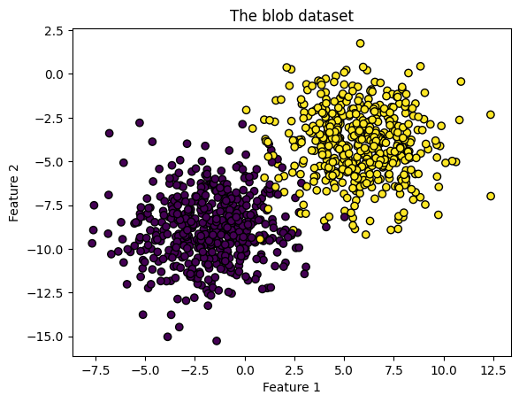
    


Of course we also have to split the dataset into train and test parts.


```python
X_train, X_test, y_train, y_test = train_test_split(X, y, test_size=0.3, random_state=42)
```

Since we are going to use backpropagation a lot, we need to utilize a library that provides us with easy access to gradient values and preferably provides us with more tools to develop a neural network.

The two most libraries are **Pytorch** and **Tensorflow**. In this notebook we will use Pytorch since it has a more intutive user inteface but Tensorflow is just as capable.\
Now to use our data within the environment of Pytorch we should conver all of our tensors and matrix to the type provided by Pytorch. It is performed like this:
```
X_train_tensor = torch.tensor(X_train, dtype=torch.float32)
```
Where `X_train` is a tensor/matrix/list and should be converted to a torch tensor. We repeat the same proccess for all other parts of the data.


```python
# Convert to PyTorch tensors
X_train_tensor = torch.tensor(X_train, dtype=torch.float32)
y_train_tensor = torch.tensor(y_train, dtype=torch.float32).view(-1, 1)
X_test_tensor = torch.tensor(X_test, dtype=torch.float32)
y_test_tensor = torch.tensor(y_test, dtype=torch.float32).view(-1, 1)
```

### Defining the Model

In this section, we'll define a simple neural network model using PyTorch.

<h3>Step-by-Step Explanation</h3>
<h4>Import Necessary Modules</h4>

First, ensure you have imported the necessary modules from PyTorch:
```
import torch
import torch.nn as nn
```
We have done this part before.
<h4>Define the Model</h4>

We'll define a simple classifier model by creating a subclass of `nn.Module`. This is done by the first line, `class SimpleClassifier(nn.Module)`. Subclass is like a copy of the class that is pasted into our new defined class. This is useful as it lets us have a class with advnace features while being enable to alter it.\
This model will have two fully connected (linear) layers with ReLU and Sigmoid activations. Here's the code:

```
class SimpleClassifier(nn.Module):
    def __init__(self):
        super(SimpleClassifier, self).__init__()
        self.fc1 = nn.Linear(2, 10)   # First fully connected layer (input size: 2, output size: 10)
        self.relu = nn.ReLU()         # ReLU activation function
        self.fc2 = nn.Linear(10, 1)   # Second fully connected layer (input size: 10, output size: 1)
        self.sigmoid = nn.Sigmoid()   # Sigmoid activation function

    def forward(self, x):
        out = self.fc1(x)             # Apply first fully connected layer
        out = self.relu(out)          # Apply ReLU activation
        out = self.fc2(out)           # Apply second fully connected layer
        out = self.sigmoid(out)       # Apply Sigmoid activation
        return out
```

<h3>Explanation of the Model Components</h3>

`__init__` Method: This is the constructor method where we define the layers of our model. We call the constructor of the parent class (nn.Module) using super(). It is ok if you couldn't follow. But it is important to know that ` def __init__(self)` is run when the class is instantiated to define anything necessary about that instance of the class. We will also talk about class instantiation later.

`super(SimpleClassifier, self).__init__()` is also important but ok if you don't know it. Just use it whenever writing a torch model.
Then, we define the neural ne:

- `self.fc1`: A fully connected layer that takes an input of size 2 and outputs with a of size 10.
- `self.relu`: A ReLU activation function.
- `self.fc2`: Another fully connected layer that takes an input of size 10 and outputs with a size of 1.
- `self.sigmoid`: A Sigmoid activation function.
forward Method: This method defines the forward pass of the network, which is the process of passing input data through the network layers to get an output.

<h3>Forward pass</h3>

Whenever the model is called it will run the `forward` function. The input of the call is also passed to it. This is basically how we use our model. Here is what happens inside the forward pass.

- Passing the input `x` through the first fully connected layer (`self.fc1`).
- Applying the ReLU activation function (`self.relu`).
- Passing the result through the second fully connected layer (`self.fc2`).
- Applying the Sigmoid activation function (`self.sigmoid`).
- Returning the final output.

This simple classifier model takes a 2-dimensional input, processes it through hidden layers with activation functions, and outputs a single value between 0 and 1, which can be interpreted as a probability.

<h3>Creating an Instance of the Model</h3>

Though it is possible here to use the class as it is, It is good practice and most of the times neccessary to instatiate the class. This will make a copy of the class and allow us to use different instances of the class. To create an instance of the SimpleClassifier model, you can do:
```
model = SimpleClassifier()
```
Now, you have a simple neural network model defined and ready to be trained on your data.


```python
# 2. Define the Model
class SimpleClassifier(nn.Module):
    def __init__(self):
        super(SimpleClassifier, self).__init__()
        # self.fc1 = # TODO
        # self.relu = # TODO
        # self.fc2 = # TODO
        # self.sigmoid = # TODO
        self.fc1 = nn.Linear(2, 10)
        self.relu = nn.ReLU()
        self.fc2 = nn.Linear(10, 1)
        self.sigmoid = nn.Sigmoid()

    def forward(self, x):
        # TODO
        out = self.fc1(x)
        out = self.relu(out)
        out = self.fc2(out)
        out = self.sigmoid(out)
        return out

model = SimpleClassifier()
```

### Optimization

Now we need to functions. One for the loss function and one for the optimization method e.g. Gradient Descent.

There are many loss functions and optimizers available but since it's out of topic for this note book we would only use the most simple ones.

- `criterion`/loss: This is the loss function that we are going to minimize. For classification Binary Cross Entorpy (BCE) is considered appropriate.
- `optimizer`: As said before we'll use Gradient Descent. We will provide the learning rate as `lr`.

It is important that `nn` and `optim` are both modules provided by pytorch which we imported before.


```python
# 3. Loss and Optimizer
criterion = nn.BCELoss()  # Binary Cross-Entropy Loss
optimizer = optim.SGD(model.parameters(), lr=0.01)
```

### Train Loop

Now we need to define loop that will iterate over the data multiple times and train the model.

Each time that the model is trained on all of training data is called an epoch. So for example 10 epoch is equivalent to training over the data for 10 times.

Now we will got through all the code in the next cell:
<h3>Define the Loop</h3>

```
num_epochs = 5000
for epoch in range(num_epochs):
```

To loop over the data we use a for loop and `num_epochs` is the number of time the loop is done.

- `model.train()`: This will tell the model that training has begun. This is useful when some layers behave differently in training versus testing. Though this is not the case for our model.

<h3>Find the Loss</h3>

```
outputs = model(X_train_tensor)
loss = criterion(outputs, y_train_tensor)
```
- `outputs`: Is the result of feeding the features in train data to the model. It contains a vector of length equal to number of classes (Binary Classification is an exception) for each data point.
- `loss`: `criterion` is the Binary Cross Entropy loss we defined earlier. Using it we can calculate the loss value. Please note that `y_train_tensor` is the torch tensor of the train labels and have to be provided to the loss function. This way the function can assess the discrepancy between the predicted values (`outputs`) and the actual labels (`y_train_tensor`).


<h3> Backpropagation</h3>

Believe it or not Pytorch will keep a record of all mathmatical operations performed from each weight in the model to the loss. Doing so will allow it to perform backpropagation to every weights in the model.
To use this capability of the model there a few steps that should be taken.

```
optimizer.zero_grad()
loss.backward()
optimizer.step()
```
- `optimizer.zero_grad()`: Since Pytorch will store a value for the gradient of each of the weights, we have to make sure there isn't any pre-stored gradient value for any of the weights (For example from the previouse epoch). Using this command will set all of their values to zero.
- `loss.backward()`: Backpropagation is performed and the resulting gradients are <b>added</b> to the <b>previously stored</b> values. This is the the reason we zeroed them in the previous command (To prevent accumulation of the gradients).

At last we need to check the loss status every now and then. Mainly to check if it is decreasing properly. The last two lines will just do that:

```
if (epoch + 1) % 10 == 0:
        print(f'Epoch [{epoch + 1}/{num_epochs}], Loss: {loss.item():.4f}')
```


```python
#@title Training Loop
num_epochs = 5000
for epoch in range(num_epochs):
    model.train()

    # Forward pass
    # outputs = # TODO: Forward your input to the model and get an output
    # loss = # TODO: Calculate the loss
    outputs = model(X_train_tensor)
    loss = criterion(outputs, y_train_tensor)

    # Backward pass and optimization
    optimizer.zero_grad()
    loss.backward()
    optimizer.step()

    if (epoch + 1) % 10 == 0:
        print(f'Epoch [{epoch + 1}/{num_epochs}], Loss: {loss.item():.4f}')
```

    Epoch [10/5000], Loss: 0.2916
    Epoch [20/5000], Loss: 0.2189
    Epoch [30/5000], Loss: 0.1825
    Epoch [40/5000], Loss: 0.1603
    Epoch [50/5000], Loss: 0.1449
    Epoch [60/5000], Loss: 0.1333
    Epoch [70/5000], Loss: 0.1241
    Epoch [80/5000], Loss: 0.1165
    Epoch [90/5000], Loss: 0.1102
    Epoch [100/5000], Loss: 0.1048
    Epoch [110/5000], Loss: 0.1002
    Epoch [120/5000], Loss: 0.0962
    Epoch [130/5000], Loss: 0.0926
    Epoch [140/5000], Loss: 0.0895
    Epoch [150/5000], Loss: 0.0866
    Epoch [160/5000], Loss: 0.0841
    Epoch [170/5000], Loss: 0.0819
    Epoch [180/5000], Loss: 0.0799
    Epoch [190/5000], Loss: 0.0781
    Epoch [200/5000], Loss: 0.0764
    Epoch [210/5000], Loss: 0.0749
    Epoch [220/5000], Loss: 0.0735
    Epoch [230/5000], Loss: 0.0723
    Epoch [240/5000], Loss: 0.0711
    Epoch [250/5000], Loss: 0.0701
    Epoch [260/5000], Loss: 0.0691
    Epoch [270/5000], Loss: 0.0682
    Epoch [280/5000], Loss: 0.0674
    Epoch [290/5000], Loss: 0.0666
    Epoch [300/5000], Loss: 0.0659
    Epoch [310/5000], Loss: 0.0652
    Epoch [320/5000], Loss: 0.0646
    Epoch [330/5000], Loss: 0.0640
    Epoch [340/5000], Loss: 0.0634
    Epoch [350/5000], Loss: 0.0629
    Epoch [360/5000], Loss: 0.0624
    Epoch [370/5000], Loss: 0.0619
    Epoch [380/5000], Loss: 0.0614
    Epoch [390/5000], Loss: 0.0610
    Epoch [400/5000], Loss: 0.0606
    Epoch [410/5000], Loss: 0.0602
    Epoch [420/5000], Loss: 0.0599
    Epoch [430/5000], Loss: 0.0596
    Epoch [440/5000], Loss: 0.0592
    Epoch [450/5000], Loss: 0.0589
    Epoch [460/5000], Loss: 0.0587
    Epoch [470/5000], Loss: 0.0584
    Epoch [480/5000], Loss: 0.0581
    Epoch [490/5000], Loss: 0.0579
    Epoch [500/5000], Loss: 0.0576
    Epoch [510/5000], Loss: 0.0574
    Epoch [520/5000], Loss: 0.0572
    Epoch [530/5000], Loss: 0.0570
    Epoch [540/5000], Loss: 0.0568
    Epoch [550/5000], Loss: 0.0566
    Epoch [560/5000], Loss: 0.0564
    Epoch [570/5000], Loss: 0.0563
    Epoch [580/5000], Loss: 0.0561
    Epoch [590/5000], Loss: 0.0559
    Epoch [600/5000], Loss: 0.0558
    Epoch [610/5000], Loss: 0.0556
    Epoch [620/5000], Loss: 0.0555
    Epoch [630/5000], Loss: 0.0554
    Epoch [640/5000], Loss: 0.0552
    Epoch [650/5000], Loss: 0.0551
    Epoch [660/5000], Loss: 0.0550
    Epoch [670/5000], Loss: 0.0549
    Epoch [680/5000], Loss: 0.0547
    Epoch [690/5000], Loss: 0.0546
    Epoch [700/5000], Loss: 0.0545
    Epoch [710/5000], Loss: 0.0544
    Epoch [720/5000], Loss: 0.0543
    Epoch [730/5000], Loss: 0.0542
    Epoch [740/5000], Loss: 0.0542
    Epoch [750/5000], Loss: 0.0541
    Epoch [760/5000], Loss: 0.0540
    Epoch [770/5000], Loss: 0.0539
    Epoch [780/5000], Loss: 0.0538
    Epoch [790/5000], Loss: 0.0537
    Epoch [800/5000], Loss: 0.0537
    Epoch [810/5000], Loss: 0.0536
    Epoch [820/5000], Loss: 0.0535
    Epoch [830/5000], Loss: 0.0535
    Epoch [840/5000], Loss: 0.0534
    Epoch [850/5000], Loss: 0.0533
    Epoch [860/5000], Loss: 0.0533
    Epoch [870/5000], Loss: 0.0532
    Epoch [880/5000], Loss: 0.0531
    Epoch [890/5000], Loss: 0.0531
    Epoch [900/5000], Loss: 0.0530
    Epoch [910/5000], Loss: 0.0530
    Epoch [920/5000], Loss: 0.0529
    Epoch [930/5000], Loss: 0.0529
    Epoch [940/5000], Loss: 0.0528
    Epoch [950/5000], Loss: 0.0528
    Epoch [960/5000], Loss: 0.0527
    Epoch [970/5000], Loss: 0.0527
    Epoch [980/5000], Loss: 0.0526
    Epoch [990/5000], Loss: 0.0526
    Epoch [1000/5000], Loss: 0.0525
    Epoch [1010/5000], Loss: 0.0525
    Epoch [1020/5000], Loss: 0.0524
    Epoch [1030/5000], Loss: 0.0524
    Epoch [1040/5000], Loss: 0.0524
    Epoch [1050/5000], Loss: 0.0523
    Epoch [1060/5000], Loss: 0.0523
    Epoch [1070/5000], Loss: 0.0523
    Epoch [1080/5000], Loss: 0.0522
    Epoch [1090/5000], Loss: 0.0522
    Epoch [1100/5000], Loss: 0.0522
    Epoch [1110/5000], Loss: 0.0521
    Epoch [1120/5000], Loss: 0.0521
    Epoch [1130/5000], Loss: 0.0521
    Epoch [1140/5000], Loss: 0.0520
    Epoch [1150/5000], Loss: 0.0520
    Epoch [1160/5000], Loss: 0.0520
    Epoch [1170/5000], Loss: 0.0519
    Epoch [1180/5000], Loss: 0.0519
    Epoch [1190/5000], Loss: 0.0519
    Epoch [1200/5000], Loss: 0.0518
    Epoch [1210/5000], Loss: 0.0518
    Epoch [1220/5000], Loss: 0.0518
    Epoch [1230/5000], Loss: 0.0518
    Epoch [1240/5000], Loss: 0.0517
    Epoch [1250/5000], Loss: 0.0517
    Epoch [1260/5000], Loss: 0.0517
    Epoch [1270/5000], Loss: 0.0517
    Epoch [1280/5000], Loss: 0.0516
    Epoch [1290/5000], Loss: 0.0516
    Epoch [1300/5000], Loss: 0.0516
    Epoch [1310/5000], Loss: 0.0516
    Epoch [1320/5000], Loss: 0.0516
    Epoch [1330/5000], Loss: 0.0515
    Epoch [1340/5000], Loss: 0.0515
    Epoch [1350/5000], Loss: 0.0515
    Epoch [1360/5000], Loss: 0.0515
    Epoch [1370/5000], Loss: 0.0514
    Epoch [1380/5000], Loss: 0.0514
    Epoch [1390/5000], Loss: 0.0514
    Epoch [1400/5000], Loss: 0.0514
    Epoch [1410/5000], Loss: 0.0514
    Epoch [1420/5000], Loss: 0.0514
    Epoch [1430/5000], Loss: 0.0513
    Epoch [1440/5000], Loss: 0.0513
    Epoch [1450/5000], Loss: 0.0513
    Epoch [1460/5000], Loss: 0.0513
    Epoch [1470/5000], Loss: 0.0513
    Epoch [1480/5000], Loss: 0.0512
    Epoch [1490/5000], Loss: 0.0512
    Epoch [1500/5000], Loss: 0.0512
    Epoch [1510/5000], Loss: 0.0512
    Epoch [1520/5000], Loss: 0.0512
    Epoch [1530/5000], Loss: 0.0512
    Epoch [1540/5000], Loss: 0.0511
    Epoch [1550/5000], Loss: 0.0511
    Epoch [1560/5000], Loss: 0.0511
    Epoch [1570/5000], Loss: 0.0511
    Epoch [1580/5000], Loss: 0.0511
    Epoch [1590/5000], Loss: 0.0511
    Epoch [1600/5000], Loss: 0.0511
    Epoch [1610/5000], Loss: 0.0510
    Epoch [1620/5000], Loss: 0.0510
    Epoch [1630/5000], Loss: 0.0510
    Epoch [1640/5000], Loss: 0.0510
    Epoch [1650/5000], Loss: 0.0510
    Epoch [1660/5000], Loss: 0.0510
    Epoch [1670/5000], Loss: 0.0510
    Epoch [1680/5000], Loss: 0.0509
    Epoch [1690/5000], Loss: 0.0509
    Epoch [1700/5000], Loss: 0.0509
    Epoch [1710/5000], Loss: 0.0509
    Epoch [1720/5000], Loss: 0.0509
    Epoch [1730/5000], Loss: 0.0509
    Epoch [1740/5000], Loss: 0.0509
    Epoch [1750/5000], Loss: 0.0509
    Epoch [1760/5000], Loss: 0.0508
    Epoch [1770/5000], Loss: 0.0508
    Epoch [1780/5000], Loss: 0.0508
    Epoch [1790/5000], Loss: 0.0508
    Epoch [1800/5000], Loss: 0.0508
    Epoch [1810/5000], Loss: 0.0508
    Epoch [1820/5000], Loss: 0.0508
    Epoch [1830/5000], Loss: 0.0508
    Epoch [1840/5000], Loss: 0.0507
    Epoch [1850/5000], Loss: 0.0507
    Epoch [1860/5000], Loss: 0.0507
    Epoch [1870/5000], Loss: 0.0507
    Epoch [1880/5000], Loss: 0.0507
    Epoch [1890/5000], Loss: 0.0507
    Epoch [1900/5000], Loss: 0.0507
    Epoch [1910/5000], Loss: 0.0507
    Epoch [1920/5000], Loss: 0.0507
    Epoch [1930/5000], Loss: 0.0506
    Epoch [1940/5000], Loss: 0.0506
    Epoch [1950/5000], Loss: 0.0506
    Epoch [1960/5000], Loss: 0.0506
    Epoch [1970/5000], Loss: 0.0506
    Epoch [1980/5000], Loss: 0.0506
    Epoch [1990/5000], Loss: 0.0506
    Epoch [2000/5000], Loss: 0.0506
    Epoch [2010/5000], Loss: 0.0506
    Epoch [2020/5000], Loss: 0.0506
    Epoch [2030/5000], Loss: 0.0505
    Epoch [2040/5000], Loss: 0.0505
    Epoch [2050/5000], Loss: 0.0505
    Epoch [2060/5000], Loss: 0.0505
    Epoch [2070/5000], Loss: 0.0505
    Epoch [2080/5000], Loss: 0.0505
    Epoch [2090/5000], Loss: 0.0505
    Epoch [2100/5000], Loss: 0.0505
    Epoch [2110/5000], Loss: 0.0505
    Epoch [2120/5000], Loss: 0.0505
    Epoch [2130/5000], Loss: 0.0505
    Epoch [2140/5000], Loss: 0.0504
    Epoch [2150/5000], Loss: 0.0504
    Epoch [2160/5000], Loss: 0.0504
    Epoch [2170/5000], Loss: 0.0504
    Epoch [2180/5000], Loss: 0.0504
    Epoch [2190/5000], Loss: 0.0504
    Epoch [2200/5000], Loss: 0.0504
    Epoch [2210/5000], Loss: 0.0504
    Epoch [2220/5000], Loss: 0.0504
    Epoch [2230/5000], Loss: 0.0504
    Epoch [2240/5000], Loss: 0.0504
    Epoch [2250/5000], Loss: 0.0503
    Epoch [2260/5000], Loss: 0.0503
    Epoch [2270/5000], Loss: 0.0503
    Epoch [2280/5000], Loss: 0.0503
    Epoch [2290/5000], Loss: 0.0503
    Epoch [2300/5000], Loss: 0.0503
    Epoch [2310/5000], Loss: 0.0503
    Epoch [2320/5000], Loss: 0.0503
    Epoch [2330/5000], Loss: 0.0503
    Epoch [2340/5000], Loss: 0.0503
    Epoch [2350/5000], Loss: 0.0503
    Epoch [2360/5000], Loss: 0.0503
    Epoch [2370/5000], Loss: 0.0503
    Epoch [2380/5000], Loss: 0.0502
    Epoch [2390/5000], Loss: 0.0502
    Epoch [2400/5000], Loss: 0.0502
    Epoch [2410/5000], Loss: 0.0502
    Epoch [2420/5000], Loss: 0.0502
    Epoch [2430/5000], Loss: 0.0502
    Epoch [2440/5000], Loss: 0.0502
    Epoch [2450/5000], Loss: 0.0502
    Epoch [2460/5000], Loss: 0.0502
    Epoch [2470/5000], Loss: 0.0502
    Epoch [2480/5000], Loss: 0.0502
    Epoch [2490/5000], Loss: 0.0502
    Epoch [2500/5000], Loss: 0.0502
    Epoch [2510/5000], Loss: 0.0501
    Epoch [2520/5000], Loss: 0.0501
    Epoch [2530/5000], Loss: 0.0501
    Epoch [2540/5000], Loss: 0.0501
    Epoch [2550/5000], Loss: 0.0501
    Epoch [2560/5000], Loss: 0.0501
    Epoch [2570/5000], Loss: 0.0501
    Epoch [2580/5000], Loss: 0.0501
    Epoch [2590/5000], Loss: 0.0501
    Epoch [2600/5000], Loss: 0.0501
    Epoch [2610/5000], Loss: 0.0501
    Epoch [2620/5000], Loss: 0.0501
    Epoch [2630/5000], Loss: 0.0501
    Epoch [2640/5000], Loss: 0.0501
    Epoch [2650/5000], Loss: 0.0500
    Epoch [2660/5000], Loss: 0.0500
    Epoch [2670/5000], Loss: 0.0500
    Epoch [2680/5000], Loss: 0.0500
    Epoch [2690/5000], Loss: 0.0500
    Epoch [2700/5000], Loss: 0.0500
    Epoch [2710/5000], Loss: 0.0500
    Epoch [2720/5000], Loss: 0.0500
    Epoch [2730/5000], Loss: 0.0500
    Epoch [2740/5000], Loss: 0.0500
    Epoch [2750/5000], Loss: 0.0500
    Epoch [2760/5000], Loss: 0.0500
    Epoch [2770/5000], Loss: 0.0500
    Epoch [2780/5000], Loss: 0.0500
    Epoch [2790/5000], Loss: 0.0500
    Epoch [2800/5000], Loss: 0.0499
    Epoch [2810/5000], Loss: 0.0499
    Epoch [2820/5000], Loss: 0.0499
    Epoch [2830/5000], Loss: 0.0499
    Epoch [2840/5000], Loss: 0.0499
    Epoch [2850/5000], Loss: 0.0499
    Epoch [2860/5000], Loss: 0.0499
    Epoch [2870/5000], Loss: 0.0499
    Epoch [2880/5000], Loss: 0.0499
    Epoch [2890/5000], Loss: 0.0499
    Epoch [2900/5000], Loss: 0.0499
    Epoch [2910/5000], Loss: 0.0499
    Epoch [2920/5000], Loss: 0.0499
    Epoch [2930/5000], Loss: 0.0499
    Epoch [2940/5000], Loss: 0.0499
    Epoch [2950/5000], Loss: 0.0499
    Epoch [2960/5000], Loss: 0.0498
    Epoch [2970/5000], Loss: 0.0498
    Epoch [2980/5000], Loss: 0.0498
    Epoch [2990/5000], Loss: 0.0498
    Epoch [3000/5000], Loss: 0.0498
    Epoch [3010/5000], Loss: 0.0498
    Epoch [3020/5000], Loss: 0.0498
    Epoch [3030/5000], Loss: 0.0498
    Epoch [3040/5000], Loss: 0.0498
    Epoch [3050/5000], Loss: 0.0498
    Epoch [3060/5000], Loss: 0.0498
    Epoch [3070/5000], Loss: 0.0498
    Epoch [3080/5000], Loss: 0.0498
    Epoch [3090/5000], Loss: 0.0498
    Epoch [3100/5000], Loss: 0.0498
    Epoch [3110/5000], Loss: 0.0498
    Epoch [3120/5000], Loss: 0.0497
    Epoch [3130/5000], Loss: 0.0497
    Epoch [3140/5000], Loss: 0.0497
    Epoch [3150/5000], Loss: 0.0497
    Epoch [3160/5000], Loss: 0.0497
    Epoch [3170/5000], Loss: 0.0497
    Epoch [3180/5000], Loss: 0.0497
    Epoch [3190/5000], Loss: 0.0497
    Epoch [3200/5000], Loss: 0.0497
    Epoch [3210/5000], Loss: 0.0497
    Epoch [3220/5000], Loss: 0.0497
    Epoch [3230/5000], Loss: 0.0497
    Epoch [3240/5000], Loss: 0.0497
    Epoch [3250/5000], Loss: 0.0497
    Epoch [3260/5000], Loss: 0.0497
    Epoch [3270/5000], Loss: 0.0497
    Epoch [3280/5000], Loss: 0.0497
    Epoch [3290/5000], Loss: 0.0497
    Epoch [3300/5000], Loss: 0.0496
    Epoch [3310/5000], Loss: 0.0496
    Epoch [3320/5000], Loss: 0.0496
    Epoch [3330/5000], Loss: 0.0496
    Epoch [3340/5000], Loss: 0.0496
    Epoch [3350/5000], Loss: 0.0496
    Epoch [3360/5000], Loss: 0.0496
    Epoch [3370/5000], Loss: 0.0496
    Epoch [3380/5000], Loss: 0.0496
    Epoch [3390/5000], Loss: 0.0496
    Epoch [3400/5000], Loss: 0.0496
    Epoch [3410/5000], Loss: 0.0496
    Epoch [3420/5000], Loss: 0.0496
    Epoch [3430/5000], Loss: 0.0496
    Epoch [3440/5000], Loss: 0.0496
    Epoch [3450/5000], Loss: 0.0496
    Epoch [3460/5000], Loss: 0.0496
    Epoch [3470/5000], Loss: 0.0496
    Epoch [3480/5000], Loss: 0.0495
    Epoch [3490/5000], Loss: 0.0495
    Epoch [3500/5000], Loss: 0.0495
    Epoch [3510/5000], Loss: 0.0495
    Epoch [3520/5000], Loss: 0.0495
    Epoch [3530/5000], Loss: 0.0495
    Epoch [3540/5000], Loss: 0.0495
    Epoch [3550/5000], Loss: 0.0495
    Epoch [3560/5000], Loss: 0.0495
    Epoch [3570/5000], Loss: 0.0495
    Epoch [3580/5000], Loss: 0.0495
    Epoch [3590/5000], Loss: 0.0495
    Epoch [3600/5000], Loss: 0.0495
    Epoch [3610/5000], Loss: 0.0495
    Epoch [3620/5000], Loss: 0.0495
    Epoch [3630/5000], Loss: 0.0495
    Epoch [3640/5000], Loss: 0.0495
    Epoch [3650/5000], Loss: 0.0495
    Epoch [3660/5000], Loss: 0.0494
    Epoch [3670/5000], Loss: 0.0494
    Epoch [3680/5000], Loss: 0.0494
    Epoch [3690/5000], Loss: 0.0494
    Epoch [3700/5000], Loss: 0.0494
    Epoch [3710/5000], Loss: 0.0494
    Epoch [3720/5000], Loss: 0.0494
    Epoch [3730/5000], Loss: 0.0494
    Epoch [3740/5000], Loss: 0.0494
    Epoch [3750/5000], Loss: 0.0494
    Epoch [3760/5000], Loss: 0.0494
    Epoch [3770/5000], Loss: 0.0494
    Epoch [3780/5000], Loss: 0.0494
    Epoch [3790/5000], Loss: 0.0494
    Epoch [3800/5000], Loss: 0.0494
    Epoch [3810/5000], Loss: 0.0494
    Epoch [3820/5000], Loss: 0.0494
    Epoch [3830/5000], Loss: 0.0494
    Epoch [3840/5000], Loss: 0.0494
    Epoch [3850/5000], Loss: 0.0493
    Epoch [3860/5000], Loss: 0.0493
    Epoch [3870/5000], Loss: 0.0493
    Epoch [3880/5000], Loss: 0.0493
    Epoch [3890/5000], Loss: 0.0493
    Epoch [3900/5000], Loss: 0.0493
    Epoch [3910/5000], Loss: 0.0493
    Epoch [3920/5000], Loss: 0.0493
    Epoch [3930/5000], Loss: 0.0493
    Epoch [3940/5000], Loss: 0.0493
    Epoch [3950/5000], Loss: 0.0493
    Epoch [3960/5000], Loss: 0.0493
    Epoch [3970/5000], Loss: 0.0493
    Epoch [3980/5000], Loss: 0.0493
    Epoch [3990/5000], Loss: 0.0493
    Epoch [4000/5000], Loss: 0.0493
    Epoch [4010/5000], Loss: 0.0493
    Epoch [4020/5000], Loss: 0.0493
    Epoch [4030/5000], Loss: 0.0493
    Epoch [4040/5000], Loss: 0.0493
    Epoch [4050/5000], Loss: 0.0492
    Epoch [4060/5000], Loss: 0.0492
    Epoch [4070/5000], Loss: 0.0492
    Epoch [4080/5000], Loss: 0.0492
    Epoch [4090/5000], Loss: 0.0492
    Epoch [4100/5000], Loss: 0.0492
    Epoch [4110/5000], Loss: 0.0492
    Epoch [4120/5000], Loss: 0.0492
    Epoch [4130/5000], Loss: 0.0492
    Epoch [4140/5000], Loss: 0.0492
    Epoch [4150/5000], Loss: 0.0492
    Epoch [4160/5000], Loss: 0.0492
    Epoch [4170/5000], Loss: 0.0492
    Epoch [4180/5000], Loss: 0.0492
    Epoch [4190/5000], Loss: 0.0492
    Epoch [4200/5000], Loss: 0.0492
    Epoch [4210/5000], Loss: 0.0492
    Epoch [4220/5000], Loss: 0.0492
    Epoch [4230/5000], Loss: 0.0492
    Epoch [4240/5000], Loss: 0.0492
    Epoch [4250/5000], Loss: 0.0492
    Epoch [4260/5000], Loss: 0.0491
    Epoch [4270/5000], Loss: 0.0491
    Epoch [4280/5000], Loss: 0.0491
    Epoch [4290/5000], Loss: 0.0491
    Epoch [4300/5000], Loss: 0.0491
    Epoch [4310/5000], Loss: 0.0491
    Epoch [4320/5000], Loss: 0.0491
    Epoch [4330/5000], Loss: 0.0491
    Epoch [4340/5000], Loss: 0.0491
    Epoch [4350/5000], Loss: 0.0491
    Epoch [4360/5000], Loss: 0.0491
    Epoch [4370/5000], Loss: 0.0491
    Epoch [4380/5000], Loss: 0.0491
    Epoch [4390/5000], Loss: 0.0491
    Epoch [4400/5000], Loss: 0.0491
    Epoch [4410/5000], Loss: 0.0491
    Epoch [4420/5000], Loss: 0.0491
    Epoch [4430/5000], Loss: 0.0491
    Epoch [4440/5000], Loss: 0.0491
    Epoch [4450/5000], Loss: 0.0491
    Epoch [4460/5000], Loss: 0.0491
    Epoch [4470/5000], Loss: 0.0490
    Epoch [4480/5000], Loss: 0.0490
    Epoch [4490/5000], Loss: 0.0490
    Epoch [4500/5000], Loss: 0.0490
    Epoch [4510/5000], Loss: 0.0490
    Epoch [4520/5000], Loss: 0.0490
    Epoch [4530/5000], Loss: 0.0490
    Epoch [4540/5000], Loss: 0.0490
    Epoch [4550/5000], Loss: 0.0490
    Epoch [4560/5000], Loss: 0.0490
    Epoch [4570/5000], Loss: 0.0490
    Epoch [4580/5000], Loss: 0.0490
    Epoch [4590/5000], Loss: 0.0490
    Epoch [4600/5000], Loss: 0.0490
    Epoch [4610/5000], Loss: 0.0490
    Epoch [4620/5000], Loss: 0.0490
    Epoch [4630/5000], Loss: 0.0490
    Epoch [4640/5000], Loss: 0.0490
    Epoch [4650/5000], Loss: 0.0490
    Epoch [4660/5000], Loss: 0.0490
    Epoch [4670/5000], Loss: 0.0490
    Epoch [4680/5000], Loss: 0.0490
    Epoch [4690/5000], Loss: 0.0489
    Epoch [4700/5000], Loss: 0.0489
    Epoch [4710/5000], Loss: 0.0489
    Epoch [4720/5000], Loss: 0.0489
    Epoch [4730/5000], Loss: 0.0489
    Epoch [4740/5000], Loss: 0.0489
    Epoch [4750/5000], Loss: 0.0489
    Epoch [4760/5000], Loss: 0.0489
    Epoch [4770/5000], Loss: 0.0489
    Epoch [4780/5000], Loss: 0.0489
    Epoch [4790/5000], Loss: 0.0489
    Epoch [4800/5000], Loss: 0.0489
    Epoch [4810/5000], Loss: 0.0489
    Epoch [4820/5000], Loss: 0.0489
    Epoch [4830/5000], Loss: 0.0489
    Epoch [4840/5000], Loss: 0.0489
    Epoch [4850/5000], Loss: 0.0489
    Epoch [4860/5000], Loss: 0.0489
    Epoch [4870/5000], Loss: 0.0489
    Epoch [4880/5000], Loss: 0.0489
    Epoch [4890/5000], Loss: 0.0489
    Epoch [4900/5000], Loss: 0.0489
    Epoch [4910/5000], Loss: 0.0489
    Epoch [4920/5000], Loss: 0.0488
    Epoch [4930/5000], Loss: 0.0488
    Epoch [4940/5000], Loss: 0.0488
    Epoch [4950/5000], Loss: 0.0488
    Epoch [4960/5000], Loss: 0.0488
    Epoch [4970/5000], Loss: 0.0488
    Epoch [4980/5000], Loss: 0.0488
    Epoch [4990/5000], Loss: 0.0488
    Epoch [5000/5000], Loss: 0.0488


### Evaluation

Now we need to evaluate the results. First, similar to training the model we should know that the evaluation phase has started. This is done by `model.eval()`.

Next before starting the evaluation we should let pytorch know that no gradients are needed in this phase. Doing so will reduce the required memory as backpropagation requires many extra values to be stored. This is exceptionally important in the case of large models, since backpropagation can increase the required memory by many folds.


```python
#@title Evaluate the Model
from sklearn.metrics import accuracy_score

model.eval()
with torch.no_grad():
    y_pred_probs = model(X_test_tensor)
    y_pred = (y_pred_probs > 0.5).float()
    accuracy = accuracy_score(y_test_tensor.numpy(), y_pred.numpy())
    print(f'Accuracy: {accuracy:.4f}')

# 6. Plot the Decision Boundary
def plot_decision_boundary(X, y, model):
    x_min, x_max = X[:, 0].min() - 1, X[:, 0].max() + 1
    y_min, y_max = X[:, 1].min() - 1, X[:, 1].max() + 1
    xx, yy = np.meshgrid(np.arange(x_min, x_max, 0.01), np.arange(y_min, y_max, 0.01))
    Z = model(torch.tensor(np.c_[xx.ravel(), yy.ravel()], dtype=torch.float32))
    Z = (Z > 0.5).float()
    Z = Z.reshape(xx.shape).numpy()

    plt.contourf(xx, yy, Z, alpha=0.3)
    plt.scatter(X[:, 0], X[:, 1], c=y, edgecolor='k', marker='o')
    plt.title('Decision Boundary')
    plt.xlabel('Feature 1')
    plt.ylabel('Feature 2')
    plt.show()

# Plot the decision boundary
plot_decision_boundary(X_test, y_test, model)

```

    Accuracy: 0.9733


    
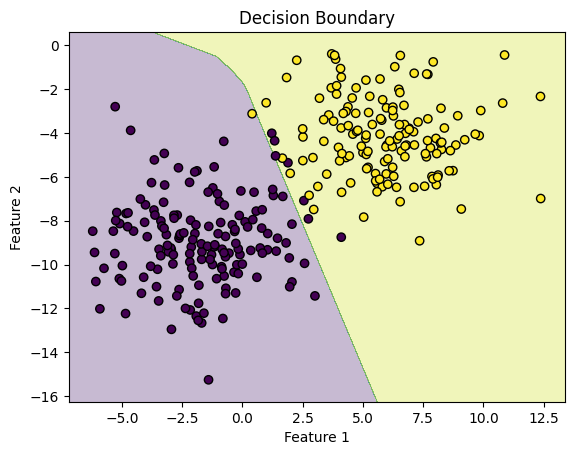
    


# Regression


```python
import torch
import torch.nn as nn
import torch.optim as optim
import numpy as np
import matplotlib.pyplot as plt
import ipywidgets as widgets
from IPython.display import display, clear_output
import matplotlib.style as mplstyle
```

## Dataset

Here we go again. We need a dataset to perform regression analysis. For this example, we will use some synthetic datasets provided by sklearn. This will allow us to easily change the dataset to study different situations.

For regression, we'll use the make_regression function. To use it, we'll write:


```
X, y = make_regression(<fill hear>)
```
In this command you have to define a few inputs. Define them as follows:

- `n_samples=100`: Defines the number of samples in the dataset.
- `n_features=1`: Specifies the number of features (independent variables).
- `noise=10`: Specifies the standard deviation of the Gaussian noise applied to the output, making the dataset more realistic.
- `random_state=42`: Ensures reproducibility by setting the seed for the random number generator.

X is the feature matrix which contains a vector of features for each point, and y is the target variable we aim to predict.

The rest of the code in the cell is to visualize the dataset. We use matplotlib to create a scatter plot of the generated data points. This helps in understanding the distribution and spread of the data. The plot shows the relationship between the feature and the target variable, which is the basis of regression analysis.


```python
import numpy as np
import matplotlib.pyplot as plt
from sklearn.datasets import make_regression,make_s_curve

# Generate a synthetic regression dataset
X, y =  make_regression(n_samples=100,n_features=1,noise=10,random_state=42)
x_train = torch.tensor(X, dtype=torch.float32).view(-1, 1)
y_train = torch.tensor(y, dtype=torch.float32).view(-1, 1)
# Plot the dataset
plt.scatter(X, y, color='blue', marker='o', edgecolor='black')
plt.title('Synthetic Regression Dataset')
plt.xlabel('Feature')
plt.ylabel('Target')
plt.grid(True)
plt.show()
```


    
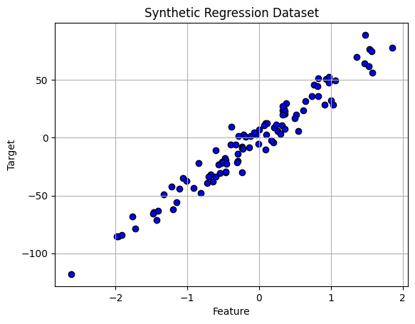
    


## Model Architecture


The model architecture is defined as follows:

1. **Input Layer:**  
   Shape: `1 x 512`
   
2. **Hidden Layer 1:**  
   Shape: `512 x 512`
   
3. **Hidden Layer 2:**  
   Shape: `512 x 512`
   
4. **Output Layer:**  
   Shape: `512 x 1`

Try making this model with only these blocks:
`nn.Linear(input_dim, output_dim)`, `nn.BatchNorm1d(input_dim)`, `nn.ReLU()`.

You should be familiar with these elements by now. Try using them in `nn.sequential` to construct the model.

If you are not familiar, `nn.Sequential` is used so that we don't need to define each layer with a new variable. This allows us to stack layers in a sequential manner, making the code more concise and readable.


```python
device = 'cpu'
```


```python
import torch
import torch.nn as nn

# Define the Model
class SimpleRegressor(nn.Module):
    def __init__(self):
        super(SimpleRegressor, self).__init__()
        
        self.model_queue = nn.Sequential(
            # TODO: Define the model
            nn.Linear(1, 512),
            nn.BatchNorm1d(512),
            nn.ReLU(),
            nn.Linear(512, 512),
            nn.BatchNorm1d(512),
            nn.ReLU(),
            nn.Linear(512, 1)
        )

    def forward(self, x):
        out = self.model_queue(x)
        return out

#Now instance the class and import it to gpu

device = torch.device('cuda' if torch.cuda.is_available() else 'cpu')
model = SimpleRegressor().to(device)

```

### Training

We will make a training loop. First we need an optimizer and a criterion.

Pay attention that the criterion used in the classification part may not be appropriate.


```python
# criterion = #Your code
# optimizer = #Your code
criterion = nn.MSELoss()
optimizer = torch.optim.Adam(model.parameters(), lr=0.001)
```

Now we will define a training loop.


```python
# 4. Training Loop
num_epochs = 6000
all_predictions = []

# Transfer your dataset to GPU
# TODO: Transfer x_train
# TODO: Transfer y_train
x_train = torch.tensor(X, dtype=torch.float32).view(-1, 1).to(device)
y_train = torch.tensor(y, dtype=torch.float32).view(-1, 1).to(device)


for epoch in range(num_epochs):
    outputs = model(x_train)

    # TODO: Find the loss
    # TODO: zero out gradients
    # TODO: perform backpropagation
    # TODO: update weights


    loss = criterion(outputs, y_train)
    optimizer.zero_grad()
    loss.backward()
    optimizer.step()

    if (epoch + 1) % 10 == 0:
        print(f'Epoch [{epoch + 1}/{num_epochs}], Loss: {loss.item():.4f}')
        model.eval()
        with torch.no_grad():
            predicted = model(x_train).cpu().detach().numpy()
        all_predictions.append(predicted)
        model.train()


```

    Epoch [10/6000], Loss: 55.3614
    Epoch [20/6000], Loss: 55.1477
    Epoch [30/6000], Loss: 55.4587
    Epoch [40/6000], Loss: 56.2819
    Epoch [50/6000], Loss: 55.2482
    Epoch [60/6000], Loss: 54.8427
    Epoch [70/6000], Loss: 54.2886
    Epoch [80/6000], Loss: 55.5234
    Epoch [90/6000], Loss: 54.9896
    Epoch [100/6000], Loss: 54.3402
    Epoch [110/6000], Loss: 56.2514
    Epoch [120/6000], Loss: 54.7890
    Epoch [130/6000], Loss: 55.2372
    Epoch [140/6000], Loss: 55.4562
    Epoch [150/6000], Loss: 54.8489
    Epoch [160/6000], Loss: 54.7631
    Epoch [170/6000], Loss: 54.2290
    Epoch [180/6000], Loss: 57.5544
    Epoch [190/6000], Loss: 55.2823
    Epoch [200/6000], Loss: 54.9329
    Epoch [210/6000], Loss: 54.6900
    Epoch [220/6000], Loss: 54.8406
    Epoch [230/6000], Loss: 54.2623
    Epoch [240/6000], Loss: 54.4448
    Epoch [250/6000], Loss: 56.3886
    Epoch [260/6000], Loss: 55.3002
    Epoch [270/6000], Loss: 55.2742
    Epoch [280/6000], Loss: 56.2823
    Epoch [290/6000], Loss: 55.2464
    Epoch [300/6000], Loss: 56.6163
    Epoch [310/6000], Loss: 54.4395
    Epoch [320/6000], Loss: 55.2570
    Epoch [330/6000], Loss: 61.0680
    Epoch [340/6000], Loss: 57.1562
    Epoch [350/6000], Loss: 55.0240
    Epoch [360/6000], Loss: 54.6004
    Epoch [370/6000], Loss: 54.8977
    Epoch [380/6000], Loss: 54.6089
    Epoch [390/6000], Loss: 55.3225
    Epoch [400/6000], Loss: 54.3155
    Epoch [410/6000], Loss: 54.3341
    Epoch [420/6000], Loss: 54.9350
    Epoch [430/6000], Loss: 54.7458
    Epoch [440/6000], Loss: 54.0630
    Epoch [450/6000], Loss: 55.1145
    Epoch [460/6000], Loss: 55.0820
    Epoch [470/6000], Loss: 54.1684
    Epoch [480/6000], Loss: 55.4249
    Epoch [490/6000], Loss: 55.0531
    Epoch [500/6000], Loss: 54.8665
    Epoch [510/6000], Loss: 54.1065
    Epoch [520/6000], Loss: 55.1889
    Epoch [530/6000], Loss: 54.9515
    Epoch [540/6000], Loss: 55.6710
    Epoch [550/6000], Loss: 54.7688
    Epoch [560/6000], Loss: 54.8423
    Epoch [570/6000], Loss: 54.1990
    Epoch [580/6000], Loss: 54.4674
    Epoch [590/6000], Loss: 54.9484
    Epoch [600/6000], Loss: 54.1946
    Epoch [610/6000], Loss: 55.2784
    Epoch [620/6000], Loss: 54.3232
    Epoch [630/6000], Loss: 55.7732
    Epoch [640/6000], Loss: 55.5796
    Epoch [650/6000], Loss: 54.7374
    Epoch [660/6000], Loss: 54.2737
    Epoch [670/6000], Loss: 54.8596
    Epoch [680/6000], Loss: 54.6374
    Epoch [690/6000], Loss: 54.6276
    Epoch [700/6000], Loss: 54.3518
    Epoch [710/6000], Loss: 55.5293
    Epoch [720/6000], Loss: 54.0797
    Epoch [730/6000], Loss: 54.0736
    Epoch [740/6000], Loss: 54.5971
    Epoch [750/6000], Loss: 54.9827
    Epoch [760/6000], Loss: 54.4583
    Epoch [770/6000], Loss: 55.9741
    Epoch [780/6000], Loss: 54.8328
    Epoch [790/6000], Loss: 54.3024
    Epoch [800/6000], Loss: 55.8725
    Epoch [810/6000], Loss: 54.5162
    Epoch [820/6000], Loss: 54.2474
    Epoch [830/6000], Loss: 60.1189
    Epoch [840/6000], Loss: 54.4202
    Epoch [850/6000], Loss: 54.1361
    Epoch [860/6000], Loss: 54.8349
    Epoch [870/6000], Loss: 55.0973
    Epoch [880/6000], Loss: 54.4650
    Epoch [890/6000], Loss: 54.0022
    Epoch [900/6000], Loss: 54.7802
    Epoch [910/6000], Loss: 54.3766
    Epoch [920/6000], Loss: 53.9095
    Epoch [930/6000], Loss: 56.1702
    Epoch [940/6000], Loss: 53.9724
    Epoch [950/6000], Loss: 54.7402
    Epoch [960/6000], Loss: 54.3934
    Epoch [970/6000], Loss: 54.9120
    Epoch [980/6000], Loss: 55.6299
    Epoch [990/6000], Loss: 55.1639
    Epoch [1000/6000], Loss: 53.9159
    Epoch [1010/6000], Loss: 54.2358
    Epoch [1020/6000], Loss: 54.8469
    Epoch [1030/6000], Loss: 54.4180
    Epoch [1040/6000], Loss: 54.6732
    Epoch [1050/6000], Loss: 53.6723
    Epoch [1060/6000], Loss: 60.4212
    Epoch [1070/6000], Loss: 55.4628
    Epoch [1080/6000], Loss: 54.0788
    Epoch [1090/6000], Loss: 54.8153
    Epoch [1100/6000], Loss: 54.1262
    Epoch [1110/6000], Loss: 55.6828
    Epoch [1120/6000], Loss: 54.6235
    Epoch [1130/6000], Loss: 55.8867
    Epoch [1140/6000], Loss: 54.5490
    Epoch [1150/6000], Loss: 54.9468
    Epoch [1160/6000], Loss: 55.3367
    Epoch [1170/6000], Loss: 54.5713
    Epoch [1180/6000], Loss: 57.6886
    Epoch [1190/6000], Loss: 54.9142
    Epoch [1200/6000], Loss: 55.2611
    Epoch [1210/6000], Loss: 54.4419
    Epoch [1220/6000], Loss: 53.7556
    Epoch [1230/6000], Loss: 54.2944
    Epoch [1240/6000], Loss: 53.7394
    Epoch [1250/6000], Loss: 54.3247
    Epoch [1260/6000], Loss: 53.9199
    Epoch [1270/6000], Loss: 53.5414
    Epoch [1280/6000], Loss: 53.9619
    Epoch [1290/6000], Loss: 54.5984
    Epoch [1300/6000], Loss: 53.7376
    Epoch [1310/6000], Loss: 55.1342
    Epoch [1320/6000], Loss: 55.6799
    Epoch [1330/6000], Loss: 54.5604
    Epoch [1340/6000], Loss: 56.9127
    Epoch [1350/6000], Loss: 55.4387
    Epoch [1360/6000], Loss: 54.1043
    Epoch [1370/6000], Loss: 55.9833
    Epoch [1380/6000], Loss: 53.7529
    Epoch [1390/6000], Loss: 53.9035
    Epoch [1400/6000], Loss: 53.5680
    Epoch [1410/6000], Loss: 53.9375
    Epoch [1420/6000], Loss: 55.4349
    Epoch [1430/6000], Loss: 54.4048
    Epoch [1440/6000], Loss: 54.2918
    Epoch [1450/6000], Loss: 54.5113
    Epoch [1460/6000], Loss: 54.4157
    Epoch [1470/6000], Loss: 53.8404
    Epoch [1480/6000], Loss: 54.1479
    Epoch [1490/6000], Loss: 54.7750
    Epoch [1500/6000], Loss: 54.3536
    Epoch [1510/6000], Loss: 53.5988
    Epoch [1520/6000], Loss: 54.3279
    Epoch [1530/6000], Loss: 56.0715
    Epoch [1540/6000], Loss: 53.4475
    Epoch [1550/6000], Loss: 54.0648
    Epoch [1560/6000], Loss: 53.6189
    Epoch [1570/6000], Loss: 54.9505
    Epoch [1580/6000], Loss: 54.9947
    Epoch [1590/6000], Loss: 54.9210
    Epoch [1600/6000], Loss: 54.8753
    Epoch [1610/6000], Loss: 53.5330
    Epoch [1620/6000], Loss: 54.6585
    Epoch [1630/6000], Loss: 55.4213
    Epoch [1640/6000], Loss: 54.4300
    Epoch [1650/6000], Loss: 53.9869
    Epoch [1660/6000], Loss: 56.6859
    Epoch [1670/6000], Loss: 54.6779
    Epoch [1680/6000], Loss: 54.1429
    Epoch [1690/6000], Loss: 53.5762
    Epoch [1700/6000], Loss: 54.0217
    Epoch [1710/6000], Loss: 53.5991
    Epoch [1720/6000], Loss: 53.7542
    Epoch [1730/6000], Loss: 53.5739
    Epoch [1740/6000], Loss: 53.6126
    Epoch [1750/6000], Loss: 54.3784
    Epoch [1760/6000], Loss: 53.7390
    Epoch [1770/6000], Loss: 54.9214
    Epoch [1780/6000], Loss: 54.4052
    Epoch [1790/6000], Loss: 53.8828
    Epoch [1800/6000], Loss: 54.0825
    Epoch [1810/6000], Loss: 53.6007
    Epoch [1820/6000], Loss: 53.5997
    Epoch [1830/6000], Loss: 55.5791
    Epoch [1840/6000], Loss: 54.9821
    Epoch [1850/6000], Loss: 55.1820
    Epoch [1860/6000], Loss: 54.1420
    Epoch [1870/6000], Loss: 53.3450
    Epoch [1880/6000], Loss: 62.6723
    Epoch [1890/6000], Loss: 53.8161
    Epoch [1900/6000], Loss: 53.3673
    Epoch [1910/6000], Loss: 54.1441
    Epoch [1920/6000], Loss: 54.2255
    Epoch [1930/6000], Loss: 54.0313
    Epoch [1940/6000], Loss: 53.5501
    Epoch [1950/6000], Loss: 53.8967
    Epoch [1960/6000], Loss: 53.7500
    Epoch [1970/6000], Loss: 55.0543
    Epoch [1980/6000], Loss: 53.5966
    Epoch [1990/6000], Loss: 55.4043
    Epoch [2000/6000], Loss: 55.2786
    Epoch [2010/6000], Loss: 53.8390
    Epoch [2020/6000], Loss: 53.3999
    Epoch [2030/6000], Loss: 53.3490
    Epoch [2040/6000], Loss: 55.0731
    Epoch [2050/6000], Loss: 54.2525
    Epoch [2060/6000], Loss: 55.4892
    Epoch [2070/6000], Loss: 54.6988
    Epoch [2080/6000], Loss: 53.4150
    Epoch [2090/6000], Loss: 53.3704
    Epoch [2100/6000], Loss: 60.0759
    Epoch [2110/6000], Loss: 54.8837
    Epoch [2120/6000], Loss: 54.5506
    Epoch [2130/6000], Loss: 53.9955
    Epoch [2140/6000], Loss: 55.3432
    Epoch [2150/6000], Loss: 54.4871
    Epoch [2160/6000], Loss: 54.0995
    Epoch [2170/6000], Loss: 53.0889
    Epoch [2180/6000], Loss: 56.5987
    Epoch [2190/6000], Loss: 53.3045
    Epoch [2200/6000], Loss: 54.4806
    Epoch [2210/6000], Loss: 53.9500
    Epoch [2220/6000], Loss: 54.2422
    Epoch [2230/6000], Loss: 53.5376
    Epoch [2240/6000], Loss: 54.0619
    Epoch [2250/6000], Loss: 54.1470
    Epoch [2260/6000], Loss: 53.5370
    Epoch [2270/6000], Loss: 54.6301
    Epoch [2280/6000], Loss: 53.9004
    Epoch [2290/6000], Loss: 53.8494
    Epoch [2300/6000], Loss: 53.6719
    Epoch [2310/6000], Loss: 53.6451
    Epoch [2320/6000], Loss: 55.3367
    Epoch [2330/6000], Loss: 55.1971
    Epoch [2340/6000], Loss: 53.4409
    Epoch [2350/6000], Loss: 53.5376
    Epoch [2360/6000], Loss: 53.4412
    Epoch [2370/6000], Loss: 53.0208
    Epoch [2380/6000], Loss: 55.5925
    Epoch [2390/6000], Loss: 54.1072
    Epoch [2400/6000], Loss: 53.4260
    Epoch [2410/6000], Loss: 53.1304
    Epoch [2420/6000], Loss: 53.6917
    Epoch [2430/6000], Loss: 53.7371
    Epoch [2440/6000], Loss: 53.6883
    Epoch [2450/6000], Loss: 53.6215
    Epoch [2460/6000], Loss: 53.7089
    Epoch [2470/6000], Loss: 53.2541
    Epoch [2480/6000], Loss: 55.8333
    Epoch [2490/6000], Loss: 53.8576
    Epoch [2500/6000], Loss: 53.2944
    Epoch [2510/6000], Loss: 54.5896
    Epoch [2520/6000], Loss: 53.4522
    Epoch [2530/6000], Loss: 53.3833
    Epoch [2540/6000], Loss: 52.9889
    Epoch [2550/6000], Loss: 55.1420
    Epoch [2560/6000], Loss: 53.8294
    Epoch [2570/6000], Loss: 55.3456
    Epoch [2580/6000], Loss: 53.5697
    Epoch [2590/6000], Loss: 54.0564
    Epoch [2600/6000], Loss: 53.5532
    Epoch [2610/6000], Loss: 53.1084
    Epoch [2620/6000], Loss: 54.9890
    Epoch [2630/6000], Loss: 53.4192
    Epoch [2640/6000], Loss: 60.8668
    Epoch [2650/6000], Loss: 54.1852
    Epoch [2660/6000], Loss: 53.7688
    Epoch [2670/6000], Loss: 54.1940
    Epoch [2680/6000], Loss: 53.8032
    Epoch [2690/6000], Loss: 54.1176
    Epoch [2700/6000], Loss: 53.2082
    Epoch [2710/6000], Loss: 54.5602
    Epoch [2720/6000], Loss: 53.6050
    Epoch [2730/6000], Loss: 53.6951
    Epoch [2740/6000], Loss: 53.1571
    Epoch [2750/6000], Loss: 55.0213
    Epoch [2760/6000], Loss: 53.3190
    Epoch [2770/6000], Loss: 53.5899
    Epoch [2780/6000], Loss: 54.0396
    Epoch [2790/6000], Loss: 53.5837
    Epoch [2800/6000], Loss: 52.9825
    Epoch [2810/6000], Loss: 53.8606
    Epoch [2820/6000], Loss: 53.3189
    Epoch [2830/6000], Loss: 53.0140
    Epoch [2840/6000], Loss: 53.5381
    Epoch [2850/6000], Loss: 54.3690
    Epoch [2860/6000], Loss: 53.4547
    Epoch [2870/6000], Loss: 54.9960
    Epoch [2880/6000], Loss: 53.6280
    Epoch [2890/6000], Loss: 55.4367
    Epoch [2900/6000], Loss: 53.1742
    Epoch [2910/6000], Loss: 53.8708
    Epoch [2920/6000], Loss: 54.0654
    Epoch [2930/6000], Loss: 54.1657
    Epoch [2940/6000], Loss: 53.9525
    Epoch [2950/6000], Loss: 55.6344
    Epoch [2960/6000], Loss: 53.0498
    Epoch [2970/6000], Loss: 53.4823
    Epoch [2980/6000], Loss: 53.8607
    Epoch [2990/6000], Loss: 53.9411
    Epoch [3000/6000], Loss: 52.8932
    Epoch [3010/6000], Loss: 54.0387
    Epoch [3020/6000], Loss: 52.8238
    Epoch [3030/6000], Loss: 54.1785
    Epoch [3040/6000], Loss: 53.1929
    Epoch [3050/6000], Loss: 54.4171
    Epoch [3060/6000], Loss: 53.3344
    Epoch [3070/6000], Loss: 53.3236
    Epoch [3080/6000], Loss: 52.7895
    Epoch [3090/6000], Loss: 52.7774
    Epoch [3100/6000], Loss: 54.1733
    Epoch [3110/6000], Loss: 53.7849
    Epoch [3120/6000], Loss: 53.5611
    Epoch [3130/6000], Loss: 53.7449
    Epoch [3140/6000], Loss: 53.1834
    Epoch [3150/6000], Loss: 58.0276
    Epoch [3160/6000], Loss: 56.4128
    Epoch [3170/6000], Loss: 55.9221
    Epoch [3180/6000], Loss: 54.2206
    Epoch [3190/6000], Loss: 54.0164
    Epoch [3200/6000], Loss: 53.0862
    Epoch [3210/6000], Loss: 52.9424
    Epoch [3220/6000], Loss: 53.2587
    Epoch [3230/6000], Loss: 53.0968
    Epoch [3240/6000], Loss: 52.7280
    Epoch [3250/6000], Loss: 53.2766
    Epoch [3260/6000], Loss: 53.1607
    Epoch [3270/6000], Loss: 53.0042
    Epoch [3280/6000], Loss: 53.8443
    Epoch [3290/6000], Loss: 52.9412
    Epoch [3300/6000], Loss: 53.2775
    Epoch [3310/6000], Loss: 53.4258
    Epoch [3320/6000], Loss: 53.7456
    Epoch [3330/6000], Loss: 53.3420
    Epoch [3340/6000], Loss: 52.6817
    Epoch [3350/6000], Loss: 62.0831
    Epoch [3360/6000], Loss: 54.2462
    Epoch [3370/6000], Loss: 53.2895
    Epoch [3380/6000], Loss: 53.3295
    Epoch [3390/6000], Loss: 53.6613
    Epoch [3400/6000], Loss: 54.2960
    Epoch [3410/6000], Loss: 54.2581
    Epoch [3420/6000], Loss: 53.1314
    Epoch [3430/6000], Loss: 53.0758
    Epoch [3440/6000], Loss: 53.4888
    Epoch [3450/6000], Loss: 52.6141
    Epoch [3460/6000], Loss: 53.3285
    Epoch [3470/6000], Loss: 53.1785
    Epoch [3480/6000], Loss: 52.8635
    Epoch [3490/6000], Loss: 52.6678
    Epoch [3500/6000], Loss: 52.5968
    Epoch [3510/6000], Loss: 53.1812
    Epoch [3520/6000], Loss: 52.6232
    Epoch [3530/6000], Loss: 55.1599
    Epoch [3540/6000], Loss: 53.8199
    Epoch [3550/6000], Loss: 56.5494
    Epoch [3560/6000], Loss: 53.8276
    Epoch [3570/6000], Loss: 52.6706
    Epoch [3580/6000], Loss: 52.9470
    Epoch [3590/6000], Loss: 52.9756
    Epoch [3600/6000], Loss: 58.2171
    Epoch [3610/6000], Loss: 54.4751
    Epoch [3620/6000], Loss: 53.5925
    Epoch [3630/6000], Loss: 52.7435
    Epoch [3640/6000], Loss: 52.6005
    Epoch [3650/6000], Loss: 53.7012
    Epoch [3660/6000], Loss: 54.8919
    Epoch [3670/6000], Loss: 53.4676
    Epoch [3680/6000], Loss: 53.3429
    Epoch [3690/6000], Loss: 52.9321
    Epoch [3700/6000], Loss: 53.1236
    Epoch [3710/6000], Loss: 53.6642
    Epoch [3720/6000], Loss: 53.4015
    Epoch [3730/6000], Loss: 52.7192
    Epoch [3740/6000], Loss: 53.3061
    Epoch [3750/6000], Loss: 54.6287
    Epoch [3760/6000], Loss: 53.8014
    Epoch [3770/6000], Loss: 52.9920
    Epoch [3780/6000], Loss: 52.6587
    Epoch [3790/6000], Loss: 54.4852
    Epoch [3800/6000], Loss: 55.9120
    Epoch [3810/6000], Loss: 53.3280
    Epoch [3820/6000], Loss: 52.5100
    Epoch [3830/6000], Loss: 53.0373
    Epoch [3840/6000], Loss: 52.9269
    Epoch [3850/6000], Loss: 53.7684
    Epoch [3860/6000], Loss: 52.8424
    Epoch [3870/6000], Loss: 52.8421
    Epoch [3880/6000], Loss: 54.3637
    Epoch [3890/6000], Loss: 54.3224
    Epoch [3900/6000], Loss: 54.1549
    Epoch [3910/6000], Loss: 52.9585
    Epoch [3920/6000], Loss: 53.4370
    Epoch [3930/6000], Loss: 52.3735
    Epoch [3940/6000], Loss: 52.8831
    Epoch [3950/6000], Loss: 53.1191
    Epoch [3960/6000], Loss: 52.5531
    Epoch [3970/6000], Loss: 58.8589
    Epoch [3980/6000], Loss: 53.7728
    Epoch [3990/6000], Loss: 53.0614
    Epoch [4000/6000], Loss: 53.0202
    Epoch [4010/6000], Loss: 52.2987
    Epoch [4020/6000], Loss: 53.6945
    Epoch [4030/6000], Loss: 53.9572
    Epoch [4040/6000], Loss: 52.3916
    Epoch [4050/6000], Loss: 56.6419
    Epoch [4060/6000], Loss: 52.8460
    Epoch [4070/6000], Loss: 52.2791
    Epoch [4080/6000], Loss: 53.7051
    Epoch [4090/6000], Loss: 52.4302
    Epoch [4100/6000], Loss: 52.9959
    Epoch [4110/6000], Loss: 52.6036
    Epoch [4120/6000], Loss: 53.1034
    Epoch [4130/6000], Loss: 55.8217
    Epoch [4140/6000], Loss: 54.4836
    Epoch [4150/6000], Loss: 53.3517
    Epoch [4160/6000], Loss: 52.7843
    Epoch [4170/6000], Loss: 52.7861
    Epoch [4180/6000], Loss: 52.5783
    Epoch [4190/6000], Loss: 54.8141
    Epoch [4200/6000], Loss: 54.4737
    Epoch [4210/6000], Loss: 53.6061
    Epoch [4220/6000], Loss: 52.8969
    Epoch [4230/6000], Loss: 54.4860
    Epoch [4240/6000], Loss: 52.9854
    Epoch [4250/6000], Loss: 53.5985
    Epoch [4260/6000], Loss: 52.5459
    Epoch [4270/6000], Loss: 52.6786
    Epoch [4280/6000], Loss: 52.8760
    Epoch [4290/6000], Loss: 53.8297
    Epoch [4300/6000], Loss: 54.2893
    Epoch [4310/6000], Loss: 52.8939
    Epoch [4320/6000], Loss: 52.4111
    Epoch [4330/6000], Loss: 52.5718
    Epoch [4340/6000], Loss: 52.2860
    Epoch [4350/6000], Loss: 53.8782
    Epoch [4360/6000], Loss: 52.7123
    Epoch [4370/6000], Loss: 53.0418
    Epoch [4380/6000], Loss: 53.5690
    Epoch [4390/6000], Loss: 56.1583
    Epoch [4400/6000], Loss: 52.8828
    Epoch [4410/6000], Loss: 53.0318
    Epoch [4420/6000], Loss: 53.3415
    Epoch [4430/6000], Loss: 52.1164
    Epoch [4440/6000], Loss: 52.6356
    Epoch [4450/6000], Loss: 54.0495
    Epoch [4460/6000], Loss: 52.3279
    Epoch [4470/6000], Loss: 53.0318
    Epoch [4480/6000], Loss: 53.0395
    Epoch [4490/6000], Loss: 52.0993
    Epoch [4500/6000], Loss: 57.6513
    Epoch [4510/6000], Loss: 54.0376
    Epoch [4520/6000], Loss: 53.0465
    Epoch [4530/6000], Loss: 53.0210
    Epoch [4540/6000], Loss: 52.9483
    Epoch [4550/6000], Loss: 52.3655
    Epoch [4560/6000], Loss: 53.7208
    Epoch [4570/6000], Loss: 52.2634
    Epoch [4580/6000], Loss: 53.0514
    Epoch [4590/6000], Loss: 52.8557
    Epoch [4600/6000], Loss: 52.3897
    Epoch [4610/6000], Loss: 53.2164
    Epoch [4620/6000], Loss: 52.1130
    Epoch [4630/6000], Loss: 53.1030
    Epoch [4640/6000], Loss: 53.0068
    Epoch [4650/6000], Loss: 52.2739
    Epoch [4660/6000], Loss: 52.5877
    Epoch [4670/6000], Loss: 52.4115
    Epoch [4680/6000], Loss: 53.9953
    Epoch [4690/6000], Loss: 52.3356
    Epoch [4700/6000], Loss: 53.4435
    Epoch [4710/6000], Loss: 53.7754
    Epoch [4720/6000], Loss: 52.1807
    Epoch [4730/6000], Loss: 53.8055
    Epoch [4740/6000], Loss: 52.1858
    Epoch [4750/6000], Loss: 60.9506
    Epoch [4760/6000], Loss: 52.6038
    Epoch [4770/6000], Loss: 52.2107
    Epoch [4780/6000], Loss: 54.2380
    Epoch [4790/6000], Loss: 52.5114
    Epoch [4800/6000], Loss: 53.1508
    Epoch [4810/6000], Loss: 52.3575
    Epoch [4820/6000], Loss: 54.4484
    Epoch [4830/6000], Loss: 53.1636
    Epoch [4840/6000], Loss: 52.8682
    Epoch [4850/6000], Loss: 52.0331
    Epoch [4860/6000], Loss: 52.0577
    Epoch [4870/6000], Loss: 53.4693
    Epoch [4880/6000], Loss: 52.8824
    Epoch [4890/6000], Loss: 52.2739
    Epoch [4900/6000], Loss: 52.8310
    Epoch [4910/6000], Loss: 52.0252
    Epoch [4920/6000], Loss: 52.0912
    Epoch [4930/6000], Loss: 52.9076
    Epoch [4940/6000], Loss: 53.5217
    Epoch [4950/6000], Loss: 52.0503
    Epoch [4960/6000], Loss: 52.4080
    Epoch [4970/6000], Loss: 52.8400
    Epoch [4980/6000], Loss: 52.4983
    Epoch [4990/6000], Loss: 52.3648
    Epoch [5000/6000], Loss: 52.6819
    Epoch [5010/6000], Loss: 52.3702
    Epoch [5020/6000], Loss: 53.3496
    Epoch [5030/6000], Loss: 52.7045
    Epoch [5040/6000], Loss: 52.8199
    Epoch [5050/6000], Loss: 53.4522
    Epoch [5060/6000], Loss: 52.6914
    Epoch [5070/6000], Loss: 54.1389
    Epoch [5080/6000], Loss: 52.6718
    Epoch [5090/6000], Loss: 54.5900
    Epoch [5100/6000], Loss: 54.5649
    Epoch [5110/6000], Loss: 55.3102
    Epoch [5120/6000], Loss: 54.1324
    Epoch [5130/6000], Loss: 52.9032
    Epoch [5140/6000], Loss: 52.1022
    Epoch [5150/6000], Loss: 52.2903
    Epoch [5160/6000], Loss: 52.2726
    Epoch [5170/6000], Loss: 52.1839
    Epoch [5180/6000], Loss: 52.5229
    Epoch [5190/6000], Loss: 54.3559
    Epoch [5200/6000], Loss: 52.4730
    Epoch [5210/6000], Loss: 53.5917
    Epoch [5220/6000], Loss: 52.9183
    Epoch [5230/6000], Loss: 52.1425
    Epoch [5240/6000], Loss: 53.3028
    Epoch [5250/6000], Loss: 53.6787
    Epoch [5260/6000], Loss: 52.5310
    Epoch [5270/6000], Loss: 53.1448
    Epoch [5280/6000], Loss: 52.4566
    Epoch [5290/6000], Loss: 53.0605
    Epoch [5300/6000], Loss: 52.3583
    Epoch [5310/6000], Loss: 52.1652
    Epoch [5320/6000], Loss: 52.5379
    Epoch [5330/6000], Loss: 55.9055
    Epoch [5340/6000], Loss: 53.1723
    Epoch [5350/6000], Loss: 52.1732
    Epoch [5360/6000], Loss: 52.5229
    Epoch [5370/6000], Loss: 52.1150
    Epoch [5380/6000], Loss: 51.9723
    Epoch [5390/6000], Loss: 52.5002
    Epoch [5400/6000], Loss: 52.5145
    Epoch [5410/6000], Loss: 52.5015
    Epoch [5420/6000], Loss: 52.8536
    Epoch [5430/6000], Loss: 54.6085
    Epoch [5440/6000], Loss: 52.8333
    Epoch [5450/6000], Loss: 52.5199
    Epoch [5460/6000], Loss: 52.8000
    Epoch [5470/6000], Loss: 52.7598
    Epoch [5480/6000], Loss: 52.5163
    Epoch [5490/6000], Loss: 52.0651
    Epoch [5500/6000], Loss: 51.8396
    Epoch [5510/6000], Loss: 52.1092
    Epoch [5520/6000], Loss: 54.7245
    Epoch [5530/6000], Loss: 53.1526
    Epoch [5540/6000], Loss: 52.6764
    Epoch [5550/6000], Loss: 52.1355
    Epoch [5560/6000], Loss: 52.0136
    Epoch [5570/6000], Loss: 53.3145
    Epoch [5580/6000], Loss: 53.3420
    Epoch [5590/6000], Loss: 52.7077
    Epoch [5600/6000], Loss: 51.6433
    Epoch [5610/6000], Loss: 52.4674
    Epoch [5620/6000], Loss: 52.4302
    Epoch [5630/6000], Loss: 51.8399
    Epoch [5640/6000], Loss: 51.7458
    Epoch [5650/6000], Loss: 52.4042
    Epoch [5660/6000], Loss: 51.8944
    Epoch [5670/6000], Loss: 52.5258
    Epoch [5680/6000], Loss: 55.9182
    Epoch [5690/6000], Loss: 51.9858
    Epoch [5700/6000], Loss: 51.8415
    Epoch [5710/6000], Loss: 51.6663
    Epoch [5720/6000], Loss: 52.4894
    Epoch [5730/6000], Loss: 52.6657
    Epoch [5740/6000], Loss: 52.8024
    Epoch [5750/6000], Loss: 51.7988
    Epoch [5760/6000], Loss: 51.8511
    Epoch [5770/6000], Loss: 52.2555
    Epoch [5780/6000], Loss: 54.0821
    Epoch [5790/6000], Loss: 54.5566
    Epoch [5800/6000], Loss: 52.7095
    Epoch [5810/6000], Loss: 51.5641
    Epoch [5820/6000], Loss: 55.5420
    Epoch [5830/6000], Loss: 53.7060
    Epoch [5840/6000], Loss: 52.1211
    Epoch [5850/6000], Loss: 51.5908
    Epoch [5860/6000], Loss: 53.3351
    Epoch [5870/6000], Loss: 52.6173
    Epoch [5880/6000], Loss: 52.3478
    Epoch [5890/6000], Loss: 51.8331
    Epoch [5900/6000], Loss: 52.9054
    Epoch [5910/6000], Loss: 52.0265
    Epoch [5920/6000], Loss: 58.8792
    Epoch [5930/6000], Loss: 52.0457
    Epoch [5940/6000], Loss: 52.1606
    Epoch [5950/6000], Loss: 52.5600
    Epoch [5960/6000], Loss: 52.1662
    Epoch [5970/6000], Loss: 51.8520
    Epoch [5980/6000], Loss: 51.9030
    Epoch [5990/6000], Loss: 51.6114
    Epoch [6000/6000], Loss: 51.4734


### Demonstrate


Let's see how it turned out


```python
# 5. Interactive Slider Plot
def plot_predictions(epoch):
    clear_output(wait=True)
    print(f'Epoch [{epoch+1}/{num_epochs}]')
    plt.scatter(X, y, label='Original data')
    plt.scatter(X, all_predictions[epoch // 100], label=f'Fitted line at epoch {epoch}')
    plt.xlim(left=X.min(), right=X.max())  # Set the minimum and maximum x values
    plt.ylim(bottom=y.min()-0.5, top=y.max()+0.5)
    # plt.legend()
    plt.show()

epoch_slider = widgets.IntSlider(value=num_epochs-1, min=0, max=num_epochs-1, step=10, description='Epoch:')
widgets.interact(plot_predictions, epoch=epoch_slider)
```


    interactive(children=(IntSlider(value=5999, description='Epoch:', max=5999, step=10), Output()), _dom_classes=…


    <function __main__.plot_predictions(epoch)>


## More Complex Dataset

The previous data was a straight line, which was too easy to predict. Let's try a more complex dataset.


```python
import numpy as np
import matplotlib.pyplot as plt
from sklearn.datasets import make_regression,make_s_curve

# Generate a synthetic regression dataset
y, X = make_s_curve(n_samples=200, noise=0.2, random_state=42)
y = y[:, 0].reshape(-1, 1)
x_train = torch.tensor(X, dtype=torch.float32).view(-1, 1)
y_train = torch.tensor(y, dtype=torch.float32).view(-1, 1)
# Plot the dataset
plt.scatter(x_train, y_train, color='blue', marker='o', edgecolor='black')
plt.title('Synthetic Regression Dataset')
plt.xlabel('Feature')
plt.ylabel('Target')
plt.grid(True)
plt.show()
```


    
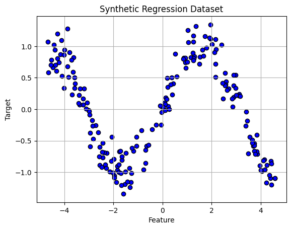
    


## Train

You are on your own for this part, try training a Regression model on the new dataset.  


```python
# TODO: Train a model

import torch
import torch.nn as nn
import torch.optim as optim
import matplotlib.pyplot as plt
from sklearn.datasets import make_s_curve

# Define the Model
class SimpleRegressor(nn.Module):
    def __init__(self):
        super(SimpleRegressor, self).__init__()

        self.model_queue = nn.Sequential(
            nn.Linear(1, 512),
            nn.BatchNorm1d(512),
            nn.ReLU(),
            nn.Linear(512, 512),
            nn.BatchNorm1d(512),
            nn.ReLU(),
            nn.Linear(512, 1)
        )

    def forward(self, x):
        out = self.model_queue(x)
        return out

# Instantiate the model and move it to GPU if available
device = torch.device('cuda' if torch.cuda.is_available() else 'cpu')
model = SimpleRegressor().to(device)
x_train = x_train.to(device)
y_train = y_train.to(device)

# Define the loss function and optimizer
criterion = nn.MSELoss()
optimizer = optim.Adam(model.parameters(), lr=0.001)

# Training Loop
num_epochs = 6000
all_predictions = []

for epoch in range(num_epochs):
    model.train()

    outputs = model(x_train)
    loss = criterion(outputs, y_train)
    optimizer.zero_grad()
    loss.backward()
    optimizer.step()

    if (epoch + 1) % 100 == 0:
        print(f'Epoch [{epoch + 1}/{num_epochs}], Loss: {loss.item():.4f}')
        model.eval()
        with torch.no_grad():
            predicted = model(x_train).cpu().numpy()
        all_predictions.append(predicted)
        model.train()

```

    Epoch [100/6000], Loss: 0.0388
    Epoch [200/6000], Loss: 0.0368
    Epoch [300/6000], Loss: 0.0353
    Epoch [400/6000], Loss: 0.0343
    Epoch [500/6000], Loss: 0.0339
    Epoch [600/6000], Loss: 0.0337
    Epoch [700/6000], Loss: 0.0334
    Epoch [800/6000], Loss: 0.0331
    Epoch [900/6000], Loss: 0.0332
    Epoch [1000/6000], Loss: 0.0334
    Epoch [1100/6000], Loss: 0.0330
    Epoch [1200/6000], Loss: 0.0325
    Epoch [1300/6000], Loss: 0.0322
    Epoch [1400/6000], Loss: 0.0320
    Epoch [1500/6000], Loss: 0.0319
    Epoch [1600/6000], Loss: 0.0325
    Epoch [1700/6000], Loss: 0.0317
    Epoch [1800/6000], Loss: 0.0317
    Epoch [1900/6000], Loss: 0.0314
    Epoch [2000/6000], Loss: 0.0316
    Epoch [2100/6000], Loss: 0.0315
    Epoch [2200/6000], Loss: 0.0311
    Epoch [2300/6000], Loss: 0.0310
    Epoch [2400/6000], Loss: 0.0312
    Epoch [2500/6000], Loss: 0.0317
    Epoch [2600/6000], Loss: 0.0314
    Epoch [2700/6000], Loss: 0.0308
    Epoch [2800/6000], Loss: 0.0306
    Epoch [2900/6000], Loss: 0.0308
    Epoch [3000/6000], Loss: 0.0309
    Epoch [3100/6000], Loss: 0.0308
    Epoch [3200/6000], Loss: 0.0306
    Epoch [3300/6000], Loss: 0.0324
    Epoch [3400/6000], Loss: 0.0303
    Epoch [3500/6000], Loss: 0.0302
    Epoch [3600/6000], Loss: 0.0305
    Epoch [3700/6000], Loss: 0.0300
    Epoch [3800/6000], Loss: 0.0299
    Epoch [3900/6000], Loss: 0.0301
    Epoch [4000/6000], Loss: 0.0300
    Epoch [4100/6000], Loss: 0.0300
    Epoch [4200/6000], Loss: 0.0306
    Epoch [4300/6000], Loss: 0.0302
    Epoch [4400/6000], Loss: 0.0298
    Epoch [4500/6000], Loss: 0.0296
    Epoch [4600/6000], Loss: 0.0303
    Epoch [4700/6000], Loss: 0.0301
    Epoch [4800/6000], Loss: 0.0304
    Epoch [4900/6000], Loss: 0.0299
    Epoch [5000/6000], Loss: 0.0293
    Epoch [5100/6000], Loss: 0.0293
    Epoch [5200/6000], Loss: 0.0293
    Epoch [5300/6000], Loss: 0.0295
    Epoch [5400/6000], Loss: 0.0307
    Epoch [5500/6000], Loss: 0.0294
    Epoch [5600/6000], Loss: 0.0296
    Epoch [5700/6000], Loss: 0.0292
    Epoch [5800/6000], Loss: 0.0292
    Epoch [5900/6000], Loss: 0.0292
    Epoch [6000/6000], Loss: 0.0290


```python
# 5. Interactive Slider Plot
def plot_predictions(epoch):
    clear_output(wait=True)
    print(f'Epoch [{epoch+1}/{num_epochs}]')
    plt.scatter(X, y, label='Original data')
    plt.scatter(X, all_predictions[epoch // 100], label=f'Fitted line at epoch {epoch}')
    plt.xlim(left=X.min(), right=X.max())  # Set the minimum and maximum x values
    plt.ylim(bottom=y.min()-0.5, top=y.max()+0.5)
    # plt.legend()
    plt.show()

epoch_slider = widgets.IntSlider(value=num_epochs-1, min=0, max=num_epochs-1, step=10, description='Epoch:')
widgets.interact(plot_predictions, epoch=epoch_slider)
```


    interactive(children=(IntSlider(value=5999, description='Epoch:', max=5999, step=10), Output()), _dom_classes=…


    <function __main__.plot_predictions(epoch)>


The result seems a bit over fitted to the noise. Think about ways to reduce this overfitting.

You can try changing the epoch slider to see when results started to overfit.

# Image Classification

## Loading Real Image Data
Now Let's learn the real deal, and work from a varied collection of .jpg files.

For this section we'll be working with a version of the Cats vs. Dogs dataset inspired by a classic <a href='https://www.kaggle.com/c/dogs-vs-cats'>Kaggle competition</a>.<br>
A quick note - do <strong>not</strong> download the dataset from Kaggle! Ours is a cleaned version of the data without any 0by0 files, etc.<br>The images are similar to ones available from the <a href='http://www.image-net.org/'>ImageNet</a> database.

We have organized the files into train and test folders, and further divided the images into CAT and DOG subfolders. In this way the file path contains the label.

### Image files directory tree
<pre>.
└── Data
    └── CATS_DOGS
        ├── test
        │   ├── CAT
        │   │   ├── 9374.jpg
        │   │   ├── 9375.jpg
        │   │   └── ... (3,126 files)
        │   └── DOG
        │       ├── 9374.jpg
        │       ├── 9375.jpg
        │       └── ... (3,125 files)       
        │           
        └── train
            ├── CAT
            │   ├── 0.jpg
            │   ├── 1.jpg
            │   └── ... (9,371 files)
            └── DOG
                ├── 0.jpg
                ├── 1.jpg
                └── ... (9,372 files)</pre>

### Perform standard imports


```python
import torch
import torch.nn as nn
import torch.nn.functional as F
from torch.utils.data import DataLoader
from torchvision import datasets, transforms

import numpy as np
import pandas as pd
import matplotlib.pyplot as plt
%matplotlib inline
```

### Examine the data
We'll us Python's built-in <a href='https://docs.python.org/3/library/os.html'>os module</a> to walk the directories collecting file names. We'll then use <a href='https://python-pillow.org/'>Pillow</a>, an extension to the Python Imaging Library (PIL), to open image files and extract image sizes. A pandas DataFrame will provide summary statistics on our data like max/min width & height from which we can choose our model parameters.


```python
import os
from PIL import Image
from IPython.display import display

# Filter harmless warnings
import warnings
warnings.filterwarnings("ignore")
```


```python
!gdown 1fuFurVV8rcrVTAFPjhQvzGLNdnTi1jWZ
```

    Failed to retrieve file url:
    
    	Too many users have viewed or downloaded this file recently. Please
    	try accessing the file again later. If the file you are trying to
    	access is particularly large or is shared with many people, it may
    	take up to 24 hours to be able to view or download the file. If you
    	still can't access a file after 24 hours, contact your domain
    	administrator.
    
    You may still be able to access the file from the browser:
    
    	https://drive.google.com/uc?id=1fuFurVV8rcrVTAFPjhQvzGLNdnTi1jWZ
    
    but Gdown can't. Please check connections and permissions.


<font color="red" size="10">
I download them manually
</font>


```python
!unzip -q CATS_DOGS.zip
```


```python
# TEST YOUR VERSION OF PILLOW
# Run this cell. If you see a picture of a cat you're all set!
with Image.open('CATS_DOGS/test/CAT/10107.jpg') as im:
    display(im)
```


    

    


### Create a list of image filenames


```python
path = 'CATS_DOGS'
img_names = []

for folder, subfolders, filenames in os.walk(path):
    for img in filenames:
        img_names.append(folder+'/'+img)

print('Images: ',len(img_names))
```

    Images:  24994


### Create a DataFrame of image sizes (width x height)
It's worth noting that <tt>Image.open()</tt> doesn't read the entire image into memory, so it's a reasonable way to get image sizes.<br>
Still, this can take awhile.

### Image Preprocessing
Any network we define requires consistent input data. That is, the incoming image files need to have the same number of channels (3 for red/green/blue), the same depth per channel (0-255), and the same height and width. This last requirement can be tricky. How do we transform an 800x450 pixel image into one that is 224x224?
* <a href='https://en.wikipedia.org/wiki/Aspect_ratio_(image)'><strong>aspect ratio</strong></a>: the ratio of width to height (16:9, 1:1, etc.) An 800x450 pixel image has an aspect ration of 16:9. We can change the aspect ratio of an image by cropping it, by stretching/squeezing it, or by some combination of the two. In both cases we lose some information contained in the original. Let's say we crop 175 pixels from the left and right sides of our 800x450 image, resulting in one that's 450x450.
* <strong>scale</strong>: Once we've attained the proper aspect ratio we may need to scale an image up or down to fit our input parameters. There are several libraries we can use to scale a 450x450 image down to 224x224 with minimal loss.
* <a href=''><strong>normalization</strong></a>: when images are converted to tensors, the [0,255] rgb channels are loaded into range [0,1]. We can then normalize them using the generally accepted values of mean=[0.485, 0.456, 0.406] and std=[0.229, 0.224, 0.225]. For the curious, these values were obtained by the PyTorch team using a random 10,000 sample of <a href='http://www.image-net.org/'>ImageNet</a> images. There's a good discussion of this <a href='https://discuss.pytorch.org/t/normalization-in-the-mnist-example/457/22'>here</a>, and the original source code can be found <a href='https://github.com/soumith/imagenet-multiGPU.torch/blob/master/donkey.lua#L154'>here</a>.

### Transformations
Before defining our Convolutional Network, let's look at a sample image and perform various transformations on it to see their effect.


```python
dog = Image.open('CATS_DOGS/train/DOG/14.jpg')
print(dog.size)
display(dog)
```

    (500, 387)


    
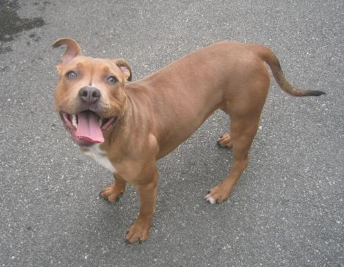
    


This is how jupyter displays the original .jpg image. Note that size is given as (width, height).<br>
Let's look at a single pixel:


```python
r, g, b = dog.getpixel((0, 0))
print(r,g,b)
```

    90 95 98


The pixel at position [0,0] (upper left) of the source image has an rgb value of (90,95,98). This corresponds to <font style="background-color:rgb(90,95,98)">this color </font><br>
Great! Now let's look at some specific transformations.
### <a href='https://pytorch.org/docs/stable/torchvision/transforms.html#torchvision.transforms.ToTensor'><tt>transforms.ToTensor()</tt></a>
Converts a PIL Image or numpy.ndarray (HxWxC) in the range [0, 255] to a <tt>torch.FloatTensor</tt> of shape (CxHxW) in the range [0.0, 1.0]


```python
transform = transforms.Compose([
    transforms.ToTensor()
])
im = transform(dog)
print(im.shape)
plt.imshow(np.transpose(im.numpy(), (1, 2, 0)));
```

    torch.Size([3, 387, 500])


    

    


This is the same image converted to a tensor and displayed using matplotlib. Note that the torch dimensions follow [channel, height, width]<br><br>
PyTorch automatically loads the [0,255] pixel channels to [0,1]:<br><br>
$\frac{90}{255}=0.3529\quad\frac{95}{255}=0.3725\quad\frac{98}{255}=0.3843$


```python
im[0,0,0]
```


    tensor(0.3529)


### <a href='https://pytorch.org/docs/stable/torchvision/transforms.html#torchvision.transforms.Resize'><tt>transforms.Resize(<em>size</em>)</tt></a>
If size is a sequence like (h, w), the output size will be matched to this. If size is an integer, the smaller edge of the image will be matched to this number.<br>i.e, if height > width, then the image will be rescaled to (size * height / width, size)


```python
transform = transforms.Compose([

    transforms.ToTensor(),
    transforms.Resize((224,224)),
])
im = transform(dog)
print(im.shape)
plt.imshow(np.transpose(im.numpy(), (1, 2, 0)));
```

    torch.Size([3, 224, 224])


    

    


This resized the shortest side, and scaled the other. Let's try this on a small image.


```python
small_dog = Image.open('CATS_DOGS/train/DOG/11.jpg')
print(small_dog.size)
display(small_dog)
```

    (135, 102)


    
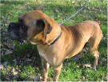
    


```python
im = transform(small_dog)
print(im.shape)
plt.imshow(np.transpose(im.numpy(), (1, 2, 0)));
```

    torch.Size([3, 224, 224])


    
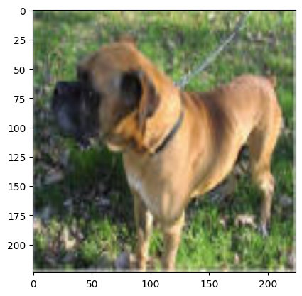
    


### <a href='https://pytorch.org/docs/stable/torchvision/transforms.html#torchvision.transforms.CenterCrop'><tt>transforms.CenterCrop(<em>size</em>)</tt></a>
If size is an integer instead of sequence like (h, w), a square crop of (size, size) is made.


```python
transform = transforms.Compose([
    transforms.CenterCrop(224),
    transforms.ToTensor()
])
im = transform(dog) # this crops the original image
print(im.shape)
plt.imshow(np.transpose(im.numpy(), (1, 2, 0)));
```

    torch.Size([3, 224, 224])


    
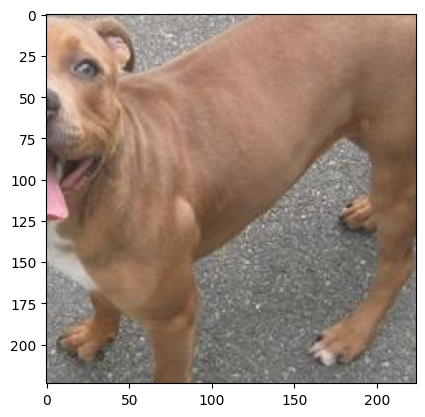
    


It may be better to resize the image first, then crop:


```python
transform = transforms.Compose([
    transforms.Resize(224),
    transforms.CenterCrop(224),
    transforms.ToTensor()
])
im = transform(dog)
print(im.shape)
plt.imshow(np.transpose(im.numpy(), (1, 2, 0)));
```

    torch.Size([3, 224, 224])


    
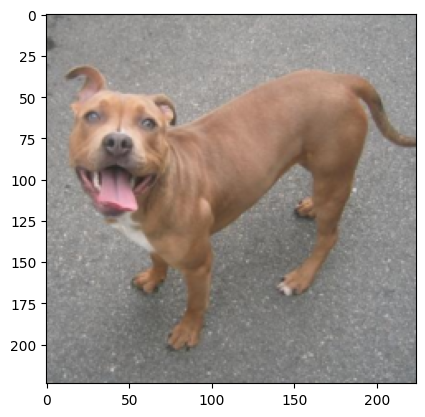
    


### Other affine transformations
An <a href='https://en.wikipedia.org/wiki/Affine_transformation'><em>affine</em></a> transformation is one that preserves points and straight lines. Examples include rotation, reflection, and scaling. For instance, we can double the effective size of our training set simply by flipping the images.
### <a href='https://pytorch.org/docs/stable/torchvision/transforms.html#torchvision.transforms.RandomHorizontalFlip'><tt>transforms.RandomHorizontalFlip(<em>p=0.5</em>)</tt></a>
Horizontally flip the given PIL image randomly with a given probability.


```python
transform = transforms.Compose([
    transforms.RandomHorizontalFlip(p=1),  # normally we'd set p=0.5
    transforms.ToTensor()
])
im = transform(dog)
print(im.shape)
plt.imshow(np.transpose(im.numpy(), (1, 2, 0)));
```

    torch.Size([3, 387, 500])


    
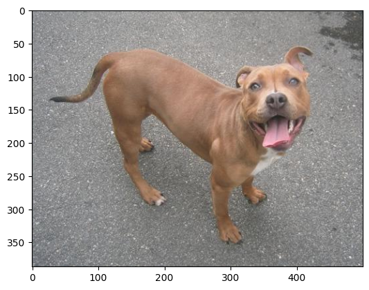
    


### <a href='https://pytorch.org/docs/stable/torchvision/transforms.html#torchvision.transforms.RandomRotation'><tt>transforms.RandomRotation(<em>degrees</em>)</tt></a>
If degrees is a number instead of sequence like (min, max), the range of degrees will be (-degrees, +degrees).<br>
Run the cell below several times to see a sample of rotations.


```python
transform = transforms.Compose([
    transforms.RandomRotation(30),  # rotate randomly between +/- 30 degrees
    transforms.ToTensor()
])
im = transform(dog)
print(im.shape)
plt.imshow(np.transpose(im.numpy(), (1, 2, 0)));
```

    torch.Size([3, 387, 500])


    
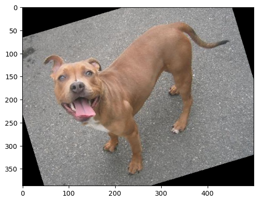
    


### Scaling is done using <a href='https://pytorch.org/docs/stable/torchvision/transforms.html#torchvision.transforms.Resize'><tt>transforms.Resize(<em>size</em>)</tt></a>


```python
transform = transforms.Compose([
    transforms.Resize((224,224)),  # be sure to pass in a list or a tuple
    transforms.ToTensor()
])
im = transform(dog)
print(im.shape)
plt.imshow(np.transpose(im.numpy(), (1, 2, 0)));
```

    torch.Size([3, 224, 224])


    
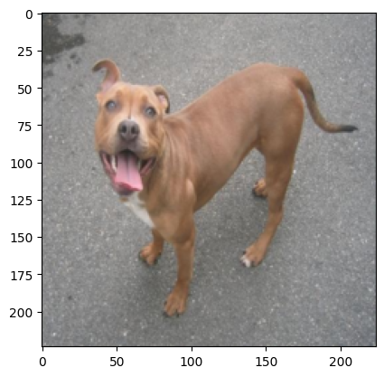
    


### Let's put it all together


```python
transform = transforms.Compose([
    transforms.RandomHorizontalFlip(p=1),  # normally we'd set p=0.5
    transforms.RandomRotation(30),
    transforms.Resize(224),
    transforms.CenterCrop(224),
    transforms.ToTensor()
])
im = transform(dog)
print(im.shape)
plt.imshow(np.transpose(im.numpy(), (1, 2, 0)));
```

    torch.Size([3, 224, 224])


    
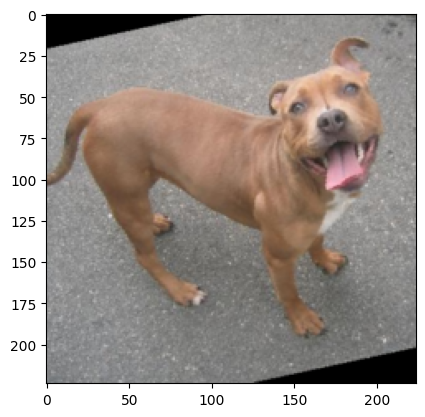
    


___
### Normalization
Once the image has been loaded into a tensor, we can perform normalization on it. This serves to make convergence happen quicker during training. The values are somewhat arbitrary - you can use a mean of 0.5 and a standard deviation of 0.5 to convert a range of [0,1] to [-1,1], for example.<br>However, <a href='https://discuss.pytorch.org/t/normalization-in-the-mnist-example/457/22'>research has shown</a> that mean=[0.485, 0.456, 0.406] and std=[0.229, 0.224, 0.225] work well in practice.

`transforms.Normalize(mean, std)`:
Given mean: (M1,...,Mn) and std: (S1,..,Sn) for n channels, this transform will normalize each channel of the input tensor
### $\quad\textrm {input[channel]} = \frac{\textrm{input[channel] - mean[channel]}}{\textrm {std[channel]}}$


```python
transform = transforms.Compose([
    transforms.ToTensor(),
    transforms.Normalize([0.485, 0.456, 0.406],
                         [0.229, 0.224, 0.225])
])
transform = transforms.Compose([
    transforms.ToTensor(),
    transforms.Normalize([0.5, 0.5, 0.5],
                         [0.5, 0.5, 0.5])
])
im = transform(dog)
print(im.shape)
plt.imshow(np.transpose(im.numpy(), (1, 2, 0)));
```

    Clipping input data to the valid range for imshow with RGB data ([0..1] for floats or [0..255] for integers).


    torch.Size([3, 387, 500])


    
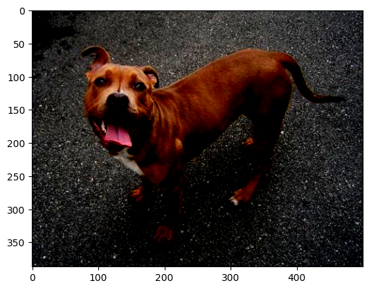
    


Recall that before normalization, the upper-leftmost tensor had pixel values of <tt>[0.3529, 0.3725, 0.3843]</tt>.<br>
With normalization we subtract the channel mean from the input channel, then divide by the channel std.<br><br>
$\frac{(0.3529-0.485)}{0.229}=-0.5767\quad\frac{(0.3725-0.456)}{0.224}=-0.3725\quad\frac{(0.3843-0.406)}{0.225}=-0.0964$<br>


```python
(im/2+0.5)[0,0,0]
```


    tensor(0.3529)


```python
plt.imshow(np.transpose((im/2+0.5).numpy(), (1, 2, 0)));
```


    
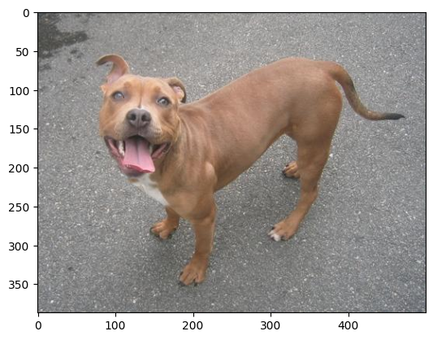
    


```python
# After normalization:
im[:,0,0]
```


    tensor([-0.2941, -0.2549, -0.2314])


When displayed, matplotlib clipped this particular pixel up to [0,0,0] so it appears black on the screen. However, the appearance isn't important; the goal of normalization is improved mathematical performance.

### Optional: De-normalize the images
To see the image back in its true colors, we can apply an inverse-transform to the tensor being displayed.


```python
inv_normalize = transforms.Normalize(
    mean=[-0.485/0.229, -0.456/0.224, -0.406/0.225],
    std=[1/0.229, 1/0.224, 1/0.225]
)
im_inv = inv_normalize(im)
plt.figure(figsize=(12,4))
plt.imshow(np.transpose(im_inv.numpy(), (1, 2, 0)));
```


    
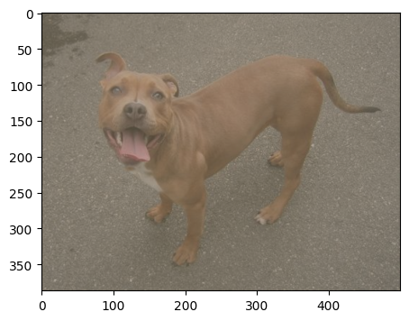
    


Note that the original tensor was not modified:


```python
plt.figure(figsize=(12,4))
plt.imshow(np.transpose(im.numpy(), (1, 2, 0)));
```

    Clipping input data to the valid range for imshow with RGB data ([0..1] for floats or [0..255] for integers).


    
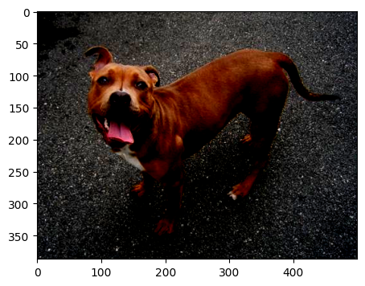
    


Custom transform
https://pytorch.org/tutorials/beginner/data_loading_tutorial.html


```python
class Rescale(object):
    def __init__(self, output_size):
        assert isinstance(output_size, (int, tuple))
        self.output_size = output_size

    def __call__(self, sample):
        image = sample
        img=sample.resize((self.output_size,self.output_size))


        return img

```


```python
rescale_transform=Rescale(128)
im_new=rescale_transform(dog)
im_new
```


    
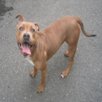
    


 Now let's perform CNN on real images!

## CNN on Custom Images
For this exercise we're using a collection of Cats and Dogs images inspired by the classic <a href='https://www.kaggle.com/c/dogs-vs-cats'>Kaggle competition</a>.

In the last section we downloaded the files, looked at the directory structure, examined the images, and performed a variety of transforms in preparation for training.

In this section we'll define our model, then feed images through a training and validation sequence using DataLoader.


### Perform standard imports


```python
import torch
import torch.nn as nn
import torch.nn.functional as F
from torch.utils.data import DataLoader
from torchvision import datasets, transforms, models # add models to the list
from torchvision.utils import make_grid
import os
from torch.utils.data import Dataset
import numpy as np
import pandas as pd
import matplotlib.pyplot as plt
%matplotlib inline
from PIL import Image
# ignore harmless warnings
import warnings
warnings.filterwarnings("ignore")
DEVICE = 'cuda' if torch.cuda.is_available() else 'cpu'
```

### Define transforms
In the previous section we looked at a variety of transforms available for data augmentation (rotate, flip, etc.) and normalization.<br>
Here we'll combine the ones we want, including the <a href='https://discuss.pytorch.org/t/normalization-in-the-mnist-example/457/22'>recommended normalization parameters</a> for mean and std per channel.


```python
train_transform = transforms.Compose([
        transforms.RandomRotation(10),      # rotate +/- 10 degrees
        transforms.RandomHorizontalFlip(),  # reverse 50% of images
        transforms.Resize(224),             # resize shortest side to 224 pixels
        transforms.CenterCrop(224),         # crop longest side to 224 pixels at center
        transforms.ToTensor(),
        transforms.Normalize([0.485, 0.456, 0.406],
                             [0.229, 0.224, 0.225])
    ])

test_transform = transforms.Compose([
        transforms.Resize(224),
        transforms.CenterCrop(224),
        transforms.ToTensor(),
        transforms.Normalize([0.485, 0.456, 0.406],
                             [0.229, 0.224, 0.225])
    ])
```

### Prepare train and test sets, loaders
We're going to take advantage of a built-in torchvision dataset tool called <a href='https://pytorch.org/docs/stable/torchvision/datasets.html#imagefolder'><tt><strong>ImageFolder</strong></tt></a>.

Here we are gonna take advantage of torch dataset. It is a method use to make dataset easier to handle.

This class takes `root` as the path to the dataset location. It will also take `transform` and `target_transform` as to apply any transformation neccary to the images.

You can read the code under `__init__` to understant the flow of our dataset intialization.

After and instance of `CustomDataset` is created for our dataset. We have an object which is iteratble and the data in it can be accessed by using a for loop on it.


```python
class CustomDataset(Dataset):
    def __init__(self, root, transform=None, target_transform=None):
        # Initializing Captcha Dataset class
        super(CustomDataset, self).__init__()
        self.root=root
        # Listing all files in the provided root directory
        self.cat_files = sorted(os.listdir(root+"/CAT"))
        self.dog_files = sorted(os.listdir(root+"/DOG"))
        # Initializing lists to store images and their respective labels
        self.images = []
        self.labels = []
        self.transform=transform
        self.target_transform=target_transform

        # Iterating through each file in the root directory
        for img in self.cat_files:
            # Checking if the file is an image file
            if self.is_image_file(img):
                label = 0
                # Storing image path and label
                self.images.append(os.path.join(self.root,"CAT", img))
                self.labels.append(label)
        for img in self.dog_files:
            # Checking if the file is an image file
            if self.is_image_file(img):
                label = 1
                # Storing image path and label
                self.images.append(os.path.join(self.root,"DOG", img))
                self.labels.append(label)

    def __len__(self):
        # Returning the total number of images
        return len(self.labels)

    def __getitem__(self, idx:int):
        # Retrieving image and target label based on index
        img, target = self.images[idx], self.labels[idx]

        # Checking if the index is a slice (multiple items requested)
        if isinstance(idx, slice):
            tmp = []
            # Iterating through each image in the slice
            for item in img:
                # Applying transformations if specified
                if self.transform is not None:
                    tmp.append(self.transform(self.read_image(item)))
                else:
                    tmp.append(self.read_image(item))
            img = tmp
        else:
            # Applying transformations if specified
            if self.transform is not None:
                img = self.transform(self.read_image(img))
            else:
                img = self.read_image(img)

        # Applying target transformations if specified

        # Returning image and target label
        return img, target

    # Method to read image from file path
    def read_image(self, path):
        img = Image.open(path)
        # Converting image to RGB format
        return img.convert('RGB')

    # Method to check if a file is an image file
    def is_image_file(self, filename):
        # Checking if filename ends with any of the specified image extensions
        return any(filename.endswith(extension) for extension in [".jpg", ".jpeg", ".png"])
```

Now Comes your part. Define the dataset. We don't need a `target_transform` at this time. You should be aware of the location of the dataset at this point.


```python
# train_data= # TODO
# test_data=# TODO
train_data = CustomDataset(root='CATS_DOGS/train', transform=train_transform)
test_data = CustomDataset(root='CATS_DOGS/test', transform=test_transform)

train_data[0]
```


    (tensor([[[ 2.1804,  2.1804,  2.1804,  ..., -2.1179, -2.1179, -2.1179],
              [ 2.1975,  2.1975,  2.1975,  ..., -2.1179, -2.1179, -2.1179],
              [ 2.2147,  2.2147,  2.2147,  ..., -2.1179, -2.1179, -2.1179],
              ...,
              [-2.1179, -2.1179, -2.1179,  ...,  0.0741,  0.2111,  0.3481],
              [-2.1179, -2.1179, -2.1179,  ...,  0.1254,  0.2796,  0.3823],
              [-2.1179, -2.1179, -2.1179,  ...,  0.1597,  0.2967,  0.4166]],
     
             [[ 2.0259,  2.0084,  2.0084,  ..., -2.0357, -2.0357, -2.0357],
              [ 2.0434,  2.0259,  2.0259,  ..., -2.0357, -2.0357, -2.0357],
              [ 2.0434,  2.0434,  2.0434,  ..., -2.0357, -2.0357, -2.0357],
              ...,
              [-2.0357, -2.0357, -2.0357,  ..., -0.3025, -0.1800, -0.0574],
              [-2.0357, -2.0357, -2.0357,  ..., -0.2500, -0.1099, -0.0049],
              [-2.0357, -2.0357, -2.0357,  ..., -0.2150, -0.0924,  0.0301]],
     
             [[ 1.1062,  1.1237,  1.1237,  ..., -1.8044, -1.8044, -1.8044],
              [ 1.1237,  1.1411,  1.1411,  ..., -1.8044, -1.8044, -1.8044],
              [ 1.1585,  1.1585,  1.1759,  ..., -1.8044, -1.8044, -1.8044],
              ...,
              [-1.8044, -1.8044, -1.8044,  ..., -1.2293, -1.1073, -1.0201],
              [-1.8044, -1.8044, -1.8044,  ..., -1.1770, -1.0724, -1.0027],
              [-1.8044, -1.8044, -1.8044,  ..., -1.1421, -1.0724, -0.9678]]]),
     0)


```python
root = 'CATS_DOGS'

train_data = datasets.ImageFolder(os.path.join(root, 'train'), transform=train_transform)
test_data = datasets.ImageFolder(os.path.join(root, 'test'), transform=test_transform)
```

Now we will create a dataloader from our dataset. This mainly because dataloaders are desgin to handle loading data as fast a possible. You can also provid


```python
torch.manual_seed(42)
train_loader = DataLoader(train_data, batch_size=10, shuffle=True)
test_loader = DataLoader(test_data, batch_size=10, shuffle=False)

class_names=["CAT","DOG"]
print(f'Training images available: {len(train_data)}')
print(f'Testing images available:  {len(test_data)}')
```

    Training images available: 18743
    Testing images available:  6251


```python
b=next(iter(train_loader))
```

DATALOADER:https://pytorch.org/docs/stable/data.html

### Display a batch of images
To verify that the training loader selects cat and dog images at random, let's show a batch of loaded images.<br>
Recall that imshow clips pixel values <0, so the resulting display lacks contrast. We'll apply a quick inverse transform to the input tensor so that images show their "true" colors.


```python
# Grab the first batch of 10 images
for images,labels in train_loader:
    break

# Print the labels
print('Label:', labels.numpy())
print('Class:', *np.array([class_names[i] for i in labels]))

im = make_grid(images, nrow=5)  # the default nrow is 8

# Inverse normalize the images
inv_normalize = transforms.Normalize(
    mean=[-0.485/0.229, -0.456/0.224, -0.406/0.225],
    std=[1/0.229, 1/0.224, 1/0.225]
)
im_inv = inv_normalize(im)

# Print the images
plt.figure(figsize=(12,4))
plt.imshow(np.transpose(im_inv.numpy(), (1, 2, 0)));
```

    Label: [1 0 0 1 0 1 1 0 0 0]
    Class: DOG CAT CAT DOG CAT DOG DOG CAT CAT CAT


    
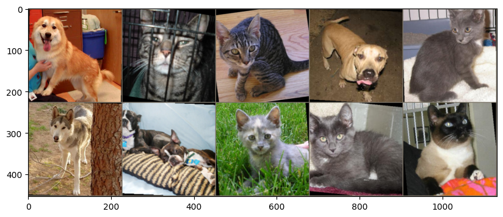
    


### Define the model
Now you are on your own. Design a model that suits your need.
You can also try resdual models that take is done by applying CNN block that don't effect the dimmension of the data and then adding the input to the output.
To design the model four type of Neural Networks function:`nn.Conv2d`,`nn.Linear`,`F.max_pool2d`, and `F.relu`.

Tip: The output of the model should have a dimmension of 2.


```python
class ConvolutionalNetwork(nn.Module):
    def __init__(self):
        super().__init__()
        # TODO: Desing the network

        self.conv1 = nn.Conv2d(in_channels=3, out_channels=6, kernel_size=3, stride=1)
        self.conv2 = nn.Conv2d(in_channels=6, out_channels=16, kernel_size=3, stride=1)
        self.fc1 = nn.Linear(16 * 54 * 54, 120) # Assuming input images are 224x224
        self.fc2 = nn.Linear(120, 84)
        self.fc3 = nn.Linear(84, 2)

    def forward(self, X):
        # TODO: Use the network
        X = F.relu(F.max_pool2d(self.conv1(X), 2))
        X = F.relu(F.max_pool2d(self.conv2(X), 2))
        X = X.view(X.size(0), -1)  # Flatten the tensor
        X = F.relu(self.fc1(X))
        X = F.relu(self.fc2(X))
        X = self.fc3(X)

        return F.log_softmax(X, dim=1)
```


```python
test_model=ConvolutionalNetwork()
sample=torch.randn(10,3,224,224)
res=test_model(sample)
res.sum().backward()
```

<div class="alert alert-info"><strong>Why <tt>(54x54x16)</tt>?</strong><br>
With 224 pixels per side, the kernels and pooling layers result in $\;(((224-2)/2)-2)/2 = 54.5\;$ which rounds down to 54 pixels per side.</div>

### Instantiate the model, define loss and optimization functions
We're going to call our model "CNNmodel" to differentiate it from an "AlexNetmodel" we'll use later.


```python
torch.manual_seed(101)
CNNmodel = ConvolutionalNetwork().to(DEVICE)
criterion = nn.CrossEntropyLoss()
optimizer = torch.optim.Adam(CNNmodel.parameters(), lr=0.001)
CNNmodel
```


    ConvolutionalNetwork(
      (conv1): Conv2d(3, 6, kernel_size=(3, 3), stride=(1, 1))
      (conv2): Conv2d(6, 16, kernel_size=(3, 3), stride=(1, 1))
      (fc1): Linear(in_features=46656, out_features=120, bias=True)
      (fc2): Linear(in_features=120, out_features=84, bias=True)
      (fc3): Linear(in_features=84, out_features=2, bias=True)
    )


### Looking at the trainable parameters


```python
def count_parameters(model):
    params = [p.numel() for p in model.parameters() if p.requires_grad]
    for item in params:
        print(f'{item:>8}')
    print(f'________\n{sum(params):>8}')
```


```python
count_parameters(CNNmodel)
```

         162
           6
         864
          16
     5598720
         120
       10080
          84
         168
           2
    ________
     5610222


### Train the model
In the interests of time, we'll limit the number of training batches to 800, and the number of testing batches to 300. We'll train the model on 8000 of 18743 available images, and test it on 3000 out of 6251 images.


```python
import time
start_time = time.time()
from tqdm import tqdm
epochs = 3
train_loader = DataLoader(train_data, batch_size=10, shuffle=True)
test_loader = DataLoader(test_data, batch_size=10, shuffle=False)

max_trn_batch = 100
max_tst_batch = 300

train_losses = []
test_losses = []
train_correct = []
test_correct = []

for i in range(epochs):
    trn_corr = 0
    tst_corr = 0

    # Run the training batches
    for b, (X_train, y_train) in enumerate(tqdm(train_loader)):
        X_train=X_train.to(DEVICE)
        y_train=y_train.to(DEVICE)
        # Limit the number of batches
        if b == max_trn_batch:
            break
        b+=1

        # Apply the model
        # TODO: Get predictions of the model and calculate the loss
        y_pred = CNNmodel(X_train)
        loss = criterion(y_pred, y_train)

        # Tally the number of correct predictions
        predicted = torch.max(y_pred.data, 1)[1]
        batch_corr = (predicted == y_train).sum()
        trn_corr += batch_corr

        # TODO: Update parameters and zero out the optimizer
        optimizer.zero_grad()
        loss.backward()
        optimizer.step()

        # Print interim results
        if b%200 == 0:
            print(f'epoch: {i:2}  batch: {b:4} [{10*b:6}/8000]  loss: {loss.item():10.8f}  \
accuracy: {trn_corr.item()*100/(10*b):7.3f}%')

    train_losses.append(loss.item())
    train_correct.append(trn_corr.item())

    # Run the testing batches
    with torch.no_grad():
        for b, (X_test, y_test) in enumerate(test_loader):
            # Limit the number of batches
            X_test=X_test.to(DEVICE)
            y_test=y_test.to(DEVICE)
            if b == max_tst_batch:
                break

            # Apply the model
            y_val = CNNmodel(X_test)

            # Tally the number of correct predictions
            predicted = torch.max(y_val.data, 1)[1]
            tst_corr += (predicted == y_test).sum()

    loss = criterion(y_val, y_test)
    test_losses.append(loss.item())
    test_correct.append(tst_corr.item())

print(f'\nDuration: {time.time() - start_time:.0f} seconds') # print the time elapsed
```

      5%|▌         | 100/1875 [00:06<01:57, 15.12it/s]
      5%|▌         | 100/1875 [00:06<02:02, 14.44it/s]
      5%|▌         | 100/1875 [00:06<01:59, 14.80it/s]


    
    Duration: 47 seconds


### Save the trained model


```python
torch.save(CNNmodel.state_dict(), 'CustomImageCNNModel.pt')
```

### Evaluate model performance


```python
plt.plot(train_losses, label='training loss')
plt.plot(test_losses, label='validation loss')
plt.title('Loss at the end of each epoch')
plt.legend();
```


    
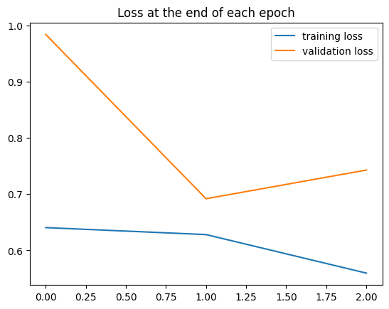
    


```python
plt.plot([t/80 for t in train_correct], label='training accuracy')
plt.plot([t/30 for t in test_correct], label='validation accuracy')
plt.title('Accuracy at the end of each epoch')
plt.legend();
```


    
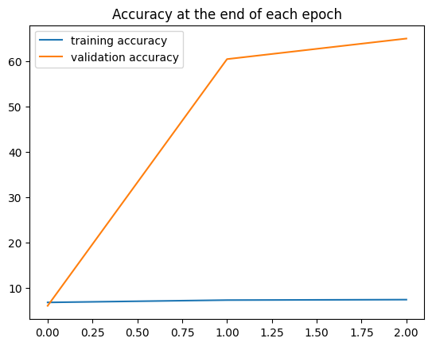
    


```python
print(test_correct)
print(f'Test accuracy: {test_correct[-1]*100/3000:.3f}%')
```

    [180, 1812, 1948]
    Test accuracy: 64.933%


### Download a pretrained model
Torchvision has a number of proven models available through <a href='https://pytorch.org/docs/stable/torchvision/models.html#classification'><tt><strong>torchvision.models</strong></tt></a>:
<ul>
<li><a href="https://arxiv.org/abs/1404.5997">AlexNet</a></li>
<li><a href="https://arxiv.org/abs/1409.1556">VGG</a></li>
<li><a href="https://arxiv.org/abs/1512.03385">ResNet</a></li>
<li><a href="https://arxiv.org/abs/1602.07360">SqueezeNet</a></li>
<li><a href="https://arxiv.org/abs/1608.06993">DenseNet</a></li>
<li><a href="https://arxiv.org/abs/1512.00567">Inception</a></li>
<li><a href="https://arxiv.org/abs/1409.4842">GoogLeNet</a></li>
<li><a href="https://arxiv.org/abs/1807.11164">ShuffleNet</a></li>
<li><a href="https://arxiv.org/abs/1801.04381">MobileNet</a></li>
<li><a href="https://arxiv.org/abs/1611.05431">ResNeXt</a></li>
</ul>
These have all been trained on the <a href='http://www.image-net.org/'>ImageNet</a> database of images. Our only task is to reduce the output of the fully connected layers from (typically) 1000 categories to just 2.

To access the models, you can construct a model with random weights by calling its constructor:<br>
<pre>resnet18 = models.resnet18()</pre>
You can also obtain a pre-trained model by passing pretrained=True:<br>
<pre>resnet18 = models.resnet18(pretrained=True)</pre>
All pre-trained models expect input images normalized in the same way, i.e. mini-batches of 3-channel RGB images of shape (3 x H x W), where H and W are expected to be at least 224. The images have to be loaded in to a range of [0, 1] and then normalized using mean = [0.485, 0.456, 0.406] and std = [0.229, 0.224, 0.225].

Feel free to investigate the different models available. Each one will be downloaded to a cache directory the first time they're accessed - from then on they'll be available locally.

For its simplicity and effectiveness, we'll use AlexNet:


```python
AlexNetmodel = models.alexnet(pretrained=True).to(DEVICE)
AlexNetmodel
```

    Downloading: "https://download.pytorch.org/models/alexnet-owt-7be5be79.pth" to /home/andre/.cache/torch/hub/checkpoints/alexnet-owt-7be5be79.pth
    100%|██████████| 233M/233M [02:09<00:00, 1.88MB/s] 


    AlexNet(
      (features): Sequential(
        (0): Conv2d(3, 64, kernel_size=(11, 11), stride=(4, 4), padding=(2, 2))
        (1): ReLU(inplace=True)
        (2): MaxPool2d(kernel_size=3, stride=2, padding=0, dilation=1, ceil_mode=False)
        (3): Conv2d(64, 192, kernel_size=(5, 5), stride=(1, 1), padding=(2, 2))
        (4): ReLU(inplace=True)
        (5): MaxPool2d(kernel_size=3, stride=2, padding=0, dilation=1, ceil_mode=False)
        (6): Conv2d(192, 384, kernel_size=(3, 3), stride=(1, 1), padding=(1, 1))
        (7): ReLU(inplace=True)
        (8): Conv2d(384, 256, kernel_size=(3, 3), stride=(1, 1), padding=(1, 1))
        (9): ReLU(inplace=True)
        (10): Conv2d(256, 256, kernel_size=(3, 3), stride=(1, 1), padding=(1, 1))
        (11): ReLU(inplace=True)
        (12): MaxPool2d(kernel_size=3, stride=2, padding=0, dilation=1, ceil_mode=False)
      )
      (avgpool): AdaptiveAvgPool2d(output_size=(6, 6))
      (classifier): Sequential(
        (0): Dropout(p=0.5, inplace=False)
        (1): Linear(in_features=9216, out_features=4096, bias=True)
        (2): ReLU(inplace=True)
        (3): Dropout(p=0.5, inplace=False)
        (4): Linear(in_features=4096, out_features=4096, bias=True)
        (5): ReLU(inplace=True)
        (6): Linear(in_features=4096, out_features=1000, bias=True)
      )
    )


<div class="alert alert-info">This model uses <a href='https://pytorch.org/docs/master/nn.html#torch.nn.AdaptiveAvgPool2d'><tt><strong>torch.nn.AdaptiveAvgPool2d(<em>output_size</em>)</strong></tt></a> to convert the large matrix coming out of the convolutional layers to a (6x6)x256 matrix being fed into the fully connected layers.</div>

### Freeze feature parameters
We want to freeze the pre-trained weights & biases. We set <tt>.requires_grad</tt> to False so we don't backprop through them.


```python
for param in AlexNetmodel.parameters():
    param.requires_grad = False
```

### Modify the classifier
Next we need to modify the fully connected layers to produce a binary output. The section is labeled "classifier" in the AlexNet model.<br>
Note that when we assign new layers, their parameters default to <tt>.requires_grad=True</tt>.


```python
torch.manual_seed(42)
AlexNetmodel.classifier = nn.Sequential(nn.Linear(9216, 1024),
                                 nn.ReLU(),
                                 nn.Dropout(0.4),
                                 nn.Linear(1024, 2),
                                 nn.LogSoftmax(dim=1)).to(DEVICE)
AlexNetmodel
```


    AlexNet(
      (features): Sequential(
        (0): Conv2d(3, 64, kernel_size=(11, 11), stride=(4, 4), padding=(2, 2))
        (1): ReLU(inplace=True)
        (2): MaxPool2d(kernel_size=3, stride=2, padding=0, dilation=1, ceil_mode=False)
        (3): Conv2d(64, 192, kernel_size=(5, 5), stride=(1, 1), padding=(2, 2))
        (4): ReLU(inplace=True)
        (5): MaxPool2d(kernel_size=3, stride=2, padding=0, dilation=1, ceil_mode=False)
        (6): Conv2d(192, 384, kernel_size=(3, 3), stride=(1, 1), padding=(1, 1))
        (7): ReLU(inplace=True)
        (8): Conv2d(384, 256, kernel_size=(3, 3), stride=(1, 1), padding=(1, 1))
        (9): ReLU(inplace=True)
        (10): Conv2d(256, 256, kernel_size=(3, 3), stride=(1, 1), padding=(1, 1))
        (11): ReLU(inplace=True)
        (12): MaxPool2d(kernel_size=3, stride=2, padding=0, dilation=1, ceil_mode=False)
      )
      (avgpool): AdaptiveAvgPool2d(output_size=(6, 6))
      (classifier): Sequential(
        (0): Linear(in_features=9216, out_features=1024, bias=True)
        (1): ReLU()
        (2): Dropout(p=0.4, inplace=False)
        (3): Linear(in_features=1024, out_features=2, bias=True)
        (4): LogSoftmax(dim=1)
      )
    )


```python
# These are the TRAINABLE parameters:
count_parameters(AlexNetmodel)
```

     9437184
        1024
        2048
           2
    ________
     9440258


### Define loss function & optimizer
We only want to optimize the classifier parameters, as the feature parameters are frozen.


```python
criterion = nn.CrossEntropyLoss()
optimizer = torch.optim.Adam(AlexNetmodel.classifier.parameters(), lr=0.001)
```

### Train the model
Remember, we're only training the fully connected layers. The convolutional layers have fixed weights and biases. For this reason, we only need to run one epoch.


```python
import time
start_time = time.time()

epochs = 1

max_trn_batch = 800
max_tst_batch = 300

train_losses = []
test_losses = []
train_correct = []
test_correct = []

for i in range(epochs):
    trn_corr = 0
    tst_corr = 0

    # Run the training batches
    for b, (X_train, y_train) in enumerate(tqdm(train_loader)):
        if b == max_trn_batch:
            break
        b+=1

        # TODO: Train the AlexNet
        X_train, y_train = X_train.to(DEVICE), y_train.to(DEVICE)
        y_pred = AlexNetmodel(X_train)
        loss = criterion(y_pred, y_train)
        optimizer.zero_grad()
        loss.backward()
        optimizer.step()
        predicted = torch.max(y_pred.data, 1)[1]
        trn_corr += (predicted == y_train).sum()

        

        # Print interim results
        if b%200 == 0:
            print(f'epoch: {i:2}  batch: {b:4} [{10*b:6}/8000]  loss: {loss.item():10.8f}  \
accuracy: {trn_corr.item()*100/(10*b):7.3f}%')

    train_losses.append(loss.item())
    train_correct.append(trn_corr.item())

    # Run the testing batches
    with torch.no_grad():
        for b, (X_test, y_test) in enumerate(tqdm(test_loader)):
            X_test, y_test=X_test.to(DEVICE),y_test.to(DEVICE)
            if b == max_tst_batch:
                break

            # Apply the model
            y_val = AlexNetmodel(X_test)

            # Tally the number of correct predictions
            predicted = torch.max(y_val.data, 1)[1]
            tst_corr += (predicted == y_test).sum()

    loss = criterion(y_val, y_test)
    test_losses.append(loss.item())
    test_correct.append(tst_corr.item())

print(f'\nDuration: {time.time() - start_time:.0f} seconds') # print the time elapsed
```

     11%|█         | 201/1875 [00:16<02:02, 13.67it/s]

    epoch:  0  batch:  200 [  2000/8000]  loss: 0.06398454  accuracy:  90.100%


     21%|██▏       | 403/1875 [00:32<01:48, 13.55it/s]

    epoch:  0  batch:  400 [  4000/8000]  loss: 0.07974257  accuracy:  91.575%


     32%|███▏      | 602/1875 [00:48<01:40, 12.63it/s]

    epoch:  0  batch:  600 [  6000/8000]  loss: 0.70020562  accuracy:  92.283%


     43%|████▎     | 800/1875 [01:00<01:20, 13.33it/s]


    epoch:  0  batch:  800 [  8000/8000]  loss: 0.00612781  accuracy:  92.675%


     48%|████▊     | 300/626 [00:10<00:11, 27.70it/s]

    
    Duration: 71 seconds


    


```python
print(test_correct)
print(f'Test accuracy: {test_correct[-1]*100/3000:.3f}%')
```

    [2910]
    Test accuracy: 97.000%


### Run a new image through the model
We can also pass a single image through the model to obtain a prediction.<br>
Pick a number from 0 to 6250, assign it to "x", and we'll use that value to select an image from the Cats and Dogs test set.


```python
x = 2019
im = inv_normalize(test_data[x][0])
plt.imshow(np.transpose(im.numpy(), (1, 2, 0)));
```


    
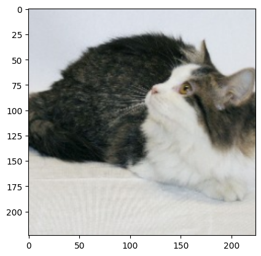
    


```python
test_data[x][0].shape
```


    torch.Size([3, 224, 224])


```python
# CNN Model Prediction:

CNNmodel.eval()
DEVICE = torch.device("cuda" if torch.cuda.is_available() else "cpu")  # code added

with torch.no_grad():
    input_tensor = test_data[x][0].unsqueeze(0).to(DEVICE)  # code added
    new_pred = CNNmodel(input_tensor).argmax()
    new_pred = new_pred.cpu()  # code added

print(f'Predicted value: {new_pred.item()} {class_names[new_pred.item()]}')

```

    Predicted value: 0 CAT


```python
# AlexNet Model Prediction:

AlexNetmodel.eval()
DEVICE = torch.device("cuda" if torch.cuda.is_available() else "cpu") # code added
with torch.no_grad():
    input_tensor = test_data[x][0].unsqueeze(0).to(DEVICE)  # code added
    new_pred = AlexNetmodel(input_tensor).argmax()
    new_pred = new_pred.cpu()  # code added

print(f'Predicted value: {new_pred.item()} {class_names[new_pred.item()]}')

```

    Predicted value: 0 CAT


<font color="green" size="10">
I change two previous codes because I use CUDA
</font>
